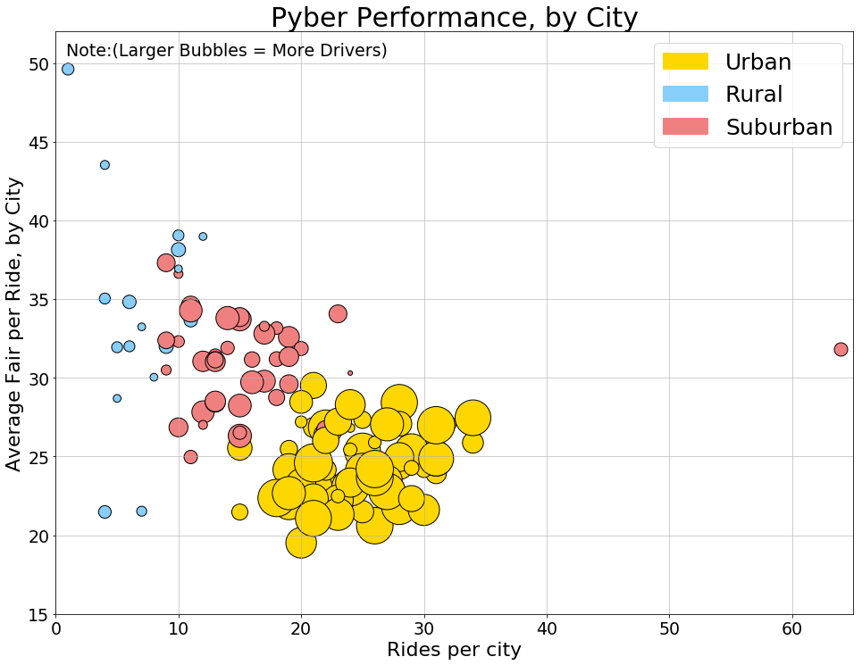
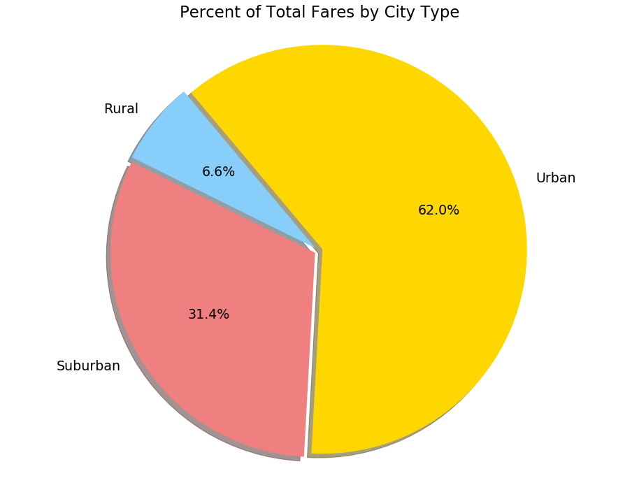
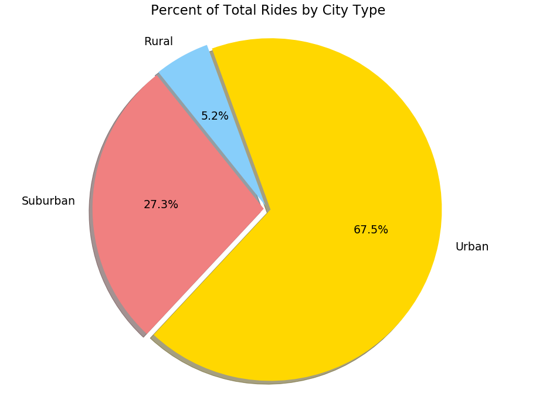
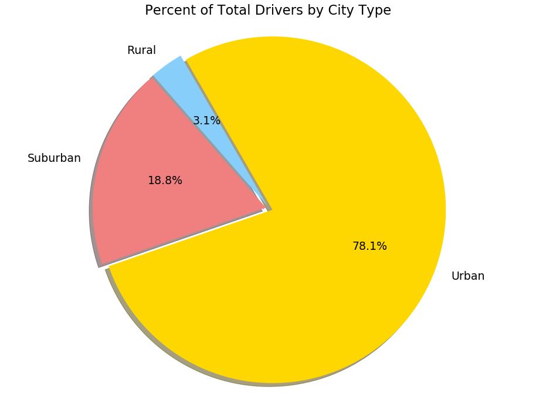

```python
# Option 1: Pyber
# Author:Robert Orr
```


```python
# Dependencies
from pprint import pprint
import pandas as pd
import os
import csv
import numpy as np
from matplotlib import pyplot as plt
from datetime import datetime
import matplotlib.patches as mpatches
#Load in data
os.chdir("/Users/rorr/PythonStuff/Resources/")
csvpath1 = os.path.join("Pyber", "city_data.csv")
csvpath2 = os.path.join("Pyber", "ride_data.csv")
city_data = pd.read_csv(csvpath1)
ride_data = pd.read_csv(csvpath2)
#Organize data
ride_data[['Date','Time']] = ride_data.date.str.split(expand=True)
ride_data['Time']= pd.to_datetime(ride_data['Time'], format='%H:%M:%S')
ride_data['Date']= pd.to_datetime(ride_data['Date'], format='%Y-%m-%d')
pyber_df = pd.merge(ride_data, city_data, on=("city"), how='outer')
```


```python
city_stats = pyber_df.groupby(['city', 'type' ], as_index=False).agg(['mean', 'count','sum'])
drop = ['ride_id']
city_stats.drop(drop, inplace=True, axis=1)
# 1. Average Fare ($) Per City
city_stats['avg_fair'] = city_stats['fare']['mean']
# 2. Total Number of Rides Per City
city_stats['rides'] = city_stats['driver_count']['count']
# 3. Total Number of Drivers Per City
city_stats['drivers'] = city_stats['driver_count']['mean']
# 4. City Type (Urban, Suburban, Rural)
city_stats['tot_fair'] = city_stats['fare']['sum']
city_stats = city_stats[['drivers', 'rides', 'avg_fair','tot_fair']]
city_stats = city_stats.reset_index(drop=False)
fat_pay = city_stats.sort_values('avg_fair', ascending=False)
big_rides = city_stats.sort_values('rides', ascending=False)
print(big_rides.head(2))
print(fat_pay.head(2))
print(city_stats.head(2))
```

                 city      type drivers rides   avg_fair tot_fair
                                                                 
    72     Port James  Suburban       9    64  31.806562  2035.62
    73  Port Johnstad     Urban      22    34  25.882941   880.02
                 city   type drivers rides avg_fair tot_fair
                                                            
    45  Manuelchester  Rural       7     1  49.6200    49.62
    48    Matthewside  Rural       4     4  43.5325   174.13
               city   type drivers rides   avg_fair tot_fair
                                                            
    0  Alvarezhaven  Urban      21    31  23.928710   741.79
    1    Alyssaberg  Urban      67    26  20.609615   535.85


```python
#Bubble Plot showcasing the relationship between four key variables:
colors = {'Urban':'gold', 'Rural':'lightskyblue', 'Suburban':'lightcoral'}
plt.rc('figure', figsize=(16, 12))
plt.rcParams.update({'font.size': 19})
plt.scatter(city_stats['rides'], city_stats['avg_fair'], marker="o", edgecolors="black",
            s=city_stats['drivers']*25, c=city_stats['type'].apply(lambda x: colors[x]))
plt.title("Pyber Performance, by City")
plt.grid(alpha=.75)
plt.xlim(0, 65)
plt.ylim(15, 52)
Urban = mpatches.Patch(color='gold', label='Urban')
Rural = mpatches.Patch(color='lightskyblue', label='Rural')
Suburban = mpatches.Patch(color='lightcoral', label='Suburban')
plt.legend(handles=[Urban,Rural,Suburban], fontsize=25)
plt.title("Pyber Performance, by City", fontsize=30)
plt.xlabel("Rides per city", fontsize=22)
plt.annotate('Note:(Larger Bubbles = More Drivers)', xy=(0, 1), xytext=(12, -12), va='top',
             xycoords='axes fraction', textcoords='offset points')
plt.ylabel("Average Fair per Ride, by City", fontsize=22)
plt.show()
```





```python
#Setup pie charts
type_stats = city_stats.copy()
type_stats = type_stats.groupby(type_stats['type'], as_index=True).sum()
type_stats = type_stats.reset_index(drop=False)
type_stats.head()
```


<div>
<style scoped>
    .dataframe tbody tr th:only-of-type {
        vertical-align: middle;
    }

    .dataframe tbody tr th {
        vertical-align: top;
    }

    .dataframe thead tr th {
        text-align: left;
    }
</style>
<table border="1" class="dataframe">
  <thead>
    <tr>
      <th></th>
      <th>type</th>
      <th>drivers</th>
      <th>rides</th>
      <th>avg_fair</th>
      <th>tot_fair</th>
    </tr>
    <tr>
      <th></th>
      <th></th>
      <th></th>
      <th></th>
      <th></th>
      <th></th>
    </tr>
  </thead>
  <tbody>
    <tr>
      <th>0</th>
      <td>Rural</td>
      <td>104</td>
      <td>125</td>
      <td>615.728572</td>
      <td>4255.09</td>
    </tr>
    <tr>
      <th>1</th>
      <td>Suburban</td>
      <td>629</td>
      <td>657</td>
      <td>1268.627391</td>
      <td>20335.69</td>
    </tr>
    <tr>
      <th>2</th>
      <td>Urban</td>
      <td>2607</td>
      <td>1625</td>
      <td>1623.863390</td>
      <td>40078.34</td>
    </tr>
  </tbody>
</table>
</div>


```python
#1. % of Total Fares by City Type
explode = {'Urban': .02, 'Suburban':.02, 'Rural': .02}
labels = {'Urban': 'Urban', 'Suburban':'Suburban', 'Rural': 'Rural'}
plt.title("Percent of Total Fares by City Type")
plt.pie(type_stats['tot_fair'], 
        explode= type_stats['type'].apply(lambda x: explode[x]),
        labels= type_stats['type'].apply(lambda x: labels[x]),
        colors= type_stats['type'].apply(lambda x: colors[x]), 
        autopct="%1.1f%%", 
        shadow=True, startangle=130)
plt.axis("equal")
plt.show()
```





```python
#2. % of Total Rides by City Type
plt.title("Percent of Total Rides by City Type")
plt.pie(type_stats['rides'], 
        explode= type_stats['type'].apply(lambda x: explode[x]),
        labels= type_stats['type'].apply(lambda x: labels[x]),
        colors= type_stats['type'].apply(lambda x: colors[x]), 
        autopct="%1.1f%%", 
        shadow=True, startangle=110)
plt.axis("equal")
plt.show()
```





```python
#3. % of Total Drivers by City Type
plt.title("Percent of Total Drivers by City Type")
plt.pie(type_stats['drivers'], 
        explode= type_stats['type'].apply(lambda x: explode[x]),
        labels= type_stats['type'].apply(lambda x: labels[x]),
        colors= type_stats['type'].apply(lambda x: colors[x]), 
        autopct="%1.1f%%", 
        shadow=True, startangle=120)
plt.axis("equal")
plt.show()
```





```python
## Conclusions ##
# 1. The vast bulk of the overall market for ridesharing is situated in the urban city-type.
# 2. Rural trips tend to have the highest variance in fair per ride, followed by suburban.  
#    Urban has the lowest variance per-ride fair.
# 3. Drivers in cities are completing the most trips, followed by suburban, and then rural.
# 4. Suburban city types have one city that is an extreme outlier in terms of rides, named "Port James".
# 
```
