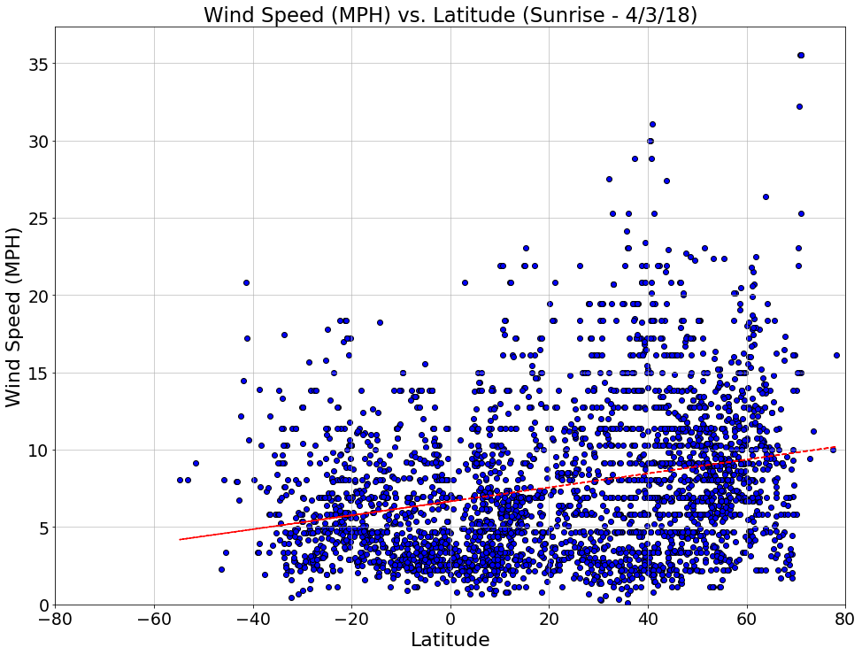

```python
# WeatherPy, by Robert Orr
# Key Takeaways
# 1. Temperature increases as one moves north the equator, 
#    but most cities are in the north so this relationship could symetric (I know it actually is).
# 2. Windspeed seems to increase as latitude increase, and, once again the bias from cities disproportionately 
#    being situated in the norther hemisphere.
# 3. There does not seem to be any discernable relationship in regarding latitude and cloudiness
# 4. Humidity appears to a non-linear relationship with latitude. It is low at the equator, but grows as you move in
#    either direction, and then declines once again when moving towards the poles.
```


```python
# Dependencies
import json
import requests
from citipy import citipy
import csv
import matplotlib.pyplot as plt
import pandas as pd
from random import uniform
import numpy as np
import os
from scipy.stats import linregress
#Key
from config import weather_key
```


```python
#Assign random lat/lng points from possible universe of possibilities
x, y = uniform(-180,180), uniform(-90, 90)
def newpoint():
    return uniform(-180,180), uniform(-90, 90)
coordinates = []
points = (newpoint() for x in range(40000))
for point in points:
    coordinates.append(point)
cities_df = pd.DataFrame(coordinates)
cities_df.columns = ['lat', 'lon']
cities_df['city'] = ''
cities_df['country_code'] = ''
cities_df['city_lat'] = ''
cities_df['city_lon'] = ''
cities_df['city_temperature'] = ''
cities_df['city_humidity'] = ''
cities_df['city_windspeed'] = ''
cities_df['city_clouds'] = ''
cities_df['city_temp_max'] = ''
cities_df['date'] = ''
cities_df['sunrise'] = ''
```


```python
# Match with cities
for (idx,row) in cities_df.iterrows():
    city = citipy.nearest_city(row["lat"],row["lon"])
    country_code = city.country_code
    name = city.city_name
    cities_df.at[idx, 'city'] = name
    cities_df.at[idx, 'country_code'] = country_code
cities_df = cities_df.drop_duplicates('city')
url = "http://api.openweathermap.org/data/2.5/weather?"
cities_df['city'] = cities_df['city'].str.title()
cities_df['country_code'] = cities_df['country_code'].str.upper()
cities_df.head()
```


<div>
<style scoped>
    .dataframe tbody tr th:only-of-type {
        vertical-align: middle;
    }

    .dataframe tbody tr th {
        vertical-align: top;
    }

    .dataframe thead th {
        text-align: right;
    }
</style>
<table border="1" class="dataframe">
  <thead>
    <tr style="text-align: right;">
      <th></th>
      <th>lat</th>
      <th>lon</th>
      <th>city</th>
      <th>country_code</th>
      <th>city_lat</th>
      <th>city_lon</th>
      <th>city_temperature</th>
      <th>city_humidity</th>
      <th>city_windspeed</th>
      <th>city_clouds</th>
      <th>city_temp_max</th>
      <th>date</th>
      <th>sunrise</th>
    </tr>
  </thead>
  <tbody>
    <tr>
      <th>0</th>
      <td>-95.940721</td>
      <td>0.439120</td>
      <td>Hermanus</td>
      <td>ZA</td>
      <td></td>
      <td></td>
      <td></td>
      <td></td>
      <td></td>
      <td></td>
      <td></td>
      <td></td>
      <td></td>
    </tr>
    <tr>
      <th>1</th>
      <td>-8.676211</td>
      <td>22.801352</td>
      <td>Mwene-Ditu</td>
      <td>CD</td>
      <td></td>
      <td></td>
      <td></td>
      <td></td>
      <td></td>
      <td></td>
      <td></td>
      <td></td>
      <td></td>
    </tr>
    <tr>
      <th>2</th>
      <td>69.471457</td>
      <td>-64.495955</td>
      <td>Pangnirtung</td>
      <td>CA</td>
      <td></td>
      <td></td>
      <td></td>
      <td></td>
      <td></td>
      <td></td>
      <td></td>
      <td></td>
      <td></td>
    </tr>
    <tr>
      <th>3</th>
      <td>-147.838324</td>
      <td>12.510842</td>
      <td>Bredasdorp</td>
      <td>ZA</td>
      <td></td>
      <td></td>
      <td></td>
      <td></td>
      <td></td>
      <td></td>
      <td></td>
      <td></td>
      <td></td>
    </tr>
    <tr>
      <th>4</th>
      <td>-6.607505</td>
      <td>-16.562434</td>
      <td>Georgetown</td>
      <td>SH</td>
      <td></td>
      <td></td>
      <td></td>
      <td></td>
      <td></td>
      <td></td>
      <td></td>
      <td></td>
      <td></td>
    </tr>
  </tbody>
</table>
</div>


```python
# Run Loops Querrying the API
# Loop: Establish Exact City Coordinates and the Time of Sunrise
counter = 0
for (idx,row) in cities_df.iterrows():
    try:
        counter += 1
        city = (row.loc['city'])
        country_code = (row.loc['country_code'])
        query_url = (url +'units=imperial'+"&appid=" + weather_key + "&q=" +city+", "+country_code)
        weather_response = requests.get(query_url)
        weather_json = weather_response.json()
        latitude_city= weather_json["coord"]["lat"]
        longitude_city= weather_json["coord"]["lon"]
        sunrise= weather_json["sys"]["sunrise"]
        cities_df.at[idx, 'sunrise']= sunrise= weather_json["sys"]["sunrise"]
        cities_df.at[idx, 'city_lat'] = latitude_city
        cities_df.at[idx, 'city_lon'] = longitude_city
        print(f"Processing Record {counter} Set 1 | {city} \n {query_url}")
    except KeyError:
        pass
#Drop NA values to speed up the second loop
cities_df = cities_df.drop_duplicates(subset=['city', 'country_code'])
cities_df['city_lat'].replace('', np.nan, inplace=True)
cities_df=cities_df.dropna()
```

    Processing Record 1 Set 1 | Hermanus 
     http://api.openweathermap.org/data/2.5/weather?units=imperial&appid=2fff46cae0837549e79ccf0582b9fce3&q=Hermanus, ZA
    Processing Record 2 Set 1 | Mwene-Ditu 
     http://api.openweathermap.org/data/2.5/weather?units=imperial&appid=2fff46cae0837549e79ccf0582b9fce3&q=Mwene-Ditu, CD
    Processing Record 3 Set 1 | Pangnirtung 
     http://api.openweathermap.org/data/2.5/weather?units=imperial&appid=2fff46cae0837549e79ccf0582b9fce3&q=Pangnirtung, CA
    Processing Record 4 Set 1 | Bredasdorp 
     http://api.openweathermap.org/data/2.5/weather?units=imperial&appid=2fff46cae0837549e79ccf0582b9fce3&q=Bredasdorp, ZA
    Processing Record 5 Set 1 | Georgetown 
     http://api.openweathermap.org/data/2.5/weather?units=imperial&appid=2fff46cae0837549e79ccf0582b9fce3&q=Georgetown, SH
    Processing Record 6 Set 1 | Qaanaaq 
     http://api.openweathermap.org/data/2.5/weather?units=imperial&appid=2fff46cae0837549e79ccf0582b9fce3&q=Qaanaaq, GL
    Processing Record 7 Set 1 | Ushuaia 
     http://api.openweathermap.org/data/2.5/weather?units=imperial&appid=2fff46cae0837549e79ccf0582b9fce3&q=Ushuaia, AR
    Processing Record 8 Set 1 | Dikson 
     http://api.openweathermap.org/data/2.5/weather?units=imperial&appid=2fff46cae0837549e79ccf0582b9fce3&q=Dikson, RU
    Processing Record 9 Set 1 | Mpongwe 
     http://api.openweathermap.org/data/2.5/weather?units=imperial&appid=2fff46cae0837549e79ccf0582b9fce3&q=Mpongwe, ZM
    Processing Record 10 Set 1 | Longyearbyen 
     http://api.openweathermap.org/data/2.5/weather?units=imperial&appid=2fff46cae0837549e79ccf0582b9fce3&q=Longyearbyen, SJ
    Processing Record 11 Set 1 | Ilulissat 
     http://api.openweathermap.org/data/2.5/weather?units=imperial&appid=2fff46cae0837549e79ccf0582b9fce3&q=Ilulissat, GL
    Processing Record 12 Set 1 | Sao Filipe 
     http://api.openweathermap.org/data/2.5/weather?units=imperial&appid=2fff46cae0837549e79ccf0582b9fce3&q=Sao Filipe, CV
    Processing Record 13 Set 1 | Pitimbu 
     http://api.openweathermap.org/data/2.5/weather?units=imperial&appid=2fff46cae0837549e79ccf0582b9fce3&q=Pitimbu, BR
    Processing Record 14 Set 1 | Port Alfred 
     http://api.openweathermap.org/data/2.5/weather?units=imperial&appid=2fff46cae0837549e79ccf0582b9fce3&q=Port Alfred, ZA
    Processing Record 15 Set 1 | Saint-Pierre 
     http://api.openweathermap.org/data/2.5/weather?units=imperial&appid=2fff46cae0837549e79ccf0582b9fce3&q=Saint-Pierre, PM
    Processing Record 16 Set 1 | Sisimiut 
     http://api.openweathermap.org/data/2.5/weather?units=imperial&appid=2fff46cae0837549e79ccf0582b9fce3&q=Sisimiut, GL
    Processing Record 17 Set 1 | Port Elizabeth 
     http://api.openweathermap.org/data/2.5/weather?units=imperial&appid=2fff46cae0837549e79ccf0582b9fce3&q=Port Elizabeth, ZA
    Processing Record 18 Set 1 | Bedesa 
     http://api.openweathermap.org/data/2.5/weather?units=imperial&appid=2fff46cae0837549e79ccf0582b9fce3&q=Bedesa, ET
    Processing Record 19 Set 1 | Tres Arroyos 
     http://api.openweathermap.org/data/2.5/weather?units=imperial&appid=2fff46cae0837549e79ccf0582b9fce3&q=Tres Arroyos, AR
    Processing Record 20 Set 1 | Kruisfontein 
     http://api.openweathermap.org/data/2.5/weather?units=imperial&appid=2fff46cae0837549e79ccf0582b9fce3&q=Kruisfontein, ZA
    Processing Record 21 Set 1 | Jamestown 
     http://api.openweathermap.org/data/2.5/weather?units=imperial&appid=2fff46cae0837549e79ccf0582b9fce3&q=Jamestown, SH
    Processing Record 22 Set 1 | Taltal 
     http://api.openweathermap.org/data/2.5/weather?units=imperial&appid=2fff46cae0837549e79ccf0582b9fce3&q=Taltal, CL
    Processing Record 23 Set 1 | Colares 
     http://api.openweathermap.org/data/2.5/weather?units=imperial&appid=2fff46cae0837549e79ccf0582b9fce3&q=Colares, PT
    Processing Record 24 Set 1 | Upernavik 
     http://api.openweathermap.org/data/2.5/weather?units=imperial&appid=2fff46cae0837549e79ccf0582b9fce3&q=Upernavik, GL
    Processing Record 25 Set 1 | Muros 
     http://api.openweathermap.org/data/2.5/weather?units=imperial&appid=2fff46cae0837549e79ccf0582b9fce3&q=Muros, ES
    Processing Record 26 Set 1 | Mar Del Plata 
     http://api.openweathermap.org/data/2.5/weather?units=imperial&appid=2fff46cae0837549e79ccf0582b9fce3&q=Mar Del Plata, AR
    Processing Record 27 Set 1 | Siuna 
     http://api.openweathermap.org/data/2.5/weather?units=imperial&appid=2fff46cae0837549e79ccf0582b9fce3&q=Siuna, NI
    Processing Record 28 Set 1 | Quatre Cocos 
     http://api.openweathermap.org/data/2.5/weather?units=imperial&appid=2fff46cae0837549e79ccf0582b9fce3&q=Quatre Cocos, MU
    Processing Record 29 Set 1 | Kisangani 
     http://api.openweathermap.org/data/2.5/weather?units=imperial&appid=2fff46cae0837549e79ccf0582b9fce3&q=Kisangani, CD
    Processing Record 30 Set 1 | Punta Arenas 
     http://api.openweathermap.org/data/2.5/weather?units=imperial&appid=2fff46cae0837549e79ccf0582b9fce3&q=Punta Arenas, CL
    Processing Record 31 Set 1 | Taoudenni 
     http://api.openweathermap.org/data/2.5/weather?units=imperial&appid=2fff46cae0837549e79ccf0582b9fce3&q=Taoudenni, ML
    Processing Record 32 Set 1 | Albany 
     http://api.openweathermap.org/data/2.5/weather?units=imperial&appid=2fff46cae0837549e79ccf0582b9fce3&q=Albany, AU
    Processing Record 33 Set 1 | Grand Bank 
     http://api.openweathermap.org/data/2.5/weather?units=imperial&appid=2fff46cae0837549e79ccf0582b9fce3&q=Grand Bank, CA
    Processing Record 34 Set 1 | Cape Town 
     http://api.openweathermap.org/data/2.5/weather?units=imperial&appid=2fff46cae0837549e79ccf0582b9fce3&q=Cape Town, ZA
    Processing Record 35 Set 1 | Narva-Joesuu 
     http://api.openweathermap.org/data/2.5/weather?units=imperial&appid=2fff46cae0837549e79ccf0582b9fce3&q=Narva-Joesuu, EE
    Processing Record 36 Set 1 | Coquimbo 
     http://api.openweathermap.org/data/2.5/weather?units=imperial&appid=2fff46cae0837549e79ccf0582b9fce3&q=Coquimbo, CL
    Processing Record 37 Set 1 | La Tuque 
     http://api.openweathermap.org/data/2.5/weather?units=imperial&appid=2fff46cae0837549e79ccf0582b9fce3&q=La Tuque, CA
    Processing Record 38 Set 1 | Usinsk 
     http://api.openweathermap.org/data/2.5/weather?units=imperial&appid=2fff46cae0837549e79ccf0582b9fce3&q=Usinsk, RU
    Processing Record 39 Set 1 | Mahebourg 
     http://api.openweathermap.org/data/2.5/weather?units=imperial&appid=2fff46cae0837549e79ccf0582b9fce3&q=Mahebourg, MU
    Processing Record 40 Set 1 | Thompson 
     http://api.openweathermap.org/data/2.5/weather?units=imperial&appid=2fff46cae0837549e79ccf0582b9fce3&q=Thompson, CA
    Processing Record 41 Set 1 | Coihaique 
     http://api.openweathermap.org/data/2.5/weather?units=imperial&appid=2fff46cae0837549e79ccf0582b9fce3&q=Coihaique, CL
    Processing Record 42 Set 1 | Lebu 
     http://api.openweathermap.org/data/2.5/weather?units=imperial&appid=2fff46cae0837549e79ccf0582b9fce3&q=Lebu, CL
    Processing Record 43 Set 1 | Hithadhoo 
     http://api.openweathermap.org/data/2.5/weather?units=imperial&appid=2fff46cae0837549e79ccf0582b9fce3&q=Hithadhoo, MV
    Processing Record 44 Set 1 | Saldanha 
     http://api.openweathermap.org/data/2.5/weather?units=imperial&appid=2fff46cae0837549e79ccf0582b9fce3&q=Saldanha, ZA
    Processing Record 45 Set 1 | Kangaatsiaq 
     http://api.openweathermap.org/data/2.5/weather?units=imperial&appid=2fff46cae0837549e79ccf0582b9fce3&q=Kangaatsiaq, GL
    Processing Record 46 Set 1 | Virginia Beach 
     http://api.openweathermap.org/data/2.5/weather?units=imperial&appid=2fff46cae0837549e79ccf0582b9fce3&q=Virginia Beach, US
    Processing Record 47 Set 1 | Canutama 
     http://api.openweathermap.org/data/2.5/weather?units=imperial&appid=2fff46cae0837549e79ccf0582b9fce3&q=Canutama, BR
    Processing Record 48 Set 1 | Floro 
     http://api.openweathermap.org/data/2.5/weather?units=imperial&appid=2fff46cae0837549e79ccf0582b9fce3&q=Floro, NO
    Processing Record 49 Set 1 | Mecca 
     http://api.openweathermap.org/data/2.5/weather?units=imperial&appid=2fff46cae0837549e79ccf0582b9fce3&q=Mecca, SA
    Processing Record 50 Set 1 | Manaure 
     http://api.openweathermap.org/data/2.5/weather?units=imperial&appid=2fff46cae0837549e79ccf0582b9fce3&q=Manaure, CO
    Processing Record 51 Set 1 | Tasiilaq 
     http://api.openweathermap.org/data/2.5/weather?units=imperial&appid=2fff46cae0837549e79ccf0582b9fce3&q=Tasiilaq, GL
    Processing Record 52 Set 1 | Mozarlandia 
     http://api.openweathermap.org/data/2.5/weather?units=imperial&appid=2fff46cae0837549e79ccf0582b9fce3&q=Mozarlandia, BR
    Processing Record 53 Set 1 | Shentala 
     http://api.openweathermap.org/data/2.5/weather?units=imperial&appid=2fff46cae0837549e79ccf0582b9fce3&q=Shentala, RU
    Processing Record 54 Set 1 | Bambous Virieux 
     http://api.openweathermap.org/data/2.5/weather?units=imperial&appid=2fff46cae0837549e79ccf0582b9fce3&q=Bambous Virieux, MU
    Processing Record 55 Set 1 | Vila Velha 
     http://api.openweathermap.org/data/2.5/weather?units=imperial&appid=2fff46cae0837549e79ccf0582b9fce3&q=Vila Velha, BR
    Processing Record 56 Set 1 | Narsaq 
     http://api.openweathermap.org/data/2.5/weather?units=imperial&appid=2fff46cae0837549e79ccf0582b9fce3&q=Narsaq, GL
    Processing Record 57 Set 1 | Sucre 
     http://api.openweathermap.org/data/2.5/weather?units=imperial&appid=2fff46cae0837549e79ccf0582b9fce3&q=Sucre, BO
    Processing Record 58 Set 1 | Ponta Delgada 
     http://api.openweathermap.org/data/2.5/weather?units=imperial&appid=2fff46cae0837549e79ccf0582b9fce3&q=Ponta Delgada, PT
    Processing Record 59 Set 1 | Saint-Augustin 
     http://api.openweathermap.org/data/2.5/weather?units=imperial&appid=2fff46cae0837549e79ccf0582b9fce3&q=Saint-Augustin, CA
    Processing Record 60 Set 1 | Busselton 
     http://api.openweathermap.org/data/2.5/weather?units=imperial&appid=2fff46cae0837549e79ccf0582b9fce3&q=Busselton, AU
    Processing Record 61 Set 1 | Luena 
     http://api.openweathermap.org/data/2.5/weather?units=imperial&appid=2fff46cae0837549e79ccf0582b9fce3&q=Luena, AO
    Processing Record 62 Set 1 | Kroonstad 
     http://api.openweathermap.org/data/2.5/weather?units=imperial&appid=2fff46cae0837549e79ccf0582b9fce3&q=Kroonstad, ZA
    Processing Record 63 Set 1 | Caravelas 
     http://api.openweathermap.org/data/2.5/weather?units=imperial&appid=2fff46cae0837549e79ccf0582b9fce3&q=Caravelas, BR
    Processing Record 64 Set 1 | Klaksvik 
     http://api.openweathermap.org/data/2.5/weather?units=imperial&appid=2fff46cae0837549e79ccf0582b9fce3&q=Klaksvik, FO
    Processing Record 65 Set 1 | Port-Gentil 
     http://api.openweathermap.org/data/2.5/weather?units=imperial&appid=2fff46cae0837549e79ccf0582b9fce3&q=Port-Gentil, GA
    Processing Record 66 Set 1 | Bathsheba 
     http://api.openweathermap.org/data/2.5/weather?units=imperial&appid=2fff46cae0837549e79ccf0582b9fce3&q=Bathsheba, BB
    Processing Record 67 Set 1 | Ilhabela 
     http://api.openweathermap.org/data/2.5/weather?units=imperial&appid=2fff46cae0837549e79ccf0582b9fce3&q=Ilhabela, BR
    Processing Record 68 Set 1 | Walvis Bay 
     http://api.openweathermap.org/data/2.5/weather?units=imperial&appid=2fff46cae0837549e79ccf0582b9fce3&q=Walvis Bay, NA
    Processing Record 69 Set 1 | Salalah 
     http://api.openweathermap.org/data/2.5/weather?units=imperial&appid=2fff46cae0837549e79ccf0582b9fce3&q=Salalah, OM
    Processing Record 70 Set 1 | Torbay 
     http://api.openweathermap.org/data/2.5/weather?units=imperial&appid=2fff46cae0837549e79ccf0582b9fce3&q=Torbay, CA
    Processing Record 71 Set 1 | Wum 
     http://api.openweathermap.org/data/2.5/weather?units=imperial&appid=2fff46cae0837549e79ccf0582b9fce3&q=Wum, CM
    Processing Record 72 Set 1 | Araouane 
     http://api.openweathermap.org/data/2.5/weather?units=imperial&appid=2fff46cae0837549e79ccf0582b9fce3&q=Araouane, ML
    Processing Record 73 Set 1 | Sao Joao Nepomuceno 
     http://api.openweathermap.org/data/2.5/weather?units=imperial&appid=2fff46cae0837549e79ccf0582b9fce3&q=Sao Joao Nepomuceno, BR
    Processing Record 74 Set 1 | Kindia 
     http://api.openweathermap.org/data/2.5/weather?units=imperial&appid=2fff46cae0837549e79ccf0582b9fce3&q=Kindia, GN
    Processing Record 75 Set 1 | Grand-Santi 
     http://api.openweathermap.org/data/2.5/weather?units=imperial&appid=2fff46cae0837549e79ccf0582b9fce3&q=Grand-Santi, GF
    Processing Record 76 Set 1 | Nanortalik 
     http://api.openweathermap.org/data/2.5/weather?units=imperial&appid=2fff46cae0837549e79ccf0582b9fce3&q=Nanortalik, GL
    Processing Record 77 Set 1 | Praia 
     http://api.openweathermap.org/data/2.5/weather?units=imperial&appid=2fff46cae0837549e79ccf0582b9fce3&q=Praia, CV
    Processing Record 78 Set 1 | Victoria 
     http://api.openweathermap.org/data/2.5/weather?units=imperial&appid=2fff46cae0837549e79ccf0582b9fce3&q=Victoria, SC
    Processing Record 79 Set 1 | Karlstadt 
     http://api.openweathermap.org/data/2.5/weather?units=imperial&appid=2fff46cae0837549e79ccf0582b9fce3&q=Karlstadt, DE
    Processing Record 80 Set 1 | East London 
     http://api.openweathermap.org/data/2.5/weather?units=imperial&appid=2fff46cae0837549e79ccf0582b9fce3&q=East London, ZA
    Processing Record 81 Set 1 | Hit 
     http://api.openweathermap.org/data/2.5/weather?units=imperial&appid=2fff46cae0837549e79ccf0582b9fce3&q=Hit, IQ
    Processing Record 82 Set 1 | Alta Floresta 
     http://api.openweathermap.org/data/2.5/weather?units=imperial&appid=2fff46cae0837549e79ccf0582b9fce3&q=Alta Floresta, BR
    Processing Record 83 Set 1 | Taucha 
     http://api.openweathermap.org/data/2.5/weather?units=imperial&appid=2fff46cae0837549e79ccf0582b9fce3&q=Taucha, DE
    Processing Record 84 Set 1 | Santa Maria 
     http://api.openweathermap.org/data/2.5/weather?units=imperial&appid=2fff46cae0837549e79ccf0582b9fce3&q=Santa Maria, CV
    Processing Record 85 Set 1 | Puerto Ayora 
     http://api.openweathermap.org/data/2.5/weather?units=imperial&appid=2fff46cae0837549e79ccf0582b9fce3&q=Puerto Ayora, EC
    Processing Record 86 Set 1 | Kissidougou 
     http://api.openweathermap.org/data/2.5/weather?units=imperial&appid=2fff46cae0837549e79ccf0582b9fce3&q=Kissidougou, GN
    Processing Record 87 Set 1 | Tromso 
     http://api.openweathermap.org/data/2.5/weather?units=imperial&appid=2fff46cae0837549e79ccf0582b9fce3&q=Tromso, NO
    Processing Record 88 Set 1 | General Roca 
     http://api.openweathermap.org/data/2.5/weather?units=imperial&appid=2fff46cae0837549e79ccf0582b9fce3&q=General Roca, AR
    Processing Record 89 Set 1 | Jacmel 
     http://api.openweathermap.org/data/2.5/weather?units=imperial&appid=2fff46cae0837549e79ccf0582b9fce3&q=Jacmel, HT
    Processing Record 90 Set 1 | Watsa 
     http://api.openweathermap.org/data/2.5/weather?units=imperial&appid=2fff46cae0837549e79ccf0582b9fce3&q=Watsa, CD
    Processing Record 91 Set 1 | Axim 
     http://api.openweathermap.org/data/2.5/weather?units=imperial&appid=2fff46cae0837549e79ccf0582b9fce3&q=Axim, GH
    Processing Record 92 Set 1 | Mahajanga 
     http://api.openweathermap.org/data/2.5/weather?units=imperial&appid=2fff46cae0837549e79ccf0582b9fce3&q=Mahajanga, MG
    Processing Record 93 Set 1 | Saint George 
     http://api.openweathermap.org/data/2.5/weather?units=imperial&appid=2fff46cae0837549e79ccf0582b9fce3&q=Saint George, BM
    Processing Record 94 Set 1 | Carnarvon 
     http://api.openweathermap.org/data/2.5/weather?units=imperial&appid=2fff46cae0837549e79ccf0582b9fce3&q=Carnarvon, AU
    Processing Record 95 Set 1 | Ostrovnoy 
     http://api.openweathermap.org/data/2.5/weather?units=imperial&appid=2fff46cae0837549e79ccf0582b9fce3&q=Ostrovnoy, RU
    Processing Record 96 Set 1 | Los Llanos De Aridane 
     http://api.openweathermap.org/data/2.5/weather?units=imperial&appid=2fff46cae0837549e79ccf0582b9fce3&q=Los Llanos De Aridane, ES
    Processing Record 97 Set 1 | Constitucion 
     http://api.openweathermap.org/data/2.5/weather?units=imperial&appid=2fff46cae0837549e79ccf0582b9fce3&q=Constitucion, CL
    Processing Record 98 Set 1 | Souillac 
     http://api.openweathermap.org/data/2.5/weather?units=imperial&appid=2fff46cae0837549e79ccf0582b9fce3&q=Souillac, MU
    Processing Record 99 Set 1 | Clyde River 
     http://api.openweathermap.org/data/2.5/weather?units=imperial&appid=2fff46cae0837549e79ccf0582b9fce3&q=Clyde River, CA
    Processing Record 100 Set 1 | Jos 
     http://api.openweathermap.org/data/2.5/weather?units=imperial&appid=2fff46cae0837549e79ccf0582b9fce3&q=Jos, NG
    Processing Record 101 Set 1 | Touros 
     http://api.openweathermap.org/data/2.5/weather?units=imperial&appid=2fff46cae0837549e79ccf0582b9fce3&q=Touros, BR
    Processing Record 102 Set 1 | Buraydah 
     http://api.openweathermap.org/data/2.5/weather?units=imperial&appid=2fff46cae0837549e79ccf0582b9fce3&q=Buraydah, SA
    Processing Record 103 Set 1 | Saint-Philippe 
     http://api.openweathermap.org/data/2.5/weather?units=imperial&appid=2fff46cae0837549e79ccf0582b9fce3&q=Saint-Philippe, RE
    Processing Record 104 Set 1 | Norrtalje 
     http://api.openweathermap.org/data/2.5/weather?units=imperial&appid=2fff46cae0837549e79ccf0582b9fce3&q=Norrtalje, SE
    Processing Record 105 Set 1 | Morros 
     http://api.openweathermap.org/data/2.5/weather?units=imperial&appid=2fff46cae0837549e79ccf0582b9fce3&q=Morros, BR
    Processing Record 106 Set 1 | Saurimo 
     http://api.openweathermap.org/data/2.5/weather?units=imperial&appid=2fff46cae0837549e79ccf0582b9fce3&q=Saurimo, AO
    Processing Record 107 Set 1 | Sao Joao Da Barra 
     http://api.openweathermap.org/data/2.5/weather?units=imperial&appid=2fff46cae0837549e79ccf0582b9fce3&q=Sao Joao Da Barra, BR
    Processing Record 108 Set 1 | Calama 
     http://api.openweathermap.org/data/2.5/weather?units=imperial&appid=2fff46cae0837549e79ccf0582b9fce3&q=Calama, CL
    Processing Record 109 Set 1 | Cidreira 
     http://api.openweathermap.org/data/2.5/weather?units=imperial&appid=2fff46cae0837549e79ccf0582b9fce3&q=Cidreira, BR
    Processing Record 110 Set 1 | Bonavista 
     http://api.openweathermap.org/data/2.5/weather?units=imperial&appid=2fff46cae0837549e79ccf0582b9fce3&q=Bonavista, CA
    Processing Record 111 Set 1 | Tazovskiy 
     http://api.openweathermap.org/data/2.5/weather?units=imperial&appid=2fff46cae0837549e79ccf0582b9fce3&q=Tazovskiy, RU
    Processing Record 112 Set 1 | Peterhead 
     http://api.openweathermap.org/data/2.5/weather?units=imperial&appid=2fff46cae0837549e79ccf0582b9fce3&q=Peterhead, GB
    Processing Record 113 Set 1 | Sfantu Gheorghe 
     http://api.openweathermap.org/data/2.5/weather?units=imperial&appid=2fff46cae0837549e79ccf0582b9fce3&q=Sfantu Gheorghe, RO
    Processing Record 114 Set 1 | Umm Lajj 
     http://api.openweathermap.org/data/2.5/weather?units=imperial&appid=2fff46cae0837549e79ccf0582b9fce3&q=Umm Lajj, SA
    Processing Record 115 Set 1 | Sur 
     http://api.openweathermap.org/data/2.5/weather?units=imperial&appid=2fff46cae0837549e79ccf0582b9fce3&q=Sur, OM
    Processing Record 116 Set 1 | Bubaque 
     http://api.openweathermap.org/data/2.5/weather?units=imperial&appid=2fff46cae0837549e79ccf0582b9fce3&q=Bubaque, GW
    Processing Record 117 Set 1 | Cradock 
     http://api.openweathermap.org/data/2.5/weather?units=imperial&appid=2fff46cae0837549e79ccf0582b9fce3&q=Cradock, ZA
    Processing Record 118 Set 1 | Aksu 
     http://api.openweathermap.org/data/2.5/weather?units=imperial&appid=2fff46cae0837549e79ccf0582b9fce3&q=Aksu, KZ
    Processing Record 119 Set 1 | Marystown 
     http://api.openweathermap.org/data/2.5/weather?units=imperial&appid=2fff46cae0837549e79ccf0582b9fce3&q=Marystown, CA
    Processing Record 120 Set 1 | Narsimhapur 
     http://api.openweathermap.org/data/2.5/weather?units=imperial&appid=2fff46cae0837549e79ccf0582b9fce3&q=Narsimhapur, IN
    Processing Record 121 Set 1 | Ponta Do Sol 
     http://api.openweathermap.org/data/2.5/weather?units=imperial&appid=2fff46cae0837549e79ccf0582b9fce3&q=Ponta Do Sol, CV
    Processing Record 122 Set 1 | Talnakh 
     http://api.openweathermap.org/data/2.5/weather?units=imperial&appid=2fff46cae0837549e79ccf0582b9fce3&q=Talnakh, RU
    Processing Record 123 Set 1 | Rodrigues Alves 
     http://api.openweathermap.org/data/2.5/weather?units=imperial&appid=2fff46cae0837549e79ccf0582b9fce3&q=Rodrigues Alves, BR
    Processing Record 124 Set 1 | Nouadhibou 
     http://api.openweathermap.org/data/2.5/weather?units=imperial&appid=2fff46cae0837549e79ccf0582b9fce3&q=Nouadhibou, MR
    Processing Record 125 Set 1 | Blyth 
     http://api.openweathermap.org/data/2.5/weather?units=imperial&appid=2fff46cae0837549e79ccf0582b9fce3&q=Blyth, GB
    Processing Record 126 Set 1 | Lubumbashi 
     http://api.openweathermap.org/data/2.5/weather?units=imperial&appid=2fff46cae0837549e79ccf0582b9fce3&q=Lubumbashi, CD
    Processing Record 127 Set 1 | Bilma 
     http://api.openweathermap.org/data/2.5/weather?units=imperial&appid=2fff46cae0837549e79ccf0582b9fce3&q=Bilma, NE
    Processing Record 128 Set 1 | Chuy 
     http://api.openweathermap.org/data/2.5/weather?units=imperial&appid=2fff46cae0837549e79ccf0582b9fce3&q=Chuy, UY
    Processing Record 129 Set 1 | Fougamou 
     http://api.openweathermap.org/data/2.5/weather?units=imperial&appid=2fff46cae0837549e79ccf0582b9fce3&q=Fougamou, GA
    Processing Record 130 Set 1 | Santo Estevao 
     http://api.openweathermap.org/data/2.5/weather?units=imperial&appid=2fff46cae0837549e79ccf0582b9fce3&q=Santo Estevao, BR
    Processing Record 131 Set 1 | Dalbandin 
     http://api.openweathermap.org/data/2.5/weather?units=imperial&appid=2fff46cae0837549e79ccf0582b9fce3&q=Dalbandin, PK
    Processing Record 132 Set 1 | Macusani 
     http://api.openweathermap.org/data/2.5/weather?units=imperial&appid=2fff46cae0837549e79ccf0582b9fce3&q=Macusani, PE
    Processing Record 133 Set 1 | Lagoa 
     http://api.openweathermap.org/data/2.5/weather?units=imperial&appid=2fff46cae0837549e79ccf0582b9fce3&q=Lagoa, PT
    Processing Record 134 Set 1 | Vardo 
     http://api.openweathermap.org/data/2.5/weather?units=imperial&appid=2fff46cae0837549e79ccf0582b9fce3&q=Vardo, NO
    Processing Record 135 Set 1 | Bonthe 
     http://api.openweathermap.org/data/2.5/weather?units=imperial&appid=2fff46cae0837549e79ccf0582b9fce3&q=Bonthe, SL
    Processing Record 136 Set 1 | Borovoy 
     http://api.openweathermap.org/data/2.5/weather?units=imperial&appid=2fff46cae0837549e79ccf0582b9fce3&q=Borovoy, RU
    Processing Record 137 Set 1 | Thinadhoo 
     http://api.openweathermap.org/data/2.5/weather?units=imperial&appid=2fff46cae0837549e79ccf0582b9fce3&q=Thinadhoo, MV
    Processing Record 138 Set 1 | Kasongo-Lunda 
     http://api.openweathermap.org/data/2.5/weather?units=imperial&appid=2fff46cae0837549e79ccf0582b9fce3&q=Kasongo-Lunda, CD
    Processing Record 139 Set 1 | Hofn 
     http://api.openweathermap.org/data/2.5/weather?units=imperial&appid=2fff46cae0837549e79ccf0582b9fce3&q=Hofn, IS
    Processing Record 140 Set 1 | Kosh-Agach 
     http://api.openweathermap.org/data/2.5/weather?units=imperial&appid=2fff46cae0837549e79ccf0582b9fce3&q=Kosh-Agach, RU
    Processing Record 141 Set 1 | Arraial Do Cabo 
     http://api.openweathermap.org/data/2.5/weather?units=imperial&appid=2fff46cae0837549e79ccf0582b9fce3&q=Arraial Do Cabo, BR
    Processing Record 142 Set 1 | Baijiantan 
     http://api.openweathermap.org/data/2.5/weather?units=imperial&appid=2fff46cae0837549e79ccf0582b9fce3&q=Baijiantan, CN
    Processing Record 143 Set 1 | Iqaluit 
     http://api.openweathermap.org/data/2.5/weather?units=imperial&appid=2fff46cae0837549e79ccf0582b9fce3&q=Iqaluit, CA
    Processing Record 144 Set 1 | Wattegama 
     http://api.openweathermap.org/data/2.5/weather?units=imperial&appid=2fff46cae0837549e79ccf0582b9fce3&q=Wattegama, LK
    Processing Record 145 Set 1 | Rondonopolis 
     http://api.openweathermap.org/data/2.5/weather?units=imperial&appid=2fff46cae0837549e79ccf0582b9fce3&q=Rondonopolis, BR
    Processing Record 146 Set 1 | Bajil 
     http://api.openweathermap.org/data/2.5/weather?units=imperial&appid=2fff46cae0837549e79ccf0582b9fce3&q=Bajil, YE
    Processing Record 147 Set 1 | Stornoway 
     http://api.openweathermap.org/data/2.5/weather?units=imperial&appid=2fff46cae0837549e79ccf0582b9fce3&q=Stornoway, GB
    Processing Record 148 Set 1 | Dhidhdhoo 
     http://api.openweathermap.org/data/2.5/weather?units=imperial&appid=2fff46cae0837549e79ccf0582b9fce3&q=Dhidhdhoo, MV
    Processing Record 149 Set 1 | Hamilton 
     http://api.openweathermap.org/data/2.5/weather?units=imperial&appid=2fff46cae0837549e79ccf0582b9fce3&q=Hamilton, BM
    Processing Record 150 Set 1 | Marechal Deodoro 
     http://api.openweathermap.org/data/2.5/weather?units=imperial&appid=2fff46cae0837549e79ccf0582b9fce3&q=Marechal Deodoro, BR
    Processing Record 151 Set 1 | Lerwick 
     http://api.openweathermap.org/data/2.5/weather?units=imperial&appid=2fff46cae0837549e79ccf0582b9fce3&q=Lerwick, GB
    Processing Record 152 Set 1 | Hualmay 
     http://api.openweathermap.org/data/2.5/weather?units=imperial&appid=2fff46cae0837549e79ccf0582b9fce3&q=Hualmay, PE
    Processing Record 153 Set 1 | Oruro 
     http://api.openweathermap.org/data/2.5/weather?units=imperial&appid=2fff46cae0837549e79ccf0582b9fce3&q=Oruro, BO
    Processing Record 154 Set 1 | Qandala 
     http://api.openweathermap.org/data/2.5/weather?units=imperial&appid=2fff46cae0837549e79ccf0582b9fce3&q=Qandala, SO
    Processing Record 155 Set 1 | Imbituba 
     http://api.openweathermap.org/data/2.5/weather?units=imperial&appid=2fff46cae0837549e79ccf0582b9fce3&q=Imbituba, BR
    Processing Record 156 Set 1 | Belyy Yar 
     http://api.openweathermap.org/data/2.5/weather?units=imperial&appid=2fff46cae0837549e79ccf0582b9fce3&q=Belyy Yar, RU
    Processing Record 157 Set 1 | Joshimath 
     http://api.openweathermap.org/data/2.5/weather?units=imperial&appid=2fff46cae0837549e79ccf0582b9fce3&q=Joshimath, IN
    Processing Record 158 Set 1 | Aksum 
     http://api.openweathermap.org/data/2.5/weather?units=imperial&appid=2fff46cae0837549e79ccf0582b9fce3&q=Aksum, ET
    Processing Record 159 Set 1 | Zheleznogorsk 
     http://api.openweathermap.org/data/2.5/weather?units=imperial&appid=2fff46cae0837549e79ccf0582b9fce3&q=Zheleznogorsk, RU
    Processing Record 160 Set 1 | Betul 
     http://api.openweathermap.org/data/2.5/weather?units=imperial&appid=2fff46cae0837549e79ccf0582b9fce3&q=Betul, IN
    Processing Record 161 Set 1 | San Juan 
     http://api.openweathermap.org/data/2.5/weather?units=imperial&appid=2fff46cae0837549e79ccf0582b9fce3&q=San Juan, US
    Processing Record 162 Set 1 | Sorland 
     http://api.openweathermap.org/data/2.5/weather?units=imperial&appid=2fff46cae0837549e79ccf0582b9fce3&q=Sorland, NO
    Processing Record 163 Set 1 | Rwamagana 
     http://api.openweathermap.org/data/2.5/weather?units=imperial&appid=2fff46cae0837549e79ccf0582b9fce3&q=Rwamagana, RW
    Processing Record 164 Set 1 | Key West 
     http://api.openweathermap.org/data/2.5/weather?units=imperial&appid=2fff46cae0837549e79ccf0582b9fce3&q=Key West, US
    Processing Record 165 Set 1 | Pokaran 
     http://api.openweathermap.org/data/2.5/weather?units=imperial&appid=2fff46cae0837549e79ccf0582b9fce3&q=Pokaran, IN
    Processing Record 166 Set 1 | Arlit 
     http://api.openweathermap.org/data/2.5/weather?units=imperial&appid=2fff46cae0837549e79ccf0582b9fce3&q=Arlit, NE
    Processing Record 167 Set 1 | Dubai 
     http://api.openweathermap.org/data/2.5/weather?units=imperial&appid=2fff46cae0837549e79ccf0582b9fce3&q=Dubai, AE
    Processing Record 168 Set 1 | Birao 
     http://api.openweathermap.org/data/2.5/weather?units=imperial&appid=2fff46cae0837549e79ccf0582b9fce3&q=Birao, CF
    Processing Record 169 Set 1 | Ancud 
     http://api.openweathermap.org/data/2.5/weather?units=imperial&appid=2fff46cae0837549e79ccf0582b9fce3&q=Ancud, CL
    Processing Record 170 Set 1 | Luderitz 
     http://api.openweathermap.org/data/2.5/weather?units=imperial&appid=2fff46cae0837549e79ccf0582b9fce3&q=Luderitz, NA
    Processing Record 171 Set 1 | Trinidad 
     http://api.openweathermap.org/data/2.5/weather?units=imperial&appid=2fff46cae0837549e79ccf0582b9fce3&q=Trinidad, CU
    Processing Record 172 Set 1 | Yarada 
     http://api.openweathermap.org/data/2.5/weather?units=imperial&appid=2fff46cae0837549e79ccf0582b9fce3&q=Yarada, IN
    Processing Record 173 Set 1 | Saint-Prosper 
     http://api.openweathermap.org/data/2.5/weather?units=imperial&appid=2fff46cae0837549e79ccf0582b9fce3&q=Saint-Prosper, CA
    Processing Record 174 Set 1 | Sehithwa 
     http://api.openweathermap.org/data/2.5/weather?units=imperial&appid=2fff46cae0837549e79ccf0582b9fce3&q=Sehithwa, BW
    Processing Record 175 Set 1 | Sheltozero 
     http://api.openweathermap.org/data/2.5/weather?units=imperial&appid=2fff46cae0837549e79ccf0582b9fce3&q=Sheltozero, RU
    Processing Record 176 Set 1 | Termoli 
     http://api.openweathermap.org/data/2.5/weather?units=imperial&appid=2fff46cae0837549e79ccf0582b9fce3&q=Termoli, IT
    Processing Record 177 Set 1 | Rovaniemi 
     http://api.openweathermap.org/data/2.5/weather?units=imperial&appid=2fff46cae0837549e79ccf0582b9fce3&q=Rovaniemi, FI
    Processing Record 178 Set 1 | Aquiraz 
     http://api.openweathermap.org/data/2.5/weather?units=imperial&appid=2fff46cae0837549e79ccf0582b9fce3&q=Aquiraz, BR
    Processing Record 179 Set 1 | Sao Jose Da Coroa Grande 
     http://api.openweathermap.org/data/2.5/weather?units=imperial&appid=2fff46cae0837549e79ccf0582b9fce3&q=Sao Jose Da Coroa Grande, BR
    Processing Record 180 Set 1 | Castro 
     http://api.openweathermap.org/data/2.5/weather?units=imperial&appid=2fff46cae0837549e79ccf0582b9fce3&q=Castro, CL
    Processing Record 181 Set 1 | Ouesso 
     http://api.openweathermap.org/data/2.5/weather?units=imperial&appid=2fff46cae0837549e79ccf0582b9fce3&q=Ouesso, CG
    Processing Record 182 Set 1 | Sergeyevka 
     http://api.openweathermap.org/data/2.5/weather?units=imperial&appid=2fff46cae0837549e79ccf0582b9fce3&q=Sergeyevka, KZ
    Processing Record 183 Set 1 | Tabory 
     http://api.openweathermap.org/data/2.5/weather?units=imperial&appid=2fff46cae0837549e79ccf0582b9fce3&q=Tabory, RU
    Processing Record 184 Set 1 | Rawson 
     http://api.openweathermap.org/data/2.5/weather?units=imperial&appid=2fff46cae0837549e79ccf0582b9fce3&q=Rawson, AR
    Processing Record 185 Set 1 | Beloha 
     http://api.openweathermap.org/data/2.5/weather?units=imperial&appid=2fff46cae0837549e79ccf0582b9fce3&q=Beloha, MG
    Processing Record 186 Set 1 | Matagami 
     http://api.openweathermap.org/data/2.5/weather?units=imperial&appid=2fff46cae0837549e79ccf0582b9fce3&q=Matagami, CA
    Processing Record 187 Set 1 | Esik 
     http://api.openweathermap.org/data/2.5/weather?units=imperial&appid=2fff46cae0837549e79ccf0582b9fce3&q=Esik, KZ
    Processing Record 188 Set 1 | Huarmey 
     http://api.openweathermap.org/data/2.5/weather?units=imperial&appid=2fff46cae0837549e79ccf0582b9fce3&q=Huarmey, PE
    Processing Record 189 Set 1 | Ugoofaaru 
     http://api.openweathermap.org/data/2.5/weather?units=imperial&appid=2fff46cae0837549e79ccf0582b9fce3&q=Ugoofaaru, MV
    Processing Record 190 Set 1 | Calvinia 
     http://api.openweathermap.org/data/2.5/weather?units=imperial&appid=2fff46cae0837549e79ccf0582b9fce3&q=Calvinia, ZA
    Processing Record 191 Set 1 | Vesele 
     http://api.openweathermap.org/data/2.5/weather?units=imperial&appid=2fff46cae0837549e79ccf0582b9fce3&q=Vesele, UA
    Processing Record 192 Set 1 | Aktau 
     http://api.openweathermap.org/data/2.5/weather?units=imperial&appid=2fff46cae0837549e79ccf0582b9fce3&q=Aktau, KZ
    Processing Record 193 Set 1 | Nara 
     http://api.openweathermap.org/data/2.5/weather?units=imperial&appid=2fff46cae0837549e79ccf0582b9fce3&q=Nara, ML
    Processing Record 194 Set 1 | Paita 
     http://api.openweathermap.org/data/2.5/weather?units=imperial&appid=2fff46cae0837549e79ccf0582b9fce3&q=Paita, PE
    Processing Record 195 Set 1 | Le Port 
     http://api.openweathermap.org/data/2.5/weather?units=imperial&appid=2fff46cae0837549e79ccf0582b9fce3&q=Le Port, RE
    Processing Record 196 Set 1 | Buenos Aires 
     http://api.openweathermap.org/data/2.5/weather?units=imperial&appid=2fff46cae0837549e79ccf0582b9fce3&q=Buenos Aires, CR
    Processing Record 197 Set 1 | Rivadavia 
     http://api.openweathermap.org/data/2.5/weather?units=imperial&appid=2fff46cae0837549e79ccf0582b9fce3&q=Rivadavia, AR
    Processing Record 198 Set 1 | Narasannapeta 
     http://api.openweathermap.org/data/2.5/weather?units=imperial&appid=2fff46cae0837549e79ccf0582b9fce3&q=Narasannapeta, IN
    Processing Record 199 Set 1 | Wamba 
     http://api.openweathermap.org/data/2.5/weather?units=imperial&appid=2fff46cae0837549e79ccf0582b9fce3&q=Wamba, CD
    Processing Record 200 Set 1 | Chik 
     http://api.openweathermap.org/data/2.5/weather?units=imperial&appid=2fff46cae0837549e79ccf0582b9fce3&q=Chik, RU
    Processing Record 201 Set 1 | Butembo 
     http://api.openweathermap.org/data/2.5/weather?units=imperial&appid=2fff46cae0837549e79ccf0582b9fce3&q=Butembo, CD
    Processing Record 202 Set 1 | Siddipet 
     http://api.openweathermap.org/data/2.5/weather?units=imperial&appid=2fff46cae0837549e79ccf0582b9fce3&q=Siddipet, IN
    Processing Record 203 Set 1 | Saint-Marc-Des-Carrieres 
     http://api.openweathermap.org/data/2.5/weather?units=imperial&appid=2fff46cae0837549e79ccf0582b9fce3&q=Saint-Marc-Des-Carrieres, CA
    Processing Record 204 Set 1 | Tahta 
     http://api.openweathermap.org/data/2.5/weather?units=imperial&appid=2fff46cae0837549e79ccf0582b9fce3&q=Tahta, EG
    Processing Record 205 Set 1 | Port-Cartier 
     http://api.openweathermap.org/data/2.5/weather?units=imperial&appid=2fff46cae0837549e79ccf0582b9fce3&q=Port-Cartier, CA
    Processing Record 206 Set 1 | Burgersdorp 
     http://api.openweathermap.org/data/2.5/weather?units=imperial&appid=2fff46cae0837549e79ccf0582b9fce3&q=Burgersdorp, ZA
    Processing Record 207 Set 1 | Sistranda 
     http://api.openweathermap.org/data/2.5/weather?units=imperial&appid=2fff46cae0837549e79ccf0582b9fce3&q=Sistranda, NO
    Processing Record 208 Set 1 | Yellandu 
     http://api.openweathermap.org/data/2.5/weather?units=imperial&appid=2fff46cae0837549e79ccf0582b9fce3&q=Yellandu, IN
    Processing Record 209 Set 1 | Miedzychod 
     http://api.openweathermap.org/data/2.5/weather?units=imperial&appid=2fff46cae0837549e79ccf0582b9fce3&q=Miedzychod, PL
    Processing Record 210 Set 1 | Felanitx 
     http://api.openweathermap.org/data/2.5/weather?units=imperial&appid=2fff46cae0837549e79ccf0582b9fce3&q=Felanitx, ES
    Processing Record 211 Set 1 | Vetapalem 
     http://api.openweathermap.org/data/2.5/weather?units=imperial&appid=2fff46cae0837549e79ccf0582b9fce3&q=Vetapalem, IN
    Processing Record 212 Set 1 | Dingle 
     http://api.openweathermap.org/data/2.5/weather?units=imperial&appid=2fff46cae0837549e79ccf0582b9fce3&q=Dingle, IE
    Processing Record 213 Set 1 | Sembe 
     http://api.openweathermap.org/data/2.5/weather?units=imperial&appid=2fff46cae0837549e79ccf0582b9fce3&q=Sembe, CG
    Processing Record 214 Set 1 | Soure 
     http://api.openweathermap.org/data/2.5/weather?units=imperial&appid=2fff46cae0837549e79ccf0582b9fce3&q=Soure, BR
    Processing Record 215 Set 1 | Tiznit 
     http://api.openweathermap.org/data/2.5/weather?units=imperial&appid=2fff46cae0837549e79ccf0582b9fce3&q=Tiznit, MA
    Processing Record 216 Set 1 | Akcaabat 
     http://api.openweathermap.org/data/2.5/weather?units=imperial&appid=2fff46cae0837549e79ccf0582b9fce3&q=Akcaabat, TR
    Processing Record 217 Set 1 | Kant 
     http://api.openweathermap.org/data/2.5/weather?units=imperial&appid=2fff46cae0837549e79ccf0582b9fce3&q=Kant, KG
    Processing Record 218 Set 1 | Owensboro 
     http://api.openweathermap.org/data/2.5/weather?units=imperial&appid=2fff46cae0837549e79ccf0582b9fce3&q=Owensboro, US
    Processing Record 219 Set 1 | Kavaratti 
     http://api.openweathermap.org/data/2.5/weather?units=imperial&appid=2fff46cae0837549e79ccf0582b9fce3&q=Kavaratti, IN
    Processing Record 220 Set 1 | Carutapera 
     http://api.openweathermap.org/data/2.5/weather?units=imperial&appid=2fff46cae0837549e79ccf0582b9fce3&q=Carutapera, BR
    Processing Record 221 Set 1 | Moyale 
     http://api.openweathermap.org/data/2.5/weather?units=imperial&appid=2fff46cae0837549e79ccf0582b9fce3&q=Moyale, KE
    Processing Record 222 Set 1 | Mehamn 
     http://api.openweathermap.org/data/2.5/weather?units=imperial&appid=2fff46cae0837549e79ccf0582b9fce3&q=Mehamn, NO
    Processing Record 223 Set 1 | Mongo 
     http://api.openweathermap.org/data/2.5/weather?units=imperial&appid=2fff46cae0837549e79ccf0582b9fce3&q=Mongo, TD
    Processing Record 224 Set 1 | Turukhansk 
     http://api.openweathermap.org/data/2.5/weather?units=imperial&appid=2fff46cae0837549e79ccf0582b9fce3&q=Turukhansk, RU
    Processing Record 225 Set 1 | Rundu 
     http://api.openweathermap.org/data/2.5/weather?units=imperial&appid=2fff46cae0837549e79ccf0582b9fce3&q=Rundu, NA
    Processing Record 226 Set 1 | Topola 
     http://api.openweathermap.org/data/2.5/weather?units=imperial&appid=2fff46cae0837549e79ccf0582b9fce3&q=Topola, RS
    Processing Record 227 Set 1 | Pita 
     http://api.openweathermap.org/data/2.5/weather?units=imperial&appid=2fff46cae0837549e79ccf0582b9fce3&q=Pita, GN
    Processing Record 228 Set 1 | Marion 
     http://api.openweathermap.org/data/2.5/weather?units=imperial&appid=2fff46cae0837549e79ccf0582b9fce3&q=Marion, US
    Processing Record 229 Set 1 | San Cristobal 
     http://api.openweathermap.org/data/2.5/weather?units=imperial&appid=2fff46cae0837549e79ccf0582b9fce3&q=San Cristobal, EC
    Processing Record 230 Set 1 | Kedougou 
     http://api.openweathermap.org/data/2.5/weather?units=imperial&appid=2fff46cae0837549e79ccf0582b9fce3&q=Kedougou, SN
    Processing Record 231 Set 1 | Roald 
     http://api.openweathermap.org/data/2.5/weather?units=imperial&appid=2fff46cae0837549e79ccf0582b9fce3&q=Roald, NO
    Processing Record 232 Set 1 | Amlame 
     http://api.openweathermap.org/data/2.5/weather?units=imperial&appid=2fff46cae0837549e79ccf0582b9fce3&q=Amlame, TG
    Processing Record 233 Set 1 | Bagru 
     http://api.openweathermap.org/data/2.5/weather?units=imperial&appid=2fff46cae0837549e79ccf0582b9fce3&q=Bagru, IN
    Processing Record 234 Set 1 | Moreira Sales 
     http://api.openweathermap.org/data/2.5/weather?units=imperial&appid=2fff46cae0837549e79ccf0582b9fce3&q=Moreira Sales, BR
    Processing Record 235 Set 1 | Riyadh 
     http://api.openweathermap.org/data/2.5/weather?units=imperial&appid=2fff46cae0837549e79ccf0582b9fce3&q=Riyadh, SA
    Processing Record 236 Set 1 | Meulaboh 
     http://api.openweathermap.org/data/2.5/weather?units=imperial&appid=2fff46cae0837549e79ccf0582b9fce3&q=Meulaboh, ID
    Processing Record 237 Set 1 | Bull Savanna 
     http://api.openweathermap.org/data/2.5/weather?units=imperial&appid=2fff46cae0837549e79ccf0582b9fce3&q=Bull Savanna, JM
    Processing Record 238 Set 1 | Guantanamo 
     http://api.openweathermap.org/data/2.5/weather?units=imperial&appid=2fff46cae0837549e79ccf0582b9fce3&q=Guantanamo, CU
    Processing Record 239 Set 1 | Takoradi 
     http://api.openweathermap.org/data/2.5/weather?units=imperial&appid=2fff46cae0837549e79ccf0582b9fce3&q=Takoradi, GH
    Processing Record 240 Set 1 | Male 
     http://api.openweathermap.org/data/2.5/weather?units=imperial&appid=2fff46cae0837549e79ccf0582b9fce3&q=Male, MV
    Processing Record 241 Set 1 | Verkh-Chebula 
     http://api.openweathermap.org/data/2.5/weather?units=imperial&appid=2fff46cae0837549e79ccf0582b9fce3&q=Verkh-Chebula, RU
    Processing Record 242 Set 1 | Oistins 
     http://api.openweathermap.org/data/2.5/weather?units=imperial&appid=2fff46cae0837549e79ccf0582b9fce3&q=Oistins, BB
    Processing Record 243 Set 1 | Oster 
     http://api.openweathermap.org/data/2.5/weather?units=imperial&appid=2fff46cae0837549e79ccf0582b9fce3&q=Oster, UA
    Processing Record 244 Set 1 | Sangueya 
     http://api.openweathermap.org/data/2.5/weather?units=imperial&appid=2fff46cae0837549e79ccf0582b9fce3&q=Sangueya, GN
    Processing Record 245 Set 1 | Piacabucu 
     http://api.openweathermap.org/data/2.5/weather?units=imperial&appid=2fff46cae0837549e79ccf0582b9fce3&q=Piacabucu, BR
    Processing Record 246 Set 1 | Rio Gallegos 
     http://api.openweathermap.org/data/2.5/weather?units=imperial&appid=2fff46cae0837549e79ccf0582b9fce3&q=Rio Gallegos, AR
    Processing Record 247 Set 1 | Humberto De Campos 
     http://api.openweathermap.org/data/2.5/weather?units=imperial&appid=2fff46cae0837549e79ccf0582b9fce3&q=Humberto De Campos, BR
    Processing Record 248 Set 1 | Kitob 
     http://api.openweathermap.org/data/2.5/weather?units=imperial&appid=2fff46cae0837549e79ccf0582b9fce3&q=Kitob, UZ
    Processing Record 249 Set 1 | Bagrami 
     http://api.openweathermap.org/data/2.5/weather?units=imperial&appid=2fff46cae0837549e79ccf0582b9fce3&q=Bagrami, AF
    Processing Record 250 Set 1 | Awash 
     http://api.openweathermap.org/data/2.5/weather?units=imperial&appid=2fff46cae0837549e79ccf0582b9fce3&q=Awash, ET
    Processing Record 251 Set 1 | Pandhurna 
     http://api.openweathermap.org/data/2.5/weather?units=imperial&appid=2fff46cae0837549e79ccf0582b9fce3&q=Pandhurna, IN
    Processing Record 252 Set 1 | Korla 
     http://api.openweathermap.org/data/2.5/weather?units=imperial&appid=2fff46cae0837549e79ccf0582b9fce3&q=Korla, CN
    Processing Record 253 Set 1 | Gazojak 
     http://api.openweathermap.org/data/2.5/weather?units=imperial&appid=2fff46cae0837549e79ccf0582b9fce3&q=Gazojak, TM
    Processing Record 254 Set 1 | Salamiyah 
     http://api.openweathermap.org/data/2.5/weather?units=imperial&appid=2fff46cae0837549e79ccf0582b9fce3&q=Salamiyah, SY
    Processing Record 255 Set 1 | Kulhudhuffushi 
     http://api.openweathermap.org/data/2.5/weather?units=imperial&appid=2fff46cae0837549e79ccf0582b9fce3&q=Kulhudhuffushi, MV
    Processing Record 256 Set 1 | Buchanan 
     http://api.openweathermap.org/data/2.5/weather?units=imperial&appid=2fff46cae0837549e79ccf0582b9fce3&q=Buchanan, LR
    Processing Record 257 Set 1 | Sechura 
     http://api.openweathermap.org/data/2.5/weather?units=imperial&appid=2fff46cae0837549e79ccf0582b9fce3&q=Sechura, PE
    Processing Record 258 Set 1 | Shelburne 
     http://api.openweathermap.org/data/2.5/weather?units=imperial&appid=2fff46cae0837549e79ccf0582b9fce3&q=Shelburne, CA
    Processing Record 259 Set 1 | Arroyo 
     http://api.openweathermap.org/data/2.5/weather?units=imperial&appid=2fff46cae0837549e79ccf0582b9fce3&q=Arroyo, US
    Processing Record 260 Set 1 | Chufarovo 
     http://api.openweathermap.org/data/2.5/weather?units=imperial&appid=2fff46cae0837549e79ccf0582b9fce3&q=Chufarovo, RU
    Processing Record 261 Set 1 | Kristianstad 
     http://api.openweathermap.org/data/2.5/weather?units=imperial&appid=2fff46cae0837549e79ccf0582b9fce3&q=Kristianstad, SE
    Processing Record 262 Set 1 | Viedma 
     http://api.openweathermap.org/data/2.5/weather?units=imperial&appid=2fff46cae0837549e79ccf0582b9fce3&q=Viedma, AR
    Processing Record 263 Set 1 | Dudinka 
     http://api.openweathermap.org/data/2.5/weather?units=imperial&appid=2fff46cae0837549e79ccf0582b9fce3&q=Dudinka, RU
    Processing Record 264 Set 1 | Berlevag 
     http://api.openweathermap.org/data/2.5/weather?units=imperial&appid=2fff46cae0837549e79ccf0582b9fce3&q=Berlevag, NO
    Processing Record 265 Set 1 | Yining 
     http://api.openweathermap.org/data/2.5/weather?units=imperial&appid=2fff46cae0837549e79ccf0582b9fce3&q=Yining, CN
    Processing Record 266 Set 1 | Inhambane 
     http://api.openweathermap.org/data/2.5/weather?units=imperial&appid=2fff46cae0837549e79ccf0582b9fce3&q=Inhambane, MZ
    Processing Record 267 Set 1 | Kashi 
     http://api.openweathermap.org/data/2.5/weather?units=imperial&appid=2fff46cae0837549e79ccf0582b9fce3&q=Kashi, CN
    Processing Record 268 Set 1 | Bosobolo 
     http://api.openweathermap.org/data/2.5/weather?units=imperial&appid=2fff46cae0837549e79ccf0582b9fce3&q=Bosobolo, CD
    Processing Record 269 Set 1 | Port Hawkesbury 
     http://api.openweathermap.org/data/2.5/weather?units=imperial&appid=2fff46cae0837549e79ccf0582b9fce3&q=Port Hawkesbury, CA
    Processing Record 270 Set 1 | Nuuk 
     http://api.openweathermap.org/data/2.5/weather?units=imperial&appid=2fff46cae0837549e79ccf0582b9fce3&q=Nuuk, GL
    Processing Record 271 Set 1 | Fenelon Falls 
     http://api.openweathermap.org/data/2.5/weather?units=imperial&appid=2fff46cae0837549e79ccf0582b9fce3&q=Fenelon Falls, CA
    Processing Record 272 Set 1 | Ellisras 
     http://api.openweathermap.org/data/2.5/weather?units=imperial&appid=2fff46cae0837549e79ccf0582b9fce3&q=Ellisras, ZA
    Processing Record 273 Set 1 | Pangody 
     http://api.openweathermap.org/data/2.5/weather?units=imperial&appid=2fff46cae0837549e79ccf0582b9fce3&q=Pangody, RU
    Processing Record 274 Set 1 | Upata 
     http://api.openweathermap.org/data/2.5/weather?units=imperial&appid=2fff46cae0837549e79ccf0582b9fce3&q=Upata, VE
    Processing Record 275 Set 1 | Nove Straseci 
     http://api.openweathermap.org/data/2.5/weather?units=imperial&appid=2fff46cae0837549e79ccf0582b9fce3&q=Nove Straseci, CZ
    Processing Record 276 Set 1 | La Palma 
     http://api.openweathermap.org/data/2.5/weather?units=imperial&appid=2fff46cae0837549e79ccf0582b9fce3&q=La Palma, PA
    Processing Record 277 Set 1 | Marathon 
     http://api.openweathermap.org/data/2.5/weather?units=imperial&appid=2fff46cae0837549e79ccf0582b9fce3&q=Marathon, CA
    Processing Record 278 Set 1 | Channel-Port Aux Basques 
     http://api.openweathermap.org/data/2.5/weather?units=imperial&appid=2fff46cae0837549e79ccf0582b9fce3&q=Channel-Port Aux Basques, CA
    Processing Record 279 Set 1 | Kalmunai 
     http://api.openweathermap.org/data/2.5/weather?units=imperial&appid=2fff46cae0837549e79ccf0582b9fce3&q=Kalmunai, LK
    Processing Record 280 Set 1 | Biltine 
     http://api.openweathermap.org/data/2.5/weather?units=imperial&appid=2fff46cae0837549e79ccf0582b9fce3&q=Biltine, TD
    Processing Record 281 Set 1 | Punta Alta 
     http://api.openweathermap.org/data/2.5/weather?units=imperial&appid=2fff46cae0837549e79ccf0582b9fce3&q=Punta Alta, AR
    Processing Record 282 Set 1 | Adeje 
     http://api.openweathermap.org/data/2.5/weather?units=imperial&appid=2fff46cae0837549e79ccf0582b9fce3&q=Adeje, ES
    Processing Record 283 Set 1 | Najran 
     http://api.openweathermap.org/data/2.5/weather?units=imperial&appid=2fff46cae0837549e79ccf0582b9fce3&q=Najran, SA
    Processing Record 284 Set 1 | Ewo 
     http://api.openweathermap.org/data/2.5/weather?units=imperial&appid=2fff46cae0837549e79ccf0582b9fce3&q=Ewo, CG
    Processing Record 285 Set 1 | Taylorville 
     http://api.openweathermap.org/data/2.5/weather?units=imperial&appid=2fff46cae0837549e79ccf0582b9fce3&q=Taylorville, US
    Processing Record 286 Set 1 | Mercedes 
     http://api.openweathermap.org/data/2.5/weather?units=imperial&appid=2fff46cae0837549e79ccf0582b9fce3&q=Mercedes, AR
    Processing Record 287 Set 1 | Bousso 
     http://api.openweathermap.org/data/2.5/weather?units=imperial&appid=2fff46cae0837549e79ccf0582b9fce3&q=Bousso, TD
    Processing Record 288 Set 1 | Tutoia 
     http://api.openweathermap.org/data/2.5/weather?units=imperial&appid=2fff46cae0837549e79ccf0582b9fce3&q=Tutoia, BR
    Processing Record 289 Set 1 | Ribeira Grande 
     http://api.openweathermap.org/data/2.5/weather?units=imperial&appid=2fff46cae0837549e79ccf0582b9fce3&q=Ribeira Grande, PT
    Processing Record 290 Set 1 | Omboue 
     http://api.openweathermap.org/data/2.5/weather?units=imperial&appid=2fff46cae0837549e79ccf0582b9fce3&q=Omboue, GA
    Processing Record 291 Set 1 | Koboko 
     http://api.openweathermap.org/data/2.5/weather?units=imperial&appid=2fff46cae0837549e79ccf0582b9fce3&q=Koboko, UG
    Processing Record 292 Set 1 | Mbandaka 
     http://api.openweathermap.org/data/2.5/weather?units=imperial&appid=2fff46cae0837549e79ccf0582b9fce3&q=Mbandaka, CD
    Processing Record 293 Set 1 | Shubarkuduk 
     http://api.openweathermap.org/data/2.5/weather?units=imperial&appid=2fff46cae0837549e79ccf0582b9fce3&q=Shubarkuduk, KZ
    Processing Record 294 Set 1 | Halifax 
     http://api.openweathermap.org/data/2.5/weather?units=imperial&appid=2fff46cae0837549e79ccf0582b9fce3&q=Halifax, CA
    Processing Record 295 Set 1 | Loralai 
     http://api.openweathermap.org/data/2.5/weather?units=imperial&appid=2fff46cae0837549e79ccf0582b9fce3&q=Loralai, PK
    Processing Record 296 Set 1 | Sao Lourenco Do Sul 
     http://api.openweathermap.org/data/2.5/weather?units=imperial&appid=2fff46cae0837549e79ccf0582b9fce3&q=Sao Lourenco Do Sul, BR
    Processing Record 297 Set 1 | Puri 
     http://api.openweathermap.org/data/2.5/weather?units=imperial&appid=2fff46cae0837549e79ccf0582b9fce3&q=Puri, IN
    Processing Record 298 Set 1 | Westport 
     http://api.openweathermap.org/data/2.5/weather?units=imperial&appid=2fff46cae0837549e79ccf0582b9fce3&q=Westport, IE
    Processing Record 299 Set 1 | Shirochanka 
     http://api.openweathermap.org/data/2.5/weather?units=imperial&appid=2fff46cae0837549e79ccf0582b9fce3&q=Shirochanka, RU
    Processing Record 300 Set 1 | Prado 
     http://api.openweathermap.org/data/2.5/weather?units=imperial&appid=2fff46cae0837549e79ccf0582b9fce3&q=Prado, BR
    Processing Record 301 Set 1 | Vestmannaeyjar 
     http://api.openweathermap.org/data/2.5/weather?units=imperial&appid=2fff46cae0837549e79ccf0582b9fce3&q=Vestmannaeyjar, IS
    Processing Record 302 Set 1 | Lindi 
     http://api.openweathermap.org/data/2.5/weather?units=imperial&appid=2fff46cae0837549e79ccf0582b9fce3&q=Lindi, TZ
    Processing Record 303 Set 1 | Radece 
     http://api.openweathermap.org/data/2.5/weather?units=imperial&appid=2fff46cae0837549e79ccf0582b9fce3&q=Radece, SI
    Processing Record 304 Set 1 | Cuenca 
     http://api.openweathermap.org/data/2.5/weather?units=imperial&appid=2fff46cae0837549e79ccf0582b9fce3&q=Cuenca, ES
    Processing Record 305 Set 1 | Bilecik 
     http://api.openweathermap.org/data/2.5/weather?units=imperial&appid=2fff46cae0837549e79ccf0582b9fce3&q=Bilecik, TR
    Processing Record 306 Set 1 | Vozhega 
     http://api.openweathermap.org/data/2.5/weather?units=imperial&appid=2fff46cae0837549e79ccf0582b9fce3&q=Vozhega, RU
    Processing Record 307 Set 1 | Puerto Leguizamo 
     http://api.openweathermap.org/data/2.5/weather?units=imperial&appid=2fff46cae0837549e79ccf0582b9fce3&q=Puerto Leguizamo, CO
    Processing Record 308 Set 1 | Maceio 
     http://api.openweathermap.org/data/2.5/weather?units=imperial&appid=2fff46cae0837549e79ccf0582b9fce3&q=Maceio, BR
    Processing Record 309 Set 1 | May Pen 
     http://api.openweathermap.org/data/2.5/weather?units=imperial&appid=2fff46cae0837549e79ccf0582b9fce3&q=May Pen, JM
    Processing Record 310 Set 1 | Morondava 
     http://api.openweathermap.org/data/2.5/weather?units=imperial&appid=2fff46cae0837549e79ccf0582b9fce3&q=Morondava, MG
    Processing Record 311 Set 1 | Grahamstown 
     http://api.openweathermap.org/data/2.5/weather?units=imperial&appid=2fff46cae0837549e79ccf0582b9fce3&q=Grahamstown, ZA
    Processing Record 312 Set 1 | Savonlinna 
     http://api.openweathermap.org/data/2.5/weather?units=imperial&appid=2fff46cae0837549e79ccf0582b9fce3&q=Savonlinna, FI
    Processing Record 313 Set 1 | Wadi Maliz 
     http://api.openweathermap.org/data/2.5/weather?units=imperial&appid=2fff46cae0837549e79ccf0582b9fce3&q=Wadi Maliz, TN
    Processing Record 314 Set 1 | Lodja 
     http://api.openweathermap.org/data/2.5/weather?units=imperial&appid=2fff46cae0837549e79ccf0582b9fce3&q=Lodja, CD
    Processing Record 315 Set 1 | Nadym 
     http://api.openweathermap.org/data/2.5/weather?units=imperial&appid=2fff46cae0837549e79ccf0582b9fce3&q=Nadym, RU
    Processing Record 316 Set 1 | Xuddur 
     http://api.openweathermap.org/data/2.5/weather?units=imperial&appid=2fff46cae0837549e79ccf0582b9fce3&q=Xuddur, SO
    Processing Record 317 Set 1 | Mitsamiouli 
     http://api.openweathermap.org/data/2.5/weather?units=imperial&appid=2fff46cae0837549e79ccf0582b9fce3&q=Mitsamiouli, KM
    Processing Record 318 Set 1 | Birnin Kebbi 
     http://api.openweathermap.org/data/2.5/weather?units=imperial&appid=2fff46cae0837549e79ccf0582b9fce3&q=Birnin Kebbi, NG
    Processing Record 319 Set 1 | Kalaleh 
     http://api.openweathermap.org/data/2.5/weather?units=imperial&appid=2fff46cae0837549e79ccf0582b9fce3&q=Kalaleh, IR
    Processing Record 320 Set 1 | Kondagaon 
     http://api.openweathermap.org/data/2.5/weather?units=imperial&appid=2fff46cae0837549e79ccf0582b9fce3&q=Kondagaon, IN
    Processing Record 321 Set 1 | Husavik 
     http://api.openweathermap.org/data/2.5/weather?units=imperial&appid=2fff46cae0837549e79ccf0582b9fce3&q=Husavik, IS
    Processing Record 322 Set 1 | Jamame 
     http://api.openweathermap.org/data/2.5/weather?units=imperial&appid=2fff46cae0837549e79ccf0582b9fce3&q=Jamame, SO
    Processing Record 323 Set 1 | Rabo De Peixe 
     http://api.openweathermap.org/data/2.5/weather?units=imperial&appid=2fff46cae0837549e79ccf0582b9fce3&q=Rabo De Peixe, PT
    Processing Record 324 Set 1 | Quelimane 
     http://api.openweathermap.org/data/2.5/weather?units=imperial&appid=2fff46cae0837549e79ccf0582b9fce3&q=Quelimane, MZ
    Processing Record 325 Set 1 | Andros Town 
     http://api.openweathermap.org/data/2.5/weather?units=imperial&appid=2fff46cae0837549e79ccf0582b9fce3&q=Andros Town, BS
    Processing Record 326 Set 1 | Lulea 
     http://api.openweathermap.org/data/2.5/weather?units=imperial&appid=2fff46cae0837549e79ccf0582b9fce3&q=Lulea, SE
    Processing Record 327 Set 1 | Cayenne 
     http://api.openweathermap.org/data/2.5/weather?units=imperial&appid=2fff46cae0837549e79ccf0582b9fce3&q=Cayenne, GF
    Processing Record 328 Set 1 | Skjervoy 
     http://api.openweathermap.org/data/2.5/weather?units=imperial&appid=2fff46cae0837549e79ccf0582b9fce3&q=Skjervoy, NO
    Processing Record 329 Set 1 | Namibe 
     http://api.openweathermap.org/data/2.5/weather?units=imperial&appid=2fff46cae0837549e79ccf0582b9fce3&q=Namibe, AO
    Processing Record 330 Set 1 | Thunder Bay 
     http://api.openweathermap.org/data/2.5/weather?units=imperial&appid=2fff46cae0837549e79ccf0582b9fce3&q=Thunder Bay, CA
    Processing Record 331 Set 1 | Owando 
     http://api.openweathermap.org/data/2.5/weather?units=imperial&appid=2fff46cae0837549e79ccf0582b9fce3&q=Owando, CG
    Processing Record 332 Set 1 | Parrita 
     http://api.openweathermap.org/data/2.5/weather?units=imperial&appid=2fff46cae0837549e79ccf0582b9fce3&q=Parrita, CR
    Processing Record 333 Set 1 | Bud 
     http://api.openweathermap.org/data/2.5/weather?units=imperial&appid=2fff46cae0837549e79ccf0582b9fce3&q=Bud, NO
    Processing Record 334 Set 1 | Begunitsy 
     http://api.openweathermap.org/data/2.5/weather?units=imperial&appid=2fff46cae0837549e79ccf0582b9fce3&q=Begunitsy, RU
    Processing Record 335 Set 1 | Kologriv 
     http://api.openweathermap.org/data/2.5/weather?units=imperial&appid=2fff46cae0837549e79ccf0582b9fce3&q=Kologriv, RU
    Processing Record 336 Set 1 | Gravdal 
     http://api.openweathermap.org/data/2.5/weather?units=imperial&appid=2fff46cae0837549e79ccf0582b9fce3&q=Gravdal, NO
    Processing Record 337 Set 1 | Rocafuerte 
     http://api.openweathermap.org/data/2.5/weather?units=imperial&appid=2fff46cae0837549e79ccf0582b9fce3&q=Rocafuerte, EC
    Processing Record 338 Set 1 | Henties Bay 
     http://api.openweathermap.org/data/2.5/weather?units=imperial&appid=2fff46cae0837549e79ccf0582b9fce3&q=Henties Bay, NA
    Processing Record 339 Set 1 | Teguise 
     http://api.openweathermap.org/data/2.5/weather?units=imperial&appid=2fff46cae0837549e79ccf0582b9fce3&q=Teguise, ES
    Processing Record 340 Set 1 | Suriapet 
     http://api.openweathermap.org/data/2.5/weather?units=imperial&appid=2fff46cae0837549e79ccf0582b9fce3&q=Suriapet, IN
    Processing Record 341 Set 1 | Novoseleznevo 
     http://api.openweathermap.org/data/2.5/weather?units=imperial&appid=2fff46cae0837549e79ccf0582b9fce3&q=Novoseleznevo, RU
    Processing Record 342 Set 1 | Angoche 
     http://api.openweathermap.org/data/2.5/weather?units=imperial&appid=2fff46cae0837549e79ccf0582b9fce3&q=Angoche, MZ
    Processing Record 343 Set 1 | Am Timan 
     http://api.openweathermap.org/data/2.5/weather?units=imperial&appid=2fff46cae0837549e79ccf0582b9fce3&q=Am Timan, TD
    Processing Record 344 Set 1 | Kyzyl-Suu 
     http://api.openweathermap.org/data/2.5/weather?units=imperial&appid=2fff46cae0837549e79ccf0582b9fce3&q=Kyzyl-Suu, KG
    Processing Record 345 Set 1 | Calabozo 
     http://api.openweathermap.org/data/2.5/weather?units=imperial&appid=2fff46cae0837549e79ccf0582b9fce3&q=Calabozo, VE
    Processing Record 346 Set 1 | Gari 
     http://api.openweathermap.org/data/2.5/weather?units=imperial&appid=2fff46cae0837549e79ccf0582b9fce3&q=Gari, RU
    Processing Record 347 Set 1 | Tchibanga 
     http://api.openweathermap.org/data/2.5/weather?units=imperial&appid=2fff46cae0837549e79ccf0582b9fce3&q=Tchibanga, GA
    Processing Record 348 Set 1 | Kasane 
     http://api.openweathermap.org/data/2.5/weather?units=imperial&appid=2fff46cae0837549e79ccf0582b9fce3&q=Kasane, BW
    Processing Record 349 Set 1 | Severnoye 
     http://api.openweathermap.org/data/2.5/weather?units=imperial&appid=2fff46cae0837549e79ccf0582b9fce3&q=Severnoye, RU
    Processing Record 350 Set 1 | Bodden Town 
     http://api.openweathermap.org/data/2.5/weather?units=imperial&appid=2fff46cae0837549e79ccf0582b9fce3&q=Bodden Town, KY
    Processing Record 351 Set 1 | Puerto Narino 
     http://api.openweathermap.org/data/2.5/weather?units=imperial&appid=2fff46cae0837549e79ccf0582b9fce3&q=Puerto Narino, CO
    Processing Record 352 Set 1 | Beyneu 
     http://api.openweathermap.org/data/2.5/weather?units=imperial&appid=2fff46cae0837549e79ccf0582b9fce3&q=Beyneu, KZ
    Processing Record 353 Set 1 | Boddam 
     http://api.openweathermap.org/data/2.5/weather?units=imperial&appid=2fff46cae0837549e79ccf0582b9fce3&q=Boddam, GB
    Processing Record 354 Set 1 | Agucadoura 
     http://api.openweathermap.org/data/2.5/weather?units=imperial&appid=2fff46cae0837549e79ccf0582b9fce3&q=Agucadoura, PT
    Processing Record 355 Set 1 | Benguela 
     http://api.openweathermap.org/data/2.5/weather?units=imperial&appid=2fff46cae0837549e79ccf0582b9fce3&q=Benguela, AO
    Processing Record 356 Set 1 | Ustye 
     http://api.openweathermap.org/data/2.5/weather?units=imperial&appid=2fff46cae0837549e79ccf0582b9fce3&q=Ustye, RU
    Processing Record 357 Set 1 | Chapais 
     http://api.openweathermap.org/data/2.5/weather?units=imperial&appid=2fff46cae0837549e79ccf0582b9fce3&q=Chapais, CA
    Processing Record 358 Set 1 | Kal 
     http://api.openweathermap.org/data/2.5/weather?units=imperial&appid=2fff46cae0837549e79ccf0582b9fce3&q=Kal, HU
    Processing Record 359 Set 1 | Buta 
     http://api.openweathermap.org/data/2.5/weather?units=imperial&appid=2fff46cae0837549e79ccf0582b9fce3&q=Buta, CD
    Processing Record 360 Set 1 | Porbandar 
     http://api.openweathermap.org/data/2.5/weather?units=imperial&appid=2fff46cae0837549e79ccf0582b9fce3&q=Porbandar, IN
    Processing Record 361 Set 1 | Storforshei 
     http://api.openweathermap.org/data/2.5/weather?units=imperial&appid=2fff46cae0837549e79ccf0582b9fce3&q=Storforshei, NO
    Processing Record 362 Set 1 | Comodoro Rivadavia 
     http://api.openweathermap.org/data/2.5/weather?units=imperial&appid=2fff46cae0837549e79ccf0582b9fce3&q=Comodoro Rivadavia, AR
    Processing Record 363 Set 1 | Mao 
     http://api.openweathermap.org/data/2.5/weather?units=imperial&appid=2fff46cae0837549e79ccf0582b9fce3&q=Mao, TD
    Processing Record 364 Set 1 | Marsh Harbour 
     http://api.openweathermap.org/data/2.5/weather?units=imperial&appid=2fff46cae0837549e79ccf0582b9fce3&q=Marsh Harbour, BS
    Processing Record 365 Set 1 | Diffa 
     http://api.openweathermap.org/data/2.5/weather?units=imperial&appid=2fff46cae0837549e79ccf0582b9fce3&q=Diffa, NE
    Processing Record 366 Set 1 | Mandalgarh 
     http://api.openweathermap.org/data/2.5/weather?units=imperial&appid=2fff46cae0837549e79ccf0582b9fce3&q=Mandalgarh, IN
    Processing Record 367 Set 1 | Cap Malheureux 
     http://api.openweathermap.org/data/2.5/weather?units=imperial&appid=2fff46cae0837549e79ccf0582b9fce3&q=Cap Malheureux, MU
    Processing Record 368 Set 1 | Doha 
     http://api.openweathermap.org/data/2.5/weather?units=imperial&appid=2fff46cae0837549e79ccf0582b9fce3&q=Doha, QA
    Processing Record 369 Set 1 | Dharchula 
     http://api.openweathermap.org/data/2.5/weather?units=imperial&appid=2fff46cae0837549e79ccf0582b9fce3&q=Dharchula, IN
    Processing Record 370 Set 1 | Sayyan 
     http://api.openweathermap.org/data/2.5/weather?units=imperial&appid=2fff46cae0837549e79ccf0582b9fce3&q=Sayyan, YE
    Processing Record 371 Set 1 | Dwarka 
     http://api.openweathermap.org/data/2.5/weather?units=imperial&appid=2fff46cae0837549e79ccf0582b9fce3&q=Dwarka, IN
    Processing Record 372 Set 1 | Umba 
     http://api.openweathermap.org/data/2.5/weather?units=imperial&appid=2fff46cae0837549e79ccf0582b9fce3&q=Umba, RU
    Processing Record 373 Set 1 | La Spezia 
     http://api.openweathermap.org/data/2.5/weather?units=imperial&appid=2fff46cae0837549e79ccf0582b9fce3&q=La Spezia, IT
    Processing Record 374 Set 1 | Carupano 
     http://api.openweathermap.org/data/2.5/weather?units=imperial&appid=2fff46cae0837549e79ccf0582b9fce3&q=Carupano, VE
    Processing Record 375 Set 1 | Nchelenge 
     http://api.openweathermap.org/data/2.5/weather?units=imperial&appid=2fff46cae0837549e79ccf0582b9fce3&q=Nchelenge, ZM
    Processing Record 376 Set 1 | Kaliningrad 
     http://api.openweathermap.org/data/2.5/weather?units=imperial&appid=2fff46cae0837549e79ccf0582b9fce3&q=Kaliningrad, RU
    Processing Record 377 Set 1 | Yarmouth 
     http://api.openweathermap.org/data/2.5/weather?units=imperial&appid=2fff46cae0837549e79ccf0582b9fce3&q=Yarmouth, CA
    Processing Record 378 Set 1 | Kuruman 
     http://api.openweathermap.org/data/2.5/weather?units=imperial&appid=2fff46cae0837549e79ccf0582b9fce3&q=Kuruman, ZA
    Processing Record 379 Set 1 | Mananjary 
     http://api.openweathermap.org/data/2.5/weather?units=imperial&appid=2fff46cae0837549e79ccf0582b9fce3&q=Mananjary, MG
    Processing Record 380 Set 1 | Kenitra 
     http://api.openweathermap.org/data/2.5/weather?units=imperial&appid=2fff46cae0837549e79ccf0582b9fce3&q=Kenitra, MA
    Processing Record 381 Set 1 | San Carlos De Bariloche 
     http://api.openweathermap.org/data/2.5/weather?units=imperial&appid=2fff46cae0837549e79ccf0582b9fce3&q=San Carlos De Bariloche, AR
    Processing Record 382 Set 1 | Rio Grande 
     http://api.openweathermap.org/data/2.5/weather?units=imperial&appid=2fff46cae0837549e79ccf0582b9fce3&q=Rio Grande, BR
    Processing Record 383 Set 1 | Maloy 
     http://api.openweathermap.org/data/2.5/weather?units=imperial&appid=2fff46cae0837549e79ccf0582b9fce3&q=Maloy, NO
    Processing Record 384 Set 1 | San Rafael 
     http://api.openweathermap.org/data/2.5/weather?units=imperial&appid=2fff46cae0837549e79ccf0582b9fce3&q=San Rafael, AR
    Processing Record 385 Set 1 | Qaqortoq 
     http://api.openweathermap.org/data/2.5/weather?units=imperial&appid=2fff46cae0837549e79ccf0582b9fce3&q=Qaqortoq, GL
    Processing Record 386 Set 1 | Tabas 
     http://api.openweathermap.org/data/2.5/weather?units=imperial&appid=2fff46cae0837549e79ccf0582b9fce3&q=Tabas, IR
    Processing Record 387 Set 1 | Kindu 
     http://api.openweathermap.org/data/2.5/weather?units=imperial&appid=2fff46cae0837549e79ccf0582b9fce3&q=Kindu, CD
    Processing Record 388 Set 1 | Kombissiri 
     http://api.openweathermap.org/data/2.5/weather?units=imperial&appid=2fff46cae0837549e79ccf0582b9fce3&q=Kombissiri, BF
    Processing Record 389 Set 1 | Bayan 
     http://api.openweathermap.org/data/2.5/weather?units=imperial&appid=2fff46cae0837549e79ccf0582b9fce3&q=Bayan, KW
    Processing Record 390 Set 1 | Mana 
     http://api.openweathermap.org/data/2.5/weather?units=imperial&appid=2fff46cae0837549e79ccf0582b9fce3&q=Mana, GF
    Processing Record 391 Set 1 | Camara De Lobos 
     http://api.openweathermap.org/data/2.5/weather?units=imperial&appid=2fff46cae0837549e79ccf0582b9fce3&q=Camara De Lobos, PT
    Processing Record 392 Set 1 | Koshki 
     http://api.openweathermap.org/data/2.5/weather?units=imperial&appid=2fff46cae0837549e79ccf0582b9fce3&q=Koshki, RU
    Processing Record 393 Set 1 | Sumbe 
     http://api.openweathermap.org/data/2.5/weather?units=imperial&appid=2fff46cae0837549e79ccf0582b9fce3&q=Sumbe, AO
    Processing Record 394 Set 1 | La Asuncion 
     http://api.openweathermap.org/data/2.5/weather?units=imperial&appid=2fff46cae0837549e79ccf0582b9fce3&q=La Asuncion, VE
    Processing Record 395 Set 1 | Yar-Sale 
     http://api.openweathermap.org/data/2.5/weather?units=imperial&appid=2fff46cae0837549e79ccf0582b9fce3&q=Yar-Sale, RU
    Processing Record 396 Set 1 | Clarence Town 
     http://api.openweathermap.org/data/2.5/weather?units=imperial&appid=2fff46cae0837549e79ccf0582b9fce3&q=Clarence Town, BS
    Processing Record 397 Set 1 | Atar 
     http://api.openweathermap.org/data/2.5/weather?units=imperial&appid=2fff46cae0837549e79ccf0582b9fce3&q=Atar, MR
    Processing Record 398 Set 1 | Posse 
     http://api.openweathermap.org/data/2.5/weather?units=imperial&appid=2fff46cae0837549e79ccf0582b9fce3&q=Posse, BR
    Processing Record 399 Set 1 | Poltavka 
     http://api.openweathermap.org/data/2.5/weather?units=imperial&appid=2fff46cae0837549e79ccf0582b9fce3&q=Poltavka, RU
    Processing Record 400 Set 1 | Witu 
     http://api.openweathermap.org/data/2.5/weather?units=imperial&appid=2fff46cae0837549e79ccf0582b9fce3&q=Witu, KE
    Processing Record 401 Set 1 | Gewane 
     http://api.openweathermap.org/data/2.5/weather?units=imperial&appid=2fff46cae0837549e79ccf0582b9fce3&q=Gewane, ET
    Processing Record 402 Set 1 | Breves 
     http://api.openweathermap.org/data/2.5/weather?units=imperial&appid=2fff46cae0837549e79ccf0582b9fce3&q=Breves, BR
    Processing Record 403 Set 1 | Luanda 
     http://api.openweathermap.org/data/2.5/weather?units=imperial&appid=2fff46cae0837549e79ccf0582b9fce3&q=Luanda, AO
    Processing Record 404 Set 1 | Bandarbeyla 
     http://api.openweathermap.org/data/2.5/weather?units=imperial&appid=2fff46cae0837549e79ccf0582b9fce3&q=Bandarbeyla, SO
    Processing Record 405 Set 1 | Geraldton 
     http://api.openweathermap.org/data/2.5/weather?units=imperial&appid=2fff46cae0837549e79ccf0582b9fce3&q=Geraldton, AU
    Processing Record 406 Set 1 | Harper 
     http://api.openweathermap.org/data/2.5/weather?units=imperial&appid=2fff46cae0837549e79ccf0582b9fce3&q=Harper, LR
    Processing Record 407 Set 1 | Basqal 
     http://api.openweathermap.org/data/2.5/weather?units=imperial&appid=2fff46cae0837549e79ccf0582b9fce3&q=Basqal, AZ
    Processing Record 408 Set 1 | Amapa 
     http://api.openweathermap.org/data/2.5/weather?units=imperial&appid=2fff46cae0837549e79ccf0582b9fce3&q=Amapa, BR
    Processing Record 409 Set 1 | Umuahia 
     http://api.openweathermap.org/data/2.5/weather?units=imperial&appid=2fff46cae0837549e79ccf0582b9fce3&q=Umuahia, NG
    Processing Record 410 Set 1 | Jumla 
     http://api.openweathermap.org/data/2.5/weather?units=imperial&appid=2fff46cae0837549e79ccf0582b9fce3&q=Jumla, NP
    Processing Record 411 Set 1 | Turbat 
     http://api.openweathermap.org/data/2.5/weather?units=imperial&appid=2fff46cae0837549e79ccf0582b9fce3&q=Turbat, PK
    Processing Record 412 Set 1 | Venado Tuerto 
     http://api.openweathermap.org/data/2.5/weather?units=imperial&appid=2fff46cae0837549e79ccf0582b9fce3&q=Venado Tuerto, AR
    Processing Record 413 Set 1 | Newcastle 
     http://api.openweathermap.org/data/2.5/weather?units=imperial&appid=2fff46cae0837549e79ccf0582b9fce3&q=Newcastle, ZA
    Processing Record 414 Set 1 | Lichinga 
     http://api.openweathermap.org/data/2.5/weather?units=imperial&appid=2fff46cae0837549e79ccf0582b9fce3&q=Lichinga, MZ
    Processing Record 415 Set 1 | Maragogi 
     http://api.openweathermap.org/data/2.5/weather?units=imperial&appid=2fff46cae0837549e79ccf0582b9fce3&q=Maragogi, BR
    Processing Record 416 Set 1 | Cabedelo 
     http://api.openweathermap.org/data/2.5/weather?units=imperial&appid=2fff46cae0837549e79ccf0582b9fce3&q=Cabedelo, BR
    Processing Record 417 Set 1 | Marfino 
     http://api.openweathermap.org/data/2.5/weather?units=imperial&appid=2fff46cae0837549e79ccf0582b9fce3&q=Marfino, RU
    Processing Record 418 Set 1 | Puerto Varas 
     http://api.openweathermap.org/data/2.5/weather?units=imperial&appid=2fff46cae0837549e79ccf0582b9fce3&q=Puerto Varas, CL
    Processing Record 419 Set 1 | Grindavik 
     http://api.openweathermap.org/data/2.5/weather?units=imperial&appid=2fff46cae0837549e79ccf0582b9fce3&q=Grindavik, IS
    Processing Record 420 Set 1 | Chivacoa 
     http://api.openweathermap.org/data/2.5/weather?units=imperial&appid=2fff46cae0837549e79ccf0582b9fce3&q=Chivacoa, VE
    Processing Record 421 Set 1 | Loukhi 
     http://api.openweathermap.org/data/2.5/weather?units=imperial&appid=2fff46cae0837549e79ccf0582b9fce3&q=Loukhi, RU
    Processing Record 422 Set 1 | Atyrau 
     http://api.openweathermap.org/data/2.5/weather?units=imperial&appid=2fff46cae0837549e79ccf0582b9fce3&q=Atyrau, KZ
    Processing Record 423 Set 1 | Birjand 
     http://api.openweathermap.org/data/2.5/weather?units=imperial&appid=2fff46cae0837549e79ccf0582b9fce3&q=Birjand, IR
    Processing Record 424 Set 1 | Oliveira 
     http://api.openweathermap.org/data/2.5/weather?units=imperial&appid=2fff46cae0837549e79ccf0582b9fce3&q=Oliveira, BR
    Processing Record 425 Set 1 | Zaraza 
     http://api.openweathermap.org/data/2.5/weather?units=imperial&appid=2fff46cae0837549e79ccf0582b9fce3&q=Zaraza, VE
    Processing Record 426 Set 1 | Talcahuano 
     http://api.openweathermap.org/data/2.5/weather?units=imperial&appid=2fff46cae0837549e79ccf0582b9fce3&q=Talcahuano, CL
    Processing Record 427 Set 1 | Kostomuksha 
     http://api.openweathermap.org/data/2.5/weather?units=imperial&appid=2fff46cae0837549e79ccf0582b9fce3&q=Kostomuksha, RU
    Processing Record 428 Set 1 | Saint Andrews 
     http://api.openweathermap.org/data/2.5/weather?units=imperial&appid=2fff46cae0837549e79ccf0582b9fce3&q=Saint Andrews, CA
    Processing Record 429 Set 1 | San Luis 
     http://api.openweathermap.org/data/2.5/weather?units=imperial&appid=2fff46cae0837549e79ccf0582b9fce3&q=San Luis, AR
    Processing Record 430 Set 1 | Tema 
     http://api.openweathermap.org/data/2.5/weather?units=imperial&appid=2fff46cae0837549e79ccf0582b9fce3&q=Tema, GH
    Processing Record 431 Set 1 | Joensuu 
     http://api.openweathermap.org/data/2.5/weather?units=imperial&appid=2fff46cae0837549e79ccf0582b9fce3&q=Joensuu, FI
    Processing Record 432 Set 1 | Camabatela 
     http://api.openweathermap.org/data/2.5/weather?units=imperial&appid=2fff46cae0837549e79ccf0582b9fce3&q=Camabatela, AO
    Processing Record 433 Set 1 | Janakkala 
     http://api.openweathermap.org/data/2.5/weather?units=imperial&appid=2fff46cae0837549e79ccf0582b9fce3&q=Janakkala, FI
    Processing Record 434 Set 1 | Peno 
     http://api.openweathermap.org/data/2.5/weather?units=imperial&appid=2fff46cae0837549e79ccf0582b9fce3&q=Peno, RU
    Processing Record 435 Set 1 | Boo 
     http://api.openweathermap.org/data/2.5/weather?units=imperial&appid=2fff46cae0837549e79ccf0582b9fce3&q=Boo, SE
    Processing Record 436 Set 1 | Mmabatho 
     http://api.openweathermap.org/data/2.5/weather?units=imperial&appid=2fff46cae0837549e79ccf0582b9fce3&q=Mmabatho, ZA
    Processing Record 437 Set 1 | Teya 
     http://api.openweathermap.org/data/2.5/weather?units=imperial&appid=2fff46cae0837549e79ccf0582b9fce3&q=Teya, RU
    Processing Record 438 Set 1 | Newry 
     http://api.openweathermap.org/data/2.5/weather?units=imperial&appid=2fff46cae0837549e79ccf0582b9fce3&q=Newry, GB
    Processing Record 439 Set 1 | George Town 
     http://api.openweathermap.org/data/2.5/weather?units=imperial&appid=2fff46cae0837549e79ccf0582b9fce3&q=George Town, KY
    Processing Record 440 Set 1 | Florianopolis 
     http://api.openweathermap.org/data/2.5/weather?units=imperial&appid=2fff46cae0837549e79ccf0582b9fce3&q=Florianopolis, BR
    Processing Record 441 Set 1 | Kobryn 
     http://api.openweathermap.org/data/2.5/weather?units=imperial&appid=2fff46cae0837549e79ccf0582b9fce3&q=Kobryn, BY
    Processing Record 442 Set 1 | Nalut 
     http://api.openweathermap.org/data/2.5/weather?units=imperial&appid=2fff46cae0837549e79ccf0582b9fce3&q=Nalut, LY
    Processing Record 443 Set 1 | Belmonte 
     http://api.openweathermap.org/data/2.5/weather?units=imperial&appid=2fff46cae0837549e79ccf0582b9fce3&q=Belmonte, BR
    Processing Record 444 Set 1 | La Romana 
     http://api.openweathermap.org/data/2.5/weather?units=imperial&appid=2fff46cae0837549e79ccf0582b9fce3&q=La Romana, DO
    Processing Record 445 Set 1 | Ambositra 
     http://api.openweathermap.org/data/2.5/weather?units=imperial&appid=2fff46cae0837549e79ccf0582b9fce3&q=Ambositra, MG
    Processing Record 446 Set 1 | Tabou 
     http://api.openweathermap.org/data/2.5/weather?units=imperial&appid=2fff46cae0837549e79ccf0582b9fce3&q=Tabou, CI
    Processing Record 447 Set 1 | Jijiga 
     http://api.openweathermap.org/data/2.5/weather?units=imperial&appid=2fff46cae0837549e79ccf0582b9fce3&q=Jijiga, ET
    Processing Record 448 Set 1 | Merrill 
     http://api.openweathermap.org/data/2.5/weather?units=imperial&appid=2fff46cae0837549e79ccf0582b9fce3&q=Merrill, US
    Processing Record 449 Set 1 | Talara 
     http://api.openweathermap.org/data/2.5/weather?units=imperial&appid=2fff46cae0837549e79ccf0582b9fce3&q=Talara, PE
    Processing Record 450 Set 1 | Pajusti 
     http://api.openweathermap.org/data/2.5/weather?units=imperial&appid=2fff46cae0837549e79ccf0582b9fce3&q=Pajusti, EE
    Processing Record 451 Set 1 | Rocha 
     http://api.openweathermap.org/data/2.5/weather?units=imperial&appid=2fff46cae0837549e79ccf0582b9fce3&q=Rocha, UY
    Processing Record 452 Set 1 | Bayevo 
     http://api.openweathermap.org/data/2.5/weather?units=imperial&appid=2fff46cae0837549e79ccf0582b9fce3&q=Bayevo, RU
    Processing Record 453 Set 1 | Ndungu 
     http://api.openweathermap.org/data/2.5/weather?units=imperial&appid=2fff46cae0837549e79ccf0582b9fce3&q=Ndungu, TZ
    Processing Record 454 Set 1 | Paracatu 
     http://api.openweathermap.org/data/2.5/weather?units=imperial&appid=2fff46cae0837549e79ccf0582b9fce3&q=Paracatu, BR
    Processing Record 455 Set 1 | Shakawe 
     http://api.openweathermap.org/data/2.5/weather?units=imperial&appid=2fff46cae0837549e79ccf0582b9fce3&q=Shakawe, BW
    Processing Record 456 Set 1 | Navirai 
     http://api.openweathermap.org/data/2.5/weather?units=imperial&appid=2fff46cae0837549e79ccf0582b9fce3&q=Navirai, BR
    Processing Record 457 Set 1 | Mangrol 
     http://api.openweathermap.org/data/2.5/weather?units=imperial&appid=2fff46cae0837549e79ccf0582b9fce3&q=Mangrol, IN
    Processing Record 458 Set 1 | Bukene 
     http://api.openweathermap.org/data/2.5/weather?units=imperial&appid=2fff46cae0837549e79ccf0582b9fce3&q=Bukene, TZ
    Processing Record 459 Set 1 | Eyl 
     http://api.openweathermap.org/data/2.5/weather?units=imperial&appid=2fff46cae0837549e79ccf0582b9fce3&q=Eyl, SO
    Processing Record 460 Set 1 | Agadez 
     http://api.openweathermap.org/data/2.5/weather?units=imperial&appid=2fff46cae0837549e79ccf0582b9fce3&q=Agadez, NE
    Processing Record 461 Set 1 | Itaituba 
     http://api.openweathermap.org/data/2.5/weather?units=imperial&appid=2fff46cae0837549e79ccf0582b9fce3&q=Itaituba, BR
    Processing Record 462 Set 1 | Cerea 
     http://api.openweathermap.org/data/2.5/weather?units=imperial&appid=2fff46cae0837549e79ccf0582b9fce3&q=Cerea, IT
    Processing Record 463 Set 1 | West Bay 
     http://api.openweathermap.org/data/2.5/weather?units=imperial&appid=2fff46cae0837549e79ccf0582b9fce3&q=West Bay, KY
    Processing Record 464 Set 1 | Ambilobe 
     http://api.openweathermap.org/data/2.5/weather?units=imperial&appid=2fff46cae0837549e79ccf0582b9fce3&q=Ambilobe, MG
    Processing Record 465 Set 1 | Puerto Madryn 
     http://api.openweathermap.org/data/2.5/weather?units=imperial&appid=2fff46cae0837549e79ccf0582b9fce3&q=Puerto Madryn, AR
    Processing Record 466 Set 1 | Muisne 
     http://api.openweathermap.org/data/2.5/weather?units=imperial&appid=2fff46cae0837549e79ccf0582b9fce3&q=Muisne, EC
    Processing Record 467 Set 1 | Senneterre 
     http://api.openweathermap.org/data/2.5/weather?units=imperial&appid=2fff46cae0837549e79ccf0582b9fce3&q=Senneterre, CA
    Processing Record 468 Set 1 | De Aar 
     http://api.openweathermap.org/data/2.5/weather?units=imperial&appid=2fff46cae0837549e79ccf0582b9fce3&q=De Aar, ZA
    Processing Record 469 Set 1 | Tombouctou 
     http://api.openweathermap.org/data/2.5/weather?units=imperial&appid=2fff46cae0837549e79ccf0582b9fce3&q=Tombouctou, ML
    Processing Record 470 Set 1 | Almirante 
     http://api.openweathermap.org/data/2.5/weather?units=imperial&appid=2fff46cae0837549e79ccf0582b9fce3&q=Almirante, PA
    Processing Record 471 Set 1 | Tirano 
     http://api.openweathermap.org/data/2.5/weather?units=imperial&appid=2fff46cae0837549e79ccf0582b9fce3&q=Tirano, IT
    Processing Record 472 Set 1 | Ginir 
     http://api.openweathermap.org/data/2.5/weather?units=imperial&appid=2fff46cae0837549e79ccf0582b9fce3&q=Ginir, ET
    Processing Record 473 Set 1 | Hobyo 
     http://api.openweathermap.org/data/2.5/weather?units=imperial&appid=2fff46cae0837549e79ccf0582b9fce3&q=Hobyo, SO
    Processing Record 474 Set 1 | Tonstad 
     http://api.openweathermap.org/data/2.5/weather?units=imperial&appid=2fff46cae0837549e79ccf0582b9fce3&q=Tonstad, NO
    Processing Record 475 Set 1 | Otjimbingwe 
     http://api.openweathermap.org/data/2.5/weather?units=imperial&appid=2fff46cae0837549e79ccf0582b9fce3&q=Otjimbingwe, NA
    Processing Record 476 Set 1 | Mayor Pablo Lagerenza 
     http://api.openweathermap.org/data/2.5/weather?units=imperial&appid=2fff46cae0837549e79ccf0582b9fce3&q=Mayor Pablo Lagerenza, PY
    Processing Record 477 Set 1 | Tahoua 
     http://api.openweathermap.org/data/2.5/weather?units=imperial&appid=2fff46cae0837549e79ccf0582b9fce3&q=Tahoua, NE
    Processing Record 478 Set 1 | Mangan 
     http://api.openweathermap.org/data/2.5/weather?units=imperial&appid=2fff46cae0837549e79ccf0582b9fce3&q=Mangan, IN
    Processing Record 479 Set 1 | Guhagar 
     http://api.openweathermap.org/data/2.5/weather?units=imperial&appid=2fff46cae0837549e79ccf0582b9fce3&q=Guhagar, IN
    Processing Record 480 Set 1 | Qasigiannguit 
     http://api.openweathermap.org/data/2.5/weather?units=imperial&appid=2fff46cae0837549e79ccf0582b9fce3&q=Qasigiannguit, GL
    Processing Record 481 Set 1 | Chandbali 
     http://api.openweathermap.org/data/2.5/weather?units=imperial&appid=2fff46cae0837549e79ccf0582b9fce3&q=Chandbali, IN
    Processing Record 482 Set 1 | Hirtshals 
     http://api.openweathermap.org/data/2.5/weather?units=imperial&appid=2fff46cae0837549e79ccf0582b9fce3&q=Hirtshals, DK
    Processing Record 483 Set 1 | Yurginskoye 
     http://api.openweathermap.org/data/2.5/weather?units=imperial&appid=2fff46cae0837549e79ccf0582b9fce3&q=Yurginskoye, RU
    Processing Record 484 Set 1 | Oeiras 
     http://api.openweathermap.org/data/2.5/weather?units=imperial&appid=2fff46cae0837549e79ccf0582b9fce3&q=Oeiras, BR
    Processing Record 485 Set 1 | Nantucket 
     http://api.openweathermap.org/data/2.5/weather?units=imperial&appid=2fff46cae0837549e79ccf0582b9fce3&q=Nantucket, US
    Processing Record 486 Set 1 | Wai 
     http://api.openweathermap.org/data/2.5/weather?units=imperial&appid=2fff46cae0837549e79ccf0582b9fce3&q=Wai, IN
    Processing Record 487 Set 1 | Chukhloma 
     http://api.openweathermap.org/data/2.5/weather?units=imperial&appid=2fff46cae0837549e79ccf0582b9fce3&q=Chukhloma, RU
    Processing Record 488 Set 1 | Havoysund 
     http://api.openweathermap.org/data/2.5/weather?units=imperial&appid=2fff46cae0837549e79ccf0582b9fce3&q=Havoysund, NO
    Processing Record 489 Set 1 | Leh 
     http://api.openweathermap.org/data/2.5/weather?units=imperial&appid=2fff46cae0837549e79ccf0582b9fce3&q=Leh, IN
    Processing Record 490 Set 1 | Hare Bay 
     http://api.openweathermap.org/data/2.5/weather?units=imperial&appid=2fff46cae0837549e79ccf0582b9fce3&q=Hare Bay, CA
    Processing Record 491 Set 1 | Dhamtari 
     http://api.openweathermap.org/data/2.5/weather?units=imperial&appid=2fff46cae0837549e79ccf0582b9fce3&q=Dhamtari, IN
    Processing Record 492 Set 1 | Sao Luiz Gonzaga 
     http://api.openweathermap.org/data/2.5/weather?units=imperial&appid=2fff46cae0837549e79ccf0582b9fce3&q=Sao Luiz Gonzaga, BR
    Processing Record 493 Set 1 | Patacamaya 
     http://api.openweathermap.org/data/2.5/weather?units=imperial&appid=2fff46cae0837549e79ccf0582b9fce3&q=Patacamaya, BO
    Processing Record 494 Set 1 | Banda Aceh 
     http://api.openweathermap.org/data/2.5/weather?units=imperial&appid=2fff46cae0837549e79ccf0582b9fce3&q=Banda Aceh, ID
    Processing Record 495 Set 1 | Key Largo 
     http://api.openweathermap.org/data/2.5/weather?units=imperial&appid=2fff46cae0837549e79ccf0582b9fce3&q=Key Largo, US
    Processing Record 496 Set 1 | Dolgoye 
     http://api.openweathermap.org/data/2.5/weather?units=imperial&appid=2fff46cae0837549e79ccf0582b9fce3&q=Dolgoye, RU
    Processing Record 497 Set 1 | Urengoy 
     http://api.openweathermap.org/data/2.5/weather?units=imperial&appid=2fff46cae0837549e79ccf0582b9fce3&q=Urengoy, RU
    Processing Record 498 Set 1 | Chalus 
     http://api.openweathermap.org/data/2.5/weather?units=imperial&appid=2fff46cae0837549e79ccf0582b9fce3&q=Chalus, IR
    Processing Record 499 Set 1 | Porto Torres 
     http://api.openweathermap.org/data/2.5/weather?units=imperial&appid=2fff46cae0837549e79ccf0582b9fce3&q=Porto Torres, IT
    Processing Record 500 Set 1 | Doka 
     http://api.openweathermap.org/data/2.5/weather?units=imperial&appid=2fff46cae0837549e79ccf0582b9fce3&q=Doka, SD
    Processing Record 501 Set 1 | Jacqueville 
     http://api.openweathermap.org/data/2.5/weather?units=imperial&appid=2fff46cae0837549e79ccf0582b9fce3&q=Jacqueville, CI
    Processing Record 502 Set 1 | Pisco 
     http://api.openweathermap.org/data/2.5/weather?units=imperial&appid=2fff46cae0837549e79ccf0582b9fce3&q=Pisco, PE
    Processing Record 503 Set 1 | Olinda 
     http://api.openweathermap.org/data/2.5/weather?units=imperial&appid=2fff46cae0837549e79ccf0582b9fce3&q=Olinda, BR
    Processing Record 504 Set 1 | Tarcau 
     http://api.openweathermap.org/data/2.5/weather?units=imperial&appid=2fff46cae0837549e79ccf0582b9fce3&q=Tarcau, RO
    Processing Record 505 Set 1 | Umm Kaddadah 
     http://api.openweathermap.org/data/2.5/weather?units=imperial&appid=2fff46cae0837549e79ccf0582b9fce3&q=Umm Kaddadah, SD
    Processing Record 506 Set 1 | Chalmette 
     http://api.openweathermap.org/data/2.5/weather?units=imperial&appid=2fff46cae0837549e79ccf0582b9fce3&q=Chalmette, US
    Processing Record 507 Set 1 | Panjab 
     http://api.openweathermap.org/data/2.5/weather?units=imperial&appid=2fff46cae0837549e79ccf0582b9fce3&q=Panjab, AF
    Processing Record 508 Set 1 | Khipro 
     http://api.openweathermap.org/data/2.5/weather?units=imperial&appid=2fff46cae0837549e79ccf0582b9fce3&q=Khipro, PK
    Processing Record 509 Set 1 | Jandaia Do Sul 
     http://api.openweathermap.org/data/2.5/weather?units=imperial&appid=2fff46cae0837549e79ccf0582b9fce3&q=Jandaia Do Sul, BR
    Processing Record 510 Set 1 | Muli 
     http://api.openweathermap.org/data/2.5/weather?units=imperial&appid=2fff46cae0837549e79ccf0582b9fce3&q=Muli, MV
    Processing Record 511 Set 1 | Kinston 
     http://api.openweathermap.org/data/2.5/weather?units=imperial&appid=2fff46cae0837549e79ccf0582b9fce3&q=Kinston, US
    Processing Record 512 Set 1 | Waddan 
     http://api.openweathermap.org/data/2.5/weather?units=imperial&appid=2fff46cae0837549e79ccf0582b9fce3&q=Waddan, LY
    Processing Record 513 Set 1 | Abonnema 
     http://api.openweathermap.org/data/2.5/weather?units=imperial&appid=2fff46cae0837549e79ccf0582b9fce3&q=Abonnema, NG
    Processing Record 514 Set 1 | Adrar 
     http://api.openweathermap.org/data/2.5/weather?units=imperial&appid=2fff46cae0837549e79ccf0582b9fce3&q=Adrar, DZ
    Processing Record 515 Set 1 | Palora 
     http://api.openweathermap.org/data/2.5/weather?units=imperial&appid=2fff46cae0837549e79ccf0582b9fce3&q=Palora, EC
    Processing Record 516 Set 1 | Vuktyl 
     http://api.openweathermap.org/data/2.5/weather?units=imperial&appid=2fff46cae0837549e79ccf0582b9fce3&q=Vuktyl, RU
    Processing Record 517 Set 1 | Sorgun 
     http://api.openweathermap.org/data/2.5/weather?units=imperial&appid=2fff46cae0837549e79ccf0582b9fce3&q=Sorgun, TR
    Processing Record 518 Set 1 | Olean 
     http://api.openweathermap.org/data/2.5/weather?units=imperial&appid=2fff46cae0837549e79ccf0582b9fce3&q=Olean, US
    Processing Record 519 Set 1 | Kirovsk 
     http://api.openweathermap.org/data/2.5/weather?units=imperial&appid=2fff46cae0837549e79ccf0582b9fce3&q=Kirovsk, RU
    Processing Record 520 Set 1 | Fredericksburg 
     http://api.openweathermap.org/data/2.5/weather?units=imperial&appid=2fff46cae0837549e79ccf0582b9fce3&q=Fredericksburg, US
    Processing Record 521 Set 1 | Bakchar 
     http://api.openweathermap.org/data/2.5/weather?units=imperial&appid=2fff46cae0837549e79ccf0582b9fce3&q=Bakchar, RU
    Processing Record 522 Set 1 | Boali 
     http://api.openweathermap.org/data/2.5/weather?units=imperial&appid=2fff46cae0837549e79ccf0582b9fce3&q=Boali, CF
    Processing Record 523 Set 1 | Miass 
     http://api.openweathermap.org/data/2.5/weather?units=imperial&appid=2fff46cae0837549e79ccf0582b9fce3&q=Miass, RU
    Processing Record 524 Set 1 | Rujewa 
     http://api.openweathermap.org/data/2.5/weather?units=imperial&appid=2fff46cae0837549e79ccf0582b9fce3&q=Rujewa, TZ
    Processing Record 525 Set 1 | Sikonge 
     http://api.openweathermap.org/data/2.5/weather?units=imperial&appid=2fff46cae0837549e79ccf0582b9fce3&q=Sikonge, TZ
    Processing Record 526 Set 1 | Soyo 
     http://api.openweathermap.org/data/2.5/weather?units=imperial&appid=2fff46cae0837549e79ccf0582b9fce3&q=Soyo, AO
    Processing Record 527 Set 1 | Kissing 
     http://api.openweathermap.org/data/2.5/weather?units=imperial&appid=2fff46cae0837549e79ccf0582b9fce3&q=Kissing, DE
    Processing Record 528 Set 1 | Paamiut 
     http://api.openweathermap.org/data/2.5/weather?units=imperial&appid=2fff46cae0837549e79ccf0582b9fce3&q=Paamiut, GL
    Processing Record 529 Set 1 | Grand-Lahou 
     http://api.openweathermap.org/data/2.5/weather?units=imperial&appid=2fff46cae0837549e79ccf0582b9fce3&q=Grand-Lahou, CI
    Processing Record 530 Set 1 | Vechta 
     http://api.openweathermap.org/data/2.5/weather?units=imperial&appid=2fff46cae0837549e79ccf0582b9fce3&q=Vechta, DE
    Processing Record 531 Set 1 | Angren 
     http://api.openweathermap.org/data/2.5/weather?units=imperial&appid=2fff46cae0837549e79ccf0582b9fce3&q=Angren, UZ
    Processing Record 532 Set 1 | Kadhan 
     http://api.openweathermap.org/data/2.5/weather?units=imperial&appid=2fff46cae0837549e79ccf0582b9fce3&q=Kadhan, PK
    Processing Record 533 Set 1 | Reconquista 
     http://api.openweathermap.org/data/2.5/weather?units=imperial&appid=2fff46cae0837549e79ccf0582b9fce3&q=Reconquista, AR
    Processing Record 534 Set 1 | Moose Factory 
     http://api.openweathermap.org/data/2.5/weather?units=imperial&appid=2fff46cae0837549e79ccf0582b9fce3&q=Moose Factory, CA
    Processing Record 535 Set 1 | Vila Franca Do Campo 
     http://api.openweathermap.org/data/2.5/weather?units=imperial&appid=2fff46cae0837549e79ccf0582b9fce3&q=Vila Franca Do Campo, PT
    Processing Record 536 Set 1 | Dzaoudzi 
     http://api.openweathermap.org/data/2.5/weather?units=imperial&appid=2fff46cae0837549e79ccf0582b9fce3&q=Dzaoudzi, YT
    Processing Record 537 Set 1 | Sinor 
     http://api.openweathermap.org/data/2.5/weather?units=imperial&appid=2fff46cae0837549e79ccf0582b9fce3&q=Sinor, IN
    Processing Record 538 Set 1 | Nador 
     http://api.openweathermap.org/data/2.5/weather?units=imperial&appid=2fff46cae0837549e79ccf0582b9fce3&q=Nador, MA
    Processing Record 539 Set 1 | Mbaiki 
     http://api.openweathermap.org/data/2.5/weather?units=imperial&appid=2fff46cae0837549e79ccf0582b9fce3&q=Mbaiki, CF
    Processing Record 540 Set 1 | Jutai 
     http://api.openweathermap.org/data/2.5/weather?units=imperial&appid=2fff46cae0837549e79ccf0582b9fce3&q=Jutai, BR
    Processing Record 541 Set 1 | Malchevskaya 
     http://api.openweathermap.org/data/2.5/weather?units=imperial&appid=2fff46cae0837549e79ccf0582b9fce3&q=Malchevskaya, RU
    Processing Record 542 Set 1 | Barcelos 
     http://api.openweathermap.org/data/2.5/weather?units=imperial&appid=2fff46cae0837549e79ccf0582b9fce3&q=Barcelos, BR
    Processing Record 543 Set 1 | Krasnouralsk 
     http://api.openweathermap.org/data/2.5/weather?units=imperial&appid=2fff46cae0837549e79ccf0582b9fce3&q=Krasnouralsk, RU
    Processing Record 544 Set 1 | Binga 
     http://api.openweathermap.org/data/2.5/weather?units=imperial&appid=2fff46cae0837549e79ccf0582b9fce3&q=Binga, CD
    Processing Record 545 Set 1 | Mizdah 
     http://api.openweathermap.org/data/2.5/weather?units=imperial&appid=2fff46cae0837549e79ccf0582b9fce3&q=Mizdah, LY
    Processing Record 546 Set 1 | Necochea 
     http://api.openweathermap.org/data/2.5/weather?units=imperial&appid=2fff46cae0837549e79ccf0582b9fce3&q=Necochea, AR
    Processing Record 547 Set 1 | Corrente 
     http://api.openweathermap.org/data/2.5/weather?units=imperial&appid=2fff46cae0837549e79ccf0582b9fce3&q=Corrente, BR
    Processing Record 548 Set 1 | Walcz 
     http://api.openweathermap.org/data/2.5/weather?units=imperial&appid=2fff46cae0837549e79ccf0582b9fce3&q=Walcz, PL
    Processing Record 549 Set 1 | Pemba 
     http://api.openweathermap.org/data/2.5/weather?units=imperial&appid=2fff46cae0837549e79ccf0582b9fce3&q=Pemba, MZ
    Processing Record 550 Set 1 | Kanniyakumari 
     http://api.openweathermap.org/data/2.5/weather?units=imperial&appid=2fff46cae0837549e79ccf0582b9fce3&q=Kanniyakumari, IN
    Processing Record 551 Set 1 | Athmallik 
     http://api.openweathermap.org/data/2.5/weather?units=imperial&appid=2fff46cae0837549e79ccf0582b9fce3&q=Athmallik, IN
    Processing Record 552 Set 1 | Vilhena 
     http://api.openweathermap.org/data/2.5/weather?units=imperial&appid=2fff46cae0837549e79ccf0582b9fce3&q=Vilhena, BR
    Processing Record 553 Set 1 | Santa Cruz De La Palma 
     http://api.openweathermap.org/data/2.5/weather?units=imperial&appid=2fff46cae0837549e79ccf0582b9fce3&q=Santa Cruz De La Palma, ES
    Processing Record 554 Set 1 | Harlingen 
     http://api.openweathermap.org/data/2.5/weather?units=imperial&appid=2fff46cae0837549e79ccf0582b9fce3&q=Harlingen, NL
    Processing Record 555 Set 1 | Loyga 
     http://api.openweathermap.org/data/2.5/weather?units=imperial&appid=2fff46cae0837549e79ccf0582b9fce3&q=Loyga, RU
    Processing Record 556 Set 1 | Winchester 
     http://api.openweathermap.org/data/2.5/weather?units=imperial&appid=2fff46cae0837549e79ccf0582b9fce3&q=Winchester, GB
    Processing Record 557 Set 1 | Salinopolis 
     http://api.openweathermap.org/data/2.5/weather?units=imperial&appid=2fff46cae0837549e79ccf0582b9fce3&q=Salinopolis, BR
    Processing Record 558 Set 1 | Waldheim 
     http://api.openweathermap.org/data/2.5/weather?units=imperial&appid=2fff46cae0837549e79ccf0582b9fce3&q=Waldheim, DE
    Processing Record 559 Set 1 | Zheleznodorozhnyy 
     http://api.openweathermap.org/data/2.5/weather?units=imperial&appid=2fff46cae0837549e79ccf0582b9fce3&q=Zheleznodorozhnyy, RU
    Processing Record 560 Set 1 | Grand Gaube 
     http://api.openweathermap.org/data/2.5/weather?units=imperial&appid=2fff46cae0837549e79ccf0582b9fce3&q=Grand Gaube, MU
    Processing Record 561 Set 1 | Atbasar 
     http://api.openweathermap.org/data/2.5/weather?units=imperial&appid=2fff46cae0837549e79ccf0582b9fce3&q=Atbasar, KZ
    Processing Record 562 Set 1 | Starominskaya 
     http://api.openweathermap.org/data/2.5/weather?units=imperial&appid=2fff46cae0837549e79ccf0582b9fce3&q=Starominskaya, RU
    Processing Record 563 Set 1 | Miracema 
     http://api.openweathermap.org/data/2.5/weather?units=imperial&appid=2fff46cae0837549e79ccf0582b9fce3&q=Miracema, BR
    Processing Record 564 Set 1 | Zhezkazgan 
     http://api.openweathermap.org/data/2.5/weather?units=imperial&appid=2fff46cae0837549e79ccf0582b9fce3&q=Zhezkazgan, KZ
    Processing Record 565 Set 1 | Erzurum 
     http://api.openweathermap.org/data/2.5/weather?units=imperial&appid=2fff46cae0837549e79ccf0582b9fce3&q=Erzurum, TR
    Processing Record 566 Set 1 | Sept-Iles 
     http://api.openweathermap.org/data/2.5/weather?units=imperial&appid=2fff46cae0837549e79ccf0582b9fce3&q=Sept-Iles, CA
    Processing Record 567 Set 1 | La Cruz 
     http://api.openweathermap.org/data/2.5/weather?units=imperial&appid=2fff46cae0837549e79ccf0582b9fce3&q=La Cruz, CR
    Processing Record 568 Set 1 | Pavino 
     http://api.openweathermap.org/data/2.5/weather?units=imperial&appid=2fff46cae0837549e79ccf0582b9fce3&q=Pavino, RU
    Processing Record 569 Set 1 | Gazanjyk 
     http://api.openweathermap.org/data/2.5/weather?units=imperial&appid=2fff46cae0837549e79ccf0582b9fce3&q=Gazanjyk, TM
    Processing Record 570 Set 1 | Ramachandrapuram 
     http://api.openweathermap.org/data/2.5/weather?units=imperial&appid=2fff46cae0837549e79ccf0582b9fce3&q=Ramachandrapuram, IN
    Processing Record 571 Set 1 | Oromocto 
     http://api.openweathermap.org/data/2.5/weather?units=imperial&appid=2fff46cae0837549e79ccf0582b9fce3&q=Oromocto, CA
    Processing Record 572 Set 1 | Tulsipur 
     http://api.openweathermap.org/data/2.5/weather?units=imperial&appid=2fff46cae0837549e79ccf0582b9fce3&q=Tulsipur, NP
    Processing Record 573 Set 1 | Abeche 
     http://api.openweathermap.org/data/2.5/weather?units=imperial&appid=2fff46cae0837549e79ccf0582b9fce3&q=Abeche, TD
    Processing Record 574 Set 1 | Scarborough 
     http://api.openweathermap.org/data/2.5/weather?units=imperial&appid=2fff46cae0837549e79ccf0582b9fce3&q=Scarborough, TT
    Processing Record 575 Set 1 | Molina 
     http://api.openweathermap.org/data/2.5/weather?units=imperial&appid=2fff46cae0837549e79ccf0582b9fce3&q=Molina, CL
    Processing Record 576 Set 1 | Porto Novo 
     http://api.openweathermap.org/data/2.5/weather?units=imperial&appid=2fff46cae0837549e79ccf0582b9fce3&q=Porto Novo, CV
    Processing Record 577 Set 1 | Surt 
     http://api.openweathermap.org/data/2.5/weather?units=imperial&appid=2fff46cae0837549e79ccf0582b9fce3&q=Surt, LY
    Processing Record 578 Set 1 | Folkestone 
     http://api.openweathermap.org/data/2.5/weather?units=imperial&appid=2fff46cae0837549e79ccf0582b9fce3&q=Folkestone, GB
    Processing Record 579 Set 1 | Buerarema 
     http://api.openweathermap.org/data/2.5/weather?units=imperial&appid=2fff46cae0837549e79ccf0582b9fce3&q=Buerarema, BR
    Processing Record 580 Set 1 | Bafq 
     http://api.openweathermap.org/data/2.5/weather?units=imperial&appid=2fff46cae0837549e79ccf0582b9fce3&q=Bafq, IR
    Processing Record 581 Set 1 | Lamu 
     http://api.openweathermap.org/data/2.5/weather?units=imperial&appid=2fff46cae0837549e79ccf0582b9fce3&q=Lamu, KE
    Processing Record 582 Set 1 | Tengushevo 
     http://api.openweathermap.org/data/2.5/weather?units=imperial&appid=2fff46cae0837549e79ccf0582b9fce3&q=Tengushevo, RU
    Processing Record 583 Set 1 | Abengourou 
     http://api.openweathermap.org/data/2.5/weather?units=imperial&appid=2fff46cae0837549e79ccf0582b9fce3&q=Abengourou, CI
    Processing Record 584 Set 1 | Sabalgarh 
     http://api.openweathermap.org/data/2.5/weather?units=imperial&appid=2fff46cae0837549e79ccf0582b9fce3&q=Sabalgarh, IN
    Processing Record 585 Set 1 | Aguimes 
     http://api.openweathermap.org/data/2.5/weather?units=imperial&appid=2fff46cae0837549e79ccf0582b9fce3&q=Aguimes, ES
    Processing Record 586 Set 1 | Kutum 
     http://api.openweathermap.org/data/2.5/weather?units=imperial&appid=2fff46cae0837549e79ccf0582b9fce3&q=Kutum, SD
    Processing Record 587 Set 1 | Gonc 
     http://api.openweathermap.org/data/2.5/weather?units=imperial&appid=2fff46cae0837549e79ccf0582b9fce3&q=Gonc, HU
    Processing Record 588 Set 1 | Aqtobe 
     http://api.openweathermap.org/data/2.5/weather?units=imperial&appid=2fff46cae0837549e79ccf0582b9fce3&q=Aqtobe, KZ
    Processing Record 589 Set 1 | Vallenar 
     http://api.openweathermap.org/data/2.5/weather?units=imperial&appid=2fff46cae0837549e79ccf0582b9fce3&q=Vallenar, CL
    Processing Record 590 Set 1 | Porto Nacional 
     http://api.openweathermap.org/data/2.5/weather?units=imperial&appid=2fff46cae0837549e79ccf0582b9fce3&q=Porto Nacional, BR
    Processing Record 591 Set 1 | Maniitsoq 
     http://api.openweathermap.org/data/2.5/weather?units=imperial&appid=2fff46cae0837549e79ccf0582b9fce3&q=Maniitsoq, GL
    Processing Record 592 Set 1 | Batamshinskiy 
     http://api.openweathermap.org/data/2.5/weather?units=imperial&appid=2fff46cae0837549e79ccf0582b9fce3&q=Batamshinskiy, KZ
    Processing Record 593 Set 1 | Gardendale 
     http://api.openweathermap.org/data/2.5/weather?units=imperial&appid=2fff46cae0837549e79ccf0582b9fce3&q=Gardendale, US
    Processing Record 594 Set 1 | Boysun 
     http://api.openweathermap.org/data/2.5/weather?units=imperial&appid=2fff46cae0837549e79ccf0582b9fce3&q=Boysun, UZ
    Processing Record 595 Set 1 | Zabol 
     http://api.openweathermap.org/data/2.5/weather?units=imperial&appid=2fff46cae0837549e79ccf0582b9fce3&q=Zabol, IR
    Processing Record 596 Set 1 | Cockburn Town 
     http://api.openweathermap.org/data/2.5/weather?units=imperial&appid=2fff46cae0837549e79ccf0582b9fce3&q=Cockburn Town, BS
    Processing Record 597 Set 1 | Honningsvag 
     http://api.openweathermap.org/data/2.5/weather?units=imperial&appid=2fff46cae0837549e79ccf0582b9fce3&q=Honningsvag, NO
    Processing Record 598 Set 1 | Sainte-Anne-Des-Monts 
     http://api.openweathermap.org/data/2.5/weather?units=imperial&appid=2fff46cae0837549e79ccf0582b9fce3&q=Sainte-Anne-Des-Monts, CA
    Processing Record 599 Set 1 | Palmela 
     http://api.openweathermap.org/data/2.5/weather?units=imperial&appid=2fff46cae0837549e79ccf0582b9fce3&q=Palmela, PT
    Processing Record 600 Set 1 | Methoni 
     http://api.openweathermap.org/data/2.5/weather?units=imperial&appid=2fff46cae0837549e79ccf0582b9fce3&q=Methoni, GR
    Processing Record 601 Set 1 | Rock Sound 
     http://api.openweathermap.org/data/2.5/weather?units=imperial&appid=2fff46cae0837549e79ccf0582b9fce3&q=Rock Sound, BS
    Processing Record 602 Set 1 | Bahia Blanca 
     http://api.openweathermap.org/data/2.5/weather?units=imperial&appid=2fff46cae0837549e79ccf0582b9fce3&q=Bahia Blanca, AR
    Processing Record 603 Set 1 | Beloyarskiy 
     http://api.openweathermap.org/data/2.5/weather?units=imperial&appid=2fff46cae0837549e79ccf0582b9fce3&q=Beloyarskiy, RU
    Processing Record 604 Set 1 | Behbahan 
     http://api.openweathermap.org/data/2.5/weather?units=imperial&appid=2fff46cae0837549e79ccf0582b9fce3&q=Behbahan, IR
    Processing Record 605 Set 1 | Kathmandu 
     http://api.openweathermap.org/data/2.5/weather?units=imperial&appid=2fff46cae0837549e79ccf0582b9fce3&q=Kathmandu, NP
    Processing Record 606 Set 1 | Sao Miguel Do Araguaia 
     http://api.openweathermap.org/data/2.5/weather?units=imperial&appid=2fff46cae0837549e79ccf0582b9fce3&q=Sao Miguel Do Araguaia, BR
    Processing Record 607 Set 1 | Alanya 
     http://api.openweathermap.org/data/2.5/weather?units=imperial&appid=2fff46cae0837549e79ccf0582b9fce3&q=Alanya, TR
    Processing Record 608 Set 1 | Ngama 
     http://api.openweathermap.org/data/2.5/weather?units=imperial&appid=2fff46cae0837549e79ccf0582b9fce3&q=Ngama, TD
    Processing Record 609 Set 1 | Ponferrada 
     http://api.openweathermap.org/data/2.5/weather?units=imperial&appid=2fff46cae0837549e79ccf0582b9fce3&q=Ponferrada, ES
    Processing Record 610 Set 1 | Margate 
     http://api.openweathermap.org/data/2.5/weather?units=imperial&appid=2fff46cae0837549e79ccf0582b9fce3&q=Margate, ZA
    Processing Record 611 Set 1 | Vila Do Maio 
     http://api.openweathermap.org/data/2.5/weather?units=imperial&appid=2fff46cae0837549e79ccf0582b9fce3&q=Vila Do Maio, CV
    Processing Record 612 Set 1 | Batsfjord 
     http://api.openweathermap.org/data/2.5/weather?units=imperial&appid=2fff46cae0837549e79ccf0582b9fce3&q=Batsfjord, NO
    Processing Record 613 Set 1 | Malindi 
     http://api.openweathermap.org/data/2.5/weather?units=imperial&appid=2fff46cae0837549e79ccf0582b9fce3&q=Malindi, KE
    Processing Record 614 Set 1 | Exu 
     http://api.openweathermap.org/data/2.5/weather?units=imperial&appid=2fff46cae0837549e79ccf0582b9fce3&q=Exu, BR
    Processing Record 615 Set 1 | Brae 
     http://api.openweathermap.org/data/2.5/weather?units=imperial&appid=2fff46cae0837549e79ccf0582b9fce3&q=Brae, GB
    Processing Record 616 Set 1 | Abu Zabad 
     http://api.openweathermap.org/data/2.5/weather?units=imperial&appid=2fff46cae0837549e79ccf0582b9fce3&q=Abu Zabad, SD
    Processing Record 617 Set 1 | Kintampo 
     http://api.openweathermap.org/data/2.5/weather?units=imperial&appid=2fff46cae0837549e79ccf0582b9fce3&q=Kintampo, GH
    Processing Record 618 Set 1 | Ibatiba 
     http://api.openweathermap.org/data/2.5/weather?units=imperial&appid=2fff46cae0837549e79ccf0582b9fce3&q=Ibatiba, BR
    Processing Record 619 Set 1 | Bocas Del Toro 
     http://api.openweathermap.org/data/2.5/weather?units=imperial&appid=2fff46cae0837549e79ccf0582b9fce3&q=Bocas Del Toro, PA
    Processing Record 620 Set 1 | Gotha 
     http://api.openweathermap.org/data/2.5/weather?units=imperial&appid=2fff46cae0837549e79ccf0582b9fce3&q=Gotha, DE
    Processing Record 621 Set 1 | Saint-Francois 
     http://api.openweathermap.org/data/2.5/weather?units=imperial&appid=2fff46cae0837549e79ccf0582b9fce3&q=Saint-Francois, GP
    Processing Record 622 Set 1 | Cabinda 
     http://api.openweathermap.org/data/2.5/weather?units=imperial&appid=2fff46cae0837549e79ccf0582b9fce3&q=Cabinda, AO
    Processing Record 623 Set 1 | Natal 
     http://api.openweathermap.org/data/2.5/weather?units=imperial&appid=2fff46cae0837549e79ccf0582b9fce3&q=Natal, BR
    Processing Record 624 Set 1 | Iberia 
     http://api.openweathermap.org/data/2.5/weather?units=imperial&appid=2fff46cae0837549e79ccf0582b9fce3&q=Iberia, PE
    Processing Record 625 Set 1 | Kajiado 
     http://api.openweathermap.org/data/2.5/weather?units=imperial&appid=2fff46cae0837549e79ccf0582b9fce3&q=Kajiado, KE
    Processing Record 626 Set 1 | Royan 
     http://api.openweathermap.org/data/2.5/weather?units=imperial&appid=2fff46cae0837549e79ccf0582b9fce3&q=Royan, FR
    Processing Record 627 Set 1 | Camacha 
     http://api.openweathermap.org/data/2.5/weather?units=imperial&appid=2fff46cae0837549e79ccf0582b9fce3&q=Camacha, PT
    Processing Record 628 Set 1 | Echirolles 
     http://api.openweathermap.org/data/2.5/weather?units=imperial&appid=2fff46cae0837549e79ccf0582b9fce3&q=Echirolles, FR
    Processing Record 629 Set 1 | Brigantine 
     http://api.openweathermap.org/data/2.5/weather?units=imperial&appid=2fff46cae0837549e79ccf0582b9fce3&q=Brigantine, US
    Processing Record 630 Set 1 | Porto Belo 
     http://api.openweathermap.org/data/2.5/weather?units=imperial&appid=2fff46cae0837549e79ccf0582b9fce3&q=Porto Belo, BR
    Processing Record 631 Set 1 | Dakar 
     http://api.openweathermap.org/data/2.5/weather?units=imperial&appid=2fff46cae0837549e79ccf0582b9fce3&q=Dakar, SN
    Processing Record 632 Set 1 | Kattivakkam 
     http://api.openweathermap.org/data/2.5/weather?units=imperial&appid=2fff46cae0837549e79ccf0582b9fce3&q=Kattivakkam, IN
    Processing Record 633 Set 1 | Terra Rica 
     http://api.openweathermap.org/data/2.5/weather?units=imperial&appid=2fff46cae0837549e79ccf0582b9fce3&q=Terra Rica, BR
    Processing Record 634 Set 1 | Mezen 
     http://api.openweathermap.org/data/2.5/weather?units=imperial&appid=2fff46cae0837549e79ccf0582b9fce3&q=Mezen, RU
    Processing Record 635 Set 1 | Road Town 
     http://api.openweathermap.org/data/2.5/weather?units=imperial&appid=2fff46cae0837549e79ccf0582b9fce3&q=Road Town, VG
    Processing Record 636 Set 1 | Polis 
     http://api.openweathermap.org/data/2.5/weather?units=imperial&appid=2fff46cae0837549e79ccf0582b9fce3&q=Polis, CY
    Processing Record 637 Set 1 | Bondo 
     http://api.openweathermap.org/data/2.5/weather?units=imperial&appid=2fff46cae0837549e79ccf0582b9fce3&q=Bondo, CD
    Processing Record 638 Set 1 | Sanlucar De Barrameda 
     http://api.openweathermap.org/data/2.5/weather?units=imperial&appid=2fff46cae0837549e79ccf0582b9fce3&q=Sanlucar De Barrameda, ES
    Processing Record 639 Set 1 | Tallahassee 
     http://api.openweathermap.org/data/2.5/weather?units=imperial&appid=2fff46cae0837549e79ccf0582b9fce3&q=Tallahassee, US
    Processing Record 640 Set 1 | Ferkessedougou 
     http://api.openweathermap.org/data/2.5/weather?units=imperial&appid=2fff46cae0837549e79ccf0582b9fce3&q=Ferkessedougou, CI
    Processing Record 641 Set 1 | Bougouni 
     http://api.openweathermap.org/data/2.5/weather?units=imperial&appid=2fff46cae0837549e79ccf0582b9fce3&q=Bougouni, ML
    Processing Record 642 Set 1 | Ormara 
     http://api.openweathermap.org/data/2.5/weather?units=imperial&appid=2fff46cae0837549e79ccf0582b9fce3&q=Ormara, PK
    Processing Record 643 Set 1 | Solvychegodsk 
     http://api.openweathermap.org/data/2.5/weather?units=imperial&appid=2fff46cae0837549e79ccf0582b9fce3&q=Solvychegodsk, RU
    Processing Record 644 Set 1 | Havre-Saint-Pierre 
     http://api.openweathermap.org/data/2.5/weather?units=imperial&appid=2fff46cae0837549e79ccf0582b9fce3&q=Havre-Saint-Pierre, CA
    Processing Record 645 Set 1 | Banikoara 
     http://api.openweathermap.org/data/2.5/weather?units=imperial&appid=2fff46cae0837549e79ccf0582b9fce3&q=Banikoara, BJ
    Processing Record 646 Set 1 | Razumnoye 
     http://api.openweathermap.org/data/2.5/weather?units=imperial&appid=2fff46cae0837549e79ccf0582b9fce3&q=Razumnoye, RU
    Processing Record 647 Set 1 | Trelew 
     http://api.openweathermap.org/data/2.5/weather?units=imperial&appid=2fff46cae0837549e79ccf0582b9fce3&q=Trelew, AR
    Processing Record 648 Set 1 | Wa 
     http://api.openweathermap.org/data/2.5/weather?units=imperial&appid=2fff46cae0837549e79ccf0582b9fce3&q=Wa, GH
    Processing Record 649 Set 1 | Hambantota 
     http://api.openweathermap.org/data/2.5/weather?units=imperial&appid=2fff46cae0837549e79ccf0582b9fce3&q=Hambantota, LK
    Processing Record 650 Set 1 | Raudeberg 
     http://api.openweathermap.org/data/2.5/weather?units=imperial&appid=2fff46cae0837549e79ccf0582b9fce3&q=Raudeberg, NO
    Processing Record 651 Set 1 | Matara 
     http://api.openweathermap.org/data/2.5/weather?units=imperial&appid=2fff46cae0837549e79ccf0582b9fce3&q=Matara, LK
    Processing Record 652 Set 1 | Uige 
     http://api.openweathermap.org/data/2.5/weather?units=imperial&appid=2fff46cae0837549e79ccf0582b9fce3&q=Uige, AO
    Processing Record 653 Set 1 | Nkowakowa 
     http://api.openweathermap.org/data/2.5/weather?units=imperial&appid=2fff46cae0837549e79ccf0582b9fce3&q=Nkowakowa, ZA
    Processing Record 654 Set 1 | Tessalit 
     http://api.openweathermap.org/data/2.5/weather?units=imperial&appid=2fff46cae0837549e79ccf0582b9fce3&q=Tessalit, ML
    Processing Record 655 Set 1 | Thohoyandou 
     http://api.openweathermap.org/data/2.5/weather?units=imperial&appid=2fff46cae0837549e79ccf0582b9fce3&q=Thohoyandou, ZA
    Processing Record 656 Set 1 | Karaidel 
     http://api.openweathermap.org/data/2.5/weather?units=imperial&appid=2fff46cae0837549e79ccf0582b9fce3&q=Karaidel, RU
    Processing Record 657 Set 1 | Ibra 
     http://api.openweathermap.org/data/2.5/weather?units=imperial&appid=2fff46cae0837549e79ccf0582b9fce3&q=Ibra, OM
    Processing Record 658 Set 1 | Parkersburg 
     http://api.openweathermap.org/data/2.5/weather?units=imperial&appid=2fff46cae0837549e79ccf0582b9fce3&q=Parkersburg, US
    Processing Record 659 Set 1 | Igarka 
     http://api.openweathermap.org/data/2.5/weather?units=imperial&appid=2fff46cae0837549e79ccf0582b9fce3&q=Igarka, RU
    Processing Record 660 Set 1 | Montijo 
     http://api.openweathermap.org/data/2.5/weather?units=imperial&appid=2fff46cae0837549e79ccf0582b9fce3&q=Montijo, ES
    Processing Record 661 Set 1 | Marawi 
     http://api.openweathermap.org/data/2.5/weather?units=imperial&appid=2fff46cae0837549e79ccf0582b9fce3&q=Marawi, SD
    Processing Record 662 Set 1 | Ouidah 
     http://api.openweathermap.org/data/2.5/weather?units=imperial&appid=2fff46cae0837549e79ccf0582b9fce3&q=Ouidah, BJ
    Processing Record 663 Set 1 | Vieste 
     http://api.openweathermap.org/data/2.5/weather?units=imperial&appid=2fff46cae0837549e79ccf0582b9fce3&q=Vieste, IT
    Processing Record 664 Set 1 | Bonanza 
     http://api.openweathermap.org/data/2.5/weather?units=imperial&appid=2fff46cae0837549e79ccf0582b9fce3&q=Bonanza, NI
    Processing Record 665 Set 1 | Perundurai 
     http://api.openweathermap.org/data/2.5/weather?units=imperial&appid=2fff46cae0837549e79ccf0582b9fce3&q=Perundurai, IN
    Processing Record 666 Set 1 | Katima Mulilo 
     http://api.openweathermap.org/data/2.5/weather?units=imperial&appid=2fff46cae0837549e79ccf0582b9fce3&q=Katima Mulilo, NA
    Processing Record 667 Set 1 | Lavumisa 
     http://api.openweathermap.org/data/2.5/weather?units=imperial&appid=2fff46cae0837549e79ccf0582b9fce3&q=Lavumisa, SZ
    Processing Record 668 Set 1 | Mirnyy 
     http://api.openweathermap.org/data/2.5/weather?units=imperial&appid=2fff46cae0837549e79ccf0582b9fce3&q=Mirnyy, RU
    Processing Record 669 Set 1 | Usolye 
     http://api.openweathermap.org/data/2.5/weather?units=imperial&appid=2fff46cae0837549e79ccf0582b9fce3&q=Usolye, RU
    Processing Record 670 Set 1 | Mount Pleasant 
     http://api.openweathermap.org/data/2.5/weather?units=imperial&appid=2fff46cae0837549e79ccf0582b9fce3&q=Mount Pleasant, US
    Processing Record 671 Set 1 | Minna 
     http://api.openweathermap.org/data/2.5/weather?units=imperial&appid=2fff46cae0837549e79ccf0582b9fce3&q=Minna, NG
    Processing Record 672 Set 1 | Grand Baie 
     http://api.openweathermap.org/data/2.5/weather?units=imperial&appid=2fff46cae0837549e79ccf0582b9fce3&q=Grand Baie, MU
    Processing Record 673 Set 1 | Burgos 
     http://api.openweathermap.org/data/2.5/weather?units=imperial&appid=2fff46cae0837549e79ccf0582b9fce3&q=Burgos, ES
    Processing Record 674 Set 1 | Utete 
     http://api.openweathermap.org/data/2.5/weather?units=imperial&appid=2fff46cae0837549e79ccf0582b9fce3&q=Utete, TZ
    Processing Record 675 Set 1 | Smithfield 
     http://api.openweathermap.org/data/2.5/weather?units=imperial&appid=2fff46cae0837549e79ccf0582b9fce3&q=Smithfield, US
    Processing Record 676 Set 1 | Ciro Marina 
     http://api.openweathermap.org/data/2.5/weather?units=imperial&appid=2fff46cae0837549e79ccf0582b9fce3&q=Ciro Marina, IT
    Processing Record 677 Set 1 | Freeport 
     http://api.openweathermap.org/data/2.5/weather?units=imperial&appid=2fff46cae0837549e79ccf0582b9fce3&q=Freeport, BS
    Processing Record 678 Set 1 | Nushki 
     http://api.openweathermap.org/data/2.5/weather?units=imperial&appid=2fff46cae0837549e79ccf0582b9fce3&q=Nushki, PK
    Processing Record 679 Set 1 | Biu 
     http://api.openweathermap.org/data/2.5/weather?units=imperial&appid=2fff46cae0837549e79ccf0582b9fce3&q=Biu, NG
    Processing Record 680 Set 1 | Salihorsk 
     http://api.openweathermap.org/data/2.5/weather?units=imperial&appid=2fff46cae0837549e79ccf0582b9fce3&q=Salihorsk, BY
    Processing Record 681 Set 1 | Komsomolskiy 
     http://api.openweathermap.org/data/2.5/weather?units=imperial&appid=2fff46cae0837549e79ccf0582b9fce3&q=Komsomolskiy, RU
    Processing Record 682 Set 1 | San Ramon 
     http://api.openweathermap.org/data/2.5/weather?units=imperial&appid=2fff46cae0837549e79ccf0582b9fce3&q=San Ramon, BO
    Processing Record 683 Set 1 | Bay Roberts 
     http://api.openweathermap.org/data/2.5/weather?units=imperial&appid=2fff46cae0837549e79ccf0582b9fce3&q=Bay Roberts, CA
    Processing Record 684 Set 1 | Mabaruma 
     http://api.openweathermap.org/data/2.5/weather?units=imperial&appid=2fff46cae0837549e79ccf0582b9fce3&q=Mabaruma, GY
    Processing Record 685 Set 1 | Raipur 
     http://api.openweathermap.org/data/2.5/weather?units=imperial&appid=2fff46cae0837549e79ccf0582b9fce3&q=Raipur, IN
    Processing Record 686 Set 1 | Locri 
     http://api.openweathermap.org/data/2.5/weather?units=imperial&appid=2fff46cae0837549e79ccf0582b9fce3&q=Locri, IT
    Processing Record 687 Set 1 | Omsk 
     http://api.openweathermap.org/data/2.5/weather?units=imperial&appid=2fff46cae0837549e79ccf0582b9fce3&q=Omsk, RU
    Processing Record 688 Set 1 | Port Blair 
     http://api.openweathermap.org/data/2.5/weather?units=imperial&appid=2fff46cae0837549e79ccf0582b9fce3&q=Port Blair, IN
    Processing Record 689 Set 1 | Andenes 
     http://api.openweathermap.org/data/2.5/weather?units=imperial&appid=2fff46cae0837549e79ccf0582b9fce3&q=Andenes, NO
    Processing Record 690 Set 1 | Yurimaguas 
     http://api.openweathermap.org/data/2.5/weather?units=imperial&appid=2fff46cae0837549e79ccf0582b9fce3&q=Yurimaguas, PE
    Processing Record 691 Set 1 | Bukama 
     http://api.openweathermap.org/data/2.5/weather?units=imperial&appid=2fff46cae0837549e79ccf0582b9fce3&q=Bukama, CD
    Processing Record 692 Set 1 | Cuamba 
     http://api.openweathermap.org/data/2.5/weather?units=imperial&appid=2fff46cae0837549e79ccf0582b9fce3&q=Cuamba, MZ
    Processing Record 693 Set 1 | Mahibadhoo 
     http://api.openweathermap.org/data/2.5/weather?units=imperial&appid=2fff46cae0837549e79ccf0582b9fce3&q=Mahibadhoo, MV
    Processing Record 694 Set 1 | Vredendal 
     http://api.openweathermap.org/data/2.5/weather?units=imperial&appid=2fff46cae0837549e79ccf0582b9fce3&q=Vredendal, ZA
    Processing Record 695 Set 1 | Mogadishu 
     http://api.openweathermap.org/data/2.5/weather?units=imperial&appid=2fff46cae0837549e79ccf0582b9fce3&q=Mogadishu, SO
    Processing Record 696 Set 1 | Gursahaiganj 
     http://api.openweathermap.org/data/2.5/weather?units=imperial&appid=2fff46cae0837549e79ccf0582b9fce3&q=Gursahaiganj, IN
    Processing Record 697 Set 1 | Chitral 
     http://api.openweathermap.org/data/2.5/weather?units=imperial&appid=2fff46cae0837549e79ccf0582b9fce3&q=Chitral, PK
    Processing Record 698 Set 1 | Syasstroy 
     http://api.openweathermap.org/data/2.5/weather?units=imperial&appid=2fff46cae0837549e79ccf0582b9fce3&q=Syasstroy, RU
    Processing Record 699 Set 1 | Turtas 
     http://api.openweathermap.org/data/2.5/weather?units=imperial&appid=2fff46cae0837549e79ccf0582b9fce3&q=Turtas, RU
    Processing Record 700 Set 1 | Parintins 
     http://api.openweathermap.org/data/2.5/weather?units=imperial&appid=2fff46cae0837549e79ccf0582b9fce3&q=Parintins, BR
    Processing Record 701 Set 1 | Karwar 
     http://api.openweathermap.org/data/2.5/weather?units=imperial&appid=2fff46cae0837549e79ccf0582b9fce3&q=Karwar, IN
    Processing Record 702 Set 1 | Safranbolu 
     http://api.openweathermap.org/data/2.5/weather?units=imperial&appid=2fff46cae0837549e79ccf0582b9fce3&q=Safranbolu, TR
    Processing Record 703 Set 1 | Itacare 
     http://api.openweathermap.org/data/2.5/weather?units=imperial&appid=2fff46cae0837549e79ccf0582b9fce3&q=Itacare, BR
    Processing Record 704 Set 1 | Ascoli Piceno 
     http://api.openweathermap.org/data/2.5/weather?units=imperial&appid=2fff46cae0837549e79ccf0582b9fce3&q=Ascoli Piceno, IT
    Processing Record 705 Set 1 | Santa Fe 
     http://api.openweathermap.org/data/2.5/weather?units=imperial&appid=2fff46cae0837549e79ccf0582b9fce3&q=Santa Fe, CU
    Processing Record 706 Set 1 | Opuwo 
     http://api.openweathermap.org/data/2.5/weather?units=imperial&appid=2fff46cae0837549e79ccf0582b9fce3&q=Opuwo, NA
    Processing Record 707 Set 1 | Bauska 
     http://api.openweathermap.org/data/2.5/weather?units=imperial&appid=2fff46cae0837549e79ccf0582b9fce3&q=Bauska, LV
    Processing Record 708 Set 1 | Fomboni 
     http://api.openweathermap.org/data/2.5/weather?units=imperial&appid=2fff46cae0837549e79ccf0582b9fce3&q=Fomboni, KM
    Processing Record 709 Set 1 | Santa Lucia 
     http://api.openweathermap.org/data/2.5/weather?units=imperial&appid=2fff46cae0837549e79ccf0582b9fce3&q=Santa Lucia, ES
    Processing Record 710 Set 1 | Ambalavao 
     http://api.openweathermap.org/data/2.5/weather?units=imperial&appid=2fff46cae0837549e79ccf0582b9fce3&q=Ambalavao, MG
    Processing Record 711 Set 1 | Mutis 
     http://api.openweathermap.org/data/2.5/weather?units=imperial&appid=2fff46cae0837549e79ccf0582b9fce3&q=Mutis, CO
    Processing Record 712 Set 1 | Kabo 
     http://api.openweathermap.org/data/2.5/weather?units=imperial&appid=2fff46cae0837549e79ccf0582b9fce3&q=Kabo, CF
    Processing Record 713 Set 1 | Zaysan 
     http://api.openweathermap.org/data/2.5/weather?units=imperial&appid=2fff46cae0837549e79ccf0582b9fce3&q=Zaysan, KZ
    Processing Record 714 Set 1 | Pirgos 
     http://api.openweathermap.org/data/2.5/weather?units=imperial&appid=2fff46cae0837549e79ccf0582b9fce3&q=Pirgos, GR
    Processing Record 715 Set 1 | Snezhnogorsk 
     http://api.openweathermap.org/data/2.5/weather?units=imperial&appid=2fff46cae0837549e79ccf0582b9fce3&q=Snezhnogorsk, RU
    Processing Record 716 Set 1 | Aksay 
     http://api.openweathermap.org/data/2.5/weather?units=imperial&appid=2fff46cae0837549e79ccf0582b9fce3&q=Aksay, KZ
    Processing Record 717 Set 1 | Dano 
     http://api.openweathermap.org/data/2.5/weather?units=imperial&appid=2fff46cae0837549e79ccf0582b9fce3&q=Dano, BF
    Processing Record 718 Set 1 | Tucurui 
     http://api.openweathermap.org/data/2.5/weather?units=imperial&appid=2fff46cae0837549e79ccf0582b9fce3&q=Tucurui, BR
    Processing Record 719 Set 1 | Uusikaupunki 
     http://api.openweathermap.org/data/2.5/weather?units=imperial&appid=2fff46cae0837549e79ccf0582b9fce3&q=Uusikaupunki, FI
    Processing Record 720 Set 1 | Oranjemund 
     http://api.openweathermap.org/data/2.5/weather?units=imperial&appid=2fff46cae0837549e79ccf0582b9fce3&q=Oranjemund, NA
    Processing Record 721 Set 1 | Dire 
     http://api.openweathermap.org/data/2.5/weather?units=imperial&appid=2fff46cae0837549e79ccf0582b9fce3&q=Dire, ML
    Processing Record 722 Set 1 | Armizonskoye 
     http://api.openweathermap.org/data/2.5/weather?units=imperial&appid=2fff46cae0837549e79ccf0582b9fce3&q=Armizonskoye, RU
    Processing Record 723 Set 1 | Chepareria 
     http://api.openweathermap.org/data/2.5/weather?units=imperial&appid=2fff46cae0837549e79ccf0582b9fce3&q=Chepareria, KE
    Processing Record 724 Set 1 | Arak 
     http://api.openweathermap.org/data/2.5/weather?units=imperial&appid=2fff46cae0837549e79ccf0582b9fce3&q=Arak, IR
    Processing Record 725 Set 1 | Ostersund 
     http://api.openweathermap.org/data/2.5/weather?units=imperial&appid=2fff46cae0837549e79ccf0582b9fce3&q=Ostersund, SE
    Processing Record 726 Set 1 | Barranca 
     http://api.openweathermap.org/data/2.5/weather?units=imperial&appid=2fff46cae0837549e79ccf0582b9fce3&q=Barranca, PE
    Processing Record 727 Set 1 | Kazerun 
     http://api.openweathermap.org/data/2.5/weather?units=imperial&appid=2fff46cae0837549e79ccf0582b9fce3&q=Kazerun, IR
    Processing Record 728 Set 1 | Kayerkan 
     http://api.openweathermap.org/data/2.5/weather?units=imperial&appid=2fff46cae0837549e79ccf0582b9fce3&q=Kayerkan, RU
    Processing Record 729 Set 1 | Abnub 
     http://api.openweathermap.org/data/2.5/weather?units=imperial&appid=2fff46cae0837549e79ccf0582b9fce3&q=Abnub, EG
    Processing Record 730 Set 1 | Markala 
     http://api.openweathermap.org/data/2.5/weather?units=imperial&appid=2fff46cae0837549e79ccf0582b9fce3&q=Markala, ML
    Processing Record 731 Set 1 | Miram Shah 
     http://api.openweathermap.org/data/2.5/weather?units=imperial&appid=2fff46cae0837549e79ccf0582b9fce3&q=Miram Shah, PK
    Processing Record 732 Set 1 | Veraval 
     http://api.openweathermap.org/data/2.5/weather?units=imperial&appid=2fff46cae0837549e79ccf0582b9fce3&q=Veraval, IN
    Processing Record 733 Set 1 | Mucurici 
     http://api.openweathermap.org/data/2.5/weather?units=imperial&appid=2fff46cae0837549e79ccf0582b9fce3&q=Mucurici, BR
    Processing Record 734 Set 1 | Ailigandi 
     http://api.openweathermap.org/data/2.5/weather?units=imperial&appid=2fff46cae0837549e79ccf0582b9fce3&q=Ailigandi, PA
    Processing Record 735 Set 1 | Sinnamary 
     http://api.openweathermap.org/data/2.5/weather?units=imperial&appid=2fff46cae0837549e79ccf0582b9fce3&q=Sinnamary, GF
    Processing Record 736 Set 1 | Kasaragod 
     http://api.openweathermap.org/data/2.5/weather?units=imperial&appid=2fff46cae0837549e79ccf0582b9fce3&q=Kasaragod, IN
    Processing Record 737 Set 1 | Imeni Babushkina 
     http://api.openweathermap.org/data/2.5/weather?units=imperial&appid=2fff46cae0837549e79ccf0582b9fce3&q=Imeni Babushkina, RU
    Processing Record 738 Set 1 | Miranda 
     http://api.openweathermap.org/data/2.5/weather?units=imperial&appid=2fff46cae0837549e79ccf0582b9fce3&q=Miranda, BR
    Processing Record 739 Set 1 | Ramgarh 
     http://api.openweathermap.org/data/2.5/weather?units=imperial&appid=2fff46cae0837549e79ccf0582b9fce3&q=Ramgarh, IN
    Processing Record 740 Set 1 | La Pena 
     http://api.openweathermap.org/data/2.5/weather?units=imperial&appid=2fff46cae0837549e79ccf0582b9fce3&q=La Pena, PA
    Processing Record 741 Set 1 | Iracoubo 
     http://api.openweathermap.org/data/2.5/weather?units=imperial&appid=2fff46cae0837549e79ccf0582b9fce3&q=Iracoubo, GF
    Processing Record 742 Set 1 | Saint-Joseph 
     http://api.openweathermap.org/data/2.5/weather?units=imperial&appid=2fff46cae0837549e79ccf0582b9fce3&q=Saint-Joseph, RE
    Processing Record 743 Set 1 | Rio De Janeiro 
     http://api.openweathermap.org/data/2.5/weather?units=imperial&appid=2fff46cae0837549e79ccf0582b9fce3&q=Rio De Janeiro, BR
    Processing Record 744 Set 1 | Zharkent 
     http://api.openweathermap.org/data/2.5/weather?units=imperial&appid=2fff46cae0837549e79ccf0582b9fce3&q=Zharkent, KZ
    Processing Record 745 Set 1 | Hartford 
     http://api.openweathermap.org/data/2.5/weather?units=imperial&appid=2fff46cae0837549e79ccf0582b9fce3&q=Hartford, US
    Processing Record 746 Set 1 | Boa Vista 
     http://api.openweathermap.org/data/2.5/weather?units=imperial&appid=2fff46cae0837549e79ccf0582b9fce3&q=Boa Vista, BR
    Processing Record 747 Set 1 | Aswan 
     http://api.openweathermap.org/data/2.5/weather?units=imperial&appid=2fff46cae0837549e79ccf0582b9fce3&q=Aswan, EG
    Processing Record 748 Set 1 | Altea 
     http://api.openweathermap.org/data/2.5/weather?units=imperial&appid=2fff46cae0837549e79ccf0582b9fce3&q=Altea, ES
    Processing Record 749 Set 1 | Bonfim 
     http://api.openweathermap.org/data/2.5/weather?units=imperial&appid=2fff46cae0837549e79ccf0582b9fce3&q=Bonfim, BR
    Processing Record 750 Set 1 | Wittmund 
     http://api.openweathermap.org/data/2.5/weather?units=imperial&appid=2fff46cae0837549e79ccf0582b9fce3&q=Wittmund, DE
    Processing Record 751 Set 1 | Lagunas 
     http://api.openweathermap.org/data/2.5/weather?units=imperial&appid=2fff46cae0837549e79ccf0582b9fce3&q=Lagunas, PE
    Processing Record 752 Set 1 | Issia 
     http://api.openweathermap.org/data/2.5/weather?units=imperial&appid=2fff46cae0837549e79ccf0582b9fce3&q=Issia, CI
    Processing Record 753 Set 1 | Bethanien 
     http://api.openweathermap.org/data/2.5/weather?units=imperial&appid=2fff46cae0837549e79ccf0582b9fce3&q=Bethanien, NA
    Processing Record 754 Set 1 | Timmins 
     http://api.openweathermap.org/data/2.5/weather?units=imperial&appid=2fff46cae0837549e79ccf0582b9fce3&q=Timmins, CA
    Processing Record 755 Set 1 | Vagur 
     http://api.openweathermap.org/data/2.5/weather?units=imperial&appid=2fff46cae0837549e79ccf0582b9fce3&q=Vagur, FO
    Processing Record 756 Set 1 | Porosozero 
     http://api.openweathermap.org/data/2.5/weather?units=imperial&appid=2fff46cae0837549e79ccf0582b9fce3&q=Porosozero, RU
    Processing Record 757 Set 1 | Taguatinga 
     http://api.openweathermap.org/data/2.5/weather?units=imperial&appid=2fff46cae0837549e79ccf0582b9fce3&q=Taguatinga, BR
    Processing Record 758 Set 1 | Aljezur 
     http://api.openweathermap.org/data/2.5/weather?units=imperial&appid=2fff46cae0837549e79ccf0582b9fce3&q=Aljezur, PT
    Processing Record 759 Set 1 | Vestmanna 
     http://api.openweathermap.org/data/2.5/weather?units=imperial&appid=2fff46cae0837549e79ccf0582b9fce3&q=Vestmanna, FO
    Processing Record 760 Set 1 | Gamba 
     http://api.openweathermap.org/data/2.5/weather?units=imperial&appid=2fff46cae0837549e79ccf0582b9fce3&q=Gamba, GA
    Processing Record 761 Set 1 | Trapani 
     http://api.openweathermap.org/data/2.5/weather?units=imperial&appid=2fff46cae0837549e79ccf0582b9fce3&q=Trapani, IT
    Processing Record 762 Set 1 | Banyo 
     http://api.openweathermap.org/data/2.5/weather?units=imperial&appid=2fff46cae0837549e79ccf0582b9fce3&q=Banyo, CM
    Processing Record 763 Set 1 | Santiago Del Estero 
     http://api.openweathermap.org/data/2.5/weather?units=imperial&appid=2fff46cae0837549e79ccf0582b9fce3&q=Santiago Del Estero, AR
    Processing Record 764 Set 1 | Kambove 
     http://api.openweathermap.org/data/2.5/weather?units=imperial&appid=2fff46cae0837549e79ccf0582b9fce3&q=Kambove, CD
    Processing Record 765 Set 1 | Baraki Barak 
     http://api.openweathermap.org/data/2.5/weather?units=imperial&appid=2fff46cae0837549e79ccf0582b9fce3&q=Baraki Barak, AF
    Processing Record 766 Set 1 | Hammerfest 
     http://api.openweathermap.org/data/2.5/weather?units=imperial&appid=2fff46cae0837549e79ccf0582b9fce3&q=Hammerfest, NO
    Processing Record 767 Set 1 | Aasiaat 
     http://api.openweathermap.org/data/2.5/weather?units=imperial&appid=2fff46cae0837549e79ccf0582b9fce3&q=Aasiaat, GL
    Processing Record 768 Set 1 | Poim 
     http://api.openweathermap.org/data/2.5/weather?units=imperial&appid=2fff46cae0837549e79ccf0582b9fce3&q=Poim, RU
    Processing Record 769 Set 1 | Fez 
     http://api.openweathermap.org/data/2.5/weather?units=imperial&appid=2fff46cae0837549e79ccf0582b9fce3&q=Fez, MA
    Processing Record 770 Set 1 | Nampula 
     http://api.openweathermap.org/data/2.5/weather?units=imperial&appid=2fff46cae0837549e79ccf0582b9fce3&q=Nampula, MZ
    Processing Record 771 Set 1 | Zarubino 
     http://api.openweathermap.org/data/2.5/weather?units=imperial&appid=2fff46cae0837549e79ccf0582b9fce3&q=Zarubino, RU
    Processing Record 772 Set 1 | Letlhakane 
     http://api.openweathermap.org/data/2.5/weather?units=imperial&appid=2fff46cae0837549e79ccf0582b9fce3&q=Letlhakane, BW
    Processing Record 773 Set 1 | Resistencia 
     http://api.openweathermap.org/data/2.5/weather?units=imperial&appid=2fff46cae0837549e79ccf0582b9fce3&q=Resistencia, AR
    Processing Record 774 Set 1 | Inyonga 
     http://api.openweathermap.org/data/2.5/weather?units=imperial&appid=2fff46cae0837549e79ccf0582b9fce3&q=Inyonga, TZ
    Processing Record 775 Set 1 | Lethem 
     http://api.openweathermap.org/data/2.5/weather?units=imperial&appid=2fff46cae0837549e79ccf0582b9fce3&q=Lethem, GY
    Processing Record 776 Set 1 | Abakaliki 
     http://api.openweathermap.org/data/2.5/weather?units=imperial&appid=2fff46cae0837549e79ccf0582b9fce3&q=Abakaliki, NG
    Processing Record 777 Set 1 | Santa Isabel Do Rio Negro 
     http://api.openweathermap.org/data/2.5/weather?units=imperial&appid=2fff46cae0837549e79ccf0582b9fce3&q=Santa Isabel Do Rio Negro, BR
    Processing Record 778 Set 1 | Vytegra 
     http://api.openweathermap.org/data/2.5/weather?units=imperial&appid=2fff46cae0837549e79ccf0582b9fce3&q=Vytegra, RU
    Processing Record 779 Set 1 | Wolfhagen 
     http://api.openweathermap.org/data/2.5/weather?units=imperial&appid=2fff46cae0837549e79ccf0582b9fce3&q=Wolfhagen, DE
    Processing Record 780 Set 1 | Esmeraldas 
     http://api.openweathermap.org/data/2.5/weather?units=imperial&appid=2fff46cae0837549e79ccf0582b9fce3&q=Esmeraldas, EC
    Processing Record 781 Set 1 | Corn Island 
     http://api.openweathermap.org/data/2.5/weather?units=imperial&appid=2fff46cae0837549e79ccf0582b9fce3&q=Corn Island, NI
    Processing Record 782 Set 1 | Olot 
     http://api.openweathermap.org/data/2.5/weather?units=imperial&appid=2fff46cae0837549e79ccf0582b9fce3&q=Olot, ES
    Processing Record 783 Set 1 | Koksovyy 
     http://api.openweathermap.org/data/2.5/weather?units=imperial&appid=2fff46cae0837549e79ccf0582b9fce3&q=Koksovyy, RU
    Processing Record 784 Set 1 | Batouri 
     http://api.openweathermap.org/data/2.5/weather?units=imperial&appid=2fff46cae0837549e79ccf0582b9fce3&q=Batouri, CM
    Processing Record 785 Set 1 | Artyom 
     http://api.openweathermap.org/data/2.5/weather?units=imperial&appid=2fff46cae0837549e79ccf0582b9fce3&q=Artyom, AZ
    Processing Record 786 Set 1 | Sawakin 
     http://api.openweathermap.org/data/2.5/weather?units=imperial&appid=2fff46cae0837549e79ccf0582b9fce3&q=Sawakin, SD
    Processing Record 787 Set 1 | Aberfeldy 
     http://api.openweathermap.org/data/2.5/weather?units=imperial&appid=2fff46cae0837549e79ccf0582b9fce3&q=Aberfeldy, GB
    Processing Record 788 Set 1 | Santa Quiteria 
     http://api.openweathermap.org/data/2.5/weather?units=imperial&appid=2fff46cae0837549e79ccf0582b9fce3&q=Santa Quiteria, BR
    Processing Record 789 Set 1 | Paramonga 
     http://api.openweathermap.org/data/2.5/weather?units=imperial&appid=2fff46cae0837549e79ccf0582b9fce3&q=Paramonga, PE
    Processing Record 790 Set 1 | Carauari 
     http://api.openweathermap.org/data/2.5/weather?units=imperial&appid=2fff46cae0837549e79ccf0582b9fce3&q=Carauari, BR
    Processing Record 791 Set 1 | Dawlatabad 
     http://api.openweathermap.org/data/2.5/weather?units=imperial&appid=2fff46cae0837549e79ccf0582b9fce3&q=Dawlatabad, AF
    Processing Record 792 Set 1 | Serro 
     http://api.openweathermap.org/data/2.5/weather?units=imperial&appid=2fff46cae0837549e79ccf0582b9fce3&q=Serro, BR
    Processing Record 793 Set 1 | Porto Velho 
     http://api.openweathermap.org/data/2.5/weather?units=imperial&appid=2fff46cae0837549e79ccf0582b9fce3&q=Porto Velho, BR
    Processing Record 794 Set 1 | Fianarantsoa 
     http://api.openweathermap.org/data/2.5/weather?units=imperial&appid=2fff46cae0837549e79ccf0582b9fce3&q=Fianarantsoa, MG
    Processing Record 795 Set 1 | Ampanihy 
     http://api.openweathermap.org/data/2.5/weather?units=imperial&appid=2fff46cae0837549e79ccf0582b9fce3&q=Ampanihy, MG
    Processing Record 796 Set 1 | Tyumentsevo 
     http://api.openweathermap.org/data/2.5/weather?units=imperial&appid=2fff46cae0837549e79ccf0582b9fce3&q=Tyumentsevo, RU
    Processing Record 797 Set 1 | Swindon 
     http://api.openweathermap.org/data/2.5/weather?units=imperial&appid=2fff46cae0837549e79ccf0582b9fce3&q=Swindon, GB
    Processing Record 798 Set 1 | Ornes 
     http://api.openweathermap.org/data/2.5/weather?units=imperial&appid=2fff46cae0837549e79ccf0582b9fce3&q=Ornes, NO
    Processing Record 799 Set 1 | Tambacounda 
     http://api.openweathermap.org/data/2.5/weather?units=imperial&appid=2fff46cae0837549e79ccf0582b9fce3&q=Tambacounda, SN
    Processing Record 800 Set 1 | Verkhnyaya Inta 
     http://api.openweathermap.org/data/2.5/weather?units=imperial&appid=2fff46cae0837549e79ccf0582b9fce3&q=Verkhnyaya Inta, RU
    Processing Record 801 Set 1 | Isiolo 
     http://api.openweathermap.org/data/2.5/weather?units=imperial&appid=2fff46cae0837549e79ccf0582b9fce3&q=Isiolo, KE
    Processing Record 802 Set 1 | Ouadda 
     http://api.openweathermap.org/data/2.5/weather?units=imperial&appid=2fff46cae0837549e79ccf0582b9fce3&q=Ouadda, CF
    Processing Record 803 Set 1 | Santa Marta 
     http://api.openweathermap.org/data/2.5/weather?units=imperial&appid=2fff46cae0837549e79ccf0582b9fce3&q=Santa Marta, CO
    Processing Record 805 Set 1 | Kijini 
     http://api.openweathermap.org/data/2.5/weather?units=imperial&appid=2fff46cae0837549e79ccf0582b9fce3&q=Kijini, TZ
    Processing Record 806 Set 1 | Antalaha 
     http://api.openweathermap.org/data/2.5/weather?units=imperial&appid=2fff46cae0837549e79ccf0582b9fce3&q=Antalaha, MG
    Processing Record 807 Set 1 | Abeokuta 
     http://api.openweathermap.org/data/2.5/weather?units=imperial&appid=2fff46cae0837549e79ccf0582b9fce3&q=Abeokuta, NG
    Processing Record 808 Set 1 | Ruwi 
     http://api.openweathermap.org/data/2.5/weather?units=imperial&appid=2fff46cae0837549e79ccf0582b9fce3&q=Ruwi, OM
    Processing Record 809 Set 1 | Damavand 
     http://api.openweathermap.org/data/2.5/weather?units=imperial&appid=2fff46cae0837549e79ccf0582b9fce3&q=Damavand, IR
    Processing Record 810 Set 1 | Termini Imerese 
     http://api.openweathermap.org/data/2.5/weather?units=imperial&appid=2fff46cae0837549e79ccf0582b9fce3&q=Termini Imerese, IT
    Processing Record 811 Set 1 | Sarai Mir 
     http://api.openweathermap.org/data/2.5/weather?units=imperial&appid=2fff46cae0837549e79ccf0582b9fce3&q=Sarai Mir, IN
    Processing Record 812 Set 1 | Murgab 
     http://api.openweathermap.org/data/2.5/weather?units=imperial&appid=2fff46cae0837549e79ccf0582b9fce3&q=Murgab, TM
    Processing Record 813 Set 1 | Varzea Da Palma 
     http://api.openweathermap.org/data/2.5/weather?units=imperial&appid=2fff46cae0837549e79ccf0582b9fce3&q=Varzea Da Palma, BR
    Processing Record 814 Set 1 | Petauke 
     http://api.openweathermap.org/data/2.5/weather?units=imperial&appid=2fff46cae0837549e79ccf0582b9fce3&q=Petauke, ZM
    Processing Record 815 Set 1 | Muzhi 
     http://api.openweathermap.org/data/2.5/weather?units=imperial&appid=2fff46cae0837549e79ccf0582b9fce3&q=Muzhi, RU
    Processing Record 816 Set 1 | Manakara 
     http://api.openweathermap.org/data/2.5/weather?units=imperial&appid=2fff46cae0837549e79ccf0582b9fce3&q=Manakara, MG
    Processing Record 817 Set 1 | Loandjili 
     http://api.openweathermap.org/data/2.5/weather?units=imperial&appid=2fff46cae0837549e79ccf0582b9fce3&q=Loandjili, CG
    Processing Record 818 Set 1 | Ocote Paulino 
     http://api.openweathermap.org/data/2.5/weather?units=imperial&appid=2fff46cae0837549e79ccf0582b9fce3&q=Ocote Paulino, HN
    Processing Record 819 Set 1 | Maiduguri 
     http://api.openweathermap.org/data/2.5/weather?units=imperial&appid=2fff46cae0837549e79ccf0582b9fce3&q=Maiduguri, NG
    Processing Record 820 Set 1 | Mosquera 
     http://api.openweathermap.org/data/2.5/weather?units=imperial&appid=2fff46cae0837549e79ccf0582b9fce3&q=Mosquera, CO
    Processing Record 821 Set 1 | Linhares 
     http://api.openweathermap.org/data/2.5/weather?units=imperial&appid=2fff46cae0837549e79ccf0582b9fce3&q=Linhares, BR
    Processing Record 822 Set 1 | Puerto Concordia 
     http://api.openweathermap.org/data/2.5/weather?units=imperial&appid=2fff46cae0837549e79ccf0582b9fce3&q=Puerto Concordia, CO
    Processing Record 823 Set 1 | Altay 
     http://api.openweathermap.org/data/2.5/weather?units=imperial&appid=2fff46cae0837549e79ccf0582b9fce3&q=Altay, CN
    Processing Record 824 Set 1 | Sipe Sipe 
     http://api.openweathermap.org/data/2.5/weather?units=imperial&appid=2fff46cae0837549e79ccf0582b9fce3&q=Sipe Sipe, BO
    Processing Record 825 Set 1 | Ubinskoye 
     http://api.openweathermap.org/data/2.5/weather?units=imperial&appid=2fff46cae0837549e79ccf0582b9fce3&q=Ubinskoye, RU
    Processing Record 826 Set 1 | Oudtshoorn 
     http://api.openweathermap.org/data/2.5/weather?units=imperial&appid=2fff46cae0837549e79ccf0582b9fce3&q=Oudtshoorn, ZA
    Processing Record 827 Set 1 | Dutse 
     http://api.openweathermap.org/data/2.5/weather?units=imperial&appid=2fff46cae0837549e79ccf0582b9fce3&q=Dutse, NG
    Processing Record 828 Set 1 | Alice Town 
     http://api.openweathermap.org/data/2.5/weather?units=imperial&appid=2fff46cae0837549e79ccf0582b9fce3&q=Alice Town, BS
    Processing Record 829 Set 1 | Utrecht 
     http://api.openweathermap.org/data/2.5/weather?units=imperial&appid=2fff46cae0837549e79ccf0582b9fce3&q=Utrecht, ZA
    Processing Record 830 Set 1 | Kaliganj 
     http://api.openweathermap.org/data/2.5/weather?units=imperial&appid=2fff46cae0837549e79ccf0582b9fce3&q=Kaliganj, BD
    Processing Record 831 Set 1 | Adwa 
     http://api.openweathermap.org/data/2.5/weather?units=imperial&appid=2fff46cae0837549e79ccf0582b9fce3&q=Adwa, ET
    Processing Record 832 Set 1 | Anapskaya 
     http://api.openweathermap.org/data/2.5/weather?units=imperial&appid=2fff46cae0837549e79ccf0582b9fce3&q=Anapskaya, RU
    Processing Record 833 Set 1 | Tricase 
     http://api.openweathermap.org/data/2.5/weather?units=imperial&appid=2fff46cae0837549e79ccf0582b9fce3&q=Tricase, IT
    Processing Record 834 Set 1 | Mocuba 
     http://api.openweathermap.org/data/2.5/weather?units=imperial&appid=2fff46cae0837549e79ccf0582b9fce3&q=Mocuba, MZ
    Processing Record 835 Set 1 | Elbistan 
     http://api.openweathermap.org/data/2.5/weather?units=imperial&appid=2fff46cae0837549e79ccf0582b9fce3&q=Elbistan, TR
    Processing Record 836 Set 1 | Warri 
     http://api.openweathermap.org/data/2.5/weather?units=imperial&appid=2fff46cae0837549e79ccf0582b9fce3&q=Warri, NG
    Processing Record 837 Set 1 | Turek 
     http://api.openweathermap.org/data/2.5/weather?units=imperial&appid=2fff46cae0837549e79ccf0582b9fce3&q=Turek, PL
    Processing Record 838 Set 1 | Campbeltown 
     http://api.openweathermap.org/data/2.5/weather?units=imperial&appid=2fff46cae0837549e79ccf0582b9fce3&q=Campbeltown, GB
    Processing Record 839 Set 1 | Ambad 
     http://api.openweathermap.org/data/2.5/weather?units=imperial&appid=2fff46cae0837549e79ccf0582b9fce3&q=Ambad, IN
    Processing Record 840 Set 1 | Nova Gradiska 
     http://api.openweathermap.org/data/2.5/weather?units=imperial&appid=2fff46cae0837549e79ccf0582b9fce3&q=Nova Gradiska, HR
    Processing Record 841 Set 1 | Sajanan 
     http://api.openweathermap.org/data/2.5/weather?units=imperial&appid=2fff46cae0837549e79ccf0582b9fce3&q=Sajanan, TN
    Processing Record 842 Set 1 | Grootfontein 
     http://api.openweathermap.org/data/2.5/weather?units=imperial&appid=2fff46cae0837549e79ccf0582b9fce3&q=Grootfontein, NA
    Processing Record 843 Set 1 | Mallow 
     http://api.openweathermap.org/data/2.5/weather?units=imperial&appid=2fff46cae0837549e79ccf0582b9fce3&q=Mallow, IE
    Processing Record 844 Set 1 | Makinsk 
     http://api.openweathermap.org/data/2.5/weather?units=imperial&appid=2fff46cae0837549e79ccf0582b9fce3&q=Makinsk, KZ
    Processing Record 845 Set 1 | Diego De Almagro 
     http://api.openweathermap.org/data/2.5/weather?units=imperial&appid=2fff46cae0837549e79ccf0582b9fce3&q=Diego De Almagro, CL
    Processing Record 846 Set 1 | Dabakala 
     http://api.openweathermap.org/data/2.5/weather?units=imperial&appid=2fff46cae0837549e79ccf0582b9fce3&q=Dabakala, CI
    Processing Record 847 Set 1 | Praia Da Vitoria 
     http://api.openweathermap.org/data/2.5/weather?units=imperial&appid=2fff46cae0837549e79ccf0582b9fce3&q=Praia Da Vitoria, PT
    Processing Record 848 Set 1 | Manono 
     http://api.openweathermap.org/data/2.5/weather?units=imperial&appid=2fff46cae0837549e79ccf0582b9fce3&q=Manono, CD
    Processing Record 849 Set 1 | Tacuarembo 
     http://api.openweathermap.org/data/2.5/weather?units=imperial&appid=2fff46cae0837549e79ccf0582b9fce3&q=Tacuarembo, UY
    Processing Record 850 Set 1 | Wanlaweyn 
     http://api.openweathermap.org/data/2.5/weather?units=imperial&appid=2fff46cae0837549e79ccf0582b9fce3&q=Wanlaweyn, SO
    Processing Record 851 Set 1 | Joao Camara 
     http://api.openweathermap.org/data/2.5/weather?units=imperial&appid=2fff46cae0837549e79ccf0582b9fce3&q=Joao Camara, BR
    Processing Record 852 Set 1 | Kachiry 
     http://api.openweathermap.org/data/2.5/weather?units=imperial&appid=2fff46cae0837549e79ccf0582b9fce3&q=Kachiry, KZ
    Processing Record 853 Set 1 | Vocklamarkt 
     http://api.openweathermap.org/data/2.5/weather?units=imperial&appid=2fff46cae0837549e79ccf0582b9fce3&q=Vocklamarkt, AT
    Processing Record 854 Set 1 | Roseto Degli Abruzzi 
     http://api.openweathermap.org/data/2.5/weather?units=imperial&appid=2fff46cae0837549e79ccf0582b9fce3&q=Roseto Degli Abruzzi, IT
    Processing Record 855 Set 1 | Selma 
     http://api.openweathermap.org/data/2.5/weather?units=imperial&appid=2fff46cae0837549e79ccf0582b9fce3&q=Selma, US
    Processing Record 856 Set 1 | Charleroi 
     http://api.openweathermap.org/data/2.5/weather?units=imperial&appid=2fff46cae0837549e79ccf0582b9fce3&q=Charleroi, BE
    Processing Record 857 Set 1 | Mantua 
     http://api.openweathermap.org/data/2.5/weather?units=imperial&appid=2fff46cae0837549e79ccf0582b9fce3&q=Mantua, CU
    Processing Record 858 Set 1 | Zaltan 
     http://api.openweathermap.org/data/2.5/weather?units=imperial&appid=2fff46cae0837549e79ccf0582b9fce3&q=Zaltan, LY
    Processing Record 859 Set 1 | Llanes 
     http://api.openweathermap.org/data/2.5/weather?units=imperial&appid=2fff46cae0837549e79ccf0582b9fce3&q=Llanes, ES
    Processing Record 860 Set 1 | Bojnurd 
     http://api.openweathermap.org/data/2.5/weather?units=imperial&appid=2fff46cae0837549e79ccf0582b9fce3&q=Bojnurd, IR
    Processing Record 861 Set 1 | Tarata 
     http://api.openweathermap.org/data/2.5/weather?units=imperial&appid=2fff46cae0837549e79ccf0582b9fce3&q=Tarata, PE
    Processing Record 862 Set 1 | Mrakovo 
     http://api.openweathermap.org/data/2.5/weather?units=imperial&appid=2fff46cae0837549e79ccf0582b9fce3&q=Mrakovo, RU
    Processing Record 863 Set 1 | Bandar-E Lengeh 
     http://api.openweathermap.org/data/2.5/weather?units=imperial&appid=2fff46cae0837549e79ccf0582b9fce3&q=Bandar-E Lengeh, IR
    Processing Record 864 Set 1 | Morogoro 
     http://api.openweathermap.org/data/2.5/weather?units=imperial&appid=2fff46cae0837549e79ccf0582b9fce3&q=Morogoro, TZ
    Processing Record 865 Set 1 | Monduli 
     http://api.openweathermap.org/data/2.5/weather?units=imperial&appid=2fff46cae0837549e79ccf0582b9fce3&q=Monduli, TZ
    Processing Record 866 Set 1 | Itarema 
     http://api.openweathermap.org/data/2.5/weather?units=imperial&appid=2fff46cae0837549e79ccf0582b9fce3&q=Itarema, BR
    Processing Record 867 Set 1 | Vincennes 
     http://api.openweathermap.org/data/2.5/weather?units=imperial&appid=2fff46cae0837549e79ccf0582b9fce3&q=Vincennes, US
    Processing Record 868 Set 1 | Buynaksk 
     http://api.openweathermap.org/data/2.5/weather?units=imperial&appid=2fff46cae0837549e79ccf0582b9fce3&q=Buynaksk, RU
    Processing Record 869 Set 1 | Pavlovsk 
     http://api.openweathermap.org/data/2.5/weather?units=imperial&appid=2fff46cae0837549e79ccf0582b9fce3&q=Pavlovsk, RU
    Processing Record 870 Set 1 | Maturin 
     http://api.openweathermap.org/data/2.5/weather?units=imperial&appid=2fff46cae0837549e79ccf0582b9fce3&q=Maturin, VE
    Processing Record 871 Set 1 | Cururupu 
     http://api.openweathermap.org/data/2.5/weather?units=imperial&appid=2fff46cae0837549e79ccf0582b9fce3&q=Cururupu, BR
    Processing Record 872 Set 1 | Mwense 
     http://api.openweathermap.org/data/2.5/weather?units=imperial&appid=2fff46cae0837549e79ccf0582b9fce3&q=Mwense, ZM
    Processing Record 873 Set 1 | Beroroha 
     http://api.openweathermap.org/data/2.5/weather?units=imperial&appid=2fff46cae0837549e79ccf0582b9fce3&q=Beroroha, MG
    Processing Record 874 Set 1 | Villa Carlos Paz 
     http://api.openweathermap.org/data/2.5/weather?units=imperial&appid=2fff46cae0837549e79ccf0582b9fce3&q=Villa Carlos Paz, AR
    Processing Record 875 Set 1 | Verkhneuralsk 
     http://api.openweathermap.org/data/2.5/weather?units=imperial&appid=2fff46cae0837549e79ccf0582b9fce3&q=Verkhneuralsk, RU
    Processing Record 876 Set 1 | Saryozek 
     http://api.openweathermap.org/data/2.5/weather?units=imperial&appid=2fff46cae0837549e79ccf0582b9fce3&q=Saryozek, KZ
    Processing Record 877 Set 1 | Cap-Aux-Meules 
     http://api.openweathermap.org/data/2.5/weather?units=imperial&appid=2fff46cae0837549e79ccf0582b9fce3&q=Cap-Aux-Meules, CA
    Processing Record 878 Set 1 | Nerja 
     http://api.openweathermap.org/data/2.5/weather?units=imperial&appid=2fff46cae0837549e79ccf0582b9fce3&q=Nerja, ES
    Processing Record 879 Set 1 | Mopipi 
     http://api.openweathermap.org/data/2.5/weather?units=imperial&appid=2fff46cae0837549e79ccf0582b9fce3&q=Mopipi, BW
    Processing Record 880 Set 1 | Paso De Los Toros 
     http://api.openweathermap.org/data/2.5/weather?units=imperial&appid=2fff46cae0837549e79ccf0582b9fce3&q=Paso De Los Toros, UY
    Processing Record 881 Set 1 | Slonim 
     http://api.openweathermap.org/data/2.5/weather?units=imperial&appid=2fff46cae0837549e79ccf0582b9fce3&q=Slonim, BY
    Processing Record 882 Set 1 | Jalu 
     http://api.openweathermap.org/data/2.5/weather?units=imperial&appid=2fff46cae0837549e79ccf0582b9fce3&q=Jalu, LY
    Processing Record 883 Set 1 | Irara 
     http://api.openweathermap.org/data/2.5/weather?units=imperial&appid=2fff46cae0837549e79ccf0582b9fce3&q=Irara, BR
    Processing Record 884 Set 1 | Koslan 
     http://api.openweathermap.org/data/2.5/weather?units=imperial&appid=2fff46cae0837549e79ccf0582b9fce3&q=Koslan, RU
    Processing Record 885 Set 1 | Sao Felix Do Xingu 
     http://api.openweathermap.org/data/2.5/weather?units=imperial&appid=2fff46cae0837549e79ccf0582b9fce3&q=Sao Felix Do Xingu, BR
    Processing Record 886 Set 1 | Volchikha 
     http://api.openweathermap.org/data/2.5/weather?units=imperial&appid=2fff46cae0837549e79ccf0582b9fce3&q=Volchikha, RU
    Processing Record 887 Set 1 | Ekibastuz 
     http://api.openweathermap.org/data/2.5/weather?units=imperial&appid=2fff46cae0837549e79ccf0582b9fce3&q=Ekibastuz, KZ
    Processing Record 888 Set 1 | Obo 
     http://api.openweathermap.org/data/2.5/weather?units=imperial&appid=2fff46cae0837549e79ccf0582b9fce3&q=Obo, CF
    Processing Record 889 Set 1 | Mezokovesd 
     http://api.openweathermap.org/data/2.5/weather?units=imperial&appid=2fff46cae0837549e79ccf0582b9fce3&q=Mezokovesd, HU
    Processing Record 890 Set 1 | Senica 
     http://api.openweathermap.org/data/2.5/weather?units=imperial&appid=2fff46cae0837549e79ccf0582b9fce3&q=Senica, SK
    Processing Record 891 Set 1 | Buritama 
     http://api.openweathermap.org/data/2.5/weather?units=imperial&appid=2fff46cae0837549e79ccf0582b9fce3&q=Buritama, BR
    Processing Record 892 Set 1 | Pereleshino 
     http://api.openweathermap.org/data/2.5/weather?units=imperial&appid=2fff46cae0837549e79ccf0582b9fce3&q=Pereleshino, RU
    Processing Record 893 Set 1 | Diamantino 
     http://api.openweathermap.org/data/2.5/weather?units=imperial&appid=2fff46cae0837549e79ccf0582b9fce3&q=Diamantino, BR
    Processing Record 894 Set 1 | Colesberg 
     http://api.openweathermap.org/data/2.5/weather?units=imperial&appid=2fff46cae0837549e79ccf0582b9fce3&q=Colesberg, ZA
    Processing Record 895 Set 1 | Sambava 
     http://api.openweathermap.org/data/2.5/weather?units=imperial&appid=2fff46cae0837549e79ccf0582b9fce3&q=Sambava, MG
    Processing Record 896 Set 1 | Vizinga 
     http://api.openweathermap.org/data/2.5/weather?units=imperial&appid=2fff46cae0837549e79ccf0582b9fce3&q=Vizinga, RU
    Processing Record 897 Set 1 | Kozhva 
     http://api.openweathermap.org/data/2.5/weather?units=imperial&appid=2fff46cae0837549e79ccf0582b9fce3&q=Kozhva, RU
    Processing Record 898 Set 1 | Baloda Bazar 
     http://api.openweathermap.org/data/2.5/weather?units=imperial&appid=2fff46cae0837549e79ccf0582b9fce3&q=Baloda Bazar, IN
    Processing Record 899 Set 1 | Platanos 
     http://api.openweathermap.org/data/2.5/weather?units=imperial&appid=2fff46cae0837549e79ccf0582b9fce3&q=Platanos, GR
    Processing Record 900 Set 1 | Puerto Carreno 
     http://api.openweathermap.org/data/2.5/weather?units=imperial&appid=2fff46cae0837549e79ccf0582b9fce3&q=Puerto Carreno, CO
    Processing Record 901 Set 1 | Rio Das Pedras 
     http://api.openweathermap.org/data/2.5/weather?units=imperial&appid=2fff46cae0837549e79ccf0582b9fce3&q=Rio Das Pedras, BR
    Processing Record 902 Set 1 | Keflavik 
     http://api.openweathermap.org/data/2.5/weather?units=imperial&appid=2fff46cae0837549e79ccf0582b9fce3&q=Keflavik, IS
    Processing Record 903 Set 1 | Divnomorskoye 
     http://api.openweathermap.org/data/2.5/weather?units=imperial&appid=2fff46cae0837549e79ccf0582b9fce3&q=Divnomorskoye, RU
    Processing Record 904 Set 1 | Entre Rios 
     http://api.openweathermap.org/data/2.5/weather?units=imperial&appid=2fff46cae0837549e79ccf0582b9fce3&q=Entre Rios, BO
    Processing Record 905 Set 1 | Belem De Sao Francisco 
     http://api.openweathermap.org/data/2.5/weather?units=imperial&appid=2fff46cae0837549e79ccf0582b9fce3&q=Belem De Sao Francisco, BR
    Processing Record 906 Set 1 | Skelleftea 
     http://api.openweathermap.org/data/2.5/weather?units=imperial&appid=2fff46cae0837549e79ccf0582b9fce3&q=Skelleftea, SE
    Processing Record 907 Set 1 | Mednogorsk 
     http://api.openweathermap.org/data/2.5/weather?units=imperial&appid=2fff46cae0837549e79ccf0582b9fce3&q=Mednogorsk, RU
    Processing Record 908 Set 1 | Warren 
     http://api.openweathermap.org/data/2.5/weather?units=imperial&appid=2fff46cae0837549e79ccf0582b9fce3&q=Warren, US
    Processing Record 909 Set 1 | Menongue 
     http://api.openweathermap.org/data/2.5/weather?units=imperial&appid=2fff46cae0837549e79ccf0582b9fce3&q=Menongue, AO
    Processing Record 910 Set 1 | Aguilas 
     http://api.openweathermap.org/data/2.5/weather?units=imperial&appid=2fff46cae0837549e79ccf0582b9fce3&q=Aguilas, ES
    Processing Record 911 Set 1 | Punta Gorda 
     http://api.openweathermap.org/data/2.5/weather?units=imperial&appid=2fff46cae0837549e79ccf0582b9fce3&q=Punta Gorda, BZ
    Processing Record 912 Set 1 | Nueve De Julio 
     http://api.openweathermap.org/data/2.5/weather?units=imperial&appid=2fff46cae0837549e79ccf0582b9fce3&q=Nueve De Julio, AR
    Processing Record 913 Set 1 | Bulawayo 
     http://api.openweathermap.org/data/2.5/weather?units=imperial&appid=2fff46cae0837549e79ccf0582b9fce3&q=Bulawayo, ZW
    Processing Record 914 Set 1 | Santander 
     http://api.openweathermap.org/data/2.5/weather?units=imperial&appid=2fff46cae0837549e79ccf0582b9fce3&q=Santander, ES
    Processing Record 915 Set 1 | Bodmin 
     http://api.openweathermap.org/data/2.5/weather?units=imperial&appid=2fff46cae0837549e79ccf0582b9fce3&q=Bodmin, GB
    Processing Record 916 Set 1 | Gobabis 
     http://api.openweathermap.org/data/2.5/weather?units=imperial&appid=2fff46cae0837549e79ccf0582b9fce3&q=Gobabis, NA
    Processing Record 917 Set 1 | Jaguarari 
     http://api.openweathermap.org/data/2.5/weather?units=imperial&appid=2fff46cae0837549e79ccf0582b9fce3&q=Jaguarari, BR
    Processing Record 918 Set 1 | Nikolayevskaya 
     http://api.openweathermap.org/data/2.5/weather?units=imperial&appid=2fff46cae0837549e79ccf0582b9fce3&q=Nikolayevskaya, RU
    Processing Record 919 Set 1 | Santa Cruz De Tenerife 
     http://api.openweathermap.org/data/2.5/weather?units=imperial&appid=2fff46cae0837549e79ccf0582b9fce3&q=Santa Cruz De Tenerife, ES
    Processing Record 920 Set 1 | Nilanga 
     http://api.openweathermap.org/data/2.5/weather?units=imperial&appid=2fff46cae0837549e79ccf0582b9fce3&q=Nilanga, IN
    Processing Record 921 Set 1 | Ardahan 
     http://api.openweathermap.org/data/2.5/weather?units=imperial&appid=2fff46cae0837549e79ccf0582b9fce3&q=Ardahan, TR
    Processing Record 922 Set 1 | Mokrous 
     http://api.openweathermap.org/data/2.5/weather?units=imperial&appid=2fff46cae0837549e79ccf0582b9fce3&q=Mokrous, RU
    Processing Record 923 Set 1 | Watford 
     http://api.openweathermap.org/data/2.5/weather?units=imperial&appid=2fff46cae0837549e79ccf0582b9fce3&q=Watford, GB
    Processing Record 924 Set 1 | Shu 
     http://api.openweathermap.org/data/2.5/weather?units=imperial&appid=2fff46cae0837549e79ccf0582b9fce3&q=Shu, KZ
    Processing Record 925 Set 1 | Riesi 
     http://api.openweathermap.org/data/2.5/weather?units=imperial&appid=2fff46cae0837549e79ccf0582b9fce3&q=Riesi, IT
    Processing Record 926 Set 1 | Itanhem 
     http://api.openweathermap.org/data/2.5/weather?units=imperial&appid=2fff46cae0837549e79ccf0582b9fce3&q=Itanhem, BR
    Processing Record 927 Set 1 | Petrinja 
     http://api.openweathermap.org/data/2.5/weather?units=imperial&appid=2fff46cae0837549e79ccf0582b9fce3&q=Petrinja, HR
    Processing Record 928 Set 1 | Oyugis 
     http://api.openweathermap.org/data/2.5/weather?units=imperial&appid=2fff46cae0837549e79ccf0582b9fce3&q=Oyugis, KE
    Processing Record 929 Set 1 | Puksoozero 
     http://api.openweathermap.org/data/2.5/weather?units=imperial&appid=2fff46cae0837549e79ccf0582b9fce3&q=Puksoozero, RU
    Processing Record 930 Set 1 | Groningen 
     http://api.openweathermap.org/data/2.5/weather?units=imperial&appid=2fff46cae0837549e79ccf0582b9fce3&q=Groningen, SR
    Processing Record 931 Set 1 | Inta 
     http://api.openweathermap.org/data/2.5/weather?units=imperial&appid=2fff46cae0837549e79ccf0582b9fce3&q=Inta, RU
    Processing Record 932 Set 1 | Oranjestad 
     http://api.openweathermap.org/data/2.5/weather?units=imperial&appid=2fff46cae0837549e79ccf0582b9fce3&q=Oranjestad, AW
    Processing Record 933 Set 1 | Tinos 
     http://api.openweathermap.org/data/2.5/weather?units=imperial&appid=2fff46cae0837549e79ccf0582b9fce3&q=Tinos, GR
    Processing Record 934 Set 1 | Paptalaya 
     http://api.openweathermap.org/data/2.5/weather?units=imperial&appid=2fff46cae0837549e79ccf0582b9fce3&q=Paptalaya, HN
    Processing Record 935 Set 1 | Glace Bay 
     http://api.openweathermap.org/data/2.5/weather?units=imperial&appid=2fff46cae0837549e79ccf0582b9fce3&q=Glace Bay, CA
    Processing Record 936 Set 1 | Say 
     http://api.openweathermap.org/data/2.5/weather?units=imperial&appid=2fff46cae0837549e79ccf0582b9fce3&q=Say, NE
    Processing Record 937 Set 1 | Yermish 
     http://api.openweathermap.org/data/2.5/weather?units=imperial&appid=2fff46cae0837549e79ccf0582b9fce3&q=Yermish, RU
    Processing Record 938 Set 1 | Bani Walid 
     http://api.openweathermap.org/data/2.5/weather?units=imperial&appid=2fff46cae0837549e79ccf0582b9fce3&q=Bani Walid, LY
    Processing Record 939 Set 1 | Plettenberg Bay 
     http://api.openweathermap.org/data/2.5/weather?units=imperial&appid=2fff46cae0837549e79ccf0582b9fce3&q=Plettenberg Bay, ZA
    Processing Record 940 Set 1 | Paraguacu 
     http://api.openweathermap.org/data/2.5/weather?units=imperial&appid=2fff46cae0837549e79ccf0582b9fce3&q=Paraguacu, BR
    Processing Record 941 Set 1 | Chernyakhovsk 
     http://api.openweathermap.org/data/2.5/weather?units=imperial&appid=2fff46cae0837549e79ccf0582b9fce3&q=Chernyakhovsk, RU
    Processing Record 942 Set 1 | Lifford 
     http://api.openweathermap.org/data/2.5/weather?units=imperial&appid=2fff46cae0837549e79ccf0582b9fce3&q=Lifford, IE
    Processing Record 943 Set 1 | Boda 
     http://api.openweathermap.org/data/2.5/weather?units=imperial&appid=2fff46cae0837549e79ccf0582b9fce3&q=Boda, CF
    Processing Record 944 Set 1 | Gweta 
     http://api.openweathermap.org/data/2.5/weather?units=imperial&appid=2fff46cae0837549e79ccf0582b9fce3&q=Gweta, BW
    Processing Record 945 Set 1 | Shahrud 
     http://api.openweathermap.org/data/2.5/weather?units=imperial&appid=2fff46cae0837549e79ccf0582b9fce3&q=Shahrud, IR
    Processing Record 946 Set 1 | Tartagal 
     http://api.openweathermap.org/data/2.5/weather?units=imperial&appid=2fff46cae0837549e79ccf0582b9fce3&q=Tartagal, AR
    Processing Record 947 Set 1 | Basi 
     http://api.openweathermap.org/data/2.5/weather?units=imperial&appid=2fff46cae0837549e79ccf0582b9fce3&q=Basi, IN
    Processing Record 948 Set 1 | Chapada Dos Guimaraes 
     http://api.openweathermap.org/data/2.5/weather?units=imperial&appid=2fff46cae0837549e79ccf0582b9fce3&q=Chapada Dos Guimaraes, BR
    Processing Record 949 Set 1 | Nouakchott 
     http://api.openweathermap.org/data/2.5/weather?units=imperial&appid=2fff46cae0837549e79ccf0582b9fce3&q=Nouakchott, MR
    Processing Record 950 Set 1 | Mutoko 
     http://api.openweathermap.org/data/2.5/weather?units=imperial&appid=2fff46cae0837549e79ccf0582b9fce3&q=Mutoko, ZW
    Processing Record 951 Set 1 | Pala 
     http://api.openweathermap.org/data/2.5/weather?units=imperial&appid=2fff46cae0837549e79ccf0582b9fce3&q=Pala, TD
    Processing Record 952 Set 1 | Mbini 
     http://api.openweathermap.org/data/2.5/weather?units=imperial&appid=2fff46cae0837549e79ccf0582b9fce3&q=Mbini, GQ
    Processing Record 953 Set 1 | Bernburg 
     http://api.openweathermap.org/data/2.5/weather?units=imperial&appid=2fff46cae0837549e79ccf0582b9fce3&q=Bernburg, DE
    Processing Record 954 Set 1 | Mutuipe 
     http://api.openweathermap.org/data/2.5/weather?units=imperial&appid=2fff46cae0837549e79ccf0582b9fce3&q=Mutuipe, BR
    Processing Record 955 Set 1 | Bouc-Bel-Air 
     http://api.openweathermap.org/data/2.5/weather?units=imperial&appid=2fff46cae0837549e79ccf0582b9fce3&q=Bouc-Bel-Air, FR
    Processing Record 956 Set 1 | Njombe 
     http://api.openweathermap.org/data/2.5/weather?units=imperial&appid=2fff46cae0837549e79ccf0582b9fce3&q=Njombe, TZ
    Processing Record 957 Set 1 | Stromness 
     http://api.openweathermap.org/data/2.5/weather?units=imperial&appid=2fff46cae0837549e79ccf0582b9fce3&q=Stromness, GB
    Processing Record 958 Set 1 | Zhob 
     http://api.openweathermap.org/data/2.5/weather?units=imperial&appid=2fff46cae0837549e79ccf0582b9fce3&q=Zhob, PK
    Processing Record 959 Set 1 | Visby 
     http://api.openweathermap.org/data/2.5/weather?units=imperial&appid=2fff46cae0837549e79ccf0582b9fce3&q=Visby, SE
    Processing Record 960 Set 1 | Ankpa 
     http://api.openweathermap.org/data/2.5/weather?units=imperial&appid=2fff46cae0837549e79ccf0582b9fce3&q=Ankpa, NG
    Processing Record 961 Set 1 | Muslyumovo 
     http://api.openweathermap.org/data/2.5/weather?units=imperial&appid=2fff46cae0837549e79ccf0582b9fce3&q=Muslyumovo, RU
    Processing Record 962 Set 1 | Sovetskiy 
     http://api.openweathermap.org/data/2.5/weather?units=imperial&appid=2fff46cae0837549e79ccf0582b9fce3&q=Sovetskiy, RU
    Processing Record 963 Set 1 | Moura 
     http://api.openweathermap.org/data/2.5/weather?units=imperial&appid=2fff46cae0837549e79ccf0582b9fce3&q=Moura, PT
    Processing Record 964 Set 1 | Guarapari 
     http://api.openweathermap.org/data/2.5/weather?units=imperial&appid=2fff46cae0837549e79ccf0582b9fce3&q=Guarapari, BR
    Processing Record 965 Set 1 | Madimba 
     http://api.openweathermap.org/data/2.5/weather?units=imperial&appid=2fff46cae0837549e79ccf0582b9fce3&q=Madimba, TZ
    Processing Record 966 Set 1 | Sassandra 
     http://api.openweathermap.org/data/2.5/weather?units=imperial&appid=2fff46cae0837549e79ccf0582b9fce3&q=Sassandra, CI
    Processing Record 967 Set 1 | Jinka 
     http://api.openweathermap.org/data/2.5/weather?units=imperial&appid=2fff46cae0837549e79ccf0582b9fce3&q=Jinka, ET
    Processing Record 968 Set 1 | Sivas 
     http://api.openweathermap.org/data/2.5/weather?units=imperial&appid=2fff46cae0837549e79ccf0582b9fce3&q=Sivas, TR
    Processing Record 969 Set 1 | Abu Kamal 
     http://api.openweathermap.org/data/2.5/weather?units=imperial&appid=2fff46cae0837549e79ccf0582b9fce3&q=Abu Kamal, SY
    Processing Record 970 Set 1 | Moyamba 
     http://api.openweathermap.org/data/2.5/weather?units=imperial&appid=2fff46cae0837549e79ccf0582b9fce3&q=Moyamba, SL
    Processing Record 971 Set 1 | Naryan-Mar 
     http://api.openweathermap.org/data/2.5/weather?units=imperial&appid=2fff46cae0837549e79ccf0582b9fce3&q=Naryan-Mar, RU
    Processing Record 972 Set 1 | Medea 
     http://api.openweathermap.org/data/2.5/weather?units=imperial&appid=2fff46cae0837549e79ccf0582b9fce3&q=Medea, DZ
    Processing Record 973 Set 1 | Anloga 
     http://api.openweathermap.org/data/2.5/weather?units=imperial&appid=2fff46cae0837549e79ccf0582b9fce3&q=Anloga, GH
    Processing Record 974 Set 1 | Warrenton 
     http://api.openweathermap.org/data/2.5/weather?units=imperial&appid=2fff46cae0837549e79ccf0582b9fce3&q=Warrenton, ZA
    Processing Record 975 Set 1 | Shemonaikha 
     http://api.openweathermap.org/data/2.5/weather?units=imperial&appid=2fff46cae0837549e79ccf0582b9fce3&q=Shemonaikha, KZ
    Processing Record 976 Set 1 | Jizan 
     http://api.openweathermap.org/data/2.5/weather?units=imperial&appid=2fff46cae0837549e79ccf0582b9fce3&q=Jizan, SA
    Processing Record 977 Set 1 | Ried 
     http://api.openweathermap.org/data/2.5/weather?units=imperial&appid=2fff46cae0837549e79ccf0582b9fce3&q=Ried, AT
    Processing Record 978 Set 1 | Mega 
     http://api.openweathermap.org/data/2.5/weather?units=imperial&appid=2fff46cae0837549e79ccf0582b9fce3&q=Mega, ET
    Processing Record 979 Set 1 | Mizque 
     http://api.openweathermap.org/data/2.5/weather?units=imperial&appid=2fff46cae0837549e79ccf0582b9fce3&q=Mizque, BO
    Processing Record 980 Set 1 | Sokolo 
     http://api.openweathermap.org/data/2.5/weather?units=imperial&appid=2fff46cae0837549e79ccf0582b9fce3&q=Sokolo, ML
    Processing Record 981 Set 1 | Peniche 
     http://api.openweathermap.org/data/2.5/weather?units=imperial&appid=2fff46cae0837549e79ccf0582b9fce3&q=Peniche, PT
    Processing Record 982 Set 1 | Zurrieq 
     http://api.openweathermap.org/data/2.5/weather?units=imperial&appid=2fff46cae0837549e79ccf0582b9fce3&q=Zurrieq, MT
    Processing Record 983 Set 1 | Jau 
     http://api.openweathermap.org/data/2.5/weather?units=imperial&appid=2fff46cae0837549e79ccf0582b9fce3&q=Jau, BR
    Processing Record 984 Set 1 | Leshukonskoye 
     http://api.openweathermap.org/data/2.5/weather?units=imperial&appid=2fff46cae0837549e79ccf0582b9fce3&q=Leshukonskoye, RU
    Processing Record 985 Set 1 | Whittlesea 
     http://api.openweathermap.org/data/2.5/weather?units=imperial&appid=2fff46cae0837549e79ccf0582b9fce3&q=Whittlesea, ZA
    Processing Record 986 Set 1 | Strezhevoy 
     http://api.openweathermap.org/data/2.5/weather?units=imperial&appid=2fff46cae0837549e79ccf0582b9fce3&q=Strezhevoy, RU
    Processing Record 987 Set 1 | Mweka 
     http://api.openweathermap.org/data/2.5/weather?units=imperial&appid=2fff46cae0837549e79ccf0582b9fce3&q=Mweka, CD
    Processing Record 988 Set 1 | Melilla 
     http://api.openweathermap.org/data/2.5/weather?units=imperial&appid=2fff46cae0837549e79ccf0582b9fce3&q=Melilla, ES
    Processing Record 989 Set 1 | Galle 
     http://api.openweathermap.org/data/2.5/weather?units=imperial&appid=2fff46cae0837549e79ccf0582b9fce3&q=Galle, LK
    Processing Record 990 Set 1 | Nola 
     http://api.openweathermap.org/data/2.5/weather?units=imperial&appid=2fff46cae0837549e79ccf0582b9fce3&q=Nola, CF
    Processing Record 991 Set 1 | Muhos 
     http://api.openweathermap.org/data/2.5/weather?units=imperial&appid=2fff46cae0837549e79ccf0582b9fce3&q=Muhos, FI
    Processing Record 992 Set 1 | Livingston 
     http://api.openweathermap.org/data/2.5/weather?units=imperial&appid=2fff46cae0837549e79ccf0582b9fce3&q=Livingston, GT
    Processing Record 993 Set 1 | Lakselv 
     http://api.openweathermap.org/data/2.5/weather?units=imperial&appid=2fff46cae0837549e79ccf0582b9fce3&q=Lakselv, NO
    Processing Record 994 Set 1 | Moengo 
     http://api.openweathermap.org/data/2.5/weather?units=imperial&appid=2fff46cae0837549e79ccf0582b9fce3&q=Moengo, SR
    Processing Record 995 Set 1 | Nerekhta 
     http://api.openweathermap.org/data/2.5/weather?units=imperial&appid=2fff46cae0837549e79ccf0582b9fce3&q=Nerekhta, RU
    Processing Record 996 Set 1 | Pushkino 
     http://api.openweathermap.org/data/2.5/weather?units=imperial&appid=2fff46cae0837549e79ccf0582b9fce3&q=Pushkino, AZ
    Processing Record 997 Set 1 | Oussouye 
     http://api.openweathermap.org/data/2.5/weather?units=imperial&appid=2fff46cae0837549e79ccf0582b9fce3&q=Oussouye, SN
    Processing Record 998 Set 1 | Kifri 
     http://api.openweathermap.org/data/2.5/weather?units=imperial&appid=2fff46cae0837549e79ccf0582b9fce3&q=Kifri, IQ
    Processing Record 999 Set 1 | Yola 
     http://api.openweathermap.org/data/2.5/weather?units=imperial&appid=2fff46cae0837549e79ccf0582b9fce3&q=Yola, NG
    Processing Record 1000 Set 1 | Kargasok 
     http://api.openweathermap.org/data/2.5/weather?units=imperial&appid=2fff46cae0837549e79ccf0582b9fce3&q=Kargasok, RU
    Processing Record 1001 Set 1 | Kamenka 
     http://api.openweathermap.org/data/2.5/weather?units=imperial&appid=2fff46cae0837549e79ccf0582b9fce3&q=Kamenka, RU
    Processing Record 1002 Set 1 | Kalaikunda 
     http://api.openweathermap.org/data/2.5/weather?units=imperial&appid=2fff46cae0837549e79ccf0582b9fce3&q=Kalaikunda, IN
    Processing Record 1003 Set 1 | Emirdag 
     http://api.openweathermap.org/data/2.5/weather?units=imperial&appid=2fff46cae0837549e79ccf0582b9fce3&q=Emirdag, TR
    Processing Record 1004 Set 1 | Voslobeni 
     http://api.openweathermap.org/data/2.5/weather?units=imperial&appid=2fff46cae0837549e79ccf0582b9fce3&q=Voslobeni, RO
    Processing Record 1005 Set 1 | Kudahuvadhoo 
     http://api.openweathermap.org/data/2.5/weather?units=imperial&appid=2fff46cae0837549e79ccf0582b9fce3&q=Kudahuvadhoo, MV
    Processing Record 1006 Set 1 | Jardim De Piranhas 
     http://api.openweathermap.org/data/2.5/weather?units=imperial&appid=2fff46cae0837549e79ccf0582b9fce3&q=Jardim De Piranhas, BR
    Processing Record 1007 Set 1 | Kidal 
     http://api.openweathermap.org/data/2.5/weather?units=imperial&appid=2fff46cae0837549e79ccf0582b9fce3&q=Kidal, ML
    Processing Record 1008 Set 1 | Krasnyy Yar 
     http://api.openweathermap.org/data/2.5/weather?units=imperial&appid=2fff46cae0837549e79ccf0582b9fce3&q=Krasnyy Yar, RU
    Processing Record 1009 Set 1 | Treinta Y Tres 
     http://api.openweathermap.org/data/2.5/weather?units=imperial&appid=2fff46cae0837549e79ccf0582b9fce3&q=Treinta Y Tres, UY
    Processing Record 1010 Set 1 | Oxapampa 
     http://api.openweathermap.org/data/2.5/weather?units=imperial&appid=2fff46cae0837549e79ccf0582b9fce3&q=Oxapampa, PE
    Processing Record 1011 Set 1 | Kantunilkin 
     http://api.openweathermap.org/data/2.5/weather?units=imperial&appid=2fff46cae0837549e79ccf0582b9fce3&q=Kantunilkin, MX
    Processing Record 1012 Set 1 | Sao Gabriel Da Cachoeira 
     http://api.openweathermap.org/data/2.5/weather?units=imperial&appid=2fff46cae0837549e79ccf0582b9fce3&q=Sao Gabriel Da Cachoeira, BR
    Processing Record 1013 Set 1 | Yangambi 
     http://api.openweathermap.org/data/2.5/weather?units=imperial&appid=2fff46cae0837549e79ccf0582b9fce3&q=Yangambi, CD
    Processing Record 1014 Set 1 | Lodwar 
     http://api.openweathermap.org/data/2.5/weather?units=imperial&appid=2fff46cae0837549e79ccf0582b9fce3&q=Lodwar, KE
    Processing Record 1015 Set 1 | Nizwa 
     http://api.openweathermap.org/data/2.5/weather?units=imperial&appid=2fff46cae0837549e79ccf0582b9fce3&q=Nizwa, OM
    Processing Record 1016 Set 1 | Guiratinga 
     http://api.openweathermap.org/data/2.5/weather?units=imperial&appid=2fff46cae0837549e79ccf0582b9fce3&q=Guiratinga, BR
    Processing Record 1017 Set 1 | Moron De La Frontera 
     http://api.openweathermap.org/data/2.5/weather?units=imperial&appid=2fff46cae0837549e79ccf0582b9fce3&q=Moron De La Frontera, ES
    Processing Record 1018 Set 1 | Antoing 
     http://api.openweathermap.org/data/2.5/weather?units=imperial&appid=2fff46cae0837549e79ccf0582b9fce3&q=Antoing, BE
    Processing Record 1019 Set 1 | Bhadasar 
     http://api.openweathermap.org/data/2.5/weather?units=imperial&appid=2fff46cae0837549e79ccf0582b9fce3&q=Bhadasar, IN
    Processing Record 1020 Set 1 | Sangmelima 
     http://api.openweathermap.org/data/2.5/weather?units=imperial&appid=2fff46cae0837549e79ccf0582b9fce3&q=Sangmelima, CM
    Processing Record 1021 Set 1 | George 
     http://api.openweathermap.org/data/2.5/weather?units=imperial&appid=2fff46cae0837549e79ccf0582b9fce3&q=George, ZA
    Processing Record 1022 Set 1 | Zinder 
     http://api.openweathermap.org/data/2.5/weather?units=imperial&appid=2fff46cae0837549e79ccf0582b9fce3&q=Zinder, NE
    Processing Record 1023 Set 1 | Rjukan 
     http://api.openweathermap.org/data/2.5/weather?units=imperial&appid=2fff46cae0837549e79ccf0582b9fce3&q=Rjukan, NO
    Processing Record 1024 Set 1 | Lubango 
     http://api.openweathermap.org/data/2.5/weather?units=imperial&appid=2fff46cae0837549e79ccf0582b9fce3&q=Lubango, AO
    Processing Record 1025 Set 1 | Acari 
     http://api.openweathermap.org/data/2.5/weather?units=imperial&appid=2fff46cae0837549e79ccf0582b9fce3&q=Acari, PE
    Processing Record 1026 Set 1 | Mora 
     http://api.openweathermap.org/data/2.5/weather?units=imperial&appid=2fff46cae0837549e79ccf0582b9fce3&q=Mora, CM
    Processing Record 1027 Set 1 | Dubti 
     http://api.openweathermap.org/data/2.5/weather?units=imperial&appid=2fff46cae0837549e79ccf0582b9fce3&q=Dubti, ET
    Processing Record 1028 Set 1 | Darnah 
     http://api.openweathermap.org/data/2.5/weather?units=imperial&appid=2fff46cae0837549e79ccf0582b9fce3&q=Darnah, LY
    Processing Record 1029 Set 1 | Muravlenko 
     http://api.openweathermap.org/data/2.5/weather?units=imperial&appid=2fff46cae0837549e79ccf0582b9fce3&q=Muravlenko, RU
    Processing Record 1030 Set 1 | Larsnes 
     http://api.openweathermap.org/data/2.5/weather?units=imperial&appid=2fff46cae0837549e79ccf0582b9fce3&q=Larsnes, NO
    Processing Record 1031 Set 1 | Urucara 
     http://api.openweathermap.org/data/2.5/weather?units=imperial&appid=2fff46cae0837549e79ccf0582b9fce3&q=Urucara, BR
    Processing Record 1032 Set 1 | Khvastovichi 
     http://api.openweathermap.org/data/2.5/weather?units=imperial&appid=2fff46cae0837549e79ccf0582b9fce3&q=Khvastovichi, RU
    Processing Record 1033 Set 1 | Boldesti 
     http://api.openweathermap.org/data/2.5/weather?units=imperial&appid=2fff46cae0837549e79ccf0582b9fce3&q=Boldesti, RO
    Processing Record 1034 Set 1 | Flic En Flac 
     http://api.openweathermap.org/data/2.5/weather?units=imperial&appid=2fff46cae0837549e79ccf0582b9fce3&q=Flic En Flac, MU
    Processing Record 1035 Set 1 | Pithoro 
     http://api.openweathermap.org/data/2.5/weather?units=imperial&appid=2fff46cae0837549e79ccf0582b9fce3&q=Pithoro, PK
    Processing Record 1036 Set 1 | Niamey 
     http://api.openweathermap.org/data/2.5/weather?units=imperial&appid=2fff46cae0837549e79ccf0582b9fce3&q=Niamey, NE
    Processing Record 1037 Set 1 | Elliot Lake 
     http://api.openweathermap.org/data/2.5/weather?units=imperial&appid=2fff46cae0837549e79ccf0582b9fce3&q=Elliot Lake, CA
    Processing Record 1038 Set 1 | Karachi 
     http://api.openweathermap.org/data/2.5/weather?units=imperial&appid=2fff46cae0837549e79ccf0582b9fce3&q=Karachi, PK
    Processing Record 1039 Set 1 | Malazgirt 
     http://api.openweathermap.org/data/2.5/weather?units=imperial&appid=2fff46cae0837549e79ccf0582b9fce3&q=Malazgirt, TR
    Processing Record 1040 Set 1 | Highland Springs 
     http://api.openweathermap.org/data/2.5/weather?units=imperial&appid=2fff46cae0837549e79ccf0582b9fce3&q=Highland Springs, US
    Processing Record 1041 Set 1 | Chimbote 
     http://api.openweathermap.org/data/2.5/weather?units=imperial&appid=2fff46cae0837549e79ccf0582b9fce3&q=Chimbote, PE
    Processing Record 1042 Set 1 | Baghmara 
     http://api.openweathermap.org/data/2.5/weather?units=imperial&appid=2fff46cae0837549e79ccf0582b9fce3&q=Baghmara, IN
    Processing Record 1043 Set 1 | Katakwi 
     http://api.openweathermap.org/data/2.5/weather?units=imperial&appid=2fff46cae0837549e79ccf0582b9fce3&q=Katakwi, UG
    Processing Record 1044 Set 1 | Bosaso 
     http://api.openweathermap.org/data/2.5/weather?units=imperial&appid=2fff46cae0837549e79ccf0582b9fce3&q=Bosaso, SO
    Processing Record 1045 Set 1 | Wajir 
     http://api.openweathermap.org/data/2.5/weather?units=imperial&appid=2fff46cae0837549e79ccf0582b9fce3&q=Wajir, KE
    Processing Record 1046 Set 1 | Dembi Dolo 
     http://api.openweathermap.org/data/2.5/weather?units=imperial&appid=2fff46cae0837549e79ccf0582b9fce3&q=Dembi Dolo, ET
    Processing Record 1047 Set 1 | Tsiroanomandidy 
     http://api.openweathermap.org/data/2.5/weather?units=imperial&appid=2fff46cae0837549e79ccf0582b9fce3&q=Tsiroanomandidy, MG
    Processing Record 1048 Set 1 | Oksfjord 
     http://api.openweathermap.org/data/2.5/weather?units=imperial&appid=2fff46cae0837549e79ccf0582b9fce3&q=Oksfjord, NO
    Processing Record 1049 Set 1 | Navalmoral De La Mata 
     http://api.openweathermap.org/data/2.5/weather?units=imperial&appid=2fff46cae0837549e79ccf0582b9fce3&q=Navalmoral De La Mata, ES
    Processing Record 1050 Set 1 | Waycross 
     http://api.openweathermap.org/data/2.5/weather?units=imperial&appid=2fff46cae0837549e79ccf0582b9fce3&q=Waycross, US
    Processing Record 1051 Set 1 | Ondangwa 
     http://api.openweathermap.org/data/2.5/weather?units=imperial&appid=2fff46cae0837549e79ccf0582b9fce3&q=Ondangwa, NA
    Processing Record 1052 Set 1 | Araripe 
     http://api.openweathermap.org/data/2.5/weather?units=imperial&appid=2fff46cae0837549e79ccf0582b9fce3&q=Araripe, BR
    Processing Record 1053 Set 1 | Karasjok 
     http://api.openweathermap.org/data/2.5/weather?units=imperial&appid=2fff46cae0837549e79ccf0582b9fce3&q=Karasjok, NO
    Processing Record 1054 Set 1 | Mikkeli 
     http://api.openweathermap.org/data/2.5/weather?units=imperial&appid=2fff46cae0837549e79ccf0582b9fce3&q=Mikkeli, FI
    Processing Record 1055 Set 1 | Canakkale 
     http://api.openweathermap.org/data/2.5/weather?units=imperial&appid=2fff46cae0837549e79ccf0582b9fce3&q=Canakkale, TR
    Processing Record 1056 Set 1 | Letka 
     http://api.openweathermap.org/data/2.5/weather?units=imperial&appid=2fff46cae0837549e79ccf0582b9fce3&q=Letka, RU
    Processing Record 1057 Set 1 | Qarchi Gak 
     http://api.openweathermap.org/data/2.5/weather?units=imperial&appid=2fff46cae0837549e79ccf0582b9fce3&q=Qarchi Gak, AF
    Processing Record 1058 Set 1 | Brejo Santo 
     http://api.openweathermap.org/data/2.5/weather?units=imperial&appid=2fff46cae0837549e79ccf0582b9fce3&q=Brejo Santo, BR
    Processing Record 1059 Set 1 | Batticaloa 
     http://api.openweathermap.org/data/2.5/weather?units=imperial&appid=2fff46cae0837549e79ccf0582b9fce3&q=Batticaloa, LK
    Processing Record 1060 Set 1 | Gashua 
     http://api.openweathermap.org/data/2.5/weather?units=imperial&appid=2fff46cae0837549e79ccf0582b9fce3&q=Gashua, NG
    Processing Record 1061 Set 1 | Tsaratanana 
     http://api.openweathermap.org/data/2.5/weather?units=imperial&appid=2fff46cae0837549e79ccf0582b9fce3&q=Tsaratanana, MG
    Processing Record 1062 Set 1 | Nueva Helvecia 
     http://api.openweathermap.org/data/2.5/weather?units=imperial&appid=2fff46cae0837549e79ccf0582b9fce3&q=Nueva Helvecia, UY
    Processing Record 1063 Set 1 | Obzor 
     http://api.openweathermap.org/data/2.5/weather?units=imperial&appid=2fff46cae0837549e79ccf0582b9fce3&q=Obzor, BG
    Processing Record 1064 Set 1 | Truro 
     http://api.openweathermap.org/data/2.5/weather?units=imperial&appid=2fff46cae0837549e79ccf0582b9fce3&q=Truro, GB
    Processing Record 1065 Set 1 | Progreso 
     http://api.openweathermap.org/data/2.5/weather?units=imperial&appid=2fff46cae0837549e79ccf0582b9fce3&q=Progreso, MX
    Processing Record 1066 Set 1 | Lexington Park 
     http://api.openweathermap.org/data/2.5/weather?units=imperial&appid=2fff46cae0837549e79ccf0582b9fce3&q=Lexington Park, US
    Processing Record 1067 Set 1 | Mineiros 
     http://api.openweathermap.org/data/2.5/weather?units=imperial&appid=2fff46cae0837549e79ccf0582b9fce3&q=Mineiros, BR
    Processing Record 1068 Set 1 | Zorritos 
     http://api.openweathermap.org/data/2.5/weather?units=imperial&appid=2fff46cae0837549e79ccf0582b9fce3&q=Zorritos, PE
    Processing Record 1069 Set 1 | Dubrovnik 
     http://api.openweathermap.org/data/2.5/weather?units=imperial&appid=2fff46cae0837549e79ccf0582b9fce3&q=Dubrovnik, HR
    Processing Record 1070 Set 1 | Benjamin Aceval 
     http://api.openweathermap.org/data/2.5/weather?units=imperial&appid=2fff46cae0837549e79ccf0582b9fce3&q=Benjamin Aceval, PY
    Processing Record 1071 Set 1 | Kostino 
     http://api.openweathermap.org/data/2.5/weather?units=imperial&appid=2fff46cae0837549e79ccf0582b9fce3&q=Kostino, RU
    Processing Record 1072 Set 1 | Shar 
     http://api.openweathermap.org/data/2.5/weather?units=imperial&appid=2fff46cae0837549e79ccf0582b9fce3&q=Shar, KZ
    Processing Record 1073 Set 1 | Boende 
     http://api.openweathermap.org/data/2.5/weather?units=imperial&appid=2fff46cae0837549e79ccf0582b9fce3&q=Boende, CD
    Processing Record 1074 Set 1 | Boca Do Acre 
     http://api.openweathermap.org/data/2.5/weather?units=imperial&appid=2fff46cae0837549e79ccf0582b9fce3&q=Boca Do Acre, BR
    Processing Record 1075 Set 1 | Khakhea 
     http://api.openweathermap.org/data/2.5/weather?units=imperial&appid=2fff46cae0837549e79ccf0582b9fce3&q=Khakhea, BW
    Processing Record 1076 Set 1 | Bangangte 
     http://api.openweathermap.org/data/2.5/weather?units=imperial&appid=2fff46cae0837549e79ccf0582b9fce3&q=Bangangte, CM
    Processing Record 1077 Set 1 | Ramnagar 
     http://api.openweathermap.org/data/2.5/weather?units=imperial&appid=2fff46cae0837549e79ccf0582b9fce3&q=Ramnagar, IN
    Processing Record 1078 Set 1 | Neyshabur 
     http://api.openweathermap.org/data/2.5/weather?units=imperial&appid=2fff46cae0837549e79ccf0582b9fce3&q=Neyshabur, IR
    Processing Record 1079 Set 1 | Wilmington 
     http://api.openweathermap.org/data/2.5/weather?units=imperial&appid=2fff46cae0837549e79ccf0582b9fce3&q=Wilmington, US
    Processing Record 1080 Set 1 | El Rusio 
     http://api.openweathermap.org/data/2.5/weather?units=imperial&appid=2fff46cae0837549e79ccf0582b9fce3&q=El Rusio, HN
    Processing Record 1081 Set 1 | Bereznik 
     http://api.openweathermap.org/data/2.5/weather?units=imperial&appid=2fff46cae0837549e79ccf0582b9fce3&q=Bereznik, RU
    Processing Record 1082 Set 1 | Semnan 
     http://api.openweathermap.org/data/2.5/weather?units=imperial&appid=2fff46cae0837549e79ccf0582b9fce3&q=Semnan, IR
    Processing Record 1083 Set 1 | Ribeirao Bonito 
     http://api.openweathermap.org/data/2.5/weather?units=imperial&appid=2fff46cae0837549e79ccf0582b9fce3&q=Ribeirao Bonito, BR
    Processing Record 1084 Set 1 | Sigiriya 
     http://api.openweathermap.org/data/2.5/weather?units=imperial&appid=2fff46cae0837549e79ccf0582b9fce3&q=Sigiriya, LK
    Processing Record 1085 Set 1 | Kovdor 
     http://api.openweathermap.org/data/2.5/weather?units=imperial&appid=2fff46cae0837549e79ccf0582b9fce3&q=Kovdor, RU
    Processing Record 1086 Set 1 | Alterosa 
     http://api.openweathermap.org/data/2.5/weather?units=imperial&appid=2fff46cae0837549e79ccf0582b9fce3&q=Alterosa, BR
    Processing Record 1087 Set 1 | Hazaribag 
     http://api.openweathermap.org/data/2.5/weather?units=imperial&appid=2fff46cae0837549e79ccf0582b9fce3&q=Hazaribag, IN
    Processing Record 1088 Set 1 | Coro 
     http://api.openweathermap.org/data/2.5/weather?units=imperial&appid=2fff46cae0837549e79ccf0582b9fce3&q=Coro, VE
    Processing Record 1089 Set 1 | Saveh 
     http://api.openweathermap.org/data/2.5/weather?units=imperial&appid=2fff46cae0837549e79ccf0582b9fce3&q=Saveh, IR
    Processing Record 1090 Set 1 | Harer 
     http://api.openweathermap.org/data/2.5/weather?units=imperial&appid=2fff46cae0837549e79ccf0582b9fce3&q=Harer, ET
    Processing Record 1091 Set 1 | Storsteinnes 
     http://api.openweathermap.org/data/2.5/weather?units=imperial&appid=2fff46cae0837549e79ccf0582b9fce3&q=Storsteinnes, NO
    Processing Record 1092 Set 1 | Traverse City 
     http://api.openweathermap.org/data/2.5/weather?units=imperial&appid=2fff46cae0837549e79ccf0582b9fce3&q=Traverse City, US
    Processing Record 1093 Set 1 | Horadiz 
     http://api.openweathermap.org/data/2.5/weather?units=imperial&appid=2fff46cae0837549e79ccf0582b9fce3&q=Horadiz, AZ
    Processing Record 1094 Set 1 | Rimetea 
     http://api.openweathermap.org/data/2.5/weather?units=imperial&appid=2fff46cae0837549e79ccf0582b9fce3&q=Rimetea, RO
    Processing Record 1095 Set 1 | Garachine 
     http://api.openweathermap.org/data/2.5/weather?units=imperial&appid=2fff46cae0837549e79ccf0582b9fce3&q=Garachine, PA
    Processing Record 1096 Set 1 | Mineros 
     http://api.openweathermap.org/data/2.5/weather?units=imperial&appid=2fff46cae0837549e79ccf0582b9fce3&q=Mineros, BO
    Processing Record 1097 Set 1 | Antofagasta 
     http://api.openweathermap.org/data/2.5/weather?units=imperial&appid=2fff46cae0837549e79ccf0582b9fce3&q=Antofagasta, CL
    Processing Record 1098 Set 1 | Puerto Colombia 
     http://api.openweathermap.org/data/2.5/weather?units=imperial&appid=2fff46cae0837549e79ccf0582b9fce3&q=Puerto Colombia, CO
    Processing Record 1099 Set 1 | Valparaiso 
     http://api.openweathermap.org/data/2.5/weather?units=imperial&appid=2fff46cae0837549e79ccf0582b9fce3&q=Valparaiso, CL
    Processing Record 1100 Set 1 | Domoni 
     http://api.openweathermap.org/data/2.5/weather?units=imperial&appid=2fff46cae0837549e79ccf0582b9fce3&q=Domoni, KM
    Processing Record 1101 Set 1 | Varsag 
     http://api.openweathermap.org/data/2.5/weather?units=imperial&appid=2fff46cae0837549e79ccf0582b9fce3&q=Varsag, RO
    Processing Record 1102 Set 1 | Mumford 
     http://api.openweathermap.org/data/2.5/weather?units=imperial&appid=2fff46cae0837549e79ccf0582b9fce3&q=Mumford, GH
    Processing Record 1103 Set 1 | Gloversville 
     http://api.openweathermap.org/data/2.5/weather?units=imperial&appid=2fff46cae0837549e79ccf0582b9fce3&q=Gloversville, US
    Processing Record 1104 Set 1 | Soanierana Ivongo 
     http://api.openweathermap.org/data/2.5/weather?units=imperial&appid=2fff46cae0837549e79ccf0582b9fce3&q=Soanierana Ivongo, MG
    Processing Record 1105 Set 1 | Ergani 
     http://api.openweathermap.org/data/2.5/weather?units=imperial&appid=2fff46cae0837549e79ccf0582b9fce3&q=Ergani, TR
    Processing Record 1106 Set 1 | Abhar 
     http://api.openweathermap.org/data/2.5/weather?units=imperial&appid=2fff46cae0837549e79ccf0582b9fce3&q=Abhar, IR
    Processing Record 1107 Set 1 | Basoko 
     http://api.openweathermap.org/data/2.5/weather?units=imperial&appid=2fff46cae0837549e79ccf0582b9fce3&q=Basoko, CD
    Processing Record 1108 Set 1 | Torbat-E Jam 
     http://api.openweathermap.org/data/2.5/weather?units=imperial&appid=2fff46cae0837549e79ccf0582b9fce3&q=Torbat-E Jam, IR
    Processing Record 1109 Set 1 | Misratah 
     http://api.openweathermap.org/data/2.5/weather?units=imperial&appid=2fff46cae0837549e79ccf0582b9fce3&q=Misratah, LY
    Processing Record 1110 Set 1 | Karakol 
     http://api.openweathermap.org/data/2.5/weather?units=imperial&appid=2fff46cae0837549e79ccf0582b9fce3&q=Karakol, KG
    Processing Record 1111 Set 1 | Ouahigouya 
     http://api.openweathermap.org/data/2.5/weather?units=imperial&appid=2fff46cae0837549e79ccf0582b9fce3&q=Ouahigouya, BF
    Processing Record 1112 Set 1 | San Antonio 
     http://api.openweathermap.org/data/2.5/weather?units=imperial&appid=2fff46cae0837549e79ccf0582b9fce3&q=San Antonio, CL
    Processing Record 1113 Set 1 | Bolivar 
     http://api.openweathermap.org/data/2.5/weather?units=imperial&appid=2fff46cae0837549e79ccf0582b9fce3&q=Bolivar, CO
    Processing Record 1114 Set 1 | Karpathos 
     http://api.openweathermap.org/data/2.5/weather?units=imperial&appid=2fff46cae0837549e79ccf0582b9fce3&q=Karpathos, GR
    Processing Record 1115 Set 1 | Khash 
     http://api.openweathermap.org/data/2.5/weather?units=imperial&appid=2fff46cae0837549e79ccf0582b9fce3&q=Khash, IR
    Processing Record 1116 Set 1 | Turuvekere 
     http://api.openweathermap.org/data/2.5/weather?units=imperial&appid=2fff46cae0837549e79ccf0582b9fce3&q=Turuvekere, IN
    Processing Record 1117 Set 1 | Businga 
     http://api.openweathermap.org/data/2.5/weather?units=imperial&appid=2fff46cae0837549e79ccf0582b9fce3&q=Businga, CD
    Processing Record 1118 Set 1 | Badajoz 
     http://api.openweathermap.org/data/2.5/weather?units=imperial&appid=2fff46cae0837549e79ccf0582b9fce3&q=Badajoz, ES
    Processing Record 1119 Set 1 | Neuquen 
     http://api.openweathermap.org/data/2.5/weather?units=imperial&appid=2fff46cae0837549e79ccf0582b9fce3&q=Neuquen, AR
    Processing Record 1120 Set 1 | Forestville 
     http://api.openweathermap.org/data/2.5/weather?units=imperial&appid=2fff46cae0837549e79ccf0582b9fce3&q=Forestville, CA
    Processing Record 1121 Set 1 | Vasilsursk 
     http://api.openweathermap.org/data/2.5/weather?units=imperial&appid=2fff46cae0837549e79ccf0582b9fce3&q=Vasilsursk, RU
    Processing Record 1122 Set 1 | San Pedro 
     http://api.openweathermap.org/data/2.5/weather?units=imperial&appid=2fff46cae0837549e79ccf0582b9fce3&q=San Pedro, BO
    Processing Record 1123 Set 1 | Kamskiye Polyany 
     http://api.openweathermap.org/data/2.5/weather?units=imperial&appid=2fff46cae0837549e79ccf0582b9fce3&q=Kamskiye Polyany, RU
    Processing Record 1124 Set 1 | Varia 
     http://api.openweathermap.org/data/2.5/weather?units=imperial&appid=2fff46cae0837549e79ccf0582b9fce3&q=Varia, GR
    Processing Record 1125 Set 1 | Umri 
     http://api.openweathermap.org/data/2.5/weather?units=imperial&appid=2fff46cae0837549e79ccf0582b9fce3&q=Umri, IN
    Processing Record 1126 Set 1 | Bachaquero 
     http://api.openweathermap.org/data/2.5/weather?units=imperial&appid=2fff46cae0837549e79ccf0582b9fce3&q=Bachaquero, VE
    Processing Record 1127 Set 1 | Asyut 
     http://api.openweathermap.org/data/2.5/weather?units=imperial&appid=2fff46cae0837549e79ccf0582b9fce3&q=Asyut, EG
    Processing Record 1128 Set 1 | Marsa Matruh 
     http://api.openweathermap.org/data/2.5/weather?units=imperial&appid=2fff46cae0837549e79ccf0582b9fce3&q=Marsa Matruh, EG
    Processing Record 1129 Set 1 | Canico 
     http://api.openweathermap.org/data/2.5/weather?units=imperial&appid=2fff46cae0837549e79ccf0582b9fce3&q=Canico, PT
    Processing Record 1130 Set 1 | Kochubey 
     http://api.openweathermap.org/data/2.5/weather?units=imperial&appid=2fff46cae0837549e79ccf0582b9fce3&q=Kochubey, RU
    Processing Record 1131 Set 1 | Kyshtovka 
     http://api.openweathermap.org/data/2.5/weather?units=imperial&appid=2fff46cae0837549e79ccf0582b9fce3&q=Kyshtovka, RU
    Processing Record 1132 Set 1 | Olden 
     http://api.openweathermap.org/data/2.5/weather?units=imperial&appid=2fff46cae0837549e79ccf0582b9fce3&q=Olden, NO
    Processing Record 1133 Set 1 | Baghdad 
     http://api.openweathermap.org/data/2.5/weather?units=imperial&appid=2fff46cae0837549e79ccf0582b9fce3&q=Baghdad, IQ
    Processing Record 1134 Set 1 | Boditi 
     http://api.openweathermap.org/data/2.5/weather?units=imperial&appid=2fff46cae0837549e79ccf0582b9fce3&q=Boditi, ET
    Processing Record 1135 Set 1 | Sorada 
     http://api.openweathermap.org/data/2.5/weather?units=imperial&appid=2fff46cae0837549e79ccf0582b9fce3&q=Sorada, IN
    Processing Record 1136 Set 1 | La Union 
     http://api.openweathermap.org/data/2.5/weather?units=imperial&appid=2fff46cae0837549e79ccf0582b9fce3&q=La Union, PE
    Processing Record 1137 Set 1 | Mariakani 
     http://api.openweathermap.org/data/2.5/weather?units=imperial&appid=2fff46cae0837549e79ccf0582b9fce3&q=Mariakani, KE
    Processing Record 1138 Set 1 | Beberibe 
     http://api.openweathermap.org/data/2.5/weather?units=imperial&appid=2fff46cae0837549e79ccf0582b9fce3&q=Beberibe, BR
    Processing Record 1139 Set 1 | Mamontovo 
     http://api.openweathermap.org/data/2.5/weather?units=imperial&appid=2fff46cae0837549e79ccf0582b9fce3&q=Mamontovo, RU
    Processing Record 1140 Set 1 | Bela 
     http://api.openweathermap.org/data/2.5/weather?units=imperial&appid=2fff46cae0837549e79ccf0582b9fce3&q=Bela, PK
    Processing Record 1141 Set 1 | Guatire 
     http://api.openweathermap.org/data/2.5/weather?units=imperial&appid=2fff46cae0837549e79ccf0582b9fce3&q=Guatire, VE
    Processing Record 1142 Set 1 | Marsabit 
     http://api.openweathermap.org/data/2.5/weather?units=imperial&appid=2fff46cae0837549e79ccf0582b9fce3&q=Marsabit, KE
    Processing Record 1143 Set 1 | Simga 
     http://api.openweathermap.org/data/2.5/weather?units=imperial&appid=2fff46cae0837549e79ccf0582b9fce3&q=Simga, IN
    Processing Record 1144 Set 1 | Alekseyevka 
     http://api.openweathermap.org/data/2.5/weather?units=imperial&appid=2fff46cae0837549e79ccf0582b9fce3&q=Alekseyevka, RU
    Processing Record 1145 Set 1 | Marsaxlokk 
     http://api.openweathermap.org/data/2.5/weather?units=imperial&appid=2fff46cae0837549e79ccf0582b9fce3&q=Marsaxlokk, MT
    Processing Record 1146 Set 1 | Arona 
     http://api.openweathermap.org/data/2.5/weather?units=imperial&appid=2fff46cae0837549e79ccf0582b9fce3&q=Arona, ES
    Processing Record 1147 Set 1 | Springbok 
     http://api.openweathermap.org/data/2.5/weather?units=imperial&appid=2fff46cae0837549e79ccf0582b9fce3&q=Springbok, ZA
    Processing Record 1148 Set 1 | Surab 
     http://api.openweathermap.org/data/2.5/weather?units=imperial&appid=2fff46cae0837549e79ccf0582b9fce3&q=Surab, PK
    Processing Record 1149 Set 1 | Partapur 
     http://api.openweathermap.org/data/2.5/weather?units=imperial&appid=2fff46cae0837549e79ccf0582b9fce3&q=Partapur, IN
    Processing Record 1150 Set 1 | Mandali 
     http://api.openweathermap.org/data/2.5/weather?units=imperial&appid=2fff46cae0837549e79ccf0582b9fce3&q=Mandali, IQ
    Processing Record 1151 Set 1 | Canguaretama 
     http://api.openweathermap.org/data/2.5/weather?units=imperial&appid=2fff46cae0837549e79ccf0582b9fce3&q=Canguaretama, BR
    Processing Record 1152 Set 1 | Koson 
     http://api.openweathermap.org/data/2.5/weather?units=imperial&appid=2fff46cae0837549e79ccf0582b9fce3&q=Koson, UZ
    Processing Record 1153 Set 1 | Vieux-Habitants 
     http://api.openweathermap.org/data/2.5/weather?units=imperial&appid=2fff46cae0837549e79ccf0582b9fce3&q=Vieux-Habitants, GP
    Processing Record 1154 Set 1 | Notodden 
     http://api.openweathermap.org/data/2.5/weather?units=imperial&appid=2fff46cae0837549e79ccf0582b9fce3&q=Notodden, NO
    Processing Record 1155 Set 1 | Lagos 
     http://api.openweathermap.org/data/2.5/weather?units=imperial&appid=2fff46cae0837549e79ccf0582b9fce3&q=Lagos, PT
    Processing Record 1156 Set 1 | Jalingo 
     http://api.openweathermap.org/data/2.5/weather?units=imperial&appid=2fff46cae0837549e79ccf0582b9fce3&q=Jalingo, NG
    Processing Record 1157 Set 1 | Aden 
     http://api.openweathermap.org/data/2.5/weather?units=imperial&appid=2fff46cae0837549e79ccf0582b9fce3&q=Aden, YE
    Processing Record 1158 Set 1 | Klaebu 
     http://api.openweathermap.org/data/2.5/weather?units=imperial&appid=2fff46cae0837549e79ccf0582b9fce3&q=Klaebu, NO
    Processing Record 1159 Set 1 | Astorga 
     http://api.openweathermap.org/data/2.5/weather?units=imperial&appid=2fff46cae0837549e79ccf0582b9fce3&q=Astorga, BR
    Processing Record 1160 Set 1 | Moa 
     http://api.openweathermap.org/data/2.5/weather?units=imperial&appid=2fff46cae0837549e79ccf0582b9fce3&q=Moa, CU
    Processing Record 1161 Set 1 | Vorontsovka 
     http://api.openweathermap.org/data/2.5/weather?units=imperial&appid=2fff46cae0837549e79ccf0582b9fce3&q=Vorontsovka, RU
    Processing Record 1162 Set 1 | Barao De Melgaco 
     http://api.openweathermap.org/data/2.5/weather?units=imperial&appid=2fff46cae0837549e79ccf0582b9fce3&q=Barao De Melgaco, BR
    Processing Record 1163 Set 1 | Conceicao Da Barra 
     http://api.openweathermap.org/data/2.5/weather?units=imperial&appid=2fff46cae0837549e79ccf0582b9fce3&q=Conceicao Da Barra, BR
    Processing Record 1164 Set 1 | Uribia 
     http://api.openweathermap.org/data/2.5/weather?units=imperial&appid=2fff46cae0837549e79ccf0582b9fce3&q=Uribia, CO
    Processing Record 1165 Set 1 | Tocopilla 
     http://api.openweathermap.org/data/2.5/weather?units=imperial&appid=2fff46cae0837549e79ccf0582b9fce3&q=Tocopilla, CL
    Processing Record 1166 Set 1 | Itaperuna 
     http://api.openweathermap.org/data/2.5/weather?units=imperial&appid=2fff46cae0837549e79ccf0582b9fce3&q=Itaperuna, BR
    Processing Record 1167 Set 1 | Mayumba 
     http://api.openweathermap.org/data/2.5/weather?units=imperial&appid=2fff46cae0837549e79ccf0582b9fce3&q=Mayumba, GA
    Processing Record 1168 Set 1 | Havelock 
     http://api.openweathermap.org/data/2.5/weather?units=imperial&appid=2fff46cae0837549e79ccf0582b9fce3&q=Havelock, US
    Processing Record 1169 Set 1 | Huntingdon 
     http://api.openweathermap.org/data/2.5/weather?units=imperial&appid=2fff46cae0837549e79ccf0582b9fce3&q=Huntingdon, CA
    Processing Record 1170 Set 1 | Lakota 
     http://api.openweathermap.org/data/2.5/weather?units=imperial&appid=2fff46cae0837549e79ccf0582b9fce3&q=Lakota, CI
    Processing Record 1171 Set 1 | Uvira 
     http://api.openweathermap.org/data/2.5/weather?units=imperial&appid=2fff46cae0837549e79ccf0582b9fce3&q=Uvira, CD
    Processing Record 1172 Set 1 | Nisia Floresta 
     http://api.openweathermap.org/data/2.5/weather?units=imperial&appid=2fff46cae0837549e79ccf0582b9fce3&q=Nisia Floresta, BR
    Processing Record 1173 Set 1 | Kolondieba 
     http://api.openweathermap.org/data/2.5/weather?units=imperial&appid=2fff46cae0837549e79ccf0582b9fce3&q=Kolondieba, ML
    Processing Record 1174 Set 1 | Kananga 
     http://api.openweathermap.org/data/2.5/weather?units=imperial&appid=2fff46cae0837549e79ccf0582b9fce3&q=Kananga, CD
    Processing Record 1175 Set 1 | Dinguiraye 
     http://api.openweathermap.org/data/2.5/weather?units=imperial&appid=2fff46cae0837549e79ccf0582b9fce3&q=Dinguiraye, GN
    Processing Record 1176 Set 1 | Bell Ville 
     http://api.openweathermap.org/data/2.5/weather?units=imperial&appid=2fff46cae0837549e79ccf0582b9fce3&q=Bell Ville, AR
    Processing Record 1177 Set 1 | Sao Joao De Pirabas 
     http://api.openweathermap.org/data/2.5/weather?units=imperial&appid=2fff46cae0837549e79ccf0582b9fce3&q=Sao Joao De Pirabas, BR
    Processing Record 1178 Set 1 | Akoupe 
     http://api.openweathermap.org/data/2.5/weather?units=imperial&appid=2fff46cae0837549e79ccf0582b9fce3&q=Akoupe, CI
    Processing Record 1179 Set 1 | Akureyri 
     http://api.openweathermap.org/data/2.5/weather?units=imperial&appid=2fff46cae0837549e79ccf0582b9fce3&q=Akureyri, IS
    Processing Record 1180 Set 1 | Khomutovo 
     http://api.openweathermap.org/data/2.5/weather?units=imperial&appid=2fff46cae0837549e79ccf0582b9fce3&q=Khomutovo, RU
    Processing Record 1181 Set 1 | Gambela 
     http://api.openweathermap.org/data/2.5/weather?units=imperial&appid=2fff46cae0837549e79ccf0582b9fce3&q=Gambela, ET
    Processing Record 1182 Set 1 | Kresttsy 
     http://api.openweathermap.org/data/2.5/weather?units=imperial&appid=2fff46cae0837549e79ccf0582b9fce3&q=Kresttsy, RU
    Processing Record 1183 Set 1 | Chirilagua 
     http://api.openweathermap.org/data/2.5/weather?units=imperial&appid=2fff46cae0837549e79ccf0582b9fce3&q=Chirilagua, SV
    Processing Record 1184 Set 1 | Skibbereen 
     http://api.openweathermap.org/data/2.5/weather?units=imperial&appid=2fff46cae0837549e79ccf0582b9fce3&q=Skibbereen, IE
    Processing Record 1185 Set 1 | San Vito 
     http://api.openweathermap.org/data/2.5/weather?units=imperial&appid=2fff46cae0837549e79ccf0582b9fce3&q=San Vito, CR
    Processing Record 1186 Set 1 | Pedasi 
     http://api.openweathermap.org/data/2.5/weather?units=imperial&appid=2fff46cae0837549e79ccf0582b9fce3&q=Pedasi, PA
    Processing Record 1187 Set 1 | Gwanda 
     http://api.openweathermap.org/data/2.5/weather?units=imperial&appid=2fff46cae0837549e79ccf0582b9fce3&q=Gwanda, ZW
    Processing Record 1188 Set 1 | Charagua 
     http://api.openweathermap.org/data/2.5/weather?units=imperial&appid=2fff46cae0837549e79ccf0582b9fce3&q=Charagua, BO
    Processing Record 1189 Set 1 | Alexandria 
     http://api.openweathermap.org/data/2.5/weather?units=imperial&appid=2fff46cae0837549e79ccf0582b9fce3&q=Alexandria, EG
    Processing Record 1190 Set 1 | Potiskum 
     http://api.openweathermap.org/data/2.5/weather?units=imperial&appid=2fff46cae0837549e79ccf0582b9fce3&q=Potiskum, NG
    Processing Record 1191 Set 1 | Ongandjera 
     http://api.openweathermap.org/data/2.5/weather?units=imperial&appid=2fff46cae0837549e79ccf0582b9fce3&q=Ongandjera, NA
    Processing Record 1192 Set 1 | Kaspiysk 
     http://api.openweathermap.org/data/2.5/weather?units=imperial&appid=2fff46cae0837549e79ccf0582b9fce3&q=Kaspiysk, RU
    Processing Record 1193 Set 1 | Hwange 
     http://api.openweathermap.org/data/2.5/weather?units=imperial&appid=2fff46cae0837549e79ccf0582b9fce3&q=Hwange, ZW
    Processing Record 1194 Set 1 | Mairi 
     http://api.openweathermap.org/data/2.5/weather?units=imperial&appid=2fff46cae0837549e79ccf0582b9fce3&q=Mairi, BR
    Processing Record 1195 Set 1 | Vera Cruz 
     http://api.openweathermap.org/data/2.5/weather?units=imperial&appid=2fff46cae0837549e79ccf0582b9fce3&q=Vera Cruz, BR
    Processing Record 1196 Set 1 | Correntina 
     http://api.openweathermap.org/data/2.5/weather?units=imperial&appid=2fff46cae0837549e79ccf0582b9fce3&q=Correntina, BR
    Processing Record 1197 Set 1 | Orsk 
     http://api.openweathermap.org/data/2.5/weather?units=imperial&appid=2fff46cae0837549e79ccf0582b9fce3&q=Orsk, RU
    Processing Record 1198 Set 1 | Saint-Leu 
     http://api.openweathermap.org/data/2.5/weather?units=imperial&appid=2fff46cae0837549e79ccf0582b9fce3&q=Saint-Leu, RE
    Processing Record 1199 Set 1 | Ornskoldsvik 
     http://api.openweathermap.org/data/2.5/weather?units=imperial&appid=2fff46cae0837549e79ccf0582b9fce3&q=Ornskoldsvik, SE
    Processing Record 1200 Set 1 | Grenville 
     http://api.openweathermap.org/data/2.5/weather?units=imperial&appid=2fff46cae0837549e79ccf0582b9fce3&q=Grenville, GD
    Processing Record 1201 Set 1 | Manta 
     http://api.openweathermap.org/data/2.5/weather?units=imperial&appid=2fff46cae0837549e79ccf0582b9fce3&q=Manta, EC
    Processing Record 1202 Set 1 | Kargopol 
     http://api.openweathermap.org/data/2.5/weather?units=imperial&appid=2fff46cae0837549e79ccf0582b9fce3&q=Kargopol, RU
    Processing Record 1203 Set 1 | Harstad 
     http://api.openweathermap.org/data/2.5/weather?units=imperial&appid=2fff46cae0837549e79ccf0582b9fce3&q=Harstad, NO
    Processing Record 1204 Set 1 | Carbondale 
     http://api.openweathermap.org/data/2.5/weather?units=imperial&appid=2fff46cae0837549e79ccf0582b9fce3&q=Carbondale, US
    Processing Record 1205 Set 1 | Warmbad 
     http://api.openweathermap.org/data/2.5/weather?units=imperial&appid=2fff46cae0837549e79ccf0582b9fce3&q=Warmbad, NA
    Processing Record 1206 Set 1 | Bocanda 
     http://api.openweathermap.org/data/2.5/weather?units=imperial&appid=2fff46cae0837549e79ccf0582b9fce3&q=Bocanda, CI
    Processing Record 1207 Set 1 | Revda 
     http://api.openweathermap.org/data/2.5/weather?units=imperial&appid=2fff46cae0837549e79ccf0582b9fce3&q=Revda, RU
    Processing Record 1208 Set 1 | Victoriaville 
     http://api.openweathermap.org/data/2.5/weather?units=imperial&appid=2fff46cae0837549e79ccf0582b9fce3&q=Victoriaville, CA
    Processing Record 1209 Set 1 | Awjilah 
     http://api.openweathermap.org/data/2.5/weather?units=imperial&appid=2fff46cae0837549e79ccf0582b9fce3&q=Awjilah, LY
    Processing Record 1210 Set 1 | Edd 
     http://api.openweathermap.org/data/2.5/weather?units=imperial&appid=2fff46cae0837549e79ccf0582b9fce3&q=Edd, ER
    Processing Record 1211 Set 1 | Codajas 
     http://api.openweathermap.org/data/2.5/weather?units=imperial&appid=2fff46cae0837549e79ccf0582b9fce3&q=Codajas, BR
    Processing Record 1212 Set 1 | Njinikom 
     http://api.openweathermap.org/data/2.5/weather?units=imperial&appid=2fff46cae0837549e79ccf0582b9fce3&q=Njinikom, CM
    Processing Record 1213 Set 1 | Celendin 
     http://api.openweathermap.org/data/2.5/weather?units=imperial&appid=2fff46cae0837549e79ccf0582b9fce3&q=Celendin, PE
    Processing Record 1214 Set 1 | Horqueta 
     http://api.openweathermap.org/data/2.5/weather?units=imperial&appid=2fff46cae0837549e79ccf0582b9fce3&q=Horqueta, PY
    Processing Record 1215 Set 1 | Dangriga 
     http://api.openweathermap.org/data/2.5/weather?units=imperial&appid=2fff46cae0837549e79ccf0582b9fce3&q=Dangriga, BZ
    Processing Record 1216 Set 1 | Gelemso 
     http://api.openweathermap.org/data/2.5/weather?units=imperial&appid=2fff46cae0837549e79ccf0582b9fce3&q=Gelemso, ET
    Processing Record 1217 Set 1 | Korhogo 
     http://api.openweathermap.org/data/2.5/weather?units=imperial&appid=2fff46cae0837549e79ccf0582b9fce3&q=Korhogo, CI
    Processing Record 1218 Set 1 | Santa Maria Do Para 
     http://api.openweathermap.org/data/2.5/weather?units=imperial&appid=2fff46cae0837549e79ccf0582b9fce3&q=Santa Maria Do Para, BR
    Processing Record 1219 Set 1 | Umarkot 
     http://api.openweathermap.org/data/2.5/weather?units=imperial&appid=2fff46cae0837549e79ccf0582b9fce3&q=Umarkot, PK
    Processing Record 1220 Set 1 | Gbarnga 
     http://api.openweathermap.org/data/2.5/weather?units=imperial&appid=2fff46cae0837549e79ccf0582b9fce3&q=Gbarnga, LR
    Processing Record 1221 Set 1 | Zholymbet 
     http://api.openweathermap.org/data/2.5/weather?units=imperial&appid=2fff46cae0837549e79ccf0582b9fce3&q=Zholymbet, KZ
    Processing Record 1222 Set 1 | Presidencia Roque Saenz Pena 
     http://api.openweathermap.org/data/2.5/weather?units=imperial&appid=2fff46cae0837549e79ccf0582b9fce3&q=Presidencia Roque Saenz Pena, AR
    Processing Record 1223 Set 1 | Blagoyevo 
     http://api.openweathermap.org/data/2.5/weather?units=imperial&appid=2fff46cae0837549e79ccf0582b9fce3&q=Blagoyevo, RU
    Processing Record 1224 Set 1 | Rockingham 
     http://api.openweathermap.org/data/2.5/weather?units=imperial&appid=2fff46cae0837549e79ccf0582b9fce3&q=Rockingham, US
    Processing Record 1225 Set 1 | Shache 
     http://api.openweathermap.org/data/2.5/weather?units=imperial&appid=2fff46cae0837549e79ccf0582b9fce3&q=Shache, CN
    Processing Record 1226 Set 1 | Miraflores 
     http://api.openweathermap.org/data/2.5/weather?units=imperial&appid=2fff46cae0837549e79ccf0582b9fce3&q=Miraflores, CO
    Processing Record 1227 Set 1 | Richards Bay 
     http://api.openweathermap.org/data/2.5/weather?units=imperial&appid=2fff46cae0837549e79ccf0582b9fce3&q=Richards Bay, ZA
    Processing Record 1228 Set 1 | Ambah 
     http://api.openweathermap.org/data/2.5/weather?units=imperial&appid=2fff46cae0837549e79ccf0582b9fce3&q=Ambah, IN
    Processing Record 1229 Set 1 | Crailsheim 
     http://api.openweathermap.org/data/2.5/weather?units=imperial&appid=2fff46cae0837549e79ccf0582b9fce3&q=Crailsheim, DE
    Processing Record 1230 Set 1 | Warburton 
     http://api.openweathermap.org/data/2.5/weather?units=imperial&appid=2fff46cae0837549e79ccf0582b9fce3&q=Warburton, PK
    Processing Record 1231 Set 1 | Aanekoski 
     http://api.openweathermap.org/data/2.5/weather?units=imperial&appid=2fff46cae0837549e79ccf0582b9fce3&q=Aanekoski, FI
    Processing Record 1232 Set 1 | Gorbatov 
     http://api.openweathermap.org/data/2.5/weather?units=imperial&appid=2fff46cae0837549e79ccf0582b9fce3&q=Gorbatov, RU
    Processing Record 1233 Set 1 | Lucapa 
     http://api.openweathermap.org/data/2.5/weather?units=imperial&appid=2fff46cae0837549e79ccf0582b9fce3&q=Lucapa, AO
    Processing Record 1234 Set 1 | Kikwit 
     http://api.openweathermap.org/data/2.5/weather?units=imperial&appid=2fff46cae0837549e79ccf0582b9fce3&q=Kikwit, CD
    Processing Record 1235 Set 1 | Qostanay 
     http://api.openweathermap.org/data/2.5/weather?units=imperial&appid=2fff46cae0837549e79ccf0582b9fce3&q=Qostanay, KZ
    Processing Record 1236 Set 1 | Palm Valley 
     http://api.openweathermap.org/data/2.5/weather?units=imperial&appid=2fff46cae0837549e79ccf0582b9fce3&q=Palm Valley, US
    Processing Record 1237 Set 1 | Gornopravdinsk 
     http://api.openweathermap.org/data/2.5/weather?units=imperial&appid=2fff46cae0837549e79ccf0582b9fce3&q=Gornopravdinsk, RU
    Processing Record 1238 Set 1 | Hauterive 
     http://api.openweathermap.org/data/2.5/weather?units=imperial&appid=2fff46cae0837549e79ccf0582b9fce3&q=Hauterive, CA
    Processing Record 1239 Set 1 | Dombarovskiy 
     http://api.openweathermap.org/data/2.5/weather?units=imperial&appid=2fff46cae0837549e79ccf0582b9fce3&q=Dombarovskiy, RU
    Processing Record 1240 Set 1 | Ovalle 
     http://api.openweathermap.org/data/2.5/weather?units=imperial&appid=2fff46cae0837549e79ccf0582b9fce3&q=Ovalle, CL
    Processing Record 1241 Set 1 | Synya 
     http://api.openweathermap.org/data/2.5/weather?units=imperial&appid=2fff46cae0837549e79ccf0582b9fce3&q=Synya, RU
    Processing Record 1242 Set 1 | Parkent 
     http://api.openweathermap.org/data/2.5/weather?units=imperial&appid=2fff46cae0837549e79ccf0582b9fce3&q=Parkent, UZ
    Processing Record 1243 Set 1 | Byumba 
     http://api.openweathermap.org/data/2.5/weather?units=imperial&appid=2fff46cae0837549e79ccf0582b9fce3&q=Byumba, RW
    Processing Record 1244 Set 1 | Dajal 
     http://api.openweathermap.org/data/2.5/weather?units=imperial&appid=2fff46cae0837549e79ccf0582b9fce3&q=Dajal, PK
    Processing Record 1245 Set 1 | San Joaquin 
     http://api.openweathermap.org/data/2.5/weather?units=imperial&appid=2fff46cae0837549e79ccf0582b9fce3&q=San Joaquin, CO
    Processing Record 1246 Set 1 | Sompeta 
     http://api.openweathermap.org/data/2.5/weather?units=imperial&appid=2fff46cae0837549e79ccf0582b9fce3&q=Sompeta, IN
    Processing Record 1247 Set 1 | Samarskoye 
     http://api.openweathermap.org/data/2.5/weather?units=imperial&appid=2fff46cae0837549e79ccf0582b9fce3&q=Samarskoye, RU
    Processing Record 1248 Set 1 | Rio Claro 
     http://api.openweathermap.org/data/2.5/weather?units=imperial&appid=2fff46cae0837549e79ccf0582b9fce3&q=Rio Claro, TT
    Processing Record 1249 Set 1 | Lesnoye 
     http://api.openweathermap.org/data/2.5/weather?units=imperial&appid=2fff46cae0837549e79ccf0582b9fce3&q=Lesnoye, RU
    Processing Record 1250 Set 1 | Keuruu 
     http://api.openweathermap.org/data/2.5/weather?units=imperial&appid=2fff46cae0837549e79ccf0582b9fce3&q=Keuruu, FI
    Processing Record 1251 Set 1 | Balsas 
     http://api.openweathermap.org/data/2.5/weather?units=imperial&appid=2fff46cae0837549e79ccf0582b9fce3&q=Balsas, BR
    Processing Record 1252 Set 1 | Ambatondrazaka 
     http://api.openweathermap.org/data/2.5/weather?units=imperial&appid=2fff46cae0837549e79ccf0582b9fce3&q=Ambatondrazaka, MG
    Processing Record 1253 Set 1 | Haapsalu 
     http://api.openweathermap.org/data/2.5/weather?units=imperial&appid=2fff46cae0837549e79ccf0582b9fce3&q=Haapsalu, EE
    Processing Record 1254 Set 1 | Gayny 
     http://api.openweathermap.org/data/2.5/weather?units=imperial&appid=2fff46cae0837549e79ccf0582b9fce3&q=Gayny, RU
    Processing Record 1255 Set 1 | Westonaria 
     http://api.openweathermap.org/data/2.5/weather?units=imperial&appid=2fff46cae0837549e79ccf0582b9fce3&q=Westonaria, ZA
    Processing Record 1256 Set 1 | Saint-Denis 
     http://api.openweathermap.org/data/2.5/weather?units=imperial&appid=2fff46cae0837549e79ccf0582b9fce3&q=Saint-Denis, RE
    Processing Record 1257 Set 1 | Pokhara 
     http://api.openweathermap.org/data/2.5/weather?units=imperial&appid=2fff46cae0837549e79ccf0582b9fce3&q=Pokhara, NP
    Processing Record 1258 Set 1 | Tarrafal 
     http://api.openweathermap.org/data/2.5/weather?units=imperial&appid=2fff46cae0837549e79ccf0582b9fce3&q=Tarrafal, CV
    Processing Record 1259 Set 1 | Lourdes 
     http://api.openweathermap.org/data/2.5/weather?units=imperial&appid=2fff46cae0837549e79ccf0582b9fce3&q=Lourdes, FR
    Processing Record 1260 Set 1 | Bhimunipatnam 
     http://api.openweathermap.org/data/2.5/weather?units=imperial&appid=2fff46cae0837549e79ccf0582b9fce3&q=Bhimunipatnam, IN
    Processing Record 1261 Set 1 | Minab 
     http://api.openweathermap.org/data/2.5/weather?units=imperial&appid=2fff46cae0837549e79ccf0582b9fce3&q=Minab, IR
    Processing Record 1262 Set 1 | Sombreffe 
     http://api.openweathermap.org/data/2.5/weather?units=imperial&appid=2fff46cae0837549e79ccf0582b9fce3&q=Sombreffe, BE
    Processing Record 1263 Set 1 | Marienburg 
     http://api.openweathermap.org/data/2.5/weather?units=imperial&appid=2fff46cae0837549e79ccf0582b9fce3&q=Marienburg, SR
    Processing Record 1264 Set 1 | Rognan 
     http://api.openweathermap.org/data/2.5/weather?units=imperial&appid=2fff46cae0837549e79ccf0582b9fce3&q=Rognan, NO
    Processing Record 1265 Set 1 | Chala 
     http://api.openweathermap.org/data/2.5/weather?units=imperial&appid=2fff46cae0837549e79ccf0582b9fce3&q=Chala, TZ
    Processing Record 1266 Set 1 | Pontes E Lacerda 
     http://api.openweathermap.org/data/2.5/weather?units=imperial&appid=2fff46cae0837549e79ccf0582b9fce3&q=Pontes E Lacerda, BR
    Processing Record 1267 Set 1 | Esil 
     http://api.openweathermap.org/data/2.5/weather?units=imperial&appid=2fff46cae0837549e79ccf0582b9fce3&q=Esil, KZ
    Processing Record 1268 Set 1 | Shubarshi 
     http://api.openweathermap.org/data/2.5/weather?units=imperial&appid=2fff46cae0837549e79ccf0582b9fce3&q=Shubarshi, KZ
    Processing Record 1269 Set 1 | Mpika 
     http://api.openweathermap.org/data/2.5/weather?units=imperial&appid=2fff46cae0837549e79ccf0582b9fce3&q=Mpika, ZM
    Processing Record 1270 Set 1 | Aksarka 
     http://api.openweathermap.org/data/2.5/weather?units=imperial&appid=2fff46cae0837549e79ccf0582b9fce3&q=Aksarka, RU
    Processing Record 1271 Set 1 | Machachi 
     http://api.openweathermap.org/data/2.5/weather?units=imperial&appid=2fff46cae0837549e79ccf0582b9fce3&q=Machachi, EC
    Processing Record 1272 Set 1 | Skagen 
     http://api.openweathermap.org/data/2.5/weather?units=imperial&appid=2fff46cae0837549e79ccf0582b9fce3&q=Skagen, DK
    Processing Record 1273 Set 1 | Okahandja 
     http://api.openweathermap.org/data/2.5/weather?units=imperial&appid=2fff46cae0837549e79ccf0582b9fce3&q=Okahandja, NA
    Processing Record 1274 Set 1 | Kem 
     http://api.openweathermap.org/data/2.5/weather?units=imperial&appid=2fff46cae0837549e79ccf0582b9fce3&q=Kem, RU
    Processing Record 1275 Set 1 | Bhuj 
     http://api.openweathermap.org/data/2.5/weather?units=imperial&appid=2fff46cae0837549e79ccf0582b9fce3&q=Bhuj, IN
    Processing Record 1276 Set 1 | Fernandina Beach 
     http://api.openweathermap.org/data/2.5/weather?units=imperial&appid=2fff46cae0837549e79ccf0582b9fce3&q=Fernandina Beach, US
    Processing Record 1277 Set 1 | Korocha 
     http://api.openweathermap.org/data/2.5/weather?units=imperial&appid=2fff46cae0837549e79ccf0582b9fce3&q=Korocha, RU
    Processing Record 1278 Set 1 | Naravarikuppam 
     http://api.openweathermap.org/data/2.5/weather?units=imperial&appid=2fff46cae0837549e79ccf0582b9fce3&q=Naravarikuppam, IN
    Processing Record 1279 Set 1 | Tshikapa 
     http://api.openweathermap.org/data/2.5/weather?units=imperial&appid=2fff46cae0837549e79ccf0582b9fce3&q=Tshikapa, CD
    Processing Record 1280 Set 1 | Nsanje 
     http://api.openweathermap.org/data/2.5/weather?units=imperial&appid=2fff46cae0837549e79ccf0582b9fce3&q=Nsanje, MW
    Processing Record 1281 Set 1 | Algiers 
     http://api.openweathermap.org/data/2.5/weather?units=imperial&appid=2fff46cae0837549e79ccf0582b9fce3&q=Algiers, DZ
    Processing Record 1282 Set 1 | Mundgod 
     http://api.openweathermap.org/data/2.5/weather?units=imperial&appid=2fff46cae0837549e79ccf0582b9fce3&q=Mundgod, IN
    Processing Record 1283 Set 1 | Bingol 
     http://api.openweathermap.org/data/2.5/weather?units=imperial&appid=2fff46cae0837549e79ccf0582b9fce3&q=Bingol, TR
    Processing Record 1284 Set 1 | Thornbury 
     http://api.openweathermap.org/data/2.5/weather?units=imperial&appid=2fff46cae0837549e79ccf0582b9fce3&q=Thornbury, CA
    Processing Record 1285 Set 1 | Qeshm 
     http://api.openweathermap.org/data/2.5/weather?units=imperial&appid=2fff46cae0837549e79ccf0582b9fce3&q=Qeshm, IR
    Processing Record 1286 Set 1 | Oltu 
     http://api.openweathermap.org/data/2.5/weather?units=imperial&appid=2fff46cae0837549e79ccf0582b9fce3&q=Oltu, TR
    Processing Record 1287 Set 1 | Nassau 
     http://api.openweathermap.org/data/2.5/weather?units=imperial&appid=2fff46cae0837549e79ccf0582b9fce3&q=Nassau, BS
    Processing Record 1288 Set 1 | Garwolin 
     http://api.openweathermap.org/data/2.5/weather?units=imperial&appid=2fff46cae0837549e79ccf0582b9fce3&q=Garwolin, PL
    Processing Record 1289 Set 1 | Chorozinho 
     http://api.openweathermap.org/data/2.5/weather?units=imperial&appid=2fff46cae0837549e79ccf0582b9fce3&q=Chorozinho, BR
    Processing Record 1290 Set 1 | Ust-Tsilma 
     http://api.openweathermap.org/data/2.5/weather?units=imperial&appid=2fff46cae0837549e79ccf0582b9fce3&q=Ust-Tsilma, RU
    Processing Record 1291 Set 1 | Neiva 
     http://api.openweathermap.org/data/2.5/weather?units=imperial&appid=2fff46cae0837549e79ccf0582b9fce3&q=Neiva, CO
    Processing Record 1292 Set 1 | Daitari 
     http://api.openweathermap.org/data/2.5/weather?units=imperial&appid=2fff46cae0837549e79ccf0582b9fce3&q=Daitari, IN
    Processing Record 1293 Set 1 | Keti Bandar 
     http://api.openweathermap.org/data/2.5/weather?units=imperial&appid=2fff46cae0837549e79ccf0582b9fce3&q=Keti Bandar, PK
    Processing Record 1294 Set 1 | Mmathubudukwane 
     http://api.openweathermap.org/data/2.5/weather?units=imperial&appid=2fff46cae0837549e79ccf0582b9fce3&q=Mmathubudukwane, BW
    Processing Record 1295 Set 1 | Kirkenaer 
     http://api.openweathermap.org/data/2.5/weather?units=imperial&appid=2fff46cae0837549e79ccf0582b9fce3&q=Kirkenaer, NO
    Processing Record 1296 Set 1 | Corning 
     http://api.openweathermap.org/data/2.5/weather?units=imperial&appid=2fff46cae0837549e79ccf0582b9fce3&q=Corning, US
    Processing Record 1297 Set 1 | Segou 
     http://api.openweathermap.org/data/2.5/weather?units=imperial&appid=2fff46cae0837549e79ccf0582b9fce3&q=Segou, ML
    Processing Record 1298 Set 1 | Callaway 
     http://api.openweathermap.org/data/2.5/weather?units=imperial&appid=2fff46cae0837549e79ccf0582b9fce3&q=Callaway, US
    Processing Record 1299 Set 1 | Icod De Los Vinos 
     http://api.openweathermap.org/data/2.5/weather?units=imperial&appid=2fff46cae0837549e79ccf0582b9fce3&q=Icod De Los Vinos, ES
    Processing Record 1300 Set 1 | Chipinge 
     http://api.openweathermap.org/data/2.5/weather?units=imperial&appid=2fff46cae0837549e79ccf0582b9fce3&q=Chipinge, ZW
    Processing Record 1301 Set 1 | Berezniki 
     http://api.openweathermap.org/data/2.5/weather?units=imperial&appid=2fff46cae0837549e79ccf0582b9fce3&q=Berezniki, RU
    Processing Record 1302 Set 1 | Cangucu 
     http://api.openweathermap.org/data/2.5/weather?units=imperial&appid=2fff46cae0837549e79ccf0582b9fce3&q=Cangucu, BR
    Processing Record 1303 Set 1 | Tiruchchendur 
     http://api.openweathermap.org/data/2.5/weather?units=imperial&appid=2fff46cae0837549e79ccf0582b9fce3&q=Tiruchchendur, IN
    Processing Record 1304 Set 1 | Energetik 
     http://api.openweathermap.org/data/2.5/weather?units=imperial&appid=2fff46cae0837549e79ccf0582b9fce3&q=Energetik, RU
    Processing Record 1305 Set 1 | Turriff 
     http://api.openweathermap.org/data/2.5/weather?units=imperial&appid=2fff46cae0837549e79ccf0582b9fce3&q=Turriff, GB
    Processing Record 1306 Set 1 | Orbetello 
     http://api.openweathermap.org/data/2.5/weather?units=imperial&appid=2fff46cae0837549e79ccf0582b9fce3&q=Orbetello, IT
    Processing Record 1307 Set 1 | Belvedere Marittimo 
     http://api.openweathermap.org/data/2.5/weather?units=imperial&appid=2fff46cae0837549e79ccf0582b9fce3&q=Belvedere Marittimo, IT
    Processing Record 1308 Set 1 | Igrim 
     http://api.openweathermap.org/data/2.5/weather?units=imperial&appid=2fff46cae0837549e79ccf0582b9fce3&q=Igrim, RU
    Processing Record 1309 Set 1 | Hornepayne 
     http://api.openweathermap.org/data/2.5/weather?units=imperial&appid=2fff46cae0837549e79ccf0582b9fce3&q=Hornepayne, CA
    Processing Record 1310 Set 1 | Uray 
     http://api.openweathermap.org/data/2.5/weather?units=imperial&appid=2fff46cae0837549e79ccf0582b9fce3&q=Uray, RU
    Processing Record 1311 Set 1 | Tubuala 
     http://api.openweathermap.org/data/2.5/weather?units=imperial&appid=2fff46cae0837549e79ccf0582b9fce3&q=Tubuala, PA
    Processing Record 1312 Set 1 | Salinas 
     http://api.openweathermap.org/data/2.5/weather?units=imperial&appid=2fff46cae0837549e79ccf0582b9fce3&q=Salinas, EC
    Processing Record 1313 Set 1 | Tsogni 
     http://api.openweathermap.org/data/2.5/weather?units=imperial&appid=2fff46cae0837549e79ccf0582b9fce3&q=Tsogni, GA
    Processing Record 1314 Set 1 | Dolhasca 
     http://api.openweathermap.org/data/2.5/weather?units=imperial&appid=2fff46cae0837549e79ccf0582b9fce3&q=Dolhasca, RO
    Processing Record 1315 Set 1 | Morant Bay 
     http://api.openweathermap.org/data/2.5/weather?units=imperial&appid=2fff46cae0837549e79ccf0582b9fce3&q=Morant Bay, JM
    Processing Record 1316 Set 1 | Valer 
     http://api.openweathermap.org/data/2.5/weather?units=imperial&appid=2fff46cae0837549e79ccf0582b9fce3&q=Valer, NO
    Processing Record 1317 Set 1 | Geneva 
     http://api.openweathermap.org/data/2.5/weather?units=imperial&appid=2fff46cae0837549e79ccf0582b9fce3&q=Geneva, US
    Processing Record 1318 Set 1 | Vallentuna 
     http://api.openweathermap.org/data/2.5/weather?units=imperial&appid=2fff46cae0837549e79ccf0582b9fce3&q=Vallentuna, SE
    Processing Record 1319 Set 1 | Suez 
     http://api.openweathermap.org/data/2.5/weather?units=imperial&appid=2fff46cae0837549e79ccf0582b9fce3&q=Suez, EG
    Processing Record 1320 Set 1 | Goure 
     http://api.openweathermap.org/data/2.5/weather?units=imperial&appid=2fff46cae0837549e79ccf0582b9fce3&q=Goure, NE
    Processing Record 1321 Set 1 | Gumdag 
     http://api.openweathermap.org/data/2.5/weather?units=imperial&appid=2fff46cae0837549e79ccf0582b9fce3&q=Gumdag, TM
    Processing Record 1322 Set 1 | Chandur Bazar 
     http://api.openweathermap.org/data/2.5/weather?units=imperial&appid=2fff46cae0837549e79ccf0582b9fce3&q=Chandur Bazar, IN
    Processing Record 1323 Set 1 | Katghora 
     http://api.openweathermap.org/data/2.5/weather?units=imperial&appid=2fff46cae0837549e79ccf0582b9fce3&q=Katghora, IN
    Processing Record 1324 Set 1 | Islampur 
     http://api.openweathermap.org/data/2.5/weather?units=imperial&appid=2fff46cae0837549e79ccf0582b9fce3&q=Islampur, IN
    Processing Record 1325 Set 1 | Sterlibashevo 
     http://api.openweathermap.org/data/2.5/weather?units=imperial&appid=2fff46cae0837549e79ccf0582b9fce3&q=Sterlibashevo, RU
    Processing Record 1326 Set 1 | Chinhoyi 
     http://api.openweathermap.org/data/2.5/weather?units=imperial&appid=2fff46cae0837549e79ccf0582b9fce3&q=Chinhoyi, ZW
    Processing Record 1327 Set 1 | Great Yarmouth 
     http://api.openweathermap.org/data/2.5/weather?units=imperial&appid=2fff46cae0837549e79ccf0582b9fce3&q=Great Yarmouth, GB
    Processing Record 1328 Set 1 | Tangier 
     http://api.openweathermap.org/data/2.5/weather?units=imperial&appid=2fff46cae0837549e79ccf0582b9fce3&q=Tangier, MA
    Processing Record 1329 Set 1 | Nauta 
     http://api.openweathermap.org/data/2.5/weather?units=imperial&appid=2fff46cae0837549e79ccf0582b9fce3&q=Nauta, PE
    Processing Record 1330 Set 1 | Bardsir 
     http://api.openweathermap.org/data/2.5/weather?units=imperial&appid=2fff46cae0837549e79ccf0582b9fce3&q=Bardsir, IR
    Processing Record 1331 Set 1 | Mlimba 
     http://api.openweathermap.org/data/2.5/weather?units=imperial&appid=2fff46cae0837549e79ccf0582b9fce3&q=Mlimba, TZ
    Processing Record 1332 Set 1 | Huaral 
     http://api.openweathermap.org/data/2.5/weather?units=imperial&appid=2fff46cae0837549e79ccf0582b9fce3&q=Huaral, PE
    Processing Record 1333 Set 1 | Khorixas 
     http://api.openweathermap.org/data/2.5/weather?units=imperial&appid=2fff46cae0837549e79ccf0582b9fce3&q=Khorixas, NA
    Processing Record 1334 Set 1 | Mainaguri 
     http://api.openweathermap.org/data/2.5/weather?units=imperial&appid=2fff46cae0837549e79ccf0582b9fce3&q=Mainaguri, IN
    Processing Record 1335 Set 1 | Motema 
     http://api.openweathermap.org/data/2.5/weather?units=imperial&appid=2fff46cae0837549e79ccf0582b9fce3&q=Motema, SL
    Processing Record 1336 Set 1 | Bundibugyo 
     http://api.openweathermap.org/data/2.5/weather?units=imperial&appid=2fff46cae0837549e79ccf0582b9fce3&q=Bundibugyo, UG
    Processing Record 1337 Set 1 | Savannah Bight 
     http://api.openweathermap.org/data/2.5/weather?units=imperial&appid=2fff46cae0837549e79ccf0582b9fce3&q=Savannah Bight, HN
    Processing Record 1338 Set 1 | Matola 
     http://api.openweathermap.org/data/2.5/weather?units=imperial&appid=2fff46cae0837549e79ccf0582b9fce3&q=Matola, MZ
    Processing Record 1339 Set 1 | Ngara 
     http://api.openweathermap.org/data/2.5/weather?units=imperial&appid=2fff46cae0837549e79ccf0582b9fce3&q=Ngara, TZ
    Processing Record 1340 Set 1 | Mugur-Aksy 
     http://api.openweathermap.org/data/2.5/weather?units=imperial&appid=2fff46cae0837549e79ccf0582b9fce3&q=Mugur-Aksy, RU
    Processing Record 1341 Set 1 | Bella Vista 
     http://api.openweathermap.org/data/2.5/weather?units=imperial&appid=2fff46cae0837549e79ccf0582b9fce3&q=Bella Vista, PY
    Processing Record 1342 Set 1 | Asosa 
     http://api.openweathermap.org/data/2.5/weather?units=imperial&appid=2fff46cae0837549e79ccf0582b9fce3&q=Asosa, ET
    Processing Record 1343 Set 1 | Kayseri 
     http://api.openweathermap.org/data/2.5/weather?units=imperial&appid=2fff46cae0837549e79ccf0582b9fce3&q=Kayseri, TR
    Processing Record 1344 Set 1 | Pasni 
     http://api.openweathermap.org/data/2.5/weather?units=imperial&appid=2fff46cae0837549e79ccf0582b9fce3&q=Pasni, PK
    Processing Record 1345 Set 1 | Mezimesti 
     http://api.openweathermap.org/data/2.5/weather?units=imperial&appid=2fff46cae0837549e79ccf0582b9fce3&q=Mezimesti, CZ
    Processing Record 1346 Set 1 | Rujiena 
     http://api.openweathermap.org/data/2.5/weather?units=imperial&appid=2fff46cae0837549e79ccf0582b9fce3&q=Rujiena, LV
    Processing Record 1347 Set 1 | Caraballeda 
     http://api.openweathermap.org/data/2.5/weather?units=imperial&appid=2fff46cae0837549e79ccf0582b9fce3&q=Caraballeda, VE
    Processing Record 1348 Set 1 | Sainte-Savine 
     http://api.openweathermap.org/data/2.5/weather?units=imperial&appid=2fff46cae0837549e79ccf0582b9fce3&q=Sainte-Savine, FR
    Processing Record 1349 Set 1 | Tullahoma 
     http://api.openweathermap.org/data/2.5/weather?units=imperial&appid=2fff46cae0837549e79ccf0582b9fce3&q=Tullahoma, US
    Processing Record 1350 Set 1 | Aranos 
     http://api.openweathermap.org/data/2.5/weather?units=imperial&appid=2fff46cae0837549e79ccf0582b9fce3&q=Aranos, NA
    Processing Record 1351 Set 1 | Zhanakorgan 
     http://api.openweathermap.org/data/2.5/weather?units=imperial&appid=2fff46cae0837549e79ccf0582b9fce3&q=Zhanakorgan, KZ
    Processing Record 1352 Set 1 | Elizabeth City 
     http://api.openweathermap.org/data/2.5/weather?units=imperial&appid=2fff46cae0837549e79ccf0582b9fce3&q=Elizabeth City, US
    Processing Record 1353 Set 1 | Kjollefjord 
     http://api.openweathermap.org/data/2.5/weather?units=imperial&appid=2fff46cae0837549e79ccf0582b9fce3&q=Kjollefjord, NO
    Processing Record 1354 Set 1 | Yura 
     http://api.openweathermap.org/data/2.5/weather?units=imperial&appid=2fff46cae0837549e79ccf0582b9fce3&q=Yura, PE
    Processing Record 1355 Set 1 | Dogondoutchi 
     http://api.openweathermap.org/data/2.5/weather?units=imperial&appid=2fff46cae0837549e79ccf0582b9fce3&q=Dogondoutchi, NE
    Processing Record 1356 Set 1 | Goundi 
     http://api.openweathermap.org/data/2.5/weather?units=imperial&appid=2fff46cae0837549e79ccf0582b9fce3&q=Goundi, TD
    Processing Record 1357 Set 1 | Tavira 
     http://api.openweathermap.org/data/2.5/weather?units=imperial&appid=2fff46cae0837549e79ccf0582b9fce3&q=Tavira, PT
    Processing Record 1358 Set 1 | Mtsensk 
     http://api.openweathermap.org/data/2.5/weather?units=imperial&appid=2fff46cae0837549e79ccf0582b9fce3&q=Mtsensk, RU
    Processing Record 1359 Set 1 | Narimanov 
     http://api.openweathermap.org/data/2.5/weather?units=imperial&appid=2fff46cae0837549e79ccf0582b9fce3&q=Narimanov, RU
    Processing Record 1360 Set 1 | Chongoyape 
     http://api.openweathermap.org/data/2.5/weather?units=imperial&appid=2fff46cae0837549e79ccf0582b9fce3&q=Chongoyape, PE
    Processing Record 1361 Set 1 | Southampton 
     http://api.openweathermap.org/data/2.5/weather?units=imperial&appid=2fff46cae0837549e79ccf0582b9fce3&q=Southampton, CA
    Processing Record 1362 Set 1 | Tarumovka 
     http://api.openweathermap.org/data/2.5/weather?units=imperial&appid=2fff46cae0837549e79ccf0582b9fce3&q=Tarumovka, RU
    Processing Record 1363 Set 1 | Itai 
     http://api.openweathermap.org/data/2.5/weather?units=imperial&appid=2fff46cae0837549e79ccf0582b9fce3&q=Itai, BR
    Processing Record 1364 Set 1 | Rochegda 
     http://api.openweathermap.org/data/2.5/weather?units=imperial&appid=2fff46cae0837549e79ccf0582b9fce3&q=Rochegda, RU
    Processing Record 1365 Set 1 | Canavieiras 
     http://api.openweathermap.org/data/2.5/weather?units=imperial&appid=2fff46cae0837549e79ccf0582b9fce3&q=Canavieiras, BR
    Processing Record 1366 Set 1 | Balaghat 
     http://api.openweathermap.org/data/2.5/weather?units=imperial&appid=2fff46cae0837549e79ccf0582b9fce3&q=Balaghat, IN
    Processing Record 1367 Set 1 | El Bagre 
     http://api.openweathermap.org/data/2.5/weather?units=imperial&appid=2fff46cae0837549e79ccf0582b9fce3&q=El Bagre, CO
    Processing Record 1368 Set 1 | Iaciara 
     http://api.openweathermap.org/data/2.5/weather?units=imperial&appid=2fff46cae0837549e79ccf0582b9fce3&q=Iaciara, BR
    Processing Record 1369 Set 1 | Antsohihy 
     http://api.openweathermap.org/data/2.5/weather?units=imperial&appid=2fff46cae0837549e79ccf0582b9fce3&q=Antsohihy, MG
    Processing Record 1370 Set 1 | Kalabo 
     http://api.openweathermap.org/data/2.5/weather?units=imperial&appid=2fff46cae0837549e79ccf0582b9fce3&q=Kalabo, ZM
    Processing Record 1371 Set 1 | Vice 
     http://api.openweathermap.org/data/2.5/weather?units=imperial&appid=2fff46cae0837549e79ccf0582b9fce3&q=Vice, PE
    Processing Record 1372 Set 1 | Yanam 
     http://api.openweathermap.org/data/2.5/weather?units=imperial&appid=2fff46cae0837549e79ccf0582b9fce3&q=Yanam, IN
    Processing Record 1373 Set 1 | Lokosovo 
     http://api.openweathermap.org/data/2.5/weather?units=imperial&appid=2fff46cae0837549e79ccf0582b9fce3&q=Lokosovo, RU
    Processing Record 1374 Set 1 | Candido Mendes 
     http://api.openweathermap.org/data/2.5/weather?units=imperial&appid=2fff46cae0837549e79ccf0582b9fce3&q=Candido Mendes, BR
    Processing Record 1375 Set 1 | Jawhar 
     http://api.openweathermap.org/data/2.5/weather?units=imperial&appid=2fff46cae0837549e79ccf0582b9fce3&q=Jawhar, SO
    Processing Record 1376 Set 1 | Kasongo 
     http://api.openweathermap.org/data/2.5/weather?units=imperial&appid=2fff46cae0837549e79ccf0582b9fce3&q=Kasongo, CD
    Processing Record 1377 Set 1 | Bredy 
     http://api.openweathermap.org/data/2.5/weather?units=imperial&appid=2fff46cae0837549e79ccf0582b9fce3&q=Bredy, RU
    Processing Record 1378 Set 1 | Aubenas 
     http://api.openweathermap.org/data/2.5/weather?units=imperial&appid=2fff46cae0837549e79ccf0582b9fce3&q=Aubenas, FR
    Processing Record 1379 Set 1 | Neftcala 
     http://api.openweathermap.org/data/2.5/weather?units=imperial&appid=2fff46cae0837549e79ccf0582b9fce3&q=Neftcala, AZ
    Processing Record 1380 Set 1 | Leisure City 
     http://api.openweathermap.org/data/2.5/weather?units=imperial&appid=2fff46cae0837549e79ccf0582b9fce3&q=Leisure City, US
    Processing Record 1381 Set 1 | Sharkan 
     http://api.openweathermap.org/data/2.5/weather?units=imperial&appid=2fff46cae0837549e79ccf0582b9fce3&q=Sharkan, RU
    Processing Record 1382 Set 1 | Ushtobe 
     http://api.openweathermap.org/data/2.5/weather?units=imperial&appid=2fff46cae0837549e79ccf0582b9fce3&q=Ushtobe, KZ
    Processing Record 1383 Set 1 | Kundian 
     http://api.openweathermap.org/data/2.5/weather?units=imperial&appid=2fff46cae0837549e79ccf0582b9fce3&q=Kundian, PK
    Processing Record 1384 Set 1 | Bastia 
     http://api.openweathermap.org/data/2.5/weather?units=imperial&appid=2fff46cae0837549e79ccf0582b9fce3&q=Bastia, FR
    Processing Record 1385 Set 1 | Unteni 
     http://api.openweathermap.org/data/2.5/weather?units=imperial&appid=2fff46cae0837549e79ccf0582b9fce3&q=Unteni, RO
    Processing Record 1386 Set 1 | Costinesti 
     http://api.openweathermap.org/data/2.5/weather?units=imperial&appid=2fff46cae0837549e79ccf0582b9fce3&q=Costinesti, RO
    Processing Record 1387 Set 1 | Ystad 
     http://api.openweathermap.org/data/2.5/weather?units=imperial&appid=2fff46cae0837549e79ccf0582b9fce3&q=Ystad, SE
    Processing Record 1388 Set 1 | Koyelga 
     http://api.openweathermap.org/data/2.5/weather?units=imperial&appid=2fff46cae0837549e79ccf0582b9fce3&q=Koyelga, RU
    Processing Record 1389 Set 1 | Sangin 
     http://api.openweathermap.org/data/2.5/weather?units=imperial&appid=2fff46cae0837549e79ccf0582b9fce3&q=Sangin, AF
    Processing Record 1390 Set 1 | Kankon 
     http://api.openweathermap.org/data/2.5/weather?units=imperial&appid=2fff46cae0837549e79ccf0582b9fce3&q=Kankon, IN
    Processing Record 1391 Set 1 | Mattru 
     http://api.openweathermap.org/data/2.5/weather?units=imperial&appid=2fff46cae0837549e79ccf0582b9fce3&q=Mattru, SL
    Processing Record 1392 Set 1 | Soltau 
     http://api.openweathermap.org/data/2.5/weather?units=imperial&appid=2fff46cae0837549e79ccf0582b9fce3&q=Soltau, DE
    Processing Record 1393 Set 1 | Kharp 
     http://api.openweathermap.org/data/2.5/weather?units=imperial&appid=2fff46cae0837549e79ccf0582b9fce3&q=Kharp, RU
    Processing Record 1394 Set 1 | Junnar 
     http://api.openweathermap.org/data/2.5/weather?units=imperial&appid=2fff46cae0837549e79ccf0582b9fce3&q=Junnar, IN
    Processing Record 1395 Set 1 | Abha 
     http://api.openweathermap.org/data/2.5/weather?units=imperial&appid=2fff46cae0837549e79ccf0582b9fce3&q=Abha, SA
    Processing Record 1396 Set 1 | Iquique 
     http://api.openweathermap.org/data/2.5/weather?units=imperial&appid=2fff46cae0837549e79ccf0582b9fce3&q=Iquique, CL
    Processing Record 1397 Set 1 | Kati 
     http://api.openweathermap.org/data/2.5/weather?units=imperial&appid=2fff46cae0837549e79ccf0582b9fce3&q=Kati, ML
    Processing Record 1398 Set 1 | Uglich 
     http://api.openweathermap.org/data/2.5/weather?units=imperial&appid=2fff46cae0837549e79ccf0582b9fce3&q=Uglich, RU
    Processing Record 1399 Set 1 | Kulu 
     http://api.openweathermap.org/data/2.5/weather?units=imperial&appid=2fff46cae0837549e79ccf0582b9fce3&q=Kulu, TR
    Processing Record 1400 Set 1 | Pozo Colorado 
     http://api.openweathermap.org/data/2.5/weather?units=imperial&appid=2fff46cae0837549e79ccf0582b9fce3&q=Pozo Colorado, PY
    Processing Record 1401 Set 1 | Beira 
     http://api.openweathermap.org/data/2.5/weather?units=imperial&appid=2fff46cae0837549e79ccf0582b9fce3&q=Beira, MZ
    Processing Record 1402 Set 1 | Kongwa 
     http://api.openweathermap.org/data/2.5/weather?units=imperial&appid=2fff46cae0837549e79ccf0582b9fce3&q=Kongwa, TZ
    Processing Record 1403 Set 1 | Jadu 
     http://api.openweathermap.org/data/2.5/weather?units=imperial&appid=2fff46cae0837549e79ccf0582b9fce3&q=Jadu, LY
    Processing Record 1404 Set 1 | Lokoja 
     http://api.openweathermap.org/data/2.5/weather?units=imperial&appid=2fff46cae0837549e79ccf0582b9fce3&q=Lokoja, NG
    Processing Record 1405 Set 1 | Ous 
     http://api.openweathermap.org/data/2.5/weather?units=imperial&appid=2fff46cae0837549e79ccf0582b9fce3&q=Ous, RU
    Processing Record 1406 Set 1 | Tojsici 
     http://api.openweathermap.org/data/2.5/weather?units=imperial&appid=2fff46cae0837549e79ccf0582b9fce3&q=Tojsici, BA
    Processing Record 1407 Set 1 | Primorsk 
     http://api.openweathermap.org/data/2.5/weather?units=imperial&appid=2fff46cae0837549e79ccf0582b9fce3&q=Primorsk, RU
    Processing Record 1408 Set 1 | Corpus Christi 
     http://api.openweathermap.org/data/2.5/weather?units=imperial&appid=2fff46cae0837549e79ccf0582b9fce3&q=Corpus Christi, PY
    Processing Record 1409 Set 1 | Seydi 
     http://api.openweathermap.org/data/2.5/weather?units=imperial&appid=2fff46cae0837549e79ccf0582b9fce3&q=Seydi, TM
    Processing Record 1410 Set 1 | Abatskoye 
     http://api.openweathermap.org/data/2.5/weather?units=imperial&appid=2fff46cae0837549e79ccf0582b9fce3&q=Abatskoye, RU
    Processing Record 1411 Set 1 | Kurchum 
     http://api.openweathermap.org/data/2.5/weather?units=imperial&appid=2fff46cae0837549e79ccf0582b9fce3&q=Kurchum, KZ
    Processing Record 1412 Set 1 | Nicoya 
     http://api.openweathermap.org/data/2.5/weather?units=imperial&appid=2fff46cae0837549e79ccf0582b9fce3&q=Nicoya, CR
    Processing Record 1413 Set 1 | Yenagoa 
     http://api.openweathermap.org/data/2.5/weather?units=imperial&appid=2fff46cae0837549e79ccf0582b9fce3&q=Yenagoa, NG
    Processing Record 1414 Set 1 | Huanta 
     http://api.openweathermap.org/data/2.5/weather?units=imperial&appid=2fff46cae0837549e79ccf0582b9fce3&q=Huanta, PE
    Processing Record 1415 Set 1 | Almeirim 
     http://api.openweathermap.org/data/2.5/weather?units=imperial&appid=2fff46cae0837549e79ccf0582b9fce3&q=Almeirim, BR
    Processing Record 1416 Set 1 | Killybegs 
     http://api.openweathermap.org/data/2.5/weather?units=imperial&appid=2fff46cae0837549e79ccf0582b9fce3&q=Killybegs, IE
    Processing Record 1417 Set 1 | Dhilwan 
     http://api.openweathermap.org/data/2.5/weather?units=imperial&appid=2fff46cae0837549e79ccf0582b9fce3&q=Dhilwan, IN
    Processing Record 1418 Set 1 | Farah 
     http://api.openweathermap.org/data/2.5/weather?units=imperial&appid=2fff46cae0837549e79ccf0582b9fce3&q=Farah, AF
    Processing Record 1419 Set 1 | Tavda 
     http://api.openweathermap.org/data/2.5/weather?units=imperial&appid=2fff46cae0837549e79ccf0582b9fce3&q=Tavda, RU
    Processing Record 1420 Set 1 | Cartagena 
     http://api.openweathermap.org/data/2.5/weather?units=imperial&appid=2fff46cae0837549e79ccf0582b9fce3&q=Cartagena, CO
    Processing Record 1421 Set 1 | Naples 
     http://api.openweathermap.org/data/2.5/weather?units=imperial&appid=2fff46cae0837549e79ccf0582b9fce3&q=Naples, US
    Processing Record 1422 Set 1 | Nebug 
     http://api.openweathermap.org/data/2.5/weather?units=imperial&appid=2fff46cae0837549e79ccf0582b9fce3&q=Nebug, RU
    Processing Record 1423 Set 1 | Warwick 
     http://api.openweathermap.org/data/2.5/weather?units=imperial&appid=2fff46cae0837549e79ccf0582b9fce3&q=Warwick, CA
    Processing Record 1424 Set 1 | Gouyave 
     http://api.openweathermap.org/data/2.5/weather?units=imperial&appid=2fff46cae0837549e79ccf0582b9fce3&q=Gouyave, GD
    Processing Record 1425 Set 1 | Mandiana 
     http://api.openweathermap.org/data/2.5/weather?units=imperial&appid=2fff46cae0837549e79ccf0582b9fce3&q=Mandiana, GN
    Processing Record 1426 Set 1 | Nortelandia 
     http://api.openweathermap.org/data/2.5/weather?units=imperial&appid=2fff46cae0837549e79ccf0582b9fce3&q=Nortelandia, BR
    Processing Record 1427 Set 1 | Bouna 
     http://api.openweathermap.org/data/2.5/weather?units=imperial&appid=2fff46cae0837549e79ccf0582b9fce3&q=Bouna, CI
    Processing Record 1428 Set 1 | Santa Vitoria Do Palmar 
     http://api.openweathermap.org/data/2.5/weather?units=imperial&appid=2fff46cae0837549e79ccf0582b9fce3&q=Santa Vitoria Do Palmar, BR
    Processing Record 1429 Set 1 | Moissala 
     http://api.openweathermap.org/data/2.5/weather?units=imperial&appid=2fff46cae0837549e79ccf0582b9fce3&q=Moissala, TD
    Processing Record 1430 Set 1 | Hvide Sande 
     http://api.openweathermap.org/data/2.5/weather?units=imperial&appid=2fff46cae0837549e79ccf0582b9fce3&q=Hvide Sande, DK
    Processing Record 1431 Set 1 | Kondinskoye 
     http://api.openweathermap.org/data/2.5/weather?units=imperial&appid=2fff46cae0837549e79ccf0582b9fce3&q=Kondinskoye, RU
    Processing Record 1432 Set 1 | Pampierstad 
     http://api.openweathermap.org/data/2.5/weather?units=imperial&appid=2fff46cae0837549e79ccf0582b9fce3&q=Pampierstad, ZA
    Processing Record 1433 Set 1 | Bouar 
     http://api.openweathermap.org/data/2.5/weather?units=imperial&appid=2fff46cae0837549e79ccf0582b9fce3&q=Bouar, CF
    Processing Record 1434 Set 1 | Mirabad 
     http://api.openweathermap.org/data/2.5/weather?units=imperial&appid=2fff46cae0837549e79ccf0582b9fce3&q=Mirabad, AF
    Processing Record 1435 Set 1 | Sydney Mines 
     http://api.openweathermap.org/data/2.5/weather?units=imperial&appid=2fff46cae0837549e79ccf0582b9fce3&q=Sydney Mines, CA
    Processing Record 1436 Set 1 | Teutonia 
     http://api.openweathermap.org/data/2.5/weather?units=imperial&appid=2fff46cae0837549e79ccf0582b9fce3&q=Teutonia, BR
    Processing Record 1437 Set 1 | Sonqor 
     http://api.openweathermap.org/data/2.5/weather?units=imperial&appid=2fff46cae0837549e79ccf0582b9fce3&q=Sonqor, IR
    Processing Record 1438 Set 1 | Ariquemes 
     http://api.openweathermap.org/data/2.5/weather?units=imperial&appid=2fff46cae0837549e79ccf0582b9fce3&q=Ariquemes, BR
    Processing Record 1439 Set 1 | Tekeli 
     http://api.openweathermap.org/data/2.5/weather?units=imperial&appid=2fff46cae0837549e79ccf0582b9fce3&q=Tekeli, KZ
    Processing Record 1440 Set 1 | Malanje 
     http://api.openweathermap.org/data/2.5/weather?units=imperial&appid=2fff46cae0837549e79ccf0582b9fce3&q=Malanje, AO
    Processing Record 1441 Set 1 | San 
     http://api.openweathermap.org/data/2.5/weather?units=imperial&appid=2fff46cae0837549e79ccf0582b9fce3&q=San, ML
    Processing Record 1442 Set 1 | Barcelona 
     http://api.openweathermap.org/data/2.5/weather?units=imperial&appid=2fff46cae0837549e79ccf0582b9fce3&q=Barcelona, VE
    Processing Record 1443 Set 1 | Zuwarah 
     http://api.openweathermap.org/data/2.5/weather?units=imperial&appid=2fff46cae0837549e79ccf0582b9fce3&q=Zuwarah, LY
    Processing Record 1444 Set 1 | Mpulungu 
     http://api.openweathermap.org/data/2.5/weather?units=imperial&appid=2fff46cae0837549e79ccf0582b9fce3&q=Mpulungu, ZM
    Processing Record 1445 Set 1 | Alpinopolis 
     http://api.openweathermap.org/data/2.5/weather?units=imperial&appid=2fff46cae0837549e79ccf0582b9fce3&q=Alpinopolis, BR
    Processing Record 1446 Set 1 | Natitingou 
     http://api.openweathermap.org/data/2.5/weather?units=imperial&appid=2fff46cae0837549e79ccf0582b9fce3&q=Natitingou, BJ
    Processing Record 1447 Set 1 | Niteroi 
     http://api.openweathermap.org/data/2.5/weather?units=imperial&appid=2fff46cae0837549e79ccf0582b9fce3&q=Niteroi, BR
    Processing Record 1448 Set 1 | Planeta Rica 
     http://api.openweathermap.org/data/2.5/weather?units=imperial&appid=2fff46cae0837549e79ccf0582b9fce3&q=Planeta Rica, CO
    Processing Record 1449 Set 1 | Lokachi 
     http://api.openweathermap.org/data/2.5/weather?units=imperial&appid=2fff46cae0837549e79ccf0582b9fce3&q=Lokachi, UA
    Processing Record 1450 Set 1 | Bad Bevensen 
     http://api.openweathermap.org/data/2.5/weather?units=imperial&appid=2fff46cae0837549e79ccf0582b9fce3&q=Bad Bevensen, DE
    Processing Record 1451 Set 1 | Yondo 
     http://api.openweathermap.org/data/2.5/weather?units=imperial&appid=2fff46cae0837549e79ccf0582b9fce3&q=Yondo, CO
    Processing Record 1452 Set 1 | Sioux Lookout 
     http://api.openweathermap.org/data/2.5/weather?units=imperial&appid=2fff46cae0837549e79ccf0582b9fce3&q=Sioux Lookout, CA
    Processing Record 1453 Set 1 | Yarkovo 
     http://api.openweathermap.org/data/2.5/weather?units=imperial&appid=2fff46cae0837549e79ccf0582b9fce3&q=Yarkovo, RU
    Processing Record 1454 Set 1 | La Paz 
     http://api.openweathermap.org/data/2.5/weather?units=imperial&appid=2fff46cae0837549e79ccf0582b9fce3&q=La Paz, BO
    Processing Record 1455 Set 1 | Newtownards 
     http://api.openweathermap.org/data/2.5/weather?units=imperial&appid=2fff46cae0837549e79ccf0582b9fce3&q=Newtownards, GB
    Processing Record 1456 Set 1 | Hun 
     http://api.openweathermap.org/data/2.5/weather?units=imperial&appid=2fff46cae0837549e79ccf0582b9fce3&q=Hun, LY
    Processing Record 1457 Set 1 | Kedrovyy 
     http://api.openweathermap.org/data/2.5/weather?units=imperial&appid=2fff46cae0837549e79ccf0582b9fce3&q=Kedrovyy, RU
    Processing Record 1458 Set 1 | Ambanja 
     http://api.openweathermap.org/data/2.5/weather?units=imperial&appid=2fff46cae0837549e79ccf0582b9fce3&q=Ambanja, MG
    Processing Record 1459 Set 1 | North Fort Myers 
     http://api.openweathermap.org/data/2.5/weather?units=imperial&appid=2fff46cae0837549e79ccf0582b9fce3&q=North Fort Myers, US
    Processing Record 1460 Set 1 | Bagh 
     http://api.openweathermap.org/data/2.5/weather?units=imperial&appid=2fff46cae0837549e79ccf0582b9fce3&q=Bagh, IN
    Processing Record 1461 Set 1 | Mariental 
     http://api.openweathermap.org/data/2.5/weather?units=imperial&appid=2fff46cae0837549e79ccf0582b9fce3&q=Mariental, NA
    Processing Record 1462 Set 1 | Schonebeck 
     http://api.openweathermap.org/data/2.5/weather?units=imperial&appid=2fff46cae0837549e79ccf0582b9fce3&q=Schonebeck, DE
    Processing Record 1463 Set 1 | San Lorenzo 
     http://api.openweathermap.org/data/2.5/weather?units=imperial&appid=2fff46cae0837549e79ccf0582b9fce3&q=San Lorenzo, AR
    Processing Record 1464 Set 1 | Moussoro 
     http://api.openweathermap.org/data/2.5/weather?units=imperial&appid=2fff46cae0837549e79ccf0582b9fce3&q=Moussoro, TD
    Processing Record 1465 Set 1 | Soller 
     http://api.openweathermap.org/data/2.5/weather?units=imperial&appid=2fff46cae0837549e79ccf0582b9fce3&q=Soller, ES
    Processing Record 1466 Set 1 | Tyazhinskiy 
     http://api.openweathermap.org/data/2.5/weather?units=imperial&appid=2fff46cae0837549e79ccf0582b9fce3&q=Tyazhinskiy, RU
    Processing Record 1467 Set 1 | Tirat Karmel 
     http://api.openweathermap.org/data/2.5/weather?units=imperial&appid=2fff46cae0837549e79ccf0582b9fce3&q=Tirat Karmel, IL
    Processing Record 1468 Set 1 | Ilesha 
     http://api.openweathermap.org/data/2.5/weather?units=imperial&appid=2fff46cae0837549e79ccf0582b9fce3&q=Ilesha, NG
    Processing Record 1469 Set 1 | Madisonville 
     http://api.openweathermap.org/data/2.5/weather?units=imperial&appid=2fff46cae0837549e79ccf0582b9fce3&q=Madisonville, US
    Processing Record 1470 Set 1 | Belgaum 
     http://api.openweathermap.org/data/2.5/weather?units=imperial&appid=2fff46cae0837549e79ccf0582b9fce3&q=Belgaum, IN
    Processing Record 1471 Set 1 | Mikhaylovka 
     http://api.openweathermap.org/data/2.5/weather?units=imperial&appid=2fff46cae0837549e79ccf0582b9fce3&q=Mikhaylovka, KZ
    Processing Record 1472 Set 1 | Monrovia 
     http://api.openweathermap.org/data/2.5/weather?units=imperial&appid=2fff46cae0837549e79ccf0582b9fce3&q=Monrovia, LR
    Processing Record 1473 Set 1 | Tyukhtet 
     http://api.openweathermap.org/data/2.5/weather?units=imperial&appid=2fff46cae0837549e79ccf0582b9fce3&q=Tyukhtet, RU
    Processing Record 1474 Set 1 | Dalvik 
     http://api.openweathermap.org/data/2.5/weather?units=imperial&appid=2fff46cae0837549e79ccf0582b9fce3&q=Dalvik, IS
    Processing Record 1475 Set 1 | Kodinar 
     http://api.openweathermap.org/data/2.5/weather?units=imperial&appid=2fff46cae0837549e79ccf0582b9fce3&q=Kodinar, IN
    Processing Record 1476 Set 1 | Nizhnevartovsk 
     http://api.openweathermap.org/data/2.5/weather?units=imperial&appid=2fff46cae0837549e79ccf0582b9fce3&q=Nizhnevartovsk, RU
    Processing Record 1477 Set 1 | Adamovka 
     http://api.openweathermap.org/data/2.5/weather?units=imperial&appid=2fff46cae0837549e79ccf0582b9fce3&q=Adamovka, RU
    Processing Record 1478 Set 1 | Azalea Park 
     http://api.openweathermap.org/data/2.5/weather?units=imperial&appid=2fff46cae0837549e79ccf0582b9fce3&q=Azalea Park, US
    Processing Record 1479 Set 1 | Zhanaozen 
     http://api.openweathermap.org/data/2.5/weather?units=imperial&appid=2fff46cae0837549e79ccf0582b9fce3&q=Zhanaozen, KZ
    Processing Record 1480 Set 1 | Izhma 
     http://api.openweathermap.org/data/2.5/weather?units=imperial&appid=2fff46cae0837549e79ccf0582b9fce3&q=Izhma, RU
    Processing Record 1481 Set 1 | Chokwe 
     http://api.openweathermap.org/data/2.5/weather?units=imperial&appid=2fff46cae0837549e79ccf0582b9fce3&q=Chokwe, MZ
    Processing Record 1482 Set 1 | Stupino 
     http://api.openweathermap.org/data/2.5/weather?units=imperial&appid=2fff46cae0837549e79ccf0582b9fce3&q=Stupino, RU
    Processing Record 1483 Set 1 | Rome 
     http://api.openweathermap.org/data/2.5/weather?units=imperial&appid=2fff46cae0837549e79ccf0582b9fce3&q=Rome, US
    Processing Record 1484 Set 1 | Weston 
     http://api.openweathermap.org/data/2.5/weather?units=imperial&appid=2fff46cae0837549e79ccf0582b9fce3&q=Weston, US
    Processing Record 1485 Set 1 | Limon 
     http://api.openweathermap.org/data/2.5/weather?units=imperial&appid=2fff46cae0837549e79ccf0582b9fce3&q=Limon, HN
    Processing Record 1486 Set 1 | Kuznechnoye 
     http://api.openweathermap.org/data/2.5/weather?units=imperial&appid=2fff46cae0837549e79ccf0582b9fce3&q=Kuznechnoye, RU
    Processing Record 1487 Set 1 | Kirgiz-Miyaki 
     http://api.openweathermap.org/data/2.5/weather?units=imperial&appid=2fff46cae0837549e79ccf0582b9fce3&q=Kirgiz-Miyaki, RU
    Processing Record 1488 Set 1 | Shakiso 
     http://api.openweathermap.org/data/2.5/weather?units=imperial&appid=2fff46cae0837549e79ccf0582b9fce3&q=Shakiso, ET
    Processing Record 1489 Set 1 | Hudiksvall 
     http://api.openweathermap.org/data/2.5/weather?units=imperial&appid=2fff46cae0837549e79ccf0582b9fce3&q=Hudiksvall, SE
    Processing Record 1490 Set 1 | Chilca 
     http://api.openweathermap.org/data/2.5/weather?units=imperial&appid=2fff46cae0837549e79ccf0582b9fce3&q=Chilca, PE
    Processing Record 1491 Set 1 | Penzance 
     http://api.openweathermap.org/data/2.5/weather?units=imperial&appid=2fff46cae0837549e79ccf0582b9fce3&q=Penzance, GB
    Processing Record 1492 Set 1 | Nikel 
     http://api.openweathermap.org/data/2.5/weather?units=imperial&appid=2fff46cae0837549e79ccf0582b9fce3&q=Nikel, RU
    Processing Record 1493 Set 1 | Hameenlinna 
     http://api.openweathermap.org/data/2.5/weather?units=imperial&appid=2fff46cae0837549e79ccf0582b9fce3&q=Hameenlinna, FI
    Processing Record 1494 Set 1 | Windhoek 
     http://api.openweathermap.org/data/2.5/weather?units=imperial&appid=2fff46cae0837549e79ccf0582b9fce3&q=Windhoek, NA
    Processing Record 1495 Set 1 | Strand 
     http://api.openweathermap.org/data/2.5/weather?units=imperial&appid=2fff46cae0837549e79ccf0582b9fce3&q=Strand, NO
    Processing Record 1496 Set 1 | Kensington 
     http://api.openweathermap.org/data/2.5/weather?units=imperial&appid=2fff46cae0837549e79ccf0582b9fce3&q=Kensington, CA
    Processing Record 1497 Set 1 | Senador Jose Porfirio 
     http://api.openweathermap.org/data/2.5/weather?units=imperial&appid=2fff46cae0837549e79ccf0582b9fce3&q=Senador Jose Porfirio, BR
    Processing Record 1498 Set 1 | Atasu 
     http://api.openweathermap.org/data/2.5/weather?units=imperial&appid=2fff46cae0837549e79ccf0582b9fce3&q=Atasu, KZ
    Processing Record 1499 Set 1 | Oktyabrskiy 
     http://api.openweathermap.org/data/2.5/weather?units=imperial&appid=2fff46cae0837549e79ccf0582b9fce3&q=Oktyabrskiy, RU
    Processing Record 1500 Set 1 | Meybod 
     http://api.openweathermap.org/data/2.5/weather?units=imperial&appid=2fff46cae0837549e79ccf0582b9fce3&q=Meybod, IR
    Processing Record 1501 Set 1 | Djibo 
     http://api.openweathermap.org/data/2.5/weather?units=imperial&appid=2fff46cae0837549e79ccf0582b9fce3&q=Djibo, BF
    Processing Record 1502 Set 1 | Aiken 
     http://api.openweathermap.org/data/2.5/weather?units=imperial&appid=2fff46cae0837549e79ccf0582b9fce3&q=Aiken, US
    Processing Record 1503 Set 1 | Delijan 
     http://api.openweathermap.org/data/2.5/weather?units=imperial&appid=2fff46cae0837549e79ccf0582b9fce3&q=Delijan, IR
    Processing Record 1504 Set 1 | Illapel 
     http://api.openweathermap.org/data/2.5/weather?units=imperial&appid=2fff46cae0837549e79ccf0582b9fce3&q=Illapel, CL
    Processing Record 1505 Set 1 | Fecamp 
     http://api.openweathermap.org/data/2.5/weather?units=imperial&appid=2fff46cae0837549e79ccf0582b9fce3&q=Fecamp, FR
    Processing Record 1506 Set 1 | Sao Mateus Do Maranhao 
     http://api.openweathermap.org/data/2.5/weather?units=imperial&appid=2fff46cae0837549e79ccf0582b9fce3&q=Sao Mateus Do Maranhao, BR
    Processing Record 1507 Set 1 | Chalinze 
     http://api.openweathermap.org/data/2.5/weather?units=imperial&appid=2fff46cae0837549e79ccf0582b9fce3&q=Chalinze, TZ
    Processing Record 1508 Set 1 | Manchar 
     http://api.openweathermap.org/data/2.5/weather?units=imperial&appid=2fff46cae0837549e79ccf0582b9fce3&q=Manchar, IN
    Processing Record 1509 Set 1 | Shenavan 
     http://api.openweathermap.org/data/2.5/weather?units=imperial&appid=2fff46cae0837549e79ccf0582b9fce3&q=Shenavan, AM
    Processing Record 1510 Set 1 | Amarante Do Maranhao 
     http://api.openweathermap.org/data/2.5/weather?units=imperial&appid=2fff46cae0837549e79ccf0582b9fce3&q=Amarante Do Maranhao, BR
    Processing Record 1511 Set 1 | Ayagoz 
     http://api.openweathermap.org/data/2.5/weather?units=imperial&appid=2fff46cae0837549e79ccf0582b9fce3&q=Ayagoz, KZ
    Processing Record 1512 Set 1 | Suraabad 
     http://api.openweathermap.org/data/2.5/weather?units=imperial&appid=2fff46cae0837549e79ccf0582b9fce3&q=Suraabad, AZ
    Processing Record 1513 Set 1 | Pelym 
     http://api.openweathermap.org/data/2.5/weather?units=imperial&appid=2fff46cae0837549e79ccf0582b9fce3&q=Pelym, RU
    Processing Record 1514 Set 1 | Yuganets 
     http://api.openweathermap.org/data/2.5/weather?units=imperial&appid=2fff46cae0837549e79ccf0582b9fce3&q=Yuganets, RU
    Processing Record 1515 Set 1 | Kinsale 
     http://api.openweathermap.org/data/2.5/weather?units=imperial&appid=2fff46cae0837549e79ccf0582b9fce3&q=Kinsale, IE
    Processing Record 1516 Set 1 | Calamar 
     http://api.openweathermap.org/data/2.5/weather?units=imperial&appid=2fff46cae0837549e79ccf0582b9fce3&q=Calamar, CO
    Processing Record 1517 Set 1 | Chaman 
     http://api.openweathermap.org/data/2.5/weather?units=imperial&appid=2fff46cae0837549e79ccf0582b9fce3&q=Chaman, PK
    Processing Record 1518 Set 1 | Tamandare 
     http://api.openweathermap.org/data/2.5/weather?units=imperial&appid=2fff46cae0837549e79ccf0582b9fce3&q=Tamandare, BR
    Processing Record 1519 Set 1 | Albox 
     http://api.openweathermap.org/data/2.5/weather?units=imperial&appid=2fff46cae0837549e79ccf0582b9fce3&q=Albox, ES
    Processing Record 1520 Set 1 | Bavly 
     http://api.openweathermap.org/data/2.5/weather?units=imperial&appid=2fff46cae0837549e79ccf0582b9fce3&q=Bavly, RU
    Processing Record 1521 Set 1 | Briancon 
     http://api.openweathermap.org/data/2.5/weather?units=imperial&appid=2fff46cae0837549e79ccf0582b9fce3&q=Briancon, FR
    Processing Record 1522 Set 1 | Astana 
     http://api.openweathermap.org/data/2.5/weather?units=imperial&appid=2fff46cae0837549e79ccf0582b9fce3&q=Astana, KZ
    Processing Record 1523 Set 1 | Kokkola 
     http://api.openweathermap.org/data/2.5/weather?units=imperial&appid=2fff46cae0837549e79ccf0582b9fce3&q=Kokkola, FI
    Processing Record 1524 Set 1 | Lena 
     http://api.openweathermap.org/data/2.5/weather?units=imperial&appid=2fff46cae0837549e79ccf0582b9fce3&q=Lena, ES
    Processing Record 1525 Set 1 | Iskar 
     http://api.openweathermap.org/data/2.5/weather?units=imperial&appid=2fff46cae0837549e79ccf0582b9fce3&q=Iskar, BG
    Processing Record 1526 Set 1 | Luxor 
     http://api.openweathermap.org/data/2.5/weather?units=imperial&appid=2fff46cae0837549e79ccf0582b9fce3&q=Luxor, EG
    Processing Record 1527 Set 1 | Padang 
     http://api.openweathermap.org/data/2.5/weather?units=imperial&appid=2fff46cae0837549e79ccf0582b9fce3&q=Padang, ID
    Processing Record 1528 Set 1 | Volzhskiy 
     http://api.openweathermap.org/data/2.5/weather?units=imperial&appid=2fff46cae0837549e79ccf0582b9fce3&q=Volzhskiy, RU
    Processing Record 1529 Set 1 | Lake City 
     http://api.openweathermap.org/data/2.5/weather?units=imperial&appid=2fff46cae0837549e79ccf0582b9fce3&q=Lake City, US
    Processing Record 1530 Set 1 | Tirumullaivasal 
     http://api.openweathermap.org/data/2.5/weather?units=imperial&appid=2fff46cae0837549e79ccf0582b9fce3&q=Tirumullaivasal, IN
    Processing Record 1531 Set 1 | Balkhash 
     http://api.openweathermap.org/data/2.5/weather?units=imperial&appid=2fff46cae0837549e79ccf0582b9fce3&q=Balkhash, KZ
    Processing Record 1532 Set 1 | Shabo 
     http://api.openweathermap.org/data/2.5/weather?units=imperial&appid=2fff46cae0837549e79ccf0582b9fce3&q=Shabo, UA
    Processing Record 1533 Set 1 | Chicama 
     http://api.openweathermap.org/data/2.5/weather?units=imperial&appid=2fff46cae0837549e79ccf0582b9fce3&q=Chicama, PE
    Processing Record 1534 Set 1 | Ravar 
     http://api.openweathermap.org/data/2.5/weather?units=imperial&appid=2fff46cae0837549e79ccf0582b9fce3&q=Ravar, IR
    Processing Record 1535 Set 1 | Bahia Honda 
     http://api.openweathermap.org/data/2.5/weather?units=imperial&appid=2fff46cae0837549e79ccf0582b9fce3&q=Bahia Honda, CU
    Processing Record 1536 Set 1 | Tshela 
     http://api.openweathermap.org/data/2.5/weather?units=imperial&appid=2fff46cae0837549e79ccf0582b9fce3&q=Tshela, CD
    Processing Record 1537 Set 1 | Adiake 
     http://api.openweathermap.org/data/2.5/weather?units=imperial&appid=2fff46cae0837549e79ccf0582b9fce3&q=Adiake, CI
    Processing Record 1538 Set 1 | Hazorasp 
     http://api.openweathermap.org/data/2.5/weather?units=imperial&appid=2fff46cae0837549e79ccf0582b9fce3&q=Hazorasp, UZ
    Processing Record 1539 Set 1 | Krylovskaya 
     http://api.openweathermap.org/data/2.5/weather?units=imperial&appid=2fff46cae0837549e79ccf0582b9fce3&q=Krylovskaya, RU
    Processing Record 1540 Set 1 | Eustis 
     http://api.openweathermap.org/data/2.5/weather?units=imperial&appid=2fff46cae0837549e79ccf0582b9fce3&q=Eustis, US
    Processing Record 1541 Set 1 | Quebec 
     http://api.openweathermap.org/data/2.5/weather?units=imperial&appid=2fff46cae0837549e79ccf0582b9fce3&q=Quebec, CA
    Processing Record 1542 Set 1 | Rapar 
     http://api.openweathermap.org/data/2.5/weather?units=imperial&appid=2fff46cae0837549e79ccf0582b9fce3&q=Rapar, IN
    Processing Record 1543 Set 1 | Mindelo 
     http://api.openweathermap.org/data/2.5/weather?units=imperial&appid=2fff46cae0837549e79ccf0582b9fce3&q=Mindelo, CV
    Processing Record 1544 Set 1 | Vryburg 
     http://api.openweathermap.org/data/2.5/weather?units=imperial&appid=2fff46cae0837549e79ccf0582b9fce3&q=Vryburg, ZA
    Processing Record 1545 Set 1 | Bongor 
     http://api.openweathermap.org/data/2.5/weather?units=imperial&appid=2fff46cae0837549e79ccf0582b9fce3&q=Bongor, TD
    Processing Record 1546 Set 1 | Balkanabat 
     http://api.openweathermap.org/data/2.5/weather?units=imperial&appid=2fff46cae0837549e79ccf0582b9fce3&q=Balkanabat, TM
    Processing Record 1547 Set 1 | Tarnos 
     http://api.openweathermap.org/data/2.5/weather?units=imperial&appid=2fff46cae0837549e79ccf0582b9fce3&q=Tarnos, FR
    Processing Record 1548 Set 1 | Valdosta 
     http://api.openweathermap.org/data/2.5/weather?units=imperial&appid=2fff46cae0837549e79ccf0582b9fce3&q=Valdosta, US
    Processing Record 1549 Set 1 | Bereslavka 
     http://api.openweathermap.org/data/2.5/weather?units=imperial&appid=2fff46cae0837549e79ccf0582b9fce3&q=Bereslavka, RU
    Processing Record 1550 Set 1 | Asbe Teferi 
     http://api.openweathermap.org/data/2.5/weather?units=imperial&appid=2fff46cae0837549e79ccf0582b9fce3&q=Asbe Teferi, ET
    Processing Record 1551 Set 1 | Magadi 
     http://api.openweathermap.org/data/2.5/weather?units=imperial&appid=2fff46cae0837549e79ccf0582b9fce3&q=Magadi, IN
    Processing Record 1552 Set 1 | Laguna De Perlas 
     http://api.openweathermap.org/data/2.5/weather?units=imperial&appid=2fff46cae0837549e79ccf0582b9fce3&q=Laguna De Perlas, NI
    Processing Record 1553 Set 1 | Zmeinogorsk 
     http://api.openweathermap.org/data/2.5/weather?units=imperial&appid=2fff46cae0837549e79ccf0582b9fce3&q=Zmeinogorsk, RU
    Processing Record 1554 Set 1 | Bagepalli 
     http://api.openweathermap.org/data/2.5/weather?units=imperial&appid=2fff46cae0837549e79ccf0582b9fce3&q=Bagepalli, IN
    Processing Record 1555 Set 1 | Valdivia 
     http://api.openweathermap.org/data/2.5/weather?units=imperial&appid=2fff46cae0837549e79ccf0582b9fce3&q=Valdivia, CL
    Processing Record 1556 Set 1 | Turayf 
     http://api.openweathermap.org/data/2.5/weather?units=imperial&appid=2fff46cae0837549e79ccf0582b9fce3&q=Turayf, SA
    Processing Record 1557 Set 1 | Newala 
     http://api.openweathermap.org/data/2.5/weather?units=imperial&appid=2fff46cae0837549e79ccf0582b9fce3&q=Newala, TZ
    Processing Record 1558 Set 1 | Sabha 
     http://api.openweathermap.org/data/2.5/weather?units=imperial&appid=2fff46cae0837549e79ccf0582b9fce3&q=Sabha, LY
    Processing Record 1559 Set 1 | Areosa 
     http://api.openweathermap.org/data/2.5/weather?units=imperial&appid=2fff46cae0837549e79ccf0582b9fce3&q=Areosa, PT
    Processing Record 1560 Set 1 | Benghazi 
     http://api.openweathermap.org/data/2.5/weather?units=imperial&appid=2fff46cae0837549e79ccf0582b9fce3&q=Benghazi, LY
    Processing Record 1561 Set 1 | Kousseri 
     http://api.openweathermap.org/data/2.5/weather?units=imperial&appid=2fff46cae0837549e79ccf0582b9fce3&q=Kousseri, CM
    Processing Record 1562 Set 1 | Glendale 
     http://api.openweathermap.org/data/2.5/weather?units=imperial&appid=2fff46cae0837549e79ccf0582b9fce3&q=Glendale, US
    Processing Record 1563 Set 1 | Mukhtolovo 
     http://api.openweathermap.org/data/2.5/weather?units=imperial&appid=2fff46cae0837549e79ccf0582b9fce3&q=Mukhtolovo, RU
    Processing Record 1564 Set 1 | Bhachau 
     http://api.openweathermap.org/data/2.5/weather?units=imperial&appid=2fff46cae0837549e79ccf0582b9fce3&q=Bhachau, IN
    Processing Record 1565 Set 1 | Iranshahr 
     http://api.openweathermap.org/data/2.5/weather?units=imperial&appid=2fff46cae0837549e79ccf0582b9fce3&q=Iranshahr, IR
    Processing Record 1566 Set 1 | Inirida 
     http://api.openweathermap.org/data/2.5/weather?units=imperial&appid=2fff46cae0837549e79ccf0582b9fce3&q=Inirida, CO
    Processing Record 1567 Set 1 | San Clemente 
     http://api.openweathermap.org/data/2.5/weather?units=imperial&appid=2fff46cae0837549e79ccf0582b9fce3&q=San Clemente, CL
    Processing Record 1568 Set 1 | Goryachiy Klyuch 
     http://api.openweathermap.org/data/2.5/weather?units=imperial&appid=2fff46cae0837549e79ccf0582b9fce3&q=Goryachiy Klyuch, RU
    Processing Record 1569 Set 1 | Big Rapids 
     http://api.openweathermap.org/data/2.5/weather?units=imperial&appid=2fff46cae0837549e79ccf0582b9fce3&q=Big Rapids, US
    Processing Record 1570 Set 1 | Lively 
     http://api.openweathermap.org/data/2.5/weather?units=imperial&appid=2fff46cae0837549e79ccf0582b9fce3&q=Lively, CA
    Processing Record 1571 Set 1 | Mkushi 
     http://api.openweathermap.org/data/2.5/weather?units=imperial&appid=2fff46cae0837549e79ccf0582b9fce3&q=Mkushi, ZM
    Processing Record 1572 Set 1 | Banska Bystrica 
     http://api.openweathermap.org/data/2.5/weather?units=imperial&appid=2fff46cae0837549e79ccf0582b9fce3&q=Banska Bystrica, SK
    Processing Record 1573 Set 1 | Megion 
     http://api.openweathermap.org/data/2.5/weather?units=imperial&appid=2fff46cae0837549e79ccf0582b9fce3&q=Megion, RU
    Processing Record 1574 Set 1 | Karagay 
     http://api.openweathermap.org/data/2.5/weather?units=imperial&appid=2fff46cae0837549e79ccf0582b9fce3&q=Karagay, RU
    Processing Record 1575 Set 1 | Masallatah 
     http://api.openweathermap.org/data/2.5/weather?units=imperial&appid=2fff46cae0837549e79ccf0582b9fce3&q=Masallatah, LY
    Processing Record 1576 Set 1 | Kamarion 
     http://api.openweathermap.org/data/2.5/weather?units=imperial&appid=2fff46cae0837549e79ccf0582b9fce3&q=Kamarion, GR
    Processing Record 1577 Set 1 | Vani 
     http://api.openweathermap.org/data/2.5/weather?units=imperial&appid=2fff46cae0837549e79ccf0582b9fce3&q=Vani, GE
    Processing Record 1578 Set 1 | Pimentel 
     http://api.openweathermap.org/data/2.5/weather?units=imperial&appid=2fff46cae0837549e79ccf0582b9fce3&q=Pimentel, PE
    Processing Record 1579 Set 1 | Bani 
     http://api.openweathermap.org/data/2.5/weather?units=imperial&appid=2fff46cae0837549e79ccf0582b9fce3&q=Bani, DO
    Processing Record 1580 Set 1 | Foz Do Iguacu 
     http://api.openweathermap.org/data/2.5/weather?units=imperial&appid=2fff46cae0837549e79ccf0582b9fce3&q=Foz Do Iguacu, BR
    Processing Record 1581 Set 1 | Aguas Formosas 
     http://api.openweathermap.org/data/2.5/weather?units=imperial&appid=2fff46cae0837549e79ccf0582b9fce3&q=Aguas Formosas, BR
    Processing Record 1582 Set 1 | Shumyachi 
     http://api.openweathermap.org/data/2.5/weather?units=imperial&appid=2fff46cae0837549e79ccf0582b9fce3&q=Shumyachi, RU
    Processing Record 1583 Set 1 | Mamallapuram 
     http://api.openweathermap.org/data/2.5/weather?units=imperial&appid=2fff46cae0837549e79ccf0582b9fce3&q=Mamallapuram, IN
    Processing Record 1584 Set 1 | Teguldet 
     http://api.openweathermap.org/data/2.5/weather?units=imperial&appid=2fff46cae0837549e79ccf0582b9fce3&q=Teguldet, RU
    Processing Record 1585 Set 1 | Dossor 
     http://api.openweathermap.org/data/2.5/weather?units=imperial&appid=2fff46cae0837549e79ccf0582b9fce3&q=Dossor, KZ
    Processing Record 1586 Set 1 | Dezful 
     http://api.openweathermap.org/data/2.5/weather?units=imperial&appid=2fff46cae0837549e79ccf0582b9fce3&q=Dezful, IR
    Processing Record 1587 Set 1 | Piet Retief 
     http://api.openweathermap.org/data/2.5/weather?units=imperial&appid=2fff46cae0837549e79ccf0582b9fce3&q=Piet Retief, ZA
    Processing Record 1588 Set 1 | Kremze 
     http://api.openweathermap.org/data/2.5/weather?units=imperial&appid=2fff46cae0837549e79ccf0582b9fce3&q=Kremze, CZ
    Processing Record 1589 Set 1 | Willowmore 
     http://api.openweathermap.org/data/2.5/weather?units=imperial&appid=2fff46cae0837549e79ccf0582b9fce3&q=Willowmore, ZA
    Processing Record 1590 Set 1 | Pedernales 
     http://api.openweathermap.org/data/2.5/weather?units=imperial&appid=2fff46cae0837549e79ccf0582b9fce3&q=Pedernales, DO
    Processing Record 1591 Set 1 | Bogovarovo 
     http://api.openweathermap.org/data/2.5/weather?units=imperial&appid=2fff46cae0837549e79ccf0582b9fce3&q=Bogovarovo, RU
    Processing Record 1592 Set 1 | Iquitos 
     http://api.openweathermap.org/data/2.5/weather?units=imperial&appid=2fff46cae0837549e79ccf0582b9fce3&q=Iquitos, PE
    Processing Record 1593 Set 1 | Mwinilunga 
     http://api.openweathermap.org/data/2.5/weather?units=imperial&appid=2fff46cae0837549e79ccf0582b9fce3&q=Mwinilunga, ZM
    Processing Record 1594 Set 1 | Copiapo 
     http://api.openweathermap.org/data/2.5/weather?units=imperial&appid=2fff46cae0837549e79ccf0582b9fce3&q=Copiapo, CL
    Processing Record 1595 Set 1 | Barinitas 
     http://api.openweathermap.org/data/2.5/weather?units=imperial&appid=2fff46cae0837549e79ccf0582b9fce3&q=Barinitas, VE
    Processing Record 1596 Set 1 | Nova Bystrice 
     http://api.openweathermap.org/data/2.5/weather?units=imperial&appid=2fff46cae0837549e79ccf0582b9fce3&q=Nova Bystrice, CZ
    Processing Record 1597 Set 1 | Corinto 
     http://api.openweathermap.org/data/2.5/weather?units=imperial&appid=2fff46cae0837549e79ccf0582b9fce3&q=Corinto, HN
    Processing Record 1598 Set 1 | Pointe Michel 
     http://api.openweathermap.org/data/2.5/weather?units=imperial&appid=2fff46cae0837549e79ccf0582b9fce3&q=Pointe Michel, DM
    Processing Record 1599 Set 1 | Svencionys 
     http://api.openweathermap.org/data/2.5/weather?units=imperial&appid=2fff46cae0837549e79ccf0582b9fce3&q=Svencionys, LT
    Processing Record 1600 Set 1 | Esfarayen 
     http://api.openweathermap.org/data/2.5/weather?units=imperial&appid=2fff46cae0837549e79ccf0582b9fce3&q=Esfarayen, IR
    Processing Record 1601 Set 1 | Petrolina 
     http://api.openweathermap.org/data/2.5/weather?units=imperial&appid=2fff46cae0837549e79ccf0582b9fce3&q=Petrolina, BR
    Processing Record 1602 Set 1 | Bollnas 
     http://api.openweathermap.org/data/2.5/weather?units=imperial&appid=2fff46cae0837549e79ccf0582b9fce3&q=Bollnas, SE
    Processing Record 1603 Set 1 | Xai-Xai 
     http://api.openweathermap.org/data/2.5/weather?units=imperial&appid=2fff46cae0837549e79ccf0582b9fce3&q=Xai-Xai, MZ
    Processing Record 1604 Set 1 | Kilindoni 
     http://api.openweathermap.org/data/2.5/weather?units=imperial&appid=2fff46cae0837549e79ccf0582b9fce3&q=Kilindoni, TZ
    Processing Record 1605 Set 1 | Berkak 
     http://api.openweathermap.org/data/2.5/weather?units=imperial&appid=2fff46cae0837549e79ccf0582b9fce3&q=Berkak, NO
    Processing Record 1606 Set 1 | Normandin 
     http://api.openweathermap.org/data/2.5/weather?units=imperial&appid=2fff46cae0837549e79ccf0582b9fce3&q=Normandin, CA
    Processing Record 1607 Set 1 | Puerto Baquerizo Moreno 
     http://api.openweathermap.org/data/2.5/weather?units=imperial&appid=2fff46cae0837549e79ccf0582b9fce3&q=Puerto Baquerizo Moreno, EC
    Processing Record 1608 Set 1 | Kano 
     http://api.openweathermap.org/data/2.5/weather?units=imperial&appid=2fff46cae0837549e79ccf0582b9fce3&q=Kano, NG
    Processing Record 1609 Set 1 | Machiques 
     http://api.openweathermap.org/data/2.5/weather?units=imperial&appid=2fff46cae0837549e79ccf0582b9fce3&q=Machiques, VE
    Processing Record 1610 Set 1 | Vedea 
     http://api.openweathermap.org/data/2.5/weather?units=imperial&appid=2fff46cae0837549e79ccf0582b9fce3&q=Vedea, RO
    Processing Record 1611 Set 1 | Salacgriva 
     http://api.openweathermap.org/data/2.5/weather?units=imperial&appid=2fff46cae0837549e79ccf0582b9fce3&q=Salacgriva, LV
    Processing Record 1612 Set 1 | Molde 
     http://api.openweathermap.org/data/2.5/weather?units=imperial&appid=2fff46cae0837549e79ccf0582b9fce3&q=Molde, NO
    Processing Record 1613 Set 1 | Estelle 
     http://api.openweathermap.org/data/2.5/weather?units=imperial&appid=2fff46cae0837549e79ccf0582b9fce3&q=Estelle, US
    Processing Record 1614 Set 1 | Jacareacanga 
     http://api.openweathermap.org/data/2.5/weather?units=imperial&appid=2fff46cae0837549e79ccf0582b9fce3&q=Jacareacanga, BR
    Processing Record 1615 Set 1 | Uyuni 
     http://api.openweathermap.org/data/2.5/weather?units=imperial&appid=2fff46cae0837549e79ccf0582b9fce3&q=Uyuni, BO
    Processing Record 1616 Set 1 | Lovozero 
     http://api.openweathermap.org/data/2.5/weather?units=imperial&appid=2fff46cae0837549e79ccf0582b9fce3&q=Lovozero, RU
    Processing Record 1617 Set 1 | Summerside 
     http://api.openweathermap.org/data/2.5/weather?units=imperial&appid=2fff46cae0837549e79ccf0582b9fce3&q=Summerside, CA
    Processing Record 1618 Set 1 | Kwekwe 
     http://api.openweathermap.org/data/2.5/weather?units=imperial&appid=2fff46cae0837549e79ccf0582b9fce3&q=Kwekwe, ZW
    Processing Record 1619 Set 1 | Priladozhskiy 
     http://api.openweathermap.org/data/2.5/weather?units=imperial&appid=2fff46cae0837549e79ccf0582b9fce3&q=Priladozhskiy, RU
    Processing Record 1620 Set 1 | Wismar 
     http://api.openweathermap.org/data/2.5/weather?units=imperial&appid=2fff46cae0837549e79ccf0582b9fce3&q=Wismar, DE
    Processing Record 1621 Set 1 | Bluefield 
     http://api.openweathermap.org/data/2.5/weather?units=imperial&appid=2fff46cae0837549e79ccf0582b9fce3&q=Bluefield, US
    Processing Record 1622 Set 1 | Gobindpur 
     http://api.openweathermap.org/data/2.5/weather?units=imperial&appid=2fff46cae0837549e79ccf0582b9fce3&q=Gobindpur, IN
    Processing Record 1623 Set 1 | Mossendjo 
     http://api.openweathermap.org/data/2.5/weather?units=imperial&appid=2fff46cae0837549e79ccf0582b9fce3&q=Mossendjo, CG
    Processing Record 1624 Set 1 | Goundam 
     http://api.openweathermap.org/data/2.5/weather?units=imperial&appid=2fff46cae0837549e79ccf0582b9fce3&q=Goundam, ML
    Processing Record 1625 Set 1 | Camopi 
     http://api.openweathermap.org/data/2.5/weather?units=imperial&appid=2fff46cae0837549e79ccf0582b9fce3&q=Camopi, GF
    Processing Record 1626 Set 1 | Tabuk 
     http://api.openweathermap.org/data/2.5/weather?units=imperial&appid=2fff46cae0837549e79ccf0582b9fce3&q=Tabuk, SA
    Processing Record 1627 Set 1 | Normal 
     http://api.openweathermap.org/data/2.5/weather?units=imperial&appid=2fff46cae0837549e79ccf0582b9fce3&q=Normal, US
    Processing Record 1628 Set 1 | Edgewater 
     http://api.openweathermap.org/data/2.5/weather?units=imperial&appid=2fff46cae0837549e79ccf0582b9fce3&q=Edgewater, US
    Processing Record 1629 Set 1 | Salta 
     http://api.openweathermap.org/data/2.5/weather?units=imperial&appid=2fff46cae0837549e79ccf0582b9fce3&q=Salta, AR
    Processing Record 1630 Set 1 | Ballina 
     http://api.openweathermap.org/data/2.5/weather?units=imperial&appid=2fff46cae0837549e79ccf0582b9fce3&q=Ballina, IE
    Processing Record 1631 Set 1 | Syumsi 
     http://api.openweathermap.org/data/2.5/weather?units=imperial&appid=2fff46cae0837549e79ccf0582b9fce3&q=Syumsi, RU
    Processing Record 1632 Set 1 | Cherdyn 
     http://api.openweathermap.org/data/2.5/weather?units=imperial&appid=2fff46cae0837549e79ccf0582b9fce3&q=Cherdyn, RU
    Processing Record 1633 Set 1 | Corbelia 
     http://api.openweathermap.org/data/2.5/weather?units=imperial&appid=2fff46cae0837549e79ccf0582b9fce3&q=Corbelia, BR
    Processing Record 1634 Set 1 | Namwala 
     http://api.openweathermap.org/data/2.5/weather?units=imperial&appid=2fff46cae0837549e79ccf0582b9fce3&q=Namwala, ZM
    Processing Record 1635 Set 1 | Baiao 
     http://api.openweathermap.org/data/2.5/weather?units=imperial&appid=2fff46cae0837549e79ccf0582b9fce3&q=Baiao, BR
    Processing Record 1636 Set 1 | Hlobyne 
     http://api.openweathermap.org/data/2.5/weather?units=imperial&appid=2fff46cae0837549e79ccf0582b9fce3&q=Hlobyne, UA
    Processing Record 1637 Set 1 | Jasper 
     http://api.openweathermap.org/data/2.5/weather?units=imperial&appid=2fff46cae0837549e79ccf0582b9fce3&q=Jasper, US
    Processing Record 1638 Set 1 | Santa Cruz 
     http://api.openweathermap.org/data/2.5/weather?units=imperial&appid=2fff46cae0837549e79ccf0582b9fce3&q=Santa Cruz, CR
    Processing Record 1639 Set 1 | Port Shepstone 
     http://api.openweathermap.org/data/2.5/weather?units=imperial&appid=2fff46cae0837549e79ccf0582b9fce3&q=Port Shepstone, ZA
    Processing Record 1640 Set 1 | Tonantins 
     http://api.openweathermap.org/data/2.5/weather?units=imperial&appid=2fff46cae0837549e79ccf0582b9fce3&q=Tonantins, BR
    Processing Record 1641 Set 1 | Kaabong 
     http://api.openweathermap.org/data/2.5/weather?units=imperial&appid=2fff46cae0837549e79ccf0582b9fce3&q=Kaabong, UG
    Processing Record 1642 Set 1 | Salym 
     http://api.openweathermap.org/data/2.5/weather?units=imperial&appid=2fff46cae0837549e79ccf0582b9fce3&q=Salym, RU
    Processing Record 1643 Set 1 | Pratapgarh 
     http://api.openweathermap.org/data/2.5/weather?units=imperial&appid=2fff46cae0837549e79ccf0582b9fce3&q=Pratapgarh, IN
    Processing Record 1644 Set 1 | Nova Granada 
     http://api.openweathermap.org/data/2.5/weather?units=imperial&appid=2fff46cae0837549e79ccf0582b9fce3&q=Nova Granada, BR
    Processing Record 1645 Set 1 | Chibombo 
     http://api.openweathermap.org/data/2.5/weather?units=imperial&appid=2fff46cae0837549e79ccf0582b9fce3&q=Chibombo, ZM
    Processing Record 1646 Set 1 | Guaiba 
     http://api.openweathermap.org/data/2.5/weather?units=imperial&appid=2fff46cae0837549e79ccf0582b9fce3&q=Guaiba, BR
    Processing Record 1647 Set 1 | Aracaju 
     http://api.openweathermap.org/data/2.5/weather?units=imperial&appid=2fff46cae0837549e79ccf0582b9fce3&q=Aracaju, BR
    Processing Record 1648 Set 1 | Saint Pete Beach 
     http://api.openweathermap.org/data/2.5/weather?units=imperial&appid=2fff46cae0837549e79ccf0582b9fce3&q=Saint Pete Beach, US
    Processing Record 1649 Set 1 | Cravo Norte 
     http://api.openweathermap.org/data/2.5/weather?units=imperial&appid=2fff46cae0837549e79ccf0582b9fce3&q=Cravo Norte, CO
    Processing Record 1650 Set 1 | Gunupur 
     http://api.openweathermap.org/data/2.5/weather?units=imperial&appid=2fff46cae0837549e79ccf0582b9fce3&q=Gunupur, IN
    Processing Record 1651 Set 1 | Imeni Zhelyabova 
     http://api.openweathermap.org/data/2.5/weather?units=imperial&appid=2fff46cae0837549e79ccf0582b9fce3&q=Imeni Zhelyabova, RU
    Processing Record 1652 Set 1 | Ambikapur 
     http://api.openweathermap.org/data/2.5/weather?units=imperial&appid=2fff46cae0837549e79ccf0582b9fce3&q=Ambikapur, IN
    Processing Record 1653 Set 1 | Porto Santo 
     http://api.openweathermap.org/data/2.5/weather?units=imperial&appid=2fff46cae0837549e79ccf0582b9fce3&q=Porto Santo, PT
    Processing Record 1654 Set 1 | Vicuna 
     http://api.openweathermap.org/data/2.5/weather?units=imperial&appid=2fff46cae0837549e79ccf0582b9fce3&q=Vicuna, CL
    Processing Record 1655 Set 1 | Muscat 
     http://api.openweathermap.org/data/2.5/weather?units=imperial&appid=2fff46cae0837549e79ccf0582b9fce3&q=Muscat, OM
    Processing Record 1656 Set 1 | Madison 
     http://api.openweathermap.org/data/2.5/weather?units=imperial&appid=2fff46cae0837549e79ccf0582b9fce3&q=Madison, US
    Processing Record 1657 Set 1 | Siparia 
     http://api.openweathermap.org/data/2.5/weather?units=imperial&appid=2fff46cae0837549e79ccf0582b9fce3&q=Siparia, TT
    Processing Record 1658 Set 1 | Ibotirama 
     http://api.openweathermap.org/data/2.5/weather?units=imperial&appid=2fff46cae0837549e79ccf0582b9fce3&q=Ibotirama, BR
    Processing Record 1659 Set 1 | Noyabrsk 
     http://api.openweathermap.org/data/2.5/weather?units=imperial&appid=2fff46cae0837549e79ccf0582b9fce3&q=Noyabrsk, RU
    Processing Record 1660 Set 1 | Nadvoitsy 
     http://api.openweathermap.org/data/2.5/weather?units=imperial&appid=2fff46cae0837549e79ccf0582b9fce3&q=Nadvoitsy, RU
    Processing Record 1661 Set 1 | Teno 
     http://api.openweathermap.org/data/2.5/weather?units=imperial&appid=2fff46cae0837549e79ccf0582b9fce3&q=Teno, CL
    Processing Record 1662 Set 1 | Mehran 
     http://api.openweathermap.org/data/2.5/weather?units=imperial&appid=2fff46cae0837549e79ccf0582b9fce3&q=Mehran, IR
    Processing Record 1663 Set 1 | Sortland 
     http://api.openweathermap.org/data/2.5/weather?units=imperial&appid=2fff46cae0837549e79ccf0582b9fce3&q=Sortland, NO
    Processing Record 1664 Set 1 | Kosonsoy 
     http://api.openweathermap.org/data/2.5/weather?units=imperial&appid=2fff46cae0837549e79ccf0582b9fce3&q=Kosonsoy, UZ
    Processing Record 1665 Set 1 | Mangaratiba 
     http://api.openweathermap.org/data/2.5/weather?units=imperial&appid=2fff46cae0837549e79ccf0582b9fce3&q=Mangaratiba, BR
    Processing Record 1666 Set 1 | Alvorada 
     http://api.openweathermap.org/data/2.5/weather?units=imperial&appid=2fff46cae0837549e79ccf0582b9fce3&q=Alvorada, BR
    Processing Record 1667 Set 1 | Maneromango 
     http://api.openweathermap.org/data/2.5/weather?units=imperial&appid=2fff46cae0837549e79ccf0582b9fce3&q=Maneromango, TZ
    Processing Record 1668 Set 1 | Tomaszow Lubelski 
     http://api.openweathermap.org/data/2.5/weather?units=imperial&appid=2fff46cae0837549e79ccf0582b9fce3&q=Tomaszow Lubelski, PL
    Processing Record 1669 Set 1 | Kaka 
     http://api.openweathermap.org/data/2.5/weather?units=imperial&appid=2fff46cae0837549e79ccf0582b9fce3&q=Kaka, TM
    Processing Record 1670 Set 1 | Biga 
     http://api.openweathermap.org/data/2.5/weather?units=imperial&appid=2fff46cae0837549e79ccf0582b9fce3&q=Biga, TR
    Processing Record 1671 Set 1 | Taywarah 
     http://api.openweathermap.org/data/2.5/weather?units=imperial&appid=2fff46cae0837549e79ccf0582b9fce3&q=Taywarah, AF
    Processing Record 1672 Set 1 | Borazjan 
     http://api.openweathermap.org/data/2.5/weather?units=imperial&appid=2fff46cae0837549e79ccf0582b9fce3&q=Borazjan, IR
    Processing Record 1673 Set 1 | Trairi 
     http://api.openweathermap.org/data/2.5/weather?units=imperial&appid=2fff46cae0837549e79ccf0582b9fce3&q=Trairi, BR
    Processing Record 1674 Set 1 | Cobija 
     http://api.openweathermap.org/data/2.5/weather?units=imperial&appid=2fff46cae0837549e79ccf0582b9fce3&q=Cobija, BO
    Processing Record 1675 Set 1 | Togur 
     http://api.openweathermap.org/data/2.5/weather?units=imperial&appid=2fff46cae0837549e79ccf0582b9fce3&q=Togur, RU
    Processing Record 1676 Set 1 | Saint-Louis 
     http://api.openweathermap.org/data/2.5/weather?units=imperial&appid=2fff46cae0837549e79ccf0582b9fce3&q=Saint-Louis, SN
    Processing Record 1677 Set 1 | Uruzgan 
     http://api.openweathermap.org/data/2.5/weather?units=imperial&appid=2fff46cae0837549e79ccf0582b9fce3&q=Uruzgan, AF
    Processing Record 1678 Set 1 | El Obraje 
     http://api.openweathermap.org/data/2.5/weather?units=imperial&appid=2fff46cae0837549e79ccf0582b9fce3&q=El Obraje, HN
    Processing Record 1679 Set 1 | Most 
     http://api.openweathermap.org/data/2.5/weather?units=imperial&appid=2fff46cae0837549e79ccf0582b9fce3&q=Most, CZ
    Processing Record 1680 Set 1 | Stokmarknes 
     http://api.openweathermap.org/data/2.5/weather?units=imperial&appid=2fff46cae0837549e79ccf0582b9fce3&q=Stokmarknes, NO
    Processing Record 1681 Set 1 | Frederikshavn 
     http://api.openweathermap.org/data/2.5/weather?units=imperial&appid=2fff46cae0837549e79ccf0582b9fce3&q=Frederikshavn, DK
    Processing Record 1682 Set 1 | Khujner 
     http://api.openweathermap.org/data/2.5/weather?units=imperial&appid=2fff46cae0837549e79ccf0582b9fce3&q=Khujner, IN
    Processing Record 1683 Set 1 | Lyuban 
     http://api.openweathermap.org/data/2.5/weather?units=imperial&appid=2fff46cae0837549e79ccf0582b9fce3&q=Lyuban, BY
    Processing Record 1684 Set 1 | Ivybridge 
     http://api.openweathermap.org/data/2.5/weather?units=imperial&appid=2fff46cae0837549e79ccf0582b9fce3&q=Ivybridge, GB
    Processing Record 1685 Set 1 | Sonipat 
     http://api.openweathermap.org/data/2.5/weather?units=imperial&appid=2fff46cae0837549e79ccf0582b9fce3&q=Sonipat, IN
    Processing Record 1686 Set 1 | Bikaner 
     http://api.openweathermap.org/data/2.5/weather?units=imperial&appid=2fff46cae0837549e79ccf0582b9fce3&q=Bikaner, IN
    Processing Record 1687 Set 1 | Bonaventure 
     http://api.openweathermap.org/data/2.5/weather?units=imperial&appid=2fff46cae0837549e79ccf0582b9fce3&q=Bonaventure, CA
    Processing Record 1688 Set 1 | Kvareli 
     http://api.openweathermap.org/data/2.5/weather?units=imperial&appid=2fff46cae0837549e79ccf0582b9fce3&q=Kvareli, GE
    Processing Record 1689 Set 1 | Carbonia 
     http://api.openweathermap.org/data/2.5/weather?units=imperial&appid=2fff46cae0837549e79ccf0582b9fce3&q=Carbonia, IT
    Processing Record 1690 Set 1 | Baykalovo 
     http://api.openweathermap.org/data/2.5/weather?units=imperial&appid=2fff46cae0837549e79ccf0582b9fce3&q=Baykalovo, RU
    Processing Record 1691 Set 1 | San Andres 
     http://api.openweathermap.org/data/2.5/weather?units=imperial&appid=2fff46cae0837549e79ccf0582b9fce3&q=San Andres, CO
    Processing Record 1692 Set 1 | Dubrajpur 
     http://api.openweathermap.org/data/2.5/weather?units=imperial&appid=2fff46cae0837549e79ccf0582b9fce3&q=Dubrajpur, IN
    Processing Record 1693 Set 1 | Sanandaj 
     http://api.openweathermap.org/data/2.5/weather?units=imperial&appid=2fff46cae0837549e79ccf0582b9fce3&q=Sanandaj, IR
    Processing Record 1694 Set 1 | Bocicoiu Mare 
     http://api.openweathermap.org/data/2.5/weather?units=imperial&appid=2fff46cae0837549e79ccf0582b9fce3&q=Bocicoiu Mare, RO
    Processing Record 1695 Set 1 | La Mana 
     http://api.openweathermap.org/data/2.5/weather?units=imperial&appid=2fff46cae0837549e79ccf0582b9fce3&q=La Mana, EC
    Processing Record 1696 Set 1 | Orhei 
     http://api.openweathermap.org/data/2.5/weather?units=imperial&appid=2fff46cae0837549e79ccf0582b9fce3&q=Orhei, MD
    Processing Record 1697 Set 1 | Corumba 
     http://api.openweathermap.org/data/2.5/weather?units=imperial&appid=2fff46cae0837549e79ccf0582b9fce3&q=Corumba, BR
    Processing Record 1698 Set 1 | Aller 
     http://api.openweathermap.org/data/2.5/weather?units=imperial&appid=2fff46cae0837549e79ccf0582b9fce3&q=Aller, ES
    Processing Record 1699 Set 1 | Pauini 
     http://api.openweathermap.org/data/2.5/weather?units=imperial&appid=2fff46cae0837549e79ccf0582b9fce3&q=Pauini, BR
    Processing Record 1700 Set 1 | Samfya 
     http://api.openweathermap.org/data/2.5/weather?units=imperial&appid=2fff46cae0837549e79ccf0582b9fce3&q=Samfya, ZM
    Processing Record 1701 Set 1 | Warsaw 
     http://api.openweathermap.org/data/2.5/weather?units=imperial&appid=2fff46cae0837549e79ccf0582b9fce3&q=Warsaw, US
    Processing Record 1702 Set 1 | Temiscaming 
     http://api.openweathermap.org/data/2.5/weather?units=imperial&appid=2fff46cae0837549e79ccf0582b9fce3&q=Temiscaming, CA
    Processing Record 1703 Set 1 | Makat 
     http://api.openweathermap.org/data/2.5/weather?units=imperial&appid=2fff46cae0837549e79ccf0582b9fce3&q=Makat, KZ
    Processing Record 1704 Set 1 | Lapua 
     http://api.openweathermap.org/data/2.5/weather?units=imperial&appid=2fff46cae0837549e79ccf0582b9fce3&q=Lapua, FI
    Processing Record 1705 Set 1 | Dar Es Salaam 
     http://api.openweathermap.org/data/2.5/weather?units=imperial&appid=2fff46cae0837549e79ccf0582b9fce3&q=Dar Es Salaam, TZ
    Processing Record 1706 Set 1 | Araras 
     http://api.openweathermap.org/data/2.5/weather?units=imperial&appid=2fff46cae0837549e79ccf0582b9fce3&q=Araras, BR
    Processing Record 1707 Set 1 | Brodokalmak 
     http://api.openweathermap.org/data/2.5/weather?units=imperial&appid=2fff46cae0837549e79ccf0582b9fce3&q=Brodokalmak, RU
    Processing Record 1708 Set 1 | Kasungu 
     http://api.openweathermap.org/data/2.5/weather?units=imperial&appid=2fff46cae0837549e79ccf0582b9fce3&q=Kasungu, MW
    Processing Record 1709 Set 1 | Pryazha 
     http://api.openweathermap.org/data/2.5/weather?units=imperial&appid=2fff46cae0837549e79ccf0582b9fce3&q=Pryazha, RU
    Processing Record 1710 Set 1 | Maldonado 
     http://api.openweathermap.org/data/2.5/weather?units=imperial&appid=2fff46cae0837549e79ccf0582b9fce3&q=Maldonado, UY
    Processing Record 1711 Set 1 | Uddevalla 
     http://api.openweathermap.org/data/2.5/weather?units=imperial&appid=2fff46cae0837549e79ccf0582b9fce3&q=Uddevalla, SE
    Processing Record 1712 Set 1 | Kemptville 
     http://api.openweathermap.org/data/2.5/weather?units=imperial&appid=2fff46cae0837549e79ccf0582b9fce3&q=Kemptville, CA
    Processing Record 1713 Set 1 | Abaete 
     http://api.openweathermap.org/data/2.5/weather?units=imperial&appid=2fff46cae0837549e79ccf0582b9fce3&q=Abaete, BR
    Processing Record 1714 Set 1 | Jaguaruna 
     http://api.openweathermap.org/data/2.5/weather?units=imperial&appid=2fff46cae0837549e79ccf0582b9fce3&q=Jaguaruna, BR
    Processing Record 1715 Set 1 | Mandi 
     http://api.openweathermap.org/data/2.5/weather?units=imperial&appid=2fff46cae0837549e79ccf0582b9fce3&q=Mandi, IN
    Processing Record 1716 Set 1 | Baghramyan 
     http://api.openweathermap.org/data/2.5/weather?units=imperial&appid=2fff46cae0837549e79ccf0582b9fce3&q=Baghramyan, AM
    Processing Record 1717 Set 1 | Jimeta 
     http://api.openweathermap.org/data/2.5/weather?units=imperial&appid=2fff46cae0837549e79ccf0582b9fce3&q=Jimeta, NG
    Processing Record 1718 Set 1 | Nioki 
     http://api.openweathermap.org/data/2.5/weather?units=imperial&appid=2fff46cae0837549e79ccf0582b9fce3&q=Nioki, CD
    Processing Record 1719 Set 1 | Blois 
     http://api.openweathermap.org/data/2.5/weather?units=imperial&appid=2fff46cae0837549e79ccf0582b9fce3&q=Blois, FR
    Processing Record 1720 Set 1 | Saint-Michel-Des-Saints 
     http://api.openweathermap.org/data/2.5/weather?units=imperial&appid=2fff46cae0837549e79ccf0582b9fce3&q=Saint-Michel-Des-Saints, CA
    Processing Record 1721 Set 1 | Vylkove 
     http://api.openweathermap.org/data/2.5/weather?units=imperial&appid=2fff46cae0837549e79ccf0582b9fce3&q=Vylkove, UA
    Processing Record 1722 Set 1 | Karasburg 
     http://api.openweathermap.org/data/2.5/weather?units=imperial&appid=2fff46cae0837549e79ccf0582b9fce3&q=Karasburg, NA
    Processing Record 1723 Set 1 | General Pico 
     http://api.openweathermap.org/data/2.5/weather?units=imperial&appid=2fff46cae0837549e79ccf0582b9fce3&q=General Pico, AR
    Processing Record 1724 Set 1 | Karema 
     http://api.openweathermap.org/data/2.5/weather?units=imperial&appid=2fff46cae0837549e79ccf0582b9fce3&q=Karema, TZ
    Processing Record 1725 Set 1 | Srivardhan 
     http://api.openweathermap.org/data/2.5/weather?units=imperial&appid=2fff46cae0837549e79ccf0582b9fce3&q=Srivardhan, IN
    Processing Record 1726 Set 1 | Suceava 
     http://api.openweathermap.org/data/2.5/weather?units=imperial&appid=2fff46cae0837549e79ccf0582b9fce3&q=Suceava, RO
    Processing Record 1727 Set 1 | Marquette 
     http://api.openweathermap.org/data/2.5/weather?units=imperial&appid=2fff46cae0837549e79ccf0582b9fce3&q=Marquette, US
    Processing Record 1728 Set 1 | Chute-Aux-Outardes 
     http://api.openweathermap.org/data/2.5/weather?units=imperial&appid=2fff46cae0837549e79ccf0582b9fce3&q=Chute-Aux-Outardes, CA
    Processing Record 1729 Set 1 | Dera Bugti 
     http://api.openweathermap.org/data/2.5/weather?units=imperial&appid=2fff46cae0837549e79ccf0582b9fce3&q=Dera Bugti, PK
    Processing Record 1730 Set 1 | Jeremie 
     http://api.openweathermap.org/data/2.5/weather?units=imperial&appid=2fff46cae0837549e79ccf0582b9fce3&q=Jeremie, HT
    Processing Record 1731 Set 1 | Harnai 
     http://api.openweathermap.org/data/2.5/weather?units=imperial&appid=2fff46cae0837549e79ccf0582b9fce3&q=Harnai, PK
    Processing Record 1732 Set 1 | Demba 
     http://api.openweathermap.org/data/2.5/weather?units=imperial&appid=2fff46cae0837549e79ccf0582b9fce3&q=Demba, CD
    Processing Record 1733 Set 1 | Ayabaca 
     http://api.openweathermap.org/data/2.5/weather?units=imperial&appid=2fff46cae0837549e79ccf0582b9fce3&q=Ayabaca, PE
    Processing Record 1734 Set 1 | Hermitage 
     http://api.openweathermap.org/data/2.5/weather?units=imperial&appid=2fff46cae0837549e79ccf0582b9fce3&q=Hermitage, US
    Processing Record 1735 Set 1 | Tete 
     http://api.openweathermap.org/data/2.5/weather?units=imperial&appid=2fff46cae0837549e79ccf0582b9fce3&q=Tete, MZ
    Processing Record 1736 Set 1 | Vysotsk 
     http://api.openweathermap.org/data/2.5/weather?units=imperial&appid=2fff46cae0837549e79ccf0582b9fce3&q=Vysotsk, RU
    Processing Record 1737 Set 1 | Berberati 
     http://api.openweathermap.org/data/2.5/weather?units=imperial&appid=2fff46cae0837549e79ccf0582b9fce3&q=Berberati, CF
    Processing Record 1738 Set 1 | La Roche-Sur-Yon 
     http://api.openweathermap.org/data/2.5/weather?units=imperial&appid=2fff46cae0837549e79ccf0582b9fce3&q=La Roche-Sur-Yon, FR
    Processing Record 1739 Set 1 | Tando Ghulam Ali 
     http://api.openweathermap.org/data/2.5/weather?units=imperial&appid=2fff46cae0837549e79ccf0582b9fce3&q=Tando Ghulam Ali, PK
    Processing Record 1740 Set 1 | Port Said 
     http://api.openweathermap.org/data/2.5/weather?units=imperial&appid=2fff46cae0837549e79ccf0582b9fce3&q=Port Said, EG
    Processing Record 1741 Set 1 | Shakhtinsk 
     http://api.openweathermap.org/data/2.5/weather?units=imperial&appid=2fff46cae0837549e79ccf0582b9fce3&q=Shakhtinsk, KZ
    Processing Record 1742 Set 1 | Motala 
     http://api.openweathermap.org/data/2.5/weather?units=imperial&appid=2fff46cae0837549e79ccf0582b9fce3&q=Motala, SE
    Processing Record 1743 Set 1 | Pinar Del Rio 
     http://api.openweathermap.org/data/2.5/weather?units=imperial&appid=2fff46cae0837549e79ccf0582b9fce3&q=Pinar Del Rio, CU
    Processing Record 1744 Set 1 | Ejido 
     http://api.openweathermap.org/data/2.5/weather?units=imperial&appid=2fff46cae0837549e79ccf0582b9fce3&q=Ejido, VE
    Processing Record 1745 Set 1 | Hargeysa 
     http://api.openweathermap.org/data/2.5/weather?units=imperial&appid=2fff46cae0837549e79ccf0582b9fce3&q=Hargeysa, SO
    Processing Record 1746 Set 1 | Krasnovishersk 
     http://api.openweathermap.org/data/2.5/weather?units=imperial&appid=2fff46cae0837549e79ccf0582b9fce3&q=Krasnovishersk, RU
    Processing Record 1747 Set 1 | Alexeni 
     http://api.openweathermap.org/data/2.5/weather?units=imperial&appid=2fff46cae0837549e79ccf0582b9fce3&q=Alexeni, RO
    Processing Record 1748 Set 1 | Agadir 
     http://api.openweathermap.org/data/2.5/weather?units=imperial&appid=2fff46cae0837549e79ccf0582b9fce3&q=Agadir, MA
    Processing Record 1749 Set 1 | Les Cayes 
     http://api.openweathermap.org/data/2.5/weather?units=imperial&appid=2fff46cae0837549e79ccf0582b9fce3&q=Les Cayes, HT
    Processing Record 1750 Set 1 | Plunge 
     http://api.openweathermap.org/data/2.5/weather?units=imperial&appid=2fff46cae0837549e79ccf0582b9fce3&q=Plunge, LT
    Processing Record 1751 Set 1 | Yomou 
     http://api.openweathermap.org/data/2.5/weather?units=imperial&appid=2fff46cae0837549e79ccf0582b9fce3&q=Yomou, GN
    Processing Record 1752 Set 1 | Castelo Branco 
     http://api.openweathermap.org/data/2.5/weather?units=imperial&appid=2fff46cae0837549e79ccf0582b9fce3&q=Castelo Branco, PT
    Processing Record 1753 Set 1 | Maramba 
     http://api.openweathermap.org/data/2.5/weather?units=imperial&appid=2fff46cae0837549e79ccf0582b9fce3&q=Maramba, TZ
    Processing Record 1754 Set 1 | Magaria 
     http://api.openweathermap.org/data/2.5/weather?units=imperial&appid=2fff46cae0837549e79ccf0582b9fce3&q=Magaria, NE
    Processing Record 1755 Set 1 | Aktash 
     http://api.openweathermap.org/data/2.5/weather?units=imperial&appid=2fff46cae0837549e79ccf0582b9fce3&q=Aktash, RU
    Processing Record 1756 Set 1 | Aripuana 
     http://api.openweathermap.org/data/2.5/weather?units=imperial&appid=2fff46cae0837549e79ccf0582b9fce3&q=Aripuana, BR
    Processing Record 1757 Set 1 | Dingli 
     http://api.openweathermap.org/data/2.5/weather?units=imperial&appid=2fff46cae0837549e79ccf0582b9fce3&q=Dingli, MT
    Processing Record 1758 Set 1 | Akonolinga 
     http://api.openweathermap.org/data/2.5/weather?units=imperial&appid=2fff46cae0837549e79ccf0582b9fce3&q=Akonolinga, CM
    Processing Record 1759 Set 1 | Montoro 
     http://api.openweathermap.org/data/2.5/weather?units=imperial&appid=2fff46cae0837549e79ccf0582b9fce3&q=Montoro, ES
    Processing Record 1760 Set 1 | Loudon 
     http://api.openweathermap.org/data/2.5/weather?units=imperial&appid=2fff46cae0837549e79ccf0582b9fce3&q=Loudon, US
    Processing Record 1761 Set 1 | Moron 
     http://api.openweathermap.org/data/2.5/weather?units=imperial&appid=2fff46cae0837549e79ccf0582b9fce3&q=Moron, CU
    Processing Record 1762 Set 1 | Galatini 
     http://api.openweathermap.org/data/2.5/weather?units=imperial&appid=2fff46cae0837549e79ccf0582b9fce3&q=Galatini, GR
    Processing Record 1763 Set 1 | Grado 
     http://api.openweathermap.org/data/2.5/weather?units=imperial&appid=2fff46cae0837549e79ccf0582b9fce3&q=Grado, IT
    Processing Record 1764 Set 1 | Nordborg 
     http://api.openweathermap.org/data/2.5/weather?units=imperial&appid=2fff46cae0837549e79ccf0582b9fce3&q=Nordborg, DK
    Processing Record 1765 Set 1 | Parfenyevo 
     http://api.openweathermap.org/data/2.5/weather?units=imperial&appid=2fff46cae0837549e79ccf0582b9fce3&q=Parfenyevo, RU
    Processing Record 1766 Set 1 | Lusambo 
     http://api.openweathermap.org/data/2.5/weather?units=imperial&appid=2fff46cae0837549e79ccf0582b9fce3&q=Lusambo, CD
    Processing Record 1767 Set 1 | Nikolskoye 
     http://api.openweathermap.org/data/2.5/weather?units=imperial&appid=2fff46cae0837549e79ccf0582b9fce3&q=Nikolskoye, RU
    Processing Record 1768 Set 1 | Bardiyah 
     http://api.openweathermap.org/data/2.5/weather?units=imperial&appid=2fff46cae0837549e79ccf0582b9fce3&q=Bardiyah, LY
    Processing Record 1769 Set 1 | Nauchnyy Gorodok 
     http://api.openweathermap.org/data/2.5/weather?units=imperial&appid=2fff46cae0837549e79ccf0582b9fce3&q=Nauchnyy Gorodok, RU
    Processing Record 1770 Set 1 | Ilebo 
     http://api.openweathermap.org/data/2.5/weather?units=imperial&appid=2fff46cae0837549e79ccf0582b9fce3&q=Ilebo, CD
    Processing Record 1771 Set 1 | San Jose De Rio Tinto 
     http://api.openweathermap.org/data/2.5/weather?units=imperial&appid=2fff46cae0837549e79ccf0582b9fce3&q=San Jose De Rio Tinto, HN
    Processing Record 1772 Set 1 | Charlottetown 
     http://api.openweathermap.org/data/2.5/weather?units=imperial&appid=2fff46cae0837549e79ccf0582b9fce3&q=Charlottetown, CA
    Processing Record 1773 Set 1 | Plymouth 
     http://api.openweathermap.org/data/2.5/weather?units=imperial&appid=2fff46cae0837549e79ccf0582b9fce3&q=Plymouth, US
    Processing Record 1774 Set 1 | Dzyhivka 
     http://api.openweathermap.org/data/2.5/weather?units=imperial&appid=2fff46cae0837549e79ccf0582b9fce3&q=Dzyhivka, UA
    Processing Record 1775 Set 1 | Sal Rei 
     http://api.openweathermap.org/data/2.5/weather?units=imperial&appid=2fff46cae0837549e79ccf0582b9fce3&q=Sal Rei, CV
    Processing Record 1776 Set 1 | Saint-Paul 
     http://api.openweathermap.org/data/2.5/weather?units=imperial&appid=2fff46cae0837549e79ccf0582b9fce3&q=Saint-Paul, RE
    Processing Record 1777 Set 1 | Montalvo 
     http://api.openweathermap.org/data/2.5/weather?units=imperial&appid=2fff46cae0837549e79ccf0582b9fce3&q=Montalvo, EC
    Processing Record 1778 Set 1 | Ertil 
     http://api.openweathermap.org/data/2.5/weather?units=imperial&appid=2fff46cae0837549e79ccf0582b9fce3&q=Ertil, RU
    Processing Record 1779 Set 1 | Tandil 
     http://api.openweathermap.org/data/2.5/weather?units=imperial&appid=2fff46cae0837549e79ccf0582b9fce3&q=Tandil, AR
    Processing Record 1780 Set 1 | Beni Suef 
     http://api.openweathermap.org/data/2.5/weather?units=imperial&appid=2fff46cae0837549e79ccf0582b9fce3&q=Beni Suef, EG
    Processing Record 1781 Set 1 | Bechem 
     http://api.openweathermap.org/data/2.5/weather?units=imperial&appid=2fff46cae0837549e79ccf0582b9fce3&q=Bechem, GH
    Processing Record 1782 Set 1 | Sadri 
     http://api.openweathermap.org/data/2.5/weather?units=imperial&appid=2fff46cae0837549e79ccf0582b9fce3&q=Sadri, IN
    Processing Record 1783 Set 1 | Rioja 
     http://api.openweathermap.org/data/2.5/weather?units=imperial&appid=2fff46cae0837549e79ccf0582b9fce3&q=Rioja, PE
    Processing Record 1784 Set 1 | Cascais 
     http://api.openweathermap.org/data/2.5/weather?units=imperial&appid=2fff46cae0837549e79ccf0582b9fce3&q=Cascais, PT
    Processing Record 1785 Set 1 | Liepaja 
     http://api.openweathermap.org/data/2.5/weather?units=imperial&appid=2fff46cae0837549e79ccf0582b9fce3&q=Liepaja, LV
    Processing Record 1786 Set 1 | Nyrob 
     http://api.openweathermap.org/data/2.5/weather?units=imperial&appid=2fff46cae0837549e79ccf0582b9fce3&q=Nyrob, RU
    Processing Record 1787 Set 1 | Medina 
     http://api.openweathermap.org/data/2.5/weather?units=imperial&appid=2fff46cae0837549e79ccf0582b9fce3&q=Medina, BR
    Processing Record 1788 Set 1 | Neutraubling 
     http://api.openweathermap.org/data/2.5/weather?units=imperial&appid=2fff46cae0837549e79ccf0582b9fce3&q=Neutraubling, DE
    Processing Record 1789 Set 1 | Cambridge 
     http://api.openweathermap.org/data/2.5/weather?units=imperial&appid=2fff46cae0837549e79ccf0582b9fce3&q=Cambridge, GB
    Processing Record 1790 Set 1 | Picota 
     http://api.openweathermap.org/data/2.5/weather?units=imperial&appid=2fff46cae0837549e79ccf0582b9fce3&q=Picota, PE
    Processing Record 1791 Set 1 | Marmande 
     http://api.openweathermap.org/data/2.5/weather?units=imperial&appid=2fff46cae0837549e79ccf0582b9fce3&q=Marmande, FR
    Processing Record 1792 Set 1 | Zamora 
     http://api.openweathermap.org/data/2.5/weather?units=imperial&appid=2fff46cae0837549e79ccf0582b9fce3&q=Zamora, ES
    Processing Record 1793 Set 1 | Dvurechensk 
     http://api.openweathermap.org/data/2.5/weather?units=imperial&appid=2fff46cae0837549e79ccf0582b9fce3&q=Dvurechensk, RU
    Processing Record 1794 Set 1 | Poltava 
     http://api.openweathermap.org/data/2.5/weather?units=imperial&appid=2fff46cae0837549e79ccf0582b9fce3&q=Poltava, UA
    Processing Record 1795 Set 1 | Formosa 
     http://api.openweathermap.org/data/2.5/weather?units=imperial&appid=2fff46cae0837549e79ccf0582b9fce3&q=Formosa, AR
    Processing Record 1796 Set 1 | Bagli 
     http://api.openweathermap.org/data/2.5/weather?units=imperial&appid=2fff46cae0837549e79ccf0582b9fce3&q=Bagli, IN
    Processing Record 1797 Set 1 | Nexo 
     http://api.openweathermap.org/data/2.5/weather?units=imperial&appid=2fff46cae0837549e79ccf0582b9fce3&q=Nexo, DK
    Processing Record 1798 Set 1 | Karjat 
     http://api.openweathermap.org/data/2.5/weather?units=imperial&appid=2fff46cae0837549e79ccf0582b9fce3&q=Karjat, IN
    Processing Record 1799 Set 1 | Funchal 
     http://api.openweathermap.org/data/2.5/weather?units=imperial&appid=2fff46cae0837549e79ccf0582b9fce3&q=Funchal, PT
    Processing Record 1800 Set 1 | Tefe 
     http://api.openweathermap.org/data/2.5/weather?units=imperial&appid=2fff46cae0837549e79ccf0582b9fce3&q=Tefe, BR
    Processing Record 1801 Set 1 | Badami 
     http://api.openweathermap.org/data/2.5/weather?units=imperial&appid=2fff46cae0837549e79ccf0582b9fce3&q=Badami, IN
    Processing Record 1802 Set 1 | Kastornoye 
     http://api.openweathermap.org/data/2.5/weather?units=imperial&appid=2fff46cae0837549e79ccf0582b9fce3&q=Kastornoye, RU
    Processing Record 1803 Set 1 | Svirstroy 
     http://api.openweathermap.org/data/2.5/weather?units=imperial&appid=2fff46cae0837549e79ccf0582b9fce3&q=Svirstroy, RU
    Processing Record 1804 Set 1 | Arima 
     http://api.openweathermap.org/data/2.5/weather?units=imperial&appid=2fff46cae0837549e79ccf0582b9fce3&q=Arima, TT
    Processing Record 1805 Set 1 | Carballo 
     http://api.openweathermap.org/data/2.5/weather?units=imperial&appid=2fff46cae0837549e79ccf0582b9fce3&q=Carballo, ES
    Processing Record 1806 Set 1 | Fonte Boa 
     http://api.openweathermap.org/data/2.5/weather?units=imperial&appid=2fff46cae0837549e79ccf0582b9fce3&q=Fonte Boa, BR
    Processing Record 1807 Set 1 | Peceneaga 
     http://api.openweathermap.org/data/2.5/weather?units=imperial&appid=2fff46cae0837549e79ccf0582b9fce3&q=Peceneaga, RO
    Processing Record 1808 Set 1 | Topchanchi 
     http://api.openweathermap.org/data/2.5/weather?units=imperial&appid=2fff46cae0837549e79ccf0582b9fce3&q=Topchanchi, IN
    Processing Record 1809 Set 1 | Quito 
     http://api.openweathermap.org/data/2.5/weather?units=imperial&appid=2fff46cae0837549e79ccf0582b9fce3&q=Quito, EC
    Processing Record 1810 Set 1 | Genc 
     http://api.openweathermap.org/data/2.5/weather?units=imperial&appid=2fff46cae0837549e79ccf0582b9fce3&q=Genc, TR
    Processing Record 1811 Set 1 | Duki 
     http://api.openweathermap.org/data/2.5/weather?units=imperial&appid=2fff46cae0837549e79ccf0582b9fce3&q=Duki, PK
    Processing Record 1812 Set 1 | Ilam 
     http://api.openweathermap.org/data/2.5/weather?units=imperial&appid=2fff46cae0837549e79ccf0582b9fce3&q=Ilam, IR
    Processing Record 1813 Set 1 | Graaff-Reinet 
     http://api.openweathermap.org/data/2.5/weather?units=imperial&appid=2fff46cae0837549e79ccf0582b9fce3&q=Graaff-Reinet, ZA
    Processing Record 1814 Set 1 | Sabzevar 
     http://api.openweathermap.org/data/2.5/weather?units=imperial&appid=2fff46cae0837549e79ccf0582b9fce3&q=Sabzevar, IR
    Processing Record 1815 Set 1 | Srikakulam 
     http://api.openweathermap.org/data/2.5/weather?units=imperial&appid=2fff46cae0837549e79ccf0582b9fce3&q=Srikakulam, IN
    Processing Record 1816 Set 1 | Kapuskasing 
     http://api.openweathermap.org/data/2.5/weather?units=imperial&appid=2fff46cae0837549e79ccf0582b9fce3&q=Kapuskasing, CA
    Processing Record 1817 Set 1 | Novoagansk 
     http://api.openweathermap.org/data/2.5/weather?units=imperial&appid=2fff46cae0837549e79ccf0582b9fce3&q=Novoagansk, RU
    Processing Record 1818 Set 1 | Chatakonda 
     http://api.openweathermap.org/data/2.5/weather?units=imperial&appid=2fff46cae0837549e79ccf0582b9fce3&q=Chatakonda, IN
    Processing Record 1819 Set 1 | San Ignacio 
     http://api.openweathermap.org/data/2.5/weather?units=imperial&appid=2fff46cae0837549e79ccf0582b9fce3&q=San Ignacio, PE
    Processing Record 1820 Set 1 | Kinkala 
     http://api.openweathermap.org/data/2.5/weather?units=imperial&appid=2fff46cae0837549e79ccf0582b9fce3&q=Kinkala, CG
    Processing Record 1821 Set 1 | Arinos 
     http://api.openweathermap.org/data/2.5/weather?units=imperial&appid=2fff46cae0837549e79ccf0582b9fce3&q=Arinos, BR
    Processing Record 1822 Set 1 | Gao 
     http://api.openweathermap.org/data/2.5/weather?units=imperial&appid=2fff46cae0837549e79ccf0582b9fce3&q=Gao, ML
    Processing Record 1823 Set 1 | Bosconia 
     http://api.openweathermap.org/data/2.5/weather?units=imperial&appid=2fff46cae0837549e79ccf0582b9fce3&q=Bosconia, CO
    Processing Record 1824 Set 1 | Nuqui 
     http://api.openweathermap.org/data/2.5/weather?units=imperial&appid=2fff46cae0837549e79ccf0582b9fce3&q=Nuqui, CO
    Processing Record 1825 Set 1 | Chimore 
     http://api.openweathermap.org/data/2.5/weather?units=imperial&appid=2fff46cae0837549e79ccf0582b9fce3&q=Chimore, BO
    Processing Record 1826 Set 1 | Agirish 
     http://api.openweathermap.org/data/2.5/weather?units=imperial&appid=2fff46cae0837549e79ccf0582b9fce3&q=Agirish, RU
    Processing Record 1827 Set 1 | Andra 
     http://api.openweathermap.org/data/2.5/weather?units=imperial&appid=2fff46cae0837549e79ccf0582b9fce3&q=Andra, RU
    Processing Record 1828 Set 1 | La Macarena 
     http://api.openweathermap.org/data/2.5/weather?units=imperial&appid=2fff46cae0837549e79ccf0582b9fce3&q=La Macarena, CO
    Processing Record 1829 Set 1 | South River 
     http://api.openweathermap.org/data/2.5/weather?units=imperial&appid=2fff46cae0837549e79ccf0582b9fce3&q=South River, CA
    Processing Record 1830 Set 1 | The Valley 
     http://api.openweathermap.org/data/2.5/weather?units=imperial&appid=2fff46cae0837549e79ccf0582b9fce3&q=The Valley, AI
    Processing Record 1831 Set 1 | Dvinskoy 
     http://api.openweathermap.org/data/2.5/weather?units=imperial&appid=2fff46cae0837549e79ccf0582b9fce3&q=Dvinskoy, RU
    Processing Record 1832 Set 1 | Bossangoa 
     http://api.openweathermap.org/data/2.5/weather?units=imperial&appid=2fff46cae0837549e79ccf0582b9fce3&q=Bossangoa, CF
    Processing Record 1833 Set 1 | Kastamonu 
     http://api.openweathermap.org/data/2.5/weather?units=imperial&appid=2fff46cae0837549e79ccf0582b9fce3&q=Kastamonu, TR
    Processing Record 1834 Set 1 | Mange 
     http://api.openweathermap.org/data/2.5/weather?units=imperial&appid=2fff46cae0837549e79ccf0582b9fce3&q=Mange, SL
    Processing Record 1835 Set 1 | Tignere 
     http://api.openweathermap.org/data/2.5/weather?units=imperial&appid=2fff46cae0837549e79ccf0582b9fce3&q=Tignere, CM
    Processing Record 1836 Set 1 | Jiwani 
     http://api.openweathermap.org/data/2.5/weather?units=imperial&appid=2fff46cae0837549e79ccf0582b9fce3&q=Jiwani, PK
    Processing Record 1837 Set 1 | Serebryansk 
     http://api.openweathermap.org/data/2.5/weather?units=imperial&appid=2fff46cae0837549e79ccf0582b9fce3&q=Serebryansk, KZ
    Processing Record 1838 Set 1 | Caucaia 
     http://api.openweathermap.org/data/2.5/weather?units=imperial&appid=2fff46cae0837549e79ccf0582b9fce3&q=Caucaia, BR
    Processing Record 1839 Set 1 | Jimma 
     http://api.openweathermap.org/data/2.5/weather?units=imperial&appid=2fff46cae0837549e79ccf0582b9fce3&q=Jimma, ET
    Processing Record 1840 Set 1 | Fond Du Lac 
     http://api.openweathermap.org/data/2.5/weather?units=imperial&appid=2fff46cae0837549e79ccf0582b9fce3&q=Fond Du Lac, US
    Processing Record 1841 Set 1 | Saryagash 
     http://api.openweathermap.org/data/2.5/weather?units=imperial&appid=2fff46cae0837549e79ccf0582b9fce3&q=Saryagash, KZ
    Processing Record 1842 Set 1 | Balad 
     http://api.openweathermap.org/data/2.5/weather?units=imperial&appid=2fff46cae0837549e79ccf0582b9fce3&q=Balad, IQ
    Processing Record 1843 Set 1 | Portel 
     http://api.openweathermap.org/data/2.5/weather?units=imperial&appid=2fff46cae0837549e79ccf0582b9fce3&q=Portel, BR
    Processing Record 1844 Set 1 | Uryupinsk 
     http://api.openweathermap.org/data/2.5/weather?units=imperial&appid=2fff46cae0837549e79ccf0582b9fce3&q=Uryupinsk, RU
    Processing Record 1845 Set 1 | Gualeguay 
     http://api.openweathermap.org/data/2.5/weather?units=imperial&appid=2fff46cae0837549e79ccf0582b9fce3&q=Gualeguay, AR
    Processing Record 1846 Set 1 | Constantine 
     http://api.openweathermap.org/data/2.5/weather?units=imperial&appid=2fff46cae0837549e79ccf0582b9fce3&q=Constantine, DZ
    Processing Record 1847 Set 1 | Jacksonville Beach 
     http://api.openweathermap.org/data/2.5/weather?units=imperial&appid=2fff46cae0837549e79ccf0582b9fce3&q=Jacksonville Beach, US
    Processing Record 1848 Set 1 | Galdar 
     http://api.openweathermap.org/data/2.5/weather?units=imperial&appid=2fff46cae0837549e79ccf0582b9fce3&q=Galdar, ES
    Processing Record 1849 Set 1 | Bebra 
     http://api.openweathermap.org/data/2.5/weather?units=imperial&appid=2fff46cae0837549e79ccf0582b9fce3&q=Bebra, DE
    Processing Record 1850 Set 1 | Lomovka 
     http://api.openweathermap.org/data/2.5/weather?units=imperial&appid=2fff46cae0837549e79ccf0582b9fce3&q=Lomovka, RU
    Processing Record 1851 Set 1 | Asha 
     http://api.openweathermap.org/data/2.5/weather?units=imperial&appid=2fff46cae0837549e79ccf0582b9fce3&q=Asha, RU
    Processing Record 1852 Set 1 | Slanic-Moldova 
     http://api.openweathermap.org/data/2.5/weather?units=imperial&appid=2fff46cae0837549e79ccf0582b9fce3&q=Slanic-Moldova, RO
    Processing Record 1853 Set 1 | Kirkuk 
     http://api.openweathermap.org/data/2.5/weather?units=imperial&appid=2fff46cae0837549e79ccf0582b9fce3&q=Kirkuk, IQ
    Processing Record 1854 Set 1 | Mto Wa Mbu 
     http://api.openweathermap.org/data/2.5/weather?units=imperial&appid=2fff46cae0837549e79ccf0582b9fce3&q=Mto Wa Mbu, TZ
    Processing Record 1855 Set 1 | Hellevoetsluis 
     http://api.openweathermap.org/data/2.5/weather?units=imperial&appid=2fff46cae0837549e79ccf0582b9fce3&q=Hellevoetsluis, NL
    Processing Record 1856 Set 1 | Visnes 
     http://api.openweathermap.org/data/2.5/weather?units=imperial&appid=2fff46cae0837549e79ccf0582b9fce3&q=Visnes, NO
    Processing Record 1857 Set 1 | Iskateley 
     http://api.openweathermap.org/data/2.5/weather?units=imperial&appid=2fff46cae0837549e79ccf0582b9fce3&q=Iskateley, RU
    Processing Record 1858 Set 1 | Denia 
     http://api.openweathermap.org/data/2.5/weather?units=imperial&appid=2fff46cae0837549e79ccf0582b9fce3&q=Denia, ES
    Processing Record 1859 Set 1 | Aleysk 
     http://api.openweathermap.org/data/2.5/weather?units=imperial&appid=2fff46cae0837549e79ccf0582b9fce3&q=Aleysk, RU
    Processing Record 1860 Set 1 | Wagar 
     http://api.openweathermap.org/data/2.5/weather?units=imperial&appid=2fff46cae0837549e79ccf0582b9fce3&q=Wagar, SD
    Processing Record 1861 Set 1 | Kardla 
     http://api.openweathermap.org/data/2.5/weather?units=imperial&appid=2fff46cae0837549e79ccf0582b9fce3&q=Kardla, EE
    Processing Record 1862 Set 1 | Karatu 
     http://api.openweathermap.org/data/2.5/weather?units=imperial&appid=2fff46cae0837549e79ccf0582b9fce3&q=Karatu, TZ
    Processing Record 1863 Set 1 | Campana 
     http://api.openweathermap.org/data/2.5/weather?units=imperial&appid=2fff46cae0837549e79ccf0582b9fce3&q=Campana, AR
    Processing Record 1864 Set 1 | Mount Darwin 
     http://api.openweathermap.org/data/2.5/weather?units=imperial&appid=2fff46cae0837549e79ccf0582b9fce3&q=Mount Darwin, ZW
    Processing Record 1865 Set 1 | Derzhavinsk 
     http://api.openweathermap.org/data/2.5/weather?units=imperial&appid=2fff46cae0837549e79ccf0582b9fce3&q=Derzhavinsk, KZ
    Processing Record 1866 Set 1 | Papayal 
     http://api.openweathermap.org/data/2.5/weather?units=imperial&appid=2fff46cae0837549e79ccf0582b9fce3&q=Papayal, PE
    Processing Record 1867 Set 1 | Kourou 
     http://api.openweathermap.org/data/2.5/weather?units=imperial&appid=2fff46cae0837549e79ccf0582b9fce3&q=Kourou, GF
    Processing Record 1868 Set 1 | Newport 
     http://api.openweathermap.org/data/2.5/weather?units=imperial&appid=2fff46cae0837549e79ccf0582b9fce3&q=Newport, US
    Processing Record 1869 Set 1 | Tome 
     http://api.openweathermap.org/data/2.5/weather?units=imperial&appid=2fff46cae0837549e79ccf0582b9fce3&q=Tome, CL
    Processing Record 1870 Set 1 | Pacasmayo 
     http://api.openweathermap.org/data/2.5/weather?units=imperial&appid=2fff46cae0837549e79ccf0582b9fce3&q=Pacasmayo, PE
    Processing Record 1871 Set 1 | Capim Grosso 
     http://api.openweathermap.org/data/2.5/weather?units=imperial&appid=2fff46cae0837549e79ccf0582b9fce3&q=Capim Grosso, BR
    Processing Record 1872 Set 1 | Garowe 
     http://api.openweathermap.org/data/2.5/weather?units=imperial&appid=2fff46cae0837549e79ccf0582b9fce3&q=Garowe, SO
    Processing Record 1873 Set 1 | Mazagao 
     http://api.openweathermap.org/data/2.5/weather?units=imperial&appid=2fff46cae0837549e79ccf0582b9fce3&q=Mazagao, BR
    Processing Record 1874 Set 1 | Dzialdowo 
     http://api.openweathermap.org/data/2.5/weather?units=imperial&appid=2fff46cae0837549e79ccf0582b9fce3&q=Dzialdowo, PL
    Processing Record 1875 Set 1 | Golub-Dobrzyn 
     http://api.openweathermap.org/data/2.5/weather?units=imperial&appid=2fff46cae0837549e79ccf0582b9fce3&q=Golub-Dobrzyn, PL
    Processing Record 1876 Set 1 | Lima 
     http://api.openweathermap.org/data/2.5/weather?units=imperial&appid=2fff46cae0837549e79ccf0582b9fce3&q=Lima, PE
    Processing Record 1877 Set 1 | Orvault 
     http://api.openweathermap.org/data/2.5/weather?units=imperial&appid=2fff46cae0837549e79ccf0582b9fce3&q=Orvault, FR
    Processing Record 1878 Set 1 | Crotone 
     http://api.openweathermap.org/data/2.5/weather?units=imperial&appid=2fff46cae0837549e79ccf0582b9fce3&q=Crotone, IT
    Processing Record 1879 Set 1 | Sao Sebastiao 
     http://api.openweathermap.org/data/2.5/weather?units=imperial&appid=2fff46cae0837549e79ccf0582b9fce3&q=Sao Sebastiao, BR
    Processing Record 1880 Set 1 | Bumba 
     http://api.openweathermap.org/data/2.5/weather?units=imperial&appid=2fff46cae0837549e79ccf0582b9fce3&q=Bumba, CD
    Processing Record 1881 Set 1 | Finale Ligure 
     http://api.openweathermap.org/data/2.5/weather?units=imperial&appid=2fff46cae0837549e79ccf0582b9fce3&q=Finale Ligure, IT
    Processing Record 1882 Set 1 | Tanout 
     http://api.openweathermap.org/data/2.5/weather?units=imperial&appid=2fff46cae0837549e79ccf0582b9fce3&q=Tanout, NE
    Processing Record 1883 Set 1 | Almunecar 
     http://api.openweathermap.org/data/2.5/weather?units=imperial&appid=2fff46cae0837549e79ccf0582b9fce3&q=Almunecar, ES
    Processing Record 1884 Set 1 | Cantagalo 
     http://api.openweathermap.org/data/2.5/weather?units=imperial&appid=2fff46cae0837549e79ccf0582b9fce3&q=Cantagalo, BR
    Processing Record 1885 Set 1 | Yerkoy 
     http://api.openweathermap.org/data/2.5/weather?units=imperial&appid=2fff46cae0837549e79ccf0582b9fce3&q=Yerkoy, TR
    Processing Record 1886 Set 1 | Tingi 
     http://api.openweathermap.org/data/2.5/weather?units=imperial&appid=2fff46cae0837549e79ccf0582b9fce3&q=Tingi, TZ
    Processing Record 1887 Set 1 | Talas 
     http://api.openweathermap.org/data/2.5/weather?units=imperial&appid=2fff46cae0837549e79ccf0582b9fce3&q=Talas, TR
    Processing Record 1888 Set 1 | Iralaya 
     http://api.openweathermap.org/data/2.5/weather?units=imperial&appid=2fff46cae0837549e79ccf0582b9fce3&q=Iralaya, HN
    Processing Record 1889 Set 1 | Yaounde 
     http://api.openweathermap.org/data/2.5/weather?units=imperial&appid=2fff46cae0837549e79ccf0582b9fce3&q=Yaounde, CM
    Processing Record 1890 Set 1 | Chapleau 
     http://api.openweathermap.org/data/2.5/weather?units=imperial&appid=2fff46cae0837549e79ccf0582b9fce3&q=Chapleau, CA
    Processing Record 1891 Set 1 | Altamira 
     http://api.openweathermap.org/data/2.5/weather?units=imperial&appid=2fff46cae0837549e79ccf0582b9fce3&q=Altamira, BR
    Processing Record 1892 Set 1 | Bokoro 
     http://api.openweathermap.org/data/2.5/weather?units=imperial&appid=2fff46cae0837549e79ccf0582b9fce3&q=Bokoro, TD
    Processing Record 1893 Set 1 | Wad Rawah 
     http://api.openweathermap.org/data/2.5/weather?units=imperial&appid=2fff46cae0837549e79ccf0582b9fce3&q=Wad Rawah, SD
    Processing Record 1894 Set 1 | Bajos De Haina 
     http://api.openweathermap.org/data/2.5/weather?units=imperial&appid=2fff46cae0837549e79ccf0582b9fce3&q=Bajos De Haina, DO
    Processing Record 1895 Set 1 | Pangoa 
     http://api.openweathermap.org/data/2.5/weather?units=imperial&appid=2fff46cae0837549e79ccf0582b9fce3&q=Pangoa, PE
    Processing Record 1896 Set 1 | Totness 
     http://api.openweathermap.org/data/2.5/weather?units=imperial&appid=2fff46cae0837549e79ccf0582b9fce3&q=Totness, SR
    Processing Record 1897 Set 1 | Jangipur 
     http://api.openweathermap.org/data/2.5/weather?units=imperial&appid=2fff46cae0837549e79ccf0582b9fce3&q=Jangipur, IN
    Processing Record 1898 Set 1 | Bondoukou 
     http://api.openweathermap.org/data/2.5/weather?units=imperial&appid=2fff46cae0837549e79ccf0582b9fce3&q=Bondoukou, CI
    Processing Record 1899 Set 1 | Adrasmon 
     http://api.openweathermap.org/data/2.5/weather?units=imperial&appid=2fff46cae0837549e79ccf0582b9fce3&q=Adrasmon, TJ
    Processing Record 1900 Set 1 | Sharjah 
     http://api.openweathermap.org/data/2.5/weather?units=imperial&appid=2fff46cae0837549e79ccf0582b9fce3&q=Sharjah, AE
    Processing Record 1901 Set 1 | Macenta 
     http://api.openweathermap.org/data/2.5/weather?units=imperial&appid=2fff46cae0837549e79ccf0582b9fce3&q=Macenta, GN
    Processing Record 1902 Set 1 | Tera 
     http://api.openweathermap.org/data/2.5/weather?units=imperial&appid=2fff46cae0837549e79ccf0582b9fce3&q=Tera, NE
    Processing Record 1903 Set 1 | Casablanca 
     http://api.openweathermap.org/data/2.5/weather?units=imperial&appid=2fff46cae0837549e79ccf0582b9fce3&q=Casablanca, MA
    Processing Record 1904 Set 1 | Banamba 
     http://api.openweathermap.org/data/2.5/weather?units=imperial&appid=2fff46cae0837549e79ccf0582b9fce3&q=Banamba, ML
    Processing Record 1905 Set 1 | Vazante 
     http://api.openweathermap.org/data/2.5/weather?units=imperial&appid=2fff46cae0837549e79ccf0582b9fce3&q=Vazante, BR
    Processing Record 1906 Set 1 | Salyan 
     http://api.openweathermap.org/data/2.5/weather?units=imperial&appid=2fff46cae0837549e79ccf0582b9fce3&q=Salyan, AZ
    Processing Record 1907 Set 1 | Mhasla 
     http://api.openweathermap.org/data/2.5/weather?units=imperial&appid=2fff46cae0837549e79ccf0582b9fce3&q=Mhasla, IN
    Processing Record 1908 Set 1 | Tamayo 
     http://api.openweathermap.org/data/2.5/weather?units=imperial&appid=2fff46cae0837549e79ccf0582b9fce3&q=Tamayo, DO
    Processing Record 1909 Set 1 | Vikindu 
     http://api.openweathermap.org/data/2.5/weather?units=imperial&appid=2fff46cae0837549e79ccf0582b9fce3&q=Vikindu, TZ
    Processing Record 1910 Set 1 | Finnsnes 
     http://api.openweathermap.org/data/2.5/weather?units=imperial&appid=2fff46cae0837549e79ccf0582b9fce3&q=Finnsnes, NO
    Processing Record 1911 Set 1 | Surgut 
     http://api.openweathermap.org/data/2.5/weather?units=imperial&appid=2fff46cae0837549e79ccf0582b9fce3&q=Surgut, RU
    Processing Record 1912 Set 1 | Kaputa 
     http://api.openweathermap.org/data/2.5/weather?units=imperial&appid=2fff46cae0837549e79ccf0582b9fce3&q=Kaputa, ZM
    Processing Record 1913 Set 1 | Curvelo 
     http://api.openweathermap.org/data/2.5/weather?units=imperial&appid=2fff46cae0837549e79ccf0582b9fce3&q=Curvelo, BR
    Processing Record 1914 Set 1 | Luangwa 
     http://api.openweathermap.org/data/2.5/weather?units=imperial&appid=2fff46cae0837549e79ccf0582b9fce3&q=Luangwa, ZM
    Processing Record 1915 Set 1 | Manbij 
     http://api.openweathermap.org/data/2.5/weather?units=imperial&appid=2fff46cae0837549e79ccf0582b9fce3&q=Manbij, SY
    Processing Record 1916 Set 1 | Bogashevo 
     http://api.openweathermap.org/data/2.5/weather?units=imperial&appid=2fff46cae0837549e79ccf0582b9fce3&q=Bogashevo, RU
    Processing Record 1917 Set 1 | Chabahar 
     http://api.openweathermap.org/data/2.5/weather?units=imperial&appid=2fff46cae0837549e79ccf0582b9fce3&q=Chabahar, IR
    Processing Record 1918 Set 1 | Kerouane 
     http://api.openweathermap.org/data/2.5/weather?units=imperial&appid=2fff46cae0837549e79ccf0582b9fce3&q=Kerouane, GN
    Processing Record 1919 Set 1 | Gouloure 
     http://api.openweathermap.org/data/2.5/weather?units=imperial&appid=2fff46cae0837549e79ccf0582b9fce3&q=Gouloure, BF
    Processing Record 1920 Set 1 | Marapanim 
     http://api.openweathermap.org/data/2.5/weather?units=imperial&appid=2fff46cae0837549e79ccf0582b9fce3&q=Marapanim, BR
    Processing Record 1921 Set 1 | Isiro 
     http://api.openweathermap.org/data/2.5/weather?units=imperial&appid=2fff46cae0837549e79ccf0582b9fce3&q=Isiro, CD
    Processing Record 1922 Set 1 | Thaba Nchu 
     http://api.openweathermap.org/data/2.5/weather?units=imperial&appid=2fff46cae0837549e79ccf0582b9fce3&q=Thaba Nchu, ZA
    Processing Record 1923 Set 1 | Szczytno 
     http://api.openweathermap.org/data/2.5/weather?units=imperial&appid=2fff46cae0837549e79ccf0582b9fce3&q=Szczytno, PL
    Processing Record 1924 Set 1 | Pucallpa 
     http://api.openweathermap.org/data/2.5/weather?units=imperial&appid=2fff46cae0837549e79ccf0582b9fce3&q=Pucallpa, PE
    Processing Record 1925 Set 1 | Mazyr 
     http://api.openweathermap.org/data/2.5/weather?units=imperial&appid=2fff46cae0837549e79ccf0582b9fce3&q=Mazyr, BY
    Processing Record 1926 Set 1 | Conakry 
     http://api.openweathermap.org/data/2.5/weather?units=imperial&appid=2fff46cae0837549e79ccf0582b9fce3&q=Conakry, GN
    Processing Record 1927 Set 1 | Lakhdenpokhya 
     http://api.openweathermap.org/data/2.5/weather?units=imperial&appid=2fff46cae0837549e79ccf0582b9fce3&q=Lakhdenpokhya, RU
    Processing Record 1928 Set 1 | Dhoraji 
     http://api.openweathermap.org/data/2.5/weather?units=imperial&appid=2fff46cae0837549e79ccf0582b9fce3&q=Dhoraji, IN
    Processing Record 1929 Set 1 | Beckley 
     http://api.openweathermap.org/data/2.5/weather?units=imperial&appid=2fff46cae0837549e79ccf0582b9fce3&q=Beckley, US
    Processing Record 1930 Set 1 | Tacoronte 
     http://api.openweathermap.org/data/2.5/weather?units=imperial&appid=2fff46cae0837549e79ccf0582b9fce3&q=Tacoronte, ES
    Processing Record 1931 Set 1 | Niquelandia 
     http://api.openweathermap.org/data/2.5/weather?units=imperial&appid=2fff46cae0837549e79ccf0582b9fce3&q=Niquelandia, BR
    Processing Record 1932 Set 1 | Rohri 
     http://api.openweathermap.org/data/2.5/weather?units=imperial&appid=2fff46cae0837549e79ccf0582b9fce3&q=Rohri, PK
    Processing Record 1933 Set 1 | Keetmanshoop 
     http://api.openweathermap.org/data/2.5/weather?units=imperial&appid=2fff46cae0837549e79ccf0582b9fce3&q=Keetmanshoop, NA
    Processing Record 1934 Set 1 | Fiche 
     http://api.openweathermap.org/data/2.5/weather?units=imperial&appid=2fff46cae0837549e79ccf0582b9fce3&q=Fiche, ET
    Processing Record 1935 Set 1 | Salas 
     http://api.openweathermap.org/data/2.5/weather?units=imperial&appid=2fff46cae0837549e79ccf0582b9fce3&q=Salas, PE
    Processing Record 1936 Set 1 | Longonjo 
     http://api.openweathermap.org/data/2.5/weather?units=imperial&appid=2fff46cae0837549e79ccf0582b9fce3&q=Longonjo, AO
    Processing Record 1937 Set 1 | Gerash 
     http://api.openweathermap.org/data/2.5/weather?units=imperial&appid=2fff46cae0837549e79ccf0582b9fce3&q=Gerash, IR
    Processing Record 1938 Set 1 | Cordoba 
     http://api.openweathermap.org/data/2.5/weather?units=imperial&appid=2fff46cae0837549e79ccf0582b9fce3&q=Cordoba, AR
    Processing Record 1939 Set 1 | Chern 
     http://api.openweathermap.org/data/2.5/weather?units=imperial&appid=2fff46cae0837549e79ccf0582b9fce3&q=Chern, RU
    Processing Record 1940 Set 1 | Sakyla 
     http://api.openweathermap.org/data/2.5/weather?units=imperial&appid=2fff46cae0837549e79ccf0582b9fce3&q=Sakyla, FI
    Processing Record 1941 Set 1 | Pont-Sainte-Maxence 
     http://api.openweathermap.org/data/2.5/weather?units=imperial&appid=2fff46cae0837549e79ccf0582b9fce3&q=Pont-Sainte-Maxence, FR
    Processing Record 1942 Set 1 | Haghig 
     http://api.openweathermap.org/data/2.5/weather?units=imperial&appid=2fff46cae0837549e79ccf0582b9fce3&q=Haghig, RO
    Processing Record 1943 Set 1 | Guanambi 
     http://api.openweathermap.org/data/2.5/weather?units=imperial&appid=2fff46cae0837549e79ccf0582b9fce3&q=Guanambi, BR
    Processing Record 1944 Set 1 | Podgorica 
     http://api.openweathermap.org/data/2.5/weather?units=imperial&appid=2fff46cae0837549e79ccf0582b9fce3&q=Podgorica, ME
    Processing Record 1945 Set 1 | Uglovskoye 
     http://api.openweathermap.org/data/2.5/weather?units=imperial&appid=2fff46cae0837549e79ccf0582b9fce3&q=Uglovskoye, RU
    Processing Record 1946 Set 1 | Quthing 
     http://api.openweathermap.org/data/2.5/weather?units=imperial&appid=2fff46cae0837549e79ccf0582b9fce3&q=Quthing, LS
    Processing Record 1947 Set 1 | Farafangana 
     http://api.openweathermap.org/data/2.5/weather?units=imperial&appid=2fff46cae0837549e79ccf0582b9fce3&q=Farafangana, MG
    Processing Record 1948 Set 1 | Siniscola 
     http://api.openweathermap.org/data/2.5/weather?units=imperial&appid=2fff46cae0837549e79ccf0582b9fce3&q=Siniscola, IT
    Processing Record 1949 Set 1 | Clonakilty 
     http://api.openweathermap.org/data/2.5/weather?units=imperial&appid=2fff46cae0837549e79ccf0582b9fce3&q=Clonakilty, IE
    Processing Record 1950 Set 1 | La Rioja 
     http://api.openweathermap.org/data/2.5/weather?units=imperial&appid=2fff46cae0837549e79ccf0582b9fce3&q=La Rioja, AR
    Processing Record 1951 Set 1 | Nurlat 
     http://api.openweathermap.org/data/2.5/weather?units=imperial&appid=2fff46cae0837549e79ccf0582b9fce3&q=Nurlat, RU
    Processing Record 1952 Set 1 | Bologoye 
     http://api.openweathermap.org/data/2.5/weather?units=imperial&appid=2fff46cae0837549e79ccf0582b9fce3&q=Bologoye, RU
    Processing Record 1953 Set 1 | Hilliard 
     http://api.openweathermap.org/data/2.5/weather?units=imperial&appid=2fff46cae0837549e79ccf0582b9fce3&q=Hilliard, US
    Processing Record 1954 Set 1 | Villa Del Rosario 
     http://api.openweathermap.org/data/2.5/weather?units=imperial&appid=2fff46cae0837549e79ccf0582b9fce3&q=Villa Del Rosario, VE
    Processing Record 1955 Set 1 | Playas 
     http://api.openweathermap.org/data/2.5/weather?units=imperial&appid=2fff46cae0837549e79ccf0582b9fce3&q=Playas, EC
    Processing Record 1956 Set 1 | Clermont 
     http://api.openweathermap.org/data/2.5/weather?units=imperial&appid=2fff46cae0837549e79ccf0582b9fce3&q=Clermont, CA
    Processing Record 1957 Set 1 | Luau 
     http://api.openweathermap.org/data/2.5/weather?units=imperial&appid=2fff46cae0837549e79ccf0582b9fce3&q=Luau, AO
    Processing Record 1958 Set 1 | Harnosand 
     http://api.openweathermap.org/data/2.5/weather?units=imperial&appid=2fff46cae0837549e79ccf0582b9fce3&q=Harnosand, SE
    Processing Record 1959 Set 1 | Hearst 
     http://api.openweathermap.org/data/2.5/weather?units=imperial&appid=2fff46cae0837549e79ccf0582b9fce3&q=Hearst, CA
    Processing Record 1960 Set 1 | Medvedka 
     http://api.openweathermap.org/data/2.5/weather?units=imperial&appid=2fff46cae0837549e79ccf0582b9fce3&q=Medvedka, RU
    Processing Record 1961 Set 1 | Micheweni 
     http://api.openweathermap.org/data/2.5/weather?units=imperial&appid=2fff46cae0837549e79ccf0582b9fce3&q=Micheweni, TZ
    Processing Record 1962 Set 1 | Ouallam 
     http://api.openweathermap.org/data/2.5/weather?units=imperial&appid=2fff46cae0837549e79ccf0582b9fce3&q=Ouallam, NE
    Processing Record 1963 Set 1 | Capoterra 
     http://api.openweathermap.org/data/2.5/weather?units=imperial&appid=2fff46cae0837549e79ccf0582b9fce3&q=Capoterra, IT
    Processing Record 1964 Set 1 | Rafai 
     http://api.openweathermap.org/data/2.5/weather?units=imperial&appid=2fff46cae0837549e79ccf0582b9fce3&q=Rafai, CF
    Processing Record 1965 Set 1 | Melo 
     http://api.openweathermap.org/data/2.5/weather?units=imperial&appid=2fff46cae0837549e79ccf0582b9fce3&q=Melo, UY
    Processing Record 1966 Set 1 | Conceicao Do Araguaia 
     http://api.openweathermap.org/data/2.5/weather?units=imperial&appid=2fff46cae0837549e79ccf0582b9fce3&q=Conceicao Do Araguaia, BR
    Processing Record 1967 Set 1 | Santona 
     http://api.openweathermap.org/data/2.5/weather?units=imperial&appid=2fff46cae0837549e79ccf0582b9fce3&q=Santona, ES
    Processing Record 1968 Set 1 | Pontal Do Parana 
     http://api.openweathermap.org/data/2.5/weather?units=imperial&appid=2fff46cae0837549e79ccf0582b9fce3&q=Pontal Do Parana, BR
    Processing Record 1969 Set 1 | Nurota 
     http://api.openweathermap.org/data/2.5/weather?units=imperial&appid=2fff46cae0837549e79ccf0582b9fce3&q=Nurota, UZ
    Processing Record 1970 Set 1 | Pulaski 
     http://api.openweathermap.org/data/2.5/weather?units=imperial&appid=2fff46cae0837549e79ccf0582b9fce3&q=Pulaski, US
    Processing Record 1971 Set 1 | Dusetos 
     http://api.openweathermap.org/data/2.5/weather?units=imperial&appid=2fff46cae0837549e79ccf0582b9fce3&q=Dusetos, LT
    Processing Record 1972 Set 1 | Manzini 
     http://api.openweathermap.org/data/2.5/weather?units=imperial&appid=2fff46cae0837549e79ccf0582b9fce3&q=Manzini, SZ
    Processing Record 1973 Set 1 | Ramshir 
     http://api.openweathermap.org/data/2.5/weather?units=imperial&appid=2fff46cae0837549e79ccf0582b9fce3&q=Ramshir, IR
    Processing Record 1974 Set 1 | Abalak 
     http://api.openweathermap.org/data/2.5/weather?units=imperial&appid=2fff46cae0837549e79ccf0582b9fce3&q=Abalak, NE
    Processing Record 1975 Set 1 | Porto Walter 
     http://api.openweathermap.org/data/2.5/weather?units=imperial&appid=2fff46cae0837549e79ccf0582b9fce3&q=Porto Walter, BR
    Processing Record 1976 Set 1 | Weligama 
     http://api.openweathermap.org/data/2.5/weather?units=imperial&appid=2fff46cae0837549e79ccf0582b9fce3&q=Weligama, LK
    Processing Record 1977 Set 1 | Onega 
     http://api.openweathermap.org/data/2.5/weather?units=imperial&appid=2fff46cae0837549e79ccf0582b9fce3&q=Onega, RU
    Processing Record 1978 Set 1 | Mitu 
     http://api.openweathermap.org/data/2.5/weather?units=imperial&appid=2fff46cae0837549e79ccf0582b9fce3&q=Mitu, CO
    Processing Record 1979 Set 1 | Mashhad 
     http://api.openweathermap.org/data/2.5/weather?units=imperial&appid=2fff46cae0837549e79ccf0582b9fce3&q=Mashhad, IR
    Processing Record 1980 Set 1 | Arrecife 
     http://api.openweathermap.org/data/2.5/weather?units=imperial&appid=2fff46cae0837549e79ccf0582b9fce3&q=Arrecife, ES
    Processing Record 1981 Set 1 | Malyye Derbety 
     http://api.openweathermap.org/data/2.5/weather?units=imperial&appid=2fff46cae0837549e79ccf0582b9fce3&q=Malyye Derbety, RU
    Processing Record 1982 Set 1 | Siavonga 
     http://api.openweathermap.org/data/2.5/weather?units=imperial&appid=2fff46cae0837549e79ccf0582b9fce3&q=Siavonga, ZM
    Processing Record 1983 Set 1 | Pietermaritzburg 
     http://api.openweathermap.org/data/2.5/weather?units=imperial&appid=2fff46cae0837549e79ccf0582b9fce3&q=Pietermaritzburg, ZA
    Processing Record 1984 Set 1 | Turinskaya Sloboda 
     http://api.openweathermap.org/data/2.5/weather?units=imperial&appid=2fff46cae0837549e79ccf0582b9fce3&q=Turinskaya Sloboda, RU
    Processing Record 1985 Set 1 | Matay 
     http://api.openweathermap.org/data/2.5/weather?units=imperial&appid=2fff46cae0837549e79ccf0582b9fce3&q=Matay, EG
    Processing Record 1986 Set 1 | Challans 
     http://api.openweathermap.org/data/2.5/weather?units=imperial&appid=2fff46cae0837549e79ccf0582b9fce3&q=Challans, FR
    Processing Record 1987 Set 1 | Cermei 
     http://api.openweathermap.org/data/2.5/weather?units=imperial&appid=2fff46cae0837549e79ccf0582b9fce3&q=Cermei, RO
    Processing Record 1988 Set 1 | Panama City 
     http://api.openweathermap.org/data/2.5/weather?units=imperial&appid=2fff46cae0837549e79ccf0582b9fce3&q=Panama City, US
    Processing Record 1989 Set 1 | Saquena 
     http://api.openweathermap.org/data/2.5/weather?units=imperial&appid=2fff46cae0837549e79ccf0582b9fce3&q=Saquena, PE
    Processing Record 1990 Set 1 | Horki 
     http://api.openweathermap.org/data/2.5/weather?units=imperial&appid=2fff46cae0837549e79ccf0582b9fce3&q=Horki, BY
    Processing Record 1991 Set 1 | Matelandia 
     http://api.openweathermap.org/data/2.5/weather?units=imperial&appid=2fff46cae0837549e79ccf0582b9fce3&q=Matelandia, BR
    Processing Record 1992 Set 1 | Chamonix-Mont-Blanc 
     http://api.openweathermap.org/data/2.5/weather?units=imperial&appid=2fff46cae0837549e79ccf0582b9fce3&q=Chamonix-Mont-Blanc, FR
    Processing Record 1993 Set 1 | Yabrud 
     http://api.openweathermap.org/data/2.5/weather?units=imperial&appid=2fff46cae0837549e79ccf0582b9fce3&q=Yabrud, SY
    Processing Record 1994 Set 1 | Leua 
     http://api.openweathermap.org/data/2.5/weather?units=imperial&appid=2fff46cae0837549e79ccf0582b9fce3&q=Leua, AO
    Processing Record 1995 Set 1 | Gemena 
     http://api.openweathermap.org/data/2.5/weather?units=imperial&appid=2fff46cae0837549e79ccf0582b9fce3&q=Gemena, CD
    Processing Record 1996 Set 1 | Gabu 
     http://api.openweathermap.org/data/2.5/weather?units=imperial&appid=2fff46cae0837549e79ccf0582b9fce3&q=Gabu, GW
    Processing Record 1997 Set 1 | Kabinda 
     http://api.openweathermap.org/data/2.5/weather?units=imperial&appid=2fff46cae0837549e79ccf0582b9fce3&q=Kabinda, CD
    Processing Record 1998 Set 1 | Gori 
     http://api.openweathermap.org/data/2.5/weather?units=imperial&appid=2fff46cae0837549e79ccf0582b9fce3&q=Gori, GE
    Processing Record 1999 Set 1 | Mumbwa 
     http://api.openweathermap.org/data/2.5/weather?units=imperial&appid=2fff46cae0837549e79ccf0582b9fce3&q=Mumbwa, ZM
    Processing Record 2000 Set 1 | Manavalakurichi 
     http://api.openweathermap.org/data/2.5/weather?units=imperial&appid=2fff46cae0837549e79ccf0582b9fce3&q=Manavalakurichi, IN
    Processing Record 2001 Set 1 | Paignton 
     http://api.openweathermap.org/data/2.5/weather?units=imperial&appid=2fff46cae0837549e79ccf0582b9fce3&q=Paignton, GB
    Processing Record 2002 Set 1 | Espanola 
     http://api.openweathermap.org/data/2.5/weather?units=imperial&appid=2fff46cae0837549e79ccf0582b9fce3&q=Espanola, CA
    Processing Record 2003 Set 1 | Eydhafushi 
     http://api.openweathermap.org/data/2.5/weather?units=imperial&appid=2fff46cae0837549e79ccf0582b9fce3&q=Eydhafushi, MV
    Processing Record 2004 Set 1 | Santa Rosa 
     http://api.openweathermap.org/data/2.5/weather?units=imperial&appid=2fff46cae0837549e79ccf0582b9fce3&q=Santa Rosa, AR
    Processing Record 2005 Set 1 | Chake Chake 
     http://api.openweathermap.org/data/2.5/weather?units=imperial&appid=2fff46cae0837549e79ccf0582b9fce3&q=Chake Chake, TZ
    Processing Record 2006 Set 1 | Theunissen 
     http://api.openweathermap.org/data/2.5/weather?units=imperial&appid=2fff46cae0837549e79ccf0582b9fce3&q=Theunissen, ZA
    Processing Record 2007 Set 1 | Talaja 
     http://api.openweathermap.org/data/2.5/weather?units=imperial&appid=2fff46cae0837549e79ccf0582b9fce3&q=Talaja, IN
    Processing Record 2008 Set 1 | Werda 
     http://api.openweathermap.org/data/2.5/weather?units=imperial&appid=2fff46cae0837549e79ccf0582b9fce3&q=Werda, BW
    Processing Record 2009 Set 1 | Obigarm 
     http://api.openweathermap.org/data/2.5/weather?units=imperial&appid=2fff46cae0837549e79ccf0582b9fce3&q=Obigarm, TJ
    Processing Record 2010 Set 1 | Chandvad 
     http://api.openweathermap.org/data/2.5/weather?units=imperial&appid=2fff46cae0837549e79ccf0582b9fce3&q=Chandvad, IN
    Processing Record 2011 Set 1 | Lehututu 
     http://api.openweathermap.org/data/2.5/weather?units=imperial&appid=2fff46cae0837549e79ccf0582b9fce3&q=Lehututu, BW
    Processing Record 2012 Set 1 | Agdam 
     http://api.openweathermap.org/data/2.5/weather?units=imperial&appid=2fff46cae0837549e79ccf0582b9fce3&q=Agdam, AZ
    Processing Record 2013 Set 1 | Sandwick 
     http://api.openweathermap.org/data/2.5/weather?units=imperial&appid=2fff46cae0837549e79ccf0582b9fce3&q=Sandwick, GB
    Processing Record 2014 Set 1 | Berbera 
     http://api.openweathermap.org/data/2.5/weather?units=imperial&appid=2fff46cae0837549e79ccf0582b9fce3&q=Berbera, SO
    Processing Record 2015 Set 1 | Wana 
     http://api.openweathermap.org/data/2.5/weather?units=imperial&appid=2fff46cae0837549e79ccf0582b9fce3&q=Wana, PK
    Processing Record 2016 Set 1 | Azanka 
     http://api.openweathermap.org/data/2.5/weather?units=imperial&appid=2fff46cae0837549e79ccf0582b9fce3&q=Azanka, RU
    Processing Record 2017 Set 1 | Bol 
     http://api.openweathermap.org/data/2.5/weather?units=imperial&appid=2fff46cae0837549e79ccf0582b9fce3&q=Bol, TD
    Processing Record 2018 Set 1 | Apex 
     http://api.openweathermap.org/data/2.5/weather?units=imperial&appid=2fff46cae0837549e79ccf0582b9fce3&q=Apex, US
    Processing Record 2019 Set 1 | Bahia De Caraquez 
     http://api.openweathermap.org/data/2.5/weather?units=imperial&appid=2fff46cae0837549e79ccf0582b9fce3&q=Bahia De Caraquez, EC
    Processing Record 2020 Set 1 | Tripoli 
     http://api.openweathermap.org/data/2.5/weather?units=imperial&appid=2fff46cae0837549e79ccf0582b9fce3&q=Tripoli, LY
    Processing Record 2021 Set 1 | Shediac 
     http://api.openweathermap.org/data/2.5/weather?units=imperial&appid=2fff46cae0837549e79ccf0582b9fce3&q=Shediac, CA
    Processing Record 2022 Set 1 | Calvia 
     http://api.openweathermap.org/data/2.5/weather?units=imperial&appid=2fff46cae0837549e79ccf0582b9fce3&q=Calvia, ES
    Processing Record 2023 Set 1 | Kavarna 
     http://api.openweathermap.org/data/2.5/weather?units=imperial&appid=2fff46cae0837549e79ccf0582b9fce3&q=Kavarna, BG
    Processing Record 2024 Set 1 | Mian Channun 
     http://api.openweathermap.org/data/2.5/weather?units=imperial&appid=2fff46cae0837549e79ccf0582b9fce3&q=Mian Channun, PK
    Processing Record 2025 Set 1 | Ati 
     http://api.openweathermap.org/data/2.5/weather?units=imperial&appid=2fff46cae0837549e79ccf0582b9fce3&q=Ati, TD
    Processing Record 2026 Set 1 | Pinega 
     http://api.openweathermap.org/data/2.5/weather?units=imperial&appid=2fff46cae0837549e79ccf0582b9fce3&q=Pinega, RU
    Processing Record 2027 Set 1 | Garango 
     http://api.openweathermap.org/data/2.5/weather?units=imperial&appid=2fff46cae0837549e79ccf0582b9fce3&q=Garango, BF
    Processing Record 2028 Set 1 | Uberaba 
     http://api.openweathermap.org/data/2.5/weather?units=imperial&appid=2fff46cae0837549e79ccf0582b9fce3&q=Uberaba, BR
    Processing Record 2029 Set 1 | Gherta Mica 
     http://api.openweathermap.org/data/2.5/weather?units=imperial&appid=2fff46cae0837549e79ccf0582b9fce3&q=Gherta Mica, RO
    Processing Record 2030 Set 1 | Orsha 
     http://api.openweathermap.org/data/2.5/weather?units=imperial&appid=2fff46cae0837549e79ccf0582b9fce3&q=Orsha, BY
    Processing Record 2031 Set 1 | Pombas 
     http://api.openweathermap.org/data/2.5/weather?units=imperial&appid=2fff46cae0837549e79ccf0582b9fce3&q=Pombas, CV
    Processing Record 2032 Set 1 | Alaca 
     http://api.openweathermap.org/data/2.5/weather?units=imperial&appid=2fff46cae0837549e79ccf0582b9fce3&q=Alaca, TR
    Processing Record 2033 Set 1 | Shelbyville 
     http://api.openweathermap.org/data/2.5/weather?units=imperial&appid=2fff46cae0837549e79ccf0582b9fce3&q=Shelbyville, US
    Processing Record 2034 Set 1 | Khadro 
     http://api.openweathermap.org/data/2.5/weather?units=imperial&appid=2fff46cae0837549e79ccf0582b9fce3&q=Khadro, PK
    Processing Record 2035 Set 1 | Omis 
     http://api.openweathermap.org/data/2.5/weather?units=imperial&appid=2fff46cae0837549e79ccf0582b9fce3&q=Omis, HR
    Processing Record 2036 Set 1 | Benton Harbor 
     http://api.openweathermap.org/data/2.5/weather?units=imperial&appid=2fff46cae0837549e79ccf0582b9fce3&q=Benton Harbor, US
    Processing Record 2037 Set 1 | Emmen 
     http://api.openweathermap.org/data/2.5/weather?units=imperial&appid=2fff46cae0837549e79ccf0582b9fce3&q=Emmen, NL
    Processing Record 2038 Set 1 | Durban 
     http://api.openweathermap.org/data/2.5/weather?units=imperial&appid=2fff46cae0837549e79ccf0582b9fce3&q=Durban, ZA
    Processing Record 2039 Set 1 | Macia 
     http://api.openweathermap.org/data/2.5/weather?units=imperial&appid=2fff46cae0837549e79ccf0582b9fce3&q=Macia, MZ
    Processing Record 2040 Set 1 | Vagay 
     http://api.openweathermap.org/data/2.5/weather?units=imperial&appid=2fff46cae0837549e79ccf0582b9fce3&q=Vagay, RU
    Processing Record 2041 Set 1 | Concordia 
     http://api.openweathermap.org/data/2.5/weather?units=imperial&appid=2fff46cae0837549e79ccf0582b9fce3&q=Concordia, AR
    Processing Record 2042 Set 1 | Saint Austell 
     http://api.openweathermap.org/data/2.5/weather?units=imperial&appid=2fff46cae0837549e79ccf0582b9fce3&q=Saint Austell, GB
    Processing Record 2043 Set 1 | Tougue 
     http://api.openweathermap.org/data/2.5/weather?units=imperial&appid=2fff46cae0837549e79ccf0582b9fce3&q=Tougue, GN
    Processing Record 2044 Set 1 | Olavarria 
     http://api.openweathermap.org/data/2.5/weather?units=imperial&appid=2fff46cae0837549e79ccf0582b9fce3&q=Olavarria, AR
    Processing Record 2045 Set 1 | Ciudad Bolivar 
     http://api.openweathermap.org/data/2.5/weather?units=imperial&appid=2fff46cae0837549e79ccf0582b9fce3&q=Ciudad Bolivar, VE
    Processing Record 2046 Set 1 | Tara 
     http://api.openweathermap.org/data/2.5/weather?units=imperial&appid=2fff46cae0837549e79ccf0582b9fce3&q=Tara, RU
    Processing Record 2047 Set 1 | Volovo 
     http://api.openweathermap.org/data/2.5/weather?units=imperial&appid=2fff46cae0837549e79ccf0582b9fce3&q=Volovo, RU
    Processing Record 2048 Set 1 | Salgueiro 
     http://api.openweathermap.org/data/2.5/weather?units=imperial&appid=2fff46cae0837549e79ccf0582b9fce3&q=Salgueiro, BR
    Processing Record 2049 Set 1 | Bushehr 
     http://api.openweathermap.org/data/2.5/weather?units=imperial&appid=2fff46cae0837549e79ccf0582b9fce3&q=Bushehr, IR
    Processing Record 2050 Set 1 | Challapata 
     http://api.openweathermap.org/data/2.5/weather?units=imperial&appid=2fff46cae0837549e79ccf0582b9fce3&q=Challapata, BO
    Processing Record 2051 Set 1 | Massakory 
     http://api.openweathermap.org/data/2.5/weather?units=imperial&appid=2fff46cae0837549e79ccf0582b9fce3&q=Massakory, TD
    Processing Record 2052 Set 1 | Perigueux 
     http://api.openweathermap.org/data/2.5/weather?units=imperial&appid=2fff46cae0837549e79ccf0582b9fce3&q=Perigueux, FR
    Processing Record 2053 Set 1 | San Jose De Guanipa 
     http://api.openweathermap.org/data/2.5/weather?units=imperial&appid=2fff46cae0837549e79ccf0582b9fce3&q=San Jose De Guanipa, VE
    Processing Record 2054 Set 1 | Wukari 
     http://api.openweathermap.org/data/2.5/weather?units=imperial&appid=2fff46cae0837549e79ccf0582b9fce3&q=Wukari, NG
    Processing Record 2055 Set 1 | Paraiso 
     http://api.openweathermap.org/data/2.5/weather?units=imperial&appid=2fff46cae0837549e79ccf0582b9fce3&q=Paraiso, PA
    Processing Record 2056 Set 1 | Ripiceni 
     http://api.openweathermap.org/data/2.5/weather?units=imperial&appid=2fff46cae0837549e79ccf0582b9fce3&q=Ripiceni, RO
    Processing Record 2057 Set 1 | Lydenburg 
     http://api.openweathermap.org/data/2.5/weather?units=imperial&appid=2fff46cae0837549e79ccf0582b9fce3&q=Lydenburg, ZA
    Processing Record 2058 Set 1 | Wesselsbron 
     http://api.openweathermap.org/data/2.5/weather?units=imperial&appid=2fff46cae0837549e79ccf0582b9fce3&q=Wesselsbron, ZA
    Processing Record 2059 Set 1 | Sinazongwe 
     http://api.openweathermap.org/data/2.5/weather?units=imperial&appid=2fff46cae0837549e79ccf0582b9fce3&q=Sinazongwe, ZM
    Processing Record 2060 Set 1 | Izberbash 
     http://api.openweathermap.org/data/2.5/weather?units=imperial&appid=2fff46cae0837549e79ccf0582b9fce3&q=Izberbash, RU
    Processing Record 2061 Set 1 | Polovinnoye 
     http://api.openweathermap.org/data/2.5/weather?units=imperial&appid=2fff46cae0837549e79ccf0582b9fce3&q=Polovinnoye, RU
    Processing Record 2062 Set 1 | Trincomalee 
     http://api.openweathermap.org/data/2.5/weather?units=imperial&appid=2fff46cae0837549e79ccf0582b9fce3&q=Trincomalee, LK
    Processing Record 2063 Set 1 | Baie-Comeau 
     http://api.openweathermap.org/data/2.5/weather?units=imperial&appid=2fff46cae0837549e79ccf0582b9fce3&q=Baie-Comeau, CA
    Processing Record 2064 Set 1 | Talbahat 
     http://api.openweathermap.org/data/2.5/weather?units=imperial&appid=2fff46cae0837549e79ccf0582b9fce3&q=Talbahat, IN
    Processing Record 2065 Set 1 | Dubrovka 
     http://api.openweathermap.org/data/2.5/weather?units=imperial&appid=2fff46cae0837549e79ccf0582b9fce3&q=Dubrovka, RU
    Processing Record 2066 Set 1 | Kanganpur 
     http://api.openweathermap.org/data/2.5/weather?units=imperial&appid=2fff46cae0837549e79ccf0582b9fce3&q=Kanganpur, PK
    Processing Record 2067 Set 1 | Alfeld 
     http://api.openweathermap.org/data/2.5/weather?units=imperial&appid=2fff46cae0837549e79ccf0582b9fce3&q=Alfeld, DE
    Processing Record 2068 Set 1 | Mertert 
     http://api.openweathermap.org/data/2.5/weather?units=imperial&appid=2fff46cae0837549e79ccf0582b9fce3&q=Mertert, LU
    Processing Record 2069 Set 1 | Gunjur 
     http://api.openweathermap.org/data/2.5/weather?units=imperial&appid=2fff46cae0837549e79ccf0582b9fce3&q=Gunjur, GM
    Processing Record 2070 Set 1 | Cassilandia 
     http://api.openweathermap.org/data/2.5/weather?units=imperial&appid=2fff46cae0837549e79ccf0582b9fce3&q=Cassilandia, BR
    Processing Record 2071 Set 1 | Brasilia 
     http://api.openweathermap.org/data/2.5/weather?units=imperial&appid=2fff46cae0837549e79ccf0582b9fce3&q=Brasilia, BR
    Processing Record 2072 Set 1 | Beisfjord 
     http://api.openweathermap.org/data/2.5/weather?units=imperial&appid=2fff46cae0837549e79ccf0582b9fce3&q=Beisfjord, NO
    Processing Record 2073 Set 1 | Nagornskiy 
     http://api.openweathermap.org/data/2.5/weather?units=imperial&appid=2fff46cae0837549e79ccf0582b9fce3&q=Nagornskiy, RU
    Processing Record 2074 Set 1 | Baymak 
     http://api.openweathermap.org/data/2.5/weather?units=imperial&appid=2fff46cae0837549e79ccf0582b9fce3&q=Baymak, RU
    Processing Record 2075 Set 1 | Mangai 
     http://api.openweathermap.org/data/2.5/weather?units=imperial&appid=2fff46cae0837549e79ccf0582b9fce3&q=Mangai, CD
    Processing Record 2076 Set 1 | Botro 
     http://api.openweathermap.org/data/2.5/weather?units=imperial&appid=2fff46cae0837549e79ccf0582b9fce3&q=Botro, CI
    Processing Record 2077 Set 1 | Borzna 
     http://api.openweathermap.org/data/2.5/weather?units=imperial&appid=2fff46cae0837549e79ccf0582b9fce3&q=Borzna, UA
    Processing Record 2078 Set 1 | Alenquer 
     http://api.openweathermap.org/data/2.5/weather?units=imperial&appid=2fff46cae0837549e79ccf0582b9fce3&q=Alenquer, BR
    Processing Record 2079 Set 1 | Kang 
     http://api.openweathermap.org/data/2.5/weather?units=imperial&appid=2fff46cae0837549e79ccf0582b9fce3&q=Kang, BW
    Processing Record 2080 Set 1 | Lebork 
     http://api.openweathermap.org/data/2.5/weather?units=imperial&appid=2fff46cae0837549e79ccf0582b9fce3&q=Lebork, PL
    Processing Record 2081 Set 1 | Nalobikha 
     http://api.openweathermap.org/data/2.5/weather?units=imperial&appid=2fff46cae0837549e79ccf0582b9fce3&q=Nalobikha, RU
    Processing Record 2082 Set 1 | Tubmanburg 
     http://api.openweathermap.org/data/2.5/weather?units=imperial&appid=2fff46cae0837549e79ccf0582b9fce3&q=Tubmanburg, LR
    Processing Record 2083 Set 1 | Varadero 
     http://api.openweathermap.org/data/2.5/weather?units=imperial&appid=2fff46cae0837549e79ccf0582b9fce3&q=Varadero, CU
    Processing Record 2084 Set 1 | Nova Olimpia 
     http://api.openweathermap.org/data/2.5/weather?units=imperial&appid=2fff46cae0837549e79ccf0582b9fce3&q=Nova Olimpia, BR
    Processing Record 2085 Set 1 | Chakradharpur 
     http://api.openweathermap.org/data/2.5/weather?units=imperial&appid=2fff46cae0837549e79ccf0582b9fce3&q=Chakradharpur, IN
    Processing Record 2086 Set 1 | Krym 
     http://api.openweathermap.org/data/2.5/weather?units=imperial&appid=2fff46cae0837549e79ccf0582b9fce3&q=Krym, RU
    Processing Record 2087 Set 1 | Mjolby 
     http://api.openweathermap.org/data/2.5/weather?units=imperial&appid=2fff46cae0837549e79ccf0582b9fce3&q=Mjolby, SE
    Processing Record 2088 Set 1 | Shush 
     http://api.openweathermap.org/data/2.5/weather?units=imperial&appid=2fff46cae0837549e79ccf0582b9fce3&q=Shush, IR
    Processing Record 2089 Set 1 | Nathdwara 
     http://api.openweathermap.org/data/2.5/weather?units=imperial&appid=2fff46cae0837549e79ccf0582b9fce3&q=Nathdwara, IN
    Processing Record 2090 Set 1 | Okitipupa 
     http://api.openweathermap.org/data/2.5/weather?units=imperial&appid=2fff46cae0837549e79ccf0582b9fce3&q=Okitipupa, NG
    Processing Record 2091 Set 1 | Khadyzhensk 
     http://api.openweathermap.org/data/2.5/weather?units=imperial&appid=2fff46cae0837549e79ccf0582b9fce3&q=Khadyzhensk, RU
    Processing Record 2092 Set 1 | Ciudad Guayana 
     http://api.openweathermap.org/data/2.5/weather?units=imperial&appid=2fff46cae0837549e79ccf0582b9fce3&q=Ciudad Guayana, VE
    Processing Record 2093 Set 1 | Cantagallo 
     http://api.openweathermap.org/data/2.5/weather?units=imperial&appid=2fff46cae0837549e79ccf0582b9fce3&q=Cantagallo, CO
    Processing Record 2094 Set 1 | Fenton 
     http://api.openweathermap.org/data/2.5/weather?units=imperial&appid=2fff46cae0837549e79ccf0582b9fce3&q=Fenton, US
    Processing Record 2095 Set 1 | Musoma 
     http://api.openweathermap.org/data/2.5/weather?units=imperial&appid=2fff46cae0837549e79ccf0582b9fce3&q=Musoma, TZ
    Processing Record 2096 Set 1 | Herre 
     http://api.openweathermap.org/data/2.5/weather?units=imperial&appid=2fff46cae0837549e79ccf0582b9fce3&q=Herre, NO
    Processing Record 2097 Set 1 | Kimparana 
     http://api.openweathermap.org/data/2.5/weather?units=imperial&appid=2fff46cae0837549e79ccf0582b9fce3&q=Kimparana, ML
    Processing Record 2098 Set 1 | Sundsvall 
     http://api.openweathermap.org/data/2.5/weather?units=imperial&appid=2fff46cae0837549e79ccf0582b9fce3&q=Sundsvall, SE
    Processing Record 2099 Set 1 | Chelno-Vershiny 
     http://api.openweathermap.org/data/2.5/weather?units=imperial&appid=2fff46cae0837549e79ccf0582b9fce3&q=Chelno-Vershiny, RU
    Processing Record 2100 Set 1 | Hemsedal 
     http://api.openweathermap.org/data/2.5/weather?units=imperial&appid=2fff46cae0837549e79ccf0582b9fce3&q=Hemsedal, NO
    Processing Record 2101 Set 1 | Osorio 
     http://api.openweathermap.org/data/2.5/weather?units=imperial&appid=2fff46cae0837549e79ccf0582b9fce3&q=Osorio, BR
    Processing Record 2102 Set 1 | Yanaul 
     http://api.openweathermap.org/data/2.5/weather?units=imperial&appid=2fff46cae0837549e79ccf0582b9fce3&q=Yanaul, RU
    Processing Record 2103 Set 1 | At-Bashi 
     http://api.openweathermap.org/data/2.5/weather?units=imperial&appid=2fff46cae0837549e79ccf0582b9fce3&q=At-Bashi, KG
    Processing Record 2104 Set 1 | Long Beach 
     http://api.openweathermap.org/data/2.5/weather?units=imperial&appid=2fff46cae0837549e79ccf0582b9fce3&q=Long Beach, US
    Processing Record 2105 Set 1 | Casale Monferrato 
     http://api.openweathermap.org/data/2.5/weather?units=imperial&appid=2fff46cae0837549e79ccf0582b9fce3&q=Casale Monferrato, IT
    Processing Record 2106 Set 1 | Kisanga 
     http://api.openweathermap.org/data/2.5/weather?units=imperial&appid=2fff46cae0837549e79ccf0582b9fce3&q=Kisanga, TZ
    Processing Record 2107 Set 1 | Ardabil 
     http://api.openweathermap.org/data/2.5/weather?units=imperial&appid=2fff46cae0837549e79ccf0582b9fce3&q=Ardabil, IR
    Processing Record 2108 Set 1 | Koulikoro 
     http://api.openweathermap.org/data/2.5/weather?units=imperial&appid=2fff46cae0837549e79ccf0582b9fce3&q=Koulikoro, ML
    Processing Record 2109 Set 1 | Caruaru 
     http://api.openweathermap.org/data/2.5/weather?units=imperial&appid=2fff46cae0837549e79ccf0582b9fce3&q=Caruaru, BR
    Processing Record 2110 Set 1 | Garissa 
     http://api.openweathermap.org/data/2.5/weather?units=imperial&appid=2fff46cae0837549e79ccf0582b9fce3&q=Garissa, KE
    Processing Record 2111 Set 1 | Goksun 
     http://api.openweathermap.org/data/2.5/weather?units=imperial&appid=2fff46cae0837549e79ccf0582b9fce3&q=Goksun, TR
    Processing Record 2112 Set 1 | Gore 
     http://api.openweathermap.org/data/2.5/weather?units=imperial&appid=2fff46cae0837549e79ccf0582b9fce3&q=Gore, ET
    Processing Record 2113 Set 1 | Batetskiy 
     http://api.openweathermap.org/data/2.5/weather?units=imperial&appid=2fff46cae0837549e79ccf0582b9fce3&q=Batetskiy, RU
    Processing Record 2114 Set 1 | Seguela 
     http://api.openweathermap.org/data/2.5/weather?units=imperial&appid=2fff46cae0837549e79ccf0582b9fce3&q=Seguela, CI
    Processing Record 2115 Set 1 | Torrington 
     http://api.openweathermap.org/data/2.5/weather?units=imperial&appid=2fff46cae0837549e79ccf0582b9fce3&q=Torrington, US
    Processing Record 2116 Set 1 | Montepuez 
     http://api.openweathermap.org/data/2.5/weather?units=imperial&appid=2fff46cae0837549e79ccf0582b9fce3&q=Montepuez, MZ
    Processing Record 2117 Set 1 | Shihezi 
     http://api.openweathermap.org/data/2.5/weather?units=imperial&appid=2fff46cae0837549e79ccf0582b9fce3&q=Shihezi, CN
    Processing Record 2118 Set 1 | Dongobesh 
     http://api.openweathermap.org/data/2.5/weather?units=imperial&appid=2fff46cae0837549e79ccf0582b9fce3&q=Dongobesh, TZ
    Processing Record 2119 Set 1 | San Miguel 
     http://api.openweathermap.org/data/2.5/weather?units=imperial&appid=2fff46cae0837549e79ccf0582b9fce3&q=San Miguel, PE
    Processing Record 2120 Set 1 | Krasnoborsk 
     http://api.openweathermap.org/data/2.5/weather?units=imperial&appid=2fff46cae0837549e79ccf0582b9fce3&q=Krasnoborsk, RU
    Processing Record 2121 Set 1 | Jaciara 
     http://api.openweathermap.org/data/2.5/weather?units=imperial&appid=2fff46cae0837549e79ccf0582b9fce3&q=Jaciara, BR
    Processing Record 2122 Set 1 | Puerto Ayacucho 
     http://api.openweathermap.org/data/2.5/weather?units=imperial&appid=2fff46cae0837549e79ccf0582b9fce3&q=Puerto Ayacucho, VE
    Processing Record 2123 Set 1 | Bondeno 
     http://api.openweathermap.org/data/2.5/weather?units=imperial&appid=2fff46cae0837549e79ccf0582b9fce3&q=Bondeno, IT
    Processing Record 2124 Set 1 | Karatau 
     http://api.openweathermap.org/data/2.5/weather?units=imperial&appid=2fff46cae0837549e79ccf0582b9fce3&q=Karatau, KZ
    Processing Record 2125 Set 1 | Ahvaz 
     http://api.openweathermap.org/data/2.5/weather?units=imperial&appid=2fff46cae0837549e79ccf0582b9fce3&q=Ahvaz, IR
    Processing Record 2126 Set 1 | Caluquembe 
     http://api.openweathermap.org/data/2.5/weather?units=imperial&appid=2fff46cae0837549e79ccf0582b9fce3&q=Caluquembe, AO
    Processing Record 2127 Set 1 | San Lawrenz 
     http://api.openweathermap.org/data/2.5/weather?units=imperial&appid=2fff46cae0837549e79ccf0582b9fce3&q=San Lawrenz, MT
    Processing Record 2128 Set 1 | Zadonsk 
     http://api.openweathermap.org/data/2.5/weather?units=imperial&appid=2fff46cae0837549e79ccf0582b9fce3&q=Zadonsk, RU
    Processing Record 2129 Set 1 | Barreirinha 
     http://api.openweathermap.org/data/2.5/weather?units=imperial&appid=2fff46cae0837549e79ccf0582b9fce3&q=Barreirinha, BR
    Processing Record 2130 Set 1 | Muyezerskiy 
     http://api.openweathermap.org/data/2.5/weather?units=imperial&appid=2fff46cae0837549e79ccf0582b9fce3&q=Muyezerskiy, RU
    Processing Record 2131 Set 1 | Kemin 
     http://api.openweathermap.org/data/2.5/weather?units=imperial&appid=2fff46cae0837549e79ccf0582b9fce3&q=Kemin, KG
    Processing Record 2132 Set 1 | Chany 
     http://api.openweathermap.org/data/2.5/weather?units=imperial&appid=2fff46cae0837549e79ccf0582b9fce3&q=Chany, RU
    Processing Record 2133 Set 1 | Sauda 
     http://api.openweathermap.org/data/2.5/weather?units=imperial&appid=2fff46cae0837549e79ccf0582b9fce3&q=Sauda, NO
    Processing Record 2134 Set 1 | La Primavera 
     http://api.openweathermap.org/data/2.5/weather?units=imperial&appid=2fff46cae0837549e79ccf0582b9fce3&q=La Primavera, CO
    Processing Record 2135 Set 1 | Suamico 
     http://api.openweathermap.org/data/2.5/weather?units=imperial&appid=2fff46cae0837549e79ccf0582b9fce3&q=Suamico, US
    Processing Record 2136 Set 1 | Lebowakgomo 
     http://api.openweathermap.org/data/2.5/weather?units=imperial&appid=2fff46cae0837549e79ccf0582b9fce3&q=Lebowakgomo, ZA
    Processing Record 2137 Set 1 | Pocone 
     http://api.openweathermap.org/data/2.5/weather?units=imperial&appid=2fff46cae0837549e79ccf0582b9fce3&q=Pocone, BR
    Processing Record 2138 Set 1 | Cavalcante 
     http://api.openweathermap.org/data/2.5/weather?units=imperial&appid=2fff46cae0837549e79ccf0582b9fce3&q=Cavalcante, BR
    Processing Record 2139 Set 1 | Irbit 
     http://api.openweathermap.org/data/2.5/weather?units=imperial&appid=2fff46cae0837549e79ccf0582b9fce3&q=Irbit, RU
    Processing Record 2140 Set 1 | Kamakwie 
     http://api.openweathermap.org/data/2.5/weather?units=imperial&appid=2fff46cae0837549e79ccf0582b9fce3&q=Kamakwie, SL
    Processing Record 2141 Set 1 | Takaungu 
     http://api.openweathermap.org/data/2.5/weather?units=imperial&appid=2fff46cae0837549e79ccf0582b9fce3&q=Takaungu, KE
    Processing Record 2142 Set 1 | Moyo 
     http://api.openweathermap.org/data/2.5/weather?units=imperial&appid=2fff46cae0837549e79ccf0582b9fce3&q=Moyo, UG
    Processing Record 2143 Set 1 | Tiangua 
     http://api.openweathermap.org/data/2.5/weather?units=imperial&appid=2fff46cae0837549e79ccf0582b9fce3&q=Tiangua, BR
    Processing Record 2144 Set 1 | Novyy Starodub 
     http://api.openweathermap.org/data/2.5/weather?units=imperial&appid=2fff46cae0837549e79ccf0582b9fce3&q=Novyy Starodub, UA
    Processing Record 2145 Set 1 | Teknaf 
     http://api.openweathermap.org/data/2.5/weather?units=imperial&appid=2fff46cae0837549e79ccf0582b9fce3&q=Teknaf, BD
    Processing Record 2146 Set 1 | Barao De Cocais 
     http://api.openweathermap.org/data/2.5/weather?units=imperial&appid=2fff46cae0837549e79ccf0582b9fce3&q=Barao De Cocais, BR
    Processing Record 2147 Set 1 | Veere 
     http://api.openweathermap.org/data/2.5/weather?units=imperial&appid=2fff46cae0837549e79ccf0582b9fce3&q=Veere, NL
    Processing Record 2148 Set 1 | Salisbury 
     http://api.openweathermap.org/data/2.5/weather?units=imperial&appid=2fff46cae0837549e79ccf0582b9fce3&q=Salisbury, US
    Processing Record 2149 Set 1 | Kentau 
     http://api.openweathermap.org/data/2.5/weather?units=imperial&appid=2fff46cae0837549e79ccf0582b9fce3&q=Kentau, KZ
    Processing Record 2150 Set 1 | Verona 
     http://api.openweathermap.org/data/2.5/weather?units=imperial&appid=2fff46cae0837549e79ccf0582b9fce3&q=Verona, US
    Processing Record 2151 Set 1 | Farso 
     http://api.openweathermap.org/data/2.5/weather?units=imperial&appid=2fff46cae0837549e79ccf0582b9fce3&q=Farso, DK
    Processing Record 2152 Set 1 | Dese 
     http://api.openweathermap.org/data/2.5/weather?units=imperial&appid=2fff46cae0837549e79ccf0582b9fce3&q=Dese, ET
    Processing Record 2153 Set 1 | Mandera 
     http://api.openweathermap.org/data/2.5/weather?units=imperial&appid=2fff46cae0837549e79ccf0582b9fce3&q=Mandera, KE
    Processing Record 2154 Set 1 | Malanville 
     http://api.openweathermap.org/data/2.5/weather?units=imperial&appid=2fff46cae0837549e79ccf0582b9fce3&q=Malanville, BJ
    Processing Record 2155 Set 1 | Palencia 
     http://api.openweathermap.org/data/2.5/weather?units=imperial&appid=2fff46cae0837549e79ccf0582b9fce3&q=Palencia, ES
    Processing Record 2156 Set 1 | Orangeburg 
     http://api.openweathermap.org/data/2.5/weather?units=imperial&appid=2fff46cae0837549e79ccf0582b9fce3&q=Orangeburg, US
    Processing Record 2157 Set 1 | Tibacuy 
     http://api.openweathermap.org/data/2.5/weather?units=imperial&appid=2fff46cae0837549e79ccf0582b9fce3&q=Tibacuy, CO
    Processing Record 2158 Set 1 | Uarini 
     http://api.openweathermap.org/data/2.5/weather?units=imperial&appid=2fff46cae0837549e79ccf0582b9fce3&q=Uarini, BR
    Processing Record 2159 Set 1 | Khalkhal 
     http://api.openweathermap.org/data/2.5/weather?units=imperial&appid=2fff46cae0837549e79ccf0582b9fce3&q=Khalkhal, IR
    Processing Record 2160 Set 1 | Weimar 
     http://api.openweathermap.org/data/2.5/weather?units=imperial&appid=2fff46cae0837549e79ccf0582b9fce3&q=Weimar, DE
    Processing Record 2161 Set 1 | Slobodskoy 
     http://api.openweathermap.org/data/2.5/weather?units=imperial&appid=2fff46cae0837549e79ccf0582b9fce3&q=Slobodskoy, RU
    Processing Record 2162 Set 1 | Sinop 
     http://api.openweathermap.org/data/2.5/weather?units=imperial&appid=2fff46cae0837549e79ccf0582b9fce3&q=Sinop, TR
    Processing Record 2163 Set 1 | Songea 
     http://api.openweathermap.org/data/2.5/weather?units=imperial&appid=2fff46cae0837549e79ccf0582b9fce3&q=Songea, TZ
    Processing Record 2164 Set 1 | Aleksandrovka 
     http://api.openweathermap.org/data/2.5/weather?units=imperial&appid=2fff46cae0837549e79ccf0582b9fce3&q=Aleksandrovka, RU
    Processing Record 2165 Set 1 | Klintsy 
     http://api.openweathermap.org/data/2.5/weather?units=imperial&appid=2fff46cae0837549e79ccf0582b9fce3&q=Klintsy, RU
    Processing Record 2166 Set 1 | Rayadrug 
     http://api.openweathermap.org/data/2.5/weather?units=imperial&appid=2fff46cae0837549e79ccf0582b9fce3&q=Rayadrug, IN
    Processing Record 2167 Set 1 | Nanticoke 
     http://api.openweathermap.org/data/2.5/weather?units=imperial&appid=2fff46cae0837549e79ccf0582b9fce3&q=Nanticoke, CA
    Processing Record 2168 Set 1 | Nelidovo 
     http://api.openweathermap.org/data/2.5/weather?units=imperial&appid=2fff46cae0837549e79ccf0582b9fce3&q=Nelidovo, RU
    Processing Record 2169 Set 1 | Middelburg 
     http://api.openweathermap.org/data/2.5/weather?units=imperial&appid=2fff46cae0837549e79ccf0582b9fce3&q=Middelburg, ZA
    Processing Record 2170 Set 1 | Ipameri 
     http://api.openweathermap.org/data/2.5/weather?units=imperial&appid=2fff46cae0837549e79ccf0582b9fce3&q=Ipameri, BR
    Processing Record 2171 Set 1 | Sidi Ali 
     http://api.openweathermap.org/data/2.5/weather?units=imperial&appid=2fff46cae0837549e79ccf0582b9fce3&q=Sidi Ali, DZ
    Processing Record 2172 Set 1 | Kozachi Laheri 
     http://api.openweathermap.org/data/2.5/weather?units=imperial&appid=2fff46cae0837549e79ccf0582b9fce3&q=Kozachi Laheri, UA
    Processing Record 2173 Set 1 | Marrakesh 
     http://api.openweathermap.org/data/2.5/weather?units=imperial&appid=2fff46cae0837549e79ccf0582b9fce3&q=Marrakesh, MA
    Processing Record 2174 Set 1 | Martil 
     http://api.openweathermap.org/data/2.5/weather?units=imperial&appid=2fff46cae0837549e79ccf0582b9fce3&q=Martil, MA
    Processing Record 2175 Set 1 | Sault Sainte Marie 
     http://api.openweathermap.org/data/2.5/weather?units=imperial&appid=2fff46cae0837549e79ccf0582b9fce3&q=Sault Sainte Marie, CA
    Processing Record 2176 Set 1 | Farrukhabad 
     http://api.openweathermap.org/data/2.5/weather?units=imperial&appid=2fff46cae0837549e79ccf0582b9fce3&q=Farrukhabad, IN
    Processing Record 2177 Set 1 | Lernakert 
     http://api.openweathermap.org/data/2.5/weather?units=imperial&appid=2fff46cae0837549e79ccf0582b9fce3&q=Lernakert, AM
    Processing Record 2178 Set 1 | Oskemen 
     http://api.openweathermap.org/data/2.5/weather?units=imperial&appid=2fff46cae0837549e79ccf0582b9fce3&q=Oskemen, KZ
    Processing Record 2179 Set 1 | Sitrah 
     http://api.openweathermap.org/data/2.5/weather?units=imperial&appid=2fff46cae0837549e79ccf0582b9fce3&q=Sitrah, BH
    Processing Record 2180 Set 1 | Novolugovoye 
     http://api.openweathermap.org/data/2.5/weather?units=imperial&appid=2fff46cae0837549e79ccf0582b9fce3&q=Novolugovoye, RU
    Processing Record 2181 Set 1 | Phalombe 
     http://api.openweathermap.org/data/2.5/weather?units=imperial&appid=2fff46cae0837549e79ccf0582b9fce3&q=Phalombe, MW
    Processing Record 2182 Set 1 | Uinskoye 
     http://api.openweathermap.org/data/2.5/weather?units=imperial&appid=2fff46cae0837549e79ccf0582b9fce3&q=Uinskoye, RU
    Processing Record 2183 Set 1 | Saraland 
     http://api.openweathermap.org/data/2.5/weather?units=imperial&appid=2fff46cae0837549e79ccf0582b9fce3&q=Saraland, US
    Processing Record 2184 Set 1 | Louth 
     http://api.openweathermap.org/data/2.5/weather?units=imperial&appid=2fff46cae0837549e79ccf0582b9fce3&q=Louth, GB
    Processing Record 2185 Set 1 | Winneba 
     http://api.openweathermap.org/data/2.5/weather?units=imperial&appid=2fff46cae0837549e79ccf0582b9fce3&q=Winneba, GH
    Processing Record 2186 Set 1 | Sao Joao Do Piaui 
     http://api.openweathermap.org/data/2.5/weather?units=imperial&appid=2fff46cae0837549e79ccf0582b9fce3&q=Sao Joao Do Piaui, BR
    Processing Record 2187 Set 1 | Booue 
     http://api.openweathermap.org/data/2.5/weather?units=imperial&appid=2fff46cae0837549e79ccf0582b9fce3&q=Booue, GA
    Processing Record 2188 Set 1 | Gazli 
     http://api.openweathermap.org/data/2.5/weather?units=imperial&appid=2fff46cae0837549e79ccf0582b9fce3&q=Gazli, UZ
    Processing Record 2189 Set 1 | Awbari 
     http://api.openweathermap.org/data/2.5/weather?units=imperial&appid=2fff46cae0837549e79ccf0582b9fce3&q=Awbari, LY
    Processing Record 2190 Set 1 | Clemson 
     http://api.openweathermap.org/data/2.5/weather?units=imperial&appid=2fff46cae0837549e79ccf0582b9fce3&q=Clemson, US
    Processing Record 2191 Set 1 | Solano 
     http://api.openweathermap.org/data/2.5/weather?units=imperial&appid=2fff46cae0837549e79ccf0582b9fce3&q=Solano, CO
    Processing Record 2192 Set 1 | Tenenkou 
     http://api.openweathermap.org/data/2.5/weather?units=imperial&appid=2fff46cae0837549e79ccf0582b9fce3&q=Tenenkou, ML
    Processing Record 2193 Set 1 | Cunday 
     http://api.openweathermap.org/data/2.5/weather?units=imperial&appid=2fff46cae0837549e79ccf0582b9fce3&q=Cunday, CO
    Processing Record 2194 Set 1 | Bibiani 
     http://api.openweathermap.org/data/2.5/weather?units=imperial&appid=2fff46cae0837549e79ccf0582b9fce3&q=Bibiani, GH
    Processing Record 2195 Set 1 | Chimbarongo 
     http://api.openweathermap.org/data/2.5/weather?units=imperial&appid=2fff46cae0837549e79ccf0582b9fce3&q=Chimbarongo, CL
    Processing Record 2196 Set 1 | Suoyarvi 
     http://api.openweathermap.org/data/2.5/weather?units=imperial&appid=2fff46cae0837549e79ccf0582b9fce3&q=Suoyarvi, RU
    Processing Record 2197 Set 1 | Ndago 
     http://api.openweathermap.org/data/2.5/weather?units=imperial&appid=2fff46cae0837549e79ccf0582b9fce3&q=Ndago, TZ
    Processing Record 2198 Set 1 | Aleksandrov Gay 
     http://api.openweathermap.org/data/2.5/weather?units=imperial&appid=2fff46cae0837549e79ccf0582b9fce3&q=Aleksandrov Gay, RU
    Processing Record 2199 Set 1 | Palm Coast 
     http://api.openweathermap.org/data/2.5/weather?units=imperial&appid=2fff46cae0837549e79ccf0582b9fce3&q=Palm Coast, US
    Processing Record 2200 Set 1 | Vologda 
     http://api.openweathermap.org/data/2.5/weather?units=imperial&appid=2fff46cae0837549e79ccf0582b9fce3&q=Vologda, RU
    Processing Record 2201 Set 1 | Oksovskiy 
     http://api.openweathermap.org/data/2.5/weather?units=imperial&appid=2fff46cae0837549e79ccf0582b9fce3&q=Oksovskiy, RU
    Processing Record 2202 Set 1 | Asadabad 
     http://api.openweathermap.org/data/2.5/weather?units=imperial&appid=2fff46cae0837549e79ccf0582b9fce3&q=Asadabad, AF
    Processing Record 2203 Set 1 | Nohar 
     http://api.openweathermap.org/data/2.5/weather?units=imperial&appid=2fff46cae0837549e79ccf0582b9fce3&q=Nohar, IN
    Processing Record 2204 Set 1 | Asmara 
     http://api.openweathermap.org/data/2.5/weather?units=imperial&appid=2fff46cae0837549e79ccf0582b9fce3&q=Asmara, ER
    Processing Record 2205 Set 1 | Idah 
     http://api.openweathermap.org/data/2.5/weather?units=imperial&appid=2fff46cae0837549e79ccf0582b9fce3&q=Idah, NG
    Processing Record 2206 Set 1 | Tiszakecske 
     http://api.openweathermap.org/data/2.5/weather?units=imperial&appid=2fff46cae0837549e79ccf0582b9fce3&q=Tiszakecske, HU
    Processing Record 2207 Set 1 | Siyabuswa 
     http://api.openweathermap.org/data/2.5/weather?units=imperial&appid=2fff46cae0837549e79ccf0582b9fce3&q=Siyabuswa, ZA
    Processing Record 2208 Set 1 | Oskarshamn 
     http://api.openweathermap.org/data/2.5/weather?units=imperial&appid=2fff46cae0837549e79ccf0582b9fce3&q=Oskarshamn, SE
    Processing Record 2209 Set 1 | Stolin 
     http://api.openweathermap.org/data/2.5/weather?units=imperial&appid=2fff46cae0837549e79ccf0582b9fce3&q=Stolin, BY
    Processing Record 2210 Set 1 | Mascote 
     http://api.openweathermap.org/data/2.5/weather?units=imperial&appid=2fff46cae0837549e79ccf0582b9fce3&q=Mascote, BR
    Processing Record 2211 Set 1 | Cochrane 
     http://api.openweathermap.org/data/2.5/weather?units=imperial&appid=2fff46cae0837549e79ccf0582b9fce3&q=Cochrane, CA
    Processing Record 2212 Set 1 | Oxford 
     http://api.openweathermap.org/data/2.5/weather?units=imperial&appid=2fff46cae0837549e79ccf0582b9fce3&q=Oxford, CA
    Processing Record 2213 Set 1 | Feijo 
     http://api.openweathermap.org/data/2.5/weather?units=imperial&appid=2fff46cae0837549e79ccf0582b9fce3&q=Feijo, BR
    Processing Record 2214 Set 1 | Sebeta 
     http://api.openweathermap.org/data/2.5/weather?units=imperial&appid=2fff46cae0837549e79ccf0582b9fce3&q=Sebeta, ET
    Processing Record 2215 Set 1 | Nivala 
     http://api.openweathermap.org/data/2.5/weather?units=imperial&appid=2fff46cae0837549e79ccf0582b9fce3&q=Nivala, FI
    Processing Record 2216 Set 1 | Conde 
     http://api.openweathermap.org/data/2.5/weather?units=imperial&appid=2fff46cae0837549e79ccf0582b9fce3&q=Conde, BR
    Processing Record 2217 Set 1 | Malartic 
     http://api.openweathermap.org/data/2.5/weather?units=imperial&appid=2fff46cae0837549e79ccf0582b9fce3&q=Malartic, CA
    Processing Record 2218 Set 1 | Abrau-Dyurso 
     http://api.openweathermap.org/data/2.5/weather?units=imperial&appid=2fff46cae0837549e79ccf0582b9fce3&q=Abrau-Dyurso, RU
    Processing Record 2219 Set 1 | Naranjal 
     http://api.openweathermap.org/data/2.5/weather?units=imperial&appid=2fff46cae0837549e79ccf0582b9fce3&q=Naranjal, EC
    Processing Record 2220 Set 1 | Tetouan 
     http://api.openweathermap.org/data/2.5/weather?units=imperial&appid=2fff46cae0837549e79ccf0582b9fce3&q=Tetouan, MA
    Processing Record 2221 Set 1 | Rodos 
     http://api.openweathermap.org/data/2.5/weather?units=imperial&appid=2fff46cae0837549e79ccf0582b9fce3&q=Rodos, GR
    Processing Record 2222 Set 1 | Ozinki 
     http://api.openweathermap.org/data/2.5/weather?units=imperial&appid=2fff46cae0837549e79ccf0582b9fce3&q=Ozinki, RU
    Processing Record 2223 Set 1 | Abu Road 
     http://api.openweathermap.org/data/2.5/weather?units=imperial&appid=2fff46cae0837549e79ccf0582b9fce3&q=Abu Road, IN
    Processing Record 2224 Set 1 | Dom Pedrito 
     http://api.openweathermap.org/data/2.5/weather?units=imperial&appid=2fff46cae0837549e79ccf0582b9fce3&q=Dom Pedrito, BR
    Processing Record 2225 Set 1 | Fereydun Kenar 
     http://api.openweathermap.org/data/2.5/weather?units=imperial&appid=2fff46cae0837549e79ccf0582b9fce3&q=Fereydun Kenar, IR
    Processing Record 2226 Set 1 | Nurobod 
     http://api.openweathermap.org/data/2.5/weather?units=imperial&appid=2fff46cae0837549e79ccf0582b9fce3&q=Nurobod, UZ
    Processing Record 2227 Set 1 | Skarnes 
     http://api.openweathermap.org/data/2.5/weather?units=imperial&appid=2fff46cae0837549e79ccf0582b9fce3&q=Skarnes, NO
    Processing Record 2228 Set 1 | Balboa 
     http://api.openweathermap.org/data/2.5/weather?units=imperial&appid=2fff46cae0837549e79ccf0582b9fce3&q=Balboa, CO
    Processing Record 2229 Set 1 | Piura 
     http://api.openweathermap.org/data/2.5/weather?units=imperial&appid=2fff46cae0837549e79ccf0582b9fce3&q=Piura, PE
    Processing Record 2230 Set 1 | Labytnangi 
     http://api.openweathermap.org/data/2.5/weather?units=imperial&appid=2fff46cae0837549e79ccf0582b9fce3&q=Labytnangi, RU
    Processing Record 2231 Set 1 | Kochi 
     http://api.openweathermap.org/data/2.5/weather?units=imperial&appid=2fff46cae0837549e79ccf0582b9fce3&q=Kochi, IN
    Processing Record 2232 Set 1 | Eresos 
     http://api.openweathermap.org/data/2.5/weather?units=imperial&appid=2fff46cae0837549e79ccf0582b9fce3&q=Eresos, GR
    Processing Record 2233 Set 1 | Sangamner 
     http://api.openweathermap.org/data/2.5/weather?units=imperial&appid=2fff46cae0837549e79ccf0582b9fce3&q=Sangamner, IN
    Processing Record 2234 Set 1 | Nakasongola 
     http://api.openweathermap.org/data/2.5/weather?units=imperial&appid=2fff46cae0837549e79ccf0582b9fce3&q=Nakasongola, UG
    Processing Record 2235 Set 1 | Bitola 
     http://api.openweathermap.org/data/2.5/weather?units=imperial&appid=2fff46cae0837549e79ccf0582b9fce3&q=Bitola, MK
    Processing Record 2236 Set 1 | Haradok 
     http://api.openweathermap.org/data/2.5/weather?units=imperial&appid=2fff46cae0837549e79ccf0582b9fce3&q=Haradok, BY
    Processing Record 2237 Set 1 | Cartagena Del Chaira 
     http://api.openweathermap.org/data/2.5/weather?units=imperial&appid=2fff46cae0837549e79ccf0582b9fce3&q=Cartagena Del Chaira, CO
    Processing Record 2238 Set 1 | Pakruojis 
     http://api.openweathermap.org/data/2.5/weather?units=imperial&appid=2fff46cae0837549e79ccf0582b9fce3&q=Pakruojis, LT
    Processing Record 2239 Set 1 | Abomey 
     http://api.openweathermap.org/data/2.5/weather?units=imperial&appid=2fff46cae0837549e79ccf0582b9fce3&q=Abomey, BJ
    Processing Record 2240 Set 1 | Abu Dhabi 
     http://api.openweathermap.org/data/2.5/weather?units=imperial&appid=2fff46cae0837549e79ccf0582b9fce3&q=Abu Dhabi, AE
    Processing Record 2241 Set 1 | Salzwedel 
     http://api.openweathermap.org/data/2.5/weather?units=imperial&appid=2fff46cae0837549e79ccf0582b9fce3&q=Salzwedel, DE
    Processing Record 2242 Set 1 | Trani 
     http://api.openweathermap.org/data/2.5/weather?units=imperial&appid=2fff46cae0837549e79ccf0582b9fce3&q=Trani, IT
    Processing Record 2243 Set 1 | Nizhniy Odes 
     http://api.openweathermap.org/data/2.5/weather?units=imperial&appid=2fff46cae0837549e79ccf0582b9fce3&q=Nizhniy Odes, RU
    Processing Record 2244 Set 1 | Kofele 
     http://api.openweathermap.org/data/2.5/weather?units=imperial&appid=2fff46cae0837549e79ccf0582b9fce3&q=Kofele, ET
    Processing Record 2245 Set 1 | Masunga 
     http://api.openweathermap.org/data/2.5/weather?units=imperial&appid=2fff46cae0837549e79ccf0582b9fce3&q=Masunga, BW
    Processing Record 2246 Set 1 | Majdanpek 
     http://api.openweathermap.org/data/2.5/weather?units=imperial&appid=2fff46cae0837549e79ccf0582b9fce3&q=Majdanpek, RS
    Processing Record 2247 Set 1 | Koungou 
     http://api.openweathermap.org/data/2.5/weather?units=imperial&appid=2fff46cae0837549e79ccf0582b9fce3&q=Koungou, YT
    Processing Record 2248 Set 1 | Senanga 
     http://api.openweathermap.org/data/2.5/weather?units=imperial&appid=2fff46cae0837549e79ccf0582b9fce3&q=Senanga, ZM
    Processing Record 2249 Set 1 | Dzilam Gonzalez 
     http://api.openweathermap.org/data/2.5/weather?units=imperial&appid=2fff46cae0837549e79ccf0582b9fce3&q=Dzilam Gonzalez, MX
    Processing Record 2250 Set 1 | Barinas 
     http://api.openweathermap.org/data/2.5/weather?units=imperial&appid=2fff46cae0837549e79ccf0582b9fce3&q=Barinas, VE
    Processing Record 2251 Set 1 | Domaszek 
     http://api.openweathermap.org/data/2.5/weather?units=imperial&appid=2fff46cae0837549e79ccf0582b9fce3&q=Domaszek, HU
    Processing Record 2252 Set 1 | Guarapuava 
     http://api.openweathermap.org/data/2.5/weather?units=imperial&appid=2fff46cae0837549e79ccf0582b9fce3&q=Guarapuava, BR
    Processing Record 2253 Set 1 | Fershampenuaz 
     http://api.openweathermap.org/data/2.5/weather?units=imperial&appid=2fff46cae0837549e79ccf0582b9fce3&q=Fershampenuaz, RU
    Processing Record 2254 Set 1 | Tsumeb 
     http://api.openweathermap.org/data/2.5/weather?units=imperial&appid=2fff46cae0837549e79ccf0582b9fce3&q=Tsumeb, NA
    Processing Record 2255 Set 1 | Ecoporanga 
     http://api.openweathermap.org/data/2.5/weather?units=imperial&appid=2fff46cae0837549e79ccf0582b9fce3&q=Ecoporanga, BR
    Processing Record 2256 Set 1 | Kuopio 
     http://api.openweathermap.org/data/2.5/weather?units=imperial&appid=2fff46cae0837549e79ccf0582b9fce3&q=Kuopio, FI
    Processing Record 2257 Set 1 | Changji 
     http://api.openweathermap.org/data/2.5/weather?units=imperial&appid=2fff46cae0837549e79ccf0582b9fce3&q=Changji, CN
    Processing Record 2258 Set 1 | Mobaye 
     http://api.openweathermap.org/data/2.5/weather?units=imperial&appid=2fff46cae0837549e79ccf0582b9fce3&q=Mobaye, CF
    Processing Record 2259 Set 1 | Semiletka 
     http://api.openweathermap.org/data/2.5/weather?units=imperial&appid=2fff46cae0837549e79ccf0582b9fce3&q=Semiletka, RU
    Processing Record 2260 Set 1 | Coria 
     http://api.openweathermap.org/data/2.5/weather?units=imperial&appid=2fff46cae0837549e79ccf0582b9fce3&q=Coria, ES
    Processing Record 2261 Set 1 | Tacarigua 
     http://api.openweathermap.org/data/2.5/weather?units=imperial&appid=2fff46cae0837549e79ccf0582b9fce3&q=Tacarigua, VE
    Processing Record 2262 Set 1 | Portree 
     http://api.openweathermap.org/data/2.5/weather?units=imperial&appid=2fff46cae0837549e79ccf0582b9fce3&q=Portree, GB
    Processing Record 2263 Set 1 | Magomeni 
     http://api.openweathermap.org/data/2.5/weather?units=imperial&appid=2fff46cae0837549e79ccf0582b9fce3&q=Magomeni, TZ
    Processing Record 2264 Set 1 | Warrington 
     http://api.openweathermap.org/data/2.5/weather?units=imperial&appid=2fff46cae0837549e79ccf0582b9fce3&q=Warrington, US
    Processing Record 2265 Set 1 | Gualaquiza 
     http://api.openweathermap.org/data/2.5/weather?units=imperial&appid=2fff46cae0837549e79ccf0582b9fce3&q=Gualaquiza, EC
    Processing Record 2266 Set 1 | Zemio 
     http://api.openweathermap.org/data/2.5/weather?units=imperial&appid=2fff46cae0837549e79ccf0582b9fce3&q=Zemio, CF
    Processing Record 2267 Set 1 | Orocue 
     http://api.openweathermap.org/data/2.5/weather?units=imperial&appid=2fff46cae0837549e79ccf0582b9fce3&q=Orocue, CO
    Processing Record 2268 Set 1 | Varna 
     http://api.openweathermap.org/data/2.5/weather?units=imperial&appid=2fff46cae0837549e79ccf0582b9fce3&q=Varna, RU
    Processing Record 2269 Set 1 | Ust-Kan 
     http://api.openweathermap.org/data/2.5/weather?units=imperial&appid=2fff46cae0837549e79ccf0582b9fce3&q=Ust-Kan, RU
    Processing Record 2270 Set 1 | Madison Heights 
     http://api.openweathermap.org/data/2.5/weather?units=imperial&appid=2fff46cae0837549e79ccf0582b9fce3&q=Madison Heights, US
    Processing Record 2271 Set 1 | Bria 
     http://api.openweathermap.org/data/2.5/weather?units=imperial&appid=2fff46cae0837549e79ccf0582b9fce3&q=Bria, CF
    Processing Record 2272 Set 1 | Divo 
     http://api.openweathermap.org/data/2.5/weather?units=imperial&appid=2fff46cae0837549e79ccf0582b9fce3&q=Divo, CI
    Processing Record 2273 Set 1 | Bali Chak 
     http://api.openweathermap.org/data/2.5/weather?units=imperial&appid=2fff46cae0837549e79ccf0582b9fce3&q=Bali Chak, IN
    Processing Record 2274 Set 1 | Muborak 
     http://api.openweathermap.org/data/2.5/weather?units=imperial&appid=2fff46cae0837549e79ccf0582b9fce3&q=Muborak, UZ
    Processing Record 2275 Set 1 | San Javier 
     http://api.openweathermap.org/data/2.5/weather?units=imperial&appid=2fff46cae0837549e79ccf0582b9fce3&q=San Javier, BO
    Processing Record 2276 Set 1 | Vengerovo 
     http://api.openweathermap.org/data/2.5/weather?units=imperial&appid=2fff46cae0837549e79ccf0582b9fce3&q=Vengerovo, RU
    Processing Record 2277 Set 1 | Parana 
     http://api.openweathermap.org/data/2.5/weather?units=imperial&appid=2fff46cae0837549e79ccf0582b9fce3&q=Parana, BR
    Processing Record 2278 Set 1 | Kolosovka 
     http://api.openweathermap.org/data/2.5/weather?units=imperial&appid=2fff46cae0837549e79ccf0582b9fce3&q=Kolosovka, RU
    Processing Record 2279 Set 1 | Dhone 
     http://api.openweathermap.org/data/2.5/weather?units=imperial&appid=2fff46cae0837549e79ccf0582b9fce3&q=Dhone, IN
    Processing Record 2280 Set 1 | Semey 
     http://api.openweathermap.org/data/2.5/weather?units=imperial&appid=2fff46cae0837549e79ccf0582b9fce3&q=Semey, KZ
    Processing Record 2281 Set 1 | Coxim 
     http://api.openweathermap.org/data/2.5/weather?units=imperial&appid=2fff46cae0837549e79ccf0582b9fce3&q=Coxim, BR
    Processing Record 2282 Set 1 | Loveland 
     http://api.openweathermap.org/data/2.5/weather?units=imperial&appid=2fff46cae0837549e79ccf0582b9fce3&q=Loveland, US
    Processing Record 2283 Set 1 | Kautokeino 
     http://api.openweathermap.org/data/2.5/weather?units=imperial&appid=2fff46cae0837549e79ccf0582b9fce3&q=Kautokeino, NO
    Processing Record 2284 Set 1 | Marinette 
     http://api.openweathermap.org/data/2.5/weather?units=imperial&appid=2fff46cae0837549e79ccf0582b9fce3&q=Marinette, US
    Processing Record 2285 Set 1 | Azangaro 
     http://api.openweathermap.org/data/2.5/weather?units=imperial&appid=2fff46cae0837549e79ccf0582b9fce3&q=Azangaro, PE
    Processing Record 2286 Set 1 | Vesoul 
     http://api.openweathermap.org/data/2.5/weather?units=imperial&appid=2fff46cae0837549e79ccf0582b9fce3&q=Vesoul, FR
    Processing Record 2287 Set 1 | Cochabamba 
     http://api.openweathermap.org/data/2.5/weather?units=imperial&appid=2fff46cae0837549e79ccf0582b9fce3&q=Cochabamba, BO
    Processing Record 2288 Set 1 | Kuloy 
     http://api.openweathermap.org/data/2.5/weather?units=imperial&appid=2fff46cae0837549e79ccf0582b9fce3&q=Kuloy, RU
    Processing Record 2289 Set 1 | Cheremisinovo 
     http://api.openweathermap.org/data/2.5/weather?units=imperial&appid=2fff46cae0837549e79ccf0582b9fce3&q=Cheremisinovo, RU
    Processing Record 2290 Set 1 | Ihiala 
     http://api.openweathermap.org/data/2.5/weather?units=imperial&appid=2fff46cae0837549e79ccf0582b9fce3&q=Ihiala, NG
    Processing Record 2291 Set 1 | Carepa 
     http://api.openweathermap.org/data/2.5/weather?units=imperial&appid=2fff46cae0837549e79ccf0582b9fce3&q=Carepa, CO
    Processing Record 2292 Set 1 | Mbumi 
     http://api.openweathermap.org/data/2.5/weather?units=imperial&appid=2fff46cae0837549e79ccf0582b9fce3&q=Mbumi, TZ
    Processing Record 2293 Set 1 | Shahkot 
     http://api.openweathermap.org/data/2.5/weather?units=imperial&appid=2fff46cae0837549e79ccf0582b9fce3&q=Shahkot, IN
    Processing Record 2294 Set 1 | Lana 
     http://api.openweathermap.org/data/2.5/weather?units=imperial&appid=2fff46cae0837549e79ccf0582b9fce3&q=Lana, IT
    Processing Record 2295 Set 1 | Nuevitas 
     http://api.openweathermap.org/data/2.5/weather?units=imperial&appid=2fff46cae0837549e79ccf0582b9fce3&q=Nuevitas, CU
    Processing Record 2296 Set 1 | Kostyantynivka 
     http://api.openweathermap.org/data/2.5/weather?units=imperial&appid=2fff46cae0837549e79ccf0582b9fce3&q=Kostyantynivka, UA
    Processing Record 2297 Set 1 | Novita 
     http://api.openweathermap.org/data/2.5/weather?units=imperial&appid=2fff46cae0837549e79ccf0582b9fce3&q=Novita, CO
    Processing Record 2298 Set 1 | Glencoe 
     http://api.openweathermap.org/data/2.5/weather?units=imperial&appid=2fff46cae0837549e79ccf0582b9fce3&q=Glencoe, CA
    Processing Record 2299 Set 1 | Moba 
     http://api.openweathermap.org/data/2.5/weather?units=imperial&appid=2fff46cae0837549e79ccf0582b9fce3&q=Moba, CD
    Processing Record 2300 Set 1 | Velingara 
     http://api.openweathermap.org/data/2.5/weather?units=imperial&appid=2fff46cae0837549e79ccf0582b9fce3&q=Velingara, SN
    Processing Record 2301 Set 1 | Nidzica 
     http://api.openweathermap.org/data/2.5/weather?units=imperial&appid=2fff46cae0837549e79ccf0582b9fce3&q=Nidzica, PL
    Processing Record 2302 Set 1 | Narva 
     http://api.openweathermap.org/data/2.5/weather?units=imperial&appid=2fff46cae0837549e79ccf0582b9fce3&q=Narva, EE
    Processing Record 2303 Set 1 | Yasnyy 
     http://api.openweathermap.org/data/2.5/weather?units=imperial&appid=2fff46cae0837549e79ccf0582b9fce3&q=Yasnyy, RU
    Processing Record 2304 Set 1 | Wooster 
     http://api.openweathermap.org/data/2.5/weather?units=imperial&appid=2fff46cae0837549e79ccf0582b9fce3&q=Wooster, US
    Processing Record 2305 Set 1 | Saint Marys 
     http://api.openweathermap.org/data/2.5/weather?units=imperial&appid=2fff46cae0837549e79ccf0582b9fce3&q=Saint Marys, US
    Processing Record 2306 Set 1 | Khvoynaya 
     http://api.openweathermap.org/data/2.5/weather?units=imperial&appid=2fff46cae0837549e79ccf0582b9fce3&q=Khvoynaya, RU
    Processing Record 2307 Set 1 | Hella 
     http://api.openweathermap.org/data/2.5/weather?units=imperial&appid=2fff46cae0837549e79ccf0582b9fce3&q=Hella, IS
    Processing Record 2308 Set 1 | Tamluk 
     http://api.openweathermap.org/data/2.5/weather?units=imperial&appid=2fff46cae0837549e79ccf0582b9fce3&q=Tamluk, IN
    Processing Record 2309 Set 1 | Mudgal 
     http://api.openweathermap.org/data/2.5/weather?units=imperial&appid=2fff46cae0837549e79ccf0582b9fce3&q=Mudgal, IN
    Processing Record 2310 Set 1 | Kumbo 
     http://api.openweathermap.org/data/2.5/weather?units=imperial&appid=2fff46cae0837549e79ccf0582b9fce3&q=Kumbo, CM
    Processing Record 2311 Set 1 | Erzincan 
     http://api.openweathermap.org/data/2.5/weather?units=imperial&appid=2fff46cae0837549e79ccf0582b9fce3&q=Erzincan, TR
    Processing Record 2312 Set 1 | Guayaramerin 
     http://api.openweathermap.org/data/2.5/weather?units=imperial&appid=2fff46cae0837549e79ccf0582b9fce3&q=Guayaramerin, BO
    Processing Record 2313 Set 1 | Starosubkhangulovo 
     http://api.openweathermap.org/data/2.5/weather?units=imperial&appid=2fff46cae0837549e79ccf0582b9fce3&q=Starosubkhangulovo, RU
    Processing Record 2314 Set 1 | Parry Sound 
     http://api.openweathermap.org/data/2.5/weather?units=imperial&appid=2fff46cae0837549e79ccf0582b9fce3&q=Parry Sound, CA
    Processing Record 2315 Set 1 | Chiredzi 
     http://api.openweathermap.org/data/2.5/weather?units=imperial&appid=2fff46cae0837549e79ccf0582b9fce3&q=Chiredzi, ZW
    Processing Record 2316 Set 1 | La Pintada 
     http://api.openweathermap.org/data/2.5/weather?units=imperial&appid=2fff46cae0837549e79ccf0582b9fce3&q=La Pintada, CO
    Processing Record 2317 Set 1 | Nedjo 
     http://api.openweathermap.org/data/2.5/weather?units=imperial&appid=2fff46cae0837549e79ccf0582b9fce3&q=Nedjo, ET
    Processing Record 2318 Set 1 | Pano Polemidia 
     http://api.openweathermap.org/data/2.5/weather?units=imperial&appid=2fff46cae0837549e79ccf0582b9fce3&q=Pano Polemidia, CY
    Processing Record 2319 Set 1 | Dover 
     http://api.openweathermap.org/data/2.5/weather?units=imperial&appid=2fff46cae0837549e79ccf0582b9fce3&q=Dover, US
    Processing Record 2320 Set 1 | Bagado 
     http://api.openweathermap.org/data/2.5/weather?units=imperial&appid=2fff46cae0837549e79ccf0582b9fce3&q=Bagado, CO
    Processing Record 2321 Set 1 | Birecik 
     http://api.openweathermap.org/data/2.5/weather?units=imperial&appid=2fff46cae0837549e79ccf0582b9fce3&q=Birecik, TR
    Processing Record 2322 Set 1 | Kuvandyk 
     http://api.openweathermap.org/data/2.5/weather?units=imperial&appid=2fff46cae0837549e79ccf0582b9fce3&q=Kuvandyk, RU
    Processing Record 2323 Set 1 | Alibag 
     http://api.openweathermap.org/data/2.5/weather?units=imperial&appid=2fff46cae0837549e79ccf0582b9fce3&q=Alibag, IN
    Processing Record 2324 Set 1 | Lichtenburg 
     http://api.openweathermap.org/data/2.5/weather?units=imperial&appid=2fff46cae0837549e79ccf0582b9fce3&q=Lichtenburg, ZA
    Processing Record 2325 Set 1 | Cerro Largo 
     http://api.openweathermap.org/data/2.5/weather?units=imperial&appid=2fff46cae0837549e79ccf0582b9fce3&q=Cerro Largo, BR
    Processing Record 2326 Set 1 | Rize 
     http://api.openweathermap.org/data/2.5/weather?units=imperial&appid=2fff46cae0837549e79ccf0582b9fce3&q=Rize, TR
    Processing Record 2327 Set 1 | Matane 
     http://api.openweathermap.org/data/2.5/weather?units=imperial&appid=2fff46cae0837549e79ccf0582b9fce3&q=Matane, CA
    Processing Record 2328 Set 1 | Napasar 
     http://api.openweathermap.org/data/2.5/weather?units=imperial&appid=2fff46cae0837549e79ccf0582b9fce3&q=Napasar, IN
    Processing Record 2329 Set 1 | Jabinyanah 
     http://api.openweathermap.org/data/2.5/weather?units=imperial&appid=2fff46cae0837549e79ccf0582b9fce3&q=Jabinyanah, TN
    Processing Record 2330 Set 1 | Rurrenabaque 
     http://api.openweathermap.org/data/2.5/weather?units=imperial&appid=2fff46cae0837549e79ccf0582b9fce3&q=Rurrenabaque, BO
    Processing Record 2331 Set 1 | Haftoni 
     http://api.openweathermap.org/data/2.5/weather?units=imperial&appid=2fff46cae0837549e79ccf0582b9fce3&q=Haftoni, AZ
    Processing Record 2332 Set 1 | Felipe Carrillo Puerto 
     http://api.openweathermap.org/data/2.5/weather?units=imperial&appid=2fff46cae0837549e79ccf0582b9fce3&q=Felipe Carrillo Puerto, MX
    Processing Record 2333 Set 1 | Sumter 
     http://api.openweathermap.org/data/2.5/weather?units=imperial&appid=2fff46cae0837549e79ccf0582b9fce3&q=Sumter, US
    Processing Record 2334 Set 1 | Badulla 
     http://api.openweathermap.org/data/2.5/weather?units=imperial&appid=2fff46cae0837549e79ccf0582b9fce3&q=Badulla, LK
    Processing Record 2335 Set 1 | Onverwacht 
     http://api.openweathermap.org/data/2.5/weather?units=imperial&appid=2fff46cae0837549e79ccf0582b9fce3&q=Onverwacht, SR
    Processing Record 2336 Set 1 | Sharya 
     http://api.openweathermap.org/data/2.5/weather?units=imperial&appid=2fff46cae0837549e79ccf0582b9fce3&q=Sharya, RU
    Processing Record 2337 Set 1 | Alot 
     http://api.openweathermap.org/data/2.5/weather?units=imperial&appid=2fff46cae0837549e79ccf0582b9fce3&q=Alot, IN
    Processing Record 2338 Set 1 | Ulagan 
     http://api.openweathermap.org/data/2.5/weather?units=imperial&appid=2fff46cae0837549e79ccf0582b9fce3&q=Ulagan, RU
    Processing Record 2339 Set 1 | Baft 
     http://api.openweathermap.org/data/2.5/weather?units=imperial&appid=2fff46cae0837549e79ccf0582b9fce3&q=Baft, IR
    Processing Record 2340 Set 1 | Uaua 
     http://api.openweathermap.org/data/2.5/weather?units=imperial&appid=2fff46cae0837549e79ccf0582b9fce3&q=Uaua, BR
    Processing Record 2341 Set 1 | Karlshamn 
     http://api.openweathermap.org/data/2.5/weather?units=imperial&appid=2fff46cae0837549e79ccf0582b9fce3&q=Karlshamn, SE
    Processing Record 2342 Set 1 | Slupsk 
     http://api.openweathermap.org/data/2.5/weather?units=imperial&appid=2fff46cae0837549e79ccf0582b9fce3&q=Slupsk, PL
    Processing Record 2343 Set 1 | Spas-Demensk 
     http://api.openweathermap.org/data/2.5/weather?units=imperial&appid=2fff46cae0837549e79ccf0582b9fce3&q=Spas-Demensk, RU
    Processing Record 2344 Set 1 | Venice 
     http://api.openweathermap.org/data/2.5/weather?units=imperial&appid=2fff46cae0837549e79ccf0582b9fce3&q=Venice, US
    Processing Record 2345 Set 1 | Lawrenceburg 
     http://api.openweathermap.org/data/2.5/weather?units=imperial&appid=2fff46cae0837549e79ccf0582b9fce3&q=Lawrenceburg, US
    Processing Record 2346 Set 1 | Bahraich 
     http://api.openweathermap.org/data/2.5/weather?units=imperial&appid=2fff46cae0837549e79ccf0582b9fce3&q=Bahraich, IN
    Processing Record 2347 Set 1 | Neresnytsya 
     http://api.openweathermap.org/data/2.5/weather?units=imperial&appid=2fff46cae0837549e79ccf0582b9fce3&q=Neresnytsya, UA
    Processing Record 2348 Set 1 | Mestia 
     http://api.openweathermap.org/data/2.5/weather?units=imperial&appid=2fff46cae0837549e79ccf0582b9fce3&q=Mestia, GE
    Processing Record 2349 Set 1 | Zeerust 
     http://api.openweathermap.org/data/2.5/weather?units=imperial&appid=2fff46cae0837549e79ccf0582b9fce3&q=Zeerust, ZA
    Processing Record 2350 Set 1 | Doctor Juan Manuel Frutos 
     http://api.openweathermap.org/data/2.5/weather?units=imperial&appid=2fff46cae0837549e79ccf0582b9fce3&q=Doctor Juan Manuel Frutos, PY
    Processing Record 2351 Set 1 | Chahal 
     http://api.openweathermap.org/data/2.5/weather?units=imperial&appid=2fff46cae0837549e79ccf0582b9fce3&q=Chahal, GT
    Processing Record 2352 Set 1 | Vetrisoaia 
     http://api.openweathermap.org/data/2.5/weather?units=imperial&appid=2fff46cae0837549e79ccf0582b9fce3&q=Vetrisoaia, RO
    Processing Record 2353 Set 1 | Alto Parana 
     http://api.openweathermap.org/data/2.5/weather?units=imperial&appid=2fff46cae0837549e79ccf0582b9fce3&q=Alto Parana, BR
    Processing Record 2354 Set 1 | Mongu 
     http://api.openweathermap.org/data/2.5/weather?units=imperial&appid=2fff46cae0837549e79ccf0582b9fce3&q=Mongu, ZM
    Processing Record 2355 Set 1 | Zapadnaya Dvina 
     http://api.openweathermap.org/data/2.5/weather?units=imperial&appid=2fff46cae0837549e79ccf0582b9fce3&q=Zapadnaya Dvina, RU
    Processing Record 2356 Set 1 | Nogir 
     http://api.openweathermap.org/data/2.5/weather?units=imperial&appid=2fff46cae0837549e79ccf0582b9fce3&q=Nogir, RU
    Processing Record 2357 Set 1 | Enkoping 
     http://api.openweathermap.org/data/2.5/weather?units=imperial&appid=2fff46cae0837549e79ccf0582b9fce3&q=Enkoping, SE
    Processing Record 2358 Set 1 | Pascagoula 
     http://api.openweathermap.org/data/2.5/weather?units=imperial&appid=2fff46cae0837549e79ccf0582b9fce3&q=Pascagoula, US
    Processing Record 2359 Set 1 | Bartica 
     http://api.openweathermap.org/data/2.5/weather?units=imperial&appid=2fff46cae0837549e79ccf0582b9fce3&q=Bartica, GY
    Processing Record 2360 Set 1 | Musafirkhana 
     http://api.openweathermap.org/data/2.5/weather?units=imperial&appid=2fff46cae0837549e79ccf0582b9fce3&q=Musafirkhana, IN
    Processing Record 2361 Set 1 | Vilshofen 
     http://api.openweathermap.org/data/2.5/weather?units=imperial&appid=2fff46cae0837549e79ccf0582b9fce3&q=Vilshofen, DE
    Processing Record 2362 Set 1 | Soloneshnoye 
     http://api.openweathermap.org/data/2.5/weather?units=imperial&appid=2fff46cae0837549e79ccf0582b9fce3&q=Soloneshnoye, RU
    Processing Record 2363 Set 1 | Macas 
     http://api.openweathermap.org/data/2.5/weather?units=imperial&appid=2fff46cae0837549e79ccf0582b9fce3&q=Macas, EC
    Processing Record 2364 Set 1 | Tonneins 
     http://api.openweathermap.org/data/2.5/weather?units=imperial&appid=2fff46cae0837549e79ccf0582b9fce3&q=Tonneins, FR
    Processing Record 2365 Set 1 | Caibarien 
     http://api.openweathermap.org/data/2.5/weather?units=imperial&appid=2fff46cae0837549e79ccf0582b9fce3&q=Caibarien, CU
    Processing Record 2366 Set 1 | Carhuamayo 
     http://api.openweathermap.org/data/2.5/weather?units=imperial&appid=2fff46cae0837549e79ccf0582b9fce3&q=Carhuamayo, PE
    Processing Record 2367 Set 1 | Santana Do Livramento 
     http://api.openweathermap.org/data/2.5/weather?units=imperial&appid=2fff46cae0837549e79ccf0582b9fce3&q=Santana Do Livramento, BR
    Processing Record 2368 Set 1 | Gilbues 
     http://api.openweathermap.org/data/2.5/weather?units=imperial&appid=2fff46cae0837549e79ccf0582b9fce3&q=Gilbues, BR
    Processing Record 2369 Set 1 | Kandalaksha 
     http://api.openweathermap.org/data/2.5/weather?units=imperial&appid=2fff46cae0837549e79ccf0582b9fce3&q=Kandalaksha, RU
    Processing Record 2370 Set 1 | Pitelino 
     http://api.openweathermap.org/data/2.5/weather?units=imperial&appid=2fff46cae0837549e79ccf0582b9fce3&q=Pitelino, RU
    Processing Record 2371 Set 1 | Lubao 
     http://api.openweathermap.org/data/2.5/weather?units=imperial&appid=2fff46cae0837549e79ccf0582b9fce3&q=Lubao, CD
    Processing Record 2372 Set 1 | Myskhako 
     http://api.openweathermap.org/data/2.5/weather?units=imperial&appid=2fff46cae0837549e79ccf0582b9fce3&q=Myskhako, RU
    Processing Record 2373 Set 1 | Herat 
     http://api.openweathermap.org/data/2.5/weather?units=imperial&appid=2fff46cae0837549e79ccf0582b9fce3&q=Herat, AF
    Processing Record 2374 Set 1 | Zalesovo 
     http://api.openweathermap.org/data/2.5/weather?units=imperial&appid=2fff46cae0837549e79ccf0582b9fce3&q=Zalesovo, RU
    Processing Record 2375 Set 1 | Sokna 
     http://api.openweathermap.org/data/2.5/weather?units=imperial&appid=2fff46cae0837549e79ccf0582b9fce3&q=Sokna, NO
    Processing Record 2376 Set 1 | Tarancon 
     http://api.openweathermap.org/data/2.5/weather?units=imperial&appid=2fff46cae0837549e79ccf0582b9fce3&q=Tarancon, ES
    Processing Record 2377 Set 1 | Quba 
     http://api.openweathermap.org/data/2.5/weather?units=imperial&appid=2fff46cae0837549e79ccf0582b9fce3&q=Quba, AZ
    Processing Record 2378 Set 1 | Santa Rita Do Passa Quatro 
     http://api.openweathermap.org/data/2.5/weather?units=imperial&appid=2fff46cae0837549e79ccf0582b9fce3&q=Santa Rita Do Passa Quatro, BR
    Processing Record 2379 Set 1 | Khuzdar 
     http://api.openweathermap.org/data/2.5/weather?units=imperial&appid=2fff46cae0837549e79ccf0582b9fce3&q=Khuzdar, PK
    Processing Record 2380 Set 1 | Yacuiba 
     http://api.openweathermap.org/data/2.5/weather?units=imperial&appid=2fff46cae0837549e79ccf0582b9fce3&q=Yacuiba, BO
    Processing Record 2381 Set 1 | Norwich 
     http://api.openweathermap.org/data/2.5/weather?units=imperial&appid=2fff46cae0837549e79ccf0582b9fce3&q=Norwich, GB
    Processing Record 2382 Set 1 | Nachingwea 
     http://api.openweathermap.org/data/2.5/weather?units=imperial&appid=2fff46cae0837549e79ccf0582b9fce3&q=Nachingwea, TZ
    Processing Record 2383 Set 1 | Nova Russas 
     http://api.openweathermap.org/data/2.5/weather?units=imperial&appid=2fff46cae0837549e79ccf0582b9fce3&q=Nova Russas, BR
    Processing Record 2384 Set 1 | Mankono 
     http://api.openweathermap.org/data/2.5/weather?units=imperial&appid=2fff46cae0837549e79ccf0582b9fce3&q=Mankono, CI
    Processing Record 2385 Set 1 | Nahan 
     http://api.openweathermap.org/data/2.5/weather?units=imperial&appid=2fff46cae0837549e79ccf0582b9fce3&q=Nahan, IN
    Processing Record 2386 Set 1 | Paoua 
     http://api.openweathermap.org/data/2.5/weather?units=imperial&appid=2fff46cae0837549e79ccf0582b9fce3&q=Paoua, CF
    Processing Record 2387 Set 1 | Makungu 
     http://api.openweathermap.org/data/2.5/weather?units=imperial&appid=2fff46cae0837549e79ccf0582b9fce3&q=Makungu, TZ
    Processing Record 2388 Set 1 | Vokhma 
     http://api.openweathermap.org/data/2.5/weather?units=imperial&appid=2fff46cae0837549e79ccf0582b9fce3&q=Vokhma, RU
    Processing Record 2389 Set 1 | Kumluca 
     http://api.openweathermap.org/data/2.5/weather?units=imperial&appid=2fff46cae0837549e79ccf0582b9fce3&q=Kumluca, TR
    Processing Record 2390 Set 1 | Novaya Malykla 
     http://api.openweathermap.org/data/2.5/weather?units=imperial&appid=2fff46cae0837549e79ccf0582b9fce3&q=Novaya Malykla, RU
    Processing Record 2391 Set 1 | Bedele 
     http://api.openweathermap.org/data/2.5/weather?units=imperial&appid=2fff46cae0837549e79ccf0582b9fce3&q=Bedele, ET
    Processing Record 2392 Set 1 | Irgakly 
     http://api.openweathermap.org/data/2.5/weather?units=imperial&appid=2fff46cae0837549e79ccf0582b9fce3&q=Irgakly, RU
    Processing Record 2393 Set 1 | Mesyagutovo 
     http://api.openweathermap.org/data/2.5/weather?units=imperial&appid=2fff46cae0837549e79ccf0582b9fce3&q=Mesyagutovo, RU
    Processing Record 2394 Set 1 | Nijar 
     http://api.openweathermap.org/data/2.5/weather?units=imperial&appid=2fff46cae0837549e79ccf0582b9fce3&q=Nijar, ES
    Processing Record 2395 Set 1 | Libertador General San Martin 
     http://api.openweathermap.org/data/2.5/weather?units=imperial&appid=2fff46cae0837549e79ccf0582b9fce3&q=Libertador General San Martin, AR
    Processing Record 2396 Set 1 | Gohand 
     http://api.openweathermap.org/data/2.5/weather?units=imperial&appid=2fff46cae0837549e79ccf0582b9fce3&q=Gohand, IN
    Processing Record 2397 Set 1 | Kars 
     http://api.openweathermap.org/data/2.5/weather?units=imperial&appid=2fff46cae0837549e79ccf0582b9fce3&q=Kars, TR
    Processing Record 2398 Set 1 | La Sarre 
     http://api.openweathermap.org/data/2.5/weather?units=imperial&appid=2fff46cae0837549e79ccf0582b9fce3&q=La Sarre, CA
    Processing Record 2399 Set 1 | Adre 
     http://api.openweathermap.org/data/2.5/weather?units=imperial&appid=2fff46cae0837549e79ccf0582b9fce3&q=Adre, TD
    Processing Record 2400 Set 1 | Nakapiripirit 
     http://api.openweathermap.org/data/2.5/weather?units=imperial&appid=2fff46cae0837549e79ccf0582b9fce3&q=Nakapiripirit, UG
    Processing Record 2401 Set 1 | Noyemberyan 
     http://api.openweathermap.org/data/2.5/weather?units=imperial&appid=2fff46cae0837549e79ccf0582b9fce3&q=Noyemberyan, AM
    Processing Record 2402 Set 1 | Dieppe 
     http://api.openweathermap.org/data/2.5/weather?units=imperial&appid=2fff46cae0837549e79ccf0582b9fce3&q=Dieppe, FR
    Processing Record 2403 Set 1 | Bam 
     http://api.openweathermap.org/data/2.5/weather?units=imperial&appid=2fff46cae0837549e79ccf0582b9fce3&q=Bam, IR
    Processing Record 2404 Set 1 | Djambala 
     http://api.openweathermap.org/data/2.5/weather?units=imperial&appid=2fff46cae0837549e79ccf0582b9fce3&q=Djambala, CG
    Processing Record 2405 Set 1 | Parnamirim 
     http://api.openweathermap.org/data/2.5/weather?units=imperial&appid=2fff46cae0837549e79ccf0582b9fce3&q=Parnamirim, BR
    Processing Record 2406 Set 1 | Manadhoo 
     http://api.openweathermap.org/data/2.5/weather?units=imperial&appid=2fff46cae0837549e79ccf0582b9fce3&q=Manadhoo, MV
    Processing Record 2407 Set 1 | Sosua 
     http://api.openweathermap.org/data/2.5/weather?units=imperial&appid=2fff46cae0837549e79ccf0582b9fce3&q=Sosua, DO
    Processing Record 2408 Set 1 | Bar-Le-Duc 
     http://api.openweathermap.org/data/2.5/weather?units=imperial&appid=2fff46cae0837549e79ccf0582b9fce3&q=Bar-Le-Duc, FR
    Processing Record 2409 Set 1 | Bonoua 
     http://api.openweathermap.org/data/2.5/weather?units=imperial&appid=2fff46cae0837549e79ccf0582b9fce3&q=Bonoua, CI
    Processing Record 2410 Set 1 | Carrickfergus 
     http://api.openweathermap.org/data/2.5/weather?units=imperial&appid=2fff46cae0837549e79ccf0582b9fce3&q=Carrickfergus, GB
    Processing Record 2411 Set 1 | Ghanaur 
     http://api.openweathermap.org/data/2.5/weather?units=imperial&appid=2fff46cae0837549e79ccf0582b9fce3&q=Ghanaur, IN
    Processing Record 2412 Set 1 | Maues 
     http://api.openweathermap.org/data/2.5/weather?units=imperial&appid=2fff46cae0837549e79ccf0582b9fce3&q=Maues, BR
    Processing Record 2413 Set 1 | Eindhoven 
     http://api.openweathermap.org/data/2.5/weather?units=imperial&appid=2fff46cae0837549e79ccf0582b9fce3&q=Eindhoven, NL
    Processing Record 2414 Set 1 | Port Huron 
     http://api.openweathermap.org/data/2.5/weather?units=imperial&appid=2fff46cae0837549e79ccf0582b9fce3&q=Port Huron, US
    Processing Record 2415 Set 1 | Lixourion 
     http://api.openweathermap.org/data/2.5/weather?units=imperial&appid=2fff46cae0837549e79ccf0582b9fce3&q=Lixourion, GR
    Processing Record 2416 Set 1 | Ivankiv 
     http://api.openweathermap.org/data/2.5/weather?units=imperial&appid=2fff46cae0837549e79ccf0582b9fce3&q=Ivankiv, UA
    Processing Record 2417 Set 1 | Kristinehamn 
     http://api.openweathermap.org/data/2.5/weather?units=imperial&appid=2fff46cae0837549e79ccf0582b9fce3&q=Kristinehamn, SE
    Processing Record 2418 Set 1 | Baglung 
     http://api.openweathermap.org/data/2.5/weather?units=imperial&appid=2fff46cae0837549e79ccf0582b9fce3&q=Baglung, NP
    Processing Record 2419 Set 1 | Bhiwani 
     http://api.openweathermap.org/data/2.5/weather?units=imperial&appid=2fff46cae0837549e79ccf0582b9fce3&q=Bhiwani, IN
    Processing Record 2420 Set 1 | Changuinola 
     http://api.openweathermap.org/data/2.5/weather?units=imperial&appid=2fff46cae0837549e79ccf0582b9fce3&q=Changuinola, PA
    Processing Record 2421 Set 1 | Stellenbosch 
     http://api.openweathermap.org/data/2.5/weather?units=imperial&appid=2fff46cae0837549e79ccf0582b9fce3&q=Stellenbosch, ZA
    Processing Record 2422 Set 1 | Mezhova 
     http://api.openweathermap.org/data/2.5/weather?units=imperial&appid=2fff46cae0837549e79ccf0582b9fce3&q=Mezhova, UA
    Processing Record 2423 Set 1 | Pavlodar 
     http://api.openweathermap.org/data/2.5/weather?units=imperial&appid=2fff46cae0837549e79ccf0582b9fce3&q=Pavlodar, KZ
    Processing Record 2424 Set 1 | Isla Mujeres 
     http://api.openweathermap.org/data/2.5/weather?units=imperial&appid=2fff46cae0837549e79ccf0582b9fce3&q=Isla Mujeres, MX
    Processing Record 2425 Set 1 | Marand 
     http://api.openweathermap.org/data/2.5/weather?units=imperial&appid=2fff46cae0837549e79ccf0582b9fce3&q=Marand, IR
    Processing Record 2426 Set 1 | Allonnes 
     http://api.openweathermap.org/data/2.5/weather?units=imperial&appid=2fff46cae0837549e79ccf0582b9fce3&q=Allonnes, FR
    Processing Record 2427 Set 1 | Black River 
     http://api.openweathermap.org/data/2.5/weather?units=imperial&appid=2fff46cae0837549e79ccf0582b9fce3&q=Black River, JM
    Processing Record 2428 Set 1 | Mathathane 
     http://api.openweathermap.org/data/2.5/weather?units=imperial&appid=2fff46cae0837549e79ccf0582b9fce3&q=Mathathane, BW
    Processing Record 2429 Set 1 | Locharbriggs 
     http://api.openweathermap.org/data/2.5/weather?units=imperial&appid=2fff46cae0837549e79ccf0582b9fce3&q=Locharbriggs, GB
    Processing Record 2430 Set 1 | Barybino 
     http://api.openweathermap.org/data/2.5/weather?units=imperial&appid=2fff46cae0837549e79ccf0582b9fce3&q=Barybino, RU
    Processing Record 2431 Set 1 | Rumford 
     http://api.openweathermap.org/data/2.5/weather?units=imperial&appid=2fff46cae0837549e79ccf0582b9fce3&q=Rumford, US
    Processing Record 2432 Set 1 | Cervo 
     http://api.openweathermap.org/data/2.5/weather?units=imperial&appid=2fff46cae0837549e79ccf0582b9fce3&q=Cervo, ES
    Processing Record 2433 Set 1 | Villaviciosa 
     http://api.openweathermap.org/data/2.5/weather?units=imperial&appid=2fff46cae0837549e79ccf0582b9fce3&q=Villaviciosa, ES
    Processing Record 2434 Set 1 | Rudsar 
     http://api.openweathermap.org/data/2.5/weather?units=imperial&appid=2fff46cae0837549e79ccf0582b9fce3&q=Rudsar, IR
    Processing Record 2435 Set 1 | Dobryanka 
     http://api.openweathermap.org/data/2.5/weather?units=imperial&appid=2fff46cae0837549e79ccf0582b9fce3&q=Dobryanka, UA
    Processing Record 2436 Set 1 | Nelspruit 
     http://api.openweathermap.org/data/2.5/weather?units=imperial&appid=2fff46cae0837549e79ccf0582b9fce3&q=Nelspruit, ZA
    Processing Record 2437 Set 1 | Lugovoy 
     http://api.openweathermap.org/data/2.5/weather?units=imperial&appid=2fff46cae0837549e79ccf0582b9fce3&q=Lugovoy, RU
    Processing Record 2438 Set 1 | Smolensk 
     http://api.openweathermap.org/data/2.5/weather?units=imperial&appid=2fff46cae0837549e79ccf0582b9fce3&q=Smolensk, RU
    Processing Record 2439 Set 1 | Maraa 
     http://api.openweathermap.org/data/2.5/weather?units=imperial&appid=2fff46cae0837549e79ccf0582b9fce3&q=Maraa, BR
    Processing Record 2440 Set 1 | Amurrio 
     http://api.openweathermap.org/data/2.5/weather?units=imperial&appid=2fff46cae0837549e79ccf0582b9fce3&q=Amurrio, ES
    Processing Record 2441 Set 1 | Ponnani 
     http://api.openweathermap.org/data/2.5/weather?units=imperial&appid=2fff46cae0837549e79ccf0582b9fce3&q=Ponnani, IN
    Processing Record 2442 Set 1 | Gimbi 
     http://api.openweathermap.org/data/2.5/weather?units=imperial&appid=2fff46cae0837549e79ccf0582b9fce3&q=Gimbi, ET
    Processing Record 2443 Set 1 | Lenine 
     http://api.openweathermap.org/data/2.5/weather?units=imperial&appid=2fff46cae0837549e79ccf0582b9fce3&q=Lenine, UA
    Processing Record 2444 Set 1 | Otjiwarongo 
     http://api.openweathermap.org/data/2.5/weather?units=imperial&appid=2fff46cae0837549e79ccf0582b9fce3&q=Otjiwarongo, NA
    Processing Record 2445 Set 1 | Yelnya 
     http://api.openweathermap.org/data/2.5/weather?units=imperial&appid=2fff46cae0837549e79ccf0582b9fce3&q=Yelnya, RU
    Processing Record 2446 Set 1 | Padampur 
     http://api.openweathermap.org/data/2.5/weather?units=imperial&appid=2fff46cae0837549e79ccf0582b9fce3&q=Padampur, IN
    Processing Record 2447 Set 1 | Dosso 
     http://api.openweathermap.org/data/2.5/weather?units=imperial&appid=2fff46cae0837549e79ccf0582b9fce3&q=Dosso, NE
    Processing Record 2448 Set 1 | Iglesias 
     http://api.openweathermap.org/data/2.5/weather?units=imperial&appid=2fff46cae0837549e79ccf0582b9fce3&q=Iglesias, IT
    Processing Record 2449 Set 1 | Maralal 
     http://api.openweathermap.org/data/2.5/weather?units=imperial&appid=2fff46cae0837549e79ccf0582b9fce3&q=Maralal, KE
    Processing Record 2450 Set 1 | Kizner 
     http://api.openweathermap.org/data/2.5/weather?units=imperial&appid=2fff46cae0837549e79ccf0582b9fce3&q=Kizner, RU
    Processing Record 2451 Set 1 | Torre Del Campo 
     http://api.openweathermap.org/data/2.5/weather?units=imperial&appid=2fff46cae0837549e79ccf0582b9fce3&q=Torre Del Campo, ES
    Processing Record 2452 Set 1 | Falmouth 
     http://api.openweathermap.org/data/2.5/weather?units=imperial&appid=2fff46cae0837549e79ccf0582b9fce3&q=Falmouth, GB
    Processing Record 2453 Set 1 | Lajoskomarom 
     http://api.openweathermap.org/data/2.5/weather?units=imperial&appid=2fff46cae0837549e79ccf0582b9fce3&q=Lajoskomarom, HU
    Processing Record 2454 Set 1 | Tosagua 
     http://api.openweathermap.org/data/2.5/weather?units=imperial&appid=2fff46cae0837549e79ccf0582b9fce3&q=Tosagua, EC
    Processing Record 2455 Set 1 | Houma 
     http://api.openweathermap.org/data/2.5/weather?units=imperial&appid=2fff46cae0837549e79ccf0582b9fce3&q=Houma, US
    Processing Record 2456 Set 1 | Tacna 
     http://api.openweathermap.org/data/2.5/weather?units=imperial&appid=2fff46cae0837549e79ccf0582b9fce3&q=Tacna, PE
    Processing Record 2457 Set 1 | Sao Paulo De Olivenca 
     http://api.openweathermap.org/data/2.5/weather?units=imperial&appid=2fff46cae0837549e79ccf0582b9fce3&q=Sao Paulo De Olivenca, BR
    Processing Record 2458 Set 1 | Sayat 
     http://api.openweathermap.org/data/2.5/weather?units=imperial&appid=2fff46cae0837549e79ccf0582b9fce3&q=Sayat, TM
    Processing Record 2459 Set 1 | Volot 
     http://api.openweathermap.org/data/2.5/weather?units=imperial&appid=2fff46cae0837549e79ccf0582b9fce3&q=Volot, RU
    Processing Record 2460 Set 1 | Gander 
     http://api.openweathermap.org/data/2.5/weather?units=imperial&appid=2fff46cae0837549e79ccf0582b9fce3&q=Gander, CA
    Processing Record 2461 Set 1 | Peruibe 
     http://api.openweathermap.org/data/2.5/weather?units=imperial&appid=2fff46cae0837549e79ccf0582b9fce3&q=Peruibe, BR
    Processing Record 2462 Set 1 | Kabalo 
     http://api.openweathermap.org/data/2.5/weather?units=imperial&appid=2fff46cae0837549e79ccf0582b9fce3&q=Kabalo, CD
    Processing Record 2463 Set 1 | Ashington 
     http://api.openweathermap.org/data/2.5/weather?units=imperial&appid=2fff46cae0837549e79ccf0582b9fce3&q=Ashington, GB
    Processing Record 2464 Set 1 | Rylsk 
     http://api.openweathermap.org/data/2.5/weather?units=imperial&appid=2fff46cae0837549e79ccf0582b9fce3&q=Rylsk, RU
    Processing Record 2465 Set 1 | Burgeo 
     http://api.openweathermap.org/data/2.5/weather?units=imperial&appid=2fff46cae0837549e79ccf0582b9fce3&q=Burgeo, CA
    Processing Record 2466 Set 1 | Patan 
     http://api.openweathermap.org/data/2.5/weather?units=imperial&appid=2fff46cae0837549e79ccf0582b9fce3&q=Patan, IN
    Processing Record 2467 Set 1 | Qesarya 
     http://api.openweathermap.org/data/2.5/weather?units=imperial&appid=2fff46cae0837549e79ccf0582b9fce3&q=Qesarya, IL
    Processing Record 2468 Set 1 | Santo Angelo 
     http://api.openweathermap.org/data/2.5/weather?units=imperial&appid=2fff46cae0837549e79ccf0582b9fce3&q=Santo Angelo, BR
    Processing Record 2469 Set 1 | San Jose 
     http://api.openweathermap.org/data/2.5/weather?units=imperial&appid=2fff46cae0837549e79ccf0582b9fce3&q=San Jose, GT
    Processing Record 2470 Set 1 | Mfou 
     http://api.openweathermap.org/data/2.5/weather?units=imperial&appid=2fff46cae0837549e79ccf0582b9fce3&q=Mfou, CM
    Processing Record 2471 Set 1 | Kharan 
     http://api.openweathermap.org/data/2.5/weather?units=imperial&appid=2fff46cae0837549e79ccf0582b9fce3&q=Kharan, PK
    Processing Record 2472 Set 1 | Boyuibe 
     http://api.openweathermap.org/data/2.5/weather?units=imperial&appid=2fff46cae0837549e79ccf0582b9fce3&q=Boyuibe, BO
    Processing Record 2473 Set 1 | Wadi Musa 
     http://api.openweathermap.org/data/2.5/weather?units=imperial&appid=2fff46cae0837549e79ccf0582b9fce3&q=Wadi Musa, JO
    Processing Record 2474 Set 1 | Shimsk 
     http://api.openweathermap.org/data/2.5/weather?units=imperial&appid=2fff46cae0837549e79ccf0582b9fce3&q=Shimsk, RU
    Processing Record 2475 Set 1 | Paducah 
     http://api.openweathermap.org/data/2.5/weather?units=imperial&appid=2fff46cae0837549e79ccf0582b9fce3&q=Paducah, US
    Processing Record 2476 Set 1 | Salem 
     http://api.openweathermap.org/data/2.5/weather?units=imperial&appid=2fff46cae0837549e79ccf0582b9fce3&q=Salem, US
    Processing Record 2477 Set 1 | Besikduzu 
     http://api.openweathermap.org/data/2.5/weather?units=imperial&appid=2fff46cae0837549e79ccf0582b9fce3&q=Besikduzu, TR
    Processing Record 2478 Set 1 | Balatonkenese 
     http://api.openweathermap.org/data/2.5/weather?units=imperial&appid=2fff46cae0837549e79ccf0582b9fce3&q=Balatonkenese, HU
    Processing Record 2479 Set 1 | Deer Lake 
     http://api.openweathermap.org/data/2.5/weather?units=imperial&appid=2fff46cae0837549e79ccf0582b9fce3&q=Deer Lake, CA
    Processing Record 2480 Set 1 | Terenos 
     http://api.openweathermap.org/data/2.5/weather?units=imperial&appid=2fff46cae0837549e79ccf0582b9fce3&q=Terenos, BR
    Processing Record 2481 Set 1 | Mardan 
     http://api.openweathermap.org/data/2.5/weather?units=imperial&appid=2fff46cae0837549e79ccf0582b9fce3&q=Mardan, PK
    Processing Record 2482 Set 1 | Ngaoundere 
     http://api.openweathermap.org/data/2.5/weather?units=imperial&appid=2fff46cae0837549e79ccf0582b9fce3&q=Ngaoundere, CM
    Processing Record 2483 Set 1 | Russkaya Polyana 
     http://api.openweathermap.org/data/2.5/weather?units=imperial&appid=2fff46cae0837549e79ccf0582b9fce3&q=Russkaya Polyana, RU
    Processing Record 2484 Set 1 | Kall 
     http://api.openweathermap.org/data/2.5/weather?units=imperial&appid=2fff46cae0837549e79ccf0582b9fce3&q=Kall, DE
    Processing Record 2485 Set 1 | Krasnopavlivka 
     http://api.openweathermap.org/data/2.5/weather?units=imperial&appid=2fff46cae0837549e79ccf0582b9fce3&q=Krasnopavlivka, UA
    Processing Record 2486 Set 1 | Caconda 
     http://api.openweathermap.org/data/2.5/weather?units=imperial&appid=2fff46cae0837549e79ccf0582b9fce3&q=Caconda, AO
    Processing Record 2487 Set 1 | Mollendo 
     http://api.openweathermap.org/data/2.5/weather?units=imperial&appid=2fff46cae0837549e79ccf0582b9fce3&q=Mollendo, PE
    Processing Record 2488 Set 1 | Sena Madureira 
     http://api.openweathermap.org/data/2.5/weather?units=imperial&appid=2fff46cae0837549e79ccf0582b9fce3&q=Sena Madureira, BR
    Processing Record 2489 Set 1 | Nefteyugansk 
     http://api.openweathermap.org/data/2.5/weather?units=imperial&appid=2fff46cae0837549e79ccf0582b9fce3&q=Nefteyugansk, RU
    Processing Record 2490 Set 1 | Hof 
     http://api.openweathermap.org/data/2.5/weather?units=imperial&appid=2fff46cae0837549e79ccf0582b9fce3&q=Hof, NO
    Processing Record 2491 Set 1 | Mendoza 
     http://api.openweathermap.org/data/2.5/weather?units=imperial&appid=2fff46cae0837549e79ccf0582b9fce3&q=Mendoza, AR
    Processing Record 2492 Set 1 | Tevriz 
     http://api.openweathermap.org/data/2.5/weather?units=imperial&appid=2fff46cae0837549e79ccf0582b9fce3&q=Tevriz, RU
    Processing Record 2493 Set 1 | Swabi 
     http://api.openweathermap.org/data/2.5/weather?units=imperial&appid=2fff46cae0837549e79ccf0582b9fce3&q=Swabi, PK
    Processing Record 2494 Set 1 | Eyrarbakki 
     http://api.openweathermap.org/data/2.5/weather?units=imperial&appid=2fff46cae0837549e79ccf0582b9fce3&q=Eyrarbakki, IS
    Processing Record 2495 Set 1 | Monopoli 
     http://api.openweathermap.org/data/2.5/weather?units=imperial&appid=2fff46cae0837549e79ccf0582b9fce3&q=Monopoli, IT
    Processing Record 2496 Set 1 | Satipo 
     http://api.openweathermap.org/data/2.5/weather?units=imperial&appid=2fff46cae0837549e79ccf0582b9fce3&q=Satipo, PE
    Processing Record 2497 Set 1 | Ajdabiya 
     http://api.openweathermap.org/data/2.5/weather?units=imperial&appid=2fff46cae0837549e79ccf0582b9fce3&q=Ajdabiya, LY
    Processing Record 2498 Set 1 | Crossville 
     http://api.openweathermap.org/data/2.5/weather?units=imperial&appid=2fff46cae0837549e79ccf0582b9fce3&q=Crossville, US
    Processing Record 2499 Set 1 | Nkhotakota 
     http://api.openweathermap.org/data/2.5/weather?units=imperial&appid=2fff46cae0837549e79ccf0582b9fce3&q=Nkhotakota, MW
    Processing Record 2500 Set 1 | Lukiv 
     http://api.openweathermap.org/data/2.5/weather?units=imperial&appid=2fff46cae0837549e79ccf0582b9fce3&q=Lukiv, UA
    Processing Record 2501 Set 1 | Kajaani 
     http://api.openweathermap.org/data/2.5/weather?units=imperial&appid=2fff46cae0837549e79ccf0582b9fce3&q=Kajaani, FI
    Processing Record 2502 Set 1 | Franklin 
     http://api.openweathermap.org/data/2.5/weather?units=imperial&appid=2fff46cae0837549e79ccf0582b9fce3&q=Franklin, US
    Processing Record 2503 Set 1 | Kolyvan 
     http://api.openweathermap.org/data/2.5/weather?units=imperial&appid=2fff46cae0837549e79ccf0582b9fce3&q=Kolyvan, RU
    Processing Record 2504 Set 1 | Plyussa 
     http://api.openweathermap.org/data/2.5/weather?units=imperial&appid=2fff46cae0837549e79ccf0582b9fce3&q=Plyussa, RU
    Processing Record 2505 Set 1 | Olonets 
     http://api.openweathermap.org/data/2.5/weather?units=imperial&appid=2fff46cae0837549e79ccf0582b9fce3&q=Olonets, RU
    Processing Record 2506 Set 1 | Mantova 
     http://api.openweathermap.org/data/2.5/weather?units=imperial&appid=2fff46cae0837549e79ccf0582b9fce3&q=Mantova, IT
    Processing Record 2507 Set 1 | Suksun 
     http://api.openweathermap.org/data/2.5/weather?units=imperial&appid=2fff46cae0837549e79ccf0582b9fce3&q=Suksun, RU
    Processing Record 2508 Set 1 | Lipin Bor 
     http://api.openweathermap.org/data/2.5/weather?units=imperial&appid=2fff46cae0837549e79ccf0582b9fce3&q=Lipin Bor, RU
    Processing Record 2509 Set 1 | Stepnyak 
     http://api.openweathermap.org/data/2.5/weather?units=imperial&appid=2fff46cae0837549e79ccf0582b9fce3&q=Stepnyak, KZ
    Processing Record 2510 Set 1 | Lazurne 
     http://api.openweathermap.org/data/2.5/weather?units=imperial&appid=2fff46cae0837549e79ccf0582b9fce3&q=Lazurne, UA
    Processing Record 2511 Set 1 | Abdanan 
     http://api.openweathermap.org/data/2.5/weather?units=imperial&appid=2fff46cae0837549e79ccf0582b9fce3&q=Abdanan, IR
    Processing Record 2512 Set 1 | Repedea 
     http://api.openweathermap.org/data/2.5/weather?units=imperial&appid=2fff46cae0837549e79ccf0582b9fce3&q=Repedea, RO
    Processing Record 2513 Set 1 | Sabya 
     http://api.openweathermap.org/data/2.5/weather?units=imperial&appid=2fff46cae0837549e79ccf0582b9fce3&q=Sabya, SA
    Processing Record 2514 Set 1 | Port Antonio 
     http://api.openweathermap.org/data/2.5/weather?units=imperial&appid=2fff46cae0837549e79ccf0582b9fce3&q=Port Antonio, JM
    Processing Record 2515 Set 1 | Fatsa 
     http://api.openweathermap.org/data/2.5/weather?units=imperial&appid=2fff46cae0837549e79ccf0582b9fce3&q=Fatsa, TR
    Processing Record 2516 Set 1 | Gallipoli 
     http://api.openweathermap.org/data/2.5/weather?units=imperial&appid=2fff46cae0837549e79ccf0582b9fce3&q=Gallipoli, IT
    Processing Record 2517 Set 1 | Kyabe 
     http://api.openweathermap.org/data/2.5/weather?units=imperial&appid=2fff46cae0837549e79ccf0582b9fce3&q=Kyabe, TD
    Processing Record 2518 Set 1 | Ollon 
     http://api.openweathermap.org/data/2.5/weather?units=imperial&appid=2fff46cae0837549e79ccf0582b9fce3&q=Ollon, CH
    Processing Record 2519 Set 1 | Kolpashevo 
     http://api.openweathermap.org/data/2.5/weather?units=imperial&appid=2fff46cae0837549e79ccf0582b9fce3&q=Kolpashevo, RU
    Processing Record 2520 Set 1 | Alegrete 
     http://api.openweathermap.org/data/2.5/weather?units=imperial&appid=2fff46cae0837549e79ccf0582b9fce3&q=Alegrete, BR
    Processing Record 2521 Set 1 | Tortoli 
     http://api.openweathermap.org/data/2.5/weather?units=imperial&appid=2fff46cae0837549e79ccf0582b9fce3&q=Tortoli, IT
    Processing Record 2522 Set 1 | Severodvinsk 
     http://api.openweathermap.org/data/2.5/weather?units=imperial&appid=2fff46cae0837549e79ccf0582b9fce3&q=Severodvinsk, RU
    Processing Record 2523 Set 1 | Koulamoutou 
     http://api.openweathermap.org/data/2.5/weather?units=imperial&appid=2fff46cae0837549e79ccf0582b9fce3&q=Koulamoutou, GA
    Processing Record 2524 Set 1 | Mubi 
     http://api.openweathermap.org/data/2.5/weather?units=imperial&appid=2fff46cae0837549e79ccf0582b9fce3&q=Mubi, NG
    Processing Record 2525 Set 1 | Carlos Barbosa 
     http://api.openweathermap.org/data/2.5/weather?units=imperial&appid=2fff46cae0837549e79ccf0582b9fce3&q=Carlos Barbosa, BR
    Processing Record 2526 Set 1 | Fuengirola 
     http://api.openweathermap.org/data/2.5/weather?units=imperial&appid=2fff46cae0837549e79ccf0582b9fce3&q=Fuengirola, ES
    Processing Record 2527 Set 1 | Karlskrona 
     http://api.openweathermap.org/data/2.5/weather?units=imperial&appid=2fff46cae0837549e79ccf0582b9fce3&q=Karlskrona, SE
    Processing Record 2528 Set 1 | Tifton 
     http://api.openweathermap.org/data/2.5/weather?units=imperial&appid=2fff46cae0837549e79ccf0582b9fce3&q=Tifton, US
    Processing Record 2529 Set 1 | Saqqez 
     http://api.openweathermap.org/data/2.5/weather?units=imperial&appid=2fff46cae0837549e79ccf0582b9fce3&q=Saqqez, IR
    Processing Record 2530 Set 1 | Ereymentau 
     http://api.openweathermap.org/data/2.5/weather?units=imperial&appid=2fff46cae0837549e79ccf0582b9fce3&q=Ereymentau, KZ
    Processing Record 2531 Set 1 | Mount Vernon 
     http://api.openweathermap.org/data/2.5/weather?units=imperial&appid=2fff46cae0837549e79ccf0582b9fce3&q=Mount Vernon, US
    Processing Record 2532 Set 1 | Kokorevka 
     http://api.openweathermap.org/data/2.5/weather?units=imperial&appid=2fff46cae0837549e79ccf0582b9fce3&q=Kokorevka, RU
    Processing Record 2533 Set 1 | Undory 
     http://api.openweathermap.org/data/2.5/weather?units=imperial&appid=2fff46cae0837549e79ccf0582b9fce3&q=Undory, RU
    Processing Record 2534 Set 1 | Coleraine 
     http://api.openweathermap.org/data/2.5/weather?units=imperial&appid=2fff46cae0837549e79ccf0582b9fce3&q=Coleraine, GB
    Processing Record 2535 Set 1 | Sidrolandia 
     http://api.openweathermap.org/data/2.5/weather?units=imperial&appid=2fff46cae0837549e79ccf0582b9fce3&q=Sidrolandia, BR
    Processing Record 2536 Set 1 | Vadlapudi 
     http://api.openweathermap.org/data/2.5/weather?units=imperial&appid=2fff46cae0837549e79ccf0582b9fce3&q=Vadlapudi, IN
    Processing Record 2537 Set 1 | Apatin 
     http://api.openweathermap.org/data/2.5/weather?units=imperial&appid=2fff46cae0837549e79ccf0582b9fce3&q=Apatin, RS
    Processing Record 2538 Set 1 | Girvan 
     http://api.openweathermap.org/data/2.5/weather?units=imperial&appid=2fff46cae0837549e79ccf0582b9fce3&q=Girvan, GB
    Processing Record 2539 Set 1 | Centralia 
     http://api.openweathermap.org/data/2.5/weather?units=imperial&appid=2fff46cae0837549e79ccf0582b9fce3&q=Centralia, US
    Processing Record 2540 Set 1 | Villefontaine 
     http://api.openweathermap.org/data/2.5/weather?units=imperial&appid=2fff46cae0837549e79ccf0582b9fce3&q=Villefontaine, FR
    Processing Record 2541 Set 1 | Khabary 
     http://api.openweathermap.org/data/2.5/weather?units=imperial&appid=2fff46cae0837549e79ccf0582b9fce3&q=Khabary, RU
    Processing Record 2542 Set 1 | Fundacion 
     http://api.openweathermap.org/data/2.5/weather?units=imperial&appid=2fff46cae0837549e79ccf0582b9fce3&q=Fundacion, CO
    Processing Record 2543 Set 1 | Kirando 
     http://api.openweathermap.org/data/2.5/weather?units=imperial&appid=2fff46cae0837549e79ccf0582b9fce3&q=Kirando, TZ
    Processing Record 2544 Set 1 | Ifakara 
     http://api.openweathermap.org/data/2.5/weather?units=imperial&appid=2fff46cae0837549e79ccf0582b9fce3&q=Ifakara, TZ
    Processing Record 2545 Set 1 | Kollegal 
     http://api.openweathermap.org/data/2.5/weather?units=imperial&appid=2fff46cae0837549e79ccf0582b9fce3&q=Kollegal, IN
    Processing Record 2546 Set 1 | Virtsu 
     http://api.openweathermap.org/data/2.5/weather?units=imperial&appid=2fff46cae0837549e79ccf0582b9fce3&q=Virtsu, EE
    Processing Record 2547 Set 1 | La Brea 
     http://api.openweathermap.org/data/2.5/weather?units=imperial&appid=2fff46cae0837549e79ccf0582b9fce3&q=La Brea, HN
    Processing Record 2548 Set 1 | Westerland 
     http://api.openweathermap.org/data/2.5/weather?units=imperial&appid=2fff46cae0837549e79ccf0582b9fce3&q=Westerland, DE
    Processing Record 2549 Set 1 | Tanda 
     http://api.openweathermap.org/data/2.5/weather?units=imperial&appid=2fff46cae0837549e79ccf0582b9fce3&q=Tanda, CI
    Processing Record 2550 Set 1 | Cefalu 
     http://api.openweathermap.org/data/2.5/weather?units=imperial&appid=2fff46cae0837549e79ccf0582b9fce3&q=Cefalu, IT
    Processing Record 2551 Set 1 | Rehoboth 
     http://api.openweathermap.org/data/2.5/weather?units=imperial&appid=2fff46cae0837549e79ccf0582b9fce3&q=Rehoboth, NA
    Processing Record 2552 Set 1 | Dourbali 
     http://api.openweathermap.org/data/2.5/weather?units=imperial&appid=2fff46cae0837549e79ccf0582b9fce3&q=Dourbali, TD
    Processing Record 2553 Set 1 | Ilo 
     http://api.openweathermap.org/data/2.5/weather?units=imperial&appid=2fff46cae0837549e79ccf0582b9fce3&q=Ilo, PE
    Processing Record 2554 Set 1 | Rupnagar 
     http://api.openweathermap.org/data/2.5/weather?units=imperial&appid=2fff46cae0837549e79ccf0582b9fce3&q=Rupnagar, IN
    Processing Record 2555 Set 1 | Novobirilyussy 
     http://api.openweathermap.org/data/2.5/weather?units=imperial&appid=2fff46cae0837549e79ccf0582b9fce3&q=Novobirilyussy, RU
    Processing Record 2556 Set 1 | Santa Catalina 
     http://api.openweathermap.org/data/2.5/weather?units=imperial&appid=2fff46cae0837549e79ccf0582b9fce3&q=Santa Catalina, CO
    Processing Record 2557 Set 1 | Ifanadiana 
     http://api.openweathermap.org/data/2.5/weather?units=imperial&appid=2fff46cae0837549e79ccf0582b9fce3&q=Ifanadiana, MG
    Processing Record 2558 Set 1 | Tysmenytsya 
     http://api.openweathermap.org/data/2.5/weather?units=imperial&appid=2fff46cae0837549e79ccf0582b9fce3&q=Tysmenytsya, UA
    Processing Record 2559 Set 1 | Avanigadda 
     http://api.openweathermap.org/data/2.5/weather?units=imperial&appid=2fff46cae0837549e79ccf0582b9fce3&q=Avanigadda, IN
    Processing Record 2560 Set 1 | Cercal 
     http://api.openweathermap.org/data/2.5/weather?units=imperial&appid=2fff46cae0837549e79ccf0582b9fce3&q=Cercal, PT
    Processing Record 2561 Set 1 | Varginha 
     http://api.openweathermap.org/data/2.5/weather?units=imperial&appid=2fff46cae0837549e79ccf0582b9fce3&q=Varginha, BR
    Processing Record 2562 Set 1 | Petrozavodsk 
     http://api.openweathermap.org/data/2.5/weather?units=imperial&appid=2fff46cae0837549e79ccf0582b9fce3&q=Petrozavodsk, RU
    Processing Record 2563 Set 1 | Eenhana 
     http://api.openweathermap.org/data/2.5/weather?units=imperial&appid=2fff46cae0837549e79ccf0582b9fce3&q=Eenhana, NA
    Processing Record 2564 Set 1 | Utica 
     http://api.openweathermap.org/data/2.5/weather?units=imperial&appid=2fff46cae0837549e79ccf0582b9fce3&q=Utica, US
    Processing Record 2565 Set 1 | Akdepe 
     http://api.openweathermap.org/data/2.5/weather?units=imperial&appid=2fff46cae0837549e79ccf0582b9fce3&q=Akdepe, TM
    Processing Record 2566 Set 1 | Lubliniec 
     http://api.openweathermap.org/data/2.5/weather?units=imperial&appid=2fff46cae0837549e79ccf0582b9fce3&q=Lubliniec, PL
    Processing Record 2567 Set 1 | Den Helder 
     http://api.openweathermap.org/data/2.5/weather?units=imperial&appid=2fff46cae0837549e79ccf0582b9fce3&q=Den Helder, NL
    Processing Record 2568 Set 1 | Elbrus 
     http://api.openweathermap.org/data/2.5/weather?units=imperial&appid=2fff46cae0837549e79ccf0582b9fce3&q=Elbrus, RU
    Processing Record 2569 Set 1 | Ituacu 
     http://api.openweathermap.org/data/2.5/weather?units=imperial&appid=2fff46cae0837549e79ccf0582b9fce3&q=Ituacu, BR
    Processing Record 2570 Set 1 | Shira 
     http://api.openweathermap.org/data/2.5/weather?units=imperial&appid=2fff46cae0837549e79ccf0582b9fce3&q=Shira, RU
    Processing Record 2571 Set 1 | Mut 
     http://api.openweathermap.org/data/2.5/weather?units=imperial&appid=2fff46cae0837549e79ccf0582b9fce3&q=Mut, TR
    Processing Record 2572 Set 1 | Caxito 
     http://api.openweathermap.org/data/2.5/weather?units=imperial&appid=2fff46cae0837549e79ccf0582b9fce3&q=Caxito, AO
    Processing Record 2573 Set 1 | Arica 
     http://api.openweathermap.org/data/2.5/weather?units=imperial&appid=2fff46cae0837549e79ccf0582b9fce3&q=Arica, CL
    Processing Record 2574 Set 1 | Paragominas 
     http://api.openweathermap.org/data/2.5/weather?units=imperial&appid=2fff46cae0837549e79ccf0582b9fce3&q=Paragominas, BR
    Processing Record 2575 Set 1 | Kamennogorsk 
     http://api.openweathermap.org/data/2.5/weather?units=imperial&appid=2fff46cae0837549e79ccf0582b9fce3&q=Kamennogorsk, RU
    Processing Record 2576 Set 1 | Le Vauclin 
     http://api.openweathermap.org/data/2.5/weather?units=imperial&appid=2fff46cae0837549e79ccf0582b9fce3&q=Le Vauclin, MQ
    Processing Record 2577 Set 1 | Bagn 
     http://api.openweathermap.org/data/2.5/weather?units=imperial&appid=2fff46cae0837549e79ccf0582b9fce3&q=Bagn, NO
    Processing Record 2578 Set 1 | Guatape 
     http://api.openweathermap.org/data/2.5/weather?units=imperial&appid=2fff46cae0837549e79ccf0582b9fce3&q=Guatape, CO
    Processing Record 2579 Set 1 | Bata 
     http://api.openweathermap.org/data/2.5/weather?units=imperial&appid=2fff46cae0837549e79ccf0582b9fce3&q=Bata, GQ
    Processing Record 2580 Set 1 | Inongo 
     http://api.openweathermap.org/data/2.5/weather?units=imperial&appid=2fff46cae0837549e79ccf0582b9fce3&q=Inongo, CD
    Processing Record 2581 Set 1 | Firminy 
     http://api.openweathermap.org/data/2.5/weather?units=imperial&appid=2fff46cae0837549e79ccf0582b9fce3&q=Firminy, FR
    Processing Record 2582 Set 1 | Santiago 
     http://api.openweathermap.org/data/2.5/weather?units=imperial&appid=2fff46cae0837549e79ccf0582b9fce3&q=Santiago, CL
    Processing Record 2583 Set 1 | Lincoln 
     http://api.openweathermap.org/data/2.5/weather?units=imperial&appid=2fff46cae0837549e79ccf0582b9fce3&q=Lincoln, US
    Processing Record 2584 Set 1 | Mariinsk 
     http://api.openweathermap.org/data/2.5/weather?units=imperial&appid=2fff46cae0837549e79ccf0582b9fce3&q=Mariinsk, RU
    Processing Record 2585 Set 1 | Manicore 
     http://api.openweathermap.org/data/2.5/weather?units=imperial&appid=2fff46cae0837549e79ccf0582b9fce3&q=Manicore, BR
    Processing Record 2586 Set 1 | Phalaborwa 
     http://api.openweathermap.org/data/2.5/weather?units=imperial&appid=2fff46cae0837549e79ccf0582b9fce3&q=Phalaborwa, ZA
    Processing Record 2587 Set 1 | Filadelfia 
     http://api.openweathermap.org/data/2.5/weather?units=imperial&appid=2fff46cae0837549e79ccf0582b9fce3&q=Filadelfia, PY
    Processing Record 2588 Set 1 | Amalfi 
     http://api.openweathermap.org/data/2.5/weather?units=imperial&appid=2fff46cae0837549e79ccf0582b9fce3&q=Amalfi, CO
    Processing Record 2589 Set 1 | Kibungo 
     http://api.openweathermap.org/data/2.5/weather?units=imperial&appid=2fff46cae0837549e79ccf0582b9fce3&q=Kibungo, RW
    Processing Record 2590 Set 1 | Kalach-Na-Donu 
     http://api.openweathermap.org/data/2.5/weather?units=imperial&appid=2fff46cae0837549e79ccf0582b9fce3&q=Kalach-Na-Donu, RU
    Processing Record 2591 Set 1 | Kuito 
     http://api.openweathermap.org/data/2.5/weather?units=imperial&appid=2fff46cae0837549e79ccf0582b9fce3&q=Kuito, AO
    Processing Record 2592 Set 1 | Garbolovo 
     http://api.openweathermap.org/data/2.5/weather?units=imperial&appid=2fff46cae0837549e79ccf0582b9fce3&q=Garbolovo, RU
    Processing Record 2593 Set 1 | Tolga 
     http://api.openweathermap.org/data/2.5/weather?units=imperial&appid=2fff46cae0837549e79ccf0582b9fce3&q=Tolga, NO
    Processing Record 2594 Set 1 | Bunia 
     http://api.openweathermap.org/data/2.5/weather?units=imperial&appid=2fff46cae0837549e79ccf0582b9fce3&q=Bunia, CD
    Processing Record 2595 Set 1 | Rawatbhata 
     http://api.openweathermap.org/data/2.5/weather?units=imperial&appid=2fff46cae0837549e79ccf0582b9fce3&q=Rawatbhata, IN
    Processing Record 2596 Set 1 | Bayji 
     http://api.openweathermap.org/data/2.5/weather?units=imperial&appid=2fff46cae0837549e79ccf0582b9fce3&q=Bayji, IQ
    Processing Record 2597 Set 1 | Oeiras Do Para 
     http://api.openweathermap.org/data/2.5/weather?units=imperial&appid=2fff46cae0837549e79ccf0582b9fce3&q=Oeiras Do Para, BR
    Processing Record 2598 Set 1 | Villarrobledo 
     http://api.openweathermap.org/data/2.5/weather?units=imperial&appid=2fff46cae0837549e79ccf0582b9fce3&q=Villarrobledo, ES
    Processing Record 2599 Set 1 | Guasdualito 
     http://api.openweathermap.org/data/2.5/weather?units=imperial&appid=2fff46cae0837549e79ccf0582b9fce3&q=Guasdualito, VE
    Processing Record 2600 Set 1 | Arys 
     http://api.openweathermap.org/data/2.5/weather?units=imperial&appid=2fff46cae0837549e79ccf0582b9fce3&q=Arys, KZ
    Processing Record 2601 Set 1 | Kongsberg 
     http://api.openweathermap.org/data/2.5/weather?units=imperial&appid=2fff46cae0837549e79ccf0582b9fce3&q=Kongsberg, NO
    Processing Record 2602 Set 1 | Naron 
     http://api.openweathermap.org/data/2.5/weather?units=imperial&appid=2fff46cae0837549e79ccf0582b9fce3&q=Naron, ES
    Processing Record 2603 Set 1 | Rudnichnyy 
     http://api.openweathermap.org/data/2.5/weather?units=imperial&appid=2fff46cae0837549e79ccf0582b9fce3&q=Rudnichnyy, RU
    Processing Record 2604 Set 1 | Boone 
     http://api.openweathermap.org/data/2.5/weather?units=imperial&appid=2fff46cae0837549e79ccf0582b9fce3&q=Boone, US
    Processing Record 2605 Set 1 | Kigorobya 
     http://api.openweathermap.org/data/2.5/weather?units=imperial&appid=2fff46cae0837549e79ccf0582b9fce3&q=Kigorobya, UG
    Processing Record 2606 Set 1 | Liverpool 
     http://api.openweathermap.org/data/2.5/weather?units=imperial&appid=2fff46cae0837549e79ccf0582b9fce3&q=Liverpool, CA
    Processing Record 2607 Set 1 | Sadiqabad 
     http://api.openweathermap.org/data/2.5/weather?units=imperial&appid=2fff46cae0837549e79ccf0582b9fce3&q=Sadiqabad, PK
    Processing Record 2608 Set 1 | La Serena 
     http://api.openweathermap.org/data/2.5/weather?units=imperial&appid=2fff46cae0837549e79ccf0582b9fce3&q=La Serena, CL
    Processing Record 2609 Set 1 | Abapo 
     http://api.openweathermap.org/data/2.5/weather?units=imperial&appid=2fff46cae0837549e79ccf0582b9fce3&q=Abapo, BO
    Processing Record 2610 Set 1 | Manzil Bu Zalafah 
     http://api.openweathermap.org/data/2.5/weather?units=imperial&appid=2fff46cae0837549e79ccf0582b9fce3&q=Manzil Bu Zalafah, TN
    Processing Record 2611 Set 1 | Thiruvananthapuram 
     http://api.openweathermap.org/data/2.5/weather?units=imperial&appid=2fff46cae0837549e79ccf0582b9fce3&q=Thiruvananthapuram, IN
    Processing Record 2612 Set 1 | Santo Antonio Do Ica 
     http://api.openweathermap.org/data/2.5/weather?units=imperial&appid=2fff46cae0837549e79ccf0582b9fce3&q=Santo Antonio Do Ica, BR
    Processing Record 2613 Set 1 | Remedios 
     http://api.openweathermap.org/data/2.5/weather?units=imperial&appid=2fff46cae0837549e79ccf0582b9fce3&q=Remedios, PA
    Processing Record 2614 Set 1 | Penarroya-Pueblonuevo 
     http://api.openweathermap.org/data/2.5/weather?units=imperial&appid=2fff46cae0837549e79ccf0582b9fce3&q=Penarroya-Pueblonuevo, ES
    Processing Record 2615 Set 1 | Dubrovytsya 
     http://api.openweathermap.org/data/2.5/weather?units=imperial&appid=2fff46cae0837549e79ccf0582b9fce3&q=Dubrovytsya, UA
    Processing Record 2616 Set 1 | Dhrangadhra 
     http://api.openweathermap.org/data/2.5/weather?units=imperial&appid=2fff46cae0837549e79ccf0582b9fce3&q=Dhrangadhra, IN
    Processing Record 2617 Set 1 | Sillamae 
     http://api.openweathermap.org/data/2.5/weather?units=imperial&appid=2fff46cae0837549e79ccf0582b9fce3&q=Sillamae, EE
    Processing Record 2618 Set 1 | Estrela 
     http://api.openweathermap.org/data/2.5/weather?units=imperial&appid=2fff46cae0837549e79ccf0582b9fce3&q=Estrela, BR
    Processing Record 2619 Set 1 | Marietta 
     http://api.openweathermap.org/data/2.5/weather?units=imperial&appid=2fff46cae0837549e79ccf0582b9fce3&q=Marietta, US
    Processing Record 2620 Set 1 | Palmeira Das Missoes 
     http://api.openweathermap.org/data/2.5/weather?units=imperial&appid=2fff46cae0837549e79ccf0582b9fce3&q=Palmeira Das Missoes, BR
    Processing Record 2621 Set 1 | Durusu 
     http://api.openweathermap.org/data/2.5/weather?units=imperial&appid=2fff46cae0837549e79ccf0582b9fce3&q=Durusu, TR
    Processing Record 2622 Set 1 | Hall 
     http://api.openweathermap.org/data/2.5/weather?units=imperial&appid=2fff46cae0837549e79ccf0582b9fce3&q=Hall, AT
    Processing Record 2623 Set 1 | Forest Hills 
     http://api.openweathermap.org/data/2.5/weather?units=imperial&appid=2fff46cae0837549e79ccf0582b9fce3&q=Forest Hills, US
    Processing Record 2624 Set 1 | Gangapur 
     http://api.openweathermap.org/data/2.5/weather?units=imperial&appid=2fff46cae0837549e79ccf0582b9fce3&q=Gangapur, IN
    Processing Record 2625 Set 1 | Gilgit 
     http://api.openweathermap.org/data/2.5/weather?units=imperial&appid=2fff46cae0837549e79ccf0582b9fce3&q=Gilgit, PK
    Processing Record 2626 Set 1 | Carsamba 
     http://api.openweathermap.org/data/2.5/weather?units=imperial&appid=2fff46cae0837549e79ccf0582b9fce3&q=Carsamba, TR
    Processing Record 2627 Set 1 | Capitan Bado 
     http://api.openweathermap.org/data/2.5/weather?units=imperial&appid=2fff46cae0837549e79ccf0582b9fce3&q=Capitan Bado, PY
    Processing Record 2628 Set 1 | Ayolas 
     http://api.openweathermap.org/data/2.5/weather?units=imperial&appid=2fff46cae0837549e79ccf0582b9fce3&q=Ayolas, PY
    Processing Record 2629 Set 1 | Alvand 
     http://api.openweathermap.org/data/2.5/weather?units=imperial&appid=2fff46cae0837549e79ccf0582b9fce3&q=Alvand, IR
    Processing Record 2630 Set 1 | Santa Cruz Del Sur 
     http://api.openweathermap.org/data/2.5/weather?units=imperial&appid=2fff46cae0837549e79ccf0582b9fce3&q=Santa Cruz Del Sur, CU
    Processing Record 2631 Set 1 | Teseney 
     http://api.openweathermap.org/data/2.5/weather?units=imperial&appid=2fff46cae0837549e79ccf0582b9fce3&q=Teseney, ER
    Processing Record 2632 Set 1 | Sao Borja 
     http://api.openweathermap.org/data/2.5/weather?units=imperial&appid=2fff46cae0837549e79ccf0582b9fce3&q=Sao Borja, BR
    Processing Record 2633 Set 1 | Ust-Shonosha 
     http://api.openweathermap.org/data/2.5/weather?units=imperial&appid=2fff46cae0837549e79ccf0582b9fce3&q=Ust-Shonosha, RU
    Processing Record 2634 Set 1 | Melendugno 
     http://api.openweathermap.org/data/2.5/weather?units=imperial&appid=2fff46cae0837549e79ccf0582b9fce3&q=Melendugno, IT
    Processing Record 2635 Set 1 | Shepsi 
     http://api.openweathermap.org/data/2.5/weather?units=imperial&appid=2fff46cae0837549e79ccf0582b9fce3&q=Shepsi, RU
    Processing Record 2636 Set 1 | San-Pedro 
     http://api.openweathermap.org/data/2.5/weather?units=imperial&appid=2fff46cae0837549e79ccf0582b9fce3&q=San-Pedro, CI
    Processing Record 2637 Set 1 | Bulaevo 
     http://api.openweathermap.org/data/2.5/weather?units=imperial&appid=2fff46cae0837549e79ccf0582b9fce3&q=Bulaevo, KZ
    Processing Record 2638 Set 1 | Kalakamati 
     http://api.openweathermap.org/data/2.5/weather?units=imperial&appid=2fff46cae0837549e79ccf0582b9fce3&q=Kalakamati, BW
    Processing Record 2639 Set 1 | Cutervo 
     http://api.openweathermap.org/data/2.5/weather?units=imperial&appid=2fff46cae0837549e79ccf0582b9fce3&q=Cutervo, PE
    Processing Record 2640 Set 1 | Krutikha 
     http://api.openweathermap.org/data/2.5/weather?units=imperial&appid=2fff46cae0837549e79ccf0582b9fce3&q=Krutikha, RU
    Processing Record 2641 Set 1 | Monte Alegre 
     http://api.openweathermap.org/data/2.5/weather?units=imperial&appid=2fff46cae0837549e79ccf0582b9fce3&q=Monte Alegre, BR
    Processing Record 2642 Set 1 | Karlovo 
     http://api.openweathermap.org/data/2.5/weather?units=imperial&appid=2fff46cae0837549e79ccf0582b9fce3&q=Karlovo, BG
    Processing Record 2643 Set 1 | Khamanon 
     http://api.openweathermap.org/data/2.5/weather?units=imperial&appid=2fff46cae0837549e79ccf0582b9fce3&q=Khamanon, IN
    Processing Record 2644 Set 1 | Irtyshskiy 
     http://api.openweathermap.org/data/2.5/weather?units=imperial&appid=2fff46cae0837549e79ccf0582b9fce3&q=Irtyshskiy, RU
    Processing Record 2645 Set 1 | Morristown 
     http://api.openweathermap.org/data/2.5/weather?units=imperial&appid=2fff46cae0837549e79ccf0582b9fce3&q=Morristown, US
    Processing Record 2646 Set 1 | Zlotoryja 
     http://api.openweathermap.org/data/2.5/weather?units=imperial&appid=2fff46cae0837549e79ccf0582b9fce3&q=Zlotoryja, PL
    Processing Record 2647 Set 1 | Rena 
     http://api.openweathermap.org/data/2.5/weather?units=imperial&appid=2fff46cae0837549e79ccf0582b9fce3&q=Rena, NO
    Processing Record 2648 Set 1 | Mopti 
     http://api.openweathermap.org/data/2.5/weather?units=imperial&appid=2fff46cae0837549e79ccf0582b9fce3&q=Mopti, ML
    Processing Record 2649 Set 1 | Heinola 
     http://api.openweathermap.org/data/2.5/weather?units=imperial&appid=2fff46cae0837549e79ccf0582b9fce3&q=Heinola, FI
    Processing Record 2650 Set 1 | Okha 
     http://api.openweathermap.org/data/2.5/weather?units=imperial&appid=2fff46cae0837549e79ccf0582b9fce3&q=Okha, IN
    Processing Record 2651 Set 1 | Pallisa 
     http://api.openweathermap.org/data/2.5/weather?units=imperial&appid=2fff46cae0837549e79ccf0582b9fce3&q=Pallisa, UG
    Processing Record 2652 Set 1 | Yantzaza 
     http://api.openweathermap.org/data/2.5/weather?units=imperial&appid=2fff46cae0837549e79ccf0582b9fce3&q=Yantzaza, EC
    Processing Record 2653 Set 1 | Baeza 
     http://api.openweathermap.org/data/2.5/weather?units=imperial&appid=2fff46cae0837549e79ccf0582b9fce3&q=Baeza, ES
    Processing Record 2654 Set 1 | Bahir Dar 
     http://api.openweathermap.org/data/2.5/weather?units=imperial&appid=2fff46cae0837549e79ccf0582b9fce3&q=Bahir Dar, ET
    Processing Record 2655 Set 1 | Bandrele 
     http://api.openweathermap.org/data/2.5/weather?units=imperial&appid=2fff46cae0837549e79ccf0582b9fce3&q=Bandrele, YT
    Processing Record 2656 Set 1 | Dukstas 
     http://api.openweathermap.org/data/2.5/weather?units=imperial&appid=2fff46cae0837549e79ccf0582b9fce3&q=Dukstas, LT
    Processing Record 2657 Set 1 | Tembisa 
     http://api.openweathermap.org/data/2.5/weather?units=imperial&appid=2fff46cae0837549e79ccf0582b9fce3&q=Tembisa, ZA
    Processing Record 2658 Set 1 | Tashtyp 
     http://api.openweathermap.org/data/2.5/weather?units=imperial&appid=2fff46cae0837549e79ccf0582b9fce3&q=Tashtyp, RU
    Processing Record 2659 Set 1 | Abong Mbang 
     http://api.openweathermap.org/data/2.5/weather?units=imperial&appid=2fff46cae0837549e79ccf0582b9fce3&q=Abong Mbang, CM
    Processing Record 2660 Set 1 | Zatyshshya 
     http://api.openweathermap.org/data/2.5/weather?units=imperial&appid=2fff46cae0837549e79ccf0582b9fce3&q=Zatyshshya, UA
    Processing Record 2661 Set 1 | Gasa 
     http://api.openweathermap.org/data/2.5/weather?units=imperial&appid=2fff46cae0837549e79ccf0582b9fce3&q=Gasa, BT
    Processing Record 2662 Set 1 | Shieli 
     http://api.openweathermap.org/data/2.5/weather?units=imperial&appid=2fff46cae0837549e79ccf0582b9fce3&q=Shieli, KZ
    Processing Record 2663 Set 1 | Hukuntsi 
     http://api.openweathermap.org/data/2.5/weather?units=imperial&appid=2fff46cae0837549e79ccf0582b9fce3&q=Hukuntsi, BW
    Processing Record 2664 Set 1 | Podkletnoye 
     http://api.openweathermap.org/data/2.5/weather?units=imperial&appid=2fff46cae0837549e79ccf0582b9fce3&q=Podkletnoye, RU
    Processing Record 2665 Set 1 | Gwadar 
     http://api.openweathermap.org/data/2.5/weather?units=imperial&appid=2fff46cae0837549e79ccf0582b9fce3&q=Gwadar, PK
    Processing Record 2666 Set 1 | Umea 
     http://api.openweathermap.org/data/2.5/weather?units=imperial&appid=2fff46cae0837549e79ccf0582b9fce3&q=Umea, SE
    Processing Record 2667 Set 1 | Naumburg 
     http://api.openweathermap.org/data/2.5/weather?units=imperial&appid=2fff46cae0837549e79ccf0582b9fce3&q=Naumburg, DE
    Processing Record 2668 Set 1 | Kargala 
     http://api.openweathermap.org/data/2.5/weather?units=imperial&appid=2fff46cae0837549e79ccf0582b9fce3&q=Kargala, RU
    Processing Record 2669 Set 1 | Mardin 
     http://api.openweathermap.org/data/2.5/weather?units=imperial&appid=2fff46cae0837549e79ccf0582b9fce3&q=Mardin, TR
    Processing Record 2670 Set 1 | Neka 
     http://api.openweathermap.org/data/2.5/weather?units=imperial&appid=2fff46cae0837549e79ccf0582b9fce3&q=Neka, IR
    Processing Record 2671 Set 1 | Badarganj 
     http://api.openweathermap.org/data/2.5/weather?units=imperial&appid=2fff46cae0837549e79ccf0582b9fce3&q=Badarganj, BD
    Processing Record 2672 Set 1 | Tibati 
     http://api.openweathermap.org/data/2.5/weather?units=imperial&appid=2fff46cae0837549e79ccf0582b9fce3&q=Tibati, CM
    Processing Record 2673 Set 1 | Argostolion 
     http://api.openweathermap.org/data/2.5/weather?units=imperial&appid=2fff46cae0837549e79ccf0582b9fce3&q=Argostolion, GR
    Processing Record 2674 Set 1 | Kulevcha 
     http://api.openweathermap.org/data/2.5/weather?units=imperial&appid=2fff46cae0837549e79ccf0582b9fce3&q=Kulevcha, UA
    Processing Record 2675 Set 1 | Chandia 
     http://api.openweathermap.org/data/2.5/weather?units=imperial&appid=2fff46cae0837549e79ccf0582b9fce3&q=Chandia, IN
    Processing Record 2676 Set 1 | Olenegorsk 
     http://api.openweathermap.org/data/2.5/weather?units=imperial&appid=2fff46cae0837549e79ccf0582b9fce3&q=Olenegorsk, RU
    Processing Record 2677 Set 1 | Putina 
     http://api.openweathermap.org/data/2.5/weather?units=imperial&appid=2fff46cae0837549e79ccf0582b9fce3&q=Putina, PE
    Processing Record 2678 Set 1 | Chillicothe 
     http://api.openweathermap.org/data/2.5/weather?units=imperial&appid=2fff46cae0837549e79ccf0582b9fce3&q=Chillicothe, US
    Processing Record 2679 Set 1 | Maltahohe 
     http://api.openweathermap.org/data/2.5/weather?units=imperial&appid=2fff46cae0837549e79ccf0582b9fce3&q=Maltahohe, NA
    Processing Record 2680 Set 1 | Kollam 
     http://api.openweathermap.org/data/2.5/weather?units=imperial&appid=2fff46cae0837549e79ccf0582b9fce3&q=Kollam, IN
    Processing Record 2681 Set 1 | Lilongwe 
     http://api.openweathermap.org/data/2.5/weather?units=imperial&appid=2fff46cae0837549e79ccf0582b9fce3&q=Lilongwe, MW
    Processing Record 2682 Set 1 | Ndele 
     http://api.openweathermap.org/data/2.5/weather?units=imperial&appid=2fff46cae0837549e79ccf0582b9fce3&q=Ndele, CF
    Processing Record 2683 Set 1 | Bulungu 
     http://api.openweathermap.org/data/2.5/weather?units=imperial&appid=2fff46cae0837549e79ccf0582b9fce3&q=Bulungu, CD
    Processing Record 2684 Set 1 | Wolfen 
     http://api.openweathermap.org/data/2.5/weather?units=imperial&appid=2fff46cae0837549e79ccf0582b9fce3&q=Wolfen, DE
    Processing Record 2685 Set 1 | Povenets 
     http://api.openweathermap.org/data/2.5/weather?units=imperial&appid=2fff46cae0837549e79ccf0582b9fce3&q=Povenets, RU
    Processing Record 2686 Set 1 | Bjornevatn 
     http://api.openweathermap.org/data/2.5/weather?units=imperial&appid=2fff46cae0837549e79ccf0582b9fce3&q=Bjornevatn, NO
    Processing Record 2687 Set 1 | Nanga Eboko 
     http://api.openweathermap.org/data/2.5/weather?units=imperial&appid=2fff46cae0837549e79ccf0582b9fce3&q=Nanga Eboko, CM
    Processing Record 2688 Set 1 | Rzhanitsa 
     http://api.openweathermap.org/data/2.5/weather?units=imperial&appid=2fff46cae0837549e79ccf0582b9fce3&q=Rzhanitsa, RU
    Processing Record 2689 Set 1 | Camocim De Sao Felix 
     http://api.openweathermap.org/data/2.5/weather?units=imperial&appid=2fff46cae0837549e79ccf0582b9fce3&q=Camocim De Sao Felix, BR
    Processing Record 2690 Set 1 | Zyryanovsk 
     http://api.openweathermap.org/data/2.5/weather?units=imperial&appid=2fff46cae0837549e79ccf0582b9fce3&q=Zyryanovsk, KZ
    Processing Record 2691 Set 1 | Macroom 
     http://api.openweathermap.org/data/2.5/weather?units=imperial&appid=2fff46cae0837549e79ccf0582b9fce3&q=Macroom, IE
    Processing Record 2692 Set 1 | Rio Brilhante 
     http://api.openweathermap.org/data/2.5/weather?units=imperial&appid=2fff46cae0837549e79ccf0582b9fce3&q=Rio Brilhante, BR
    Processing Record 2693 Set 1 | Pastavy 
     http://api.openweathermap.org/data/2.5/weather?units=imperial&appid=2fff46cae0837549e79ccf0582b9fce3&q=Pastavy, BY
    Processing Record 2694 Set 1 | Weymouth 
     http://api.openweathermap.org/data/2.5/weather?units=imperial&appid=2fff46cae0837549e79ccf0582b9fce3&q=Weymouth, US
    Processing Record 2695 Set 1 | Manoel Urbano 
     http://api.openweathermap.org/data/2.5/weather?units=imperial&appid=2fff46cae0837549e79ccf0582b9fce3&q=Manoel Urbano, BR
    Processing Record 2696 Set 1 | Mantamados 
     http://api.openweathermap.org/data/2.5/weather?units=imperial&appid=2fff46cae0837549e79ccf0582b9fce3&q=Mantamados, GR
    Processing Record 2697 Set 1 | Poli 
     http://api.openweathermap.org/data/2.5/weather?units=imperial&appid=2fff46cae0837549e79ccf0582b9fce3&q=Poli, CM
    Processing Record 2698 Set 1 | Fuerte Olimpo 
     http://api.openweathermap.org/data/2.5/weather?units=imperial&appid=2fff46cae0837549e79ccf0582b9fce3&q=Fuerte Olimpo, PY
    Processing Record 2699 Set 1 | Poddorye 
     http://api.openweathermap.org/data/2.5/weather?units=imperial&appid=2fff46cae0837549e79ccf0582b9fce3&q=Poddorye, RU
    Processing Record 2700 Set 1 | Bloomington 
     http://api.openweathermap.org/data/2.5/weather?units=imperial&appid=2fff46cae0837549e79ccf0582b9fce3&q=Bloomington, US
    Processing Record 2701 Set 1 | Itimadpur 
     http://api.openweathermap.org/data/2.5/weather?units=imperial&appid=2fff46cae0837549e79ccf0582b9fce3&q=Itimadpur, IN
    Processing Record 2702 Set 1 | Assis 
     http://api.openweathermap.org/data/2.5/weather?units=imperial&appid=2fff46cae0837549e79ccf0582b9fce3&q=Assis, BR
    Processing Record 2703 Set 1 | Damara 
     http://api.openweathermap.org/data/2.5/weather?units=imperial&appid=2fff46cae0837549e79ccf0582b9fce3&q=Damara, CF
    Processing Record 2704 Set 1 | Kouroussa 
     http://api.openweathermap.org/data/2.5/weather?units=imperial&appid=2fff46cae0837549e79ccf0582b9fce3&q=Kouroussa, GN
    Processing Record 2705 Set 1 | Muyinga 
     http://api.openweathermap.org/data/2.5/weather?units=imperial&appid=2fff46cae0837549e79ccf0582b9fce3&q=Muyinga, BI
    Processing Record 2706 Set 1 | Aiquile 
     http://api.openweathermap.org/data/2.5/weather?units=imperial&appid=2fff46cae0837549e79ccf0582b9fce3&q=Aiquile, BO
    Processing Record 2707 Set 1 | Lienz 
     http://api.openweathermap.org/data/2.5/weather?units=imperial&appid=2fff46cae0837549e79ccf0582b9fce3&q=Lienz, AT
    Processing Record 2708 Set 1 | Oriximina 
     http://api.openweathermap.org/data/2.5/weather?units=imperial&appid=2fff46cae0837549e79ccf0582b9fce3&q=Oriximina, BR
    Processing Record 2709 Set 1 | Deep River 
     http://api.openweathermap.org/data/2.5/weather?units=imperial&appid=2fff46cae0837549e79ccf0582b9fce3&q=Deep River, CA
    Processing Record 2710 Set 1 | Tastur 
     http://api.openweathermap.org/data/2.5/weather?units=imperial&appid=2fff46cae0837549e79ccf0582b9fce3&q=Tastur, TN
    Processing Record 2711 Set 1 | Marbella 
     http://api.openweathermap.org/data/2.5/weather?units=imperial&appid=2fff46cae0837549e79ccf0582b9fce3&q=Marbella, ES
    Processing Record 2712 Set 1 | Lom 
     http://api.openweathermap.org/data/2.5/weather?units=imperial&appid=2fff46cae0837549e79ccf0582b9fce3&q=Lom, BG
    Processing Record 2713 Set 1 | Zabid 
     http://api.openweathermap.org/data/2.5/weather?units=imperial&appid=2fff46cae0837549e79ccf0582b9fce3&q=Zabid, YE
    Processing Record 2714 Set 1 | Imperia 
     http://api.openweathermap.org/data/2.5/weather?units=imperial&appid=2fff46cae0837549e79ccf0582b9fce3&q=Imperia, IT
    Processing Record 2715 Set 1 | Manama 
     http://api.openweathermap.org/data/2.5/weather?units=imperial&appid=2fff46cae0837549e79ccf0582b9fce3&q=Manama, BH
    Processing Record 2716 Set 1 | Mezhdurechensk 
     http://api.openweathermap.org/data/2.5/weather?units=imperial&appid=2fff46cae0837549e79ccf0582b9fce3&q=Mezhdurechensk, RU
    Processing Record 2717 Set 1 | Villiers 
     http://api.openweathermap.org/data/2.5/weather?units=imperial&appid=2fff46cae0837549e79ccf0582b9fce3&q=Villiers, ZA
    Processing Record 2718 Set 1 | Gravatai 
     http://api.openweathermap.org/data/2.5/weather?units=imperial&appid=2fff46cae0837549e79ccf0582b9fce3&q=Gravatai, BR
    Processing Record 2719 Set 1 | Santa Marinella 
     http://api.openweathermap.org/data/2.5/weather?units=imperial&appid=2fff46cae0837549e79ccf0582b9fce3&q=Santa Marinella, IT
    Processing Record 2720 Set 1 | Hakkari 
     http://api.openweathermap.org/data/2.5/weather?units=imperial&appid=2fff46cae0837549e79ccf0582b9fce3&q=Hakkari, TR
    Processing Record 2721 Set 1 | Fayetteville 
     http://api.openweathermap.org/data/2.5/weather?units=imperial&appid=2fff46cae0837549e79ccf0582b9fce3&q=Fayetteville, US
    Processing Record 2722 Set 1 | Maun 
     http://api.openweathermap.org/data/2.5/weather?units=imperial&appid=2fff46cae0837549e79ccf0582b9fce3&q=Maun, BW
    Processing Record 2723 Set 1 | Bac 
     http://api.openweathermap.org/data/2.5/weather?units=imperial&appid=2fff46cae0837549e79ccf0582b9fce3&q=Bac, RS
    Processing Record 2724 Set 1 | Riberalta 
     http://api.openweathermap.org/data/2.5/weather?units=imperial&appid=2fff46cae0837549e79ccf0582b9fce3&q=Riberalta, BO
    Processing Record 2725 Set 1 | Nokaneng 
     http://api.openweathermap.org/data/2.5/weather?units=imperial&appid=2fff46cae0837549e79ccf0582b9fce3&q=Nokaneng, BW
    Processing Record 2726 Set 1 | Ambatofinandrahana 
     http://api.openweathermap.org/data/2.5/weather?units=imperial&appid=2fff46cae0837549e79ccf0582b9fce3&q=Ambatofinandrahana, MG
    Processing Record 2727 Set 1 | Rasova 
     http://api.openweathermap.org/data/2.5/weather?units=imperial&appid=2fff46cae0837549e79ccf0582b9fce3&q=Rasova, RO
    Processing Record 2728 Set 1 | Pamyat Parizhskoy Kommuny 
     http://api.openweathermap.org/data/2.5/weather?units=imperial&appid=2fff46cae0837549e79ccf0582b9fce3&q=Pamyat Parizhskoy Kommuny, RU
    Processing Record 2729 Set 1 | Korem 
     http://api.openweathermap.org/data/2.5/weather?units=imperial&appid=2fff46cae0837549e79ccf0582b9fce3&q=Korem, ET
    Processing Record 2730 Set 1 | Acoyapa 
     http://api.openweathermap.org/data/2.5/weather?units=imperial&appid=2fff46cae0837549e79ccf0582b9fce3&q=Acoyapa, NI
    Processing Record 2731 Set 1 | Marsala 
     http://api.openweathermap.org/data/2.5/weather?units=imperial&appid=2fff46cae0837549e79ccf0582b9fce3&q=Marsala, IT
    Processing Record 2732 Set 1 | Wabana 
     http://api.openweathermap.org/data/2.5/weather?units=imperial&appid=2fff46cae0837549e79ccf0582b9fce3&q=Wabana, CA
    Processing Record 2733 Set 1 | Jerez 
     http://api.openweathermap.org/data/2.5/weather?units=imperial&appid=2fff46cae0837549e79ccf0582b9fce3&q=Jerez, ES
    Processing Record 2734 Set 1 | Itaberai 
     http://api.openweathermap.org/data/2.5/weather?units=imperial&appid=2fff46cae0837549e79ccf0582b9fce3&q=Itaberai, BR
    Processing Record 2735 Set 1 | Moravska Trebova 
     http://api.openweathermap.org/data/2.5/weather?units=imperial&appid=2fff46cae0837549e79ccf0582b9fce3&q=Moravska Trebova, CZ
    Processing Record 2736 Set 1 | Oil City 
     http://api.openweathermap.org/data/2.5/weather?units=imperial&appid=2fff46cae0837549e79ccf0582b9fce3&q=Oil City, US
    Processing Record 2737 Set 1 | Zaozerne 
     http://api.openweathermap.org/data/2.5/weather?units=imperial&appid=2fff46cae0837549e79ccf0582b9fce3&q=Zaozerne, UA
    Processing Record 2738 Set 1 | Novyy Urengoy 
     http://api.openweathermap.org/data/2.5/weather?units=imperial&appid=2fff46cae0837549e79ccf0582b9fce3&q=Novyy Urengoy, RU
    Processing Record 2739 Set 1 | Guanhaes 
     http://api.openweathermap.org/data/2.5/weather?units=imperial&appid=2fff46cae0837549e79ccf0582b9fce3&q=Guanhaes, BR
    Processing Record 2740 Set 1 | Urucui 
     http://api.openweathermap.org/data/2.5/weather?units=imperial&appid=2fff46cae0837549e79ccf0582b9fce3&q=Urucui, BR
    Processing Record 2741 Set 1 | Fatezh 
     http://api.openweathermap.org/data/2.5/weather?units=imperial&appid=2fff46cae0837549e79ccf0582b9fce3&q=Fatezh, RU
    Processing Record 2742 Set 1 | Huittinen 
     http://api.openweathermap.org/data/2.5/weather?units=imperial&appid=2fff46cae0837549e79ccf0582b9fce3&q=Huittinen, FI
    Processing Record 2743 Set 1 | Yendi 
     http://api.openweathermap.org/data/2.5/weather?units=imperial&appid=2fff46cae0837549e79ccf0582b9fce3&q=Yendi, GH
    Processing Record 2744 Set 1 | Kulgam 
     http://api.openweathermap.org/data/2.5/weather?units=imperial&appid=2fff46cae0837549e79ccf0582b9fce3&q=Kulgam, IN
    Processing Record 2745 Set 1 | Disa 
     http://api.openweathermap.org/data/2.5/weather?units=imperial&appid=2fff46cae0837549e79ccf0582b9fce3&q=Disa, IN
    Processing Record 2746 Set 1 | Buy 
     http://api.openweathermap.org/data/2.5/weather?units=imperial&appid=2fff46cae0837549e79ccf0582b9fce3&q=Buy, RU
    Processing Record 2747 Set 1 | Alexander City 
     http://api.openweathermap.org/data/2.5/weather?units=imperial&appid=2fff46cae0837549e79ccf0582b9fce3&q=Alexander City, US
    Processing Record 2748 Set 1 | Hounde 
     http://api.openweathermap.org/data/2.5/weather?units=imperial&appid=2fff46cae0837549e79ccf0582b9fce3&q=Hounde, BF
    Processing Record 2749 Set 1 | Kula 
     http://api.openweathermap.org/data/2.5/weather?units=imperial&appid=2fff46cae0837549e79ccf0582b9fce3&q=Kula, TR
    Processing Record 2750 Set 1 | Tatui 
     http://api.openweathermap.org/data/2.5/weather?units=imperial&appid=2fff46cae0837549e79ccf0582b9fce3&q=Tatui, BR
    Processing Record 2751 Set 1 | Carnot 
     http://api.openweathermap.org/data/2.5/weather?units=imperial&appid=2fff46cae0837549e79ccf0582b9fce3&q=Carnot, CF
    Processing Record 2752 Set 1 | Ilfracombe 
     http://api.openweathermap.org/data/2.5/weather?units=imperial&appid=2fff46cae0837549e79ccf0582b9fce3&q=Ilfracombe, GB
    Processing Record 2753 Set 1 | Adet 
     http://api.openweathermap.org/data/2.5/weather?units=imperial&appid=2fff46cae0837549e79ccf0582b9fce3&q=Adet, ET
    Processing Record 2754 Set 1 | Deggendorf 
     http://api.openweathermap.org/data/2.5/weather?units=imperial&appid=2fff46cae0837549e79ccf0582b9fce3&q=Deggendorf, DE
    Processing Record 2755 Set 1 | Riohacha 
     http://api.openweathermap.org/data/2.5/weather?units=imperial&appid=2fff46cae0837549e79ccf0582b9fce3&q=Riohacha, CO
    Processing Record 2756 Set 1 | Ratnagiri 
     http://api.openweathermap.org/data/2.5/weather?units=imperial&appid=2fff46cae0837549e79ccf0582b9fce3&q=Ratnagiri, IN
    Processing Record 2757 Set 1 | Balvi 
     http://api.openweathermap.org/data/2.5/weather?units=imperial&appid=2fff46cae0837549e79ccf0582b9fce3&q=Balvi, LV
    Processing Record 2758 Set 1 | Salekhard 
     http://api.openweathermap.org/data/2.5/weather?units=imperial&appid=2fff46cae0837549e79ccf0582b9fce3&q=Salekhard, RU
    Processing Record 2759 Set 1 | Daverdisse 
     http://api.openweathermap.org/data/2.5/weather?units=imperial&appid=2fff46cae0837549e79ccf0582b9fce3&q=Daverdisse, BE
    Processing Record 2760 Set 1 | Cariati 
     http://api.openweathermap.org/data/2.5/weather?units=imperial&appid=2fff46cae0837549e79ccf0582b9fce3&q=Cariati, IT
    Processing Record 2761 Set 1 | Kouvola 
     http://api.openweathermap.org/data/2.5/weather?units=imperial&appid=2fff46cae0837549e79ccf0582b9fce3&q=Kouvola, FI
    Processing Record 2762 Set 1 | Templemore 
     http://api.openweathermap.org/data/2.5/weather?units=imperial&appid=2fff46cae0837549e79ccf0582b9fce3&q=Templemore, IE
    Processing Record 2763 Set 1 | Thomaston 
     http://api.openweathermap.org/data/2.5/weather?units=imperial&appid=2fff46cae0837549e79ccf0582b9fce3&q=Thomaston, US
    Processing Record 2764 Set 1 | Tucuru 
     http://api.openweathermap.org/data/2.5/weather?units=imperial&appid=2fff46cae0837549e79ccf0582b9fce3&q=Tucuru, GT
    Processing Record 2765 Set 1 | Bolobo 
     http://api.openweathermap.org/data/2.5/weather?units=imperial&appid=2fff46cae0837549e79ccf0582b9fce3&q=Bolobo, CD
    Processing Record 2766 Set 1 | Villa Literno 
     http://api.openweathermap.org/data/2.5/weather?units=imperial&appid=2fff46cae0837549e79ccf0582b9fce3&q=Villa Literno, IT
    Processing Record 2767 Set 1 | Podgornoye 
     http://api.openweathermap.org/data/2.5/weather?units=imperial&appid=2fff46cae0837549e79ccf0582b9fce3&q=Podgornoye, RU
    Processing Record 2768 Set 1 | Fauske 
     http://api.openweathermap.org/data/2.5/weather?units=imperial&appid=2fff46cae0837549e79ccf0582b9fce3&q=Fauske, NO
    Processing Record 2769 Set 1 | Jatai 
     http://api.openweathermap.org/data/2.5/weather?units=imperial&appid=2fff46cae0837549e79ccf0582b9fce3&q=Jatai, BR
    Processing Record 2770 Set 1 | Bonito 
     http://api.openweathermap.org/data/2.5/weather?units=imperial&appid=2fff46cae0837549e79ccf0582b9fce3&q=Bonito, BR
    Processing Record 2771 Set 1 | Puerto Del Rosario 
     http://api.openweathermap.org/data/2.5/weather?units=imperial&appid=2fff46cae0837549e79ccf0582b9fce3&q=Puerto Del Rosario, ES
    Processing Record 2772 Set 1 | Ghatanji 
     http://api.openweathermap.org/data/2.5/weather?units=imperial&appid=2fff46cae0837549e79ccf0582b9fce3&q=Ghatanji, IN
    Processing Record 2773 Set 1 | Carros 
     http://api.openweathermap.org/data/2.5/weather?units=imperial&appid=2fff46cae0837549e79ccf0582b9fce3&q=Carros, FR
    Processing Record 2774 Set 1 | Barkhera 
     http://api.openweathermap.org/data/2.5/weather?units=imperial&appid=2fff46cae0837549e79ccf0582b9fce3&q=Barkhera, IN
    Processing Record 2775 Set 1 | Filingue 
     http://api.openweathermap.org/data/2.5/weather?units=imperial&appid=2fff46cae0837549e79ccf0582b9fce3&q=Filingue, NE
    Processing Record 2776 Set 1 | Sari 
     http://api.openweathermap.org/data/2.5/weather?units=imperial&appid=2fff46cae0837549e79ccf0582b9fce3&q=Sari, IR
    Processing Record 2777 Set 1 | Kayiry 
     http://api.openweathermap.org/data/2.5/weather?units=imperial&appid=2fff46cae0837549e79ccf0582b9fce3&q=Kayiry, UA
    Processing Record 2778 Set 1 | Puerto Plata 
     http://api.openweathermap.org/data/2.5/weather?units=imperial&appid=2fff46cae0837549e79ccf0582b9fce3&q=Puerto Plata, DO
    Processing Record 2779 Set 1 | Amparafaravola 
     http://api.openweathermap.org/data/2.5/weather?units=imperial&appid=2fff46cae0837549e79ccf0582b9fce3&q=Amparafaravola, MG
    Processing Record 2780 Set 1 | Stepnoye 
     http://api.openweathermap.org/data/2.5/weather?units=imperial&appid=2fff46cae0837549e79ccf0582b9fce3&q=Stepnoye, RU
    Processing Record 2781 Set 1 | Zlitan 
     http://api.openweathermap.org/data/2.5/weather?units=imperial&appid=2fff46cae0837549e79ccf0582b9fce3&q=Zlitan, LY
    Processing Record 2782 Set 1 | Winnetka 
     http://api.openweathermap.org/data/2.5/weather?units=imperial&appid=2fff46cae0837549e79ccf0582b9fce3&q=Winnetka, US
    Processing Record 2783 Set 1 | Miranda De Ebro 
     http://api.openweathermap.org/data/2.5/weather?units=imperial&appid=2fff46cae0837549e79ccf0582b9fce3&q=Miranda De Ebro, ES
    Processing Record 2784 Set 1 | Kaduqli 
     http://api.openweathermap.org/data/2.5/weather?units=imperial&appid=2fff46cae0837549e79ccf0582b9fce3&q=Kaduqli, SD
    Processing Record 2785 Set 1 | Sasykoli 
     http://api.openweathermap.org/data/2.5/weather?units=imperial&appid=2fff46cae0837549e79ccf0582b9fce3&q=Sasykoli, RU
    Processing Record 2786 Set 1 | Sulina 
     http://api.openweathermap.org/data/2.5/weather?units=imperial&appid=2fff46cae0837549e79ccf0582b9fce3&q=Sulina, RO
    Processing Record 2787 Set 1 | Yashkul 
     http://api.openweathermap.org/data/2.5/weather?units=imperial&appid=2fff46cae0837549e79ccf0582b9fce3&q=Yashkul, RU
    Processing Record 2788 Set 1 | Ibadan 
     http://api.openweathermap.org/data/2.5/weather?units=imperial&appid=2fff46cae0837549e79ccf0582b9fce3&q=Ibadan, NG
    Processing Record 2789 Set 1 | Pinsk 
     http://api.openweathermap.org/data/2.5/weather?units=imperial&appid=2fff46cae0837549e79ccf0582b9fce3&q=Pinsk, BY
    Processing Record 2790 Set 1 | Olindina 
     http://api.openweathermap.org/data/2.5/weather?units=imperial&appid=2fff46cae0837549e79ccf0582b9fce3&q=Olindina, BR
    Processing Record 2791 Set 1 | Starogard Gdanski 
     http://api.openweathermap.org/data/2.5/weather?units=imperial&appid=2fff46cae0837549e79ccf0582b9fce3&q=Starogard Gdanski, PL
    Processing Record 2792 Set 1 | Nacala 
     http://api.openweathermap.org/data/2.5/weather?units=imperial&appid=2fff46cae0837549e79ccf0582b9fce3&q=Nacala, MZ
    Processing Record 2793 Set 1 | Pechora 
     http://api.openweathermap.org/data/2.5/weather?units=imperial&appid=2fff46cae0837549e79ccf0582b9fce3&q=Pechora, RU
    Processing Record 2794 Set 1 | Amberieu-En-Bugey 
     http://api.openweathermap.org/data/2.5/weather?units=imperial&appid=2fff46cae0837549e79ccf0582b9fce3&q=Amberieu-En-Bugey, FR
    Processing Record 2795 Set 1 | Casma 
     http://api.openweathermap.org/data/2.5/weather?units=imperial&appid=2fff46cae0837549e79ccf0582b9fce3&q=Casma, PE
    Processing Record 2796 Set 1 | Manaus 
     http://api.openweathermap.org/data/2.5/weather?units=imperial&appid=2fff46cae0837549e79ccf0582b9fce3&q=Manaus, BR
    Processing Record 2797 Set 1 | Khudumelapye 
     http://api.openweathermap.org/data/2.5/weather?units=imperial&appid=2fff46cae0837549e79ccf0582b9fce3&q=Khudumelapye, BW
    Processing Record 2798 Set 1 | Auch 
     http://api.openweathermap.org/data/2.5/weather?units=imperial&appid=2fff46cae0837549e79ccf0582b9fce3&q=Auch, FR
    Processing Record 2799 Set 1 | Lugde 
     http://api.openweathermap.org/data/2.5/weather?units=imperial&appid=2fff46cae0837549e79ccf0582b9fce3&q=Lugde, DE
    Processing Record 2800 Set 1 | Guano 
     http://api.openweathermap.org/data/2.5/weather?units=imperial&appid=2fff46cae0837549e79ccf0582b9fce3&q=Guano, EC
    Processing Record 2801 Set 1 | Abastumani 
     http://api.openweathermap.org/data/2.5/weather?units=imperial&appid=2fff46cae0837549e79ccf0582b9fce3&q=Abastumani, GE
    Processing Record 2802 Set 1 | Teshie 
     http://api.openweathermap.org/data/2.5/weather?units=imperial&appid=2fff46cae0837549e79ccf0582b9fce3&q=Teshie, GH
    Processing Record 2803 Set 1 | Bhum 
     http://api.openweathermap.org/data/2.5/weather?units=imperial&appid=2fff46cae0837549e79ccf0582b9fce3&q=Bhum, IN
    Processing Record 2804 Set 1 | Bocana De Paiwas 
     http://api.openweathermap.org/data/2.5/weather?units=imperial&appid=2fff46cae0837549e79ccf0582b9fce3&q=Bocana De Paiwas, NI
    Processing Record 2805 Set 1 | Sheboygan 
     http://api.openweathermap.org/data/2.5/weather?units=imperial&appid=2fff46cae0837549e79ccf0582b9fce3&q=Sheboygan, US
    Processing Record 2806 Set 1 | Mbuguni 
     http://api.openweathermap.org/data/2.5/weather?units=imperial&appid=2fff46cae0837549e79ccf0582b9fce3&q=Mbuguni, TZ
    Processing Record 2807 Set 1 | Strakonice 
     http://api.openweathermap.org/data/2.5/weather?units=imperial&appid=2fff46cae0837549e79ccf0582b9fce3&q=Strakonice, CZ
    Processing Record 2808 Set 1 | Netanya 
     http://api.openweathermap.org/data/2.5/weather?units=imperial&appid=2fff46cae0837549e79ccf0582b9fce3&q=Netanya, IL
    Processing Record 2809 Set 1 | Hagere Selam 
     http://api.openweathermap.org/data/2.5/weather?units=imperial&appid=2fff46cae0837549e79ccf0582b9fce3&q=Hagere Selam, ET
    Processing Record 2810 Set 1 | Ropcha 
     http://api.openweathermap.org/data/2.5/weather?units=imperial&appid=2fff46cae0837549e79ccf0582b9fce3&q=Ropcha, UA
    Processing Record 2811 Set 1 | Buzdyak 
     http://api.openweathermap.org/data/2.5/weather?units=imperial&appid=2fff46cae0837549e79ccf0582b9fce3&q=Buzdyak, RU
    Processing Record 2812 Set 1 | Rosetta 
     http://api.openweathermap.org/data/2.5/weather?units=imperial&appid=2fff46cae0837549e79ccf0582b9fce3&q=Rosetta, EG
    Processing Record 2813 Set 1 | Ganta 
     http://api.openweathermap.org/data/2.5/weather?units=imperial&appid=2fff46cae0837549e79ccf0582b9fce3&q=Ganta, LR
    Processing Record 2814 Set 1 | Oropesa 
     http://api.openweathermap.org/data/2.5/weather?units=imperial&appid=2fff46cae0837549e79ccf0582b9fce3&q=Oropesa, PE
    Processing Record 2815 Set 1 | Gryazi 
     http://api.openweathermap.org/data/2.5/weather?units=imperial&appid=2fff46cae0837549e79ccf0582b9fce3&q=Gryazi, RU
    Processing Record 2816 Set 1 | Tafalla 
     http://api.openweathermap.org/data/2.5/weather?units=imperial&appid=2fff46cae0837549e79ccf0582b9fce3&q=Tafalla, ES
    Processing Record 2817 Set 1 | Shetpe 
     http://api.openweathermap.org/data/2.5/weather?units=imperial&appid=2fff46cae0837549e79ccf0582b9fce3&q=Shetpe, KZ
    Processing Record 2818 Set 1 | Kovernino 
     http://api.openweathermap.org/data/2.5/weather?units=imperial&appid=2fff46cae0837549e79ccf0582b9fce3&q=Kovernino, RU
    Processing Record 2819 Set 1 | Ustka 
     http://api.openweathermap.org/data/2.5/weather?units=imperial&appid=2fff46cae0837549e79ccf0582b9fce3&q=Ustka, PL
    Processing Record 2820 Set 1 | Kargil 
     http://api.openweathermap.org/data/2.5/weather?units=imperial&appid=2fff46cae0837549e79ccf0582b9fce3&q=Kargil, IN
    Processing Record 2821 Set 1 | Goma 
     http://api.openweathermap.org/data/2.5/weather?units=imperial&appid=2fff46cae0837549e79ccf0582b9fce3&q=Goma, CD
    Processing Record 2822 Set 1 | Olmos 
     http://api.openweathermap.org/data/2.5/weather?units=imperial&appid=2fff46cae0837549e79ccf0582b9fce3&q=Olmos, PE
    Processing Record 2823 Set 1 | Chebsara 
     http://api.openweathermap.org/data/2.5/weather?units=imperial&appid=2fff46cae0837549e79ccf0582b9fce3&q=Chebsara, RU
    Processing Record 2824 Set 1 | Gandajika 
     http://api.openweathermap.org/data/2.5/weather?units=imperial&appid=2fff46cae0837549e79ccf0582b9fce3&q=Gandajika, CD
    Processing Record 2825 Set 1 | Gornyak 
     http://api.openweathermap.org/data/2.5/weather?units=imperial&appid=2fff46cae0837549e79ccf0582b9fce3&q=Gornyak, RU
    Processing Record 2826 Set 1 | San Cosme Y Damian 
     http://api.openweathermap.org/data/2.5/weather?units=imperial&appid=2fff46cae0837549e79ccf0582b9fce3&q=San Cosme Y Damian, PY
    Processing Record 2827 Set 1 | Ondjiva 
     http://api.openweathermap.org/data/2.5/weather?units=imperial&appid=2fff46cae0837549e79ccf0582b9fce3&q=Ondjiva, AO
    Processing Record 2828 Set 1 | Eirunepe 
     http://api.openweathermap.org/data/2.5/weather?units=imperial&appid=2fff46cae0837549e79ccf0582b9fce3&q=Eirunepe, BR
    Processing Record 2829 Set 1 | Nueva Armenia 
     http://api.openweathermap.org/data/2.5/weather?units=imperial&appid=2fff46cae0837549e79ccf0582b9fce3&q=Nueva Armenia, HN
    Processing Record 2830 Set 1 | Redcar 
     http://api.openweathermap.org/data/2.5/weather?units=imperial&appid=2fff46cae0837549e79ccf0582b9fce3&q=Redcar, GB
    Processing Record 2831 Set 1 | Suruc 
     http://api.openweathermap.org/data/2.5/weather?units=imperial&appid=2fff46cae0837549e79ccf0582b9fce3&q=Suruc, TR
    Processing Record 2832 Set 1 | Pyshma 
     http://api.openweathermap.org/data/2.5/weather?units=imperial&appid=2fff46cae0837549e79ccf0582b9fce3&q=Pyshma, RU
    Processing Record 2833 Set 1 | Manjeshwar 
     http://api.openweathermap.org/data/2.5/weather?units=imperial&appid=2fff46cae0837549e79ccf0582b9fce3&q=Manjeshwar, IN
    Processing Record 2834 Set 1 | Zarand 
     http://api.openweathermap.org/data/2.5/weather?units=imperial&appid=2fff46cae0837549e79ccf0582b9fce3&q=Zarand, IR
    Processing Record 2835 Set 1 | Tarko-Sale 
     http://api.openweathermap.org/data/2.5/weather?units=imperial&appid=2fff46cae0837549e79ccf0582b9fce3&q=Tarko-Sale, RU
    Processing Record 2836 Set 1 | Baihar 
     http://api.openweathermap.org/data/2.5/weather?units=imperial&appid=2fff46cae0837549e79ccf0582b9fce3&q=Baihar, IN
    Processing Record 2837 Set 1 | Riachao 
     http://api.openweathermap.org/data/2.5/weather?units=imperial&appid=2fff46cae0837549e79ccf0582b9fce3&q=Riachao, BR
    Processing Record 2838 Set 1 | Rumphi 
     http://api.openweathermap.org/data/2.5/weather?units=imperial&appid=2fff46cae0837549e79ccf0582b9fce3&q=Rumphi, MW
    Processing Record 2839 Set 1 | Sandnessjoen 
     http://api.openweathermap.org/data/2.5/weather?units=imperial&appid=2fff46cae0837549e79ccf0582b9fce3&q=Sandnessjoen, NO
    Processing Record 2840 Set 1 | Salamanca 
     http://api.openweathermap.org/data/2.5/weather?units=imperial&appid=2fff46cae0837549e79ccf0582b9fce3&q=Salamanca, ES
    Processing Record 2841 Set 1 | Ajaccio 
     http://api.openweathermap.org/data/2.5/weather?units=imperial&appid=2fff46cae0837549e79ccf0582b9fce3&q=Ajaccio, FR
    Processing Record 2842 Set 1 | Nyeri 
     http://api.openweathermap.org/data/2.5/weather?units=imperial&appid=2fff46cae0837549e79ccf0582b9fce3&q=Nyeri, KE
    Processing Record 2843 Set 1 | Porvoo 
     http://api.openweathermap.org/data/2.5/weather?units=imperial&appid=2fff46cae0837549e79ccf0582b9fce3&q=Porvoo, FI
    Processing Record 2844 Set 1 | La Libertad 
     http://api.openweathermap.org/data/2.5/weather?units=imperial&appid=2fff46cae0837549e79ccf0582b9fce3&q=La Libertad, SV
    Processing Record 2845 Set 1 | Barra Do Garcas 
     http://api.openweathermap.org/data/2.5/weather?units=imperial&appid=2fff46cae0837549e79ccf0582b9fce3&q=Barra Do Garcas, BR
    Processing Record 2846 Set 1 | Mandla 
     http://api.openweathermap.org/data/2.5/weather?units=imperial&appid=2fff46cae0837549e79ccf0582b9fce3&q=Mandla, IN
    Processing Record 2847 Set 1 | Ust-Tarka 
     http://api.openweathermap.org/data/2.5/weather?units=imperial&appid=2fff46cae0837549e79ccf0582b9fce3&q=Ust-Tarka, RU
    Processing Record 2848 Set 1 | Ileza 
     http://api.openweathermap.org/data/2.5/weather?units=imperial&appid=2fff46cae0837549e79ccf0582b9fce3&q=Ileza, RU
    Processing Record 2849 Set 1 | Nikolsk 
     http://api.openweathermap.org/data/2.5/weather?units=imperial&appid=2fff46cae0837549e79ccf0582b9fce3&q=Nikolsk, RU
    Processing Record 2850 Set 1 | Maniwaki 
     http://api.openweathermap.org/data/2.5/weather?units=imperial&appid=2fff46cae0837549e79ccf0582b9fce3&q=Maniwaki, CA
    Processing Record 2851 Set 1 | Fenoarivo Atsinanana 
     http://api.openweathermap.org/data/2.5/weather?units=imperial&appid=2fff46cae0837549e79ccf0582b9fce3&q=Fenoarivo Atsinanana, MG
    Processing Record 2852 Set 1 | Bargi 
     http://api.openweathermap.org/data/2.5/weather?units=imperial&appid=2fff46cae0837549e79ccf0582b9fce3&q=Bargi, IN
    Processing Record 2853 Set 1 | Tekirdag 
     http://api.openweathermap.org/data/2.5/weather?units=imperial&appid=2fff46cae0837549e79ccf0582b9fce3&q=Tekirdag, TR
    Processing Record 2854 Set 1 | Mbanza-Ngungu 
     http://api.openweathermap.org/data/2.5/weather?units=imperial&appid=2fff46cae0837549e79ccf0582b9fce3&q=Mbanza-Ngungu, CD
    Processing Record 2855 Set 1 | Mingaora 
     http://api.openweathermap.org/data/2.5/weather?units=imperial&appid=2fff46cae0837549e79ccf0582b9fce3&q=Mingaora, PK
    Processing Record 2856 Set 1 | Kathu 
     http://api.openweathermap.org/data/2.5/weather?units=imperial&appid=2fff46cae0837549e79ccf0582b9fce3&q=Kathu, ZA
    Processing Record 2857 Set 1 | Kirkwall 
     http://api.openweathermap.org/data/2.5/weather?units=imperial&appid=2fff46cae0837549e79ccf0582b9fce3&q=Kirkwall, GB
    Processing Record 2858 Set 1 | Kiruna 
     http://api.openweathermap.org/data/2.5/weather?units=imperial&appid=2fff46cae0837549e79ccf0582b9fce3&q=Kiruna, SE
    Processing Record 2859 Set 1 | Kamina 
     http://api.openweathermap.org/data/2.5/weather?units=imperial&appid=2fff46cae0837549e79ccf0582b9fce3&q=Kamina, CD
    Processing Record 2860 Set 1 | Paratinga 
     http://api.openweathermap.org/data/2.5/weather?units=imperial&appid=2fff46cae0837549e79ccf0582b9fce3&q=Paratinga, BR
    Processing Record 2861 Set 1 | Naantali 
     http://api.openweathermap.org/data/2.5/weather?units=imperial&appid=2fff46cae0837549e79ccf0582b9fce3&q=Naantali, FI
    Processing Record 2862 Set 1 | Yurga 
     http://api.openweathermap.org/data/2.5/weather?units=imperial&appid=2fff46cae0837549e79ccf0582b9fce3&q=Yurga, RU
    Processing Record 2863 Set 1 | Augusto Correa 
     http://api.openweathermap.org/data/2.5/weather?units=imperial&appid=2fff46cae0837549e79ccf0582b9fce3&q=Augusto Correa, BR
    Processing Record 2864 Set 1 | Numan 
     http://api.openweathermap.org/data/2.5/weather?units=imperial&appid=2fff46cae0837549e79ccf0582b9fce3&q=Numan, NG
    Processing Record 2865 Set 1 | Bennettsville 
     http://api.openweathermap.org/data/2.5/weather?units=imperial&appid=2fff46cae0837549e79ccf0582b9fce3&q=Bennettsville, US
    Processing Record 2866 Set 1 | Novopokrovka 
     http://api.openweathermap.org/data/2.5/weather?units=imperial&appid=2fff46cae0837549e79ccf0582b9fce3&q=Novopokrovka, UA
    Processing Record 2867 Set 1 | Talavera De La Reina 
     http://api.openweathermap.org/data/2.5/weather?units=imperial&appid=2fff46cae0837549e79ccf0582b9fce3&q=Talavera De La Reina, ES
    Processing Record 2868 Set 1 | Ferrol 
     http://api.openweathermap.org/data/2.5/weather?units=imperial&appid=2fff46cae0837549e79ccf0582b9fce3&q=Ferrol, ES
    Processing Record 2869 Set 1 | Alekseyevskoye 
     http://api.openweathermap.org/data/2.5/weather?units=imperial&appid=2fff46cae0837549e79ccf0582b9fce3&q=Alekseyevskoye, RU
    Processing Record 2870 Set 1 | Viseu 
     http://api.openweathermap.org/data/2.5/weather?units=imperial&appid=2fff46cae0837549e79ccf0582b9fce3&q=Viseu, BR
    Processing Record 2871 Set 1 | Ipanema 
     http://api.openweathermap.org/data/2.5/weather?units=imperial&appid=2fff46cae0837549e79ccf0582b9fce3&q=Ipanema, BR
    Processing Record 2872 Set 1 | Potosi 
     http://api.openweathermap.org/data/2.5/weather?units=imperial&appid=2fff46cae0837549e79ccf0582b9fce3&q=Potosi, BO
    Processing Record 2873 Set 1 | Svejbaek 
     http://api.openweathermap.org/data/2.5/weather?units=imperial&appid=2fff46cae0837549e79ccf0582b9fce3&q=Svejbaek, DK
    Processing Record 2874 Set 1 | Bangaon 
     http://api.openweathermap.org/data/2.5/weather?units=imperial&appid=2fff46cae0837549e79ccf0582b9fce3&q=Bangaon, IN
    Processing Record 2875 Set 1 | Laranjeiras Do Sul 
     http://api.openweathermap.org/data/2.5/weather?units=imperial&appid=2fff46cae0837549e79ccf0582b9fce3&q=Laranjeiras Do Sul, BR
    Processing Record 2876 Set 1 | Ipixuna 
     http://api.openweathermap.org/data/2.5/weather?units=imperial&appid=2fff46cae0837549e79ccf0582b9fce3&q=Ipixuna, BR
    Processing Record 2877 Set 1 | Soledade 
     http://api.openweathermap.org/data/2.5/weather?units=imperial&appid=2fff46cae0837549e79ccf0582b9fce3&q=Soledade, BR
    Processing Record 2878 Set 1 | Diapaga 
     http://api.openweathermap.org/data/2.5/weather?units=imperial&appid=2fff46cae0837549e79ccf0582b9fce3&q=Diapaga, BF
    Processing Record 2879 Set 1 | Kassala 
     http://api.openweathermap.org/data/2.5/weather?units=imperial&appid=2fff46cae0837549e79ccf0582b9fce3&q=Kassala, SD
    Processing Record 2880 Set 1 | Lalgudi 
     http://api.openweathermap.org/data/2.5/weather?units=imperial&appid=2fff46cae0837549e79ccf0582b9fce3&q=Lalgudi, IN
    Processing Record 2881 Set 1 | Pitanga 
     http://api.openweathermap.org/data/2.5/weather?units=imperial&appid=2fff46cae0837549e79ccf0582b9fce3&q=Pitanga, BR
    Processing Record 2882 Set 1 | Luis Correia 
     http://api.openweathermap.org/data/2.5/weather?units=imperial&appid=2fff46cae0837549e79ccf0582b9fce3&q=Luis Correia, BR
    Processing Record 2883 Set 1 | Makhu 
     http://api.openweathermap.org/data/2.5/weather?units=imperial&appid=2fff46cae0837549e79ccf0582b9fce3&q=Makhu, IN
    Processing Record 2884 Set 1 | Timra 
     http://api.openweathermap.org/data/2.5/weather?units=imperial&appid=2fff46cae0837549e79ccf0582b9fce3&q=Timra, SE
    Processing Record 2885 Set 1 | Vilcun 
     http://api.openweathermap.org/data/2.5/weather?units=imperial&appid=2fff46cae0837549e79ccf0582b9fce3&q=Vilcun, CL
    Processing Record 2886 Set 1 | Westerly 
     http://api.openweathermap.org/data/2.5/weather?units=imperial&appid=2fff46cae0837549e79ccf0582b9fce3&q=Westerly, US
    Processing Record 2887 Set 1 | Seminole 
     http://api.openweathermap.org/data/2.5/weather?units=imperial&appid=2fff46cae0837549e79ccf0582b9fce3&q=Seminole, US
    Processing Record 2888 Set 1 | Oulainen 
     http://api.openweathermap.org/data/2.5/weather?units=imperial&appid=2fff46cae0837549e79ccf0582b9fce3&q=Oulainen, FI
    Processing Record 2889 Set 1 | Arari 
     http://api.openweathermap.org/data/2.5/weather?units=imperial&appid=2fff46cae0837549e79ccf0582b9fce3&q=Arari, BR
    Processing Record 2890 Set 1 | Guiglo 
     http://api.openweathermap.org/data/2.5/weather?units=imperial&appid=2fff46cae0837549e79ccf0582b9fce3&q=Guiglo, CI
    Processing Record 2891 Set 1 | Chelmza 
     http://api.openweathermap.org/data/2.5/weather?units=imperial&appid=2fff46cae0837549e79ccf0582b9fce3&q=Chelmza, PL
    Processing Record 2892 Set 1 | Gojra 
     http://api.openweathermap.org/data/2.5/weather?units=imperial&appid=2fff46cae0837549e79ccf0582b9fce3&q=Gojra, PK
    Processing Record 2893 Set 1 | Buba 
     http://api.openweathermap.org/data/2.5/weather?units=imperial&appid=2fff46cae0837549e79ccf0582b9fce3&q=Buba, GW
    Processing Record 2894 Set 1 | Louis Trichardt 
     http://api.openweathermap.org/data/2.5/weather?units=imperial&appid=2fff46cae0837549e79ccf0582b9fce3&q=Louis Trichardt, ZA
    Processing Record 2895 Set 1 | Khandbari 
     http://api.openweathermap.org/data/2.5/weather?units=imperial&appid=2fff46cae0837549e79ccf0582b9fce3&q=Khandbari, NP
    Processing Record 2896 Set 1 | Lewisporte 
     http://api.openweathermap.org/data/2.5/weather?units=imperial&appid=2fff46cae0837549e79ccf0582b9fce3&q=Lewisporte, CA
    Processing Record 2897 Set 1 | Marly 
     http://api.openweathermap.org/data/2.5/weather?units=imperial&appid=2fff46cae0837549e79ccf0582b9fce3&q=Marly, FR
    Processing Record 2898 Set 1 | Messina 
     http://api.openweathermap.org/data/2.5/weather?units=imperial&appid=2fff46cae0837549e79ccf0582b9fce3&q=Messina, ZA
    Processing Record 2899 Set 1 | Omaruru 
     http://api.openweathermap.org/data/2.5/weather?units=imperial&appid=2fff46cae0837549e79ccf0582b9fce3&q=Omaruru, NA
    Processing Record 2900 Set 1 | Spassk 
     http://api.openweathermap.org/data/2.5/weather?units=imperial&appid=2fff46cae0837549e79ccf0582b9fce3&q=Spassk, RU
    Processing Record 2901 Set 1 | Mondlo 
     http://api.openweathermap.org/data/2.5/weather?units=imperial&appid=2fff46cae0837549e79ccf0582b9fce3&q=Mondlo, ZA
    Processing Record 2902 Set 1 | Tarnogskiy Gorodok 
     http://api.openweathermap.org/data/2.5/weather?units=imperial&appid=2fff46cae0837549e79ccf0582b9fce3&q=Tarnogskiy Gorodok, RU
    Processing Record 2903 Set 1 | Zapolyarnyy 
     http://api.openweathermap.org/data/2.5/weather?units=imperial&appid=2fff46cae0837549e79ccf0582b9fce3&q=Zapolyarnyy, RU
    Processing Record 2904 Set 1 | Voloshka 
     http://api.openweathermap.org/data/2.5/weather?units=imperial&appid=2fff46cae0837549e79ccf0582b9fce3&q=Voloshka, RU
    Processing Record 2905 Set 1 | Rolandia 
     http://api.openweathermap.org/data/2.5/weather?units=imperial&appid=2fff46cae0837549e79ccf0582b9fce3&q=Rolandia, BR
    Processing Record 2906 Set 1 | Ouro Preto 
     http://api.openweathermap.org/data/2.5/weather?units=imperial&appid=2fff46cae0837549e79ccf0582b9fce3&q=Ouro Preto, BR
    Processing Record 2907 Set 1 | Kango 
     http://api.openweathermap.org/data/2.5/weather?units=imperial&appid=2fff46cae0837549e79ccf0582b9fce3&q=Kango, GA
    Processing Record 2908 Set 1 | Carora 
     http://api.openweathermap.org/data/2.5/weather?units=imperial&appid=2fff46cae0837549e79ccf0582b9fce3&q=Carora, VE
    Processing Record 2909 Set 1 | Cauquenes 
     http://api.openweathermap.org/data/2.5/weather?units=imperial&appid=2fff46cae0837549e79ccf0582b9fce3&q=Cauquenes, CL
    Processing Record 2910 Set 1 | Martin 
     http://api.openweathermap.org/data/2.5/weather?units=imperial&appid=2fff46cae0837549e79ccf0582b9fce3&q=Martin, SK
    Processing Record 2911 Set 1 | Maracaju 
     http://api.openweathermap.org/data/2.5/weather?units=imperial&appid=2fff46cae0837549e79ccf0582b9fce3&q=Maracaju, BR
    Processing Record 2912 Set 1 | Butajira 
     http://api.openweathermap.org/data/2.5/weather?units=imperial&appid=2fff46cae0837549e79ccf0582b9fce3&q=Butajira, ET
    Processing Record 2913 Set 1 | Castellammare Del Golfo 
     http://api.openweathermap.org/data/2.5/weather?units=imperial&appid=2fff46cae0837549e79ccf0582b9fce3&q=Castellammare Del Golfo, IT
    Processing Record 2914 Set 1 | Dunda 
     http://api.openweathermap.org/data/2.5/weather?units=imperial&appid=2fff46cae0837549e79ccf0582b9fce3&q=Dunda, TZ
    Processing Record 2915 Set 1 | Labinsk 
     http://api.openweathermap.org/data/2.5/weather?units=imperial&appid=2fff46cae0837549e79ccf0582b9fce3&q=Labinsk, RU
    Processing Record 2916 Set 1 | Nueva Germania 
     http://api.openweathermap.org/data/2.5/weather?units=imperial&appid=2fff46cae0837549e79ccf0582b9fce3&q=Nueva Germania, PY
    Processing Record 2917 Set 1 | Mponela 
     http://api.openweathermap.org/data/2.5/weather?units=imperial&appid=2fff46cae0837549e79ccf0582b9fce3&q=Mponela, MW
    Processing Record 2918 Set 1 | Calhoun 
     http://api.openweathermap.org/data/2.5/weather?units=imperial&appid=2fff46cae0837549e79ccf0582b9fce3&q=Calhoun, US
    Processing Record 2919 Set 1 | Prieska 
     http://api.openweathermap.org/data/2.5/weather?units=imperial&appid=2fff46cae0837549e79ccf0582b9fce3&q=Prieska, ZA
    Processing Record 2920 Set 1 | Pavlovka 
     http://api.openweathermap.org/data/2.5/weather?units=imperial&appid=2fff46cae0837549e79ccf0582b9fce3&q=Pavlovka, RU
    Processing Record 2921 Set 1 | Cakovec 
     http://api.openweathermap.org/data/2.5/weather?units=imperial&appid=2fff46cae0837549e79ccf0582b9fce3&q=Cakovec, HR
    Processing Record 2922 Set 1 | Sol-Iletsk 
     http://api.openweathermap.org/data/2.5/weather?units=imperial&appid=2fff46cae0837549e79ccf0582b9fce3&q=Sol-Iletsk, RU
    Processing Record 2923 Set 1 | Gorom-Gorom 
     http://api.openweathermap.org/data/2.5/weather?units=imperial&appid=2fff46cae0837549e79ccf0582b9fce3&q=Gorom-Gorom, BF
    Processing Record 2924 Set 1 | Maxixe 
     http://api.openweathermap.org/data/2.5/weather?units=imperial&appid=2fff46cae0837549e79ccf0582b9fce3&q=Maxixe, MZ
    Processing Record 2925 Set 1 | Villa Bruzual 
     http://api.openweathermap.org/data/2.5/weather?units=imperial&appid=2fff46cae0837549e79ccf0582b9fce3&q=Villa Bruzual, VE
    Processing Record 2926 Set 1 | Muscle Shoals 
     http://api.openweathermap.org/data/2.5/weather?units=imperial&appid=2fff46cae0837549e79ccf0582b9fce3&q=Muscle Shoals, US
    Processing Record 2927 Set 1 | Pizarro 
     http://api.openweathermap.org/data/2.5/weather?units=imperial&appid=2fff46cae0837549e79ccf0582b9fce3&q=Pizarro, CO
    Processing Record 2928 Set 1 | Kovur 
     http://api.openweathermap.org/data/2.5/weather?units=imperial&appid=2fff46cae0837549e79ccf0582b9fce3&q=Kovur, IN
    Processing Record 2929 Set 1 | Santo Domingo 
     http://api.openweathermap.org/data/2.5/weather?units=imperial&appid=2fff46cae0837549e79ccf0582b9fce3&q=Santo Domingo, NI
    Processing Record 2930 Set 1 | Cabrobo 
     http://api.openweathermap.org/data/2.5/weather?units=imperial&appid=2fff46cae0837549e79ccf0582b9fce3&q=Cabrobo, BR
    Processing Record 2931 Set 1 | Monzon 
     http://api.openweathermap.org/data/2.5/weather?units=imperial&appid=2fff46cae0837549e79ccf0582b9fce3&q=Monzon, ES
    Processing Record 2932 Set 1 | Parati 
     http://api.openweathermap.org/data/2.5/weather?units=imperial&appid=2fff46cae0837549e79ccf0582b9fce3&q=Parati, BR
    Processing Record 2933 Set 1 | Georgiyevskoye 
     http://api.openweathermap.org/data/2.5/weather?units=imperial&appid=2fff46cae0837549e79ccf0582b9fce3&q=Georgiyevskoye, RU
    Processing Record 2934 Set 1 | Conchas 
     http://api.openweathermap.org/data/2.5/weather?units=imperial&appid=2fff46cae0837549e79ccf0582b9fce3&q=Conchas, BR
    Processing Record 2935 Set 1 | Limbus 
     http://api.openweathermap.org/data/2.5/weather?units=imperial&appid=2fff46cae0837549e79ccf0582b9fce3&q=Limbus, SI
    Processing Record 2936 Set 1 | Kvarkeno 
     http://api.openweathermap.org/data/2.5/weather?units=imperial&appid=2fff46cae0837549e79ccf0582b9fce3&q=Kvarkeno, RU
    Processing Record 2937 Set 1 | Pipri 
     http://api.openweathermap.org/data/2.5/weather?units=imperial&appid=2fff46cae0837549e79ccf0582b9fce3&q=Pipri, IN
    Processing Record 2938 Set 1 | Kommunisticheskiy 
     http://api.openweathermap.org/data/2.5/weather?units=imperial&appid=2fff46cae0837549e79ccf0582b9fce3&q=Kommunisticheskiy, RU
    Processing Record 2939 Set 1 | Hillsborough 
     http://api.openweathermap.org/data/2.5/weather?units=imperial&appid=2fff46cae0837549e79ccf0582b9fce3&q=Hillsborough, US
    Processing Record 2940 Set 1 | Uren 
     http://api.openweathermap.org/data/2.5/weather?units=imperial&appid=2fff46cae0837549e79ccf0582b9fce3&q=Uren, RU
    Processing Record 2941 Set 1 | Sterlitamak 
     http://api.openweathermap.org/data/2.5/weather?units=imperial&appid=2fff46cae0837549e79ccf0582b9fce3&q=Sterlitamak, RU
    Processing Record 2942 Set 1 | Dullewala 
     http://api.openweathermap.org/data/2.5/weather?units=imperial&appid=2fff46cae0837549e79ccf0582b9fce3&q=Dullewala, PK
    Processing Record 2943 Set 1 | Cruzilia 
     http://api.openweathermap.org/data/2.5/weather?units=imperial&appid=2fff46cae0837549e79ccf0582b9fce3&q=Cruzilia, BR
    Processing Record 2944 Set 1 | Itacoatiara 
     http://api.openweathermap.org/data/2.5/weather?units=imperial&appid=2fff46cae0837549e79ccf0582b9fce3&q=Itacoatiara, BR
    Processing Record 2945 Set 1 | Kopychyntsi 
     http://api.openweathermap.org/data/2.5/weather?units=imperial&appid=2fff46cae0837549e79ccf0582b9fce3&q=Kopychyntsi, UA
    Processing Record 2946 Set 1 | Lejanias 
     http://api.openweathermap.org/data/2.5/weather?units=imperial&appid=2fff46cae0837549e79ccf0582b9fce3&q=Lejanias, CO
    Processing Record 2947 Set 1 | Granja 
     http://api.openweathermap.org/data/2.5/weather?units=imperial&appid=2fff46cae0837549e79ccf0582b9fce3&q=Granja, BR
    Processing Record 2948 Set 1 | Xique-Xique 
     http://api.openweathermap.org/data/2.5/weather?units=imperial&appid=2fff46cae0837549e79ccf0582b9fce3&q=Xique-Xique, BR
    Processing Record 2949 Set 1 | Mangochi 
     http://api.openweathermap.org/data/2.5/weather?units=imperial&appid=2fff46cae0837549e79ccf0582b9fce3&q=Mangochi, MW
    Processing Record 2950 Set 1 | Haskovo 
     http://api.openweathermap.org/data/2.5/weather?units=imperial&appid=2fff46cae0837549e79ccf0582b9fce3&q=Haskovo, BG
    Processing Record 2951 Set 1 | Gremyachinsk 
     http://api.openweathermap.org/data/2.5/weather?units=imperial&appid=2fff46cae0837549e79ccf0582b9fce3&q=Gremyachinsk, RU
    Processing Record 2952 Set 1 | Paysandu 
     http://api.openweathermap.org/data/2.5/weather?units=imperial&appid=2fff46cae0837549e79ccf0582b9fce3&q=Paysandu, UY
    Processing Record 2953 Set 1 | Bisira 
     http://api.openweathermap.org/data/2.5/weather?units=imperial&appid=2fff46cae0837549e79ccf0582b9fce3&q=Bisira, PA
    Processing Record 2954 Set 1 | Kyshtym 
     http://api.openweathermap.org/data/2.5/weather?units=imperial&appid=2fff46cae0837549e79ccf0582b9fce3&q=Kyshtym, RU
    Processing Record 2955 Set 1 | Springdale 
     http://api.openweathermap.org/data/2.5/weather?units=imperial&appid=2fff46cae0837549e79ccf0582b9fce3&q=Springdale, CA
    Processing Record 2956 Set 1 | Lumberton 
     http://api.openweathermap.org/data/2.5/weather?units=imperial&appid=2fff46cae0837549e79ccf0582b9fce3&q=Lumberton, US
    Processing Record 2957 Set 1 | Sokolac 
     http://api.openweathermap.org/data/2.5/weather?units=imperial&appid=2fff46cae0837549e79ccf0582b9fce3&q=Sokolac, BA
    Processing Record 2958 Set 1 | Kincardine 
     http://api.openweathermap.org/data/2.5/weather?units=imperial&appid=2fff46cae0837549e79ccf0582b9fce3&q=Kincardine, CA
    Processing Record 2959 Set 1 | Krutinka 
     http://api.openweathermap.org/data/2.5/weather?units=imperial&appid=2fff46cae0837549e79ccf0582b9fce3&q=Krutinka, RU
    Processing Record 2960 Set 1 | Nizhniy Chir 
     http://api.openweathermap.org/data/2.5/weather?units=imperial&appid=2fff46cae0837549e79ccf0582b9fce3&q=Nizhniy Chir, RU
    Processing Record 2961 Set 1 | Camaqua 
     http://api.openweathermap.org/data/2.5/weather?units=imperial&appid=2fff46cae0837549e79ccf0582b9fce3&q=Camaqua, BR
    Processing Record 2962 Set 1 | Oktyabrskoye 
     http://api.openweathermap.org/data/2.5/weather?units=imperial&appid=2fff46cae0837549e79ccf0582b9fce3&q=Oktyabrskoye, RU
    Processing Record 2963 Set 1 | Ulstrup 
     http://api.openweathermap.org/data/2.5/weather?units=imperial&appid=2fff46cae0837549e79ccf0582b9fce3&q=Ulstrup, DK
    Processing Record 2964 Set 1 | Kety 
     http://api.openweathermap.org/data/2.5/weather?units=imperial&appid=2fff46cae0837549e79ccf0582b9fce3&q=Kety, PL
    Processing Record 2965 Set 1 | Cerro Punta 
     http://api.openweathermap.org/data/2.5/weather?units=imperial&appid=2fff46cae0837549e79ccf0582b9fce3&q=Cerro Punta, PA
    Processing Record 2966 Set 1 | Magole 
     http://api.openweathermap.org/data/2.5/weather?units=imperial&appid=2fff46cae0837549e79ccf0582b9fce3&q=Magole, TZ
    Processing Record 2967 Set 1 | Cabudare 
     http://api.openweathermap.org/data/2.5/weather?units=imperial&appid=2fff46cae0837549e79ccf0582b9fce3&q=Cabudare, VE
    Processing Record 2968 Set 1 | Crestview 
     http://api.openweathermap.org/data/2.5/weather?units=imperial&appid=2fff46cae0837549e79ccf0582b9fce3&q=Crestview, US
    Processing Record 2969 Set 1 | Kingisepp 
     http://api.openweathermap.org/data/2.5/weather?units=imperial&appid=2fff46cae0837549e79ccf0582b9fce3&q=Kingisepp, RU
    Processing Record 2970 Set 1 | Rutland 
     http://api.openweathermap.org/data/2.5/weather?units=imperial&appid=2fff46cae0837549e79ccf0582b9fce3&q=Rutland, US
    Processing Record 2971 Set 1 | Ventspils 
     http://api.openweathermap.org/data/2.5/weather?units=imperial&appid=2fff46cae0837549e79ccf0582b9fce3&q=Ventspils, LV
    Processing Record 2972 Set 1 | Contramaestre 
     http://api.openweathermap.org/data/2.5/weather?units=imperial&appid=2fff46cae0837549e79ccf0582b9fce3&q=Contramaestre, CU
    Processing Record 2973 Set 1 | Fortaleza 
     http://api.openweathermap.org/data/2.5/weather?units=imperial&appid=2fff46cae0837549e79ccf0582b9fce3&q=Fortaleza, BR
    Processing Record 2974 Set 1 | Ordubad 
     http://api.openweathermap.org/data/2.5/weather?units=imperial&appid=2fff46cae0837549e79ccf0582b9fce3&q=Ordubad, AZ
    Processing Record 2975 Set 1 | Chichester 
     http://api.openweathermap.org/data/2.5/weather?units=imperial&appid=2fff46cae0837549e79ccf0582b9fce3&q=Chichester, GB
    Processing Record 2976 Set 1 | Nyahururu 
     http://api.openweathermap.org/data/2.5/weather?units=imperial&appid=2fff46cae0837549e79ccf0582b9fce3&q=Nyahururu, KE
    Processing Record 2977 Set 1 | Makarska 
     http://api.openweathermap.org/data/2.5/weather?units=imperial&appid=2fff46cae0837549e79ccf0582b9fce3&q=Makarska, HR
    Processing Record 2978 Set 1 | Tabriz 
     http://api.openweathermap.org/data/2.5/weather?units=imperial&appid=2fff46cae0837549e79ccf0582b9fce3&q=Tabriz, IR
    Processing Record 2979 Set 1 | Coruripe 
     http://api.openweathermap.org/data/2.5/weather?units=imperial&appid=2fff46cae0837549e79ccf0582b9fce3&q=Coruripe, BR
    Processing Record 2980 Set 1 | Jardim 
     http://api.openweathermap.org/data/2.5/weather?units=imperial&appid=2fff46cae0837549e79ccf0582b9fce3&q=Jardim, BR
    Processing Record 2981 Set 1 | Nova Esperanca 
     http://api.openweathermap.org/data/2.5/weather?units=imperial&appid=2fff46cae0837549e79ccf0582b9fce3&q=Nova Esperanca, BR
    Processing Record 2982 Set 1 | Bageshwar 
     http://api.openweathermap.org/data/2.5/weather?units=imperial&appid=2fff46cae0837549e79ccf0582b9fce3&q=Bageshwar, IN
    Processing Record 2983 Set 1 | Noormarkku 
     http://api.openweathermap.org/data/2.5/weather?units=imperial&appid=2fff46cae0837549e79ccf0582b9fce3&q=Noormarkku, FI
    Processing Record 2984 Set 1 | Zvenigorod 
     http://api.openweathermap.org/data/2.5/weather?units=imperial&appid=2fff46cae0837549e79ccf0582b9fce3&q=Zvenigorod, RU
    Processing Record 2985 Set 1 | Playa Del Carmen 
     http://api.openweathermap.org/data/2.5/weather?units=imperial&appid=2fff46cae0837549e79ccf0582b9fce3&q=Playa Del Carmen, MX
    Processing Record 2986 Set 1 | Chipata 
     http://api.openweathermap.org/data/2.5/weather?units=imperial&appid=2fff46cae0837549e79ccf0582b9fce3&q=Chipata, ZM
    Processing Record 2987 Set 1 | Cap-Chat 
     http://api.openweathermap.org/data/2.5/weather?units=imperial&appid=2fff46cae0837549e79ccf0582b9fce3&q=Cap-Chat, CA
    Processing Record 2988 Set 1 | Ulundi 
     http://api.openweathermap.org/data/2.5/weather?units=imperial&appid=2fff46cae0837549e79ccf0582b9fce3&q=Ulundi, ZA
    Processing Record 2989 Set 1 | Egra 
     http://api.openweathermap.org/data/2.5/weather?units=imperial&appid=2fff46cae0837549e79ccf0582b9fce3&q=Egra, IN
    Processing Record 2990 Set 1 | Kulashi 
     http://api.openweathermap.org/data/2.5/weather?units=imperial&appid=2fff46cae0837549e79ccf0582b9fce3&q=Kulashi, GE
    Processing Record 2991 Set 1 | Chateaubelair 
     http://api.openweathermap.org/data/2.5/weather?units=imperial&appid=2fff46cae0837549e79ccf0582b9fce3&q=Chateaubelair, VC
    Processing Record 2992 Set 1 | Kaniama 
     http://api.openweathermap.org/data/2.5/weather?units=imperial&appid=2fff46cae0837549e79ccf0582b9fce3&q=Kaniama, CD
    Processing Record 2993 Set 1 | Taveta 
     http://api.openweathermap.org/data/2.5/weather?units=imperial&appid=2fff46cae0837549e79ccf0582b9fce3&q=Taveta, KE
    Processing Record 2994 Set 1 | Neon Soulion 
     http://api.openweathermap.org/data/2.5/weather?units=imperial&appid=2fff46cae0837549e79ccf0582b9fce3&q=Neon Soulion, GR
    Processing Record 2995 Set 1 | Kristiansund 
     http://api.openweathermap.org/data/2.5/weather?units=imperial&appid=2fff46cae0837549e79ccf0582b9fce3&q=Kristiansund, NO
    Processing Record 2996 Set 1 | Verkhnyaya Sinyachikha 
     http://api.openweathermap.org/data/2.5/weather?units=imperial&appid=2fff46cae0837549e79ccf0582b9fce3&q=Verkhnyaya Sinyachikha, RU
    Processing Record 2997 Set 1 | Monte Patria 
     http://api.openweathermap.org/data/2.5/weather?units=imperial&appid=2fff46cae0837549e79ccf0582b9fce3&q=Monte Patria, CL
    Processing Record 2998 Set 1 | Mayakonda 
     http://api.openweathermap.org/data/2.5/weather?units=imperial&appid=2fff46cae0837549e79ccf0582b9fce3&q=Mayakonda, IN
    Processing Record 2999 Set 1 | Namikupa 
     http://api.openweathermap.org/data/2.5/weather?units=imperial&appid=2fff46cae0837549e79ccf0582b9fce3&q=Namikupa, TZ
    Processing Record 3000 Set 1 | Pinhao 
     http://api.openweathermap.org/data/2.5/weather?units=imperial&appid=2fff46cae0837549e79ccf0582b9fce3&q=Pinhao, BR
    Processing Record 3001 Set 1 | Tarut 
     http://api.openweathermap.org/data/2.5/weather?units=imperial&appid=2fff46cae0837549e79ccf0582b9fce3&q=Tarut, SA
    Processing Record 3002 Set 1 | Konskie 
     http://api.openweathermap.org/data/2.5/weather?units=imperial&appid=2fff46cae0837549e79ccf0582b9fce3&q=Konskie, PL
    Processing Record 3003 Set 1 | Guardiagrele 
     http://api.openweathermap.org/data/2.5/weather?units=imperial&appid=2fff46cae0837549e79ccf0582b9fce3&q=Guardiagrele, IT
    Processing Record 3004 Set 1 | Borba 
     http://api.openweathermap.org/data/2.5/weather?units=imperial&appid=2fff46cae0837549e79ccf0582b9fce3&q=Borba, BR
    Processing Record 3005 Set 1 | Castelnuovo Rangone 
     http://api.openweathermap.org/data/2.5/weather?units=imperial&appid=2fff46cae0837549e79ccf0582b9fce3&q=Castelnuovo Rangone, IT
    Processing Record 3006 Set 1 | Palasa 
     http://api.openweathermap.org/data/2.5/weather?units=imperial&appid=2fff46cae0837549e79ccf0582b9fce3&q=Palasa, IN
    Processing Record 3007 Set 1 | Machilipatnam 
     http://api.openweathermap.org/data/2.5/weather?units=imperial&appid=2fff46cae0837549e79ccf0582b9fce3&q=Machilipatnam, IN
    Processing Record 3008 Set 1 | Mugla 
     http://api.openweathermap.org/data/2.5/weather?units=imperial&appid=2fff46cae0837549e79ccf0582b9fce3&q=Mugla, TR
    Processing Record 3009 Set 1 | Pudozh 
     http://api.openweathermap.org/data/2.5/weather?units=imperial&appid=2fff46cae0837549e79ccf0582b9fce3&q=Pudozh, RU
    Processing Record 3010 Set 1 | Selcuk 
     http://api.openweathermap.org/data/2.5/weather?units=imperial&appid=2fff46cae0837549e79ccf0582b9fce3&q=Selcuk, TR
    Processing Record 3011 Set 1 | Lavras 
     http://api.openweathermap.org/data/2.5/weather?units=imperial&appid=2fff46cae0837549e79ccf0582b9fce3&q=Lavras, BR
    Processing Record 3012 Set 1 | Sanand 
     http://api.openweathermap.org/data/2.5/weather?units=imperial&appid=2fff46cae0837549e79ccf0582b9fce3&q=Sanand, IN
    Processing Record 3013 Set 1 | Nibbar 
     http://api.openweathermap.org/data/2.5/weather?units=imperial&appid=2fff46cae0837549e79ccf0582b9fce3&q=Nibbar, TN
    Processing Record 3014 Set 1 | Vilkaviskis 
     http://api.openweathermap.org/data/2.5/weather?units=imperial&appid=2fff46cae0837549e79ccf0582b9fce3&q=Vilkaviskis, LT
    Processing Record 3015 Set 1 | Marau 
     http://api.openweathermap.org/data/2.5/weather?units=imperial&appid=2fff46cae0837549e79ccf0582b9fce3&q=Marau, BR
    Processing Record 3016 Set 1 | Barmer 
     http://api.openweathermap.org/data/2.5/weather?units=imperial&appid=2fff46cae0837549e79ccf0582b9fce3&q=Barmer, IN
    Processing Record 3017 Set 1 | Otukpo 
     http://api.openweathermap.org/data/2.5/weather?units=imperial&appid=2fff46cae0837549e79ccf0582b9fce3&q=Otukpo, NG
    Processing Record 3018 Set 1 | Terme 
     http://api.openweathermap.org/data/2.5/weather?units=imperial&appid=2fff46cae0837549e79ccf0582b9fce3&q=Terme, TR
    Processing Record 3019 Set 1 | Mongoumba 
     http://api.openweathermap.org/data/2.5/weather?units=imperial&appid=2fff46cae0837549e79ccf0582b9fce3&q=Mongoumba, CF
    Processing Record 3020 Set 1 | Anage 
     http://api.openweathermap.org/data/2.5/weather?units=imperial&appid=2fff46cae0837549e79ccf0582b9fce3&q=Anage, BR
    Processing Record 3021 Set 1 | Chatham 
     http://api.openweathermap.org/data/2.5/weather?units=imperial&appid=2fff46cae0837549e79ccf0582b9fce3&q=Chatham, US
    Processing Record 3022 Set 1 | Muromtsevo 
     http://api.openweathermap.org/data/2.5/weather?units=imperial&appid=2fff46cae0837549e79ccf0582b9fce3&q=Muromtsevo, RU
    Processing Record 3023 Set 1 | Torquay 
     http://api.openweathermap.org/data/2.5/weather?units=imperial&appid=2fff46cae0837549e79ccf0582b9fce3&q=Torquay, GB
    Processing Record 3024 Set 1 | Ankazoabo 
     http://api.openweathermap.org/data/2.5/weather?units=imperial&appid=2fff46cae0837549e79ccf0582b9fce3&q=Ankazoabo, MG
    Processing Record 3025 Set 1 | Boueni 
     http://api.openweathermap.org/data/2.5/weather?units=imperial&appid=2fff46cae0837549e79ccf0582b9fce3&q=Boueni, YT
    Processing Record 3026 Set 1 | Santa Vitoria 
     http://api.openweathermap.org/data/2.5/weather?units=imperial&appid=2fff46cae0837549e79ccf0582b9fce3&q=Santa Vitoria, BR
    Processing Record 3027 Set 1 | Clinton 
     http://api.openweathermap.org/data/2.5/weather?units=imperial&appid=2fff46cae0837549e79ccf0582b9fce3&q=Clinton, US
    Processing Record 3028 Set 1 | Ikwiriri 
     http://api.openweathermap.org/data/2.5/weather?units=imperial&appid=2fff46cae0837549e79ccf0582b9fce3&q=Ikwiriri, TZ
    Processing Record 3029 Set 1 | Andrushivka 
     http://api.openweathermap.org/data/2.5/weather?units=imperial&appid=2fff46cae0837549e79ccf0582b9fce3&q=Andrushivka, UA
    Processing Record 3030 Set 1 | French Harbor 
     http://api.openweathermap.org/data/2.5/weather?units=imperial&appid=2fff46cae0837549e79ccf0582b9fce3&q=French Harbor, HN
    Processing Record 3031 Set 1 | Urdoma 
     http://api.openweathermap.org/data/2.5/weather?units=imperial&appid=2fff46cae0837549e79ccf0582b9fce3&q=Urdoma, RU
    Processing Record 3032 Set 1 | Onufriyivka 
     http://api.openweathermap.org/data/2.5/weather?units=imperial&appid=2fff46cae0837549e79ccf0582b9fce3&q=Onufriyivka, UA
    Processing Record 3033 Set 1 | Torrevieja 
     http://api.openweathermap.org/data/2.5/weather?units=imperial&appid=2fff46cae0837549e79ccf0582b9fce3&q=Torrevieja, ES
    Processing Record 3034 Set 1 | Nenita 
     http://api.openweathermap.org/data/2.5/weather?units=imperial&appid=2fff46cae0837549e79ccf0582b9fce3&q=Nenita, GR
    Processing Record 3035 Set 1 | Ilabaya 
     http://api.openweathermap.org/data/2.5/weather?units=imperial&appid=2fff46cae0837549e79ccf0582b9fce3&q=Ilabaya, PE
    Processing Record 3036 Set 1 | Lere 
     http://api.openweathermap.org/data/2.5/weather?units=imperial&appid=2fff46cae0837549e79ccf0582b9fce3&q=Lere, NG
    Processing Record 3037 Set 1 | Gordeyevka 
     http://api.openweathermap.org/data/2.5/weather?units=imperial&appid=2fff46cae0837549e79ccf0582b9fce3&q=Gordeyevka, RU
    Processing Record 3038 Set 1 | Les Ponts-De-Ce 
     http://api.openweathermap.org/data/2.5/weather?units=imperial&appid=2fff46cae0837549e79ccf0582b9fce3&q=Les Ponts-De-Ce, FR
    Processing Record 3039 Set 1 | Yauya 
     http://api.openweathermap.org/data/2.5/weather?units=imperial&appid=2fff46cae0837549e79ccf0582b9fce3&q=Yauya, PE
    Processing Record 3040 Set 1 | Midyat 
     http://api.openweathermap.org/data/2.5/weather?units=imperial&appid=2fff46cae0837549e79ccf0582b9fce3&q=Midyat, TR
    Processing Record 3041 Set 1 | Dobele 
     http://api.openweathermap.org/data/2.5/weather?units=imperial&appid=2fff46cae0837549e79ccf0582b9fce3&q=Dobele, LV
    Processing Record 3042 Set 1 | Lockport 
     http://api.openweathermap.org/data/2.5/weather?units=imperial&appid=2fff46cae0837549e79ccf0582b9fce3&q=Lockport, US
    Processing Record 3043 Set 1 | Kladovo 
     http://api.openweathermap.org/data/2.5/weather?units=imperial&appid=2fff46cae0837549e79ccf0582b9fce3&q=Kladovo, RS
    Processing Record 3044 Set 1 | Los Algarrobos 
     http://api.openweathermap.org/data/2.5/weather?units=imperial&appid=2fff46cae0837549e79ccf0582b9fce3&q=Los Algarrobos, PA
    Processing Record 3045 Set 1 | Cotonou 
     http://api.openweathermap.org/data/2.5/weather?units=imperial&appid=2fff46cae0837549e79ccf0582b9fce3&q=Cotonou, BJ
    Processing Record 3046 Set 1 | Kongolo 
     http://api.openweathermap.org/data/2.5/weather?units=imperial&appid=2fff46cae0837549e79ccf0582b9fce3&q=Kongolo, CD
    Processing Record 3047 Set 1 | Bethlehem 
     http://api.openweathermap.org/data/2.5/weather?units=imperial&appid=2fff46cae0837549e79ccf0582b9fce3&q=Bethlehem, ZA
    Processing Record 3048 Set 1 | Azare 
     http://api.openweathermap.org/data/2.5/weather?units=imperial&appid=2fff46cae0837549e79ccf0582b9fce3&q=Azare, NG
    Processing Record 3049 Set 1 | Sasni 
     http://api.openweathermap.org/data/2.5/weather?units=imperial&appid=2fff46cae0837549e79ccf0582b9fce3&q=Sasni, IN
    Processing Record 3050 Set 1 | Bayeux 
     http://api.openweathermap.org/data/2.5/weather?units=imperial&appid=2fff46cae0837549e79ccf0582b9fce3&q=Bayeux, FR
    Processing Record 3051 Set 1 | Arsikere 
     http://api.openweathermap.org/data/2.5/weather?units=imperial&appid=2fff46cae0837549e79ccf0582b9fce3&q=Arsikere, IN
    Processing Record 3052 Set 1 | Belgorod 
     http://api.openweathermap.org/data/2.5/weather?units=imperial&appid=2fff46cae0837549e79ccf0582b9fce3&q=Belgorod, RU
    Processing Record 3053 Set 1 | Uhlove 
     http://api.openweathermap.org/data/2.5/weather?units=imperial&appid=2fff46cae0837549e79ccf0582b9fce3&q=Uhlove, UA
    Processing Record 3054 Set 1 | Alwar 
     http://api.openweathermap.org/data/2.5/weather?units=imperial&appid=2fff46cae0837549e79ccf0582b9fce3&q=Alwar, IN
    Processing Record 3055 Set 1 | Toamasina 
     http://api.openweathermap.org/data/2.5/weather?units=imperial&appid=2fff46cae0837549e79ccf0582b9fce3&q=Toamasina, MG
    Processing Record 3056 Set 1 | Muzaffarabad 
     http://api.openweathermap.org/data/2.5/weather?units=imperial&appid=2fff46cae0837549e79ccf0582b9fce3&q=Muzaffarabad, PK
    Processing Record 3057 Set 1 | Kvam 
     http://api.openweathermap.org/data/2.5/weather?units=imperial&appid=2fff46cae0837549e79ccf0582b9fce3&q=Kvam, NO
    Processing Record 3058 Set 1 | Corner Brook 
     http://api.openweathermap.org/data/2.5/weather?units=imperial&appid=2fff46cae0837549e79ccf0582b9fce3&q=Corner Brook, CA
    Processing Record 3059 Set 1 | Krynychky 
     http://api.openweathermap.org/data/2.5/weather?units=imperial&appid=2fff46cae0837549e79ccf0582b9fce3&q=Krynychky, UA
    Processing Record 3060 Set 1 | Kita 
     http://api.openweathermap.org/data/2.5/weather?units=imperial&appid=2fff46cae0837549e79ccf0582b9fce3&q=Kita, ML
    Processing Record 3061 Set 1 | Fort-Shevchenko 
     http://api.openweathermap.org/data/2.5/weather?units=imperial&appid=2fff46cae0837549e79ccf0582b9fce3&q=Fort-Shevchenko, KZ
    Processing Record 3062 Set 1 | Desaguadero 
     http://api.openweathermap.org/data/2.5/weather?units=imperial&appid=2fff46cae0837549e79ccf0582b9fce3&q=Desaguadero, PE
    Processing Record 3063 Set 1 | Chernushka 
     http://api.openweathermap.org/data/2.5/weather?units=imperial&appid=2fff46cae0837549e79ccf0582b9fce3&q=Chernushka, RU
    Processing Record 3064 Set 1 | Sarkand 
     http://api.openweathermap.org/data/2.5/weather?units=imperial&appid=2fff46cae0837549e79ccf0582b9fce3&q=Sarkand, KZ
    Processing Record 3065 Set 1 | Patitirion 
     http://api.openweathermap.org/data/2.5/weather?units=imperial&appid=2fff46cae0837549e79ccf0582b9fce3&q=Patitirion, GR
    Processing Record 3066 Set 1 | Gudalur 
     http://api.openweathermap.org/data/2.5/weather?units=imperial&appid=2fff46cae0837549e79ccf0582b9fce3&q=Gudalur, IN
    Processing Record 3067 Set 1 | Sarakhs 
     http://api.openweathermap.org/data/2.5/weather?units=imperial&appid=2fff46cae0837549e79ccf0582b9fce3&q=Sarakhs, IR
    Processing Record 3068 Set 1 | Grajewo 
     http://api.openweathermap.org/data/2.5/weather?units=imperial&appid=2fff46cae0837549e79ccf0582b9fce3&q=Grajewo, PL
    Processing Record 3069 Set 1 | Rafaela 
     http://api.openweathermap.org/data/2.5/weather?units=imperial&appid=2fff46cae0837549e79ccf0582b9fce3&q=Rafaela, AR
    Processing Record 3070 Set 1 | Aran 
     http://api.openweathermap.org/data/2.5/weather?units=imperial&appid=2fff46cae0837549e79ccf0582b9fce3&q=Aran, AZ
    Processing Record 3071 Set 1 | Jobner 
     http://api.openweathermap.org/data/2.5/weather?units=imperial&appid=2fff46cae0837549e79ccf0582b9fce3&q=Jobner, IN
    Processing Record 3072 Set 1 | Lodingen 
     http://api.openweathermap.org/data/2.5/weather?units=imperial&appid=2fff46cae0837549e79ccf0582b9fce3&q=Lodingen, NO
    Processing Record 3073 Set 1 | Soroca 
     http://api.openweathermap.org/data/2.5/weather?units=imperial&appid=2fff46cae0837549e79ccf0582b9fce3&q=Soroca, MD
    Processing Record 3074 Set 1 | New Amsterdam 
     http://api.openweathermap.org/data/2.5/weather?units=imperial&appid=2fff46cae0837549e79ccf0582b9fce3&q=New Amsterdam, GY
    Processing Record 3075 Set 1 | Stephenville 
     http://api.openweathermap.org/data/2.5/weather?units=imperial&appid=2fff46cae0837549e79ccf0582b9fce3&q=Stephenville, CA
    Processing Record 3076 Set 1 | Lukulu 
     http://api.openweathermap.org/data/2.5/weather?units=imperial&appid=2fff46cae0837549e79ccf0582b9fce3&q=Lukulu, ZM
    Processing Record 3077 Set 1 | Brasov 
     http://api.openweathermap.org/data/2.5/weather?units=imperial&appid=2fff46cae0837549e79ccf0582b9fce3&q=Brasov, RO
    Processing Record 3078 Set 1 | Esfahan 
     http://api.openweathermap.org/data/2.5/weather?units=imperial&appid=2fff46cae0837549e79ccf0582b9fce3&q=Esfahan, IR
    Processing Record 3079 Set 1 | Dwarahat 
     http://api.openweathermap.org/data/2.5/weather?units=imperial&appid=2fff46cae0837549e79ccf0582b9fce3&q=Dwarahat, IN
    Processing Record 3080 Set 1 | Portoferraio 
     http://api.openweathermap.org/data/2.5/weather?units=imperial&appid=2fff46cae0837549e79ccf0582b9fce3&q=Portoferraio, IT
    Processing Record 3081 Set 1 | Ziniare 
     http://api.openweathermap.org/data/2.5/weather?units=imperial&appid=2fff46cae0837549e79ccf0582b9fce3&q=Ziniare, BF
    Processing Record 3082 Set 1 | Bandar-E Anzali 
     http://api.openweathermap.org/data/2.5/weather?units=imperial&appid=2fff46cae0837549e79ccf0582b9fce3&q=Bandar-E Anzali, IR
    Processing Record 3083 Set 1 | Santo Tomas 
     http://api.openweathermap.org/data/2.5/weather?units=imperial&appid=2fff46cae0837549e79ccf0582b9fce3&q=Santo Tomas, PE
    Processing Record 3084 Set 1 | Fatehpur 
     http://api.openweathermap.org/data/2.5/weather?units=imperial&appid=2fff46cae0837549e79ccf0582b9fce3&q=Fatehpur, PK
    Processing Record 3085 Set 1 | Krasnosilka 
     http://api.openweathermap.org/data/2.5/weather?units=imperial&appid=2fff46cae0837549e79ccf0582b9fce3&q=Krasnosilka, UA
    Processing Record 3086 Set 1 | Taraz 
     http://api.openweathermap.org/data/2.5/weather?units=imperial&appid=2fff46cae0837549e79ccf0582b9fce3&q=Taraz, KZ
    Processing Record 3087 Set 1 | Polessk 
     http://api.openweathermap.org/data/2.5/weather?units=imperial&appid=2fff46cae0837549e79ccf0582b9fce3&q=Polessk, RU
    Processing Record 3088 Set 1 | Tucupita 
     http://api.openweathermap.org/data/2.5/weather?units=imperial&appid=2fff46cae0837549e79ccf0582b9fce3&q=Tucupita, VE
    Processing Record 3089 Set 1 | Laval 
     http://api.openweathermap.org/data/2.5/weather?units=imperial&appid=2fff46cae0837549e79ccf0582b9fce3&q=Laval, FR
    Processing Record 3090 Set 1 | Ocho Rios 
     http://api.openweathermap.org/data/2.5/weather?units=imperial&appid=2fff46cae0837549e79ccf0582b9fce3&q=Ocho Rios, JM
    Processing Record 3091 Set 1 | Orebro 
     http://api.openweathermap.org/data/2.5/weather?units=imperial&appid=2fff46cae0837549e79ccf0582b9fce3&q=Orebro, SE
    Processing Record 3092 Set 1 | Klin 
     http://api.openweathermap.org/data/2.5/weather?units=imperial&appid=2fff46cae0837549e79ccf0582b9fce3&q=Klin, RU
    Processing Record 3093 Set 1 | Svolvaer 
     http://api.openweathermap.org/data/2.5/weather?units=imperial&appid=2fff46cae0837549e79ccf0582b9fce3&q=Svolvaer, NO
    Processing Record 3094 Set 1 | San Juan De Flores 
     http://api.openweathermap.org/data/2.5/weather?units=imperial&appid=2fff46cae0837549e79ccf0582b9fce3&q=San Juan De Flores, HN
    Processing Record 3095 Set 1 | Skibotn 
     http://api.openweathermap.org/data/2.5/weather?units=imperial&appid=2fff46cae0837549e79ccf0582b9fce3&q=Skibotn, NO
    Processing Record 3096 Set 1 | Yarensk 
     http://api.openweathermap.org/data/2.5/weather?units=imperial&appid=2fff46cae0837549e79ccf0582b9fce3&q=Yarensk, RU
    Processing Record 3097 Set 1 | Nesbyen 
     http://api.openweathermap.org/data/2.5/weather?units=imperial&appid=2fff46cae0837549e79ccf0582b9fce3&q=Nesbyen, NO
    Processing Record 3098 Set 1 | El Viejo 
     http://api.openweathermap.org/data/2.5/weather?units=imperial&appid=2fff46cae0837549e79ccf0582b9fce3&q=El Viejo, NI
    Processing Record 3099 Set 1 | Naklo Nad Notecia 
     http://api.openweathermap.org/data/2.5/weather?units=imperial&appid=2fff46cae0837549e79ccf0582b9fce3&q=Naklo Nad Notecia, PL
    Processing Record 3100 Set 1 | Malaya Vishera 
     http://api.openweathermap.org/data/2.5/weather?units=imperial&appid=2fff46cae0837549e79ccf0582b9fce3&q=Malaya Vishera, RU
    Processing Record 3101 Set 1 | Karsava 
     http://api.openweathermap.org/data/2.5/weather?units=imperial&appid=2fff46cae0837549e79ccf0582b9fce3&q=Karsava, LV
    Processing Record 3102 Set 1 | Boudry 
     http://api.openweathermap.org/data/2.5/weather?units=imperial&appid=2fff46cae0837549e79ccf0582b9fce3&q=Boudry, CH
    Processing Record 3103 Set 1 | Faranah 
     http://api.openweathermap.org/data/2.5/weather?units=imperial&appid=2fff46cae0837549e79ccf0582b9fce3&q=Faranah, GN
    Processing Record 3104 Set 1 | Ust-Kulom 
     http://api.openweathermap.org/data/2.5/weather?units=imperial&appid=2fff46cae0837549e79ccf0582b9fce3&q=Ust-Kulom, RU
    Processing Record 3105 Set 1 | Negombo 
     http://api.openweathermap.org/data/2.5/weather?units=imperial&appid=2fff46cae0837549e79ccf0582b9fce3&q=Negombo, LK
    Processing Record 3106 Set 1 | Cuxhaven 
     http://api.openweathermap.org/data/2.5/weather?units=imperial&appid=2fff46cae0837549e79ccf0582b9fce3&q=Cuxhaven, DE
    Processing Record 3107 Set 1 | Pitsunda 
     http://api.openweathermap.org/data/2.5/weather?units=imperial&appid=2fff46cae0837549e79ccf0582b9fce3&q=Pitsunda, GE
    Processing Record 3108 Set 1 | San Alberto 
     http://api.openweathermap.org/data/2.5/weather?units=imperial&appid=2fff46cae0837549e79ccf0582b9fce3&q=San Alberto, PY
    Processing Record 3109 Set 1 | Wageningen 
     http://api.openweathermap.org/data/2.5/weather?units=imperial&appid=2fff46cae0837549e79ccf0582b9fce3&q=Wageningen, SR
    Processing Record 3110 Set 1 | Pando 
     http://api.openweathermap.org/data/2.5/weather?units=imperial&appid=2fff46cae0837549e79ccf0582b9fce3&q=Pando, UY
    Processing Record 3111 Set 1 | Bungoma 
     http://api.openweathermap.org/data/2.5/weather?units=imperial&appid=2fff46cae0837549e79ccf0582b9fce3&q=Bungoma, KE
    Processing Record 3112 Set 1 | Yokadouma 
     http://api.openweathermap.org/data/2.5/weather?units=imperial&appid=2fff46cae0837549e79ccf0582b9fce3&q=Yokadouma, CM
    Processing Record 3113 Set 1 | High Rock 
     http://api.openweathermap.org/data/2.5/weather?units=imperial&appid=2fff46cae0837549e79ccf0582b9fce3&q=High Rock, BS
    Processing Record 3114 Set 1 | Cape Coast 
     http://api.openweathermap.org/data/2.5/weather?units=imperial&appid=2fff46cae0837549e79ccf0582b9fce3&q=Cape Coast, GH
    Processing Record 3115 Set 1 | Gaptsakh 
     http://api.openweathermap.org/data/2.5/weather?units=imperial&appid=2fff46cae0837549e79ccf0582b9fce3&q=Gaptsakh, RU
    Processing Record 3116 Set 1 | Porto-Vecchio 
     http://api.openweathermap.org/data/2.5/weather?units=imperial&appid=2fff46cae0837549e79ccf0582b9fce3&q=Porto-Vecchio, FR
    Processing Record 3117 Set 1 | Nova Odesa 
     http://api.openweathermap.org/data/2.5/weather?units=imperial&appid=2fff46cae0837549e79ccf0582b9fce3&q=Nova Odesa, UA
    Processing Record 3118 Set 1 | Tingo Maria 
     http://api.openweathermap.org/data/2.5/weather?units=imperial&appid=2fff46cae0837549e79ccf0582b9fce3&q=Tingo Maria, PE
    Processing Record 3119 Set 1 | Plast 
     http://api.openweathermap.org/data/2.5/weather?units=imperial&appid=2fff46cae0837549e79ccf0582b9fce3&q=Plast, RU
    Processing Record 3120 Set 1 | Bakal 
     http://api.openweathermap.org/data/2.5/weather?units=imperial&appid=2fff46cae0837549e79ccf0582b9fce3&q=Bakal, RU
    Processing Record 3121 Set 1 | Nogent-Le-Rotrou 
     http://api.openweathermap.org/data/2.5/weather?units=imperial&appid=2fff46cae0837549e79ccf0582b9fce3&q=Nogent-Le-Rotrou, FR
    Processing Record 3122 Set 1 | Santa Rita 
     http://api.openweathermap.org/data/2.5/weather?units=imperial&appid=2fff46cae0837549e79ccf0582b9fce3&q=Santa Rita, BR
    Processing Record 3123 Set 1 | Bom Jesus 
     http://api.openweathermap.org/data/2.5/weather?units=imperial&appid=2fff46cae0837549e79ccf0582b9fce3&q=Bom Jesus, BR
    Processing Record 3124 Set 1 | Floresta 
     http://api.openweathermap.org/data/2.5/weather?units=imperial&appid=2fff46cae0837549e79ccf0582b9fce3&q=Floresta, BR
    Processing Record 3125 Set 1 | Syedove 
     http://api.openweathermap.org/data/2.5/weather?units=imperial&appid=2fff46cae0837549e79ccf0582b9fce3&q=Syedove, UA
    Processing Record 3126 Set 1 | Leningradskaya 
     http://api.openweathermap.org/data/2.5/weather?units=imperial&appid=2fff46cae0837549e79ccf0582b9fce3&q=Leningradskaya, RU
    Processing Record 3127 Set 1 | Lake Park 
     http://api.openweathermap.org/data/2.5/weather?units=imperial&appid=2fff46cae0837549e79ccf0582b9fce3&q=Lake Park, US
    Processing Record 3128 Set 1 | Los Chiles 
     http://api.openweathermap.org/data/2.5/weather?units=imperial&appid=2fff46cae0837549e79ccf0582b9fce3&q=Los Chiles, CR
    Processing Record 3129 Set 1 | Aleppo 
     http://api.openweathermap.org/data/2.5/weather?units=imperial&appid=2fff46cae0837549e79ccf0582b9fce3&q=Aleppo, SY
    Processing Record 3130 Set 1 | Piranshahr 
     http://api.openweathermap.org/data/2.5/weather?units=imperial&appid=2fff46cae0837549e79ccf0582b9fce3&q=Piranshahr, IR
    Processing Record 3131 Set 1 | Smiths Falls 
     http://api.openweathermap.org/data/2.5/weather?units=imperial&appid=2fff46cae0837549e79ccf0582b9fce3&q=Smiths Falls, CA
    Processing Record 3132 Set 1 | Kalat 
     http://api.openweathermap.org/data/2.5/weather?units=imperial&appid=2fff46cae0837549e79ccf0582b9fce3&q=Kalat, PK
    Processing Record 3133 Set 1 | Harsin 
     http://api.openweathermap.org/data/2.5/weather?units=imperial&appid=2fff46cae0837549e79ccf0582b9fce3&q=Harsin, IR
    Processing Record 3134 Set 1 | Golyshmanovo 
     http://api.openweathermap.org/data/2.5/weather?units=imperial&appid=2fff46cae0837549e79ccf0582b9fce3&q=Golyshmanovo, RU
    Processing Record 3135 Set 1 | Bidhuna 
     http://api.openweathermap.org/data/2.5/weather?units=imperial&appid=2fff46cae0837549e79ccf0582b9fce3&q=Bidhuna, IN
    Processing Record 3136 Set 1 | El Retorno 
     http://api.openweathermap.org/data/2.5/weather?units=imperial&appid=2fff46cae0837549e79ccf0582b9fce3&q=El Retorno, CO
    Processing Record 3137 Set 1 | Bezhetsk 
     http://api.openweathermap.org/data/2.5/weather?units=imperial&appid=2fff46cae0837549e79ccf0582b9fce3&q=Bezhetsk, RU
    Processing Record 3138 Set 1 | Santiago De Cao 
     http://api.openweathermap.org/data/2.5/weather?units=imperial&appid=2fff46cae0837549e79ccf0582b9fce3&q=Santiago De Cao, PE
    Processing Record 3139 Set 1 | Urubicha 
     http://api.openweathermap.org/data/2.5/weather?units=imperial&appid=2fff46cae0837549e79ccf0582b9fce3&q=Urubicha, BO
    Processing Record 3140 Set 1 | Adamas 
     http://api.openweathermap.org/data/2.5/weather?units=imperial&appid=2fff46cae0837549e79ccf0582b9fce3&q=Adamas, GR
    Processing Record 3141 Set 1 | Sahibganj 
     http://api.openweathermap.org/data/2.5/weather?units=imperial&appid=2fff46cae0837549e79ccf0582b9fce3&q=Sahibganj, IN
    Processing Record 3142 Set 1 | Novo Aripuana 
     http://api.openweathermap.org/data/2.5/weather?units=imperial&appid=2fff46cae0837549e79ccf0582b9fce3&q=Novo Aripuana, BR
    Processing Record 3143 Set 1 | Chanika 
     http://api.openweathermap.org/data/2.5/weather?units=imperial&appid=2fff46cae0837549e79ccf0582b9fce3&q=Chanika, TZ
    Processing Record 3144 Set 1 | Kaman 
     http://api.openweathermap.org/data/2.5/weather?units=imperial&appid=2fff46cae0837549e79ccf0582b9fce3&q=Kaman, TR
    Processing Record 3145 Set 1 | Mizan Teferi 
     http://api.openweathermap.org/data/2.5/weather?units=imperial&appid=2fff46cae0837549e79ccf0582b9fce3&q=Mizan Teferi, ET
    Processing Record 3146 Set 1 | Lubben 
     http://api.openweathermap.org/data/2.5/weather?units=imperial&appid=2fff46cae0837549e79ccf0582b9fce3&q=Lubben, DE
    Processing Record 3147 Set 1 | Norwalk 
     http://api.openweathermap.org/data/2.5/weather?units=imperial&appid=2fff46cae0837549e79ccf0582b9fce3&q=Norwalk, US
    Processing Record 3148 Set 1 | Machacamarca 
     http://api.openweathermap.org/data/2.5/weather?units=imperial&appid=2fff46cae0837549e79ccf0582b9fce3&q=Machacamarca, BO
    Processing Record 3149 Set 1 | Carmen De Carupa 
     http://api.openweathermap.org/data/2.5/weather?units=imperial&appid=2fff46cae0837549e79ccf0582b9fce3&q=Carmen De Carupa, CO
    Processing Record 3150 Set 1 | Daoukro 
     http://api.openweathermap.org/data/2.5/weather?units=imperial&appid=2fff46cae0837549e79ccf0582b9fce3&q=Daoukro, CI
    Processing Record 3151 Set 1 | Artigas 
     http://api.openweathermap.org/data/2.5/weather?units=imperial&appid=2fff46cae0837549e79ccf0582b9fce3&q=Artigas, UY
    Processing Record 3152 Set 1 | Sebastian 
     http://api.openweathermap.org/data/2.5/weather?units=imperial&appid=2fff46cae0837549e79ccf0582b9fce3&q=Sebastian, US
    Processing Record 3153 Set 1 | Muzambinho 
     http://api.openweathermap.org/data/2.5/weather?units=imperial&appid=2fff46cae0837549e79ccf0582b9fce3&q=Muzambinho, BR
    Processing Record 3154 Set 1 | Woodstock 
     http://api.openweathermap.org/data/2.5/weather?units=imperial&appid=2fff46cae0837549e79ccf0582b9fce3&q=Woodstock, CA
    Processing Record 3155 Set 1 | Statesboro 
     http://api.openweathermap.org/data/2.5/weather?units=imperial&appid=2fff46cae0837549e79ccf0582b9fce3&q=Statesboro, US
    Processing Record 3156 Set 1 | Zdvinsk 
     http://api.openweathermap.org/data/2.5/weather?units=imperial&appid=2fff46cae0837549e79ccf0582b9fce3&q=Zdvinsk, RU
    Processing Record 3157 Set 1 | Terrace Bay 
     http://api.openweathermap.org/data/2.5/weather?units=imperial&appid=2fff46cae0837549e79ccf0582b9fce3&q=Terrace Bay, CA
    Processing Record 3158 Set 1 | Mundi 
     http://api.openweathermap.org/data/2.5/weather?units=imperial&appid=2fff46cae0837549e79ccf0582b9fce3&q=Mundi, IN
    Processing Record 3159 Set 1 | Shamkhal 
     http://api.openweathermap.org/data/2.5/weather?units=imperial&appid=2fff46cae0837549e79ccf0582b9fce3&q=Shamkhal, RU
    Processing Record 3160 Set 1 | Yemtsa 
     http://api.openweathermap.org/data/2.5/weather?units=imperial&appid=2fff46cae0837549e79ccf0582b9fce3&q=Yemtsa, RU
    Processing Record 3161 Set 1 | Paraopeba 
     http://api.openweathermap.org/data/2.5/weather?units=imperial&appid=2fff46cae0837549e79ccf0582b9fce3&q=Paraopeba, BR
    Processing Record 3162 Set 1 | Devavanya 
     http://api.openweathermap.org/data/2.5/weather?units=imperial&appid=2fff46cae0837549e79ccf0582b9fce3&q=Devavanya, HU
    Processing Record 3163 Set 1 | Greiz 
     http://api.openweathermap.org/data/2.5/weather?units=imperial&appid=2fff46cae0837549e79ccf0582b9fce3&q=Greiz, DE
    Processing Record 3164 Set 1 | Kanker 
     http://api.openweathermap.org/data/2.5/weather?units=imperial&appid=2fff46cae0837549e79ccf0582b9fce3&q=Kanker, IN
    Processing Record 3165 Set 1 | Ribera 
     http://api.openweathermap.org/data/2.5/weather?units=imperial&appid=2fff46cae0837549e79ccf0582b9fce3&q=Ribera, IT
    Processing Record 3166 Set 1 | Cananeia 
     http://api.openweathermap.org/data/2.5/weather?units=imperial&appid=2fff46cae0837549e79ccf0582b9fce3&q=Cananeia, BR
    Processing Record 3167 Set 1 | Taormina 
     http://api.openweathermap.org/data/2.5/weather?units=imperial&appid=2fff46cae0837549e79ccf0582b9fce3&q=Taormina, IT
    Processing Record 3168 Set 1 | Richmond 
     http://api.openweathermap.org/data/2.5/weather?units=imperial&appid=2fff46cae0837549e79ccf0582b9fce3&q=Richmond, ZA
    Processing Record 3169 Set 1 | Lohja 
     http://api.openweathermap.org/data/2.5/weather?units=imperial&appid=2fff46cae0837549e79ccf0582b9fce3&q=Lohja, FI
    Processing Record 3170 Set 1 | Mazamari 
     http://api.openweathermap.org/data/2.5/weather?units=imperial&appid=2fff46cae0837549e79ccf0582b9fce3&q=Mazamari, PE
    Processing Record 3171 Set 1 | Ramhormoz 
     http://api.openweathermap.org/data/2.5/weather?units=imperial&appid=2fff46cae0837549e79ccf0582b9fce3&q=Ramhormoz, IR
    Processing Record 3172 Set 1 | Varkaus 
     http://api.openweathermap.org/data/2.5/weather?units=imperial&appid=2fff46cae0837549e79ccf0582b9fce3&q=Varkaus, FI
    Processing Record 3173 Set 1 | Cheremukhovo 
     http://api.openweathermap.org/data/2.5/weather?units=imperial&appid=2fff46cae0837549e79ccf0582b9fce3&q=Cheremukhovo, RU
    Processing Record 3174 Set 1 | Wronki 
     http://api.openweathermap.org/data/2.5/weather?units=imperial&appid=2fff46cae0837549e79ccf0582b9fce3&q=Wronki, PL
    Processing Record 3175 Set 1 | Pag 
     http://api.openweathermap.org/data/2.5/weather?units=imperial&appid=2fff46cae0837549e79ccf0582b9fce3&q=Pag, HR
    Processing Record 3176 Set 1 | Nandi 
     http://api.openweathermap.org/data/2.5/weather?units=imperial&appid=2fff46cae0837549e79ccf0582b9fce3&q=Nandi, KE
    Processing Record 3177 Set 1 | Ntoum 
     http://api.openweathermap.org/data/2.5/weather?units=imperial&appid=2fff46cae0837549e79ccf0582b9fce3&q=Ntoum, GA
    Processing Record 3178 Set 1 | Hihya 
     http://api.openweathermap.org/data/2.5/weather?units=imperial&appid=2fff46cae0837549e79ccf0582b9fce3&q=Hihya, EG
    Processing Record 3179 Set 1 | Pishin 
     http://api.openweathermap.org/data/2.5/weather?units=imperial&appid=2fff46cae0837549e79ccf0582b9fce3&q=Pishin, PK
    Processing Record 3180 Set 1 | Bolotnoye 
     http://api.openweathermap.org/data/2.5/weather?units=imperial&appid=2fff46cae0837549e79ccf0582b9fce3&q=Bolotnoye, RU
    Processing Record 3181 Set 1 | Socuellamos 
     http://api.openweathermap.org/data/2.5/weather?units=imperial&appid=2fff46cae0837549e79ccf0582b9fce3&q=Socuellamos, ES
    Processing Record 3182 Set 1 | Iona 
     http://api.openweathermap.org/data/2.5/weather?units=imperial&appid=2fff46cae0837549e79ccf0582b9fce3&q=Iona, US
    Processing Record 3183 Set 1 | Zvishavane 
     http://api.openweathermap.org/data/2.5/weather?units=imperial&appid=2fff46cae0837549e79ccf0582b9fce3&q=Zvishavane, ZW
    Processing Record 3184 Set 1 | Maceo 
     http://api.openweathermap.org/data/2.5/weather?units=imperial&appid=2fff46cae0837549e79ccf0582b9fce3&q=Maceo, CO
    Processing Record 3185 Set 1 | Zwedru 
     http://api.openweathermap.org/data/2.5/weather?units=imperial&appid=2fff46cae0837549e79ccf0582b9fce3&q=Zwedru, LR
    Processing Record 3186 Set 1 | Chesma 
     http://api.openweathermap.org/data/2.5/weather?units=imperial&appid=2fff46cae0837549e79ccf0582b9fce3&q=Chesma, RU
    Processing Record 3187 Set 1 | Licata 
     http://api.openweathermap.org/data/2.5/weather?units=imperial&appid=2fff46cae0837549e79ccf0582b9fce3&q=Licata, IT
    Processing Record 3188 Set 1 | Ocean City 
     http://api.openweathermap.org/data/2.5/weather?units=imperial&appid=2fff46cae0837549e79ccf0582b9fce3&q=Ocean City, US
    Processing Record 3189 Set 1 | Youkounkoun 
     http://api.openweathermap.org/data/2.5/weather?units=imperial&appid=2fff46cae0837549e79ccf0582b9fce3&q=Youkounkoun, GN
    Processing Record 3190 Set 1 | Gdov 
     http://api.openweathermap.org/data/2.5/weather?units=imperial&appid=2fff46cae0837549e79ccf0582b9fce3&q=Gdov, RU
    Processing Record 3191 Set 1 | Gusau 
     http://api.openweathermap.org/data/2.5/weather?units=imperial&appid=2fff46cae0837549e79ccf0582b9fce3&q=Gusau, NG
    Processing Record 3192 Set 1 | Shahr-E Babak 
     http://api.openweathermap.org/data/2.5/weather?units=imperial&appid=2fff46cae0837549e79ccf0582b9fce3&q=Shahr-E Babak, IR
    Processing Record 3193 Set 1 | Kuvshinovo 
     http://api.openweathermap.org/data/2.5/weather?units=imperial&appid=2fff46cae0837549e79ccf0582b9fce3&q=Kuvshinovo, RU
    Processing Record 3194 Set 1 | Puerto Rico 
     http://api.openweathermap.org/data/2.5/weather?units=imperial&appid=2fff46cae0837549e79ccf0582b9fce3&q=Puerto Rico, CO
    Processing Record 3195 Set 1 | Malm 
     http://api.openweathermap.org/data/2.5/weather?units=imperial&appid=2fff46cae0837549e79ccf0582b9fce3&q=Malm, NO
    Processing Record 3196 Set 1 | Nioaque 
     http://api.openweathermap.org/data/2.5/weather?units=imperial&appid=2fff46cae0837549e79ccf0582b9fce3&q=Nioaque, BR
    Processing Record 3197 Set 1 | Puebloviejo 
     http://api.openweathermap.org/data/2.5/weather?units=imperial&appid=2fff46cae0837549e79ccf0582b9fce3&q=Puebloviejo, CO
    Processing Record 3198 Set 1 | Shenkursk 
     http://api.openweathermap.org/data/2.5/weather?units=imperial&appid=2fff46cae0837549e79ccf0582b9fce3&q=Shenkursk, RU
    Processing Record 3199 Set 1 | Delmas 
     http://api.openweathermap.org/data/2.5/weather?units=imperial&appid=2fff46cae0837549e79ccf0582b9fce3&q=Delmas, ZA
    Processing Record 3200 Set 1 | Balteni 
     http://api.openweathermap.org/data/2.5/weather?units=imperial&appid=2fff46cae0837549e79ccf0582b9fce3&q=Balteni, RO
    Processing Record 3201 Set 1 | Homestead 
     http://api.openweathermap.org/data/2.5/weather?units=imperial&appid=2fff46cae0837549e79ccf0582b9fce3&q=Homestead, US
    Processing Record 3202 Set 1 | Mampong 
     http://api.openweathermap.org/data/2.5/weather?units=imperial&appid=2fff46cae0837549e79ccf0582b9fce3&q=Mampong, GH
    Processing Record 3203 Set 1 | Bazaliya 
     http://api.openweathermap.org/data/2.5/weather?units=imperial&appid=2fff46cae0837549e79ccf0582b9fce3&q=Bazaliya, UA
    Processing Record 3204 Set 1 | Bauchi 
     http://api.openweathermap.org/data/2.5/weather?units=imperial&appid=2fff46cae0837549e79ccf0582b9fce3&q=Bauchi, NG
    Processing Record 3205 Set 1 | Alampur 
     http://api.openweathermap.org/data/2.5/weather?units=imperial&appid=2fff46cae0837549e79ccf0582b9fce3&q=Alampur, IN
    Processing Record 3206 Set 1 | Ardon 
     http://api.openweathermap.org/data/2.5/weather?units=imperial&appid=2fff46cae0837549e79ccf0582b9fce3&q=Ardon, RU
    Processing Record 3207 Set 1 | Ryabovo 
     http://api.openweathermap.org/data/2.5/weather?units=imperial&appid=2fff46cae0837549e79ccf0582b9fce3&q=Ryabovo, RU
    Processing Record 3208 Set 1 | Thessalon 
     http://api.openweathermap.org/data/2.5/weather?units=imperial&appid=2fff46cae0837549e79ccf0582b9fce3&q=Thessalon, CA
    Processing Record 3209 Set 1 | Rivarolo Canavese 
     http://api.openweathermap.org/data/2.5/weather?units=imperial&appid=2fff46cae0837549e79ccf0582b9fce3&q=Rivarolo Canavese, IT
    Processing Record 3210 Set 1 | Baillif 
     http://api.openweathermap.org/data/2.5/weather?units=imperial&appid=2fff46cae0837549e79ccf0582b9fce3&q=Baillif, GP
    Processing Record 3211 Set 1 | Bhagalpur 
     http://api.openweathermap.org/data/2.5/weather?units=imperial&appid=2fff46cae0837549e79ccf0582b9fce3&q=Bhagalpur, IN
    Processing Record 3212 Set 1 | Maroantsetra 
     http://api.openweathermap.org/data/2.5/weather?units=imperial&appid=2fff46cae0837549e79ccf0582b9fce3&q=Maroantsetra, MG
    Processing Record 3213 Set 1 | Balaka 
     http://api.openweathermap.org/data/2.5/weather?units=imperial&appid=2fff46cae0837549e79ccf0582b9fce3&q=Balaka, MW
    Processing Record 3214 Set 1 | Sao Mateus 
     http://api.openweathermap.org/data/2.5/weather?units=imperial&appid=2fff46cae0837549e79ccf0582b9fce3&q=Sao Mateus, BR
    Processing Record 3215 Set 1 | Starobaltachevo 
     http://api.openweathermap.org/data/2.5/weather?units=imperial&appid=2fff46cae0837549e79ccf0582b9fce3&q=Starobaltachevo, RU
    Processing Record 3216 Set 1 | Franca 
     http://api.openweathermap.org/data/2.5/weather?units=imperial&appid=2fff46cae0837549e79ccf0582b9fce3&q=Franca, BR
    Processing Record 3217 Set 1 | Ejura 
     http://api.openweathermap.org/data/2.5/weather?units=imperial&appid=2fff46cae0837549e79ccf0582b9fce3&q=Ejura, GH
    Processing Record 3218 Set 1 | Pionerskiy 
     http://api.openweathermap.org/data/2.5/weather?units=imperial&appid=2fff46cae0837549e79ccf0582b9fce3&q=Pionerskiy, RU
    Processing Record 3219 Set 1 | Bridlington 
     http://api.openweathermap.org/data/2.5/weather?units=imperial&appid=2fff46cae0837549e79ccf0582b9fce3&q=Bridlington, GB
    Processing Record 3220 Set 1 | Bambari 
     http://api.openweathermap.org/data/2.5/weather?units=imperial&appid=2fff46cae0837549e79ccf0582b9fce3&q=Bambari, CF
    Processing Record 3221 Set 1 | Chistogorskiy 
     http://api.openweathermap.org/data/2.5/weather?units=imperial&appid=2fff46cae0837549e79ccf0582b9fce3&q=Chistogorskiy, RU
    Processing Record 3222 Set 1 | Turgoyak 
     http://api.openweathermap.org/data/2.5/weather?units=imperial&appid=2fff46cae0837549e79ccf0582b9fce3&q=Turgoyak, RU
    Processing Record 3223 Set 1 | Brindisi 
     http://api.openweathermap.org/data/2.5/weather?units=imperial&appid=2fff46cae0837549e79ccf0582b9fce3&q=Brindisi, IT
    Processing Record 3224 Set 1 | Pimenta Bueno 
     http://api.openweathermap.org/data/2.5/weather?units=imperial&appid=2fff46cae0837549e79ccf0582b9fce3&q=Pimenta Bueno, BR
    Processing Record 3225 Set 1 | Mamlyutka 
     http://api.openweathermap.org/data/2.5/weather?units=imperial&appid=2fff46cae0837549e79ccf0582b9fce3&q=Mamlyutka, KZ
    Processing Record 3226 Set 1 | Sturgeon Bay 
     http://api.openweathermap.org/data/2.5/weather?units=imperial&appid=2fff46cae0837549e79ccf0582b9fce3&q=Sturgeon Bay, US
    Processing Record 3227 Set 1 | Orkney 
     http://api.openweathermap.org/data/2.5/weather?units=imperial&appid=2fff46cae0837549e79ccf0582b9fce3&q=Orkney, ZA
    Processing Record 3228 Set 1 | Coihueco 
     http://api.openweathermap.org/data/2.5/weather?units=imperial&appid=2fff46cae0837549e79ccf0582b9fce3&q=Coihueco, CL
    Processing Record 3229 Set 1 | Maraba 
     http://api.openweathermap.org/data/2.5/weather?units=imperial&appid=2fff46cae0837549e79ccf0582b9fce3&q=Maraba, BR
    Processing Record 3230 Set 1 | Kuusamo 
     http://api.openweathermap.org/data/2.5/weather?units=imperial&appid=2fff46cae0837549e79ccf0582b9fce3&q=Kuusamo, FI
    Processing Record 3231 Set 1 | Vysha 
     http://api.openweathermap.org/data/2.5/weather?units=imperial&appid=2fff46cae0837549e79ccf0582b9fce3&q=Vysha, RU
    Processing Record 3232 Set 1 | Troyes 
     http://api.openweathermap.org/data/2.5/weather?units=imperial&appid=2fff46cae0837549e79ccf0582b9fce3&q=Troyes, FR
    Processing Record 3233 Set 1 | Bafia 
     http://api.openweathermap.org/data/2.5/weather?units=imperial&appid=2fff46cae0837549e79ccf0582b9fce3&q=Bafia, CM
    Processing Record 3234 Set 1 | Osorheiu 
     http://api.openweathermap.org/data/2.5/weather?units=imperial&appid=2fff46cae0837549e79ccf0582b9fce3&q=Osorheiu, RO
    Processing Record 3235 Set 1 | Turkmenabat 
     http://api.openweathermap.org/data/2.5/weather?units=imperial&appid=2fff46cae0837549e79ccf0582b9fce3&q=Turkmenabat, TM
    Processing Record 3236 Set 1 | San Francisco 
     http://api.openweathermap.org/data/2.5/weather?units=imperial&appid=2fff46cae0837549e79ccf0582b9fce3&q=San Francisco, AR
    Processing Record 3237 Set 1 | Jagdalpur 
     http://api.openweathermap.org/data/2.5/weather?units=imperial&appid=2fff46cae0837549e79ccf0582b9fce3&q=Jagdalpur, IN
    Processing Record 3238 Set 1 | Verkhniye Tatyshly 
     http://api.openweathermap.org/data/2.5/weather?units=imperial&appid=2fff46cae0837549e79ccf0582b9fce3&q=Verkhniye Tatyshly, RU
    Processing Record 3239 Set 1 | Puerto Maldonado 
     http://api.openweathermap.org/data/2.5/weather?units=imperial&appid=2fff46cae0837549e79ccf0582b9fce3&q=Puerto Maldonado, PE
    Processing Record 3240 Set 1 | Chama 
     http://api.openweathermap.org/data/2.5/weather?units=imperial&appid=2fff46cae0837549e79ccf0582b9fce3&q=Chama, ZM
    Processing Record 3241 Set 1 | Yabelo 
     http://api.openweathermap.org/data/2.5/weather?units=imperial&appid=2fff46cae0837549e79ccf0582b9fce3&q=Yabelo, ET
    Processing Record 3242 Set 1 | Makow Mazowiecki 
     http://api.openweathermap.org/data/2.5/weather?units=imperial&appid=2fff46cae0837549e79ccf0582b9fce3&q=Makow Mazowiecki, PL
    Processing Record 3243 Set 1 | Bafata 
     http://api.openweathermap.org/data/2.5/weather?units=imperial&appid=2fff46cae0837549e79ccf0582b9fce3&q=Bafata, GW
    Processing Record 3244 Set 1 | Kiboga 
     http://api.openweathermap.org/data/2.5/weather?units=imperial&appid=2fff46cae0837549e79ccf0582b9fce3&q=Kiboga, UG


```python
#Loop 2: Collect weather data based on specific gathered from Loop 1
counter = 0
for (idx,row) in cities_df.iterrows():
    try:
        counter += 1
        city = (row.loc['city'])
        country_code = (row.loc['country_code'])
        start = (row.loc['sunrise'])
        end = (row.loc['sunrise'])
        end= str(end)
        start= str(start)
        query_url = (url +'units=imperial'+"&start="+start+"&end="+end+ "&appid=" + weather_key + "&q=" +city+", "+country_code)
        weather_response = requests.get(query_url)
        weather_json = weather_response.json()
        temperature = weather_json["main"]["temp"]
        clouds = weather_json["clouds"]['all']
        windspeed = weather_json["wind"]['speed']
        humidity = weather_json["main"]["humidity"]
        date= weather_json["dt"]
        temp_max = weather_json["main"]["temp_max"]
        cities_df.at[idx, 'city_temperature'] = temperature
        cities_df.at[idx, 'city_humidity'] = humidity
        cities_df.at[idx, 'city_clouds'] = clouds
        cities_df.at[idx, 'city_windspeed'] = windspeed
        cities_df.at[idx, 'city_temp_max'] = temp_max
        cities_df.at[idx, 'date'] = date
        print(f"Processing Record {counter} Set 2 | {city} \n {query_url}")
    except KeyError:
        pass
```

    Processing Record 1 Set 2 | Hermanus 
     http://api.openweathermap.org/data/2.5/weather?units=imperial&start=1522731448&end=1522731448&appid=2fff46cae0837549e79ccf0582b9fce3&q=Hermanus, ZA
    Processing Record 2 Set 2 | Mwene-Ditu 
     http://api.openweathermap.org/data/2.5/weather?units=imperial&start=1522729722&end=1522729722&appid=2fff46cae0837549e79ccf0582b9fce3&q=Mwene-Ditu, CD
    Processing Record 3 Set 2 | Pangnirtung 
     http://api.openweathermap.org/data/2.5/weather?units=imperial&start=1522747536&end=1522747536&appid=2fff46cae0837549e79ccf0582b9fce3&q=Pangnirtung, CA
    Processing Record 4 Set 2 | Bredasdorp 
     http://api.openweathermap.org/data/2.5/weather?units=imperial&start=1522731259&end=1522731259&appid=2fff46cae0837549e79ccf0582b9fce3&q=Bredasdorp, ZA
    Processing Record 5 Set 2 | Georgetown 
     http://api.openweathermap.org/data/2.5/weather?units=imperial&start=1522738832&end=1522738832&appid=2fff46cae0837549e79ccf0582b9fce3&q=Georgetown, SH
    Processing Record 6 Set 2 | Qaanaaq 
     http://api.openweathermap.org/data/2.5/weather?units=imperial&start=1522744631&end=1522744631&appid=2fff46cae0837549e79ccf0582b9fce3&q=Qaanaaq, GL
    Processing Record 7 Set 2 | Ushuaia 
     http://api.openweathermap.org/data/2.5/weather?units=imperial&start=1522753373&end=1522753373&appid=2fff46cae0837549e79ccf0582b9fce3&q=Ushuaia, AR
    Processing Record 8 Set 2 | Dikson 
     http://api.openweathermap.org/data/2.5/weather?units=imperial&start=1522710752&end=1522710752&appid=2fff46cae0837549e79ccf0582b9fce3&q=Dikson, RU
    Processing Record 9 Set 2 | Mpongwe 
     http://api.openweathermap.org/data/2.5/weather?units=imperial&start=1522728745&end=1522728745&appid=2fff46cae0837549e79ccf0582b9fce3&q=Mpongwe, ZM
    Processing Record 10 Set 2 | Longyearbyen 
     http://api.openweathermap.org/data/2.5/weather?units=imperial&start=1522723828&end=1522723828&appid=2fff46cae0837549e79ccf0582b9fce3&q=Longyearbyen, SJ
    Processing Record 11 Set 2 | Ilulissat 
     http://api.openweathermap.org/data/2.5/weather?units=imperial&start=1522743438&end=1522743438&appid=2fff46cae0837549e79ccf0582b9fce3&q=Ilulissat, GL
    Processing Record 12 Set 2 | Sao Filipe 
     http://api.openweathermap.org/data/2.5/weather?units=imperial&start=1522740696&end=1522740696&appid=2fff46cae0837549e79ccf0582b9fce3&q=Sao Filipe, CV
    Processing Record 13 Set 2 | Pitimbu 
     http://api.openweathermap.org/data/2.5/weather?units=imperial&start=1522743714&end=1522743714&appid=2fff46cae0837549e79ccf0582b9fce3&q=Pitimbu, BR
    Processing Record 14 Set 2 | Port Alfred 
     http://api.openweathermap.org/data/2.5/weather?units=imperial&start=1522729585&end=1522729585&appid=2fff46cae0837549e79ccf0582b9fce3&q=Port Alfred, ZA
    Processing Record 15 Set 2 | Saint-Pierre 
     http://api.openweathermap.org/data/2.5/weather?units=imperial&start=1522747118&end=1522747118&appid=2fff46cae0837549e79ccf0582b9fce3&q=Saint-Pierre, PM
    Processing Record 16 Set 2 | Sisimiut 
     http://api.openweathermap.org/data/2.5/weather?units=imperial&start=1522744513&end=1522744513&appid=2fff46cae0837549e79ccf0582b9fce3&q=Sisimiut, GL
    Processing Record 17 Set 2 | Port Elizabeth 
     http://api.openweathermap.org/data/2.5/weather?units=imperial&start=1522729912&end=1522729912&appid=2fff46cae0837549e79ccf0582b9fce3&q=Port Elizabeth, ZA
    Processing Record 18 Set 2 | Bedesa 
     http://api.openweathermap.org/data/2.5/weather?units=imperial&start=1522725188&end=1522725188&appid=2fff46cae0837549e79ccf0582b9fce3&q=Bedesa, ET
    Processing Record 19 Set 2 | Tres Arroyos 
     http://api.openweathermap.org/data/2.5/weather?units=imperial&start=1522750676&end=1522750676&appid=2fff46cae0837549e79ccf0582b9fce3&q=Tres Arroyos, AR
    Processing Record 20 Set 2 | Kruisfontein 
     http://api.openweathermap.org/data/2.5/weather?units=imperial&start=1522730116&end=1522730116&appid=2fff46cae0837549e79ccf0582b9fce3&q=Kruisfontein, ZA
    Processing Record 21 Set 2 | Jamestown 
     http://api.openweathermap.org/data/2.5/weather?units=imperial&start=1522736936&end=1522736936&appid=2fff46cae0837549e79ccf0582b9fce3&q=Jamestown, SH
    Processing Record 22 Set 2 | Taltal 
     http://api.openweathermap.org/data/2.5/weather?units=imperial&start=1522752728&end=1522752728&appid=2fff46cae0837549e79ccf0582b9fce3&q=Taltal, CL
    Processing Record 23 Set 2 | Colares 
     http://api.openweathermap.org/data/2.5/weather?units=imperial&start=1522736308&end=1522736308&appid=2fff46cae0837549e79ccf0582b9fce3&q=Colares, PT
    Processing Record 24 Set 2 | Upernavik 
     http://api.openweathermap.org/data/2.5/weather?units=imperial&start=1522743674&end=1522743674&appid=2fff46cae0837549e79ccf0582b9fce3&q=Upernavik, GL
    Processing Record 25 Set 2 | Muros 
     http://api.openweathermap.org/data/2.5/weather?units=imperial&start=1522736035&end=1522736035&appid=2fff46cae0837549e79ccf0582b9fce3&q=Muros, ES
    Processing Record 26 Set 2 | Mar Del Plata 
     http://api.openweathermap.org/data/2.5/weather?units=imperial&start=1522752735&end=1522752735&appid=2fff46cae0837549e79ccf0582b9fce3&q=Mar Del Plata, AR
    Processing Record 27 Set 2 | Siuna 
     http://api.openweathermap.org/data/2.5/weather?units=imperial&start=1522755188&end=1522755188&appid=2fff46cae0837549e79ccf0582b9fce3&q=Siuna, NI
    Processing Record 28 Set 2 | Quatre Cocos 
     http://api.openweathermap.org/data/2.5/weather?units=imperial&start=1522721804&end=1522721804&appid=2fff46cae0837549e79ccf0582b9fce3&q=Quatre Cocos, MU
    Processing Record 29 Set 2 | Kisangani 
     http://api.openweathermap.org/data/2.5/weather?units=imperial&start=1522729124&end=1522729124&appid=2fff46cae0837549e79ccf0582b9fce3&q=Kisangani, CD
    Processing Record 30 Set 2 | Punta Arenas 
     http://api.openweathermap.org/data/2.5/weather?units=imperial&start=1522753896&end=1522753896&appid=2fff46cae0837549e79ccf0582b9fce3&q=Punta Arenas, CL
    Processing Record 31 Set 2 | Taoudenni 
     http://api.openweathermap.org/data/2.5/weather?units=imperial&start=1522735559&end=1522735559&appid=2fff46cae0837549e79ccf0582b9fce3&q=Taoudenni, ML
    Processing Record 32 Set 2 | Albany 
     http://api.openweathermap.org/data/2.5/weather?units=imperial&start=1522707780&end=1522707780&appid=2fff46cae0837549e79ccf0582b9fce3&q=Albany, AU
    Processing Record 33 Set 2 | Grand Bank 
     http://api.openweathermap.org/data/2.5/weather?units=imperial&start=1522747003&end=1522747003&appid=2fff46cae0837549e79ccf0582b9fce3&q=Grand Bank, CA
    Processing Record 34 Set 2 | Cape Town 
     http://api.openweathermap.org/data/2.5/weather?units=imperial&start=1522731629&end=1522731629&appid=2fff46cae0837549e79ccf0582b9fce3&q=Cape Town, ZA
    Processing Record 35 Set 2 | Narva-Joesuu 
     http://api.openweathermap.org/data/2.5/weather?units=imperial&start=1522725976&end=1522725976&appid=2fff46cae0837549e79ccf0582b9fce3&q=Narva-Joesuu, EE
    Processing Record 36 Set 2 | Coquimbo 
     http://api.openweathermap.org/data/2.5/weather?units=imperial&start=1522753061&end=1522753061&appid=2fff46cae0837549e79ccf0582b9fce3&q=Coquimbo, CL
    Processing Record 37 Set 2 | La Tuque 
     http://api.openweathermap.org/data/2.5/weather?units=imperial&start=1522751063&end=1522751063&appid=2fff46cae0837549e79ccf0582b9fce3&q=La Tuque, CA
    Processing Record 38 Set 2 | Usinsk 
     http://api.openweathermap.org/data/2.5/weather?units=imperial&start=1522718054&end=1522718054&appid=2fff46cae0837549e79ccf0582b9fce3&q=Usinsk, RU
    Processing Record 39 Set 2 | Mahebourg 
     http://api.openweathermap.org/data/2.5/weather?units=imperial&start=1522721823&end=1522721823&appid=2fff46cae0837549e79ccf0582b9fce3&q=Mahebourg, MU
    Processing Record 40 Set 2 | Thompson 
     http://api.openweathermap.org/data/2.5/weather?units=imperial&start=1522756485&end=1522756485&appid=2fff46cae0837549e79ccf0582b9fce3&q=Thompson, CA
    Processing Record 41 Set 2 | Coihaique 
     http://api.openweathermap.org/data/2.5/weather?units=imperial&start=1522753791&end=1522753791&appid=2fff46cae0837549e79ccf0582b9fce3&q=Coihaique, CL
    Processing Record 42 Set 2 | Lebu 
     http://api.openweathermap.org/data/2.5/weather?units=imperial&start=1522753861&end=1522753861&appid=2fff46cae0837549e79ccf0582b9fce3&q=Lebu, CL
    Processing Record 43 Set 2 | Hithadhoo 
     http://api.openweathermap.org/data/2.5/weather?units=imperial&start=1522717664&end=1522717664&appid=2fff46cae0837549e79ccf0582b9fce3&q=Hithadhoo, MV
    Processing Record 44 Set 2 | Saldanha 
     http://api.openweathermap.org/data/2.5/weather?units=imperial&start=1522731716&end=1522731716&appid=2fff46cae0837549e79ccf0582b9fce3&q=Saldanha, ZA
    Processing Record 45 Set 2 | Kangaatsiaq 
     http://api.openweathermap.org/data/2.5/weather?units=imperial&start=1522744198&end=1522744198&appid=2fff46cae0837549e79ccf0582b9fce3&q=Kangaatsiaq, GL
    Processing Record 46 Set 2 | Virginia Beach 
     http://api.openweathermap.org/data/2.5/weather?units=imperial&start=1522752340&end=1522752340&appid=2fff46cae0837549e79ccf0582b9fce3&q=Virginia Beach, US
    Processing Record 47 Set 2 | Canutama 
     http://api.openweathermap.org/data/2.5/weather?units=imperial&start=1522750788&end=1522750788&appid=2fff46cae0837549e79ccf0582b9fce3&q=Canutama, BR
    Processing Record 48 Set 2 | Floro 
     http://api.openweathermap.org/data/2.5/weather?units=imperial&start=1522731248&end=1522731248&appid=2fff46cae0837549e79ccf0582b9fce3&q=Floro, NO
    Processing Record 49 Set 2 | Mecca 
     http://api.openweathermap.org/data/2.5/weather?units=imperial&start=1522725088&end=1522725088&appid=2fff46cae0837549e79ccf0582b9fce3&q=Mecca, SA
    Processing Record 50 Set 2 | Manaure 
     http://api.openweathermap.org/data/2.5/weather?units=imperial&start=1522752280&end=1522752280&appid=2fff46cae0837549e79ccf0582b9fce3&q=Manaure, CO
    Processing Record 51 Set 2 | Tasiilaq 
     http://api.openweathermap.org/data/2.5/weather?units=imperial&start=1522740905&end=1522740905&appid=2fff46cae0837549e79ccf0582b9fce3&q=Tasiilaq, GL
    Processing Record 52 Set 2 | Mozarlandia 
     http://api.openweathermap.org/data/2.5/weather?units=imperial&start=1522747671&end=1522747671&appid=2fff46cae0837549e79ccf0582b9fce3&q=Mozarlandia, BR
    Processing Record 53 Set 2 | Shentala 
     http://api.openweathermap.org/data/2.5/weather?units=imperial&start=1522720818&end=1522720818&appid=2fff46cae0837549e79ccf0582b9fce3&q=Shentala, RU
    Processing Record 54 Set 2 | Bambous Virieux 
     http://api.openweathermap.org/data/2.5/weather?units=imperial&start=1522721807&end=1522721807&appid=2fff46cae0837549e79ccf0582b9fce3&q=Bambous Virieux, MU
    Processing Record 55 Set 2 | Vila Velha 
     http://api.openweathermap.org/data/2.5/weather?units=imperial&start=1522744535&end=1522744535&appid=2fff46cae0837549e79ccf0582b9fce3&q=Vila Velha, BR
    Processing Record 56 Set 2 | Narsaq 
     http://api.openweathermap.org/data/2.5/weather?units=imperial&start=1522743561&end=1522743561&appid=2fff46cae0837549e79ccf0582b9fce3&q=Narsaq, GL
    Processing Record 57 Set 2 | Sucre 
     http://api.openweathermap.org/data/2.5/weather?units=imperial&start=1522751305&end=1522751305&appid=2fff46cae0837549e79ccf0582b9fce3&q=Sucre, BO
    Processing Record 58 Set 2 | Ponta Delgada 
     http://api.openweathermap.org/data/2.5/weather?units=imperial&start=1522740242&end=1522740242&appid=2fff46cae0837549e79ccf0582b9fce3&q=Ponta Delgada, PT
    Processing Record 59 Set 2 | Saint-Augustin 
     http://api.openweathermap.org/data/2.5/weather?units=imperial&start=1522751450&end=1522751450&appid=2fff46cae0837549e79ccf0582b9fce3&q=Saint-Augustin, CA
    Processing Record 60 Set 2 | Busselton 
     http://api.openweathermap.org/data/2.5/weather?units=imperial&start=1522708345&end=1522708345&appid=2fff46cae0837549e79ccf0582b9fce3&q=Busselton, AU
    Processing Record 61 Set 2 | Luena 
     http://api.openweathermap.org/data/2.5/weather?units=imperial&start=1522730684&end=1522730684&appid=2fff46cae0837549e79ccf0582b9fce3&q=Luena, AO
    Processing Record 62 Set 2 | Kroonstad 
     http://api.openweathermap.org/data/2.5/weather?units=imperial&start=1522729327&end=1522729327&appid=2fff46cae0837549e79ccf0582b9fce3&q=Kroonstad, ZA
    Processing Record 63 Set 2 | Caravelas 
     http://api.openweathermap.org/data/2.5/weather?units=imperial&start=1522745033&end=1522745033&appid=2fff46cae0837549e79ccf0582b9fce3&q=Caravelas, BR
    Processing Record 64 Set 2 | Klaksvik 
     http://api.openweathermap.org/data/2.5/weather?units=imperial&start=1522733953&end=1522733953&appid=2fff46cae0837549e79ccf0582b9fce3&q=Klaksvik, FO
    Processing Record 65 Set 2 | Port-Gentil 
     http://api.openweathermap.org/data/2.5/weather?units=imperial&start=1522733095&end=1522733095&appid=2fff46cae0837549e79ccf0582b9fce3&q=Port-Gentil, GA
    Processing Record 66 Set 2 | Bathsheba 
     http://api.openweathermap.org/data/2.5/weather?units=imperial&start=1522749141&end=1522749141&appid=2fff46cae0837549e79ccf0582b9fce3&q=Bathsheba, BB
    Processing Record 67 Set 2 | Ilhabela 
     http://api.openweathermap.org/data/2.5/weather?units=imperial&start=1522746651&end=1522746651&appid=2fff46cae0837549e79ccf0582b9fce3&q=Ilhabela, BR
    Processing Record 68 Set 2 | Walvis Bay 
     http://api.openweathermap.org/data/2.5/weather?units=imperial&start=1522732256&end=1522732256&appid=2fff46cae0837549e79ccf0582b9fce3&q=Walvis Bay, NA
    Processing Record 69 Set 2 | Salalah 
     http://api.openweathermap.org/data/2.5/weather?units=imperial&start=1522721786&end=1522721786&appid=2fff46cae0837549e79ccf0582b9fce3&q=Salalah, OM
    Processing Record 70 Set 2 | Torbay 
     http://api.openweathermap.org/data/2.5/weather?units=imperial&start=1522746242&end=1522746242&appid=2fff46cae0837549e79ccf0582b9fce3&q=Torbay, CA
    Processing Record 71 Set 2 | Wum 
     http://api.openweathermap.org/data/2.5/weather?units=imperial&start=1522732615&end=1522732615&appid=2fff46cae0837549e79ccf0582b9fce3&q=Wum, CM
    Processing Record 72 Set 2 | Araouane 
     http://api.openweathermap.org/data/2.5/weather?units=imperial&start=1522735559&end=1522735559&appid=2fff46cae0837549e79ccf0582b9fce3&q=Araouane, ML
    Processing Record 73 Set 2 | Sao Joao Nepomuceno 
     http://api.openweathermap.org/data/2.5/weather?units=imperial&start=1522746028&end=1522746028&appid=2fff46cae0837549e79ccf0582b9fce3&q=Sao Joao Nepomuceno, BR
    Processing Record 74 Set 2 | Kindia 
     http://api.openweathermap.org/data/2.5/weather?units=imperial&start=1522738028&end=1522738028&appid=2fff46cae0837549e79ccf0582b9fce3&q=Kindia, GN
    Processing Record 75 Set 2 | Grand-Santi 
     http://api.openweathermap.org/data/2.5/weather?units=imperial&start=1522748132&end=1522748132&appid=2fff46cae0837549e79ccf0582b9fce3&q=Grand-Santi, GF
    Processing Record 76 Set 2 | Nanortalik 
     http://api.openweathermap.org/data/2.5/weather?units=imperial&start=1522743454&end=1522743454&appid=2fff46cae0837549e79ccf0582b9fce3&q=Nanortalik, GL
    Processing Record 77 Set 2 | Praia 
     http://api.openweathermap.org/data/2.5/weather?units=imperial&start=1522740458&end=1522740458&appid=2fff46cae0837549e79ccf0582b9fce3&q=Praia, CV
    Processing Record 78 Set 2 | Victoria 
     http://api.openweathermap.org/data/2.5/weather?units=imperial&start=1522721987&end=1522721987&appid=2fff46cae0837549e79ccf0582b9fce3&q=Victoria, SC
    Processing Record 79 Set 2 | Karlstadt 
     http://api.openweathermap.org/data/2.5/weather?units=imperial&start=1522731123&end=1522731123&appid=2fff46cae0837549e79ccf0582b9fce3&q=Karlstadt, DE
    Processing Record 80 Set 2 | East London 
     http://api.openweathermap.org/data/2.5/weather?units=imperial&start=1522729322&end=1522729322&appid=2fff46cae0837549e79ccf0582b9fce3&q=East London, ZA
    Processing Record 81 Set 2 | Hit 
     http://api.openweathermap.org/data/2.5/weather?units=imperial&start=1522723977&end=1522723977&appid=2fff46cae0837549e79ccf0582b9fce3&q=Hit, IQ
    Processing Record 82 Set 2 | Alta Floresta 
     http://api.openweathermap.org/data/2.5/weather?units=imperial&start=1522748876&end=1522748876&appid=2fff46cae0837549e79ccf0582b9fce3&q=Alta Floresta, BR
    Processing Record 83 Set 2 | Taucha 
     http://api.openweathermap.org/data/2.5/weather?units=imperial&start=1522730378&end=1522730378&appid=2fff46cae0837549e79ccf0582b9fce3&q=Taucha, DE
    Processing Record 84 Set 2 | Santa Maria 
     http://api.openweathermap.org/data/2.5/weather?units=imperial&start=1522740267&end=1522740267&appid=2fff46cae0837549e79ccf0582b9fce3&q=Santa Maria, CV
    Processing Record 85 Set 2 | Puerto Ayora 
     http://api.openweathermap.org/data/2.5/weather?units=imperial&start=1522756883&end=1522756883&appid=2fff46cae0837549e79ccf0582b9fce3&q=Puerto Ayora, EC
    Processing Record 86 Set 2 | Kissidougou 
     http://api.openweathermap.org/data/2.5/weather?units=imperial&start=1522737388&end=1522737388&appid=2fff46cae0837549e79ccf0582b9fce3&q=Kissidougou, GN
    Processing Record 87 Set 2 | Tromso 
     http://api.openweathermap.org/data/2.5/weather?units=imperial&start=1522726579&end=1522726579&appid=2fff46cae0837549e79ccf0582b9fce3&q=Tromso, NO
    Processing Record 88 Set 2 | General Roca 
     http://api.openweathermap.org/data/2.5/weather?units=imperial&start=1522752453&end=1522752453&appid=2fff46cae0837549e79ccf0582b9fce3&q=General Roca, AR
    Processing Record 89 Set 2 | Jacmel 
     http://api.openweathermap.org/data/2.5/weather?units=imperial&start=1522752130&end=1522752130&appid=2fff46cae0837549e79ccf0582b9fce3&q=Jacmel, HT
    Processing Record 90 Set 2 | Watsa 
     http://api.openweathermap.org/data/2.5/weather?units=imperial&start=1522728028&end=1522728028&appid=2fff46cae0837549e79ccf0582b9fce3&q=Watsa, CD
    Processing Record 91 Set 2 | Axim 
     http://api.openweathermap.org/data/2.5/weather?units=imperial&start=1522735607&end=1522735607&appid=2fff46cae0837549e79ccf0582b9fce3&q=Axim, GH
    Processing Record 92 Set 2 | Mahajanga 
     http://api.openweathermap.org/data/2.5/weather?units=imperial&start=1522724439&end=1522724439&appid=2fff46cae0837549e79ccf0582b9fce3&q=Mahajanga, MG
    Processing Record 93 Set 2 | Saint George 
     http://api.openweathermap.org/data/2.5/weather?units=imperial&start=1522749802&end=1522749802&appid=2fff46cae0837549e79ccf0582b9fce3&q=Saint George, BM
    Processing Record 94 Set 2 | Carnarvon 
     http://api.openweathermap.org/data/2.5/weather?units=imperial&start=1522708511&end=1522708511&appid=2fff46cae0837549e79ccf0582b9fce3&q=Carnarvon, AU
    Processing Record 95 Set 2 | Ostrovnoy 
     http://api.openweathermap.org/data/2.5/weather?units=imperial&start=1522722004&end=1522722004&appid=2fff46cae0837549e79ccf0582b9fce3&q=Ostrovnoy, RU
    Processing Record 96 Set 2 | Los Llanos De Aridane 
     http://api.openweathermap.org/data/2.5/weather?units=imperial&start=1522738717&end=1522738717&appid=2fff46cae0837549e79ccf0582b9fce3&q=Los Llanos De Aridane, ES
    Processing Record 97 Set 2 | Constitucion 
     http://api.openweathermap.org/data/2.5/weather?units=imperial&start=1522753488&end=1522753488&appid=2fff46cae0837549e79ccf0582b9fce3&q=Constitucion, CL
    Processing Record 98 Set 2 | Souillac 
     http://api.openweathermap.org/data/2.5/weather?units=imperial&start=1522721869&end=1522721869&appid=2fff46cae0837549e79ccf0582b9fce3&q=Souillac, MU
    Processing Record 99 Set 2 | Clyde River 
     http://api.openweathermap.org/data/2.5/weather?units=imperial&start=1522747323&end=1522747323&appid=2fff46cae0837549e79ccf0582b9fce3&q=Clyde River, CA
    Processing Record 100 Set 2 | Jos 
     http://api.openweathermap.org/data/2.5/weather?units=imperial&start=1522732811&end=1522732811&appid=2fff46cae0837549e79ccf0582b9fce3&q=Jos, NG
    Processing Record 101 Set 2 | Touros 
     http://api.openweathermap.org/data/2.5/weather?units=imperial&start=1522743817&end=1522743817&appid=2fff46cae0837549e79ccf0582b9fce3&q=Touros, BR
    Processing Record 102 Set 2 | Buraydah 
     http://api.openweathermap.org/data/2.5/weather?units=imperial&start=1522723949&end=1522723949&appid=2fff46cae0837549e79ccf0582b9fce3&q=Buraydah, SA
    Processing Record 103 Set 2 | Saint-Philippe 
     http://api.openweathermap.org/data/2.5/weather?units=imperial&start=1522722311&end=1522722311&appid=2fff46cae0837549e79ccf0582b9fce3&q=Saint-Philippe, RE
    Processing Record 104 Set 2 | Norrtalje 
     http://api.openweathermap.org/data/2.5/weather?units=imperial&start=1522728181&end=1522728181&appid=2fff46cae0837549e79ccf0582b9fce3&q=Norrtalje, SE
    Processing Record 105 Set 2 | Morros 
     http://api.openweathermap.org/data/2.5/weather?units=imperial&start=1522745821&end=1522745821&appid=2fff46cae0837549e79ccf0582b9fce3&q=Morros, BR
    Processing Record 106 Set 2 | Saurimo 
     http://api.openweathermap.org/data/2.5/weather?units=imperial&start=1522730516&end=1522730516&appid=2fff46cae0837549e79ccf0582b9fce3&q=Saurimo, AO
    Processing Record 107 Set 2 | Sao Joao Da Barra 
     http://api.openweathermap.org/data/2.5/weather?units=imperial&start=1522745560&end=1522745560&appid=2fff46cae0837549e79ccf0582b9fce3&q=Sao Joao Da Barra, BR
    Processing Record 108 Set 2 | Calama 
     http://api.openweathermap.org/data/2.5/weather?units=imperial&start=1522752274&end=1522752274&appid=2fff46cae0837549e79ccf0582b9fce3&q=Calama, CL
    Processing Record 109 Set 2 | Cidreira 
     http://api.openweathermap.org/data/2.5/weather?units=imperial&start=1522747997&end=1522747997&appid=2fff46cae0837549e79ccf0582b9fce3&q=Cidreira, BR
    Processing Record 110 Set 2 | Bonavista 
     http://api.openweathermap.org/data/2.5/weather?units=imperial&start=1522746274&end=1522746274&appid=2fff46cae0837549e79ccf0582b9fce3&q=Bonavista, CA
    Processing Record 111 Set 2 | Tazovskiy 
     http://api.openweathermap.org/data/2.5/weather?units=imperial&start=1522712737&end=1522712737&appid=2fff46cae0837549e79ccf0582b9fce3&q=Tazovskiy, RU
    Processing Record 112 Set 2 | Peterhead 
     http://api.openweathermap.org/data/2.5/weather?units=imperial&start=1522733315&end=1522733315&appid=2fff46cae0837549e79ccf0582b9fce3&q=Peterhead, GB
    Processing Record 113 Set 2 | Sfantu Gheorghe 
     http://api.openweathermap.org/data/2.5/weather?units=imperial&start=1522727338&end=1522727338&appid=2fff46cae0837549e79ccf0582b9fce3&q=Sfantu Gheorghe, RO
    Processing Record 114 Set 2 | Umm Lajj 
     http://api.openweathermap.org/data/2.5/weather?units=imperial&start=1522725596&end=1522725596&appid=2fff46cae0837549e79ccf0582b9fce3&q=Umm Lajj, SA
    Processing Record 115 Set 2 | Sur 
     http://api.openweathermap.org/data/2.5/weather?units=imperial&start=1522720330&end=1522720330&appid=2fff46cae0837549e79ccf0582b9fce3&q=Sur, OM
    Processing Record 116 Set 2 | Bubaque 
     http://api.openweathermap.org/data/2.5/weather?units=imperial&start=1522738710&end=1522738710&appid=2fff46cae0837549e79ccf0582b9fce3&q=Bubaque, GW
    Processing Record 117 Set 2 | Cradock 
     http://api.openweathermap.org/data/2.5/weather?units=imperial&start=1522729846&end=1522729846&appid=2fff46cae0837549e79ccf0582b9fce3&q=Cradock, ZA
    Processing Record 118 Set 2 | Aksu 
     http://api.openweathermap.org/data/2.5/weather?units=imperial&start=1522714892&end=1522714892&appid=2fff46cae0837549e79ccf0582b9fce3&q=Aksu, KZ
    Processing Record 119 Set 2 | Marystown 
     http://api.openweathermap.org/data/2.5/weather?units=imperial&start=1522746853&end=1522746853&appid=2fff46cae0837549e79ccf0582b9fce3&q=Marystown, CA
    Processing Record 120 Set 2 | Narsimhapur 
     http://api.openweathermap.org/data/2.5/weather?units=imperial&start=1522716947&end=1522716947&appid=2fff46cae0837549e79ccf0582b9fce3&q=Narsimhapur, IN
    Processing Record 121 Set 2 | Ponta Do Sol 
     http://api.openweathermap.org/data/2.5/weather?units=imperial&start=1522740777&end=1522740777&appid=2fff46cae0837549e79ccf0582b9fce3&q=Ponta Do Sol, CV
    Processing Record 122 Set 2 | Talnakh 
     http://api.openweathermap.org/data/2.5/weather?units=imperial&start=1522710006&end=1522710006&appid=2fff46cae0837549e79ccf0582b9fce3&q=Talnakh, RU
    Processing Record 123 Set 2 | Rodrigues Alves 
     http://api.openweathermap.org/data/2.5/weather?units=imperial&start=1522752802&end=1522752802&appid=2fff46cae0837549e79ccf0582b9fce3&q=Rodrigues Alves, BR
    Processing Record 124 Set 2 | Nouadhibou 
     http://api.openweathermap.org/data/2.5/weather?units=imperial&start=1522738740&end=1522738740&appid=2fff46cae0837549e79ccf0582b9fce3&q=Nouadhibou, MR
    Processing Record 125 Set 2 | Blyth 
     http://api.openweathermap.org/data/2.5/weather?units=imperial&start=1522733452&end=1522733452&appid=2fff46cae0837549e79ccf0582b9fce3&q=Blyth, GB
    Processing Record 126 Set 2 | Lubumbashi 
     http://api.openweathermap.org/data/2.5/weather?units=imperial&start=1522728864&end=1522728864&appid=2fff46cae0837549e79ccf0582b9fce3&q=Lubumbashi, CD
    Processing Record 127 Set 2 | Bilma 
     http://api.openweathermap.org/data/2.5/weather?units=imperial&start=1522731619&end=1522731619&appid=2fff46cae0837549e79ccf0582b9fce3&q=Bilma, NE
    Processing Record 128 Set 2 | Chuy 
     http://api.openweathermap.org/data/2.5/weather?units=imperial&start=1522748882&end=1522748882&appid=2fff46cae0837549e79ccf0582b9fce3&q=Chuy, UY
    Processing Record 129 Set 2 | Fougamou 
     http://api.openweathermap.org/data/2.5/weather?units=imperial&start=1522732673&end=1522732673&appid=2fff46cae0837549e79ccf0582b9fce3&q=Fougamou, GA
    Processing Record 130 Set 2 | Santo Estevao 
     http://api.openweathermap.org/data/2.5/weather?units=imperial&start=1522744898&end=1522744898&appid=2fff46cae0837549e79ccf0582b9fce3&q=Santo Estevao, BR
    Processing Record 131 Set 2 | Dalbandin 
     http://api.openweathermap.org/data/2.5/weather?units=imperial&start=1522718966&end=1522718966&appid=2fff46cae0837549e79ccf0582b9fce3&q=Dalbandin, PK
    Processing Record 132 Set 2 | Macusani 
     http://api.openweathermap.org/data/2.5/weather?units=imperial&start=1522752422&end=1522752422&appid=2fff46cae0837549e79ccf0582b9fce3&q=Macusani, PE
    Processing Record 133 Set 2 | Lagoa 
     http://api.openweathermap.org/data/2.5/weather?units=imperial&start=1522736137&end=1522736137&appid=2fff46cae0837549e79ccf0582b9fce3&q=Lagoa, PT
    Processing Record 134 Set 2 | Vardo 
     http://api.openweathermap.org/data/2.5/weather?units=imperial&start=1522723501&end=1522723501&appid=2fff46cae0837549e79ccf0582b9fce3&q=Vardo, NO
    Processing Record 135 Set 2 | Bonthe 
     http://api.openweathermap.org/data/2.5/weather?units=imperial&start=1522738004&end=1522738004&appid=2fff46cae0837549e79ccf0582b9fce3&q=Bonthe, SL
    Processing Record 136 Set 2 | Borovoy 
     http://api.openweathermap.org/data/2.5/weather?units=imperial&start=1522719582&end=1522719582&appid=2fff46cae0837549e79ccf0582b9fce3&q=Borovoy, RU
    Processing Record 137 Set 2 | Thinadhoo 
     http://api.openweathermap.org/data/2.5/weather?units=imperial&start=1522717673&end=1522717673&appid=2fff46cae0837549e79ccf0582b9fce3&q=Thinadhoo, MV
    Processing Record 138 Set 2 | Kasongo-Lunda 
     http://api.openweathermap.org/data/2.5/weather?units=imperial&start=1522731301&end=1522731301&appid=2fff46cae0837549e79ccf0582b9fce3&q=Kasongo-Lunda, CD
    Processing Record 139 Set 2 | Hofn 
     http://api.openweathermap.org/data/2.5/weather?units=imperial&start=1522735744&end=1522735744&appid=2fff46cae0837549e79ccf0582b9fce3&q=Hofn, IS
    Processing Record 140 Set 2 | Kosh-Agach 
     http://api.openweathermap.org/data/2.5/weather?units=imperial&start=1522712216&end=1522712216&appid=2fff46cae0837549e79ccf0582b9fce3&q=Kosh-Agach, RU
    Processing Record 141 Set 2 | Arraial Do Cabo 
     http://api.openweathermap.org/data/2.5/weather?units=imperial&start=1522745827&end=1522745827&appid=2fff46cae0837549e79ccf0582b9fce3&q=Arraial Do Cabo, BR
    Processing Record 142 Set 2 | Baijiantan 
     http://api.openweathermap.org/data/2.5/weather?units=imperial&start=1522713301&end=1522713301&appid=2fff46cae0837549e79ccf0582b9fce3&q=Baijiantan, CN
    Processing Record 143 Set 2 | Iqaluit 
     http://api.openweathermap.org/data/2.5/weather?units=imperial&start=1522748579&end=1522748579&appid=2fff46cae0837549e79ccf0582b9fce3&q=Iqaluit, CA
    Processing Record 144 Set 2 | Wattegama 
     http://api.openweathermap.org/data/2.5/weather?units=imperial&start=1522715653&end=1522715653&appid=2fff46cae0837549e79ccf0582b9fce3&q=Wattegama, LK
    Processing Record 145 Set 2 | Rondonopolis 
     http://api.openweathermap.org/data/2.5/weather?units=imperial&start=1522748691&end=1522748691&appid=2fff46cae0837549e79ccf0582b9fce3&q=Rondonopolis, BR
    Processing Record 146 Set 2 | Bajil 
     http://api.openweathermap.org/data/2.5/weather?units=imperial&start=1522724431&end=1522724431&appid=2fff46cae0837549e79ccf0582b9fce3&q=Bajil, YE
    Processing Record 147 Set 2 | Stornoway 
     http://api.openweathermap.org/data/2.5/weather?units=imperial&start=1522734348&end=1522734348&appid=2fff46cae0837549e79ccf0582b9fce3&q=Stornoway, GB
    Processing Record 148 Set 2 | Dhidhdhoo 
     http://api.openweathermap.org/data/2.5/weather?units=imperial&start=1522717483&end=1522717483&appid=2fff46cae0837549e79ccf0582b9fce3&q=Dhidhdhoo, MV
    Processing Record 149 Set 2 | Hamilton 
     http://api.openweathermap.org/data/2.5/weather?units=imperial&start=1522749829&end=1522749829&appid=2fff46cae0837549e79ccf0582b9fce3&q=Hamilton, BM
    Processing Record 150 Set 2 | Marechal Deodoro 
     http://api.openweathermap.org/data/2.5/weather?units=imperial&start=1522744029&end=1522744029&appid=2fff46cae0837549e79ccf0582b9fce3&q=Marechal Deodoro, BR
    Processing Record 151 Set 2 | Lerwick 
     http://api.openweathermap.org/data/2.5/weather?units=imperial&start=1522732894&end=1522732894&appid=2fff46cae0837549e79ccf0582b9fce3&q=Lerwick, GB
    Processing Record 152 Set 2 | Hualmay 
     http://api.openweathermap.org/data/2.5/weather?units=imperial&start=1522754073&end=1522754073&appid=2fff46cae0837549e79ccf0582b9fce3&q=Hualmay, PE
    Processing Record 153 Set 2 | Oruro 
     http://api.openweathermap.org/data/2.5/weather?units=imperial&start=1522751721&end=1522751721&appid=2fff46cae0837549e79ccf0582b9fce3&q=Oruro, BO
    Processing Record 154 Set 2 | Qandala 
     http://api.openweathermap.org/data/2.5/weather?units=imperial&start=1522722944&end=1522722944&appid=2fff46cae0837549e79ccf0582b9fce3&q=Qandala, SO
    Processing Record 155 Set 2 | Imbituba 
     http://api.openweathermap.org/data/2.5/weather?units=imperial&start=1522747568&end=1522747568&appid=2fff46cae0837549e79ccf0582b9fce3&q=Imbituba, BR
    Processing Record 156 Set 2 | Belyy Yar 
     http://api.openweathermap.org/data/2.5/weather?units=imperial&start=1522711315&end=1522711315&appid=2fff46cae0837549e79ccf0582b9fce3&q=Belyy Yar, RU
    Processing Record 157 Set 2 | Joshimath 
     http://api.openweathermap.org/data/2.5/weather?units=imperial&start=1522715275&end=1522715275&appid=2fff46cae0837549e79ccf0582b9fce3&q=Joshimath, IN
    Processing Record 158 Set 2 | Aksum 
     http://api.openweathermap.org/data/2.5/weather?units=imperial&start=1522725551&end=1522725551&appid=2fff46cae0837549e79ccf0582b9fce3&q=Aksum, ET
    Processing Record 159 Set 2 | Zheleznogorsk 
     http://api.openweathermap.org/data/2.5/weather?units=imperial&start=1522710591&end=1522710591&appid=2fff46cae0837549e79ccf0582b9fce3&q=Zheleznogorsk, RU
    Processing Record 160 Set 2 | Betul 
     http://api.openweathermap.org/data/2.5/weather?units=imperial&start=1522715943&end=1522715943&appid=2fff46cae0837549e79ccf0582b9fce3&q=Betul, IN
    Processing Record 161 Set 2 | San Juan 
     http://api.openweathermap.org/data/2.5/weather?units=imperial&start=1522758040&end=1522758040&appid=2fff46cae0837549e79ccf0582b9fce3&q=San Juan, US
    Processing Record 162 Set 2 | Sorland 
     http://api.openweathermap.org/data/2.5/weather?units=imperial&start=1522728496&end=1522728496&appid=2fff46cae0837549e79ccf0582b9fce3&q=Sorland, NO
    Processing Record 163 Set 2 | Rwamagana 
     http://api.openweathermap.org/data/2.5/weather?units=imperial&start=1522727929&end=1522727929&appid=2fff46cae0837549e79ccf0582b9fce3&q=Rwamagana, RW
    Processing Record 164 Set 2 | Key West 
     http://api.openweathermap.org/data/2.5/weather?units=imperial&start=1522756783&end=1522756783&appid=2fff46cae0837549e79ccf0582b9fce3&q=Key West, US
    Processing Record 165 Set 2 | Pokaran 
     http://api.openweathermap.org/data/2.5/weather?units=imperial&start=1522717227&end=1522717227&appid=2fff46cae0837549e79ccf0582b9fce3&q=Pokaran, IN
    Processing Record 166 Set 2 | Arlit 
     http://api.openweathermap.org/data/2.5/weather?units=imperial&start=1522732944&end=1522732944&appid=2fff46cae0837549e79ccf0582b9fce3&q=Arlit, NE
    Processing Record 167 Set 2 | Dubai 
     http://api.openweathermap.org/data/2.5/weather?units=imperial&start=1522721264&end=1522721264&appid=2fff46cae0837549e79ccf0582b9fce3&q=Dubai, AE
    Processing Record 168 Set 2 | Birao 
     http://api.openweathermap.org/data/2.5/weather?units=imperial&start=1522729472&end=1522729472&appid=2fff46cae0837549e79ccf0582b9fce3&q=Birao, CF
    Processing Record 169 Set 2 | Ancud 
     http://api.openweathermap.org/data/2.5/weather?units=imperial&start=1522754060&end=1522754060&appid=2fff46cae0837549e79ccf0582b9fce3&q=Ancud, CL
    Processing Record 170 Set 2 | Luderitz 
     http://api.openweathermap.org/data/2.5/weather?units=imperial&start=1522732199&end=1522732199&appid=2fff46cae0837549e79ccf0582b9fce3&q=Luderitz, NA
    Processing Record 171 Set 2 | Trinidad 
     http://api.openweathermap.org/data/2.5/weather?units=imperial&start=1522753813&end=1522753813&appid=2fff46cae0837549e79ccf0582b9fce3&q=Trinidad, CU
    Processing Record 172 Set 2 | Yarada 
     http://api.openweathermap.org/data/2.5/weather?units=imperial&start=1522714772&end=1522714772&appid=2fff46cae0837549e79ccf0582b9fce3&q=Yarada, IN
    Processing Record 173 Set 2 | Saint-Prosper 
     http://api.openweathermap.org/data/2.5/weather?units=imperial&start=1522750579&end=1522750579&appid=2fff46cae0837549e79ccf0582b9fce3&q=Saint-Prosper, CA
    Processing Record 174 Set 2 | Sehithwa 
     http://api.openweathermap.org/data/2.5/weather?units=imperial&start=1522730227&end=1522730227&appid=2fff46cae0837549e79ccf0582b9fce3&q=Sehithwa, BW
    Processing Record 175 Set 2 | Sheltozero 
     http://api.openweathermap.org/data/2.5/weather?units=imperial&start=1522724010&end=1522724010&appid=2fff46cae0837549e79ccf0582b9fce3&q=Sheltozero, RU
    Processing Record 176 Set 2 | Termoli 
     http://api.openweathermap.org/data/2.5/weather?units=imperial&start=1522730306&end=1522730306&appid=2fff46cae0837549e79ccf0582b9fce3&q=Termoli, IT
    Processing Record 177 Set 2 | Rovaniemi 
     http://api.openweathermap.org/data/2.5/weather?units=imperial&start=1522725590&end=1522725590&appid=2fff46cae0837549e79ccf0582b9fce3&q=Rovaniemi, FI
    Processing Record 178 Set 2 | Aquiraz 
     http://api.openweathermap.org/data/2.5/weather?units=imperial&start=1522744489&end=1522744489&appid=2fff46cae0837549e79ccf0582b9fce3&q=Aquiraz, BR
    Processing Record 179 Set 2 | Sao Jose Da Coroa Grande 
     http://api.openweathermap.org/data/2.5/weather?units=imperial&start=1522743830&end=1522743830&appid=2fff46cae0837549e79ccf0582b9fce3&q=Sao Jose Da Coroa Grande, BR
    Processing Record 180 Set 2 | Castro 
     http://api.openweathermap.org/data/2.5/weather?units=imperial&start=1522754067&end=1522754067&appid=2fff46cae0837549e79ccf0582b9fce3&q=Castro, CL
    Processing Record 181 Set 2 | Ouesso 
     http://api.openweathermap.org/data/2.5/weather?units=imperial&start=1522731296&end=1522731296&appid=2fff46cae0837549e79ccf0582b9fce3&q=Ouesso, CG
    Processing Record 182 Set 2 | Sergeyevka 
     http://api.openweathermap.org/data/2.5/weather?units=imperial&start=1522717037&end=1522717037&appid=2fff46cae0837549e79ccf0582b9fce3&q=Sergeyevka, KZ
    Processing Record 183 Set 2 | Tabory 
     http://api.openweathermap.org/data/2.5/weather?units=imperial&start=1522722556&end=1522722556&appid=2fff46cae0837549e79ccf0582b9fce3&q=Tabory, RU
    Processing Record 184 Set 2 | Rawson 
     http://api.openweathermap.org/data/2.5/weather?units=imperial&start=1522752023&end=1522752023&appid=2fff46cae0837549e79ccf0582b9fce3&q=Rawson, AR
    Processing Record 185 Set 2 | Beloha 
     http://api.openweathermap.org/data/2.5/weather?units=imperial&start=1522724981&end=1522724981&appid=2fff46cae0837549e79ccf0582b9fce3&q=Beloha, MG
    Processing Record 186 Set 2 | Matagami 
     http://api.openweathermap.org/data/2.5/weather?units=imperial&start=1522752081&end=1522752081&appid=2fff46cae0837549e79ccf0582b9fce3&q=Matagami, CA
    Processing Record 187 Set 2 | Esik 
     http://api.openweathermap.org/data/2.5/weather?units=imperial&start=1522715264&end=1522715264&appid=2fff46cae0837549e79ccf0582b9fce3&q=Esik, KZ
    Processing Record 188 Set 2 | Huarmey 
     http://api.openweathermap.org/data/2.5/weather?units=imperial&start=1522754178&end=1522754178&appid=2fff46cae0837549e79ccf0582b9fce3&q=Huarmey, PE
    Processing Record 189 Set 2 | Ugoofaaru 
     http://api.openweathermap.org/data/2.5/weather?units=imperial&start=1522717536&end=1522717536&appid=2fff46cae0837549e79ccf0582b9fce3&q=Ugoofaaru, MV
    Processing Record 190 Set 2 | Calvinia 
     http://api.openweathermap.org/data/2.5/weather?units=imperial&start=1522731228&end=1522731228&appid=2fff46cae0837549e79ccf0582b9fce3&q=Calvinia, ZA
    Processing Record 191 Set 2 | Vesele 
     http://api.openweathermap.org/data/2.5/weather?units=imperial&start=1522725272&end=1522725272&appid=2fff46cae0837549e79ccf0582b9fce3&q=Vesele, UA
    Processing Record 192 Set 2 | Aktau 
     http://api.openweathermap.org/data/2.5/weather?units=imperial&start=1522721556&end=1522721556&appid=2fff46cae0837549e79ccf0582b9fce3&q=Aktau, KZ
    Processing Record 193 Set 2 | Nara 
     http://api.openweathermap.org/data/2.5/weather?units=imperial&start=1522736561&end=1522736561&appid=2fff46cae0837549e79ccf0582b9fce3&q=Nara, ML
    Processing Record 194 Set 2 | Paita 
     http://api.openweathermap.org/data/2.5/weather?units=imperial&start=1522754769&end=1522754769&appid=2fff46cae0837549e79ccf0582b9fce3&q=Paita, PE
    Processing Record 195 Set 2 | Le Port 
     http://api.openweathermap.org/data/2.5/weather?units=imperial&start=1522722415&end=1522722415&appid=2fff46cae0837549e79ccf0582b9fce3&q=Le Port, RE
    Processing Record 196 Set 2 | Buenos Aires 
     http://api.openweathermap.org/data/2.5/weather?units=imperial&start=1522754957&end=1522754957&appid=2fff46cae0837549e79ccf0582b9fce3&q=Buenos Aires, CR
    Processing Record 197 Set 2 | Rivadavia 
     http://api.openweathermap.org/data/2.5/weather?units=imperial&start=1522752448&end=1522752448&appid=2fff46cae0837549e79ccf0582b9fce3&q=Rivadavia, AR
    Processing Record 198 Set 2 | Narasannapeta 
     http://api.openweathermap.org/data/2.5/weather?units=imperial&start=1522714567&end=1522714567&appid=2fff46cae0837549e79ccf0582b9fce3&q=Narasannapeta, IN
    Processing Record 199 Set 2 | Wamba 
     http://api.openweathermap.org/data/2.5/weather?units=imperial&start=1522728419&end=1522728419&appid=2fff46cae0837549e79ccf0582b9fce3&q=Wamba, CD
    Processing Record 200 Set 2 | Chik 
     http://api.openweathermap.org/data/2.5/weather?units=imperial&start=1522713352&end=1522713352&appid=2fff46cae0837549e79ccf0582b9fce3&q=Chik, RU
    Processing Record 201 Set 2 | Butembo 
     http://api.openweathermap.org/data/2.5/weather?units=imperial&start=1522728154&end=1522728154&appid=2fff46cae0837549e79ccf0582b9fce3&q=Butembo, CD
    Processing Record 202 Set 2 | Siddipet 
     http://api.openweathermap.org/data/2.5/weather?units=imperial&start=1522715820&end=1522715820&appid=2fff46cae0837549e79ccf0582b9fce3&q=Siddipet, IN
    Processing Record 203 Set 2 | Saint-Marc-Des-Carrieres 
     http://api.openweathermap.org/data/2.5/weather?units=imperial&start=1522750929&end=1522750929&appid=2fff46cae0837549e79ccf0582b9fce3&q=Saint-Marc-Des-Carrieres, CA
    Processing Record 204 Set 2 | Tahta 
     http://api.openweathermap.org/data/2.5/weather?units=imperial&start=1522726926&end=1522726926&appid=2fff46cae0837549e79ccf0582b9fce3&q=Tahta, EG
    Processing Record 205 Set 2 | Port-Cartier 
     http://api.openweathermap.org/data/2.5/weather?units=imperial&start=1522749487&end=1522749487&appid=2fff46cae0837549e79ccf0582b9fce3&q=Port-Cartier, CA
    Processing Record 206 Set 2 | Burgersdorp 
     http://api.openweathermap.org/data/2.5/weather?units=imperial&start=1522729643&end=1522729643&appid=2fff46cae0837549e79ccf0582b9fce3&q=Burgersdorp, ZA
    Processing Record 207 Set 2 | Sistranda 
     http://api.openweathermap.org/data/2.5/weather?units=imperial&start=1522730063&end=1522730063&appid=2fff46cae0837549e79ccf0582b9fce3&q=Sistranda, NO
    Processing Record 208 Set 2 | Yellandu 
     http://api.openweathermap.org/data/2.5/weather?units=imperial&start=1522715481&end=1522715481&appid=2fff46cae0837549e79ccf0582b9fce3&q=Yellandu, IN
    Processing Record 209 Set 2 | Miedzychod 
     http://api.openweathermap.org/data/2.5/weather?units=imperial&start=1522729476&end=1522729476&appid=2fff46cae0837549e79ccf0582b9fce3&q=Miedzychod, PL
    Processing Record 210 Set 2 | Felanitx 
     http://api.openweathermap.org/data/2.5/weather?units=imperial&start=1522733259&end=1522733259&appid=2fff46cae0837549e79ccf0582b9fce3&q=Felanitx, ES
    Processing Record 211 Set 2 | Vetapalem 
     http://api.openweathermap.org/data/2.5/weather?units=imperial&start=1522715529&end=1522715529&appid=2fff46cae0837549e79ccf0582b9fce3&q=Vetapalem, IN
    Processing Record 212 Set 2 | Dingle 
     http://api.openweathermap.org/data/2.5/weather?units=imperial&start=1522735779&end=1522735779&appid=2fff46cae0837549e79ccf0582b9fce3&q=Dingle, IE
    Processing Record 213 Set 2 | Sembe 
     http://api.openweathermap.org/data/2.5/weather?units=imperial&start=1522731648&end=1522731648&appid=2fff46cae0837549e79ccf0582b9fce3&q=Sembe, CG
    Processing Record 214 Set 2 | Soure 
     http://api.openweathermap.org/data/2.5/weather?units=imperial&start=1522746845&end=1522746845&appid=2fff46cae0837549e79ccf0582b9fce3&q=Soure, BR
    Processing Record 215 Set 2 | Tiznit 
     http://api.openweathermap.org/data/2.5/weather?units=imperial&start=1522736718&end=1522736718&appid=2fff46cae0837549e79ccf0582b9fce3&q=Tiznit, MA
    Processing Record 216 Set 2 | Akcaabat 
     http://api.openweathermap.org/data/2.5/weather?units=imperial&start=1522724459&end=1522724459&appid=2fff46cae0837549e79ccf0582b9fce3&q=Akcaabat, TR
    Processing Record 217 Set 2 | Kant 
     http://api.openweathermap.org/data/2.5/weather?units=imperial&start=1522715915&end=1522715915&appid=2fff46cae0837549e79ccf0582b9fce3&q=Kant, KG
    Processing Record 218 Set 2 | Owensboro 
     http://api.openweathermap.org/data/2.5/weather?units=imperial&start=1522754971&end=1522754971&appid=2fff46cae0837549e79ccf0582b9fce3&q=Owensboro, US
    Processing Record 219 Set 2 | Kavaratti 
     http://api.openweathermap.org/data/2.5/weather?units=imperial&start=1522717504&end=1522717504&appid=2fff46cae0837549e79ccf0582b9fce3&q=Kavaratti, IN
    Processing Record 220 Set 2 | Carutapera 
     http://api.openweathermap.org/data/2.5/weather?units=imperial&start=1522746256&end=1522746256&appid=2fff46cae0837549e79ccf0582b9fce3&q=Carutapera, BR
    Processing Record 221 Set 2 | Moyale 
     http://api.openweathermap.org/data/2.5/weather?units=imperial&start=1522725730&end=1522725730&appid=2fff46cae0837549e79ccf0582b9fce3&q=Moyale, KE
    Processing Record 222 Set 2 | Mehamn 
     http://api.openweathermap.org/data/2.5/weather?units=imperial&start=1522724111&end=1522724111&appid=2fff46cae0837549e79ccf0582b9fce3&q=Mehamn, NO
    Processing Record 223 Set 2 | Mongo 
     http://api.openweathermap.org/data/2.5/weather?units=imperial&start=1522730406&end=1522730406&appid=2fff46cae0837549e79ccf0582b9fce3&q=Mongo, TD
    Processing Record 224 Set 2 | Turukhansk 
     http://api.openweathermap.org/data/2.5/weather?units=imperial&start=1522710810&end=1522710810&appid=2fff46cae0837549e79ccf0582b9fce3&q=Turukhansk, RU
    Processing Record 225 Set 2 | Rundu 
     http://api.openweathermap.org/data/2.5/weather?units=imperial&start=1522730866&end=1522730866&appid=2fff46cae0837549e79ccf0582b9fce3&q=Rundu, NA
    Processing Record 226 Set 2 | Topola 
     http://api.openweathermap.org/data/2.5/weather?units=imperial&start=1522728832&end=1522728832&appid=2fff46cae0837549e79ccf0582b9fce3&q=Topola, RS
    Processing Record 227 Set 2 | Pita 
     http://api.openweathermap.org/data/2.5/weather?units=imperial&start=1522737893&end=1522737893&appid=2fff46cae0837549e79ccf0582b9fce3&q=Pita, GN
    Processing Record 228 Set 2 | Marion 
     http://api.openweathermap.org/data/2.5/weather?units=imperial&start=1522753893&end=1522753893&appid=2fff46cae0837549e79ccf0582b9fce3&q=Marion, US
    Processing Record 229 Set 2 | San Cristobal 
     http://api.openweathermap.org/data/2.5/weather?units=imperial&start=1522754271&end=1522754271&appid=2fff46cae0837549e79ccf0582b9fce3&q=San Cristobal, EC
    Processing Record 230 Set 2 | Kedougou 
     http://api.openweathermap.org/data/2.5/weather?units=imperial&start=1522737804&end=1522737804&appid=2fff46cae0837549e79ccf0582b9fce3&q=Kedougou, SN
    Processing Record 231 Set 2 | Roald 
     http://api.openweathermap.org/data/2.5/weather?units=imperial&start=1522730865&end=1522730865&appid=2fff46cae0837549e79ccf0582b9fce3&q=Roald, NO
    Processing Record 232 Set 2 | Amlame 
     http://api.openweathermap.org/data/2.5/weather?units=imperial&start=1522734791&end=1522734791&appid=2fff46cae0837549e79ccf0582b9fce3&q=Amlame, TG
    Processing Record 233 Set 2 | Bagru 
     http://api.openweathermap.org/data/2.5/weather?units=imperial&start=1522716363&end=1522716363&appid=2fff46cae0837549e79ccf0582b9fce3&q=Bagru, IN
    Processing Record 234 Set 2 | Moreira Sales 
     http://api.openweathermap.org/data/2.5/weather?units=imperial&start=1522748495&end=1522748495&appid=2fff46cae0837549e79ccf0582b9fce3&q=Moreira Sales, BR
    Processing Record 235 Set 2 | Riyadh 
     http://api.openweathermap.org/data/2.5/weather?units=imperial&start=1522723341&end=1522723341&appid=2fff46cae0837549e79ccf0582b9fce3&q=Riyadh, SA
    Processing Record 236 Set 2 | Meulaboh 
     http://api.openweathermap.org/data/2.5/weather?units=imperial&start=1522712022&end=1522712022&appid=2fff46cae0837549e79ccf0582b9fce3&q=Meulaboh, ID
    Processing Record 237 Set 2 | Bull Savanna 
     http://api.openweathermap.org/data/2.5/weather?units=imperial&start=1522753351&end=1522753351&appid=2fff46cae0837549e79ccf0582b9fce3&q=Bull Savanna, JM
    Processing Record 238 Set 2 | Guantanamo 
     http://api.openweathermap.org/data/2.5/weather?units=imperial&start=1522752717&end=1522752717&appid=2fff46cae0837549e79ccf0582b9fce3&q=Guantanamo, CU
    Processing Record 239 Set 2 | Takoradi 
     http://api.openweathermap.org/data/2.5/weather?units=imperial&start=1522735489&end=1522735489&appid=2fff46cae0837549e79ccf0582b9fce3&q=Takoradi, GH
    Processing Record 240 Set 2 | Male 
     http://api.openweathermap.org/data/2.5/weather?units=imperial&start=1522717449&end=1522717449&appid=2fff46cae0837549e79ccf0582b9fce3&q=Male, MV
    Processing Record 241 Set 2 | Verkh-Chebula 
     http://api.openweathermap.org/data/2.5/weather?units=imperial&start=1522712028&end=1522712028&appid=2fff46cae0837549e79ccf0582b9fce3&q=Verkh-Chebula, RU
    Processing Record 242 Set 2 | Oistins 
     http://api.openweathermap.org/data/2.5/weather?units=imperial&start=1522749147&end=1522749147&appid=2fff46cae0837549e79ccf0582b9fce3&q=Oistins, BB
    Processing Record 243 Set 2 | Oster 
     http://api.openweathermap.org/data/2.5/weather?units=imperial&start=1522726000&end=1522726000&appid=2fff46cae0837549e79ccf0582b9fce3&q=Oster, UA
    Processing Record 244 Set 2 | Sangueya 
     http://api.openweathermap.org/data/2.5/weather?units=imperial&start=1522738374&end=1522738374&appid=2fff46cae0837549e79ccf0582b9fce3&q=Sangueya, GN
    Processing Record 245 Set 2 | Piacabucu 
     http://api.openweathermap.org/data/2.5/weather?units=imperial&start=1522744173&end=1522744173&appid=2fff46cae0837549e79ccf0582b9fce3&q=Piacabucu, BR
    Processing Record 246 Set 2 | Rio Gallegos 
     http://api.openweathermap.org/data/2.5/weather?units=imperial&start=1522753403&end=1522753403&appid=2fff46cae0837549e79ccf0582b9fce3&q=Rio Gallegos, AR
    Processing Record 247 Set 2 | Humberto De Campos 
     http://api.openweathermap.org/data/2.5/weather?units=imperial&start=1522745675&end=1522745675&appid=2fff46cae0837549e79ccf0582b9fce3&q=Humberto De Campos, BR
    Processing Record 248 Set 2 | Kitob 
     http://api.openweathermap.org/data/2.5/weather?units=imperial&start=1522717995&end=1522717995&appid=2fff46cae0837549e79ccf0582b9fce3&q=Kitob, UZ
    Processing Record 249 Set 2 | Bagrami 
     http://api.openweathermap.org/data/2.5/weather?units=imperial&start=1522717606&end=1522717606&appid=2fff46cae0837549e79ccf0582b9fce3&q=Bagrami, AF
    Processing Record 250 Set 2 | Awash 
     http://api.openweathermap.org/data/2.5/weather?units=imperial&start=1522725332&end=1522725332&appid=2fff46cae0837549e79ccf0582b9fce3&q=Awash, ET
    Processing Record 251 Set 2 | Pandhurna 
     http://api.openweathermap.org/data/2.5/weather?units=imperial&start=1522715801&end=1522715801&appid=2fff46cae0837549e79ccf0582b9fce3&q=Pandhurna, IN
    Processing Record 252 Set 2 | Korla 
     http://api.openweathermap.org/data/2.5/weather?units=imperial&start=1522713259&end=1522713259&appid=2fff46cae0837549e79ccf0582b9fce3&q=Korla, CN
    Processing Record 253 Set 2 | Gazojak 
     http://api.openweathermap.org/data/2.5/weather?units=imperial&start=1522719218&end=1522719218&appid=2fff46cae0837549e79ccf0582b9fce3&q=Gazojak, TM
    Processing Record 254 Set 2 | Salamiyah 
     http://api.openweathermap.org/data/2.5/weather?units=imperial&start=1522725312&end=1522725312&appid=2fff46cae0837549e79ccf0582b9fce3&q=Salamiyah, SY
    Processing Record 255 Set 2 | Kulhudhuffushi 
     http://api.openweathermap.org/data/2.5/weather?units=imperial&start=1522717496&end=1522717496&appid=2fff46cae0837549e79ccf0582b9fce3&q=Kulhudhuffushi, MV
    Processing Record 256 Set 2 | Buchanan 
     http://api.openweathermap.org/data/2.5/weather?units=imperial&start=1522737457&end=1522737457&appid=2fff46cae0837549e79ccf0582b9fce3&q=Buchanan, LR
    Processing Record 257 Set 2 | Sechura 
     http://api.openweathermap.org/data/2.5/weather?units=imperial&start=1522754711&end=1522754711&appid=2fff46cae0837549e79ccf0582b9fce3&q=Sechura, PE
    Processing Record 258 Set 2 | Shelburne 
     http://api.openweathermap.org/data/2.5/weather?units=imperial&start=1522753022&end=1522753022&appid=2fff46cae0837549e79ccf0582b9fce3&q=Shelburne, CA
    Processing Record 259 Set 2 | Arroyo 
     http://api.openweathermap.org/data/2.5/weather?units=imperial&start=1522752837&end=1522752837&appid=2fff46cae0837549e79ccf0582b9fce3&q=Arroyo, US
    Processing Record 260 Set 2 | Chufarovo 
     http://api.openweathermap.org/data/2.5/weather?units=imperial&start=1522721834&end=1522721834&appid=2fff46cae0837549e79ccf0582b9fce3&q=Chufarovo, RU
    Processing Record 261 Set 2 | Kristianstad 
     http://api.openweathermap.org/data/2.5/weather?units=imperial&start=1522729624&end=1522729624&appid=2fff46cae0837549e79ccf0582b9fce3&q=Kristianstad, SE
    Processing Record 262 Set 2 | Viedma 
     http://api.openweathermap.org/data/2.5/weather?units=imperial&start=1522751416&end=1522751416&appid=2fff46cae0837549e79ccf0582b9fce3&q=Viedma, AR
    Processing Record 263 Set 2 | Dudinka 
     http://api.openweathermap.org/data/2.5/weather?units=imperial&start=1522710553&end=1522710553&appid=2fff46cae0837549e79ccf0582b9fce3&q=Dudinka, RU
    Processing Record 264 Set 2 | Berlevag 
     http://api.openweathermap.org/data/2.5/weather?units=imperial&start=1522723859&end=1522723859&appid=2fff46cae0837549e79ccf0582b9fce3&q=Berlevag, NO
    Processing Record 265 Set 2 | Yining 
     http://api.openweathermap.org/data/2.5/weather?units=imperial&start=1522706935&end=1522706935&appid=2fff46cae0837549e79ccf0582b9fce3&q=Yining, CN
    Processing Record 266 Set 2 | Inhambane 
     http://api.openweathermap.org/data/2.5/weather?units=imperial&start=1522727270&end=1522727270&appid=2fff46cae0837549e79ccf0582b9fce3&q=Inhambane, MZ
    Processing Record 267 Set 2 | Kashi 
     http://api.openweathermap.org/data/2.5/weather?units=imperial&start=1522715799&end=1522715799&appid=2fff46cae0837549e79ccf0582b9fce3&q=Kashi, CN
    Processing Record 268 Set 2 | Bosobolo 
     http://api.openweathermap.org/data/2.5/weather?units=imperial&start=1522730316&end=1522730316&appid=2fff46cae0837549e79ccf0582b9fce3&q=Bosobolo, CD
    Processing Record 269 Set 2 | Port Hawkesbury 
     http://api.openweathermap.org/data/2.5/weather?units=imperial&start=1522748425&end=1522748425&appid=2fff46cae0837549e79ccf0582b9fce3&q=Port Hawkesbury, CA
    Processing Record 270 Set 2 | Nuuk 
     http://api.openweathermap.org/data/2.5/weather?units=imperial&start=1522744501&end=1522744501&appid=2fff46cae0837549e79ccf0582b9fce3&q=Nuuk, GL
    Processing Record 271 Set 2 | Fenelon Falls 
     http://api.openweathermap.org/data/2.5/weather?units=imperial&start=1522752648&end=1522752648&appid=2fff46cae0837549e79ccf0582b9fce3&q=Fenelon Falls, CA
    Processing Record 272 Set 2 | Ellisras 
     http://api.openweathermap.org/data/2.5/weather?units=imperial&start=1522729099&end=1522729099&appid=2fff46cae0837549e79ccf0582b9fce3&q=Ellisras, ZA
    Processing Record 273 Set 2 | Pangody 
     http://api.openweathermap.org/data/2.5/weather?units=imperial&start=1522714026&end=1522714026&appid=2fff46cae0837549e79ccf0582b9fce3&q=Pangody, RU
    Processing Record 274 Set 2 | Upata 
     http://api.openweathermap.org/data/2.5/weather?units=imperial&start=1522749966&end=1522749966&appid=2fff46cae0837549e79ccf0582b9fce3&q=Upata, VE
    Processing Record 275 Set 2 | Nove Straseci 
     http://api.openweathermap.org/data/2.5/weather?units=imperial&start=1522730121&end=1522730121&appid=2fff46cae0837549e79ccf0582b9fce3&q=Nove Straseci, CZ
    Processing Record 276 Set 2 | La Palma 
     http://api.openweathermap.org/data/2.5/weather?units=imperial&start=1522753731&end=1522753731&appid=2fff46cae0837549e79ccf0582b9fce3&q=La Palma, PA
    Processing Record 277 Set 2 | Marathon 
     http://api.openweathermap.org/data/2.5/weather?units=imperial&start=1522754243&end=1522754243&appid=2fff46cae0837549e79ccf0582b9fce3&q=Marathon, CA
    Processing Record 278 Set 2 | Channel-Port Aux Basques 
     http://api.openweathermap.org/data/2.5/weather?units=imperial&start=1522747784&end=1522747784&appid=2fff46cae0837549e79ccf0582b9fce3&q=Channel-Port Aux Basques, CA
    Processing Record 279 Set 2 | Kalmunai 
     http://api.openweathermap.org/data/2.5/weather?units=imperial&start=1522715378&end=1522715378&appid=2fff46cae0837549e79ccf0582b9fce3&q=Kalmunai, LK
    Processing Record 280 Set 2 | Biltine 
     http://api.openweathermap.org/data/2.5/weather?units=imperial&start=1522729808&end=1522729808&appid=2fff46cae0837549e79ccf0582b9fce3&q=Biltine, TD
    Processing Record 281 Set 2 | Punta Alta 
     http://api.openweathermap.org/data/2.5/weather?units=imperial&start=1522749263&end=1522749263&appid=2fff46cae0837549e79ccf0582b9fce3&q=Punta Alta, AR
    Processing Record 282 Set 2 | Adeje 
     http://api.openweathermap.org/data/2.5/weather?units=imperial&start=1522738449&end=1522738449&appid=2fff46cae0837549e79ccf0582b9fce3&q=Adeje, ES
    Processing Record 283 Set 2 | Najran 
     http://api.openweathermap.org/data/2.5/weather?units=imperial&start=1522724142&end=1522724142&appid=2fff46cae0837549e79ccf0582b9fce3&q=Najran, SA
    Processing Record 284 Set 2 | Ewo 
     http://api.openweathermap.org/data/2.5/weather?units=imperial&start=1522731652&end=1522731652&appid=2fff46cae0837549e79ccf0582b9fce3&q=Ewo, CG
    Processing Record 285 Set 2 | Taylorville 
     http://api.openweathermap.org/data/2.5/weather?units=imperial&start=1522755417&end=1522755417&appid=2fff46cae0837549e79ccf0582b9fce3&q=Taylorville, US
    Processing Record 286 Set 2 | Mercedes 
     http://api.openweathermap.org/data/2.5/weather?units=imperial&start=1522749855&end=1522749855&appid=2fff46cae0837549e79ccf0582b9fce3&q=Mercedes, AR
    Processing Record 287 Set 2 | Bousso 
     http://api.openweathermap.org/data/2.5/weather?units=imperial&start=1522730924&end=1522730924&appid=2fff46cae0837549e79ccf0582b9fce3&q=Bousso, TD
    Processing Record 288 Set 2 | Tutoia 
     http://api.openweathermap.org/data/2.5/weather?units=imperial&start=1522745393&end=1522745393&appid=2fff46cae0837549e79ccf0582b9fce3&q=Tutoia, BR
    Processing Record 289 Set 2 | Ribeira Grande 
     http://api.openweathermap.org/data/2.5/weather?units=imperial&start=1522740935&end=1522740935&appid=2fff46cae0837549e79ccf0582b9fce3&q=Ribeira Grande, PT
    Processing Record 290 Set 2 | Omboue 
     http://api.openweathermap.org/data/2.5/weather?units=imperial&start=1522733000&end=1522733000&appid=2fff46cae0837549e79ccf0582b9fce3&q=Omboue, GA
    Processing Record 291 Set 2 | Koboko 
     http://api.openweathermap.org/data/2.5/weather?units=imperial&start=1522727676&end=1522727676&appid=2fff46cae0837549e79ccf0582b9fce3&q=Koboko, UG
    Processing Record 292 Set 2 | Mbandaka 
     http://api.openweathermap.org/data/2.5/weather?units=imperial&start=1522730803&end=1522730803&appid=2fff46cae0837549e79ccf0582b9fce3&q=Mbandaka, CD
    Processing Record 293 Set 2 | Shubarkuduk 
     http://api.openweathermap.org/data/2.5/weather?units=imperial&start=1522719977&end=1522719977&appid=2fff46cae0837549e79ccf0582b9fce3&q=Shubarkuduk, KZ
    Processing Record 294 Set 2 | Halifax 
     http://api.openweathermap.org/data/2.5/weather?units=imperial&start=1522749009&end=1522749009&appid=2fff46cae0837549e79ccf0582b9fce3&q=Halifax, CA
    Processing Record 295 Set 2 | Loralai 
     http://api.openweathermap.org/data/2.5/weather?units=imperial&start=1522717912&end=1522717912&appid=2fff46cae0837549e79ccf0582b9fce3&q=Loralai, PK
    Processing Record 296 Set 2 | Sao Lourenco Do Sul 
     http://api.openweathermap.org/data/2.5/weather?units=imperial&start=1522748455&end=1522748455&appid=2fff46cae0837549e79ccf0582b9fce3&q=Sao Lourenco Do Sul, BR
    Processing Record 297 Set 2 | Puri 
     http://api.openweathermap.org/data/2.5/weather?units=imperial&start=1522714095&end=1522714095&appid=2fff46cae0837549e79ccf0582b9fce3&q=Puri, IN
    Processing Record 298 Set 2 | Westport 
     http://api.openweathermap.org/data/2.5/weather?units=imperial&start=1522735477&end=1522735477&appid=2fff46cae0837549e79ccf0582b9fce3&q=Westport, IE
    Processing Record 299 Set 2 | Shirochanka 
     http://api.openweathermap.org/data/2.5/weather?units=imperial&start=1522724474&end=1522724474&appid=2fff46cae0837549e79ccf0582b9fce3&q=Shirochanka, RU
    Processing Record 300 Set 2 | Prado 
     http://api.openweathermap.org/data/2.5/weather?units=imperial&start=1522745011&end=1522745011&appid=2fff46cae0837549e79ccf0582b9fce3&q=Prado, BR
    Processing Record 301 Set 2 | Vestmannaeyjar 
     http://api.openweathermap.org/data/2.5/weather?units=imperial&start=1522737070&end=1522737070&appid=2fff46cae0837549e79ccf0582b9fce3&q=Vestmannaeyjar, IS
    Processing Record 302 Set 2 | Lindi 
     http://api.openweathermap.org/data/2.5/weather?units=imperial&start=1522725890&end=1522725890&appid=2fff46cae0837549e79ccf0582b9fce3&q=Lindi, TZ
    Processing Record 303 Set 2 | Radece 
     http://api.openweathermap.org/data/2.5/weather?units=imperial&start=1522730055&end=1522730055&appid=2fff46cae0837549e79ccf0582b9fce3&q=Radece, SI
    Processing Record 304 Set 2 | Cuenca 
     http://api.openweathermap.org/data/2.5/weather?units=imperial&start=1522734498&end=1522734498&appid=2fff46cae0837549e79ccf0582b9fce3&q=Cuenca, ES
    Processing Record 305 Set 2 | Bilecik 
     http://api.openweathermap.org/data/2.5/weather?units=imperial&start=1522726797&end=1522726797&appid=2fff46cae0837549e79ccf0582b9fce3&q=Bilecik, TR
    Processing Record 306 Set 2 | Vozhega 
     http://api.openweathermap.org/data/2.5/weather?units=imperial&start=1522722953&end=1522722953&appid=2fff46cae0837549e79ccf0582b9fce3&q=Vozhega, RU
    Processing Record 307 Set 2 | Puerto Leguizamo 
     http://api.openweathermap.org/data/2.5/weather?units=imperial&start=1522753133&end=1522753133&appid=2fff46cae0837549e79ccf0582b9fce3&q=Puerto Leguizamo, CO
    Processing Record 308 Set 2 | Maceio 
     http://api.openweathermap.org/data/2.5/weather?units=imperial&start=1522743990&end=1522743990&appid=2fff46cae0837549e79ccf0582b9fce3&q=Maceio, BR
    Processing Record 309 Set 2 | May Pen 
     http://api.openweathermap.org/data/2.5/weather?units=imperial&start=1522753270&end=1522753270&appid=2fff46cae0837549e79ccf0582b9fce3&q=May Pen, JM
    Processing Record 310 Set 2 | Morondava 
     http://api.openweathermap.org/data/2.5/weather?units=imperial&start=1522725042&end=1522725042&appid=2fff46cae0837549e79ccf0582b9fce3&q=Morondava, MG
    Processing Record 311 Set 2 | Grahamstown 
     http://api.openweathermap.org/data/2.5/weather?units=imperial&start=1522729663&end=1522729663&appid=2fff46cae0837549e79ccf0582b9fce3&q=Grahamstown, ZA
    Processing Record 312 Set 2 | Savonlinna 
     http://api.openweathermap.org/data/2.5/weather?units=imperial&start=1522725504&end=1522725504&appid=2fff46cae0837549e79ccf0582b9fce3&q=Savonlinna, FI
    Processing Record 313 Set 2 | Wadi Maliz 
     http://api.openweathermap.org/data/2.5/weather?units=imperial&start=1522732088&end=1522732088&appid=2fff46cae0837549e79ccf0582b9fce3&q=Wadi Maliz, TN
    Processing Record 314 Set 2 | Lodja 
     http://api.openweathermap.org/data/2.5/weather?units=imperial&start=1522729605&end=1522729605&appid=2fff46cae0837549e79ccf0582b9fce3&q=Lodja, CD
    Processing Record 315 Set 2 | Nadym 
     http://api.openweathermap.org/data/2.5/weather?units=imperial&start=1522714551&end=1522714551&appid=2fff46cae0837549e79ccf0582b9fce3&q=Nadym, RU
    Processing Record 316 Set 2 | Xuddur 
     http://api.openweathermap.org/data/2.5/weather?units=imperial&start=1522724557&end=1522724557&appid=2fff46cae0837549e79ccf0582b9fce3&q=Xuddur, SO
    Processing Record 317 Set 2 | Mitsamiouli 
     http://api.openweathermap.org/data/2.5/weather?units=imperial&start=1522725066&end=1522725066&appid=2fff46cae0837549e79ccf0582b9fce3&q=Mitsamiouli, KM
    Processing Record 318 Set 2 | Birnin Kebbi 
     http://api.openweathermap.org/data/2.5/weather?units=imperial&start=1522733875&end=1522733875&appid=2fff46cae0837549e79ccf0582b9fce3&q=Birnin Kebbi, NG
    Processing Record 319 Set 2 | Kalaleh 
     http://api.openweathermap.org/data/2.5/weather?units=imperial&start=1522720798&end=1522720798&appid=2fff46cae0837549e79ccf0582b9fce3&q=Kalaleh, IR
    Processing Record 320 Set 2 | Kondagaon 
     http://api.openweathermap.org/data/2.5/weather?units=imperial&start=1522715106&end=1522715106&appid=2fff46cae0837549e79ccf0582b9fce3&q=Kondagaon, IN
    Processing Record 321 Set 2 | Husavik 
     http://api.openweathermap.org/data/2.5/weather?units=imperial&start=1522735975&end=1522735975&appid=2fff46cae0837549e79ccf0582b9fce3&q=Husavik, IS
    Processing Record 322 Set 2 | Jamame 
     http://api.openweathermap.org/data/2.5/weather?units=imperial&start=1522724926&end=1522724926&appid=2fff46cae0837549e79ccf0582b9fce3&q=Jamame, SO
    Processing Record 323 Set 2 | Rabo De Peixe 
     http://api.openweathermap.org/data/2.5/weather?units=imperial&start=1522740217&end=1522740217&appid=2fff46cae0837549e79ccf0582b9fce3&q=Rabo De Peixe, PT
    Processing Record 324 Set 2 | Quelimane 
     http://api.openweathermap.org/data/2.5/weather?units=imperial&start=1522726756&end=1522726756&appid=2fff46cae0837549e79ccf0582b9fce3&q=Quelimane, MZ
    Processing Record 325 Set 2 | Andros Town 
     http://api.openweathermap.org/data/2.5/weather?units=imperial&start=1522753200&end=1522753200&appid=2fff46cae0837549e79ccf0582b9fce3&q=Andros Town, BS
    Processing Record 326 Set 2 | Lulea 
     http://api.openweathermap.org/data/2.5/weather?units=imperial&start=1522726598&end=1522726598&appid=2fff46cae0837549e79ccf0582b9fce3&q=Lulea, SE
    Processing Record 327 Set 2 | Cayenne 
     http://api.openweathermap.org/data/2.5/weather?units=imperial&start=1522747623&end=1522747623&appid=2fff46cae0837549e79ccf0582b9fce3&q=Cayenne, GF
    Processing Record 328 Set 2 | Skjervoy 
     http://api.openweathermap.org/data/2.5/weather?units=imperial&start=1522726009&end=1522726009&appid=2fff46cae0837549e79ccf0582b9fce3&q=Skjervoy, NO
    Processing Record 329 Set 2 | Namibe 
     http://api.openweathermap.org/data/2.5/weather?units=imperial&start=1522732628&end=1522732628&appid=2fff46cae0837549e79ccf0582b9fce3&q=Namibe, AO
    Processing Record 330 Set 2 | Thunder Bay 
     http://api.openweathermap.org/data/2.5/weather?units=imperial&start=1522754952&end=1522754952&appid=2fff46cae0837549e79ccf0582b9fce3&q=Thunder Bay, CA
    Processing Record 331 Set 2 | Owando 
     http://api.openweathermap.org/data/2.5/weather?units=imperial&start=1522731379&end=1522731379&appid=2fff46cae0837549e79ccf0582b9fce3&q=Owando, CG
    Processing Record 332 Set 2 | Parrita 
     http://api.openweathermap.org/data/2.5/weather?units=imperial&start=1522755188&end=1522755188&appid=2fff46cae0837549e79ccf0582b9fce3&q=Parrita, CR
    Processing Record 333 Set 2 | Bud 
     http://api.openweathermap.org/data/2.5/weather?units=imperial&start=1522730633&end=1522730633&appid=2fff46cae0837549e79ccf0582b9fce3&q=Bud, NO
    Processing Record 334 Set 2 | Begunitsy 
     http://api.openweathermap.org/data/2.5/weather?units=imperial&start=1522725662&end=1522725662&appid=2fff46cae0837549e79ccf0582b9fce3&q=Begunitsy, RU
    Processing Record 335 Set 2 | Kologriv 
     http://api.openweathermap.org/data/2.5/weather?units=imperial&start=1522722143&end=1522722143&appid=2fff46cae0837549e79ccf0582b9fce3&q=Kologriv, RU
    Processing Record 336 Set 2 | Gravdal 
     http://api.openweathermap.org/data/2.5/weather?units=imperial&start=1522731272&end=1522731272&appid=2fff46cae0837549e79ccf0582b9fce3&q=Gravdal, NO
    Processing Record 337 Set 2 | Rocafuerte 
     http://api.openweathermap.org/data/2.5/weather?units=imperial&start=1522754511&end=1522754511&appid=2fff46cae0837549e79ccf0582b9fce3&q=Rocafuerte, EC
    Processing Record 338 Set 2 | Henties Bay 
     http://api.openweathermap.org/data/2.5/weather?units=imperial&start=1522732290&end=1522732290&appid=2fff46cae0837549e79ccf0582b9fce3&q=Henties Bay, NA
    Processing Record 339 Set 2 | Teguise 
     http://api.openweathermap.org/data/2.5/weather?units=imperial&start=1522737658&end=1522737658&appid=2fff46cae0837549e79ccf0582b9fce3&q=Teguise, ES
    Processing Record 340 Set 2 | Suriapet 
     http://api.openweathermap.org/data/2.5/weather?units=imperial&start=1522715661&end=1522715661&appid=2fff46cae0837549e79ccf0582b9fce3&q=Suriapet, IN
    Processing Record 341 Set 2 | Novoseleznevo 
     http://api.openweathermap.org/data/2.5/weather?units=imperial&start=1522716465&end=1522716465&appid=2fff46cae0837549e79ccf0582b9fce3&q=Novoseleznevo, RU
    Processing Record 342 Set 2 | Angoche 
     http://api.openweathermap.org/data/2.5/weather?units=imperial&start=1522725990&end=1522725990&appid=2fff46cae0837549e79ccf0582b9fce3&q=Angoche, MZ
    Processing Record 343 Set 2 | Am Timan 
     http://api.openweathermap.org/data/2.5/weather?units=imperial&start=1522730053&end=1522730053&appid=2fff46cae0837549e79ccf0582b9fce3&q=Am Timan, TD
    Processing Record 344 Set 2 | Kyzyl-Suu 
     http://api.openweathermap.org/data/2.5/weather?units=imperial&start=1522715186&end=1522715186&appid=2fff46cae0837549e79ccf0582b9fce3&q=Kyzyl-Suu, KG
    Processing Record 345 Set 2 | Calabozo 
     http://api.openweathermap.org/data/2.5/weather?units=imperial&start=1522751148&end=1522751148&appid=2fff46cae0837549e79ccf0582b9fce3&q=Calabozo, VE
    Processing Record 346 Set 2 | Gari 
     http://api.openweathermap.org/data/2.5/weather?units=imperial&start=1522717761&end=1522717761&appid=2fff46cae0837549e79ccf0582b9fce3&q=Gari, RU
    Processing Record 347 Set 2 | Tchibanga 
     http://api.openweathermap.org/data/2.5/weather?units=imperial&start=1522732614&end=1522732614&appid=2fff46cae0837549e79ccf0582b9fce3&q=Tchibanga, GA
    Processing Record 348 Set 2 | Kasane 
     http://api.openweathermap.org/data/2.5/weather?units=imperial&start=1522729569&end=1522729569&appid=2fff46cae0837549e79ccf0582b9fce3&q=Kasane, BW
    Processing Record 349 Set 2 | Severnoye 
     http://api.openweathermap.org/data/2.5/weather?units=imperial&start=1522720586&end=1522720586&appid=2fff46cae0837549e79ccf0582b9fce3&q=Severnoye, RU
    Processing Record 350 Set 2 | Bodden Town 
     http://api.openweathermap.org/data/2.5/weather?units=imperial&start=1522754190&end=1522754190&appid=2fff46cae0837549e79ccf0582b9fce3&q=Bodden Town, KY
    Processing Record 351 Set 2 | Puerto Narino 
     http://api.openweathermap.org/data/2.5/weather?units=imperial&start=1522752163&end=1522752163&appid=2fff46cae0837549e79ccf0582b9fce3&q=Puerto Narino, CO
    Processing Record 352 Set 2 | Beyneu 
     http://api.openweathermap.org/data/2.5/weather?units=imperial&start=1522720505&end=1522720505&appid=2fff46cae0837549e79ccf0582b9fce3&q=Beyneu, KZ
    Processing Record 353 Set 2 | Boddam 
     http://api.openweathermap.org/data/2.5/weather?units=imperial&start=1522733314&end=1522733314&appid=2fff46cae0837549e79ccf0582b9fce3&q=Boddam, GB
    Processing Record 354 Set 2 | Agucadoura 
     http://api.openweathermap.org/data/2.5/weather?units=imperial&start=1522736031&end=1522736031&appid=2fff46cae0837549e79ccf0582b9fce3&q=Agucadoura, PT
    Processing Record 355 Set 2 | Benguela 
     http://api.openweathermap.org/data/2.5/weather?units=imperial&start=1522732265&end=1522732265&appid=2fff46cae0837549e79ccf0582b9fce3&q=Benguela, AO
    Processing Record 356 Set 2 | Ustye 
     http://api.openweathermap.org/data/2.5/weather?units=imperial&start=1522726107&end=1522726107&appid=2fff46cae0837549e79ccf0582b9fce3&q=Ustye, RU
    Processing Record 357 Set 2 | Chapais 
     http://api.openweathermap.org/data/2.5/weather?units=imperial&start=1522751416&end=1522751416&appid=2fff46cae0837549e79ccf0582b9fce3&q=Chapais, CA
    Processing Record 358 Set 2 | Kal 
     http://api.openweathermap.org/data/2.5/weather?units=imperial&start=1522728742&end=1522728742&appid=2fff46cae0837549e79ccf0582b9fce3&q=Kal, HU
    Processing Record 359 Set 2 | Buta 
     http://api.openweathermap.org/data/2.5/weather?units=imperial&start=1522729186&end=1522729186&appid=2fff46cae0837549e79ccf0582b9fce3&q=Buta, CD
    Processing Record 360 Set 2 | Porbandar 
     http://api.openweathermap.org/data/2.5/weather?units=imperial&start=1522717939&end=1522717939&appid=2fff46cae0837549e79ccf0582b9fce3&q=Porbandar, IN
    Processing Record 361 Set 2 | Storforshei 
     http://api.openweathermap.org/data/2.5/weather?units=imperial&start=1522728288&end=1522728288&appid=2fff46cae0837549e79ccf0582b9fce3&q=Storforshei, NO
    Processing Record 362 Set 2 | Comodoro Rivadavia 
     http://api.openweathermap.org/data/2.5/weather?units=imperial&start=1522752701&end=1522752701&appid=2fff46cae0837549e79ccf0582b9fce3&q=Comodoro Rivadavia, AR
    Processing Record 363 Set 2 | Mao 
     http://api.openweathermap.org/data/2.5/weather?units=imperial&start=1522731167&end=1522731167&appid=2fff46cae0837549e79ccf0582b9fce3&q=Mao, TD
    Processing Record 364 Set 2 | Marsh Harbour 
     http://api.openweathermap.org/data/2.5/weather?units=imperial&start=1522752968&end=1522752968&appid=2fff46cae0837549e79ccf0582b9fce3&q=Marsh Harbour, BS
    Processing Record 365 Set 2 | Diffa 
     http://api.openweathermap.org/data/2.5/weather?units=imperial&start=1522731835&end=1522731835&appid=2fff46cae0837549e79ccf0582b9fce3&q=Diffa, NE
    Processing Record 366 Set 2 | Mandalgarh 
     http://api.openweathermap.org/data/2.5/weather?units=imperial&start=1522716520&end=1522716520&appid=2fff46cae0837549e79ccf0582b9fce3&q=Mandalgarh, IN
    Processing Record 367 Set 2 | Cap Malheureux 
     http://api.openweathermap.org/data/2.5/weather?units=imperial&start=1522721834&end=1522721834&appid=2fff46cae0837549e79ccf0582b9fce3&q=Cap Malheureux, MU
    Processing Record 368 Set 2 | Doha 
     http://api.openweathermap.org/data/2.5/weather?units=imperial&start=1522722168&end=1522722168&appid=2fff46cae0837549e79ccf0582b9fce3&q=Doha, QA
    Processing Record 369 Set 2 | Dharchula 
     http://api.openweathermap.org/data/2.5/weather?units=imperial&start=1522715069&end=1522715069&appid=2fff46cae0837549e79ccf0582b9fce3&q=Dharchula, IN
    Processing Record 370 Set 2 | Sayyan 
     http://api.openweathermap.org/data/2.5/weather?units=imperial&start=1522724181&end=1522724181&appid=2fff46cae0837549e79ccf0582b9fce3&q=Sayyan, YE
    Processing Record 371 Set 2 | Dwarka 
     http://api.openweathermap.org/data/2.5/weather?units=imperial&start=1522715947&end=1522715947&appid=2fff46cae0837549e79ccf0582b9fce3&q=Dwarka, IN
    Processing Record 372 Set 2 | Umba 
     http://api.openweathermap.org/data/2.5/weather?units=imperial&start=1522723494&end=1522723494&appid=2fff46cae0837549e79ccf0582b9fce3&q=Umba, RU
    Processing Record 373 Set 2 | La Spezia 
     http://api.openweathermap.org/data/2.5/weather?units=imperial&start=1522731440&end=1522731440&appid=2fff46cae0837549e79ccf0582b9fce3&q=La Spezia, IT
    Processing Record 374 Set 2 | Carupano 
     http://api.openweathermap.org/data/2.5/weather?units=imperial&start=1522750104&end=1522750104&appid=2fff46cae0837549e79ccf0582b9fce3&q=Carupano, VE
    Processing Record 375 Set 2 | Nchelenge 
     http://api.openweathermap.org/data/2.5/weather?units=imperial&start=1522728507&end=1522728507&appid=2fff46cae0837549e79ccf0582b9fce3&q=Nchelenge, ZM
    Processing Record 376 Set 2 | Kaliningrad 
     http://api.openweathermap.org/data/2.5/weather?units=imperial&start=1522728212&end=1522728212&appid=2fff46cae0837549e79ccf0582b9fce3&q=Kaliningrad, RU
    Processing Record 377 Set 2 | Yarmouth 
     http://api.openweathermap.org/data/2.5/weather?units=imperial&start=1522749659&end=1522749659&appid=2fff46cae0837549e79ccf0582b9fce3&q=Yarmouth, CA
    Processing Record 378 Set 2 | Kuruman 
     http://api.openweathermap.org/data/2.5/weather?units=imperial&start=1522730236&end=1522730236&appid=2fff46cae0837549e79ccf0582b9fce3&q=Kuruman, ZA
    Processing Record 379 Set 2 | Mananjary 
     http://api.openweathermap.org/data/2.5/weather?units=imperial&start=1522724409&end=1522724409&appid=2fff46cae0837549e79ccf0582b9fce3&q=Mananjary, MG
    Processing Record 380 Set 2 | Kenitra 
     http://api.openweathermap.org/data/2.5/weather?units=imperial&start=1522735799&end=1522735799&appid=2fff46cae0837549e79ccf0582b9fce3&q=Kenitra, MA
    Processing Record 381 Set 2 | San Carlos De Bariloche 
     http://api.openweathermap.org/data/2.5/weather?units=imperial&start=1522753426&end=1522753426&appid=2fff46cae0837549e79ccf0582b9fce3&q=San Carlos De Bariloche, AR
    Processing Record 382 Set 2 | Rio Grande 
     http://api.openweathermap.org/data/2.5/weather?units=imperial&start=1522748504&end=1522748504&appid=2fff46cae0837549e79ccf0582b9fce3&q=Rio Grande, BR
    Processing Record 383 Set 2 | Maloy 
     http://api.openweathermap.org/data/2.5/weather?units=imperial&start=1522731187&end=1522731187&appid=2fff46cae0837549e79ccf0582b9fce3&q=Maloy, NO
    Processing Record 384 Set 2 | San Rafael 
     http://api.openweathermap.org/data/2.5/weather?units=imperial&start=1522752482&end=1522752482&appid=2fff46cae0837549e79ccf0582b9fce3&q=San Rafael, AR
    Processing Record 385 Set 2 | Qaqortoq 
     http://api.openweathermap.org/data/2.5/weather?units=imperial&start=1522743578&end=1522743578&appid=2fff46cae0837549e79ccf0582b9fce3&q=Qaqortoq, GL
    Processing Record 386 Set 2 | Tabas 
     http://api.openweathermap.org/data/2.5/weather?units=imperial&start=1522720600&end=1522720600&appid=2fff46cae0837549e79ccf0582b9fce3&q=Tabas, IR
    Processing Record 387 Set 2 | Kindu 
     http://api.openweathermap.org/data/2.5/weather?units=imperial&start=1522729035&end=1522729035&appid=2fff46cae0837549e79ccf0582b9fce3&q=Kindu, CD
    Processing Record 388 Set 2 | Kombissiri 
     http://api.openweathermap.org/data/2.5/weather?units=imperial&start=1522735214&end=1522735214&appid=2fff46cae0837549e79ccf0582b9fce3&q=Kombissiri, BF
    Processing Record 389 Set 2 | Bayan 
     http://api.openweathermap.org/data/2.5/weather?units=imperial&start=1522722876&end=1522722876&appid=2fff46cae0837549e79ccf0582b9fce3&q=Bayan, KW
    Processing Record 390 Set 2 | Mana 
     http://api.openweathermap.org/data/2.5/weather?units=imperial&start=1522747954&end=1522747954&appid=2fff46cae0837549e79ccf0582b9fce3&q=Mana, GF
    Processing Record 391 Set 2 | Camara De Lobos 
     http://api.openweathermap.org/data/2.5/weather?units=imperial&start=1522738353&end=1522738353&appid=2fff46cae0837549e79ccf0582b9fce3&q=Camara De Lobos, PT
    Processing Record 392 Set 2 | Koshki 
     http://api.openweathermap.org/data/2.5/weather?units=imperial&start=1522721074&end=1522721074&appid=2fff46cae0837549e79ccf0582b9fce3&q=Koshki, RU
    Processing Record 393 Set 2 | Sumbe 
     http://api.openweathermap.org/data/2.5/weather?units=imperial&start=1522732127&end=1522732127&appid=2fff46cae0837549e79ccf0582b9fce3&q=Sumbe, AO
    Processing Record 394 Set 2 | La Asuncion 
     http://api.openweathermap.org/data/2.5/weather?units=imperial&start=1522750239&end=1522750239&appid=2fff46cae0837549e79ccf0582b9fce3&q=La Asuncion, VE
    Processing Record 395 Set 2 | Yar-Sale 
     http://api.openweathermap.org/data/2.5/weather?units=imperial&start=1522714736&end=1522714736&appid=2fff46cae0837549e79ccf0582b9fce3&q=Yar-Sale, RU
    Processing Record 396 Set 2 | Clarence Town 
     http://api.openweathermap.org/data/2.5/weather?units=imperial&start=1522752576&end=1522752576&appid=2fff46cae0837549e79ccf0582b9fce3&q=Clarence Town, BS
    Processing Record 397 Set 2 | Atar 
     http://api.openweathermap.org/data/2.5/weather?units=imperial&start=1522737797&end=1522737797&appid=2fff46cae0837549e79ccf0582b9fce3&q=Atar, MR
    Processing Record 398 Set 2 | Posse 
     http://api.openweathermap.org/data/2.5/weather?units=imperial&start=1522746645&end=1522746645&appid=2fff46cae0837549e79ccf0582b9fce3&q=Posse, BR
    Processing Record 399 Set 2 | Poltavka 
     http://api.openweathermap.org/data/2.5/weather?units=imperial&start=1522715960&end=1522715960&appid=2fff46cae0837549e79ccf0582b9fce3&q=Poltavka, RU
    Processing Record 400 Set 2 | Witu 
     http://api.openweathermap.org/data/2.5/weather?units=imperial&start=1522725537&end=1522725537&appid=2fff46cae0837549e79ccf0582b9fce3&q=Witu, KE
    Processing Record 401 Set 2 | Gewane 
     http://api.openweathermap.org/data/2.5/weather?units=imperial&start=1522725186&end=1522725186&appid=2fff46cae0837549e79ccf0582b9fce3&q=Gewane, ET
    Processing Record 402 Set 2 | Breves 
     http://api.openweathermap.org/data/2.5/weather?units=imperial&start=1522747338&end=1522747338&appid=2fff46cae0837549e79ccf0582b9fce3&q=Breves, BR
    Processing Record 403 Set 2 | Luanda 
     http://api.openweathermap.org/data/2.5/weather?units=imperial&start=1522732215&end=1522732215&appid=2fff46cae0837549e79ccf0582b9fce3&q=Luanda, AO
    Processing Record 404 Set 2 | Bandarbeyla 
     http://api.openweathermap.org/data/2.5/weather?units=imperial&start=1522722767&end=1522722767&appid=2fff46cae0837549e79ccf0582b9fce3&q=Bandarbeyla, SO
    Processing Record 405 Set 2 | Geraldton 
     http://api.openweathermap.org/data/2.5/weather?units=imperial&start=1522708384&end=1522708384&appid=2fff46cae0837549e79ccf0582b9fce3&q=Geraldton, AU
    Processing Record 406 Set 2 | Harper 
     http://api.openweathermap.org/data/2.5/weather?units=imperial&start=1522736931&end=1522736931&appid=2fff46cae0837549e79ccf0582b9fce3&q=Harper, LR
    Processing Record 407 Set 2 | Basqal 
     http://api.openweathermap.org/data/2.5/weather?units=imperial&start=1522722357&end=1522722357&appid=2fff46cae0837549e79ccf0582b9fce3&q=Basqal, AZ
    Processing Record 408 Set 2 | Amapa 
     http://api.openweathermap.org/data/2.5/weather?units=imperial&start=1522748721&end=1522748721&appid=2fff46cae0837549e79ccf0582b9fce3&q=Amapa, BR
    Processing Record 409 Set 2 | Umuahia 
     http://api.openweathermap.org/data/2.5/weather?units=imperial&start=1522733254&end=1522733254&appid=2fff46cae0837549e79ccf0582b9fce3&q=Umuahia, NG
    Processing Record 410 Set 2 | Jumla 
     http://api.openweathermap.org/data/2.5/weather?units=imperial&start=1522714692&end=1522714692&appid=2fff46cae0837549e79ccf0582b9fce3&q=Jumla, NP
    Processing Record 411 Set 2 | Turbat 
     http://api.openweathermap.org/data/2.5/weather?units=imperial&start=1522719383&end=1522719383&appid=2fff46cae0837549e79ccf0582b9fce3&q=Turbat, PK
    Processing Record 412 Set 2 | Venado Tuerto 
     http://api.openweathermap.org/data/2.5/weather?units=imperial&start=1522750927&end=1522750927&appid=2fff46cae0837549e79ccf0582b9fce3&q=Venado Tuerto, AR
    Processing Record 413 Set 2 | Newcastle 
     http://api.openweathermap.org/data/2.5/weather?units=imperial&start=1522728686&end=1522728686&appid=2fff46cae0837549e79ccf0582b9fce3&q=Newcastle, ZA
    Processing Record 414 Set 2 | Lichinga 
     http://api.openweathermap.org/data/2.5/weather?units=imperial&start=1522727038&end=1522727038&appid=2fff46cae0837549e79ccf0582b9fce3&q=Lichinga, MZ
    Processing Record 415 Set 2 | Maragogi 
     http://api.openweathermap.org/data/2.5/weather?units=imperial&start=1522743849&end=1522743849&appid=2fff46cae0837549e79ccf0582b9fce3&q=Maragogi, BR
    Processing Record 416 Set 2 | Cabedelo 
     http://api.openweathermap.org/data/2.5/weather?units=imperial&start=1522743710&end=1522743710&appid=2fff46cae0837549e79ccf0582b9fce3&q=Cabedelo, BR
    Processing Record 417 Set 2 | Marfino 
     http://api.openweathermap.org/data/2.5/weather?units=imperial&start=1522724015&end=1522724015&appid=2fff46cae0837549e79ccf0582b9fce3&q=Marfino, RU
    Processing Record 418 Set 2 | Puerto Varas 
     http://api.openweathermap.org/data/2.5/weather?units=imperial&start=1522753835&end=1522753835&appid=2fff46cae0837549e79ccf0582b9fce3&q=Puerto Varas, CL
    Processing Record 419 Set 2 | Grindavik 
     http://api.openweathermap.org/data/2.5/weather?units=imperial&start=1522737531&end=1522737531&appid=2fff46cae0837549e79ccf0582b9fce3&q=Grindavik, IS
    Processing Record 420 Set 2 | Chivacoa 
     http://api.openweathermap.org/data/2.5/weather?units=imperial&start=1522751470&end=1522751470&appid=2fff46cae0837549e79ccf0582b9fce3&q=Chivacoa, VE
    Processing Record 421 Set 2 | Loukhi 
     http://api.openweathermap.org/data/2.5/weather?units=imperial&start=1522723909&end=1522723909&appid=2fff46cae0837549e79ccf0582b9fce3&q=Loukhi, RU
    Processing Record 422 Set 2 | Atyrau 
     http://api.openweathermap.org/data/2.5/weather?units=imperial&start=1522721193&end=1522721193&appid=2fff46cae0837549e79ccf0582b9fce3&q=Atyrau, KZ
    Processing Record 423 Set 2 | Birjand 
     http://api.openweathermap.org/data/2.5/weather?units=imperial&start=1522720075&end=1522720075&appid=2fff46cae0837549e79ccf0582b9fce3&q=Birjand, IR
    Processing Record 424 Set 2 | Oliveira 
     http://api.openweathermap.org/data/2.5/weather?units=imperial&start=1522746443&end=1522746443&appid=2fff46cae0837549e79ccf0582b9fce3&q=Oliveira, BR
    Processing Record 425 Set 2 | Zaraza 
     http://api.openweathermap.org/data/2.5/weather?units=imperial&start=1522750634&end=1522750634&appid=2fff46cae0837549e79ccf0582b9fce3&q=Zaraza, VE
    Processing Record 426 Set 2 | Talcahuano 
     http://api.openweathermap.org/data/2.5/weather?units=imperial&start=1522753702&end=1522753702&appid=2fff46cae0837549e79ccf0582b9fce3&q=Talcahuano, CL
    Processing Record 427 Set 2 | Kostomuksha 
     http://api.openweathermap.org/data/2.5/weather?units=imperial&start=1522724727&end=1522724727&appid=2fff46cae0837549e79ccf0582b9fce3&q=Kostomuksha, RU
    Processing Record 428 Set 2 | Saint Andrews 
     http://api.openweathermap.org/data/2.5/weather?units=imperial&start=1522749820&end=1522749820&appid=2fff46cae0837549e79ccf0582b9fce3&q=Saint Andrews, CA
    Processing Record 429 Set 2 | San Luis 
     http://api.openweathermap.org/data/2.5/weather?units=imperial&start=1522751962&end=1522751962&appid=2fff46cae0837549e79ccf0582b9fce3&q=San Luis, AR
    Processing Record 430 Set 2 | Tema 
     http://api.openweathermap.org/data/2.5/weather?units=imperial&start=1522735053&end=1522735053&appid=2fff46cae0837549e79ccf0582b9fce3&q=Tema, GH
    Processing Record 431 Set 2 | Joensuu 
     http://api.openweathermap.org/data/2.5/weather?units=imperial&start=1522725202&end=1522725202&appid=2fff46cae0837549e79ccf0582b9fce3&q=Joensuu, FI
    Processing Record 432 Set 2 | Camabatela 
     http://api.openweathermap.org/data/2.5/weather?units=imperial&start=1522731689&end=1522731689&appid=2fff46cae0837549e79ccf0582b9fce3&q=Camabatela, AO
    Processing Record 433 Set 2 | Janakkala 
     http://api.openweathermap.org/data/2.5/weather?units=imperial&start=1522726623&end=1522726623&appid=2fff46cae0837549e79ccf0582b9fce3&q=Janakkala, FI
    Processing Record 434 Set 2 | Peno 
     http://api.openweathermap.org/data/2.5/weather?units=imperial&start=1522725095&end=1522725095&appid=2fff46cae0837549e79ccf0582b9fce3&q=Peno, RU
    Processing Record 435 Set 2 | Boo 
     http://api.openweathermap.org/data/2.5/weather?units=imperial&start=1522728327&end=1522728327&appid=2fff46cae0837549e79ccf0582b9fce3&q=Boo, SE
    Processing Record 436 Set 2 | Mmabatho 
     http://api.openweathermap.org/data/2.5/weather?units=imperial&start=1522729669&end=1522729669&appid=2fff46cae0837549e79ccf0582b9fce3&q=Mmabatho, ZA
    Processing Record 437 Set 2 | Teya 
     http://api.openweathermap.org/data/2.5/weather?units=imperial&start=1522710410&end=1522710410&appid=2fff46cae0837549e79ccf0582b9fce3&q=Teya, RU
    Processing Record 438 Set 2 | Newry 
     http://api.openweathermap.org/data/2.5/weather?units=imperial&start=1522734686&end=1522734686&appid=2fff46cae0837549e79ccf0582b9fce3&q=Newry, GB
    Processing Record 439 Set 2 | George Town 
     http://api.openweathermap.org/data/2.5/weather?units=imperial&start=1522754219&end=1522754219&appid=2fff46cae0837549e79ccf0582b9fce3&q=George Town, KY
    Processing Record 440 Set 2 | Florianopolis 
     http://api.openweathermap.org/data/2.5/weather?units=imperial&start=1522747521&end=1522747521&appid=2fff46cae0837549e79ccf0582b9fce3&q=Florianopolis, BR
    Processing Record 441 Set 2 | Kobryn 
     http://api.openweathermap.org/data/2.5/weather?units=imperial&start=1522727476&end=1522727476&appid=2fff46cae0837549e79ccf0582b9fce3&q=Kobryn, BY
    Processing Record 442 Set 2 | Nalut 
     http://api.openweathermap.org/data/2.5/weather?units=imperial&start=1522731678&end=1522731678&appid=2fff46cae0837549e79ccf0582b9fce3&q=Nalut, LY
    Processing Record 443 Set 2 | Belmonte 
     http://api.openweathermap.org/data/2.5/weather?units=imperial&start=1522748708&end=1522748708&appid=2fff46cae0837549e79ccf0582b9fce3&q=Belmonte, BR
    Processing Record 444 Set 2 | La Romana 
     http://api.openweathermap.org/data/2.5/weather?units=imperial&start=1522751268&end=1522751268&appid=2fff46cae0837549e79ccf0582b9fce3&q=La Romana, DO
    Processing Record 445 Set 2 | Ambositra 
     http://api.openweathermap.org/data/2.5/weather?units=imperial&start=1522724337&end=1522724337&appid=2fff46cae0837549e79ccf0582b9fce3&q=Ambositra, MG
    Processing Record 446 Set 2 | Tabou 
     http://api.openweathermap.org/data/2.5/weather?units=imperial&start=1522736846&end=1522736846&appid=2fff46cae0837549e79ccf0582b9fce3&q=Tabou, CI
    Processing Record 447 Set 2 | Jijiga 
     http://api.openweathermap.org/data/2.5/weather?units=imperial&start=1522724692&end=1522724692&appid=2fff46cae0837549e79ccf0582b9fce3&q=Jijiga, ET
    Processing Record 448 Set 2 | Merrill 
     http://api.openweathermap.org/data/2.5/weather?units=imperial&start=1522763048&end=1522763048&appid=2fff46cae0837549e79ccf0582b9fce3&q=Merrill, US
    Processing Record 449 Set 2 | Talara 
     http://api.openweathermap.org/data/2.5/weather?units=imperial&start=1522754795&end=1522754795&appid=2fff46cae0837549e79ccf0582b9fce3&q=Talara, PE
    Processing Record 450 Set 2 | Pajusti 
     http://api.openweathermap.org/data/2.5/weather?units=imperial&start=1522726385&end=1522726385&appid=2fff46cae0837549e79ccf0582b9fce3&q=Pajusti, EE
    Processing Record 451 Set 2 | Rocha 
     http://api.openweathermap.org/data/2.5/weather?units=imperial&start=1522749119&end=1522749119&appid=2fff46cae0837549e79ccf0582b9fce3&q=Rocha, UY
    Processing Record 452 Set 2 | Bayevo 
     http://api.openweathermap.org/data/2.5/weather?units=imperial&start=1522713884&end=1522713884&appid=2fff46cae0837549e79ccf0582b9fce3&q=Bayevo, RU
    Processing Record 453 Set 2 | Ndungu 
     http://api.openweathermap.org/data/2.5/weather?units=imperial&start=1522726155&end=1522726155&appid=2fff46cae0837549e79ccf0582b9fce3&q=Ndungu, TZ
    Processing Record 454 Set 2 | Paracatu 
     http://api.openweathermap.org/data/2.5/weather?units=imperial&start=1522746844&end=1522746844&appid=2fff46cae0837549e79ccf0582b9fce3&q=Paracatu, BR
    Processing Record 455 Set 2 | Shakawe 
     http://api.openweathermap.org/data/2.5/weather?units=imperial&start=1522730380&end=1522730380&appid=2fff46cae0837549e79ccf0582b9fce3&q=Shakawe, BW
    Processing Record 456 Set 2 | Navirai 
     http://api.openweathermap.org/data/2.5/weather?units=imperial&start=1522748752&end=1522748752&appid=2fff46cae0837549e79ccf0582b9fce3&q=Navirai, BR
    Processing Record 457 Set 2 | Mangrol 
     http://api.openweathermap.org/data/2.5/weather?units=imperial&start=1522716176&end=1522716176&appid=2fff46cae0837549e79ccf0582b9fce3&q=Mangrol, IN
    Processing Record 458 Set 2 | Bukene 
     http://api.openweathermap.org/data/2.5/weather?units=imperial&start=1522727392&end=1522727392&appid=2fff46cae0837549e79ccf0582b9fce3&q=Bukene, TZ
    Processing Record 459 Set 2 | Eyl 
     http://api.openweathermap.org/data/2.5/weather?units=imperial&start=1522723042&end=1522723042&appid=2fff46cae0837549e79ccf0582b9fce3&q=Eyl, SO
    Processing Record 460 Set 2 | Agadez 
     http://api.openweathermap.org/data/2.5/weather?units=imperial&start=1522732848&end=1522732848&appid=2fff46cae0837549e79ccf0582b9fce3&q=Agadez, NE
    Processing Record 461 Set 2 | Itaituba 
     http://api.openweathermap.org/data/2.5/weather?units=imperial&start=1522748721&end=1522748721&appid=2fff46cae0837549e79ccf0582b9fce3&q=Itaituba, BR
    Processing Record 462 Set 2 | Cerea 
     http://api.openweathermap.org/data/2.5/weather?units=imperial&start=1522731054&end=1522731054&appid=2fff46cae0837549e79ccf0582b9fce3&q=Cerea, IT
    Processing Record 463 Set 2 | West Bay 
     http://api.openweathermap.org/data/2.5/weather?units=imperial&start=1522754228&end=1522754228&appid=2fff46cae0837549e79ccf0582b9fce3&q=West Bay, KY
    Processing Record 464 Set 2 | Ambilobe 
     http://api.openweathermap.org/data/2.5/weather?units=imperial&start=1522723724&end=1522723724&appid=2fff46cae0837549e79ccf0582b9fce3&q=Ambilobe, MG
    Processing Record 465 Set 2 | Puerto Madryn 
     http://api.openweathermap.org/data/2.5/weather?units=imperial&start=1522751984&end=1522751984&appid=2fff46cae0837549e79ccf0582b9fce3&q=Puerto Madryn, AR
    Processing Record 466 Set 2 | Muisne 
     http://api.openweathermap.org/data/2.5/weather?units=imperial&start=1522754372&end=1522754372&appid=2fff46cae0837549e79ccf0582b9fce3&q=Muisne, EC
    Processing Record 467 Set 2 | Senneterre 
     http://api.openweathermap.org/data/2.5/weather?units=imperial&start=1522752073&end=1522752073&appid=2fff46cae0837549e79ccf0582b9fce3&q=Senneterre, CA
    Processing Record 468 Set 2 | De Aar 
     http://api.openweathermap.org/data/2.5/weather?units=imperial&start=1522730188&end=1522730188&appid=2fff46cae0837549e79ccf0582b9fce3&q=De Aar, ZA
    Processing Record 469 Set 2 | Tombouctou 
     http://api.openweathermap.org/data/2.5/weather?units=imperial&start=1522735492&end=1522735492&appid=2fff46cae0837549e79ccf0582b9fce3&q=Tombouctou, ML
    Processing Record 470 Set 2 | Almirante 
     http://api.openweathermap.org/data/2.5/weather?units=imperial&start=1522754728&end=1522754728&appid=2fff46cae0837549e79ccf0582b9fce3&q=Almirante, PA
    Processing Record 471 Set 2 | Tirano 
     http://api.openweathermap.org/data/2.5/weather?units=imperial&start=1522731248&end=1522731248&appid=2fff46cae0837549e79ccf0582b9fce3&q=Tirano, IT
    Processing Record 472 Set 2 | Ginir 
     http://api.openweathermap.org/data/2.5/weather?units=imperial&start=1522725248&end=1522725248&appid=2fff46cae0837549e79ccf0582b9fce3&q=Ginir, ET
    Processing Record 473 Set 2 | Hobyo 
     http://api.openweathermap.org/data/2.5/weather?units=imperial&start=1522723414&end=1522723414&appid=2fff46cae0837549e79ccf0582b9fce3&q=Hobyo, SO
    Processing Record 474 Set 2 | Tonstad 
     http://api.openweathermap.org/data/2.5/weather?units=imperial&start=1522731166&end=1522731166&appid=2fff46cae0837549e79ccf0582b9fce3&q=Tonstad, NO
    Processing Record 475 Set 2 | Otjimbingwe 
     http://api.openweathermap.org/data/2.5/weather?units=imperial&start=1522731852&end=1522731852&appid=2fff46cae0837549e79ccf0582b9fce3&q=Otjimbingwe, NA
    Processing Record 476 Set 2 | Mayor Pablo Lagerenza 
     http://api.openweathermap.org/data/2.5/weather?units=imperial&start=1522750249&end=1522750249&appid=2fff46cae0837549e79ccf0582b9fce3&q=Mayor Pablo Lagerenza, PY
    Processing Record 477 Set 2 | Tahoua 
     http://api.openweathermap.org/data/2.5/weather?units=imperial&start=1522733558&end=1522733558&appid=2fff46cae0837549e79ccf0582b9fce3&q=Tahoua, NE
    Processing Record 478 Set 2 | Mangan 
     http://api.openweathermap.org/data/2.5/weather?units=imperial&start=1522713224&end=1522713224&appid=2fff46cae0837549e79ccf0582b9fce3&q=Mangan, IN
    Processing Record 479 Set 2 | Guhagar 
     http://api.openweathermap.org/data/2.5/weather?units=imperial&start=1522717195&end=1522717195&appid=2fff46cae0837549e79ccf0582b9fce3&q=Guhagar, IN
    Processing Record 480 Set 2 | Qasigiannguit 
     http://api.openweathermap.org/data/2.5/weather?units=imperial&start=1522743547&end=1522743547&appid=2fff46cae0837549e79ccf0582b9fce3&q=Qasigiannguit, GL
    Processing Record 481 Set 2 | Chandbali 
     http://api.openweathermap.org/data/2.5/weather?units=imperial&start=1522713855&end=1522713855&appid=2fff46cae0837549e79ccf0582b9fce3&q=Chandbali, IN
    Processing Record 482 Set 2 | Hirtshals 
     http://api.openweathermap.org/data/2.5/weather?units=imperial&start=1522730491&end=1522730491&appid=2fff46cae0837549e79ccf0582b9fce3&q=Hirtshals, DK
    Processing Record 483 Set 2 | Yurginskoye 
     http://api.openweathermap.org/data/2.5/weather?units=imperial&start=1522716803&end=1522716803&appid=2fff46cae0837549e79ccf0582b9fce3&q=Yurginskoye, RU
    Processing Record 484 Set 2 | Oeiras 
     http://api.openweathermap.org/data/2.5/weather?units=imperial&start=1522745460&end=1522745460&appid=2fff46cae0837549e79ccf0582b9fce3&q=Oeiras, BR
    Processing Record 485 Set 2 | Nantucket 
     http://api.openweathermap.org/data/2.5/weather?units=imperial&start=1522750738&end=1522750738&appid=2fff46cae0837549e79ccf0582b9fce3&q=Nantucket, US
    Processing Record 486 Set 2 | Wai 
     http://api.openweathermap.org/data/2.5/weather?units=imperial&start=1522717014&end=1522717014&appid=2fff46cae0837549e79ccf0582b9fce3&q=Wai, IN
    Processing Record 487 Set 2 | Chukhloma 
     http://api.openweathermap.org/data/2.5/weather?units=imperial&start=1522722540&end=1522722540&appid=2fff46cae0837549e79ccf0582b9fce3&q=Chukhloma, RU
    Processing Record 488 Set 2 | Havoysund 
     http://api.openweathermap.org/data/2.5/weather?units=imperial&start=1522724882&end=1522724882&appid=2fff46cae0837549e79ccf0582b9fce3&q=Havoysund, NO
    Processing Record 489 Set 2 | Leh 
     http://api.openweathermap.org/data/2.5/weather?units=imperial&start=1522715625&end=1522715625&appid=2fff46cae0837549e79ccf0582b9fce3&q=Leh, IN
    Processing Record 490 Set 2 | Hare Bay 
     http://api.openweathermap.org/data/2.5/weather?units=imperial&start=1522746472&end=1522746472&appid=2fff46cae0837549e79ccf0582b9fce3&q=Hare Bay, CA
    Processing Record 491 Set 2 | Dhamtari 
     http://api.openweathermap.org/data/2.5/weather?units=imperial&start=1522715101&end=1522715101&appid=2fff46cae0837549e79ccf0582b9fce3&q=Dhamtari, IN
    Processing Record 492 Set 2 | Sao Luiz Gonzaga 
     http://api.openweathermap.org/data/2.5/weather?units=imperial&start=1522749083&end=1522749083&appid=2fff46cae0837549e79ccf0582b9fce3&q=Sao Luiz Gonzaga, BR
    Processing Record 493 Set 2 | Patacamaya 
     http://api.openweathermap.org/data/2.5/weather?units=imperial&start=1522751897&end=1522751897&appid=2fff46cae0837549e79ccf0582b9fce3&q=Patacamaya, BO
    Processing Record 494 Set 2 | Banda Aceh 
     http://api.openweathermap.org/data/2.5/weather?units=imperial&start=1522712183&end=1522712183&appid=2fff46cae0837549e79ccf0582b9fce3&q=Banda Aceh, ID
    Processing Record 495 Set 2 | Key Largo 
     http://api.openweathermap.org/data/2.5/weather?units=imperial&start=1522753827&end=1522753827&appid=2fff46cae0837549e79ccf0582b9fce3&q=Key Largo, US
    Processing Record 496 Set 2 | Dolgoye 
     http://api.openweathermap.org/data/2.5/weather?units=imperial&start=1522724331&end=1522724331&appid=2fff46cae0837549e79ccf0582b9fce3&q=Dolgoye, RU
    Processing Record 497 Set 2 | Urengoy 
     http://api.openweathermap.org/data/2.5/weather?units=imperial&start=1522713079&end=1522713079&appid=2fff46cae0837549e79ccf0582b9fce3&q=Urengoy, RU
    Processing Record 498 Set 2 | Chalus 
     http://api.openweathermap.org/data/2.5/weather?units=imperial&start=1522721802&end=1522721802&appid=2fff46cae0837549e79ccf0582b9fce3&q=Chalus, IR
    Processing Record 499 Set 2 | Porto Torres 
     http://api.openweathermap.org/data/2.5/weather?units=imperial&start=1522731939&end=1522731939&appid=2fff46cae0837549e79ccf0582b9fce3&q=Porto Torres, IT
    Processing Record 500 Set 2 | Doka 
     http://api.openweathermap.org/data/2.5/weather?units=imperial&start=1522726277&end=1522726277&appid=2fff46cae0837549e79ccf0582b9fce3&q=Doka, SD
    Processing Record 501 Set 2 | Jacqueville 
     http://api.openweathermap.org/data/2.5/weather?units=imperial&start=1522736122&end=1522736122&appid=2fff46cae0837549e79ccf0582b9fce3&q=Jacqueville, CI
    Processing Record 502 Set 2 | Pisco 
     http://api.openweathermap.org/data/2.5/weather?units=imperial&start=1522753798&end=1522753798&appid=2fff46cae0837549e79ccf0582b9fce3&q=Pisco, PE
    Processing Record 503 Set 2 | Olinda 
     http://api.openweathermap.org/data/2.5/weather?units=imperial&start=1522746157&end=1522746157&appid=2fff46cae0837549e79ccf0582b9fce3&q=Olinda, BR
    Processing Record 504 Set 2 | Tarcau 
     http://api.openweathermap.org/data/2.5/weather?units=imperial&start=1522727387&end=1522727387&appid=2fff46cae0837549e79ccf0582b9fce3&q=Tarcau, RO
    Processing Record 505 Set 2 | Umm Kaddadah 
     http://api.openweathermap.org/data/2.5/weather?units=imperial&start=1522728450&end=1522728450&appid=2fff46cae0837549e79ccf0582b9fce3&q=Umm Kaddadah, SD
    Processing Record 506 Set 2 | Chalmette 
     http://api.openweathermap.org/data/2.5/weather?units=imperial&start=1522755950&end=1522755950&appid=2fff46cae0837549e79ccf0582b9fce3&q=Chalmette, US
    Processing Record 507 Set 2 | Panjab 
     http://api.openweathermap.org/data/2.5/weather?units=imperial&start=1522718149&end=1522718149&appid=2fff46cae0837549e79ccf0582b9fce3&q=Panjab, AF
    Processing Record 508 Set 2 | Khipro 
     http://api.openweathermap.org/data/2.5/weather?units=imperial&start=1522717871&end=1522717871&appid=2fff46cae0837549e79ccf0582b9fce3&q=Khipro, PK
    Processing Record 509 Set 2 | Jandaia Do Sul 
     http://api.openweathermap.org/data/2.5/weather?units=imperial&start=1522748154&end=1522748154&appid=2fff46cae0837549e79ccf0582b9fce3&q=Jandaia Do Sul, BR
    Processing Record 510 Set 2 | Muli 
     http://api.openweathermap.org/data/2.5/weather?units=imperial&start=1522717464&end=1522717464&appid=2fff46cae0837549e79ccf0582b9fce3&q=Muli, MV
    Processing Record 511 Set 2 | Kinston 
     http://api.openweathermap.org/data/2.5/weather?units=imperial&start=1522752787&end=1522752787&appid=2fff46cae0837549e79ccf0582b9fce3&q=Kinston, US
    Processing Record 512 Set 2 | Waddan 
     http://api.openweathermap.org/data/2.5/weather?units=imperial&start=1522730533&end=1522730533&appid=2fff46cae0837549e79ccf0582b9fce3&q=Waddan, LY
    Processing Record 513 Set 2 | Abonnema 
     http://api.openweathermap.org/data/2.5/weather?units=imperial&start=1522733444&end=1522733444&appid=2fff46cae0837549e79ccf0582b9fce3&q=Abonnema, NG
    Processing Record 514 Set 2 | Adrar 
     http://api.openweathermap.org/data/2.5/weather?units=imperial&start=1522734515&end=1522734515&appid=2fff46cae0837549e79ccf0582b9fce3&q=Adrar, DZ
    Processing Record 515 Set 2 | Palora 
     http://api.openweathermap.org/data/2.5/weather?units=imperial&start=1522753935&end=1522753935&appid=2fff46cae0837549e79ccf0582b9fce3&q=Palora, EC
    Processing Record 516 Set 2 | Vuktyl 
     http://api.openweathermap.org/data/2.5/weather?units=imperial&start=1522718438&end=1522718438&appid=2fff46cae0837549e79ccf0582b9fce3&q=Vuktyl, RU
    Processing Record 517 Set 2 | Sorgun 
     http://api.openweathermap.org/data/2.5/weather?units=imperial&start=1522725563&end=1522725563&appid=2fff46cae0837549e79ccf0582b9fce3&q=Sorgun, TR
    Processing Record 518 Set 2 | Olean 
     http://api.openweathermap.org/data/2.5/weather?units=imperial&start=1522752697&end=1522752697&appid=2fff46cae0837549e79ccf0582b9fce3&q=Olean, US
    Processing Record 519 Set 2 | Kirovsk 
     http://api.openweathermap.org/data/2.5/weather?units=imperial&start=1522723487&end=1522723487&appid=2fff46cae0837549e79ccf0582b9fce3&q=Kirovsk, RU
    Processing Record 520 Set 2 | Fredericksburg 
     http://api.openweathermap.org/data/2.5/weather?units=imperial&start=1522752635&end=1522752635&appid=2fff46cae0837549e79ccf0582b9fce3&q=Fredericksburg, US
    Processing Record 521 Set 2 | Bakchar 
     http://api.openweathermap.org/data/2.5/weather?units=imperial&start=1522713269&end=1522713269&appid=2fff46cae0837549e79ccf0582b9fce3&q=Bakchar, RU
    Processing Record 522 Set 2 | Boali 
     http://api.openweathermap.org/data/2.5/weather?units=imperial&start=1522730726&end=1522730726&appid=2fff46cae0837549e79ccf0582b9fce3&q=Boali, CF
    Processing Record 523 Set 2 | Miass 
     http://api.openweathermap.org/data/2.5/weather?units=imperial&start=1522718695&end=1522718695&appid=2fff46cae0837549e79ccf0582b9fce3&q=Miass, RU
    Processing Record 524 Set 2 | Rujewa 
     http://api.openweathermap.org/data/2.5/weather?units=imperial&start=1522727139&end=1522727139&appid=2fff46cae0837549e79ccf0582b9fce3&q=Rujewa, TZ
    Processing Record 525 Set 2 | Sikonge 
     http://api.openweathermap.org/data/2.5/weather?units=imperial&start=1522727458&end=1522727458&appid=2fff46cae0837549e79ccf0582b9fce3&q=Sikonge, TZ
    Processing Record 526 Set 2 | Soyo 
     http://api.openweathermap.org/data/2.5/weather?units=imperial&start=1522732361&end=1522732361&appid=2fff46cae0837549e79ccf0582b9fce3&q=Soyo, AO
    Processing Record 527 Set 2 | Kissing 
     http://api.openweathermap.org/data/2.5/weather?units=imperial&start=1522730935&end=1522730935&appid=2fff46cae0837549e79ccf0582b9fce3&q=Kissing, DE
    Processing Record 528 Set 2 | Paamiut 
     http://api.openweathermap.org/data/2.5/weather?units=imperial&start=1522744298&end=1522744298&appid=2fff46cae0837549e79ccf0582b9fce3&q=Paamiut, GL
    Processing Record 529 Set 2 | Grand-Lahou 
     http://api.openweathermap.org/data/2.5/weather?units=imperial&start=1522736260&end=1522736260&appid=2fff46cae0837549e79ccf0582b9fce3&q=Grand-Lahou, CI
    Processing Record 530 Set 2 | Vechta 
     http://api.openweathermap.org/data/2.5/weather?units=imperial&start=1522731290&end=1522731290&appid=2fff46cae0837549e79ccf0582b9fce3&q=Vechta, DE
    Processing Record 531 Set 2 | Angren 
     http://api.openweathermap.org/data/2.5/weather?units=imperial&start=1522717145&end=1522717145&appid=2fff46cae0837549e79ccf0582b9fce3&q=Angren, UZ
    Processing Record 532 Set 2 | Kadhan 
     http://api.openweathermap.org/data/2.5/weather?units=imperial&start=1522718005&end=1522718005&appid=2fff46cae0837549e79ccf0582b9fce3&q=Kadhan, PK
    Processing Record 533 Set 2 | Reconquista 
     http://api.openweathermap.org/data/2.5/weather?units=imperial&start=1522750228&end=1522750228&appid=2fff46cae0837549e79ccf0582b9fce3&q=Reconquista, AR
    Processing Record 534 Set 2 | Moose Factory 
     http://api.openweathermap.org/data/2.5/weather?units=imperial&start=1522752695&end=1522752695&appid=2fff46cae0837549e79ccf0582b9fce3&q=Moose Factory, CA
    Processing Record 535 Set 2 | Vila Franca Do Campo 
     http://api.openweathermap.org/data/2.5/weather?units=imperial&start=1522740185&end=1522740185&appid=2fff46cae0837549e79ccf0582b9fce3&q=Vila Franca Do Campo, PT
    Processing Record 536 Set 2 | Dzaoudzi 
     http://api.openweathermap.org/data/2.5/weather?units=imperial&start=1522724621&end=1522724621&appid=2fff46cae0837549e79ccf0582b9fce3&q=Dzaoudzi, YT
    Processing Record 537 Set 2 | Sinor 
     http://api.openweathermap.org/data/2.5/weather?units=imperial&start=1522717036&end=1522717036&appid=2fff46cae0837549e79ccf0582b9fce3&q=Sinor, IN
    Processing Record 538 Set 2 | Nador 
     http://api.openweathermap.org/data/2.5/weather?units=imperial&start=1522734892&end=1522734892&appid=2fff46cae0837549e79ccf0582b9fce3&q=Nador, MA
    Processing Record 539 Set 2 | Mbaiki 
     http://api.openweathermap.org/data/2.5/weather?units=imperial&start=1522730777&end=1522730777&appid=2fff46cae0837549e79ccf0582b9fce3&q=Mbaiki, CF
    Processing Record 540 Set 2 | Jutai 
     http://api.openweathermap.org/data/2.5/weather?units=imperial&start=1522746717&end=1522746717&appid=2fff46cae0837549e79ccf0582b9fce3&q=Jutai, BR
    Processing Record 541 Set 2 | Malchevskaya 
     http://api.openweathermap.org/data/2.5/weather?units=imperial&start=1522723848&end=1522723848&appid=2fff46cae0837549e79ccf0582b9fce3&q=Malchevskaya, RU
    Processing Record 542 Set 2 | Barcelos 
     http://api.openweathermap.org/data/2.5/weather?units=imperial&start=1522750309&end=1522750309&appid=2fff46cae0837549e79ccf0582b9fce3&q=Barcelos, BR
    Processing Record 543 Set 2 | Krasnouralsk 
     http://api.openweathermap.org/data/2.5/weather?units=imperial&start=1522718422&end=1522718422&appid=2fff46cae0837549e79ccf0582b9fce3&q=Krasnouralsk, RU
    Processing Record 544 Set 2 | Binga 
     http://api.openweathermap.org/data/2.5/weather?units=imperial&start=1522728138&end=1522728138&appid=2fff46cae0837549e79ccf0582b9fce3&q=Binga, CD
    Processing Record 545 Set 2 | Mizdah 
     http://api.openweathermap.org/data/2.5/weather?units=imperial&start=1522731213&end=1522731213&appid=2fff46cae0837549e79ccf0582b9fce3&q=Mizdah, LY
    Processing Record 546 Set 2 | Necochea 
     http://api.openweathermap.org/data/2.5/weather?units=imperial&start=1522750313&end=1522750313&appid=2fff46cae0837549e79ccf0582b9fce3&q=Necochea, AR
    Processing Record 547 Set 2 | Corrente 
     http://api.openweathermap.org/data/2.5/weather?units=imperial&start=1522746324&end=1522746324&appid=2fff46cae0837549e79ccf0582b9fce3&q=Corrente, BR
    Processing Record 548 Set 2 | Walcz 
     http://api.openweathermap.org/data/2.5/weather?units=imperial&start=1522729289&end=1522729289&appid=2fff46cae0837549e79ccf0582b9fce3&q=Walcz, PL
    Processing Record 549 Set 2 | Pemba 
     http://api.openweathermap.org/data/2.5/weather?units=imperial&start=1522725766&end=1522725766&appid=2fff46cae0837549e79ccf0582b9fce3&q=Pemba, MZ
    Processing Record 550 Set 2 | Kanniyakumari 
     http://api.openweathermap.org/data/2.5/weather?units=imperial&start=1522716382&end=1522716382&appid=2fff46cae0837549e79ccf0582b9fce3&q=Kanniyakumari, IN
    Processing Record 551 Set 2 | Athmallik 
     http://api.openweathermap.org/data/2.5/weather?units=imperial&start=1522714386&end=1522714386&appid=2fff46cae0837549e79ccf0582b9fce3&q=Athmallik, IN
    Processing Record 552 Set 2 | Vilhena 
     http://api.openweathermap.org/data/2.5/weather?units=imperial&start=1522749922&end=1522749922&appid=2fff46cae0837549e79ccf0582b9fce3&q=Vilhena, BR
    Processing Record 553 Set 2 | Santa Cruz De La Palma 
     http://api.openweathermap.org/data/2.5/weather?units=imperial&start=1522738678&end=1522738678&appid=2fff46cae0837549e79ccf0582b9fce3&q=Santa Cruz De La Palma, ES
    Processing Record 554 Set 2 | Harlingen 
     http://api.openweathermap.org/data/2.5/weather?units=imperial&start=1522731947&end=1522731947&appid=2fff46cae0837549e79ccf0582b9fce3&q=Harlingen, NL
    Processing Record 555 Set 2 | Loyga 
     http://api.openweathermap.org/data/2.5/weather?units=imperial&start=1522721830&end=1522721830&appid=2fff46cae0837549e79ccf0582b9fce3&q=Loyga, RU
    Processing Record 556 Set 2 | Winchester 
     http://api.openweathermap.org/data/2.5/weather?units=imperial&start=1522733706&end=1522733706&appid=2fff46cae0837549e79ccf0582b9fce3&q=Winchester, GB
    Processing Record 557 Set 2 | Salinopolis 
     http://api.openweathermap.org/data/2.5/weather?units=imperial&start=1522746564&end=1522746564&appid=2fff46cae0837549e79ccf0582b9fce3&q=Salinopolis, BR
    Processing Record 558 Set 2 | Waldheim 
     http://api.openweathermap.org/data/2.5/weather?units=imperial&start=1522730271&end=1522730271&appid=2fff46cae0837549e79ccf0582b9fce3&q=Waldheim, DE
    Processing Record 559 Set 2 | Zheleznodorozhnyy 
     http://api.openweathermap.org/data/2.5/weather?units=imperial&start=1522723936&end=1522723936&appid=2fff46cae0837549e79ccf0582b9fce3&q=Zheleznodorozhnyy, RU
    Processing Record 560 Set 2 | Grand Gaube 
     http://api.openweathermap.org/data/2.5/weather?units=imperial&start=1522721823&end=1522721823&appid=2fff46cae0837549e79ccf0582b9fce3&q=Grand Gaube, MU
    Processing Record 561 Set 2 | Atbasar 
     http://api.openweathermap.org/data/2.5/weather?units=imperial&start=1522716961&end=1522716961&appid=2fff46cae0837549e79ccf0582b9fce3&q=Atbasar, KZ
    Processing Record 562 Set 2 | Starominskaya 
     http://api.openweathermap.org/data/2.5/weather?units=imperial&start=1522724306&end=1522724306&appid=2fff46cae0837549e79ccf0582b9fce3&q=Starominskaya, RU
    Processing Record 563 Set 2 | Miracema 
     http://api.openweathermap.org/data/2.5/weather?units=imperial&start=1522745830&end=1522745830&appid=2fff46cae0837549e79ccf0582b9fce3&q=Miracema, BR
    Processing Record 564 Set 2 | Zhezkazgan 
     http://api.openweathermap.org/data/2.5/weather?units=imperial&start=1522717368&end=1522717368&appid=2fff46cae0837549e79ccf0582b9fce3&q=Zhezkazgan, KZ
    Processing Record 565 Set 2 | Erzurum 
     http://api.openweathermap.org/data/2.5/weather?units=imperial&start=1522724101&end=1522724101&appid=2fff46cae0837549e79ccf0582b9fce3&q=Erzurum, TR
    Processing Record 566 Set 2 | Sept-Iles 
     http://api.openweathermap.org/data/2.5/weather?units=imperial&start=1522749356&end=1522749356&appid=2fff46cae0837549e79ccf0582b9fce3&q=Sept-Iles, CA
    Processing Record 567 Set 2 | La Cruz 
     http://api.openweathermap.org/data/2.5/weather?units=imperial&start=1522755460&end=1522755460&appid=2fff46cae0837549e79ccf0582b9fce3&q=La Cruz, CR
    Processing Record 568 Set 2 | Pavino 
     http://api.openweathermap.org/data/2.5/weather?units=imperial&start=1522713309&end=1522713309&appid=2fff46cae0837549e79ccf0582b9fce3&q=Pavino, RU
    Processing Record 569 Set 2 | Gazanjyk 
     http://api.openweathermap.org/data/2.5/weather?units=imperial&start=1522720713&end=1522720713&appid=2fff46cae0837549e79ccf0582b9fce3&q=Gazanjyk, TM
    Processing Record 570 Set 2 | Ramachandrapuram 
     http://api.openweathermap.org/data/2.5/weather?units=imperial&start=1522715091&end=1522715091&appid=2fff46cae0837549e79ccf0582b9fce3&q=Ramachandrapuram, IN
    Processing Record 571 Set 2 | Oromocto 
     http://api.openweathermap.org/data/2.5/weather?units=imperial&start=1522749637&end=1522749637&appid=2fff46cae0837549e79ccf0582b9fce3&q=Oromocto, CA
    Processing Record 572 Set 2 | Tulsipur 
     http://api.openweathermap.org/data/2.5/weather?units=imperial&start=1522714703&end=1522714703&appid=2fff46cae0837549e79ccf0582b9fce3&q=Tulsipur, NP
    Processing Record 573 Set 2 | Abeche 
     http://api.openweathermap.org/data/2.5/weather?units=imperial&start=1522729850&end=1522729850&appid=2fff46cae0837549e79ccf0582b9fce3&q=Abeche, TD
    Processing Record 574 Set 2 | Scarborough 
     http://api.openweathermap.org/data/2.5/weather?units=imperial&start=1522749484&end=1522749484&appid=2fff46cae0837549e79ccf0582b9fce3&q=Scarborough, TT
    Processing Record 575 Set 2 | Molina 
     http://api.openweathermap.org/data/2.5/weather?units=imperial&start=1522753207&end=1522753207&appid=2fff46cae0837549e79ccf0582b9fce3&q=Molina, CL
    Processing Record 576 Set 2 | Porto Novo 
     http://api.openweathermap.org/data/2.5/weather?units=imperial&start=1522740774&end=1522740774&appid=2fff46cae0837549e79ccf0582b9fce3&q=Porto Novo, CV
    Processing Record 577 Set 2 | Surt 
     http://api.openweathermap.org/data/2.5/weather?units=imperial&start=1522730355&end=1522730355&appid=2fff46cae0837549e79ccf0582b9fce3&q=Surt, LY
    Processing Record 578 Set 2 | Folkestone 
     http://api.openweathermap.org/data/2.5/weather?units=imperial&start=1522733108&end=1522733108&appid=2fff46cae0837549e79ccf0582b9fce3&q=Folkestone, GB
    Processing Record 579 Set 2 | Buerarema 
     http://api.openweathermap.org/data/2.5/weather?units=imperial&start=1522744972&end=1522744972&appid=2fff46cae0837549e79ccf0582b9fce3&q=Buerarema, BR
    Processing Record 580 Set 2 | Bafq 
     http://api.openweathermap.org/data/2.5/weather?units=imperial&start=1522721035&end=1522721035&appid=2fff46cae0837549e79ccf0582b9fce3&q=Bafq, IR
    Processing Record 581 Set 2 | Lamu 
     http://api.openweathermap.org/data/2.5/weather?units=imperial&start=1522725424&end=1522725424&appid=2fff46cae0837549e79ccf0582b9fce3&q=Lamu, KE
    Processing Record 582 Set 2 | Tengushevo 
     http://api.openweathermap.org/data/2.5/weather?units=imperial&start=1522722886&end=1522722886&appid=2fff46cae0837549e79ccf0582b9fce3&q=Tengushevo, RU
    Processing Record 583 Set 2 | Abengourou 
     http://api.openweathermap.org/data/2.5/weather?units=imperial&start=1522735864&end=1522735864&appid=2fff46cae0837549e79ccf0582b9fce3&q=Abengourou, CI
    Processing Record 584 Set 2 | Sabalgarh 
     http://api.openweathermap.org/data/2.5/weather?units=imperial&start=1522715932&end=1522715932&appid=2fff46cae0837549e79ccf0582b9fce3&q=Sabalgarh, IN
    Processing Record 585 Set 2 | Aguimes 
     http://api.openweathermap.org/data/2.5/weather?units=imperial&start=1522738149&end=1522738149&appid=2fff46cae0837549e79ccf0582b9fce3&q=Aguimes, ES
    Processing Record 586 Set 2 | Kutum 
     http://api.openweathermap.org/data/2.5/weather?units=imperial&start=1522728922&end=1522728922&appid=2fff46cae0837549e79ccf0582b9fce3&q=Kutum, SD
    Processing Record 587 Set 2 | Gonc 
     http://api.openweathermap.org/data/2.5/weather?units=imperial&start=1522728457&end=1522728457&appid=2fff46cae0837549e79ccf0582b9fce3&q=Gonc, HU
    Processing Record 588 Set 2 | Aqtobe 
     http://api.openweathermap.org/data/2.5/weather?units=imperial&start=1522719734&end=1522719734&appid=2fff46cae0837549e79ccf0582b9fce3&q=Aqtobe, KZ
    Processing Record 589 Set 2 | Vallenar 
     http://api.openweathermap.org/data/2.5/weather?units=imperial&start=1522752882&end=1522752882&appid=2fff46cae0837549e79ccf0582b9fce3&q=Vallenar, CL
    Processing Record 590 Set 2 | Porto Nacional 
     http://api.openweathermap.org/data/2.5/weather?units=imperial&start=1522747055&end=1522747055&appid=2fff46cae0837549e79ccf0582b9fce3&q=Porto Nacional, BR
    Processing Record 591 Set 2 | Maniitsoq 
     http://api.openweathermap.org/data/2.5/weather?units=imperial&start=1522744588&end=1522744588&appid=2fff46cae0837549e79ccf0582b9fce3&q=Maniitsoq, GL
    Processing Record 592 Set 2 | Batamshinskiy 
     http://api.openweathermap.org/data/2.5/weather?units=imperial&start=1522719462&end=1522719462&appid=2fff46cae0837549e79ccf0582b9fce3&q=Batamshinskiy, KZ
    Processing Record 593 Set 2 | Gardendale 
     http://api.openweathermap.org/data/2.5/weather?units=imperial&start=1522758842&end=1522758842&appid=2fff46cae0837549e79ccf0582b9fce3&q=Gardendale, US
    Processing Record 594 Set 2 | Boysun 
     http://api.openweathermap.org/data/2.5/weather?units=imperial&start=1522717957&end=1522717957&appid=2fff46cae0837549e79ccf0582b9fce3&q=Boysun, UZ
    Processing Record 595 Set 2 | Zabol 
     http://api.openweathermap.org/data/2.5/weather?units=imperial&start=1522719595&end=1522719595&appid=2fff46cae0837549e79ccf0582b9fce3&q=Zabol, IR
    Processing Record 596 Set 2 | Cockburn Town 
     http://api.openweathermap.org/data/2.5/weather?units=imperial&start=1522752437&end=1522752437&appid=2fff46cae0837549e79ccf0582b9fce3&q=Cockburn Town, BS
    Processing Record 597 Set 2 | Honningsvag 
     http://api.openweathermap.org/data/2.5/weather?units=imperial&start=1522724574&end=1522724574&appid=2fff46cae0837549e79ccf0582b9fce3&q=Honningsvag, NO
    Processing Record 598 Set 2 | Sainte-Anne-Des-Monts 
     http://api.openweathermap.org/data/2.5/weather?units=imperial&start=1522749451&end=1522749451&appid=2fff46cae0837549e79ccf0582b9fce3&q=Sainte-Anne-Des-Monts, CA
    Processing Record 599 Set 2 | Palmela 
     http://api.openweathermap.org/data/2.5/weather?units=imperial&start=1522736186&end=1522736186&appid=2fff46cae0837549e79ccf0582b9fce3&q=Palmela, PT
    Processing Record 600 Set 2 | Methoni 
     http://api.openweathermap.org/data/2.5/weather?units=imperial&start=1522728922&end=1522728922&appid=2fff46cae0837549e79ccf0582b9fce3&q=Methoni, GR
    Processing Record 601 Set 2 | Rock Sound 
     http://api.openweathermap.org/data/2.5/weather?units=imperial&start=1522752813&end=1522752813&appid=2fff46cae0837549e79ccf0582b9fce3&q=Rock Sound, BS
    Processing Record 602 Set 2 | Bahia Blanca 
     http://api.openweathermap.org/data/2.5/weather?units=imperial&start=1522751166&end=1522751166&appid=2fff46cae0837549e79ccf0582b9fce3&q=Bahia Blanca, AR
    Processing Record 603 Set 2 | Beloyarskiy 
     http://api.openweathermap.org/data/2.5/weather?units=imperial&start=1522716217&end=1522716217&appid=2fff46cae0837549e79ccf0582b9fce3&q=Beloyarskiy, RU
    Processing Record 604 Set 2 | Behbahan 
     http://api.openweathermap.org/data/2.5/weather?units=imperial&start=1522722307&end=1522722307&appid=2fff46cae0837549e79ccf0582b9fce3&q=Behbahan, IR
    Processing Record 605 Set 2 | Kathmandu 
     http://api.openweathermap.org/data/2.5/weather?units=imperial&start=1522713989&end=1522713989&appid=2fff46cae0837549e79ccf0582b9fce3&q=Kathmandu, NP
    Processing Record 606 Set 2 | Sao Miguel Do Araguaia 
     http://api.openweathermap.org/data/2.5/weather?units=imperial&start=1522747537&end=1522747537&appid=2fff46cae0837549e79ccf0582b9fce3&q=Sao Miguel Do Araguaia, BR
    Processing Record 607 Set 2 | Alanya 
     http://api.openweathermap.org/data/2.5/weather?units=imperial&start=1522726463&end=1522726463&appid=2fff46cae0837549e79ccf0582b9fce3&q=Alanya, TR
    Processing Record 608 Set 2 | Ngama 
     http://api.openweathermap.org/data/2.5/weather?units=imperial&start=1522730781&end=1522730781&appid=2fff46cae0837549e79ccf0582b9fce3&q=Ngama, TD
    Processing Record 609 Set 2 | Ponferrada 
     http://api.openweathermap.org/data/2.5/weather?units=imperial&start=1522735453&end=1522735453&appid=2fff46cae0837549e79ccf0582b9fce3&q=Ponferrada, ES
    Processing Record 610 Set 2 | Margate 
     http://api.openweathermap.org/data/2.5/weather?units=imperial&start=1522728667&end=1522728667&appid=2fff46cae0837549e79ccf0582b9fce3&q=Margate, ZA
    Processing Record 611 Set 2 | Vila Do Maio 
     http://api.openweathermap.org/data/2.5/weather?units=imperial&start=1522740383&end=1522740383&appid=2fff46cae0837549e79ccf0582b9fce3&q=Vila Do Maio, CV
    Processing Record 612 Set 2 | Batsfjord 
     http://api.openweathermap.org/data/2.5/weather?units=imperial&start=1522723768&end=1522723768&appid=2fff46cae0837549e79ccf0582b9fce3&q=Batsfjord, NO
    Processing Record 613 Set 2 | Malindi 
     http://api.openweathermap.org/data/2.5/weather?units=imperial&start=1522725633&end=1522725633&appid=2fff46cae0837549e79ccf0582b9fce3&q=Malindi, KE
    Processing Record 614 Set 2 | Exu 
     http://api.openweathermap.org/data/2.5/weather?units=imperial&start=1522744894&end=1522744894&appid=2fff46cae0837549e79ccf0582b9fce3&q=Exu, BR
    Processing Record 615 Set 2 | Brae 
     http://api.openweathermap.org/data/2.5/weather?units=imperial&start=1522732914&end=1522732914&appid=2fff46cae0837549e79ccf0582b9fce3&q=Brae, GB
    Processing Record 616 Set 2 | Abu Zabad 
     http://api.openweathermap.org/data/2.5/weather?units=imperial&start=1522727868&end=1522727868&appid=2fff46cae0837549e79ccf0582b9fce3&q=Abu Zabad, SD
    Processing Record 617 Set 2 | Kintampo 
     http://api.openweathermap.org/data/2.5/weather?units=imperial&start=1522735408&end=1522735408&appid=2fff46cae0837549e79ccf0582b9fce3&q=Kintampo, GH
    Processing Record 618 Set 2 | Ibatiba 
     http://api.openweathermap.org/data/2.5/weather?units=imperial&start=1522745634&end=1522745634&appid=2fff46cae0837549e79ccf0582b9fce3&q=Ibatiba, BR
    Processing Record 619 Set 2 | Bocas Del Toro 
     http://api.openweathermap.org/data/2.5/weather?units=imperial&start=1522754693&end=1522754693&appid=2fff46cae0837549e79ccf0582b9fce3&q=Bocas Del Toro, PA
    Processing Record 620 Set 2 | Gotha 
     http://api.openweathermap.org/data/2.5/weather?units=imperial&start=1522730838&end=1522730838&appid=2fff46cae0837549e79ccf0582b9fce3&q=Gotha, DE
    Processing Record 621 Set 2 | Saint-Francois 
     http://api.openweathermap.org/data/2.5/weather?units=imperial&start=1522749481&end=1522749481&appid=2fff46cae0837549e79ccf0582b9fce3&q=Saint-Francois, GP
    Processing Record 622 Set 2 | Cabinda 
     http://api.openweathermap.org/data/2.5/weather?units=imperial&start=1522732390&end=1522732390&appid=2fff46cae0837549e79ccf0582b9fce3&q=Cabinda, AO
    Processing Record 623 Set 2 | Natal 
     http://api.openweathermap.org/data/2.5/weather?units=imperial&start=1522743771&end=1522743771&appid=2fff46cae0837549e79ccf0582b9fce3&q=Natal, BR
    Processing Record 624 Set 2 | Iberia 
     http://api.openweathermap.org/data/2.5/weather?units=imperial&start=1522752131&end=1522752131&appid=2fff46cae0837549e79ccf0582b9fce3&q=Iberia, PE
    Processing Record 625 Set 2 | Kajiado 
     http://api.openweathermap.org/data/2.5/weather?units=imperial&start=1522726401&end=1522726401&appid=2fff46cae0837549e79ccf0582b9fce3&q=Kajiado, KE
    Processing Record 626 Set 2 | Royan 
     http://api.openweathermap.org/data/2.5/weather?units=imperial&start=1522733965&end=1522733965&appid=2fff46cae0837549e79ccf0582b9fce3&q=Royan, FR
    Processing Record 627 Set 2 | Camacha 
     http://api.openweathermap.org/data/2.5/weather?units=imperial&start=1522738183&end=1522738183&appid=2fff46cae0837549e79ccf0582b9fce3&q=Camacha, PT
    Processing Record 628 Set 2 | Echirolles 
     http://api.openweathermap.org/data/2.5/weather?units=imperial&start=1522732370&end=1522732370&appid=2fff46cae0837549e79ccf0582b9fce3&q=Echirolles, FR
    Processing Record 629 Set 2 | Brigantine 
     http://api.openweathermap.org/data/2.5/weather?units=imperial&start=1522751843&end=1522751843&appid=2fff46cae0837549e79ccf0582b9fce3&q=Brigantine, US
    Processing Record 630 Set 2 | Porto Belo 
     http://api.openweathermap.org/data/2.5/weather?units=imperial&start=1522747506&end=1522747506&appid=2fff46cae0837549e79ccf0582b9fce3&q=Porto Belo, BR
    Processing Record 631 Set 2 | Dakar 
     http://api.openweathermap.org/data/2.5/weather?units=imperial&start=1522739011&end=1522739011&appid=2fff46cae0837549e79ccf0582b9fce3&q=Dakar, SN
    Processing Record 632 Set 2 | Kattivakkam 
     http://api.openweathermap.org/data/2.5/weather?units=imperial&start=1522715595&end=1522715595&appid=2fff46cae0837549e79ccf0582b9fce3&q=Kattivakkam, IN
    Processing Record 633 Set 2 | Terra Rica 
     http://api.openweathermap.org/data/2.5/weather?units=imperial&start=1522748366&end=1522748366&appid=2fff46cae0837549e79ccf0582b9fce3&q=Terra Rica, BR
    Processing Record 634 Set 2 | Mezen 
     http://api.openweathermap.org/data/2.5/weather?units=imperial&start=1522721266&end=1522721266&appid=2fff46cae0837549e79ccf0582b9fce3&q=Mezen, RU
    Processing Record 635 Set 2 | Road Town 
     http://api.openweathermap.org/data/2.5/weather?units=imperial&start=1522750225&end=1522750225&appid=2fff46cae0837549e79ccf0582b9fce3&q=Road Town, VG
    Processing Record 636 Set 2 | Polis 
     http://api.openweathermap.org/data/2.5/weather?units=imperial&start=1522726421&end=1522726421&appid=2fff46cae0837549e79ccf0582b9fce3&q=Polis, CY
    Processing Record 637 Set 2 | Bondo 
     http://api.openweathermap.org/data/2.5/weather?units=imperial&start=1522729411&end=1522729411&appid=2fff46cae0837549e79ccf0582b9fce3&q=Bondo, CD
    Processing Record 638 Set 2 | Sanlucar De Barrameda 
     http://api.openweathermap.org/data/2.5/weather?units=imperial&start=1522735648&end=1522735648&appid=2fff46cae0837549e79ccf0582b9fce3&q=Sanlucar De Barrameda, ES
    Processing Record 639 Set 2 | Tallahassee 
     http://api.openweathermap.org/data/2.5/weather?units=imperial&start=1522754570&end=1522754570&appid=2fff46cae0837549e79ccf0582b9fce3&q=Tallahassee, US
    Processing Record 640 Set 2 | Ferkessedougou 
     http://api.openweathermap.org/data/2.5/weather?units=imperial&start=1522736202&end=1522736202&appid=2fff46cae0837549e79ccf0582b9fce3&q=Ferkessedougou, CI
    Processing Record 641 Set 2 | Bougouni 
     http://api.openweathermap.org/data/2.5/weather?units=imperial&start=1522736706&end=1522736706&appid=2fff46cae0837549e79ccf0582b9fce3&q=Bougouni, ML
    Processing Record 642 Set 2 | Ormara 
     http://api.openweathermap.org/data/2.5/weather?units=imperial&start=1522719026&end=1522719026&appid=2fff46cae0837549e79ccf0582b9fce3&q=Ormara, PK
    Processing Record 643 Set 2 | Solvychegodsk 
     http://api.openweathermap.org/data/2.5/weather?units=imperial&start=1522721248&end=1522721248&appid=2fff46cae0837549e79ccf0582b9fce3&q=Solvychegodsk, RU
    Processing Record 644 Set 2 | Havre-Saint-Pierre 
     http://api.openweathermap.org/data/2.5/weather?units=imperial&start=1522748688&end=1522748688&appid=2fff46cae0837549e79ccf0582b9fce3&q=Havre-Saint-Pierre, CA
    Processing Record 645 Set 2 | Banikoara 
     http://api.openweathermap.org/data/2.5/weather?units=imperial&start=1522734326&end=1522734326&appid=2fff46cae0837549e79ccf0582b9fce3&q=Banikoara, BJ
    Processing Record 646 Set 2 | Razumnoye 
     http://api.openweathermap.org/data/2.5/weather?units=imperial&start=1522724635&end=1522724635&appid=2fff46cae0837549e79ccf0582b9fce3&q=Razumnoye, RU
    Processing Record 647 Set 2 | Trelew 
     http://api.openweathermap.org/data/2.5/weather?units=imperial&start=1522752069&end=1522752069&appid=2fff46cae0837549e79ccf0582b9fce3&q=Trelew, AR
    Processing Record 648 Set 2 | Wa 
     http://api.openweathermap.org/data/2.5/weather?units=imperial&start=1522735545&end=1522735545&appid=2fff46cae0837549e79ccf0582b9fce3&q=Wa, GH
    Processing Record 649 Set 2 | Hambantota 
     http://api.openweathermap.org/data/2.5/weather?units=imperial&start=1522715577&end=1522715577&appid=2fff46cae0837549e79ccf0582b9fce3&q=Hambantota, LK
    Processing Record 650 Set 2 | Raudeberg 
     http://api.openweathermap.org/data/2.5/weather?units=imperial&start=1522731174&end=1522731174&appid=2fff46cae0837549e79ccf0582b9fce3&q=Raudeberg, NO
    Processing Record 651 Set 2 | Matara 
     http://api.openweathermap.org/data/2.5/weather?units=imperial&start=1522715720&end=1522715720&appid=2fff46cae0837549e79ccf0582b9fce3&q=Matara, LK
    Processing Record 652 Set 2 | Uige 
     http://api.openweathermap.org/data/2.5/weather?units=imperial&start=1522731750&end=1522731750&appid=2fff46cae0837549e79ccf0582b9fce3&q=Uige, AO
    Processing Record 653 Set 2 | Nkowakowa 
     http://api.openweathermap.org/data/2.5/weather?units=imperial&start=1522728493&end=1522728493&appid=2fff46cae0837549e79ccf0582b9fce3&q=Nkowakowa, ZA
    Processing Record 654 Set 2 | Tessalit 
     http://api.openweathermap.org/data/2.5/weather?units=imperial&start=1522734433&end=1522734433&appid=2fff46cae0837549e79ccf0582b9fce3&q=Tessalit, ML
    Processing Record 655 Set 2 | Thohoyandou 
     http://api.openweathermap.org/data/2.5/weather?units=imperial&start=1522728428&end=1522728428&appid=2fff46cae0837549e79ccf0582b9fce3&q=Thohoyandou, ZA
    Processing Record 656 Set 2 | Karaidel 
     http://api.openweathermap.org/data/2.5/weather?units=imperial&start=1522719399&end=1522719399&appid=2fff46cae0837549e79ccf0582b9fce3&q=Karaidel, RU
    Processing Record 657 Set 2 | Ibra 
     http://api.openweathermap.org/data/2.5/weather?units=imperial&start=1522720561&end=1522720561&appid=2fff46cae0837549e79ccf0582b9fce3&q=Ibra, OM
    Processing Record 658 Set 2 | Parkersburg 
     http://api.openweathermap.org/data/2.5/weather?units=imperial&start=1522753573&end=1522753573&appid=2fff46cae0837549e79ccf0582b9fce3&q=Parkersburg, US
    Processing Record 659 Set 2 | Igarka 
     http://api.openweathermap.org/data/2.5/weather?units=imperial&start=1522710853&end=1522710853&appid=2fff46cae0837549e79ccf0582b9fce3&q=Igarka, RU
    Processing Record 660 Set 2 | Montijo 
     http://api.openweathermap.org/data/2.5/weather?units=imperial&start=1522735625&end=1522735625&appid=2fff46cae0837549e79ccf0582b9fce3&q=Montijo, ES
    Processing Record 661 Set 2 | Marawi 
     http://api.openweathermap.org/data/2.5/weather?units=imperial&start=1522727091&end=1522727091&appid=2fff46cae0837549e79ccf0582b9fce3&q=Marawi, SD
    Processing Record 662 Set 2 | Ouidah 
     http://api.openweathermap.org/data/2.5/weather?units=imperial&start=1522734532&end=1522734532&appid=2fff46cae0837549e79ccf0582b9fce3&q=Ouidah, BJ
    Processing Record 663 Set 2 | Vieste 
     http://api.openweathermap.org/data/2.5/weather?units=imperial&start=1522730026&end=1522730026&appid=2fff46cae0837549e79ccf0582b9fce3&q=Vieste, IT
    Processing Record 664 Set 2 | Bonanza 
     http://api.openweathermap.org/data/2.5/weather?units=imperial&start=1522755141&end=1522755141&appid=2fff46cae0837549e79ccf0582b9fce3&q=Bonanza, NI
    Processing Record 665 Set 2 | Perundurai 
     http://api.openweathermap.org/data/2.5/weather?units=imperial&start=1522716301&end=1522716301&appid=2fff46cae0837549e79ccf0582b9fce3&q=Perundurai, IN
    Processing Record 666 Set 2 | Katima Mulilo 
     http://api.openweathermap.org/data/2.5/weather?units=imperial&start=1522729773&end=1522729773&appid=2fff46cae0837549e79ccf0582b9fce3&q=Katima Mulilo, NA
    Processing Record 667 Set 2 | Lavumisa 
     http://api.openweathermap.org/data/2.5/weather?units=imperial&start=1522728201&end=1522728201&appid=2fff46cae0837549e79ccf0582b9fce3&q=Lavumisa, SZ
    Processing Record 668 Set 2 | Mirnyy 
     http://api.openweathermap.org/data/2.5/weather?units=imperial&start=1522724235&end=1522724235&appid=2fff46cae0837549e79ccf0582b9fce3&q=Mirnyy, RU
    Processing Record 669 Set 2 | Usolye 
     http://api.openweathermap.org/data/2.5/weather?units=imperial&start=1522719120&end=1522719120&appid=2fff46cae0837549e79ccf0582b9fce3&q=Usolye, RU
    Processing Record 670 Set 2 | Mount Pleasant 
     http://api.openweathermap.org/data/2.5/weather?units=imperial&start=1522753427&end=1522753427&appid=2fff46cae0837549e79ccf0582b9fce3&q=Mount Pleasant, US
    Processing Record 671 Set 2 | Minna 
     http://api.openweathermap.org/data/2.5/weather?units=imperial&start=1522733382&end=1522733382&appid=2fff46cae0837549e79ccf0582b9fce3&q=Minna, NG
    Processing Record 672 Set 2 | Grand Baie 
     http://api.openweathermap.org/data/2.5/weather?units=imperial&start=1522721842&end=1522721842&appid=2fff46cae0837549e79ccf0582b9fce3&q=Grand Baie, MU
    Processing Record 673 Set 2 | Burgos 
     http://api.openweathermap.org/data/2.5/weather?units=imperial&start=1522734770&end=1522734770&appid=2fff46cae0837549e79ccf0582b9fce3&q=Burgos, ES
    Processing Record 674 Set 2 | Utete 
     http://api.openweathermap.org/data/2.5/weather?units=imperial&start=1522726071&end=1522726071&appid=2fff46cae0837549e79ccf0582b9fce3&q=Utete, TZ
    Processing Record 675 Set 2 | Smithfield 
     http://api.openweathermap.org/data/2.5/weather?units=imperial&start=1522751055&end=1522751055&appid=2fff46cae0837549e79ccf0582b9fce3&q=Smithfield, US
    Processing Record 676 Set 2 | Ciro Marina 
     http://api.openweathermap.org/data/2.5/weather?units=imperial&start=1522729911&end=1522729911&appid=2fff46cae0837549e79ccf0582b9fce3&q=Ciro Marina, IT
    Processing Record 677 Set 2 | Freeport 
     http://api.openweathermap.org/data/2.5/weather?units=imperial&start=1522753362&end=1522753362&appid=2fff46cae0837549e79ccf0582b9fce3&q=Freeport, BS
    Processing Record 678 Set 2 | Nushki 
     http://api.openweathermap.org/data/2.5/weather?units=imperial&start=1522718558&end=1522718558&appid=2fff46cae0837549e79ccf0582b9fce3&q=Nushki, PK
    Processing Record 679 Set 2 | Biu 
     http://api.openweathermap.org/data/2.5/weather?units=imperial&start=1522732005&end=1522732005&appid=2fff46cae0837549e79ccf0582b9fce3&q=Biu, NG
    Processing Record 680 Set 2 | Salihorsk 
     http://api.openweathermap.org/data/2.5/weather?units=imperial&start=1522726673&end=1522726673&appid=2fff46cae0837549e79ccf0582b9fce3&q=Salihorsk, BY
    Processing Record 681 Set 2 | Komsomolskiy 
     http://api.openweathermap.org/data/2.5/weather?units=imperial&start=1522716292&end=1522716292&appid=2fff46cae0837549e79ccf0582b9fce3&q=Komsomolskiy, RU
    Processing Record 682 Set 2 | San Ramon 
     http://api.openweathermap.org/data/2.5/weather?units=imperial&start=1522751008&end=1522751008&appid=2fff46cae0837549e79ccf0582b9fce3&q=San Ramon, BO
    Processing Record 683 Set 2 | Bay Roberts 
     http://api.openweathermap.org/data/2.5/weather?units=imperial&start=1522746378&end=1522746378&appid=2fff46cae0837549e79ccf0582b9fce3&q=Bay Roberts, CA
    Processing Record 684 Set 2 | Mabaruma 
     http://api.openweathermap.org/data/2.5/weather?units=imperial&start=1522749331&end=1522749331&appid=2fff46cae0837549e79ccf0582b9fce3&q=Mabaruma, GY
    Processing Record 685 Set 2 | Raipur 
     http://api.openweathermap.org/data/2.5/weather?units=imperial&start=1522715067&end=1522715067&appid=2fff46cae0837549e79ccf0582b9fce3&q=Raipur, IN
    Processing Record 686 Set 2 | Locri 
     http://api.openweathermap.org/data/2.5/weather?units=imperial&start=1522730168&end=1522730168&appid=2fff46cae0837549e79ccf0582b9fce3&q=Locri, IT
    Processing Record 687 Set 2 | Omsk 
     http://api.openweathermap.org/data/2.5/weather?units=imperial&start=1522715525&end=1522715525&appid=2fff46cae0837549e79ccf0582b9fce3&q=Omsk, RU
    Processing Record 688 Set 2 | Port Blair 
     http://api.openweathermap.org/data/2.5/weather?units=imperial&start=1522712652&end=1522712652&appid=2fff46cae0837549e79ccf0582b9fce3&q=Port Blair, IN
    Processing Record 689 Set 2 | Andenes 
     http://api.openweathermap.org/data/2.5/weather?units=imperial&start=1522727336&end=1522727336&appid=2fff46cae0837549e79ccf0582b9fce3&q=Andenes, NO
    Processing Record 690 Set 2 | Yurimaguas 
     http://api.openweathermap.org/data/2.5/weather?units=imperial&start=1522753586&end=1522753586&appid=2fff46cae0837549e79ccf0582b9fce3&q=Yurimaguas, PE
    Processing Record 691 Set 2 | Bukama 
     http://api.openweathermap.org/data/2.5/weather?units=imperial&start=1522729197&end=1522729197&appid=2fff46cae0837549e79ccf0582b9fce3&q=Bukama, CD
    Processing Record 692 Set 2 | Cuamba 
     http://api.openweathermap.org/data/2.5/weather?units=imperial&start=1522726765&end=1522726765&appid=2fff46cae0837549e79ccf0582b9fce3&q=Cuamba, MZ
    Processing Record 693 Set 2 | Mahibadhoo 
     http://api.openweathermap.org/data/2.5/weather?units=imperial&start=1522717588&end=1522717588&appid=2fff46cae0837549e79ccf0582b9fce3&q=Mahibadhoo, MV
    Processing Record 694 Set 2 | Vredendal 
     http://api.openweathermap.org/data/2.5/weather?units=imperial&start=1522731544&end=1522731544&appid=2fff46cae0837549e79ccf0582b9fce3&q=Vredendal, ZA
    Processing Record 695 Set 2 | Mogadishu 
     http://api.openweathermap.org/data/2.5/weather?units=imperial&start=1522724258&end=1522724258&appid=2fff46cae0837549e79ccf0582b9fce3&q=Mogadishu, SO
    Processing Record 696 Set 2 | Gursahaiganj 
     http://api.openweathermap.org/data/2.5/weather?units=imperial&start=1522715348&end=1522715348&appid=2fff46cae0837549e79ccf0582b9fce3&q=Gursahaiganj, IN
    Processing Record 697 Set 2 | Chitral 
     http://api.openweathermap.org/data/2.5/weather?units=imperial&start=1522716950&end=1522716950&appid=2fff46cae0837549e79ccf0582b9fce3&q=Chitral, PK
    Processing Record 698 Set 2 | Syasstroy 
     http://api.openweathermap.org/data/2.5/weather?units=imperial&start=1522724821&end=1522724821&appid=2fff46cae0837549e79ccf0582b9fce3&q=Syasstroy, RU
    Processing Record 699 Set 2 | Turtas 
     http://api.openweathermap.org/data/2.5/weather?units=imperial&start=1522716187&end=1522716187&appid=2fff46cae0837549e79ccf0582b9fce3&q=Turtas, RU
    Processing Record 700 Set 2 | Parintins 
     http://api.openweathermap.org/data/2.5/weather?units=imperial&start=1522748860&end=1522748860&appid=2fff46cae0837549e79ccf0582b9fce3&q=Parintins, BR
    Processing Record 701 Set 2 | Karwar 
     http://api.openweathermap.org/data/2.5/weather?units=imperial&start=1522717039&end=1522717039&appid=2fff46cae0837549e79ccf0582b9fce3&q=Karwar, IN
    Processing Record 702 Set 2 | Safranbolu 
     http://api.openweathermap.org/data/2.5/weather?units=imperial&start=1522726098&end=1522726098&appid=2fff46cae0837549e79ccf0582b9fce3&q=Safranbolu, TR
    Processing Record 703 Set 2 | Itacare 
     http://api.openweathermap.org/data/2.5/weather?units=imperial&start=1522744883&end=1522744883&appid=2fff46cae0837549e79ccf0582b9fce3&q=Itacare, BR
    Processing Record 704 Set 2 | Ascoli Piceno 
     http://api.openweathermap.org/data/2.5/weather?units=imperial&start=1522730604&end=1522730604&appid=2fff46cae0837549e79ccf0582b9fce3&q=Ascoli Piceno, IT
    Processing Record 705 Set 2 | Santa Fe 
     http://api.openweathermap.org/data/2.5/weather?units=imperial&start=1522754321&end=1522754321&appid=2fff46cae0837549e79ccf0582b9fce3&q=Santa Fe, CU
    Processing Record 706 Set 2 | Opuwo 
     http://api.openweathermap.org/data/2.5/weather?units=imperial&start=1522732293&end=1522732293&appid=2fff46cae0837549e79ccf0582b9fce3&q=Opuwo, NA
    Processing Record 707 Set 2 | Bauska 
     http://api.openweathermap.org/data/2.5/weather?units=imperial&start=1522727188&end=1522727188&appid=2fff46cae0837549e79ccf0582b9fce3&q=Bauska, LV
    Processing Record 708 Set 2 | Fomboni 
     http://api.openweathermap.org/data/2.5/weather?units=imperial&start=1522724976&end=1522724976&appid=2fff46cae0837549e79ccf0582b9fce3&q=Fomboni, KM
    Processing Record 709 Set 2 | Santa Lucia 
     http://api.openweathermap.org/data/2.5/weather?units=imperial&start=1522738171&end=1522738171&appid=2fff46cae0837549e79ccf0582b9fce3&q=Santa Lucia, ES
    Processing Record 710 Set 2 | Ambalavao 
     http://api.openweathermap.org/data/2.5/weather?units=imperial&start=1522724442&end=1522724442&appid=2fff46cae0837549e79ccf0582b9fce3&q=Ambalavao, MG
    Processing Record 711 Set 2 | Mutis 
     http://api.openweathermap.org/data/2.5/weather?units=imperial&start=1522753607&end=1522753607&appid=2fff46cae0837549e79ccf0582b9fce3&q=Mutis, CO
    Processing Record 712 Set 2 | Kabo 
     http://api.openweathermap.org/data/2.5/weather?units=imperial&start=1522730534&end=1522730534&appid=2fff46cae0837549e79ccf0582b9fce3&q=Kabo, CF
    Processing Record 713 Set 2 | Zaysan 
     http://api.openweathermap.org/data/2.5/weather?units=imperial&start=1522713274&end=1522713274&appid=2fff46cae0837549e79ccf0582b9fce3&q=Zaysan, KZ
    Processing Record 714 Set 2 | Pirgos 
     http://api.openweathermap.org/data/2.5/weather?units=imperial&start=1522728024&end=1522728024&appid=2fff46cae0837549e79ccf0582b9fce3&q=Pirgos, GR
    Processing Record 715 Set 2 | Snezhnogorsk 
     http://api.openweathermap.org/data/2.5/weather?units=imperial&start=1522723269&end=1522723269&appid=2fff46cae0837549e79ccf0582b9fce3&q=Snezhnogorsk, RU
    Processing Record 716 Set 2 | Aksay 
     http://api.openweathermap.org/data/2.5/weather?units=imperial&start=1522720682&end=1522720682&appid=2fff46cae0837549e79ccf0582b9fce3&q=Aksay, KZ
    Processing Record 717 Set 2 | Dano 
     http://api.openweathermap.org/data/2.5/weather?units=imperial&start=1522735650&end=1522735650&appid=2fff46cae0837549e79ccf0582b9fce3&q=Dano, BF
    Processing Record 718 Set 2 | Tucurui 
     http://api.openweathermap.org/data/2.5/weather?units=imperial&start=1522747193&end=1522747193&appid=2fff46cae0837549e79ccf0582b9fce3&q=Tucurui, BR
    Processing Record 719 Set 2 | Uusikaupunki 
     http://api.openweathermap.org/data/2.5/weather?units=imperial&start=1522727418&end=1522727418&appid=2fff46cae0837549e79ccf0582b9fce3&q=Uusikaupunki, FI
    Processing Record 720 Set 2 | Oranjemund 
     http://api.openweathermap.org/data/2.5/weather?units=imperial&start=1522731947&end=1522731947&appid=2fff46cae0837549e79ccf0582b9fce3&q=Oranjemund, NA
    Processing Record 721 Set 2 | Dire 
     http://api.openweathermap.org/data/2.5/weather?units=imperial&start=1522737519&end=1522737519&appid=2fff46cae0837549e79ccf0582b9fce3&q=Dire, ML
    Processing Record 722 Set 2 | Armizonskoye 
     http://api.openweathermap.org/data/2.5/weather?units=imperial&start=1522716811&end=1522716811&appid=2fff46cae0837549e79ccf0582b9fce3&q=Armizonskoye, RU
    Processing Record 723 Set 2 | Chepareria 
     http://api.openweathermap.org/data/2.5/weather?units=imperial&start=1522726708&end=1522726708&appid=2fff46cae0837549e79ccf0582b9fce3&q=Chepareria, KE
    Processing Record 724 Set 2 | Arak 
     http://api.openweathermap.org/data/2.5/weather?units=imperial&start=1522722315&end=1522722315&appid=2fff46cae0837549e79ccf0582b9fce3&q=Arak, IR
    Processing Record 725 Set 2 | Ostersund 
     http://api.openweathermap.org/data/2.5/weather?units=imperial&start=1522728746&end=1522728746&appid=2fff46cae0837549e79ccf0582b9fce3&q=Ostersund, SE
    Processing Record 726 Set 2 | Barranca 
     http://api.openweathermap.org/data/2.5/weather?units=imperial&start=1522754100&end=1522754100&appid=2fff46cae0837549e79ccf0582b9fce3&q=Barranca, PE
    Processing Record 727 Set 2 | Kazerun 
     http://api.openweathermap.org/data/2.5/weather?units=imperial&start=1522722002&end=1522722002&appid=2fff46cae0837549e79ccf0582b9fce3&q=Kazerun, IR
    Processing Record 728 Set 2 | Kayerkan 
     http://api.openweathermap.org/data/2.5/weather?units=imperial&start=1522710188&end=1522710188&appid=2fff46cae0837549e79ccf0582b9fce3&q=Kayerkan, RU
    Processing Record 729 Set 2 | Abnub 
     http://api.openweathermap.org/data/2.5/weather?units=imperial&start=1522726994&end=1522726994&appid=2fff46cae0837549e79ccf0582b9fce3&q=Abnub, EG
    Processing Record 730 Set 2 | Markala 
     http://api.openweathermap.org/data/2.5/weather?units=imperial&start=1522736307&end=1522736307&appid=2fff46cae0837549e79ccf0582b9fce3&q=Markala, ML
    Processing Record 731 Set 2 | Miram Shah 
     http://api.openweathermap.org/data/2.5/weather?units=imperial&start=1522717468&end=1522717468&appid=2fff46cae0837549e79ccf0582b9fce3&q=Miram Shah, PK
    Processing Record 732 Set 2 | Veraval 
     http://api.openweathermap.org/data/2.5/weather?units=imperial&start=1522717777&end=1522717777&appid=2fff46cae0837549e79ccf0582b9fce3&q=Veraval, IN
    Processing Record 733 Set 2 | Mucurici 
     http://api.openweathermap.org/data/2.5/weather?units=imperial&start=1522745342&end=1522745342&appid=2fff46cae0837549e79ccf0582b9fce3&q=Mucurici, BR
    Processing Record 734 Set 2 | Ailigandi 
     http://api.openweathermap.org/data/2.5/weather?units=imperial&start=1522753681&end=1522753681&appid=2fff46cae0837549e79ccf0582b9fce3&q=Ailigandi, PA
    Processing Record 735 Set 2 | Sinnamary 
     http://api.openweathermap.org/data/2.5/weather?units=imperial&start=1522747764&end=1522747764&appid=2fff46cae0837549e79ccf0582b9fce3&q=Sinnamary, GF
    Processing Record 736 Set 2 | Kasaragod 
     http://api.openweathermap.org/data/2.5/weather?units=imperial&start=1522716889&end=1522716889&appid=2fff46cae0837549e79ccf0582b9fce3&q=Kasaragod, IN
    Processing Record 737 Set 2 | Imeni Babushkina 
     http://api.openweathermap.org/data/2.5/weather?units=imperial&start=1522722330&end=1522722330&appid=2fff46cae0837549e79ccf0582b9fce3&q=Imeni Babushkina, RU
    Processing Record 738 Set 2 | Miranda 
     http://api.openweathermap.org/data/2.5/weather?units=imperial&start=1522749204&end=1522749204&appid=2fff46cae0837549e79ccf0582b9fce3&q=Miranda, BR
    Processing Record 739 Set 2 | Ramgarh 
     http://api.openweathermap.org/data/2.5/weather?units=imperial&start=1522716435&end=1522716435&appid=2fff46cae0837549e79ccf0582b9fce3&q=Ramgarh, IN
    Processing Record 740 Set 2 | La Pena 
     http://api.openweathermap.org/data/2.5/weather?units=imperial&start=1522754431&end=1522754431&appid=2fff46cae0837549e79ccf0582b9fce3&q=La Pena, PA
    Processing Record 741 Set 2 | Iracoubo 
     http://api.openweathermap.org/data/2.5/weather?units=imperial&start=1522747821&end=1522747821&appid=2fff46cae0837549e79ccf0582b9fce3&q=Iracoubo, GF
    Processing Record 742 Set 2 | Saint-Joseph 
     http://api.openweathermap.org/data/2.5/weather?units=imperial&start=1522722347&end=1522722347&appid=2fff46cae0837549e79ccf0582b9fce3&q=Saint-Joseph, RE
    Processing Record 743 Set 2 | Rio De Janeiro 
     http://api.openweathermap.org/data/2.5/weather?units=imperial&start=1522746112&end=1522746112&appid=2fff46cae0837549e79ccf0582b9fce3&q=Rio De Janeiro, BR
    Processing Record 744 Set 2 | Zharkent 
     http://api.openweathermap.org/data/2.5/weather?units=imperial&start=1522714617&end=1522714617&appid=2fff46cae0837549e79ccf0582b9fce3&q=Zharkent, KZ
    Processing Record 745 Set 2 | Hartford 
     http://api.openweathermap.org/data/2.5/weather?units=imperial&start=1522751336&end=1522751336&appid=2fff46cae0837549e79ccf0582b9fce3&q=Hartford, US
    Processing Record 746 Set 2 | Boa Vista 
     http://api.openweathermap.org/data/2.5/weather?units=imperial&start=1522749676&end=1522749676&appid=2fff46cae0837549e79ccf0582b9fce3&q=Boa Vista, BR
    Processing Record 747 Set 2 | Aswan 
     http://api.openweathermap.org/data/2.5/weather?units=imperial&start=1522726672&end=1522726672&appid=2fff46cae0837549e79ccf0582b9fce3&q=Aswan, EG
    Processing Record 748 Set 2 | Altea 
     http://api.openweathermap.org/data/2.5/weather?units=imperial&start=1522734063&end=1522734063&appid=2fff46cae0837549e79ccf0582b9fce3&q=Altea, ES
    Processing Record 749 Set 2 | Bonfim 
     http://api.openweathermap.org/data/2.5/weather?units=imperial&start=1522746292&end=1522746292&appid=2fff46cae0837549e79ccf0582b9fce3&q=Bonfim, BR
    Processing Record 750 Set 2 | Wittmund 
     http://api.openweathermap.org/data/2.5/weather?units=imperial&start=1522731349&end=1522731349&appid=2fff46cae0837549e79ccf0582b9fce3&q=Wittmund, DE
    Processing Record 751 Set 2 | Lagunas 
     http://api.openweathermap.org/data/2.5/weather?units=imperial&start=1522753469&end=1522753469&appid=2fff46cae0837549e79ccf0582b9fce3&q=Lagunas, PE
    Processing Record 752 Set 2 | Issia 
     http://api.openweathermap.org/data/2.5/weather?units=imperial&start=1522736609&end=1522736609&appid=2fff46cae0837549e79ccf0582b9fce3&q=Issia, CI
    Processing Record 753 Set 2 | Bethanien 
     http://api.openweathermap.org/data/2.5/weather?units=imperial&start=1522731715&end=1522731715&appid=2fff46cae0837549e79ccf0582b9fce3&q=Bethanien, NA
    Processing Record 754 Set 2 | Timmins 
     http://api.openweathermap.org/data/2.5/weather?units=imperial&start=1522753047&end=1522753047&appid=2fff46cae0837549e79ccf0582b9fce3&q=Timmins, CA
    Processing Record 755 Set 2 | Vagur 
     http://api.openweathermap.org/data/2.5/weather?units=imperial&start=1522734098&end=1522734098&appid=2fff46cae0837549e79ccf0582b9fce3&q=Vagur, FO
    Processing Record 756 Set 2 | Porosozero 
     http://api.openweathermap.org/data/2.5/weather?units=imperial&start=1522724480&end=1522724480&appid=2fff46cae0837549e79ccf0582b9fce3&q=Porosozero, RU
    Processing Record 757 Set 2 | Taguatinga 
     http://api.openweathermap.org/data/2.5/weather?units=imperial&start=1522747096&end=1522747096&appid=2fff46cae0837549e79ccf0582b9fce3&q=Taguatinga, BR
    Processing Record 758 Set 2 | Aljezur 
     http://api.openweathermap.org/data/2.5/weather?units=imperial&start=1522736214&end=1522736214&appid=2fff46cae0837549e79ccf0582b9fce3&q=Aljezur, PT
    Processing Record 759 Set 2 | Vestmanna 
     http://api.openweathermap.org/data/2.5/weather?units=imperial&start=1522734100&end=1522734100&appid=2fff46cae0837549e79ccf0582b9fce3&q=Vestmanna, FO
    Processing Record 760 Set 2 | Gamba 
     http://api.openweathermap.org/data/2.5/weather?units=imperial&start=1522732845&end=1522732845&appid=2fff46cae0837549e79ccf0582b9fce3&q=Gamba, GA
    Processing Record 761 Set 2 | Trapani 
     http://api.openweathermap.org/data/2.5/weather?units=imperial&start=1522731069&end=1522731069&appid=2fff46cae0837549e79ccf0582b9fce3&q=Trapani, IT
    Processing Record 762 Set 2 | Banyo 
     http://api.openweathermap.org/data/2.5/weather?units=imperial&start=1522732191&end=1522732191&appid=2fff46cae0837549e79ccf0582b9fce3&q=Banyo, CM
    Processing Record 763 Set 2 | Santiago Del Estero 
     http://api.openweathermap.org/data/2.5/weather?units=imperial&start=1522751299&end=1522751299&appid=2fff46cae0837549e79ccf0582b9fce3&q=Santiago Del Estero, AR
    Processing Record 764 Set 2 | Kambove 
     http://api.openweathermap.org/data/2.5/weather?units=imperial&start=1522729057&end=1522729057&appid=2fff46cae0837549e79ccf0582b9fce3&q=Kambove, CD
    Processing Record 765 Set 2 | Baraki Barak 
     http://api.openweathermap.org/data/2.5/weather?units=imperial&start=1522717702&end=1522717702&appid=2fff46cae0837549e79ccf0582b9fce3&q=Baraki Barak, AF
    Processing Record 766 Set 2 | Hammerfest 
     http://api.openweathermap.org/data/2.5/weather?units=imperial&start=1522725204&end=1522725204&appid=2fff46cae0837549e79ccf0582b9fce3&q=Hammerfest, NO
    Processing Record 767 Set 2 | Aasiaat 
     http://api.openweathermap.org/data/2.5/weather?units=imperial&start=1522743972&end=1522743972&appid=2fff46cae0837549e79ccf0582b9fce3&q=Aasiaat, GL
    Processing Record 768 Set 2 | Poim 
     http://api.openweathermap.org/data/2.5/weather?units=imperial&start=1522722905&end=1522722905&appid=2fff46cae0837549e79ccf0582b9fce3&q=Poim, RU
    Processing Record 769 Set 2 | Fez 
     http://api.openweathermap.org/data/2.5/weather?units=imperial&start=1522735436&end=1522735436&appid=2fff46cae0837549e79ccf0582b9fce3&q=Fez, MA
    Processing Record 770 Set 2 | Nampula 
     http://api.openweathermap.org/data/2.5/weather?units=imperial&start=1522726120&end=1522726120&appid=2fff46cae0837549e79ccf0582b9fce3&q=Nampula, MZ
    Processing Record 771 Set 2 | Zarubino 
     http://api.openweathermap.org/data/2.5/weather?units=imperial&start=1522702452&end=1522702452&appid=2fff46cae0837549e79ccf0582b9fce3&q=Zarubino, RU
    Processing Record 772 Set 2 | Letlhakane 
     http://api.openweathermap.org/data/2.5/weather?units=imperial&start=1522729557&end=1522729557&appid=2fff46cae0837549e79ccf0582b9fce3&q=Letlhakane, BW
    Processing Record 773 Set 2 | Resistencia 
     http://api.openweathermap.org/data/2.5/weather?units=imperial&start=1522750024&end=1522750024&appid=2fff46cae0837549e79ccf0582b9fce3&q=Resistencia, AR
    Processing Record 774 Set 2 | Inyonga 
     http://api.openweathermap.org/data/2.5/weather?units=imperial&start=1522727649&end=1522727649&appid=2fff46cae0837549e79ccf0582b9fce3&q=Inyonga, TZ
    Processing Record 775 Set 2 | Lethem 
     http://api.openweathermap.org/data/2.5/weather?units=imperial&start=1522749453&end=1522749453&appid=2fff46cae0837549e79ccf0582b9fce3&q=Lethem, GY
    Processing Record 776 Set 2 | Abakaliki 
     http://api.openweathermap.org/data/2.5/weather?units=imperial&start=1522733089&end=1522733089&appid=2fff46cae0837549e79ccf0582b9fce3&q=Abakaliki, NG
    Processing Record 777 Set 2 | Santa Isabel Do Rio Negro 
     http://api.openweathermap.org/data/2.5/weather?units=imperial&start=1522750797&end=1522750797&appid=2fff46cae0837549e79ccf0582b9fce3&q=Santa Isabel Do Rio Negro, BR
    Processing Record 778 Set 2 | Vytegra 
     http://api.openweathermap.org/data/2.5/weather?units=imperial&start=1522723792&end=1522723792&appid=2fff46cae0837549e79ccf0582b9fce3&q=Vytegra, RU
    Processing Record 779 Set 2 | Wolfhagen 
     http://api.openweathermap.org/data/2.5/weather?units=imperial&start=1522731177&end=1522731177&appid=2fff46cae0837549e79ccf0582b9fce3&q=Wolfhagen, DE
    Processing Record 780 Set 2 | Esmeraldas 
     http://api.openweathermap.org/data/2.5/weather?units=imperial&start=1522754378&end=1522754378&appid=2fff46cae0837549e79ccf0582b9fce3&q=Esmeraldas, EC
    Processing Record 781 Set 2 | Corn Island 
     http://api.openweathermap.org/data/2.5/weather?units=imperial&start=1522754811&end=1522754811&appid=2fff46cae0837549e79ccf0582b9fce3&q=Corn Island, NI
    Processing Record 782 Set 2 | Olot 
     http://api.openweathermap.org/data/2.5/weather?units=imperial&start=1522733294&end=1522733294&appid=2fff46cae0837549e79ccf0582b9fce3&q=Olot, ES
    Processing Record 783 Set 2 | Koksovyy 
     http://api.openweathermap.org/data/2.5/weather?units=imperial&start=1522723842&end=1522723842&appid=2fff46cae0837549e79ccf0582b9fce3&q=Koksovyy, RU
    Processing Record 784 Set 2 | Batouri 
     http://api.openweathermap.org/data/2.5/weather?units=imperial&start=1522731634&end=1522731634&appid=2fff46cae0837549e79ccf0582b9fce3&q=Batouri, CM
    Processing Record 785 Set 2 | Artyom 
     http://api.openweathermap.org/data/2.5/weather?units=imperial&start=1522721904&end=1522721904&appid=2fff46cae0837549e79ccf0582b9fce3&q=Artyom, AZ
    Processing Record 786 Set 2 | Sawakin 
     http://api.openweathermap.org/data/2.5/weather?units=imperial&start=1522725752&end=1522725752&appid=2fff46cae0837549e79ccf0582b9fce3&q=Sawakin, SD
    Processing Record 787 Set 2 | Aberfeldy 
     http://api.openweathermap.org/data/2.5/weather?units=imperial&start=1522733892&end=1522733892&appid=2fff46cae0837549e79ccf0582b9fce3&q=Aberfeldy, GB
    Processing Record 788 Set 2 | Santa Quiteria 
     http://api.openweathermap.org/data/2.5/weather?units=imperial&start=1522746767&end=1522746767&appid=2fff46cae0837549e79ccf0582b9fce3&q=Santa Quiteria, BR
    Processing Record 789 Set 2 | Paramonga 
     http://api.openweathermap.org/data/2.5/weather?units=imperial&start=1522754113&end=1522754113&appid=2fff46cae0837549e79ccf0582b9fce3&q=Paramonga, PE
    Processing Record 790 Set 2 | Carauari 
     http://api.openweathermap.org/data/2.5/weather?units=imperial&start=1522751354&end=1522751354&appid=2fff46cae0837549e79ccf0582b9fce3&q=Carauari, BR
    Processing Record 791 Set 2 | Dawlatabad 
     http://api.openweathermap.org/data/2.5/weather?units=imperial&start=1522718578&end=1522718578&appid=2fff46cae0837549e79ccf0582b9fce3&q=Dawlatabad, AF
    Processing Record 792 Set 2 | Serro 
     http://api.openweathermap.org/data/2.5/weather?units=imperial&start=1522746041&end=1522746041&appid=2fff46cae0837549e79ccf0582b9fce3&q=Serro, BR
    Processing Record 793 Set 2 | Porto Velho 
     http://api.openweathermap.org/data/2.5/weather?units=imperial&start=1522750719&end=1522750719&appid=2fff46cae0837549e79ccf0582b9fce3&q=Porto Velho, BR
    Processing Record 794 Set 2 | Fianarantsoa 
     http://api.openweathermap.org/data/2.5/weather?units=imperial&start=1522724397&end=1522724397&appid=2fff46cae0837549e79ccf0582b9fce3&q=Fianarantsoa, MG
    Processing Record 795 Set 2 | Ampanihy 
     http://api.openweathermap.org/data/2.5/weather?units=imperial&start=1522725043&end=1522725043&appid=2fff46cae0837549e79ccf0582b9fce3&q=Ampanihy, MG
    Processing Record 796 Set 2 | Tyumentsevo 
     http://api.openweathermap.org/data/2.5/weather?units=imperial&start=1522713705&end=1522713705&appid=2fff46cae0837549e79ccf0582b9fce3&q=Tyumentsevo, RU
    Processing Record 797 Set 2 | Swindon 
     http://api.openweathermap.org/data/2.5/weather?units=imperial&start=1522733787&end=1522733787&appid=2fff46cae0837549e79ccf0582b9fce3&q=Swindon, GB
    Processing Record 798 Set 2 | Ornes 
     http://api.openweathermap.org/data/2.5/weather?units=imperial&start=1522730735&end=1522730735&appid=2fff46cae0837549e79ccf0582b9fce3&q=Ornes, NO
    Processing Record 799 Set 2 | Tambacounda 
     http://api.openweathermap.org/data/2.5/weather?units=imperial&start=1522738128&end=1522738128&appid=2fff46cae0837549e79ccf0582b9fce3&q=Tambacounda, SN
    Processing Record 800 Set 2 | Verkhnyaya Inta 
     http://api.openweathermap.org/data/2.5/weather?units=imperial&start=1522717394&end=1522717394&appid=2fff46cae0837549e79ccf0582b9fce3&q=Verkhnyaya Inta, RU
    Processing Record 801 Set 2 | Isiolo 
     http://api.openweathermap.org/data/2.5/weather?units=imperial&start=1522726160&end=1522726160&appid=2fff46cae0837549e79ccf0582b9fce3&q=Isiolo, KE
    Processing Record 802 Set 2 | Ouadda 
     http://api.openweathermap.org/data/2.5/weather?units=imperial&start=1522729618&end=1522729618&appid=2fff46cae0837549e79ccf0582b9fce3&q=Ouadda, CF
    Processing Record 803 Set 2 | Santa Marta 
     http://api.openweathermap.org/data/2.5/weather?units=imperial&start=1522752716&end=1522752716&appid=2fff46cae0837549e79ccf0582b9fce3&q=Santa Marta, CO
    Processing Record 804 Set 2 | Camocim 
     http://api.openweathermap.org/data/2.5/weather?units=imperial&start=1522745054&end=1522745054&appid=2fff46cae0837549e79ccf0582b9fce3&q=Camocim, BR
    Processing Record 805 Set 2 | Kijini 
     http://api.openweathermap.org/data/2.5/weather?units=imperial&start=1522725887&end=1522725887&appid=2fff46cae0837549e79ccf0582b9fce3&q=Kijini, TZ
    Processing Record 806 Set 2 | Antalaha 
     http://api.openweathermap.org/data/2.5/weather?units=imperial&start=1522723469&end=1522723469&appid=2fff46cae0837549e79ccf0582b9fce3&q=Antalaha, MG
    Processing Record 807 Set 2 | Abeokuta 
     http://api.openweathermap.org/data/2.5/weather?units=imperial&start=1522734210&end=1522734210&appid=2fff46cae0837549e79ccf0582b9fce3&q=Abeokuta, NG
    Processing Record 808 Set 2 | Ruwi 
     http://api.openweathermap.org/data/2.5/weather?units=imperial&start=1522720535&end=1522720535&appid=2fff46cae0837549e79ccf0582b9fce3&q=Ruwi, OM
    Processing Record 809 Set 2 | Damavand 
     http://api.openweathermap.org/data/2.5/weather?units=imperial&start=1522721683&end=1522721683&appid=2fff46cae0837549e79ccf0582b9fce3&q=Damavand, IR
    Processing Record 810 Set 2 | Termini Imerese 
     http://api.openweathermap.org/data/2.5/weather?units=imperial&start=1522730792&end=1522730792&appid=2fff46cae0837549e79ccf0582b9fce3&q=Termini Imerese, IT
    Processing Record 811 Set 2 | Sarai Mir 
     http://api.openweathermap.org/data/2.5/weather?units=imperial&start=1522714617&end=1522714617&appid=2fff46cae0837549e79ccf0582b9fce3&q=Sarai Mir, IN
    Processing Record 812 Set 2 | Murgab 
     http://api.openweathermap.org/data/2.5/weather?units=imperial&start=1522719239&end=1522719239&appid=2fff46cae0837549e79ccf0582b9fce3&q=Murgab, TM
    Processing Record 813 Set 2 | Varzea Da Palma 
     http://api.openweathermap.org/data/2.5/weather?units=imperial&start=1522746340&end=1522746340&appid=2fff46cae0837549e79ccf0582b9fce3&q=Varzea Da Palma, BR
    Processing Record 814 Set 2 | Petauke 
     http://api.openweathermap.org/data/2.5/weather?units=imperial&start=1522728002&end=1522728002&appid=2fff46cae0837549e79ccf0582b9fce3&q=Petauke, ZM
    Processing Record 815 Set 2 | Muzhi 
     http://api.openweathermap.org/data/2.5/weather?units=imperial&start=1522716441&end=1522716441&appid=2fff46cae0837549e79ccf0582b9fce3&q=Muzhi, RU
    Processing Record 816 Set 2 | Manakara 
     http://api.openweathermap.org/data/2.5/weather?units=imperial&start=1522724193&end=1522724193&appid=2fff46cae0837549e79ccf0582b9fce3&q=Manakara, MG
    Processing Record 817 Set 2 | Loandjili 
     http://api.openweathermap.org/data/2.5/weather?units=imperial&start=1522732449&end=1522732449&appid=2fff46cae0837549e79ccf0582b9fce3&q=Loandjili, CG
    Processing Record 818 Set 2 | Ocote Paulino 
     http://api.openweathermap.org/data/2.5/weather?units=imperial&start=1522755819&end=1522755819&appid=2fff46cae0837549e79ccf0582b9fce3&q=Ocote Paulino, HN
    Processing Record 819 Set 2 | Maiduguri 
     http://api.openweathermap.org/data/2.5/weather?units=imperial&start=1522731743&end=1522731743&appid=2fff46cae0837549e79ccf0582b9fce3&q=Maiduguri, NG
    Processing Record 820 Set 2 | Mosquera 
     http://api.openweathermap.org/data/2.5/weather?units=imperial&start=1522752883&end=1522752883&appid=2fff46cae0837549e79ccf0582b9fce3&q=Mosquera, CO
    Processing Record 821 Set 2 | Linhares 
     http://api.openweathermap.org/data/2.5/weather?units=imperial&start=1522745264&end=1522745264&appid=2fff46cae0837549e79ccf0582b9fce3&q=Linhares, BR
    Processing Record 822 Set 2 | Puerto Concordia 
     http://api.openweathermap.org/data/2.5/weather?units=imperial&start=1522752581&end=1522752581&appid=2fff46cae0837549e79ccf0582b9fce3&q=Puerto Concordia, CO
    Processing Record 823 Set 2 | Altay 
     http://api.openweathermap.org/data/2.5/weather?units=imperial&start=1522712473&end=1522712473&appid=2fff46cae0837549e79ccf0582b9fce3&q=Altay, CN
    Processing Record 824 Set 2 | Sipe Sipe 
     http://api.openweathermap.org/data/2.5/weather?units=imperial&start=1522751528&end=1522751528&appid=2fff46cae0837549e79ccf0582b9fce3&q=Sipe Sipe, BO
    Processing Record 825 Set 2 | Ubinskoye 
     http://api.openweathermap.org/data/2.5/weather?units=imperial&start=1522713987&end=1522713987&appid=2fff46cae0837549e79ccf0582b9fce3&q=Ubinskoye, RU
    Processing Record 826 Set 2 | Oudtshoorn 
     http://api.openweathermap.org/data/2.5/weather?units=imperial&start=1522730711&end=1522730711&appid=2fff46cae0837549e79ccf0582b9fce3&q=Oudtshoorn, ZA
    Processing Record 827 Set 2 | Dutse 
     http://api.openweathermap.org/data/2.5/weather?units=imperial&start=1522732659&end=1522732659&appid=2fff46cae0837549e79ccf0582b9fce3&q=Dutse, NG
    Processing Record 828 Set 2 | Alice Town 
     http://api.openweathermap.org/data/2.5/weather?units=imperial&start=1522753531&end=1522753531&appid=2fff46cae0837549e79ccf0582b9fce3&q=Alice Town, BS
    Processing Record 829 Set 2 | Utrecht 
     http://api.openweathermap.org/data/2.5/weather?units=imperial&start=1522728588&end=1522728588&appid=2fff46cae0837549e79ccf0582b9fce3&q=Utrecht, ZA
    Processing Record 830 Set 2 | Kaliganj 
     http://api.openweathermap.org/data/2.5/weather?units=imperial&start=1522713206&end=1522713206&appid=2fff46cae0837549e79ccf0582b9fce3&q=Kaliganj, BD
    Processing Record 831 Set 2 | Adwa 
     http://api.openweathermap.org/data/2.5/weather?units=imperial&start=1522725507&end=1522725507&appid=2fff46cae0837549e79ccf0582b9fce3&q=Adwa, ET
    Processing Record 832 Set 2 | Anapskaya 
     http://api.openweathermap.org/data/2.5/weather?units=imperial&start=1522724796&end=1522724796&appid=2fff46cae0837549e79ccf0582b9fce3&q=Anapskaya, RU
    Processing Record 833 Set 2 | Tricase 
     http://api.openweathermap.org/data/2.5/weather?units=imperial&start=1522729592&end=1522729592&appid=2fff46cae0837549e79ccf0582b9fce3&q=Tricase, IT
    Processing Record 834 Set 2 | Mocuba 
     http://api.openweathermap.org/data/2.5/weather?units=imperial&start=1522726706&end=1522726706&appid=2fff46cae0837549e79ccf0582b9fce3&q=Mocuba, MZ
    Processing Record 835 Set 2 | Elbistan 
     http://api.openweathermap.org/data/2.5/weather?units=imperial&start=1522725152&end=1522725152&appid=2fff46cae0837549e79ccf0582b9fce3&q=Elbistan, TR
    Processing Record 836 Set 2 | Warri 
     http://api.openweathermap.org/data/2.5/weather?units=imperial&start=1522733674&end=1522733674&appid=2fff46cae0837549e79ccf0582b9fce3&q=Warri, NG
    Processing Record 837 Set 2 | Turek 
     http://api.openweathermap.org/data/2.5/weather?units=imperial&start=1522728894&end=1522728894&appid=2fff46cae0837549e79ccf0582b9fce3&q=Turek, PL
    Processing Record 838 Set 2 | Campbeltown 
     http://api.openweathermap.org/data/2.5/weather?units=imperial&start=1522734411&end=1522734411&appid=2fff46cae0837549e79ccf0582b9fce3&q=Campbeltown, GB
    Processing Record 839 Set 2 | Ambad 
     http://api.openweathermap.org/data/2.5/weather?units=imperial&start=1522716513&end=1522716513&appid=2fff46cae0837549e79ccf0582b9fce3&q=Ambad, IN
    Processing Record 840 Set 2 | Nova Gradiska 
     http://api.openweathermap.org/data/2.5/weather?units=imperial&start=1522729571&end=1522729571&appid=2fff46cae0837549e79ccf0582b9fce3&q=Nova Gradiska, HR
    Processing Record 841 Set 2 | Sajanan 
     http://api.openweathermap.org/data/2.5/weather?units=imperial&start=1522731899&end=1522731899&appid=2fff46cae0837549e79ccf0582b9fce3&q=Sajanan, TN
    Processing Record 842 Set 2 | Grootfontein 
     http://api.openweathermap.org/data/2.5/weather?units=imperial&start=1522731308&end=1522731308&appid=2fff46cae0837549e79ccf0582b9fce3&q=Grootfontein, NA
    Processing Record 843 Set 2 | Mallow 
     http://api.openweathermap.org/data/2.5/weather?units=imperial&start=1522735391&end=1522735391&appid=2fff46cae0837549e79ccf0582b9fce3&q=Mallow, IE
    Processing Record 844 Set 2 | Makinsk 
     http://api.openweathermap.org/data/2.5/weather?units=imperial&start=1522716410&end=1522716410&appid=2fff46cae0837549e79ccf0582b9fce3&q=Makinsk, KZ
    Processing Record 845 Set 2 | Diego De Almagro 
     http://api.openweathermap.org/data/2.5/weather?units=imperial&start=1522752649&end=1522752649&appid=2fff46cae0837549e79ccf0582b9fce3&q=Diego De Almagro, CL
    Processing Record 846 Set 2 | Dabakala 
     http://api.openweathermap.org/data/2.5/weather?units=imperial&start=1522736048&end=1522736048&appid=2fff46cae0837549e79ccf0582b9fce3&q=Dabakala, CI
    Processing Record 847 Set 2 | Praia Da Vitoria 
     http://api.openweathermap.org/data/2.5/weather?units=imperial&start=1522740535&end=1522740535&appid=2fff46cae0837549e79ccf0582b9fce3&q=Praia Da Vitoria, PT
    Processing Record 848 Set 2 | Manono 
     http://api.openweathermap.org/data/2.5/weather?units=imperial&start=1522728781&end=1522728781&appid=2fff46cae0837549e79ccf0582b9fce3&q=Manono, CD
    Processing Record 849 Set 2 | Tacuarembo 
     http://api.openweathermap.org/data/2.5/weather?units=imperial&start=1522749426&end=1522749426&appid=2fff46cae0837549e79ccf0582b9fce3&q=Tacuarembo, UY
    Processing Record 850 Set 2 | Wanlaweyn 
     http://api.openweathermap.org/data/2.5/weather?units=imperial&start=1522724352&end=1522724352&appid=2fff46cae0837549e79ccf0582b9fce3&q=Wanlaweyn, SO
    Processing Record 851 Set 2 | Joao Camara 
     http://api.openweathermap.org/data/2.5/weather?units=imperial&start=1522743911&end=1522743911&appid=2fff46cae0837549e79ccf0582b9fce3&q=Joao Camara, BR
    Processing Record 852 Set 2 | Kachiry 
     http://api.openweathermap.org/data/2.5/weather?units=imperial&start=1522715017&end=1522715017&appid=2fff46cae0837549e79ccf0582b9fce3&q=Kachiry, KZ
    Processing Record 853 Set 2 | Vocklamarkt 
     http://api.openweathermap.org/data/2.5/weather?units=imperial&start=1522730354&end=1522730354&appid=2fff46cae0837549e79ccf0582b9fce3&q=Vocklamarkt, AT
    Processing Record 854 Set 2 | Roseto Degli Abruzzi 
     http://api.openweathermap.org/data/2.5/weather?units=imperial&start=1522730509&end=1522730509&appid=2fff46cae0837549e79ccf0582b9fce3&q=Roseto Degli Abruzzi, IT
    Processing Record 855 Set 2 | Selma 
     http://api.openweathermap.org/data/2.5/weather?units=imperial&start=1522762812&end=1522762812&appid=2fff46cae0837549e79ccf0582b9fce3&q=Selma, US
    Processing Record 856 Set 2 | Charleroi 
     http://api.openweathermap.org/data/2.5/weather?units=imperial&start=1522732371&end=1522732371&appid=2fff46cae0837549e79ccf0582b9fce3&q=Charleroi, BE
    Processing Record 857 Set 2 | Mantua 
     http://api.openweathermap.org/data/2.5/weather?units=imperial&start=1522754830&end=1522754830&appid=2fff46cae0837549e79ccf0582b9fce3&q=Mantua, CU
    Processing Record 858 Set 2 | Zaltan 
     http://api.openweathermap.org/data/2.5/weather?units=imperial&start=1522731425&end=1522731425&appid=2fff46cae0837549e79ccf0582b9fce3&q=Zaltan, LY
    Processing Record 859 Set 2 | Llanes 
     http://api.openweathermap.org/data/2.5/weather?units=imperial&start=1522734969&end=1522734969&appid=2fff46cae0837549e79ccf0582b9fce3&q=Llanes, ES
    Processing Record 860 Set 2 | Bojnurd 
     http://api.openweathermap.org/data/2.5/weather?units=imperial&start=1522720353&end=1522720353&appid=2fff46cae0837549e79ccf0582b9fce3&q=Bojnurd, IR
    Processing Record 861 Set 2 | Tarata 
     http://api.openweathermap.org/data/2.5/weather?units=imperial&start=1522752410&end=1522752410&appid=2fff46cae0837549e79ccf0582b9fce3&q=Tarata, PE
    Processing Record 862 Set 2 | Mrakovo 
     http://api.openweathermap.org/data/2.5/weather?units=imperial&start=1522719710&end=1522719710&appid=2fff46cae0837549e79ccf0582b9fce3&q=Mrakovo, RU
    Processing Record 863 Set 2 | Bandar-E Lengeh 
     http://api.openweathermap.org/data/2.5/weather?units=imperial&start=1522721325&end=1522721325&appid=2fff46cae0837549e79ccf0582b9fce3&q=Bandar-E Lengeh, IR
    Processing Record 864 Set 2 | Morogoro 
     http://api.openweathermap.org/data/2.5/weather?units=imperial&start=1522726305&end=1522726305&appid=2fff46cae0837549e79ccf0582b9fce3&q=Morogoro, TZ
    Processing Record 865 Set 2 | Monduli 
     http://api.openweathermap.org/data/2.5/weather?units=imperial&start=1522726516&end=1522726516&appid=2fff46cae0837549e79ccf0582b9fce3&q=Monduli, TZ
    Processing Record 866 Set 2 | Itarema 
     http://api.openweathermap.org/data/2.5/weather?units=imperial&start=1522744833&end=1522744833&appid=2fff46cae0837549e79ccf0582b9fce3&q=Itarema, BR
    Processing Record 867 Set 2 | Vincennes 
     http://api.openweathermap.org/data/2.5/weather?units=imperial&start=1522755032&end=1522755032&appid=2fff46cae0837549e79ccf0582b9fce3&q=Vincennes, US
    Processing Record 868 Set 2 | Buynaksk 
     http://api.openweathermap.org/data/2.5/weather?units=imperial&start=1522722563&end=1522722563&appid=2fff46cae0837549e79ccf0582b9fce3&q=Buynaksk, RU
    Processing Record 869 Set 2 | Pavlovsk 
     http://api.openweathermap.org/data/2.5/weather?units=imperial&start=1522713349&end=1522713349&appid=2fff46cae0837549e79ccf0582b9fce3&q=Pavlovsk, RU
    Processing Record 870 Set 2 | Maturin 
     http://api.openweathermap.org/data/2.5/weather?units=imperial&start=1522750108&end=1522750108&appid=2fff46cae0837549e79ccf0582b9fce3&q=Maturin, VE
    Processing Record 871 Set 2 | Cururupu 
     http://api.openweathermap.org/data/2.5/weather?units=imperial&start=1522745995&end=1522745995&appid=2fff46cae0837549e79ccf0582b9fce3&q=Cururupu, BR
    Processing Record 872 Set 2 | Mwense 
     http://api.openweathermap.org/data/2.5/weather?units=imperial&start=1522728541&end=1522728541&appid=2fff46cae0837549e79ccf0582b9fce3&q=Mwense, ZM
    Processing Record 873 Set 2 | Beroroha 
     http://api.openweathermap.org/data/2.5/weather?units=imperial&start=1522724863&end=1522724863&appid=2fff46cae0837549e79ccf0582b9fce3&q=Beroroha, MG
    Processing Record 874 Set 2 | Villa Carlos Paz 
     http://api.openweathermap.org/data/2.5/weather?units=imperial&start=1522751463&end=1522751463&appid=2fff46cae0837549e79ccf0582b9fce3&q=Villa Carlos Paz, AR
    Processing Record 875 Set 2 | Verkhneuralsk 
     http://api.openweathermap.org/data/2.5/weather?units=imperial&start=1522719004&end=1522719004&appid=2fff46cae0837549e79ccf0582b9fce3&q=Verkhneuralsk, RU
    Processing Record 876 Set 2 | Saryozek 
     http://api.openweathermap.org/data/2.5/weather?units=imperial&start=1522715092&end=1522715092&appid=2fff46cae0837549e79ccf0582b9fce3&q=Saryozek, KZ
    Processing Record 877 Set 2 | Cap-Aux-Meules 
     http://api.openweathermap.org/data/2.5/weather?units=imperial&start=1522748446&end=1522748446&appid=2fff46cae0837549e79ccf0582b9fce3&q=Cap-Aux-Meules, CA
    Processing Record 878 Set 2 | Nerja 
     http://api.openweathermap.org/data/2.5/weather?units=imperial&start=1522735057&end=1522735057&appid=2fff46cae0837549e79ccf0582b9fce3&q=Nerja, ES
    Processing Record 879 Set 2 | Mopipi 
     http://api.openweathermap.org/data/2.5/weather?units=imperial&start=1522729727&end=1522729727&appid=2fff46cae0837549e79ccf0582b9fce3&q=Mopipi, BW
    Processing Record 880 Set 2 | Paso De Los Toros 
     http://api.openweathermap.org/data/2.5/weather?units=imperial&start=1522749589&end=1522749589&appid=2fff46cae0837549e79ccf0582b9fce3&q=Paso De Los Toros, UY
    Processing Record 881 Set 2 | Slonim 
     http://api.openweathermap.org/data/2.5/weather?units=imperial&start=1522727183&end=1522727183&appid=2fff46cae0837549e79ccf0582b9fce3&q=Slonim, BY
    Processing Record 882 Set 2 | Jalu 
     http://api.openweathermap.org/data/2.5/weather?units=imperial&start=1522729239&end=1522729239&appid=2fff46cae0837549e79ccf0582b9fce3&q=Jalu, LY
    Processing Record 883 Set 2 | Irara 
     http://api.openweathermap.org/data/2.5/weather?units=imperial&start=1522744774&end=1522744774&appid=2fff46cae0837549e79ccf0582b9fce3&q=Irara, BR
    Processing Record 884 Set 2 | Koslan 
     http://api.openweathermap.org/data/2.5/weather?units=imperial&start=1522720506&end=1522720506&appid=2fff46cae0837549e79ccf0582b9fce3&q=Koslan, RU
    Processing Record 885 Set 2 | Sao Felix Do Xingu 
     http://api.openweathermap.org/data/2.5/weather?units=imperial&start=1522747818&end=1522747818&appid=2fff46cae0837549e79ccf0582b9fce3&q=Sao Felix Do Xingu, BR
    Processing Record 886 Set 2 | Volchikha 
     http://api.openweathermap.org/data/2.5/weather?units=imperial&start=1522714071&end=1522714071&appid=2fff46cae0837549e79ccf0582b9fce3&q=Volchikha, RU
    Processing Record 887 Set 2 | Ekibastuz 
     http://api.openweathermap.org/data/2.5/weather?units=imperial&start=1522715299&end=1522715299&appid=2fff46cae0837549e79ccf0582b9fce3&q=Ekibastuz, KZ
    Processing Record 888 Set 2 | Obo 
     http://api.openweathermap.org/data/2.5/weather?units=imperial&start=1522728701&end=1522728701&appid=2fff46cae0837549e79ccf0582b9fce3&q=Obo, CF
    Processing Record 889 Set 2 | Mezokovesd 
     http://api.openweathermap.org/data/2.5/weather?units=imperial&start=1522728662&end=1522728662&appid=2fff46cae0837549e79ccf0582b9fce3&q=Mezokovesd, HU
    Processing Record 890 Set 2 | Senica 
     http://api.openweathermap.org/data/2.5/weather?units=imperial&start=1522729381&end=1522729381&appid=2fff46cae0837549e79ccf0582b9fce3&q=Senica, SK
    Processing Record 891 Set 2 | Buritama 
     http://api.openweathermap.org/data/2.5/weather?units=imperial&start=1522747727&end=1522747727&appid=2fff46cae0837549e79ccf0582b9fce3&q=Buritama, BR
    Processing Record 892 Set 2 | Pereleshino 
     http://api.openweathermap.org/data/2.5/weather?units=imperial&start=1522723728&end=1522723728&appid=2fff46cae0837549e79ccf0582b9fce3&q=Pereleshino, RU
    Processing Record 893 Set 2 | Diamantino 
     http://api.openweathermap.org/data/2.5/weather?units=imperial&start=1522749072&end=1522749072&appid=2fff46cae0837549e79ccf0582b9fce3&q=Diamantino, BR
    Processing Record 894 Set 2 | Colesberg 
     http://api.openweathermap.org/data/2.5/weather?units=imperial&start=1522729928&end=1522729928&appid=2fff46cae0837549e79ccf0582b9fce3&q=Colesberg, ZA
    Processing Record 895 Set 2 | Sambava 
     http://api.openweathermap.org/data/2.5/weather?units=imperial&start=1522723481&end=1522723481&appid=2fff46cae0837549e79ccf0582b9fce3&q=Sambava, MG
    Processing Record 896 Set 2 | Vizinga 
     http://api.openweathermap.org/data/2.5/weather?units=imperial&start=1522720520&end=1522720520&appid=2fff46cae0837549e79ccf0582b9fce3&q=Vizinga, RU
    Processing Record 897 Set 2 | Kozhva 
     http://api.openweathermap.org/data/2.5/weather?units=imperial&start=1522718317&end=1522718317&appid=2fff46cae0837549e79ccf0582b9fce3&q=Kozhva, RU
    Processing Record 898 Set 2 | Baloda Bazar 
     http://api.openweathermap.org/data/2.5/weather?units=imperial&start=1522714926&end=1522714926&appid=2fff46cae0837549e79ccf0582b9fce3&q=Baloda Bazar, IN
    Processing Record 899 Set 2 | Platanos 
     http://api.openweathermap.org/data/2.5/weather?units=imperial&start=1522728519&end=1522728519&appid=2fff46cae0837549e79ccf0582b9fce3&q=Platanos, GR
    Processing Record 900 Set 2 | Puerto Carreno 
     http://api.openweathermap.org/data/2.5/weather?units=imperial&start=1522751230&end=1522751230&appid=2fff46cae0837549e79ccf0582b9fce3&q=Puerto Carreno, CO
    Processing Record 901 Set 2 | Rio Das Pedras 
     http://api.openweathermap.org/data/2.5/weather?units=imperial&start=1522747164&end=1522747164&appid=2fff46cae0837549e79ccf0582b9fce3&q=Rio Das Pedras, BR
    Processing Record 902 Set 2 | Keflavik 
     http://api.openweathermap.org/data/2.5/weather?units=imperial&start=1522737539&end=1522737539&appid=2fff46cae0837549e79ccf0582b9fce3&q=Keflavik, IS
    Processing Record 903 Set 2 | Divnomorskoye 
     http://api.openweathermap.org/data/2.5/weather?units=imperial&start=1522724637&end=1522724637&appid=2fff46cae0837549e79ccf0582b9fce3&q=Divnomorskoye, RU
    Processing Record 904 Set 2 | Entre Rios 
     http://api.openweathermap.org/data/2.5/weather?units=imperial&start=1522751107&end=1522751107&appid=2fff46cae0837549e79ccf0582b9fce3&q=Entre Rios, BO
    Processing Record 905 Set 2 | Belem De Sao Francisco 
     http://api.openweathermap.org/data/2.5/weather?units=imperial&start=1522744743&end=1522744743&appid=2fff46cae0837549e79ccf0582b9fce3&q=Belem De Sao Francisco, BR
    Processing Record 906 Set 2 | Skelleftea 
     http://api.openweathermap.org/data/2.5/weather?units=imperial&start=1522727013&end=1522727013&appid=2fff46cae0837549e79ccf0582b9fce3&q=Skelleftea, SE
    Processing Record 907 Set 2 | Mednogorsk 
     http://api.openweathermap.org/data/2.5/weather?units=imperial&start=1522719569&end=1522719569&appid=2fff46cae0837549e79ccf0582b9fce3&q=Mednogorsk, RU
    Processing Record 908 Set 2 | Warren 
     http://api.openweathermap.org/data/2.5/weather?units=imperial&start=1522753780&end=1522753780&appid=2fff46cae0837549e79ccf0582b9fce3&q=Warren, US
    Processing Record 909 Set 2 | Menongue 
     http://api.openweathermap.org/data/2.5/weather?units=imperial&start=1522731288&end=1522731288&appid=2fff46cae0837549e79ccf0582b9fce3&q=Menongue, AO
    Processing Record 910 Set 2 | Aguilas 
     http://api.openweathermap.org/data/2.5/weather?units=imperial&start=1522734479&end=1522734479&appid=2fff46cae0837549e79ccf0582b9fce3&q=Aguilas, ES
    Processing Record 911 Set 2 | Punta Gorda 
     http://api.openweathermap.org/data/2.5/weather?units=imperial&start=1522756091&end=1522756091&appid=2fff46cae0837549e79ccf0582b9fce3&q=Punta Gorda, BZ
    Processing Record 912 Set 2 | Nueve De Julio 
     http://api.openweathermap.org/data/2.5/weather?units=imperial&start=1522752404&end=1522752404&appid=2fff46cae0837549e79ccf0582b9fce3&q=Nueve De Julio, AR
    Processing Record 913 Set 2 | Bulawayo 
     http://api.openweathermap.org/data/2.5/weather?units=imperial&start=1522728805&end=1522728805&appid=2fff46cae0837549e79ccf0582b9fce3&q=Bulawayo, ZW
    Processing Record 914 Set 2 | Santander 
     http://api.openweathermap.org/data/2.5/weather?units=imperial&start=1522734740&end=1522734740&appid=2fff46cae0837549e79ccf0582b9fce3&q=Santander, ES
    Processing Record 915 Set 2 | Bodmin 
     http://api.openweathermap.org/data/2.5/weather?units=imperial&start=1522734562&end=1522734562&appid=2fff46cae0837549e79ccf0582b9fce3&q=Bodmin, GB
    Processing Record 916 Set 2 | Gobabis 
     http://api.openweathermap.org/data/2.5/weather?units=imperial&start=1522731173&end=1522731173&appid=2fff46cae0837549e79ccf0582b9fce3&q=Gobabis, NA
    Processing Record 917 Set 2 | Jaguarari 
     http://api.openweathermap.org/data/2.5/weather?units=imperial&start=1522745074&end=1522745074&appid=2fff46cae0837549e79ccf0582b9fce3&q=Jaguarari, BR
    Processing Record 918 Set 2 | Nikolayevskaya 
     http://api.openweathermap.org/data/2.5/weather?units=imperial&start=1522723243&end=1522723243&appid=2fff46cae0837549e79ccf0582b9fce3&q=Nikolayevskaya, RU
    Processing Record 919 Set 2 | Santa Cruz De Tenerife 
     http://api.openweathermap.org/data/2.5/weather?units=imperial&start=1522738323&end=1522738323&appid=2fff46cae0837549e79ccf0582b9fce3&q=Santa Cruz De Tenerife, ES
    Processing Record 920 Set 2 | Nilanga 
     http://api.openweathermap.org/data/2.5/weather?units=imperial&start=1522716323&end=1522716323&appid=2fff46cae0837549e79ccf0582b9fce3&q=Nilanga, IN
    Processing Record 921 Set 2 | Ardahan 
     http://api.openweathermap.org/data/2.5/weather?units=imperial&start=1522723704&end=1522723704&appid=2fff46cae0837549e79ccf0582b9fce3&q=Ardahan, TR
    Processing Record 922 Set 2 | Mokrous 
     http://api.openweathermap.org/data/2.5/weather?units=imperial&start=1522721995&end=1522721995&appid=2fff46cae0837549e79ccf0582b9fce3&q=Mokrous, RU
    Processing Record 923 Set 2 | Watford 
     http://api.openweathermap.org/data/2.5/weather?units=imperial&start=1522733447&end=1522733447&appid=2fff46cae0837549e79ccf0582b9fce3&q=Watford, GB
    Processing Record 924 Set 2 | Shu 
     http://api.openweathermap.org/data/2.5/weather?units=imperial&start=1522716141&end=1522716141&appid=2fff46cae0837549e79ccf0582b9fce3&q=Shu, KZ
    Processing Record 925 Set 2 | Riesi 
     http://api.openweathermap.org/data/2.5/weather?units=imperial&start=1522730730&end=1522730730&appid=2fff46cae0837549e79ccf0582b9fce3&q=Riesi, IT
    Processing Record 926 Set 2 | Itanhem 
     http://api.openweathermap.org/data/2.5/weather?units=imperial&start=1522745273&end=1522745273&appid=2fff46cae0837549e79ccf0582b9fce3&q=Itanhem, BR
    Processing Record 927 Set 2 | Petrinja 
     http://api.openweathermap.org/data/2.5/weather?units=imperial&start=1522729825&end=1522729825&appid=2fff46cae0837549e79ccf0582b9fce3&q=Petrinja, HR
    Processing Record 928 Set 2 | Oyugis 
     http://api.openweathermap.org/data/2.5/weather?units=imperial&start=1522726864&end=1522726864&appid=2fff46cae0837549e79ccf0582b9fce3&q=Oyugis, KE
    Processing Record 929 Set 2 | Puksoozero 
     http://api.openweathermap.org/data/2.5/weather?units=imperial&start=1522722605&end=1522722605&appid=2fff46cae0837549e79ccf0582b9fce3&q=Puksoozero, RU
    Processing Record 930 Set 2 | Groningen 
     http://api.openweathermap.org/data/2.5/weather?units=imperial&start=1522748358&end=1522748358&appid=2fff46cae0837549e79ccf0582b9fce3&q=Groningen, SR
    Processing Record 931 Set 2 | Inta 
     http://api.openweathermap.org/data/2.5/weather?units=imperial&start=1522717432&end=1522717432&appid=2fff46cae0837549e79ccf0582b9fce3&q=Inta, RU
    Processing Record 932 Set 2 | Oranjestad 
     http://api.openweathermap.org/data/2.5/weather?units=imperial&start=1522751681&end=1522751681&appid=2fff46cae0837549e79ccf0582b9fce3&q=Oranjestad, AW
    Processing Record 933 Set 2 | Tinos 
     http://api.openweathermap.org/data/2.5/weather?units=imperial&start=1522728063&end=1522728063&appid=2fff46cae0837549e79ccf0582b9fce3&q=Tinos, GR
    Processing Record 934 Set 2 | Paptalaya 
     http://api.openweathermap.org/data/2.5/weather?units=imperial&start=1522755030&end=1522755030&appid=2fff46cae0837549e79ccf0582b9fce3&q=Paptalaya, HN
    Processing Record 935 Set 2 | Glace Bay 
     http://api.openweathermap.org/data/2.5/weather?units=imperial&start=1522748058&end=1522748058&appid=2fff46cae0837549e79ccf0582b9fce3&q=Glace Bay, CA
    Processing Record 936 Set 2 | Say 
     http://api.openweathermap.org/data/2.5/weather?units=imperial&start=1522734300&end=1522734300&appid=2fff46cae0837549e79ccf0582b9fce3&q=Say, NE
    Processing Record 937 Set 2 | Yermish 
     http://api.openweathermap.org/data/2.5/weather?units=imperial&start=1522722993&end=1522722993&appid=2fff46cae0837549e79ccf0582b9fce3&q=Yermish, RU
    Processing Record 938 Set 2 | Bani Walid 
     http://api.openweathermap.org/data/2.5/weather?units=imperial&start=1522730957&end=1522730957&appid=2fff46cae0837549e79ccf0582b9fce3&q=Bani Walid, LY
    Processing Record 939 Set 2 | Plettenberg Bay 
     http://api.openweathermap.org/data/2.5/weather?units=imperial&start=1522730445&end=1522730445&appid=2fff46cae0837549e79ccf0582b9fce3&q=Plettenberg Bay, ZA
    Processing Record 940 Set 2 | Paraguacu 
     http://api.openweathermap.org/data/2.5/weather?units=imperial&start=1522746683&end=1522746683&appid=2fff46cae0837549e79ccf0582b9fce3&q=Paraguacu, BR
    Processing Record 941 Set 2 | Chernyakhovsk 
     http://api.openweathermap.org/data/2.5/weather?units=imperial&start=1522727905&end=1522727905&appid=2fff46cae0837549e79ccf0582b9fce3&q=Chernyakhovsk, RU
    Processing Record 942 Set 2 | Lifford 
     http://api.openweathermap.org/data/2.5/weather?units=imperial&start=1522734908&end=1522734908&appid=2fff46cae0837549e79ccf0582b9fce3&q=Lifford, IE
    Processing Record 943 Set 2 | Boda 
     http://api.openweathermap.org/data/2.5/weather?units=imperial&start=1522730891&end=1522730891&appid=2fff46cae0837549e79ccf0582b9fce3&q=Boda, CF
    Processing Record 944 Set 2 | Gweta 
     http://api.openweathermap.org/data/2.5/weather?units=imperial&start=1522729605&end=1522729605&appid=2fff46cae0837549e79ccf0582b9fce3&q=Gweta, BW
    Processing Record 945 Set 2 | Shahrud 
     http://api.openweathermap.org/data/2.5/weather?units=imperial&start=1522720961&end=1522720961&appid=2fff46cae0837549e79ccf0582b9fce3&q=Shahrud, IR
    Processing Record 946 Set 2 | Tartagal 
     http://api.openweathermap.org/data/2.5/weather?units=imperial&start=1522751044&end=1522751044&appid=2fff46cae0837549e79ccf0582b9fce3&q=Tartagal, AR
    Processing Record 947 Set 2 | Basi 
     http://api.openweathermap.org/data/2.5/weather?units=imperial&start=1522716245&end=1522716245&appid=2fff46cae0837549e79ccf0582b9fce3&q=Basi, IN
    Processing Record 948 Set 2 | Chapada Dos Guimaraes 
     http://api.openweathermap.org/data/2.5/weather?units=imperial&start=1522748932&end=1522748932&appid=2fff46cae0837549e79ccf0582b9fce3&q=Chapada Dos Guimaraes, BR
    Processing Record 949 Set 2 | Nouakchott 
     http://api.openweathermap.org/data/2.5/weather?units=imperial&start=1522738567&end=1522738567&appid=2fff46cae0837549e79ccf0582b9fce3&q=Nouakchott, MR
    Processing Record 950 Set 2 | Mutoko 
     http://api.openweathermap.org/data/2.5/weather?units=imperial&start=1522727862&end=1522727862&appid=2fff46cae0837549e79ccf0582b9fce3&q=Mutoko, ZW
    Processing Record 951 Set 2 | Pala 
     http://api.openweathermap.org/data/2.5/weather?units=imperial&start=1522731383&end=1522731383&appid=2fff46cae0837549e79ccf0582b9fce3&q=Pala, TD
    Processing Record 952 Set 2 | Mbini 
     http://api.openweathermap.org/data/2.5/weather?units=imperial&start=1522732840&end=1522732840&appid=2fff46cae0837549e79ccf0582b9fce3&q=Mbini, GQ
    Processing Record 953 Set 2 | Bernburg 
     http://api.openweathermap.org/data/2.5/weather?units=imperial&start=1522730529&end=1522730529&appid=2fff46cae0837549e79ccf0582b9fce3&q=Bernburg, DE
    Processing Record 954 Set 2 | Mutuipe 
     http://api.openweathermap.org/data/2.5/weather?units=imperial&start=1522744978&end=1522744978&appid=2fff46cae0837549e79ccf0582b9fce3&q=Mutuipe, BR
    Processing Record 955 Set 2 | Bouc-Bel-Air 
     http://api.openweathermap.org/data/2.5/weather?units=imperial&start=1522732533&end=1522732533&appid=2fff46cae0837549e79ccf0582b9fce3&q=Bouc-Bel-Air, FR
    Processing Record 956 Set 2 | Njombe 
     http://api.openweathermap.org/data/2.5/weather?units=imperial&start=1522727060&end=1522727060&appid=2fff46cae0837549e79ccf0582b9fce3&q=Njombe, TZ
    Processing Record 957 Set 2 | Stromness 
     http://api.openweathermap.org/data/2.5/weather?units=imperial&start=1522733532&end=1522733532&appid=2fff46cae0837549e79ccf0582b9fce3&q=Stromness, GB
    Processing Record 958 Set 2 | Zhob 
     http://api.openweathermap.org/data/2.5/weather?units=imperial&start=1522717675&end=1522717675&appid=2fff46cae0837549e79ccf0582b9fce3&q=Zhob, PK
    Processing Record 959 Set 2 | Visby 
     http://api.openweathermap.org/data/2.5/weather?units=imperial&start=1522728488&end=1522728488&appid=2fff46cae0837549e79ccf0582b9fce3&q=Visby, SE
    Processing Record 960 Set 2 | Ankpa 
     http://api.openweathermap.org/data/2.5/weather?units=imperial&start=1522733178&end=1522733178&appid=2fff46cae0837549e79ccf0582b9fce3&q=Ankpa, NG
    Processing Record 961 Set 2 | Muslyumovo 
     http://api.openweathermap.org/data/2.5/weather?units=imperial&start=1522720333&end=1522720333&appid=2fff46cae0837549e79ccf0582b9fce3&q=Muslyumovo, RU
    Processing Record 962 Set 2 | Sovetskiy 
     http://api.openweathermap.org/data/2.5/weather?units=imperial&start=1522721341&end=1522721341&appid=2fff46cae0837549e79ccf0582b9fce3&q=Sovetskiy, RU
    Processing Record 963 Set 2 | Moura 
     http://api.openweathermap.org/data/2.5/weather?units=imperial&start=1522735856&end=1522735856&appid=2fff46cae0837549e79ccf0582b9fce3&q=Moura, PT
    Processing Record 964 Set 2 | Guarapari 
     http://api.openweathermap.org/data/2.5/weather?units=imperial&start=1522745403&end=1522745403&appid=2fff46cae0837549e79ccf0582b9fce3&q=Guarapari, BR
    Processing Record 965 Set 2 | Madimba 
     http://api.openweathermap.org/data/2.5/weather?units=imperial&start=1522725750&end=1522725750&appid=2fff46cae0837549e79ccf0582b9fce3&q=Madimba, TZ
    Processing Record 966 Set 2 | Sassandra 
     http://api.openweathermap.org/data/2.5/weather?units=imperial&start=1522736529&end=1522736529&appid=2fff46cae0837549e79ccf0582b9fce3&q=Sassandra, CI
    Processing Record 967 Set 2 | Jinka 
     http://api.openweathermap.org/data/2.5/weather?units=imperial&start=1522726273&end=1522726273&appid=2fff46cae0837549e79ccf0582b9fce3&q=Jinka, ET
    Processing Record 968 Set 2 | Sivas 
     http://api.openweathermap.org/data/2.5/weather?units=imperial&start=1522725129&end=1522725129&appid=2fff46cae0837549e79ccf0582b9fce3&q=Sivas, TR
    Processing Record 969 Set 2 | Abu Kamal 
     http://api.openweathermap.org/data/2.5/weather?units=imperial&start=1522724405&end=1522724405&appid=2fff46cae0837549e79ccf0582b9fce3&q=Abu Kamal, SY
    Processing Record 970 Set 2 | Moyamba 
     http://api.openweathermap.org/data/2.5/weather?units=imperial&start=1522737972&end=1522737972&appid=2fff46cae0837549e79ccf0582b9fce3&q=Moyamba, SL
    Processing Record 971 Set 2 | Naryan-Mar 
     http://api.openweathermap.org/data/2.5/weather?units=imperial&start=1522718827&end=1522718827&appid=2fff46cae0837549e79ccf0582b9fce3&q=Naryan-Mar, RU
    Processing Record 972 Set 2 | Medea 
     http://api.openweathermap.org/data/2.5/weather?units=imperial&start=1522733482&end=1522733482&appid=2fff46cae0837549e79ccf0582b9fce3&q=Medea, DZ
    Processing Record 973 Set 2 | Anloga 
     http://api.openweathermap.org/data/2.5/weather?units=imperial&start=1522734831&end=1522734831&appid=2fff46cae0837549e79ccf0582b9fce3&q=Anloga, GH
    Processing Record 974 Set 2 | Warrenton 
     http://api.openweathermap.org/data/2.5/weather?units=imperial&start=1522729913&end=1522729913&appid=2fff46cae0837549e79ccf0582b9fce3&q=Warrenton, ZA
    Processing Record 975 Set 2 | Shemonaikha 
     http://api.openweathermap.org/data/2.5/weather?units=imperial&start=1522713790&end=1522713790&appid=2fff46cae0837549e79ccf0582b9fce3&q=Shemonaikha, KZ
    Processing Record 976 Set 2 | Jizan 
     http://api.openweathermap.org/data/2.5/weather?units=imperial&start=1522724557&end=1522724557&appid=2fff46cae0837549e79ccf0582b9fce3&q=Jizan, SA
    Processing Record 977 Set 2 | Ried 
     http://api.openweathermap.org/data/2.5/weather?units=imperial&start=1522729805&end=1522729805&appid=2fff46cae0837549e79ccf0582b9fce3&q=Ried, AT
    Processing Record 978 Set 2 | Mega 
     http://api.openweathermap.org/data/2.5/weather?units=imperial&start=1522725895&end=1522725895&appid=2fff46cae0837549e79ccf0582b9fce3&q=Mega, ET
    Processing Record 979 Set 2 | Mizque 
     http://api.openweathermap.org/data/2.5/weather?units=imperial&start=1522751296&end=1522751296&appid=2fff46cae0837549e79ccf0582b9fce3&q=Mizque, BO
    Processing Record 980 Set 2 | Sokolo 
     http://api.openweathermap.org/data/2.5/weather?units=imperial&start=1522736291&end=1522736291&appid=2fff46cae0837549e79ccf0582b9fce3&q=Sokolo, ML
    Processing Record 981 Set 2 | Peniche 
     http://api.openweathermap.org/data/2.5/weather?units=imperial&start=1522736267&end=1522736267&appid=2fff46cae0837549e79ccf0582b9fce3&q=Peniche, PT
    Processing Record 982 Set 2 | Zurrieq 
     http://api.openweathermap.org/data/2.5/weather?units=imperial&start=1522730694&end=1522730694&appid=2fff46cae0837549e79ccf0582b9fce3&q=Zurrieq, MT
    Processing Record 983 Set 2 | Jau 
     http://api.openweathermap.org/data/2.5/weather?units=imperial&start=1522747380&end=1522747380&appid=2fff46cae0837549e79ccf0582b9fce3&q=Jau, BR
    Processing Record 984 Set 2 | Leshukonskoye 
     http://api.openweathermap.org/data/2.5/weather?units=imperial&start=1522721051&end=1522721051&appid=2fff46cae0837549e79ccf0582b9fce3&q=Leshukonskoye, RU
    Processing Record 985 Set 2 | Whittlesea 
     http://api.openweathermap.org/data/2.5/weather?units=imperial&start=1522729559&end=1522729559&appid=2fff46cae0837549e79ccf0582b9fce3&q=Whittlesea, ZA
    Processing Record 986 Set 2 | Strezhevoy 
     http://api.openweathermap.org/data/2.5/weather?units=imperial&start=1522713969&end=1522713969&appid=2fff46cae0837549e79ccf0582b9fce3&q=Strezhevoy, RU
    Processing Record 987 Set 2 | Mweka 
     http://api.openweathermap.org/data/2.5/weather?units=imperial&start=1522730125&end=1522730125&appid=2fff46cae0837549e79ccf0582b9fce3&q=Mweka, CD
    Processing Record 988 Set 2 | Melilla 
     http://api.openweathermap.org/data/2.5/weather?units=imperial&start=1522734889&end=1522734889&appid=2fff46cae0837549e79ccf0582b9fce3&q=Melilla, ES
    Processing Record 989 Set 2 | Galle 
     http://api.openweathermap.org/data/2.5/weather?units=imperial&start=1522715795&end=1522715795&appid=2fff46cae0837549e79ccf0582b9fce3&q=Galle, LK
    Processing Record 990 Set 2 | Nola 
     http://api.openweathermap.org/data/2.5/weather?units=imperial&start=1522731251&end=1522731251&appid=2fff46cae0837549e79ccf0582b9fce3&q=Nola, CF
    Processing Record 991 Set 2 | Muhos 
     http://api.openweathermap.org/data/2.5/weather?units=imperial&start=1522725795&end=1522725795&appid=2fff46cae0837549e79ccf0582b9fce3&q=Muhos, FI
    Processing Record 992 Set 2 | Livingston 
     http://api.openweathermap.org/data/2.5/weather?units=imperial&start=1522756084&end=1522756084&appid=2fff46cae0837549e79ccf0582b9fce3&q=Livingston, GT
    Processing Record 993 Set 2 | Lakselv 
     http://api.openweathermap.org/data/2.5/weather?units=imperial&start=1522725049&end=1522725049&appid=2fff46cae0837549e79ccf0582b9fce3&q=Lakselv, NO
    Processing Record 994 Set 2 | Moengo 
     http://api.openweathermap.org/data/2.5/weather?units=imperial&start=1522748103&end=1522748103&appid=2fff46cae0837549e79ccf0582b9fce3&q=Moengo, SR
    Processing Record 995 Set 2 | Nerekhta 
     http://api.openweathermap.org/data/2.5/weather?units=imperial&start=1522723170&end=1522723170&appid=2fff46cae0837549e79ccf0582b9fce3&q=Nerekhta, RU
    Processing Record 996 Set 2 | Pushkino 
     http://api.openweathermap.org/data/2.5/weather?units=imperial&start=1522722375&end=1522722375&appid=2fff46cae0837549e79ccf0582b9fce3&q=Pushkino, AZ
    Processing Record 997 Set 2 | Oussouye 
     http://api.openweathermap.org/data/2.5/weather?units=imperial&start=1522738849&end=1522738849&appid=2fff46cae0837549e79ccf0582b9fce3&q=Oussouye, SN
    Processing Record 998 Set 2 | Kifri 
     http://api.openweathermap.org/data/2.5/weather?units=imperial&start=1522723427&end=1522723427&appid=2fff46cae0837549e79ccf0582b9fce3&q=Kifri, IQ
    Processing Record 999 Set 2 | Yola 
     http://api.openweathermap.org/data/2.5/weather?units=imperial&start=1522731976&end=1522731976&appid=2fff46cae0837549e79ccf0582b9fce3&q=Yola, NG
    Processing Record 1000 Set 2 | Kargasok 
     http://api.openweathermap.org/data/2.5/weather?units=imperial&start=1522713363&end=1522713363&appid=2fff46cae0837549e79ccf0582b9fce3&q=Kargasok, RU
    Processing Record 1001 Set 2 | Kamenka 
     http://api.openweathermap.org/data/2.5/weather?units=imperial&start=1522722688&end=1522722688&appid=2fff46cae0837549e79ccf0582b9fce3&q=Kamenka, RU
    Processing Record 1002 Set 2 | Kalaikunda 
     http://api.openweathermap.org/data/2.5/weather?units=imperial&start=1522713688&end=1522713688&appid=2fff46cae0837549e79ccf0582b9fce3&q=Kalaikunda, IN
    Processing Record 1003 Set 2 | Emirdag 
     http://api.openweathermap.org/data/2.5/weather?units=imperial&start=1522726565&end=1522726565&appid=2fff46cae0837549e79ccf0582b9fce3&q=Emirdag, TR
    Processing Record 1004 Set 2 | Voslobeni 
     http://api.openweathermap.org/data/2.5/weather?units=imperial&start=1522727519&end=1522727519&appid=2fff46cae0837549e79ccf0582b9fce3&q=Voslobeni, RO
    Processing Record 1005 Set 2 | Kudahuvadhoo 
     http://api.openweathermap.org/data/2.5/weather?units=imperial&start=1522717633&end=1522717633&appid=2fff46cae0837549e79ccf0582b9fce3&q=Kudahuvadhoo, MV
    Processing Record 1006 Set 2 | Jardim De Piranhas 
     http://api.openweathermap.org/data/2.5/weather?units=imperial&start=1522744298&end=1522744298&appid=2fff46cae0837549e79ccf0582b9fce3&q=Jardim De Piranhas, BR
    Processing Record 1007 Set 2 | Kidal 
     http://api.openweathermap.org/data/2.5/weather?units=imperial&start=1522734386&end=1522734386&appid=2fff46cae0837549e79ccf0582b9fce3&q=Kidal, ML
    Processing Record 1008 Set 2 | Krasnyy Yar 
     http://api.openweathermap.org/data/2.5/weather?units=imperial&start=1522722697&end=1522722697&appid=2fff46cae0837549e79ccf0582b9fce3&q=Krasnyy Yar, RU
    Processing Record 1009 Set 2 | Treinta Y Tres 
     http://api.openweathermap.org/data/2.5/weather?units=imperial&start=1522749091&end=1522749091&appid=2fff46cae0837549e79ccf0582b9fce3&q=Treinta Y Tres, UY
    Processing Record 1010 Set 2 | Oxapampa 
     http://api.openweathermap.org/data/2.5/weather?units=imperial&start=1522753530&end=1522753530&appid=2fff46cae0837549e79ccf0582b9fce3&q=Oxapampa, PE
    Processing Record 1011 Set 2 | Kantunilkin 
     http://api.openweathermap.org/data/2.5/weather?units=imperial&start=1522755635&end=1522755635&appid=2fff46cae0837549e79ccf0582b9fce3&q=Kantunilkin, MX
    Processing Record 1012 Set 2 | Sao Gabriel Da Cachoeira 
     http://api.openweathermap.org/data/2.5/weather?units=imperial&start=1522751287&end=1522751287&appid=2fff46cae0837549e79ccf0582b9fce3&q=Sao Gabriel Da Cachoeira, BR
    Processing Record 1013 Set 2 | Yangambi 
     http://api.openweathermap.org/data/2.5/weather?units=imperial&start=1522729296&end=1522729296&appid=2fff46cae0837549e79ccf0582b9fce3&q=Yangambi, CD
    Processing Record 1014 Set 2 | Lodwar 
     http://api.openweathermap.org/data/2.5/weather?units=imperial&start=1522726570&end=1522726570&appid=2fff46cae0837549e79ccf0582b9fce3&q=Lodwar, KE
    Processing Record 1015 Set 2 | Nizwa 
     http://api.openweathermap.org/data/2.5/weather?units=imperial&start=1522720799&end=1522720799&appid=2fff46cae0837549e79ccf0582b9fce3&q=Nizwa, OM
    Processing Record 1016 Set 2 | Guiratinga 
     http://api.openweathermap.org/data/2.5/weather?units=imperial&start=1522748477&end=1522748477&appid=2fff46cae0837549e79ccf0582b9fce3&q=Guiratinga, BR
    Processing Record 1017 Set 2 | Moron De La Frontera 
     http://api.openweathermap.org/data/2.5/weather?units=imperial&start=1522735419&end=1522735419&appid=2fff46cae0837549e79ccf0582b9fce3&q=Moron De La Frontera, ES
    Processing Record 1018 Set 2 | Antoing 
     http://api.openweathermap.org/data/2.5/weather?units=imperial&start=1522732598&end=1522732598&appid=2fff46cae0837549e79ccf0582b9fce3&q=Antoing, BE
    Processing Record 1019 Set 2 | Bhadasar 
     http://api.openweathermap.org/data/2.5/weather?units=imperial&start=1522716611&end=1522716611&appid=2fff46cae0837549e79ccf0582b9fce3&q=Bhadasar, IN
    Processing Record 1020 Set 2 | Sangmelima 
     http://api.openweathermap.org/data/2.5/weather?units=imperial&start=1522732241&end=1522732241&appid=2fff46cae0837549e79ccf0582b9fce3&q=Sangmelima, CM
    Processing Record 1021 Set 2 | George 
     http://api.openweathermap.org/data/2.5/weather?units=imperial&start=1522730660&end=1522730660&appid=2fff46cae0837549e79ccf0582b9fce3&q=George, ZA
    Processing Record 1022 Set 2 | Zinder 
     http://api.openweathermap.org/data/2.5/weather?units=imperial&start=1522732691&end=1522732691&appid=2fff46cae0837549e79ccf0582b9fce3&q=Zinder, NE
    Processing Record 1023 Set 2 | Rjukan 
     http://api.openweathermap.org/data/2.5/weather?units=imperial&start=1522730590&end=1522730590&appid=2fff46cae0837549e79ccf0582b9fce3&q=Rjukan, NO
    Processing Record 1024 Set 2 | Lubango 
     http://api.openweathermap.org/data/2.5/weather?units=imperial&start=1522732300&end=1522732300&appid=2fff46cae0837549e79ccf0582b9fce3&q=Lubango, AO
    Processing Record 1025 Set 2 | Acari 
     http://api.openweathermap.org/data/2.5/weather?units=imperial&start=1522753461&end=1522753461&appid=2fff46cae0837549e79ccf0582b9fce3&q=Acari, PE
    Processing Record 1026 Set 2 | Mora 
     http://api.openweathermap.org/data/2.5/weather?units=imperial&start=1522731528&end=1522731528&appid=2fff46cae0837549e79ccf0582b9fce3&q=Mora, CM
    Processing Record 1027 Set 2 | Dubti 
     http://api.openweathermap.org/data/2.5/weather?units=imperial&start=1522725043&end=1522725043&appid=2fff46cae0837549e79ccf0582b9fce3&q=Dubti, ET
    Processing Record 1028 Set 2 | Darnah 
     http://api.openweathermap.org/data/2.5/weather?units=imperial&start=1522728849&end=1522728849&appid=2fff46cae0837549e79ccf0582b9fce3&q=Darnah, LY
    Processing Record 1029 Set 2 | Muravlenko 
     http://api.openweathermap.org/data/2.5/weather?units=imperial&start=1522714331&end=1522714331&appid=2fff46cae0837549e79ccf0582b9fce3&q=Muravlenko, RU
    Processing Record 1030 Set 2 | Larsnes 
     http://api.openweathermap.org/data/2.5/weather?units=imperial&start=1522731042&end=1522731042&appid=2fff46cae0837549e79ccf0582b9fce3&q=Larsnes, NO
    Processing Record 1031 Set 2 | Urucara 
     http://api.openweathermap.org/data/2.5/weather?units=imperial&start=1522749105&end=1522749105&appid=2fff46cae0837549e79ccf0582b9fce3&q=Urucara, BR
    Processing Record 1032 Set 2 | Khvastovichi 
     http://api.openweathermap.org/data/2.5/weather?units=imperial&start=1522724814&end=1522724814&appid=2fff46cae0837549e79ccf0582b9fce3&q=Khvastovichi, RU
    Processing Record 1033 Set 2 | Boldesti 
     http://api.openweathermap.org/data/2.5/weather?units=imperial&start=1522727398&end=1522727398&appid=2fff46cae0837549e79ccf0582b9fce3&q=Boldesti, RO
    Processing Record 1034 Set 2 | Flic En Flac 
     http://api.openweathermap.org/data/2.5/weather?units=imperial&start=1522721901&end=1522721901&appid=2fff46cae0837549e79ccf0582b9fce3&q=Flic En Flac, MU
    Processing Record 1035 Set 2 | Pithoro 
     http://api.openweathermap.org/data/2.5/weather?units=imperial&start=1522717880&end=1522717880&appid=2fff46cae0837549e79ccf0582b9fce3&q=Pithoro, PK
    Processing Record 1036 Set 2 | Niamey 
     http://api.openweathermap.org/data/2.5/weather?units=imperial&start=1522734349&end=1522734349&appid=2fff46cae0837549e79ccf0582b9fce3&q=Niamey, NE
    Processing Record 1037 Set 2 | Elliot Lake 
     http://api.openweathermap.org/data/2.5/weather?units=imperial&start=1522753487&end=1522753487&appid=2fff46cae0837549e79ccf0582b9fce3&q=Elliot Lake, CA
    Processing Record 1038 Set 2 | Karachi 
     http://api.openweathermap.org/data/2.5/weather?units=imperial&start=1522718463&end=1522718463&appid=2fff46cae0837549e79ccf0582b9fce3&q=Karachi, PK
    Processing Record 1039 Set 2 | Malazgirt 
     http://api.openweathermap.org/data/2.5/weather?units=imperial&start=1522723829&end=1522723829&appid=2fff46cae0837549e79ccf0582b9fce3&q=Malazgirt, TR
    Processing Record 1040 Set 2 | Highland Springs 
     http://api.openweathermap.org/data/2.5/weather?units=imperial&start=1522752635&end=1522752635&appid=2fff46cae0837549e79ccf0582b9fce3&q=Highland Springs, US
    Processing Record 1041 Set 2 | Chimbote 
     http://api.openweathermap.org/data/2.5/weather?units=imperial&start=1522754259&end=1522754259&appid=2fff46cae0837549e79ccf0582b9fce3&q=Chimbote, PE
    Processing Record 1042 Set 2 | Baghmara 
     http://api.openweathermap.org/data/2.5/weather?units=imperial&start=1522713895&end=1522713895&appid=2fff46cae0837549e79ccf0582b9fce3&q=Baghmara, IN
    Processing Record 1043 Set 2 | Katakwi 
     http://api.openweathermap.org/data/2.5/weather?units=imperial&start=1522726992&end=1522726992&appid=2fff46cae0837549e79ccf0582b9fce3&q=Katakwi, UG
    Processing Record 1044 Set 2 | Bosaso 
     http://api.openweathermap.org/data/2.5/weather?units=imperial&start=1522723114&end=1522723114&appid=2fff46cae0837549e79ccf0582b9fce3&q=Bosaso, SO
    Processing Record 1045 Set 2 | Wajir 
     http://api.openweathermap.org/data/2.5/weather?units=imperial&start=1522725529&end=1522725529&appid=2fff46cae0837549e79ccf0582b9fce3&q=Wajir, KE
    Processing Record 1046 Set 2 | Dembi Dolo 
     http://api.openweathermap.org/data/2.5/weather?units=imperial&start=1522726632&end=1522726632&appid=2fff46cae0837549e79ccf0582b9fce3&q=Dembi Dolo, ET
    Processing Record 1047 Set 2 | Tsiroanomandidy 
     http://api.openweathermap.org/data/2.5/weather?units=imperial&start=1522724579&end=1522724579&appid=2fff46cae0837549e79ccf0582b9fce3&q=Tsiroanomandidy, MG
    Processing Record 1048 Set 2 | Oksfjord 
     http://api.openweathermap.org/data/2.5/weather?units=imperial&start=1522725627&end=1522725627&appid=2fff46cae0837549e79ccf0582b9fce3&q=Oksfjord, NO
    Processing Record 1049 Set 2 | Navalmoral De La Mata 
     http://api.openweathermap.org/data/2.5/weather?units=imperial&start=1522735323&end=1522735323&appid=2fff46cae0837549e79ccf0582b9fce3&q=Navalmoral De La Mata, ES
    Processing Record 1050 Set 2 | Waycross 
     http://api.openweathermap.org/data/2.5/weather?units=imperial&start=1522754080&end=1522754080&appid=2fff46cae0837549e79ccf0582b9fce3&q=Waycross, US
    Processing Record 1051 Set 2 | Ondangwa 
     http://api.openweathermap.org/data/2.5/weather?units=imperial&start=1522731776&end=1522731776&appid=2fff46cae0837549e79ccf0582b9fce3&q=Ondangwa, NA
    Processing Record 1052 Set 2 | Araripe 
     http://api.openweathermap.org/data/2.5/weather?units=imperial&start=1522744987&end=1522744987&appid=2fff46cae0837549e79ccf0582b9fce3&q=Araripe, BR
    Processing Record 1053 Set 2 | Karasjok 
     http://api.openweathermap.org/data/2.5/weather?units=imperial&start=1522725050&end=1522725050&appid=2fff46cae0837549e79ccf0582b9fce3&q=Karasjok, NO
    Processing Record 1054 Set 2 | Mikkeli 
     http://api.openweathermap.org/data/2.5/weather?units=imperial&start=1522725911&end=1522725911&appid=2fff46cae0837549e79ccf0582b9fce3&q=Mikkeli, FI
    Processing Record 1055 Set 2 | Canakkale 
     http://api.openweathermap.org/data/2.5/weather?units=imperial&start=1522727652&end=1522727652&appid=2fff46cae0837549e79ccf0582b9fce3&q=Canakkale, TR
    Processing Record 1056 Set 2 | Letka 
     http://api.openweathermap.org/data/2.5/weather?units=imperial&start=1522720840&end=1522720840&appid=2fff46cae0837549e79ccf0582b9fce3&q=Letka, RU
    Processing Record 1057 Set 2 | Qarchi Gak 
     http://api.openweathermap.org/data/2.5/weather?units=imperial&start=1522718102&end=1522718102&appid=2fff46cae0837549e79ccf0582b9fce3&q=Qarchi Gak, AF
    Processing Record 1058 Set 2 | Brejo Santo 
     http://api.openweathermap.org/data/2.5/weather?units=imperial&start=1522744718&end=1522744718&appid=2fff46cae0837549e79ccf0582b9fce3&q=Brejo Santo, BR
    Processing Record 1059 Set 2 | Batticaloa 
     http://api.openweathermap.org/data/2.5/weather?units=imperial&start=1522715402&end=1522715402&appid=2fff46cae0837549e79ccf0582b9fce3&q=Batticaloa, LK
    Processing Record 1060 Set 2 | Gashua 
     http://api.openweathermap.org/data/2.5/weather?units=imperial&start=1522732223&end=1522732223&appid=2fff46cae0837549e79ccf0582b9fce3&q=Gashua, NG
    Processing Record 1061 Set 2 | Tsaratanana 
     http://api.openweathermap.org/data/2.5/weather?units=imperial&start=1522724146&end=1522724146&appid=2fff46cae0837549e79ccf0582b9fce3&q=Tsaratanana, MG
    Processing Record 1062 Set 2 | Nueva Helvecia 
     http://api.openweathermap.org/data/2.5/weather?units=imperial&start=1522749806&end=1522749806&appid=2fff46cae0837549e79ccf0582b9fce3&q=Nueva Helvecia, UY
    Processing Record 1063 Set 2 | Obzor 
     http://api.openweathermap.org/data/2.5/weather?units=imperial&start=1522727177&end=1522727177&appid=2fff46cae0837549e79ccf0582b9fce3&q=Obzor, BG
    Processing Record 1064 Set 2 | Truro 
     http://api.openweathermap.org/data/2.5/weather?units=imperial&start=1522734655&end=1522734655&appid=2fff46cae0837549e79ccf0582b9fce3&q=Truro, GB
    Processing Record 1065 Set 2 | Progreso 
     http://api.openweathermap.org/data/2.5/weather?units=imperial&start=1522758466&end=1522758466&appid=2fff46cae0837549e79ccf0582b9fce3&q=Progreso, MX
    Processing Record 1066 Set 2 | Lexington Park 
     http://api.openweathermap.org/data/2.5/weather?units=imperial&start=1522752394&end=1522752394&appid=2fff46cae0837549e79ccf0582b9fce3&q=Lexington Park, US
    Processing Record 1067 Set 2 | Mineiros 
     http://api.openweathermap.org/data/2.5/weather?units=imperial&start=1522748217&end=1522748217&appid=2fff46cae0837549e79ccf0582b9fce3&q=Mineiros, BR
    Processing Record 1068 Set 2 | Zorritos 
     http://api.openweathermap.org/data/2.5/weather?units=imperial&start=1522754632&end=1522754632&appid=2fff46cae0837549e79ccf0582b9fce3&q=Zorritos, PE
    Processing Record 1069 Set 2 | Dubrovnik 
     http://api.openweathermap.org/data/2.5/weather?units=imperial&start=1522729532&end=1522729532&appid=2fff46cae0837549e79ccf0582b9fce3&q=Dubrovnik, HR
    Processing Record 1070 Set 2 | Benjamin Aceval 
     http://api.openweathermap.org/data/2.5/weather?units=imperial&start=1522749614&end=1522749614&appid=2fff46cae0837549e79ccf0582b9fce3&q=Benjamin Aceval, PY
    Processing Record 1071 Set 2 | Kostino 
     http://api.openweathermap.org/data/2.5/weather?units=imperial&start=1522720924&end=1522720924&appid=2fff46cae0837549e79ccf0582b9fce3&q=Kostino, RU
    Processing Record 1072 Set 2 | Shar 
     http://api.openweathermap.org/data/2.5/weather?units=imperial&start=1522714064&end=1522714064&appid=2fff46cae0837549e79ccf0582b9fce3&q=Shar, KZ
    Processing Record 1073 Set 2 | Boende 
     http://api.openweathermap.org/data/2.5/weather?units=imperial&start=1522730182&end=1522730182&appid=2fff46cae0837549e79ccf0582b9fce3&q=Boende, CD
    Processing Record 1074 Set 2 | Boca Do Acre 
     http://api.openweathermap.org/data/2.5/weather?units=imperial&start=1522751564&end=1522751564&appid=2fff46cae0837549e79ccf0582b9fce3&q=Boca Do Acre, BR
    Processing Record 1075 Set 2 | Khakhea 
     http://api.openweathermap.org/data/2.5/weather?units=imperial&start=1522730144&end=1522730144&appid=2fff46cae0837549e79ccf0582b9fce3&q=Khakhea, BW
    Processing Record 1076 Set 2 | Bangangte 
     http://api.openweathermap.org/data/2.5/weather?units=imperial&start=1522732539&end=1522732539&appid=2fff46cae0837549e79ccf0582b9fce3&q=Bangangte, CM
    Processing Record 1077 Set 2 | Ramnagar 
     http://api.openweathermap.org/data/2.5/weather?units=imperial&start=1522714949&end=1522714949&appid=2fff46cae0837549e79ccf0582b9fce3&q=Ramnagar, IN
    Processing Record 1078 Set 2 | Neyshabur 
     http://api.openweathermap.org/data/2.5/weather?units=imperial&start=1522720053&end=1522720053&appid=2fff46cae0837549e79ccf0582b9fce3&q=Neyshabur, IR
    Processing Record 1079 Set 2 | Wilmington 
     http://api.openweathermap.org/data/2.5/weather?units=imperial&start=1522752114&end=1522752114&appid=2fff46cae0837549e79ccf0582b9fce3&q=Wilmington, US
    Processing Record 1080 Set 2 | El Rusio 
     http://api.openweathermap.org/data/2.5/weather?units=imperial&start=1522755549&end=1522755549&appid=2fff46cae0837549e79ccf0582b9fce3&q=El Rusio, HN
    Processing Record 1081 Set 2 | Bereznik 
     http://api.openweathermap.org/data/2.5/weather?units=imperial&start=1522722067&end=1522722067&appid=2fff46cae0837549e79ccf0582b9fce3&q=Bereznik, RU
    Processing Record 1082 Set 2 | Semnan 
     http://api.openweathermap.org/data/2.5/weather?units=imperial&start=1522721372&end=1522721372&appid=2fff46cae0837549e79ccf0582b9fce3&q=Semnan, IR
    Processing Record 1083 Set 2 | Ribeirao Bonito 
     http://api.openweathermap.org/data/2.5/weather?units=imperial&start=1522747283&end=1522747283&appid=2fff46cae0837549e79ccf0582b9fce3&q=Ribeirao Bonito, BR
    Processing Record 1084 Set 2 | Sigiriya 
     http://api.openweathermap.org/data/2.5/weather?units=imperial&start=1522715622&end=1522715622&appid=2fff46cae0837549e79ccf0582b9fce3&q=Sigiriya, LK
    Processing Record 1085 Set 2 | Kovdor 
     http://api.openweathermap.org/data/2.5/weather?units=imperial&start=1522724261&end=1522724261&appid=2fff46cae0837549e79ccf0582b9fce3&q=Kovdor, RU
    Processing Record 1086 Set 2 | Alterosa 
     http://api.openweathermap.org/data/2.5/weather?units=imperial&start=1522746772&end=1522746772&appid=2fff46cae0837549e79ccf0582b9fce3&q=Alterosa, BR
    Processing Record 1087 Set 2 | Hazaribag 
     http://api.openweathermap.org/data/2.5/weather?units=imperial&start=1522714096&end=1522714096&appid=2fff46cae0837549e79ccf0582b9fce3&q=Hazaribag, IN
    Processing Record 1088 Set 2 | Coro 
     http://api.openweathermap.org/data/2.5/weather?units=imperial&start=1522751623&end=1522751623&appid=2fff46cae0837549e79ccf0582b9fce3&q=Coro, VE
    Processing Record 1089 Set 2 | Saveh 
     http://api.openweathermap.org/data/2.5/weather?units=imperial&start=1522722120&end=1522722120&appid=2fff46cae0837549e79ccf0582b9fce3&q=Saveh, IR
    Processing Record 1090 Set 2 | Harer 
     http://api.openweathermap.org/data/2.5/weather?units=imperial&start=1522724854&end=1522724854&appid=2fff46cae0837549e79ccf0582b9fce3&q=Harer, ET
    Processing Record 1091 Set 2 | Storsteinnes 
     http://api.openweathermap.org/data/2.5/weather?units=imperial&start=1522726607&end=1522726607&appid=2fff46cae0837549e79ccf0582b9fce3&q=Storsteinnes, NO
    Processing Record 1092 Set 2 | Traverse City 
     http://api.openweathermap.org/data/2.5/weather?units=imperial&start=1522754286&end=1522754286&appid=2fff46cae0837549e79ccf0582b9fce3&q=Traverse City, US
    Processing Record 1093 Set 2 | Horadiz 
     http://api.openweathermap.org/data/2.5/weather?units=imperial&start=1522722668&end=1522722668&appid=2fff46cae0837549e79ccf0582b9fce3&q=Horadiz, AZ
    Processing Record 1094 Set 2 | Rimetea 
     http://api.openweathermap.org/data/2.5/weather?units=imperial&start=1522728023&end=1522728023&appid=2fff46cae0837549e79ccf0582b9fce3&q=Rimetea, RO
    Processing Record 1095 Set 2 | Garachine 
     http://api.openweathermap.org/data/2.5/weather?units=imperial&start=1522753792&end=1522753792&appid=2fff46cae0837549e79ccf0582b9fce3&q=Garachine, PA
    Processing Record 1096 Set 2 | Mineros 
     http://api.openweathermap.org/data/2.5/weather?units=imperial&start=1522750769&end=1522750769&appid=2fff46cae0837549e79ccf0582b9fce3&q=Mineros, BO
    Processing Record 1097 Set 2 | Antofagasta 
     http://api.openweathermap.org/data/2.5/weather?units=imperial&start=1522752659&end=1522752659&appid=2fff46cae0837549e79ccf0582b9fce3&q=Antofagasta, CL
    Processing Record 1098 Set 2 | Puerto Colombia 
     http://api.openweathermap.org/data/2.5/weather?units=imperial&start=1522752902&end=1522752902&appid=2fff46cae0837549e79ccf0582b9fce3&q=Puerto Colombia, CO
    Processing Record 1099 Set 2 | Valparaiso 
     http://api.openweathermap.org/data/2.5/weather?units=imperial&start=1522753225&end=1522753225&appid=2fff46cae0837549e79ccf0582b9fce3&q=Valparaiso, CL
    Processing Record 1100 Set 2 | Domoni 
     http://api.openweathermap.org/data/2.5/weather?units=imperial&start=1522724786&end=1522724786&appid=2fff46cae0837549e79ccf0582b9fce3&q=Domoni, KM
    Processing Record 1101 Set 2 | Varsag 
     http://api.openweathermap.org/data/2.5/weather?units=imperial&start=1522727593&end=1522727593&appid=2fff46cae0837549e79ccf0582b9fce3&q=Varsag, RO
    Processing Record 1102 Set 2 | Mumford 
     http://api.openweathermap.org/data/2.5/weather?units=imperial&start=1522735243&end=1522735243&appid=2fff46cae0837549e79ccf0582b9fce3&q=Mumford, GH
    Processing Record 1103 Set 2 | Gloversville 
     http://api.openweathermap.org/data/2.5/weather?units=imperial&start=1522751669&end=1522751669&appid=2fff46cae0837549e79ccf0582b9fce3&q=Gloversville, US
    Processing Record 1104 Set 2 | Soanierana Ivongo 
     http://api.openweathermap.org/data/2.5/weather?units=imperial&start=1522723684&end=1522723684&appid=2fff46cae0837549e79ccf0582b9fce3&q=Soanierana Ivongo, MG
    Processing Record 1105 Set 2 | Ergani 
     http://api.openweathermap.org/data/2.5/weather?units=imperial&start=1522724532&end=1522724532&appid=2fff46cae0837549e79ccf0582b9fce3&q=Ergani, TR
    Processing Record 1106 Set 2 | Abhar 
     http://api.openweathermap.org/data/2.5/weather?units=imperial&start=1522722350&end=1522722350&appid=2fff46cae0837549e79ccf0582b9fce3&q=Abhar, IR
    Processing Record 1107 Set 2 | Basoko 
     http://api.openweathermap.org/data/2.5/weather?units=imperial&start=1522729491&end=1522729491&appid=2fff46cae0837549e79ccf0582b9fce3&q=Basoko, CD
    Processing Record 1108 Set 2 | Torbat-E Jam 
     http://api.openweathermap.org/data/2.5/weather?units=imperial&start=1522719649&end=1522719649&appid=2fff46cae0837549e79ccf0582b9fce3&q=Torbat-E Jam, IR
    Processing Record 1109 Set 2 | Misratah 
     http://api.openweathermap.org/data/2.5/weather?units=imperial&start=1522730674&end=1522730674&appid=2fff46cae0837549e79ccf0582b9fce3&q=Misratah, LY
    Processing Record 1110 Set 2 | Karakol 
     http://api.openweathermap.org/data/2.5/weather?units=imperial&start=1522715085&end=1522715085&appid=2fff46cae0837549e79ccf0582b9fce3&q=Karakol, KG
    Processing Record 1111 Set 2 | Ouahigouya 
     http://api.openweathermap.org/data/2.5/weather?units=imperial&start=1522735434&end=1522735434&appid=2fff46cae0837549e79ccf0582b9fce3&q=Ouahigouya, BF
    Processing Record 1112 Set 2 | San Antonio 
     http://api.openweathermap.org/data/2.5/weather?units=imperial&start=1522753237&end=1522753237&appid=2fff46cae0837549e79ccf0582b9fce3&q=San Antonio, CL
    Processing Record 1113 Set 2 | Bolivar 
     http://api.openweathermap.org/data/2.5/weather?units=imperial&start=1522753360&end=1522753360&appid=2fff46cae0837549e79ccf0582b9fce3&q=Bolivar, CO
    Processing Record 1114 Set 2 | Karpathos 
     http://api.openweathermap.org/data/2.5/weather?units=imperial&start=1522727652&end=1522727652&appid=2fff46cae0837549e79ccf0582b9fce3&q=Karpathos, GR
    Processing Record 1115 Set 2 | Khash 
     http://api.openweathermap.org/data/2.5/weather?units=imperial&start=1522719755&end=1522719755&appid=2fff46cae0837549e79ccf0582b9fce3&q=Khash, IR
    Processing Record 1116 Set 2 | Turuvekere 
     http://api.openweathermap.org/data/2.5/weather?units=imperial&start=1522716472&end=1522716472&appid=2fff46cae0837549e79ccf0582b9fce3&q=Turuvekere, IN
    Processing Record 1117 Set 2 | Businga 
     http://api.openweathermap.org/data/2.5/weather?units=imperial&start=1522730094&end=1522730094&appid=2fff46cae0837549e79ccf0582b9fce3&q=Businga, CD
    Processing Record 1118 Set 2 | Badajoz 
     http://api.openweathermap.org/data/2.5/weather?units=imperial&start=1522735710&end=1522735710&appid=2fff46cae0837549e79ccf0582b9fce3&q=Badajoz, ES
    Processing Record 1119 Set 2 | Neuquen 
     http://api.openweathermap.org/data/2.5/weather?units=imperial&start=1522752565&end=1522752565&appid=2fff46cae0837549e79ccf0582b9fce3&q=Neuquen, AR
    Processing Record 1120 Set 2 | Forestville 
     http://api.openweathermap.org/data/2.5/weather?units=imperial&start=1522750098&end=1522750098&appid=2fff46cae0837549e79ccf0582b9fce3&q=Forestville, CA
    Processing Record 1121 Set 2 | Vasilsursk 
     http://api.openweathermap.org/data/2.5/weather?units=imperial&start=1522721985&end=1522721985&appid=2fff46cae0837549e79ccf0582b9fce3&q=Vasilsursk, RU
    Processing Record 1122 Set 2 | San Pedro 
     http://api.openweathermap.org/data/2.5/weather?units=imperial&start=1522751630&end=1522751630&appid=2fff46cae0837549e79ccf0582b9fce3&q=San Pedro, BO
    Processing Record 1123 Set 2 | Kamskiye Polyany 
     http://api.openweathermap.org/data/2.5/weather?units=imperial&start=1522720748&end=1522720748&appid=2fff46cae0837549e79ccf0582b9fce3&q=Kamskiye Polyany, RU
    Processing Record 1124 Set 2 | Varia 
     http://api.openweathermap.org/data/2.5/weather?units=imperial&start=1522728877&end=1522728877&appid=2fff46cae0837549e79ccf0582b9fce3&q=Varia, GR
    Processing Record 1125 Set 2 | Umri 
     http://api.openweathermap.org/data/2.5/weather?units=imperial&start=1522715933&end=1522715933&appid=2fff46cae0837549e79ccf0582b9fce3&q=Umri, IN
    Processing Record 1126 Set 2 | Bachaquero 
     http://api.openweathermap.org/data/2.5/weather?units=imperial&start=1522752007&end=1522752007&appid=2fff46cae0837549e79ccf0582b9fce3&q=Bachaquero, VE
    Processing Record 1127 Set 2 | Asyut 
     http://api.openweathermap.org/data/2.5/weather?units=imperial&start=1522726987&end=1522726987&appid=2fff46cae0837549e79ccf0582b9fce3&q=Asyut, EG
    Processing Record 1128 Set 2 | Marsa Matruh 
     http://api.openweathermap.org/data/2.5/weather?units=imperial&start=1522727794&end=1522727794&appid=2fff46cae0837549e79ccf0582b9fce3&q=Marsa Matruh, EG
    Processing Record 1129 Set 2 | Canico 
     http://api.openweathermap.org/data/2.5/weather?units=imperial&start=1522738324&end=1522738324&appid=2fff46cae0837549e79ccf0582b9fce3&q=Canico, PT
    Processing Record 1130 Set 2 | Kochubey 
     http://api.openweathermap.org/data/2.5/weather?units=imperial&start=1522722626&end=1522722626&appid=2fff46cae0837549e79ccf0582b9fce3&q=Kochubey, RU
    Processing Record 1131 Set 2 | Kyshtovka 
     http://api.openweathermap.org/data/2.5/weather?units=imperial&start=1522714615&end=1522714615&appid=2fff46cae0837549e79ccf0582b9fce3&q=Kyshtovka, RU
    Processing Record 1132 Set 2 | Olden 
     http://api.openweathermap.org/data/2.5/weather?units=imperial&start=1522730792&end=1522730792&appid=2fff46cae0837549e79ccf0582b9fce3&q=Olden, NO
    Processing Record 1133 Set 2 | Baghdad 
     http://api.openweathermap.org/data/2.5/weather?units=imperial&start=1522723617&end=1522723617&appid=2fff46cae0837549e79ccf0582b9fce3&q=Baghdad, IQ
    Processing Record 1134 Set 2 | Boditi 
     http://api.openweathermap.org/data/2.5/weather?units=imperial&start=1522725936&end=1522725936&appid=2fff46cae0837549e79ccf0582b9fce3&q=Boditi, ET
    Processing Record 1135 Set 2 | Sorada 
     http://api.openweathermap.org/data/2.5/weather?units=imperial&start=1522714437&end=1522714437&appid=2fff46cae0837549e79ccf0582b9fce3&q=Sorada, IN
    Processing Record 1136 Set 2 | La Union 
     http://api.openweathermap.org/data/2.5/weather?units=imperial&start=1522753633&end=1522753633&appid=2fff46cae0837549e79ccf0582b9fce3&q=La Union, PE
    Processing Record 1137 Set 2 | Mariakani 
     http://api.openweathermap.org/data/2.5/weather?units=imperial&start=1522725805&end=1522725805&appid=2fff46cae0837549e79ccf0582b9fce3&q=Mariakani, KE
    Processing Record 1138 Set 2 | Beberibe 
     http://api.openweathermap.org/data/2.5/weather?units=imperial&start=1522744433&end=1522744433&appid=2fff46cae0837549e79ccf0582b9fce3&q=Beberibe, BR
    Processing Record 1139 Set 2 | Mamontovo 
     http://api.openweathermap.org/data/2.5/weather?units=imperial&start=1522713718&end=1522713718&appid=2fff46cae0837549e79ccf0582b9fce3&q=Mamontovo, RU
    Processing Record 1140 Set 2 | Bela 
     http://api.openweathermap.org/data/2.5/weather?units=imperial&start=1522718594&end=1522718594&appid=2fff46cae0837549e79ccf0582b9fce3&q=Bela, PK
    Processing Record 1141 Set 2 | Guatire 
     http://api.openweathermap.org/data/2.5/weather?units=imperial&start=1522750896&end=1522750896&appid=2fff46cae0837549e79ccf0582b9fce3&q=Guatire, VE
    Processing Record 1142 Set 2 | Marsabit 
     http://api.openweathermap.org/data/2.5/weather?units=imperial&start=1522726015&end=1522726015&appid=2fff46cae0837549e79ccf0582b9fce3&q=Marsabit, KE
    Processing Record 1143 Set 2 | Simga 
     http://api.openweathermap.org/data/2.5/weather?units=imperial&start=1522715039&end=1522715039&appid=2fff46cae0837549e79ccf0582b9fce3&q=Simga, IN
    Processing Record 1144 Set 2 | Alekseyevka 
     http://api.openweathermap.org/data/2.5/weather?units=imperial&start=1522721140&end=1522721140&appid=2fff46cae0837549e79ccf0582b9fce3&q=Alekseyevka, RU
    Processing Record 1145 Set 2 | Marsaxlokk 
     http://api.openweathermap.org/data/2.5/weather?units=imperial&start=1522730677&end=1522730677&appid=2fff46cae0837549e79ccf0582b9fce3&q=Marsaxlokk, MT
    Processing Record 1146 Set 2 | Arona 
     http://api.openweathermap.org/data/2.5/weather?units=imperial&start=1522738438&end=1522738438&appid=2fff46cae0837549e79ccf0582b9fce3&q=Arona, ES
    Processing Record 1147 Set 2 | Springbok 
     http://api.openweathermap.org/data/2.5/weather?units=imperial&start=1522731631&end=1522731631&appid=2fff46cae0837549e79ccf0582b9fce3&q=Springbok, ZA
    Processing Record 1148 Set 2 | Surab 
     http://api.openweathermap.org/data/2.5/weather?units=imperial&start=1522718535&end=1522718535&appid=2fff46cae0837549e79ccf0582b9fce3&q=Surab, PK
    Processing Record 1149 Set 2 | Partapur 
     http://api.openweathermap.org/data/2.5/weather?units=imperial&start=1522716786&end=1522716786&appid=2fff46cae0837549e79ccf0582b9fce3&q=Partapur, IN
    Processing Record 1150 Set 2 | Mandali 
     http://api.openweathermap.org/data/2.5/weather?units=imperial&start=1522723320&end=1522723320&appid=2fff46cae0837549e79ccf0582b9fce3&q=Mandali, IQ
    Processing Record 1151 Set 2 | Canguaretama 
     http://api.openweathermap.org/data/2.5/weather?units=imperial&start=1522743768&end=1522743768&appid=2fff46cae0837549e79ccf0582b9fce3&q=Canguaretama, BR
    Processing Record 1152 Set 2 | Koson 
     http://api.openweathermap.org/data/2.5/weather?units=imperial&start=1522718307&end=1522718307&appid=2fff46cae0837549e79ccf0582b9fce3&q=Koson, UZ
    Processing Record 1153 Set 2 | Vieux-Habitants 
     http://api.openweathermap.org/data/2.5/weather?units=imperial&start=1522749606&end=1522749606&appid=2fff46cae0837549e79ccf0582b9fce3&q=Vieux-Habitants, GP
    Processing Record 1154 Set 2 | Notodden 
     http://api.openweathermap.org/data/2.5/weather?units=imperial&start=1522730463&end=1522730463&appid=2fff46cae0837549e79ccf0582b9fce3&q=Notodden, NO
    Processing Record 1155 Set 2 | Lagos 
     http://api.openweathermap.org/data/2.5/weather?units=imperial&start=1522736192&end=1522736192&appid=2fff46cae0837549e79ccf0582b9fce3&q=Lagos, PT
    Processing Record 1156 Set 2 | Jalingo 
     http://api.openweathermap.org/data/2.5/weather?units=imperial&start=1522731863&end=1522731863&appid=2fff46cae0837549e79ccf0582b9fce3&q=Jalingo, NG
    Processing Record 1157 Set 2 | Aden 
     http://api.openweathermap.org/data/2.5/weather?units=imperial&start=1522724071&end=1522724071&appid=2fff46cae0837549e79ccf0582b9fce3&q=Aden, YE
    Processing Record 1158 Set 2 | Klaebu 
     http://api.openweathermap.org/data/2.5/weather?units=imperial&start=1522729726&end=1522729726&appid=2fff46cae0837549e79ccf0582b9fce3&q=Klaebu, NO
    Processing Record 1159 Set 2 | Astorga 
     http://api.openweathermap.org/data/2.5/weather?units=imperial&start=1522748149&end=1522748149&appid=2fff46cae0837549e79ccf0582b9fce3&q=Astorga, BR
    Processing Record 1160 Set 2 | Moa 
     http://api.openweathermap.org/data/2.5/weather?units=imperial&start=1522752640&end=1522752640&appid=2fff46cae0837549e79ccf0582b9fce3&q=Moa, CU
    Processing Record 1161 Set 2 | Vorontsovka 
     http://api.openweathermap.org/data/2.5/weather?units=imperial&start=1522723755&end=1522723755&appid=2fff46cae0837549e79ccf0582b9fce3&q=Vorontsovka, RU
    Processing Record 1162 Set 2 | Barao De Melgaco 
     http://api.openweathermap.org/data/2.5/weather?units=imperial&start=1522749003&end=1522749003&appid=2fff46cae0837549e79ccf0582b9fce3&q=Barao De Melgaco, BR
    Processing Record 1163 Set 2 | Conceicao Da Barra 
     http://api.openweathermap.org/data/2.5/weather?units=imperial&start=1522745165&end=1522745165&appid=2fff46cae0837549e79ccf0582b9fce3&q=Conceicao Da Barra, BR
    Processing Record 1164 Set 2 | Uribia 
     http://api.openweathermap.org/data/2.5/weather?units=imperial&start=1522752239&end=1522752239&appid=2fff46cae0837549e79ccf0582b9fce3&q=Uribia, CO
    Processing Record 1165 Set 2 | Tocopilla 
     http://api.openweathermap.org/data/2.5/weather?units=imperial&start=1522752569&end=1522752569&appid=2fff46cae0837549e79ccf0582b9fce3&q=Tocopilla, CL
    Processing Record 1166 Set 2 | Itaperuna 
     http://api.openweathermap.org/data/2.5/weather?units=imperial&start=1522745750&end=1522745750&appid=2fff46cae0837549e79ccf0582b9fce3&q=Itaperuna, BR
    Processing Record 1167 Set 2 | Mayumba 
     http://api.openweathermap.org/data/2.5/weather?units=imperial&start=1522732710&end=1522732710&appid=2fff46cae0837549e79ccf0582b9fce3&q=Mayumba, GA
    Processing Record 1168 Set 2 | Havelock 
     http://api.openweathermap.org/data/2.5/weather?units=imperial&start=1522752638&end=1522752638&appid=2fff46cae0837549e79ccf0582b9fce3&q=Havelock, US
    Processing Record 1169 Set 2 | Huntingdon 
     http://api.openweathermap.org/data/2.5/weather?units=imperial&start=1522762824&end=1522762824&appid=2fff46cae0837549e79ccf0582b9fce3&q=Huntingdon, CA
    Processing Record 1170 Set 2 | Lakota 
     http://api.openweathermap.org/data/2.5/weather?units=imperial&start=1522736409&end=1522736409&appid=2fff46cae0837549e79ccf0582b9fce3&q=Lakota, CI
    Processing Record 1171 Set 2 | Uvira 
     http://api.openweathermap.org/data/2.5/weather?units=imperial&start=1522728273&end=1522728273&appid=2fff46cae0837549e79ccf0582b9fce3&q=Uvira, CD
    Processing Record 1172 Set 2 | Nisia Floresta 
     http://api.openweathermap.org/data/2.5/weather?units=imperial&start=1522743778&end=1522743778&appid=2fff46cae0837549e79ccf0582b9fce3&q=Nisia Floresta, BR
    Processing Record 1173 Set 2 | Kolondieba 
     http://api.openweathermap.org/data/2.5/weather?units=imperial&start=1522736570&end=1522736570&appid=2fff46cae0837549e79ccf0582b9fce3&q=Kolondieba, ML
    Processing Record 1174 Set 2 | Kananga 
     http://api.openweathermap.org/data/2.5/weather?units=imperial&start=1522729946&end=1522729946&appid=2fff46cae0837549e79ccf0582b9fce3&q=Kananga, CD
    Processing Record 1175 Set 2 | Dinguiraye 
     http://api.openweathermap.org/data/2.5/weather?units=imperial&start=1522737481&end=1522737481&appid=2fff46cae0837549e79ccf0582b9fce3&q=Dinguiraye, GN
    Processing Record 1176 Set 2 | Bell Ville 
     http://api.openweathermap.org/data/2.5/weather?units=imperial&start=1522751065&end=1522751065&appid=2fff46cae0837549e79ccf0582b9fce3&q=Bell Ville, AR
    Processing Record 1177 Set 2 | Sao Joao De Pirabas 
     http://api.openweathermap.org/data/2.5/weather?units=imperial&start=1522746524&end=1522746524&appid=2fff46cae0837549e79ccf0582b9fce3&q=Sao Joao De Pirabas, BR
    Processing Record 1178 Set 2 | Akoupe 
     http://api.openweathermap.org/data/2.5/weather?units=imperial&start=1522735969&end=1522735969&appid=2fff46cae0837549e79ccf0582b9fce3&q=Akoupe, CI
    Processing Record 1179 Set 2 | Akureyri 
     http://api.openweathermap.org/data/2.5/weather?units=imperial&start=1522736213&end=1522736213&appid=2fff46cae0837549e79ccf0582b9fce3&q=Akureyri, IS
    Processing Record 1180 Set 2 | Khomutovo 
     http://api.openweathermap.org/data/2.5/weather?units=imperial&start=1522724294&end=1522724294&appid=2fff46cae0837549e79ccf0582b9fce3&q=Khomutovo, RU
    Processing Record 1181 Set 2 | Gambela 
     http://api.openweathermap.org/data/2.5/weather?units=imperial&start=1522726689&end=1522726689&appid=2fff46cae0837549e79ccf0582b9fce3&q=Gambela, ET
    Processing Record 1182 Set 2 | Kresttsy 
     http://api.openweathermap.org/data/2.5/weather?units=imperial&start=1522725024&end=1522725024&appid=2fff46cae0837549e79ccf0582b9fce3&q=Kresttsy, RU
    Processing Record 1183 Set 2 | Chirilagua 
     http://api.openweathermap.org/data/2.5/weather?units=imperial&start=1522756007&end=1522756007&appid=2fff46cae0837549e79ccf0582b9fce3&q=Chirilagua, SV
    Processing Record 1184 Set 2 | Skibbereen 
     http://api.openweathermap.org/data/2.5/weather?units=imperial&start=1522735580&end=1522735580&appid=2fff46cae0837549e79ccf0582b9fce3&q=Skibbereen, IE
    Processing Record 1185 Set 2 | San Vito 
     http://api.openweathermap.org/data/2.5/weather?units=imperial&start=1522754879&end=1522754879&appid=2fff46cae0837549e79ccf0582b9fce3&q=San Vito, CR
    Processing Record 1186 Set 2 | Pedasi 
     http://api.openweathermap.org/data/2.5/weather?units=imperial&start=1522754206&end=1522754206&appid=2fff46cae0837549e79ccf0582b9fce3&q=Pedasi, PA
    Processing Record 1187 Set 2 | Gwanda 
     http://api.openweathermap.org/data/2.5/weather?units=imperial&start=1522728726&end=1522728726&appid=2fff46cae0837549e79ccf0582b9fce3&q=Gwanda, ZW
    Processing Record 1188 Set 2 | Charagua 
     http://api.openweathermap.org/data/2.5/weather?units=imperial&start=1522750829&end=1522750829&appid=2fff46cae0837549e79ccf0582b9fce3&q=Charagua, BO
    Processing Record 1189 Set 2 | Alexandria 
     http://api.openweathermap.org/data/2.5/weather?units=imperial&start=1522727166&end=1522727166&appid=2fff46cae0837549e79ccf0582b9fce3&q=Alexandria, EG
    Processing Record 1190 Set 2 | Potiskum 
     http://api.openweathermap.org/data/2.5/weather?units=imperial&start=1522732243&end=1522732243&appid=2fff46cae0837549e79ccf0582b9fce3&q=Potiskum, NG
    Processing Record 1191 Set 2 | Ongandjera 
     http://api.openweathermap.org/data/2.5/weather?units=imperial&start=1522731993&end=1522731993&appid=2fff46cae0837549e79ccf0582b9fce3&q=Ongandjera, NA
    Processing Record 1192 Set 2 | Kaspiysk 
     http://api.openweathermap.org/data/2.5/weather?units=imperial&start=1522722437&end=1522722437&appid=2fff46cae0837549e79ccf0582b9fce3&q=Kaspiysk, RU
    Processing Record 1193 Set 2 | Hwange 
     http://api.openweathermap.org/data/2.5/weather?units=imperial&start=1522729261&end=1522729261&appid=2fff46cae0837549e79ccf0582b9fce3&q=Hwange, ZW
    Processing Record 1194 Set 2 | Mairi 
     http://api.openweathermap.org/data/2.5/weather?units=imperial&start=1522745097&end=1522745097&appid=2fff46cae0837549e79ccf0582b9fce3&q=Mairi, BR
    Processing Record 1195 Set 2 | Vera Cruz 
     http://api.openweathermap.org/data/2.5/weather?units=imperial&start=1522747680&end=1522747680&appid=2fff46cae0837549e79ccf0582b9fce3&q=Vera Cruz, BR
    Processing Record 1196 Set 2 | Correntina 
     http://api.openweathermap.org/data/2.5/weather?units=imperial&start=1522746211&end=1522746211&appid=2fff46cae0837549e79ccf0582b9fce3&q=Correntina, BR
    Processing Record 1197 Set 2 | Orsk 
     http://api.openweathermap.org/data/2.5/weather?units=imperial&start=1522719370&end=1522719370&appid=2fff46cae0837549e79ccf0582b9fce3&q=Orsk, RU
    Processing Record 1198 Set 2 | Saint-Leu 
     http://api.openweathermap.org/data/2.5/weather?units=imperial&start=1522722423&end=1522722423&appid=2fff46cae0837549e79ccf0582b9fce3&q=Saint-Leu, RE
    Processing Record 1199 Set 2 | Ornskoldsvik 
     http://api.openweathermap.org/data/2.5/weather?units=imperial&start=1522727754&end=1522727754&appid=2fff46cae0837549e79ccf0582b9fce3&q=Ornskoldsvik, SE
    Processing Record 1200 Set 2 | Grenville 
     http://api.openweathermap.org/data/2.5/weather?units=imperial&start=1522749673&end=1522749673&appid=2fff46cae0837549e79ccf0582b9fce3&q=Grenville, GD
    Processing Record 1201 Set 2 | Manta 
     http://api.openweathermap.org/data/2.5/weather?units=imperial&start=1522754579&end=1522754579&appid=2fff46cae0837549e79ccf0582b9fce3&q=Manta, EC
    Processing Record 1202 Set 2 | Kargopol 
     http://api.openweathermap.org/data/2.5/weather?units=imperial&start=1522723135&end=1522723135&appid=2fff46cae0837549e79ccf0582b9fce3&q=Kargopol, RU
    Processing Record 1203 Set 2 | Harstad 
     http://api.openweathermap.org/data/2.5/weather?units=imperial&start=1522727348&end=1522727348&appid=2fff46cae0837549e79ccf0582b9fce3&q=Harstad, NO
    Processing Record 1204 Set 2 | Carbondale 
     http://api.openweathermap.org/data/2.5/weather?units=imperial&start=1522755478&end=1522755478&appid=2fff46cae0837549e79ccf0582b9fce3&q=Carbondale, US
    Processing Record 1205 Set 2 | Warmbad 
     http://api.openweathermap.org/data/2.5/weather?units=imperial&start=1522731392&end=1522731392&appid=2fff46cae0837549e79ccf0582b9fce3&q=Warmbad, NA
    Processing Record 1206 Set 2 | Bocanda 
     http://api.openweathermap.org/data/2.5/weather?units=imperial&start=1522736096&end=1522736096&appid=2fff46cae0837549e79ccf0582b9fce3&q=Bocanda, CI
    Processing Record 1207 Set 2 | Revda 
     http://api.openweathermap.org/data/2.5/weather?units=imperial&start=1522723212&end=1522723212&appid=2fff46cae0837549e79ccf0582b9fce3&q=Revda, RU
    Processing Record 1208 Set 2 | Victoriaville 
     http://api.openweathermap.org/data/2.5/weather?units=imperial&start=1522750939&end=1522750939&appid=2fff46cae0837549e79ccf0582b9fce3&q=Victoriaville, CA
    Processing Record 1209 Set 2 | Awjilah 
     http://api.openweathermap.org/data/2.5/weather?units=imperial&start=1522729296&end=1522729296&appid=2fff46cae0837549e79ccf0582b9fce3&q=Awjilah, LY
    Processing Record 1210 Set 2 | Edd 
     http://api.openweathermap.org/data/2.5/weather?units=imperial&start=1522724844&end=1522724844&appid=2fff46cae0837549e79ccf0582b9fce3&q=Edd, ER
    Processing Record 1211 Set 2 | Codajas 
     http://api.openweathermap.org/data/2.5/weather?units=imperial&start=1522750168&end=1522750168&appid=2fff46cae0837549e79ccf0582b9fce3&q=Codajas, BR
    Processing Record 1212 Set 2 | Njinikom 
     http://api.openweathermap.org/data/2.5/weather?units=imperial&start=1522732563&end=1522732563&appid=2fff46cae0837549e79ccf0582b9fce3&q=Njinikom, CM
    Processing Record 1213 Set 2 | Celendin 
     http://api.openweathermap.org/data/2.5/weather?units=imperial&start=1522754101&end=1522754101&appid=2fff46cae0837549e79ccf0582b9fce3&q=Celendin, PE
    Processing Record 1214 Set 2 | Horqueta 
     http://api.openweathermap.org/data/2.5/weather?units=imperial&start=1522749445&end=1522749445&appid=2fff46cae0837549e79ccf0582b9fce3&q=Horqueta, PY
    Processing Record 1215 Set 2 | Dangriga 
     http://api.openweathermap.org/data/2.5/weather?units=imperial&start=1522755928&end=1522755928&appid=2fff46cae0837549e79ccf0582b9fce3&q=Dangriga, BZ
    Processing Record 1216 Set 2 | Gelemso 
     http://api.openweathermap.org/data/2.5/weather?units=imperial&start=1522725253&end=1522725253&appid=2fff46cae0837549e79ccf0582b9fce3&q=Gelemso, ET
    Processing Record 1217 Set 2 | Korhogo 
     http://api.openweathermap.org/data/2.5/weather?units=imperial&start=1522736308&end=1522736308&appid=2fff46cae0837549e79ccf0582b9fce3&q=Korhogo, CI
    Processing Record 1218 Set 2 | Santa Maria Do Para 
     http://api.openweathermap.org/data/2.5/weather?units=imperial&start=1522746634&end=1522746634&appid=2fff46cae0837549e79ccf0582b9fce3&q=Santa Maria Do Para, BR
    Processing Record 1219 Set 2 | Umarkot 
     http://api.openweathermap.org/data/2.5/weather?units=imperial&start=1522717798&end=1522717798&appid=2fff46cae0837549e79ccf0582b9fce3&q=Umarkot, PK
    Processing Record 1220 Set 2 | Gbarnga 
     http://api.openweathermap.org/data/2.5/weather?units=imperial&start=1522737290&end=1522737290&appid=2fff46cae0837549e79ccf0582b9fce3&q=Gbarnga, LR
    Processing Record 1221 Set 2 | Zholymbet 
     http://api.openweathermap.org/data/2.5/weather?units=imperial&start=1522716163&end=1522716163&appid=2fff46cae0837549e79ccf0582b9fce3&q=Zholymbet, KZ
    Processing Record 1222 Set 2 | Presidencia Roque Saenz Pena 
     http://api.openweathermap.org/data/2.5/weather?units=imperial&start=1522750353&end=1522750353&appid=2fff46cae0837549e79ccf0582b9fce3&q=Presidencia Roque Saenz Pena, AR
    Processing Record 1223 Set 2 | Blagoyevo 
     http://api.openweathermap.org/data/2.5/weather?units=imperial&start=1522720752&end=1522720752&appid=2fff46cae0837549e79ccf0582b9fce3&q=Blagoyevo, RU
    Processing Record 1224 Set 2 | Rockingham 
     http://api.openweathermap.org/data/2.5/weather?units=imperial&start=1522753324&end=1522753324&appid=2fff46cae0837549e79ccf0582b9fce3&q=Rockingham, US
    Processing Record 1225 Set 2 | Shache 
     http://api.openweathermap.org/data/2.5/weather?units=imperial&start=1522715540&end=1522715540&appid=2fff46cae0837549e79ccf0582b9fce3&q=Shache, CN
    Processing Record 1226 Set 2 | Miraflores 
     http://api.openweathermap.org/data/2.5/weather?units=imperial&start=1522752610&end=1522752610&appid=2fff46cae0837549e79ccf0582b9fce3&q=Miraflores, CO
    Processing Record 1227 Set 2 | Richards Bay 
     http://api.openweathermap.org/data/2.5/weather?units=imperial&start=1522728201&end=1522728201&appid=2fff46cae0837549e79ccf0582b9fce3&q=Richards Bay, ZA
    Processing Record 1228 Set 2 | Ambah 
     http://api.openweathermap.org/data/2.5/weather?units=imperial&start=1522715721&end=1522715721&appid=2fff46cae0837549e79ccf0582b9fce3&q=Ambah, IN
    Processing Record 1229 Set 2 | Crailsheim 
     http://api.openweathermap.org/data/2.5/weather?units=imperial&start=1522731102&end=1522731102&appid=2fff46cae0837549e79ccf0582b9fce3&q=Crailsheim, DE
    Processing Record 1230 Set 2 | Warburton 
     http://api.openweathermap.org/data/2.5/weather?units=imperial&start=1522716618&end=1522716618&appid=2fff46cae0837549e79ccf0582b9fce3&q=Warburton, PK
    Processing Record 1231 Set 2 | Aanekoski 
     http://api.openweathermap.org/data/2.5/weather?units=imperial&start=1522726167&end=1522726167&appid=2fff46cae0837549e79ccf0582b9fce3&q=Aanekoski, FI
    Processing Record 1232 Set 2 | Gorbatov 
     http://api.openweathermap.org/data/2.5/weather?units=imperial&start=1522722692&end=1522722692&appid=2fff46cae0837549e79ccf0582b9fce3&q=Gorbatov, RU
    Processing Record 1233 Set 2 | Lucapa 
     http://api.openweathermap.org/data/2.5/weather?units=imperial&start=1522730405&end=1522730405&appid=2fff46cae0837549e79ccf0582b9fce3&q=Lucapa, AO
    Processing Record 1234 Set 2 | Kikwit 
     http://api.openweathermap.org/data/2.5/weather?units=imperial&start=1522730787&end=1522730787&appid=2fff46cae0837549e79ccf0582b9fce3&q=Kikwit, CD
    Processing Record 1235 Set 2 | Qostanay 
     http://api.openweathermap.org/data/2.5/weather?units=imperial&start=1522718009&end=1522718009&appid=2fff46cae0837549e79ccf0582b9fce3&q=Qostanay, KZ
    Processing Record 1236 Set 2 | Palm Valley 
     http://api.openweathermap.org/data/2.5/weather?units=imperial&start=1522757941&end=1522757941&appid=2fff46cae0837549e79ccf0582b9fce3&q=Palm Valley, US
    Processing Record 1237 Set 2 | Gornopravdinsk 
     http://api.openweathermap.org/data/2.5/weather?units=imperial&start=1522715882&end=1522715882&appid=2fff46cae0837549e79ccf0582b9fce3&q=Gornopravdinsk, RU
    Processing Record 1238 Set 2 | Hauterive 
     http://api.openweathermap.org/data/2.5/weather?units=imperial&start=1522749874&end=1522749874&appid=2fff46cae0837549e79ccf0582b9fce3&q=Hauterive, CA
    Processing Record 1239 Set 2 | Dombarovskiy 
     http://api.openweathermap.org/data/2.5/weather?units=imperial&start=1522719144&end=1522719144&appid=2fff46cae0837549e79ccf0582b9fce3&q=Dombarovskiy, RU
    Processing Record 1240 Set 2 | Ovalle 
     http://api.openweathermap.org/data/2.5/weather?units=imperial&start=1522753047&end=1522753047&appid=2fff46cae0837549e79ccf0582b9fce3&q=Ovalle, CL
    Processing Record 1241 Set 2 | Synya 
     http://api.openweathermap.org/data/2.5/weather?units=imperial&start=1522718039&end=1522718039&appid=2fff46cae0837549e79ccf0582b9fce3&q=Synya, RU
    Processing Record 1242 Set 2 | Parkent 
     http://api.openweathermap.org/data/2.5/weather?units=imperial&start=1522717228&end=1522717228&appid=2fff46cae0837549e79ccf0582b9fce3&q=Parkent, UZ
    Processing Record 1243 Set 2 | Byumba 
     http://api.openweathermap.org/data/2.5/weather?units=imperial&start=1522728009&end=1522728009&appid=2fff46cae0837549e79ccf0582b9fce3&q=Byumba, RW
    Processing Record 1244 Set 2 | Dajal 
     http://api.openweathermap.org/data/2.5/weather?units=imperial&start=1522717512&end=1522717512&appid=2fff46cae0837549e79ccf0582b9fce3&q=Dajal, PK
    Processing Record 1245 Set 2 | San Joaquin 
     http://api.openweathermap.org/data/2.5/weather?units=imperial&start=1522753162&end=1522753162&appid=2fff46cae0837549e79ccf0582b9fce3&q=San Joaquin, CO
    Processing Record 1246 Set 2 | Sompeta 
     http://api.openweathermap.org/data/2.5/weather?units=imperial&start=1522714419&end=1522714419&appid=2fff46cae0837549e79ccf0582b9fce3&q=Sompeta, IN
    Processing Record 1247 Set 2 | Samarskoye 
     http://api.openweathermap.org/data/2.5/weather?units=imperial&start=1522724132&end=1522724132&appid=2fff46cae0837549e79ccf0582b9fce3&q=Samarskoye, RU
    Processing Record 1248 Set 2 | Rio Claro 
     http://api.openweathermap.org/data/2.5/weather?units=imperial&start=1522749614&end=1522749614&appid=2fff46cae0837549e79ccf0582b9fce3&q=Rio Claro, TT
    Processing Record 1249 Set 2 | Lesnoye 
     http://api.openweathermap.org/data/2.5/weather?units=imperial&start=1522723109&end=1522723109&appid=2fff46cae0837549e79ccf0582b9fce3&q=Lesnoye, RU
    Processing Record 1250 Set 2 | Keuruu 
     http://api.openweathermap.org/data/2.5/weather?units=imperial&start=1522726454&end=1522726454&appid=2fff46cae0837549e79ccf0582b9fce3&q=Keuruu, FI
    Processing Record 1251 Set 2 | Balsas 
     http://api.openweathermap.org/data/2.5/weather?units=imperial&start=1522746411&end=1522746411&appid=2fff46cae0837549e79ccf0582b9fce3&q=Balsas, BR
    Processing Record 1252 Set 2 | Ambatondrazaka 
     http://api.openweathermap.org/data/2.5/weather?units=imperial&start=1522723984&end=1522723984&appid=2fff46cae0837549e79ccf0582b9fce3&q=Ambatondrazaka, MG
    Processing Record 1253 Set 2 | Haapsalu 
     http://api.openweathermap.org/data/2.5/weather?units=imperial&start=1522727103&end=1522727103&appid=2fff46cae0837549e79ccf0582b9fce3&q=Haapsalu, EE
    Processing Record 1254 Set 2 | Gayny 
     http://api.openweathermap.org/data/2.5/weather?units=imperial&start=1522719589&end=1522719589&appid=2fff46cae0837549e79ccf0582b9fce3&q=Gayny, RU
    Processing Record 1255 Set 2 | Westonaria 
     http://api.openweathermap.org/data/2.5/weather?units=imperial&start=1522729192&end=1522729192&appid=2fff46cae0837549e79ccf0582b9fce3&q=Westonaria, ZA
    Processing Record 1256 Set 2 | Saint-Denis 
     http://api.openweathermap.org/data/2.5/weather?units=imperial&start=1522722370&end=1522722370&appid=2fff46cae0837549e79ccf0582b9fce3&q=Saint-Denis, RE
    Processing Record 1257 Set 2 | Pokhara 
     http://api.openweathermap.org/data/2.5/weather?units=imperial&start=1522714292&end=1522714292&appid=2fff46cae0837549e79ccf0582b9fce3&q=Pokhara, NP
    Processing Record 1258 Set 2 | Tarrafal 
     http://api.openweathermap.org/data/2.5/weather?units=imperial&start=1522740511&end=1522740511&appid=2fff46cae0837549e79ccf0582b9fce3&q=Tarrafal, CV
    Processing Record 1259 Set 2 | Lourdes 
     http://api.openweathermap.org/data/2.5/weather?units=imperial&start=1522733859&end=1522733859&appid=2fff46cae0837549e79ccf0582b9fce3&q=Lourdes, FR
    Processing Record 1260 Set 2 | Bhimunipatnam 
     http://api.openweathermap.org/data/2.5/weather?units=imperial&start=1522714727&end=1522714727&appid=2fff46cae0837549e79ccf0582b9fce3&q=Bhimunipatnam, IN
    Processing Record 1261 Set 2 | Minab 
     http://api.openweathermap.org/data/2.5/weather?units=imperial&start=1522720782&end=1522720782&appid=2fff46cae0837549e79ccf0582b9fce3&q=Minab, IR
    Processing Record 1262 Set 2 | Sombreffe 
     http://api.openweathermap.org/data/2.5/weather?units=imperial&start=1522732326&end=1522732326&appid=2fff46cae0837549e79ccf0582b9fce3&q=Sombreffe, BE
    Processing Record 1263 Set 2 | Marienburg 
     http://api.openweathermap.org/data/2.5/weather?units=imperial&start=1522748251&end=1522748251&appid=2fff46cae0837549e79ccf0582b9fce3&q=Marienburg, SR
    Processing Record 1264 Set 2 | Rognan 
     http://api.openweathermap.org/data/2.5/weather?units=imperial&start=1522727953&end=1522727953&appid=2fff46cae0837549e79ccf0582b9fce3&q=Rognan, NO
    Processing Record 1265 Set 2 | Chala 
     http://api.openweathermap.org/data/2.5/weather?units=imperial&start=1522727859&end=1522727859&appid=2fff46cae0837549e79ccf0582b9fce3&q=Chala, TZ
    Processing Record 1266 Set 2 | Pontes E Lacerda 
     http://api.openweathermap.org/data/2.5/weather?units=imperial&start=1522749786&end=1522749786&appid=2fff46cae0837549e79ccf0582b9fce3&q=Pontes E Lacerda, BR
    Processing Record 1267 Set 2 | Esil 
     http://api.openweathermap.org/data/2.5/weather?units=imperial&start=1522717417&end=1522717417&appid=2fff46cae0837549e79ccf0582b9fce3&q=Esil, KZ
    Processing Record 1268 Set 2 | Shubarshi 
     http://api.openweathermap.org/data/2.5/weather?units=imperial&start=1522719843&end=1522719843&appid=2fff46cae0837549e79ccf0582b9fce3&q=Shubarshi, KZ
    Processing Record 1269 Set 2 | Mpika 
     http://api.openweathermap.org/data/2.5/weather?units=imperial&start=1522727928&end=1522727928&appid=2fff46cae0837549e79ccf0582b9fce3&q=Mpika, ZM
    Processing Record 1270 Set 2 | Aksarka 
     http://api.openweathermap.org/data/2.5/weather?units=imperial&start=1522715508&end=1522715508&appid=2fff46cae0837549e79ccf0582b9fce3&q=Aksarka, RU
    Processing Record 1271 Set 2 | Machachi 
     http://api.openweathermap.org/data/2.5/weather?units=imperial&start=1522754050&end=1522754050&appid=2fff46cae0837549e79ccf0582b9fce3&q=Machachi, EC
    Processing Record 1272 Set 2 | Skagen 
     http://api.openweathermap.org/data/2.5/weather?units=imperial&start=1522730330&end=1522730330&appid=2fff46cae0837549e79ccf0582b9fce3&q=Skagen, DK
    Processing Record 1273 Set 2 | Okahandja 
     http://api.openweathermap.org/data/2.5/weather?units=imperial&start=1522731655&end=1522731655&appid=2fff46cae0837549e79ccf0582b9fce3&q=Okahandja, NA
    Processing Record 1274 Set 2 | Kem 
     http://api.openweathermap.org/data/2.5/weather?units=imperial&start=1522723718&end=1522723718&appid=2fff46cae0837549e79ccf0582b9fce3&q=Kem, RU
    Processing Record 1275 Set 2 | Bhuj 
     http://api.openweathermap.org/data/2.5/weather?units=imperial&start=1522717878&end=1522717878&appid=2fff46cae0837549e79ccf0582b9fce3&q=Bhuj, IN
    Processing Record 1276 Set 2 | Fernandina Beach 
     http://api.openweathermap.org/data/2.5/weather?units=imperial&start=1522753886&end=1522753886&appid=2fff46cae0837549e79ccf0582b9fce3&q=Fernandina Beach, US
    Processing Record 1277 Set 2 | Korocha 
     http://api.openweathermap.org/data/2.5/weather?units=imperial&start=1522724494&end=1522724494&appid=2fff46cae0837549e79ccf0582b9fce3&q=Korocha, RU
    Processing Record 1278 Set 2 | Naravarikuppam 
     http://api.openweathermap.org/data/2.5/weather?units=imperial&start=1522715631&end=1522715631&appid=2fff46cae0837549e79ccf0582b9fce3&q=Naravarikuppam, IN
    Processing Record 1279 Set 2 | Tshikapa 
     http://api.openweathermap.org/data/2.5/weather?units=imperial&start=1522730347&end=1522730347&appid=2fff46cae0837549e79ccf0582b9fce3&q=Tshikapa, CD
    Processing Record 1280 Set 2 | Nsanje 
     http://api.openweathermap.org/data/2.5/weather?units=imperial&start=1522727123&end=1522727123&appid=2fff46cae0837549e79ccf0582b9fce3&q=Nsanje, MW
    Processing Record 1281 Set 2 | Algiers 
     http://api.openweathermap.org/data/2.5/weather?units=imperial&start=1522733398&end=1522733398&appid=2fff46cae0837549e79ccf0582b9fce3&q=Algiers, DZ
    Processing Record 1282 Set 2 | Mundgod 
     http://api.openweathermap.org/data/2.5/weather?units=imperial&start=1522716817&end=1522716817&appid=2fff46cae0837549e79ccf0582b9fce3&q=Mundgod, IN
    Processing Record 1283 Set 2 | Bingol 
     http://api.openweathermap.org/data/2.5/weather?units=imperial&start=1522724332&end=1522724332&appid=2fff46cae0837549e79ccf0582b9fce3&q=Bingol, TR
    Processing Record 1284 Set 2 | Thornbury 
     http://api.openweathermap.org/data/2.5/weather?units=imperial&start=1522753059&end=1522753059&appid=2fff46cae0837549e79ccf0582b9fce3&q=Thornbury, CA
    Processing Record 1285 Set 2 | Qeshm 
     http://api.openweathermap.org/data/2.5/weather?units=imperial&start=1522720979&end=1522720979&appid=2fff46cae0837549e79ccf0582b9fce3&q=Qeshm, IR
    Processing Record 1286 Set 2 | Oltu 
     http://api.openweathermap.org/data/2.5/weather?units=imperial&start=1522723897&end=1522723897&appid=2fff46cae0837549e79ccf0582b9fce3&q=Oltu, TR
    Processing Record 1287 Set 2 | Nassau 
     http://api.openweathermap.org/data/2.5/weather?units=imperial&start=1522753082&end=1522753082&appid=2fff46cae0837549e79ccf0582b9fce3&q=Nassau, BS
    Processing Record 1288 Set 2 | Garwolin 
     http://api.openweathermap.org/data/2.5/weather?units=imperial&start=1522728157&end=1522728157&appid=2fff46cae0837549e79ccf0582b9fce3&q=Garwolin, PL
    Processing Record 1289 Set 2 | Chorozinho 
     http://api.openweathermap.org/data/2.5/weather?units=imperial&start=1522744525&end=1522744525&appid=2fff46cae0837549e79ccf0582b9fce3&q=Chorozinho, BR
    Processing Record 1290 Set 2 | Ust-Tsilma 
     http://api.openweathermap.org/data/2.5/weather?units=imperial&start=1522719438&end=1522719438&appid=2fff46cae0837549e79ccf0582b9fce3&q=Ust-Tsilma, RU
    Processing Record 1291 Set 2 | Neiva 
     http://api.openweathermap.org/data/2.5/weather?units=imperial&start=1522753181&end=1522753181&appid=2fff46cae0837549e79ccf0582b9fce3&q=Neiva, CO
    Processing Record 1292 Set 2 | Daitari 
     http://api.openweathermap.org/data/2.5/weather?units=imperial&start=1522714063&end=1522714063&appid=2fff46cae0837549e79ccf0582b9fce3&q=Daitari, IN
    Processing Record 1293 Set 2 | Keti Bandar 
     http://api.openweathermap.org/data/2.5/weather?units=imperial&start=1522718384&end=1522718384&appid=2fff46cae0837549e79ccf0582b9fce3&q=Keti Bandar, PK
    Processing Record 1294 Set 2 | Mmathubudukwane 
     http://api.openweathermap.org/data/2.5/weather?units=imperial&start=1522729439&end=1522729439&appid=2fff46cae0837549e79ccf0582b9fce3&q=Mmathubudukwane, BW
    Processing Record 1295 Set 2 | Kirkenaer 
     http://api.openweathermap.org/data/2.5/weather?units=imperial&start=1522729695&end=1522729695&appid=2fff46cae0837549e79ccf0582b9fce3&q=Kirkenaer, NO
    Processing Record 1296 Set 2 | Corning 
     http://api.openweathermap.org/data/2.5/weather?units=imperial&start=1522752363&end=1522752363&appid=2fff46cae0837549e79ccf0582b9fce3&q=Corning, US
    Processing Record 1297 Set 2 | Segou 
     http://api.openweathermap.org/data/2.5/weather?units=imperial&start=1522736349&end=1522736349&appid=2fff46cae0837549e79ccf0582b9fce3&q=Segou, ML
    Processing Record 1298 Set 2 | Callaway 
     http://api.openweathermap.org/data/2.5/weather?units=imperial&start=1522756630&end=1522756630&appid=2fff46cae0837549e79ccf0582b9fce3&q=Callaway, US
    Processing Record 1299 Set 2 | Icod De Los Vinos 
     http://api.openweathermap.org/data/2.5/weather?units=imperial&start=1522738436&end=1522738436&appid=2fff46cae0837549e79ccf0582b9fce3&q=Icod De Los Vinos, ES
    Processing Record 1300 Set 2 | Chipinge 
     http://api.openweathermap.org/data/2.5/weather?units=imperial&start=1522727838&end=1522727838&appid=2fff46cae0837549e79ccf0582b9fce3&q=Chipinge, ZW
    Processing Record 1301 Set 2 | Berezniki 
     http://api.openweathermap.org/data/2.5/weather?units=imperial&start=1522719092&end=1522719092&appid=2fff46cae0837549e79ccf0582b9fce3&q=Berezniki, RU
    Processing Record 1302 Set 2 | Cangucu 
     http://api.openweathermap.org/data/2.5/weather?units=imperial&start=1522748624&end=1522748624&appid=2fff46cae0837549e79ccf0582b9fce3&q=Cangucu, BR
    Processing Record 1303 Set 2 | Tiruchchendur 
     http://api.openweathermap.org/data/2.5/weather?units=imperial&start=1522716240&end=1522716240&appid=2fff46cae0837549e79ccf0582b9fce3&q=Tiruchchendur, IN
    Processing Record 1304 Set 2 | Energetik 
     http://api.openweathermap.org/data/2.5/weather?units=imperial&start=1522719256&end=1522719256&appid=2fff46cae0837549e79ccf0582b9fce3&q=Energetik, RU
    Processing Record 1305 Set 2 | Turriff 
     http://api.openweathermap.org/data/2.5/weather?units=imperial&start=1522733470&end=1522733470&appid=2fff46cae0837549e79ccf0582b9fce3&q=Turriff, GB
    Processing Record 1306 Set 2 | Orbetello 
     http://api.openweathermap.org/data/2.5/weather?units=imperial&start=1522731191&end=1522731191&appid=2fff46cae0837549e79ccf0582b9fce3&q=Orbetello, IT
    Processing Record 1307 Set 2 | Belvedere Marittimo 
     http://api.openweathermap.org/data/2.5/weather?units=imperial&start=1522730205&end=1522730205&appid=2fff46cae0837549e79ccf0582b9fce3&q=Belvedere Marittimo, IT
    Processing Record 1308 Set 2 | Igrim 
     http://api.openweathermap.org/data/2.5/weather?units=imperial&start=1522716826&end=1522716826&appid=2fff46cae0837549e79ccf0582b9fce3&q=Igrim, RU
    Processing Record 1309 Set 2 | Hornepayne 
     http://api.openweathermap.org/data/2.5/weather?units=imperial&start=1522753828&end=1522753828&appid=2fff46cae0837549e79ccf0582b9fce3&q=Hornepayne, CA
    Processing Record 1310 Set 2 | Uray 
     http://api.openweathermap.org/data/2.5/weather?units=imperial&start=1522717100&end=1522717100&appid=2fff46cae0837549e79ccf0582b9fce3&q=Uray, RU
    Processing Record 1311 Set 2 | Tubuala 
     http://api.openweathermap.org/data/2.5/weather?units=imperial&start=1522753916&end=1522753916&appid=2fff46cae0837549e79ccf0582b9fce3&q=Tubuala, PA
    Processing Record 1312 Set 2 | Salinas 
     http://api.openweathermap.org/data/2.5/weather?units=imperial&start=1522753921&end=1522753921&appid=2fff46cae0837549e79ccf0582b9fce3&q=Salinas, EC
    Processing Record 1313 Set 2 | Tsogni 
     http://api.openweathermap.org/data/2.5/weather?units=imperial&start=1522732827&end=1522732827&appid=2fff46cae0837549e79ccf0582b9fce3&q=Tsogni, GA
    Processing Record 1314 Set 2 | Dolhasca 
     http://api.openweathermap.org/data/2.5/weather?units=imperial&start=1522727240&end=1522727240&appid=2fff46cae0837549e79ccf0582b9fce3&q=Dolhasca, RO
    Processing Record 1315 Set 2 | Morant Bay 
     http://api.openweathermap.org/data/2.5/weather?units=imperial&start=1522753068&end=1522753068&appid=2fff46cae0837549e79ccf0582b9fce3&q=Morant Bay, JM
    Processing Record 1316 Set 2 | Valer 
     http://api.openweathermap.org/data/2.5/weather?units=imperial&start=1522729726&end=1522729726&appid=2fff46cae0837549e79ccf0582b9fce3&q=Valer, NO
    Processing Record 1317 Set 2 | Geneva 
     http://api.openweathermap.org/data/2.5/weather?units=imperial&start=1522757365&end=1522757365&appid=2fff46cae0837549e79ccf0582b9fce3&q=Geneva, US
    Processing Record 1318 Set 2 | Vallentuna 
     http://api.openweathermap.org/data/2.5/weather?units=imperial&start=1522728354&end=1522728354&appid=2fff46cae0837549e79ccf0582b9fce3&q=Vallentuna, SE
    Processing Record 1319 Set 2 | Suez 
     http://api.openweathermap.org/data/2.5/weather?units=imperial&start=1522726573&end=1522726573&appid=2fff46cae0837549e79ccf0582b9fce3&q=Suez, EG
    Processing Record 1320 Set 2 | Goure 
     http://api.openweathermap.org/data/2.5/weather?units=imperial&start=1522732380&end=1522732380&appid=2fff46cae0837549e79ccf0582b9fce3&q=Goure, NE
    Processing Record 1321 Set 2 | Gumdag 
     http://api.openweathermap.org/data/2.5/weather?units=imperial&start=1522720938&end=1522720938&appid=2fff46cae0837549e79ccf0582b9fce3&q=Gumdag, TM
    Processing Record 1322 Set 2 | Chandur Bazar 
     http://api.openweathermap.org/data/2.5/weather?units=imperial&start=1522715998&end=1522715998&appid=2fff46cae0837549e79ccf0582b9fce3&q=Chandur Bazar, IN
    Processing Record 1323 Set 2 | Katghora 
     http://api.openweathermap.org/data/2.5/weather?units=imperial&start=1522714810&end=1522714810&appid=2fff46cae0837549e79ccf0582b9fce3&q=Katghora, IN
    Processing Record 1324 Set 2 | Islampur 
     http://api.openweathermap.org/data/2.5/weather?units=imperial&start=1522713346&end=1522713346&appid=2fff46cae0837549e79ccf0582b9fce3&q=Islampur, IN
    Processing Record 1325 Set 2 | Sterlibashevo 
     http://api.openweathermap.org/data/2.5/weather?units=imperial&start=1522719983&end=1522719983&appid=2fff46cae0837549e79ccf0582b9fce3&q=Sterlibashevo, RU
    Processing Record 1326 Set 2 | Chinhoyi 
     http://api.openweathermap.org/data/2.5/weather?units=imperial&start=1522728351&end=1522728351&appid=2fff46cae0837549e79ccf0582b9fce3&q=Chinhoyi, ZW
    Processing Record 1327 Set 2 | Great Yarmouth 
     http://api.openweathermap.org/data/2.5/weather?units=imperial&start=1522732870&end=1522732870&appid=2fff46cae0837549e79ccf0582b9fce3&q=Great Yarmouth, GB
    Processing Record 1328 Set 2 | Tangier 
     http://api.openweathermap.org/data/2.5/weather?units=imperial&start=1522735558&end=1522735558&appid=2fff46cae0837549e79ccf0582b9fce3&q=Tangier, MA
    Processing Record 1329 Set 2 | Nauta 
     http://api.openweathermap.org/data/2.5/weather?units=imperial&start=1522752948&end=1522752948&appid=2fff46cae0837549e79ccf0582b9fce3&q=Nauta, PE
    Processing Record 1330 Set 2 | Bardsir 
     http://api.openweathermap.org/data/2.5/weather?units=imperial&start=1522720811&end=1522720811&appid=2fff46cae0837549e79ccf0582b9fce3&q=Bardsir, IR
    Processing Record 1331 Set 2 | Mlimba 
     http://api.openweathermap.org/data/2.5/weather?units=imperial&start=1522726797&end=1522726797&appid=2fff46cae0837549e79ccf0582b9fce3&q=Mlimba, TZ
    Processing Record 1332 Set 2 | Huaral 
     http://api.openweathermap.org/data/2.5/weather?units=imperial&start=1522753986&end=1522753986&appid=2fff46cae0837549e79ccf0582b9fce3&q=Huaral, PE
    Processing Record 1333 Set 2 | Khorixas 
     http://api.openweathermap.org/data/2.5/weather?units=imperial&start=1522732082&end=1522732082&appid=2fff46cae0837549e79ccf0582b9fce3&q=Khorixas, NA
    Processing Record 1334 Set 2 | Mainaguri 
     http://api.openweathermap.org/data/2.5/weather?units=imperial&start=1522713185&end=1522713185&appid=2fff46cae0837549e79ccf0582b9fce3&q=Mainaguri, IN
    Processing Record 1335 Set 2 | Motema 
     http://api.openweathermap.org/data/2.5/weather?units=imperial&start=1522737703&end=1522737703&appid=2fff46cae0837549e79ccf0582b9fce3&q=Motema, SL
    Processing Record 1336 Set 2 | Bundibugyo 
     http://api.openweathermap.org/data/2.5/weather?units=imperial&start=1522727956&end=1522727956&appid=2fff46cae0837549e79ccf0582b9fce3&q=Bundibugyo, UG
    Processing Record 1337 Set 2 | Savannah Bight 
     http://api.openweathermap.org/data/2.5/weather?units=imperial&start=1522755372&end=1522755372&appid=2fff46cae0837549e79ccf0582b9fce3&q=Savannah Bight, HN
    Processing Record 1338 Set 2 | Matola 
     http://api.openweathermap.org/data/2.5/weather?units=imperial&start=1522728025&end=1522728025&appid=2fff46cae0837549e79ccf0582b9fce3&q=Matola, MZ
    Processing Record 1339 Set 2 | Ngara 
     http://api.openweathermap.org/data/2.5/weather?units=imperial&start=1522727887&end=1522727887&appid=2fff46cae0837549e79ccf0582b9fce3&q=Ngara, TZ
    Processing Record 1340 Set 2 | Mugur-Aksy 
     http://api.openweathermap.org/data/2.5/weather?units=imperial&start=1522711764&end=1522711764&appid=2fff46cae0837549e79ccf0582b9fce3&q=Mugur-Aksy, RU
    Processing Record 1341 Set 2 | Bella Vista 
     http://api.openweathermap.org/data/2.5/weather?units=imperial&start=1522749194&end=1522749194&appid=2fff46cae0837549e79ccf0582b9fce3&q=Bella Vista, PY
    Processing Record 1342 Set 2 | Asosa 
     http://api.openweathermap.org/data/2.5/weather?units=imperial&start=1522726659&end=1522726659&appid=2fff46cae0837549e79ccf0582b9fce3&q=Asosa, ET
    Processing Record 1343 Set 2 | Kayseri 
     http://api.openweathermap.org/data/2.5/weather?units=imperial&start=1522725539&end=1522725539&appid=2fff46cae0837549e79ccf0582b9fce3&q=Kayseri, TR
    Processing Record 1344 Set 2 | Pasni 
     http://api.openweathermap.org/data/2.5/weather?units=imperial&start=1522719303&end=1522719303&appid=2fff46cae0837549e79ccf0582b9fce3&q=Pasni, PK
    Processing Record 1345 Set 2 | Mezimesti 
     http://api.openweathermap.org/data/2.5/weather?units=imperial&start=1522729530&end=1522729530&appid=2fff46cae0837549e79ccf0582b9fce3&q=Mezimesti, CZ
    Processing Record 1346 Set 2 | Rujiena 
     http://api.openweathermap.org/data/2.5/weather?units=imperial&start=1522726779&end=1522726779&appid=2fff46cae0837549e79ccf0582b9fce3&q=Rujiena, LV
    Processing Record 1347 Set 2 | Caraballeda 
     http://api.openweathermap.org/data/2.5/weather?units=imperial&start=1522750966&end=1522750966&appid=2fff46cae0837549e79ccf0582b9fce3&q=Caraballeda, VE
    Processing Record 1348 Set 2 | Sainte-Savine 
     http://api.openweathermap.org/data/2.5/weather?units=imperial&start=1522732594&end=1522732594&appid=2fff46cae0837549e79ccf0582b9fce3&q=Sainte-Savine, FR
    Processing Record 1349 Set 2 | Tullahoma 
     http://api.openweathermap.org/data/2.5/weather?units=imperial&start=1522754852&end=1522754852&appid=2fff46cae0837549e79ccf0582b9fce3&q=Tullahoma, US
    Processing Record 1350 Set 2 | Aranos 
     http://api.openweathermap.org/data/2.5/weather?units=imperial&start=1522731183&end=1522731183&appid=2fff46cae0837549e79ccf0582b9fce3&q=Aranos, NA
    Processing Record 1351 Set 2 | Zhanakorgan 
     http://api.openweathermap.org/data/2.5/weather?units=imperial&start=1522717686&end=1522717686&appid=2fff46cae0837549e79ccf0582b9fce3&q=Zhanakorgan, KZ
    Processing Record 1352 Set 2 | Elizabeth City 
     http://api.openweathermap.org/data/2.5/weather?units=imperial&start=1522752420&end=1522752420&appid=2fff46cae0837549e79ccf0582b9fce3&q=Elizabeth City, US
    Processing Record 1353 Set 2 | Kjollefjord 
     http://api.openweathermap.org/data/2.5/weather?units=imperial&start=1522724251&end=1522724251&appid=2fff46cae0837549e79ccf0582b9fce3&q=Kjollefjord, NO
    Processing Record 1354 Set 2 | Yura 
     http://api.openweathermap.org/data/2.5/weather?units=imperial&start=1522752775&end=1522752775&appid=2fff46cae0837549e79ccf0582b9fce3&q=Yura, PE
    Processing Record 1355 Set 2 | Dogondoutchi 
     http://api.openweathermap.org/data/2.5/weather?units=imperial&start=1522733885&end=1522733885&appid=2fff46cae0837549e79ccf0582b9fce3&q=Dogondoutchi, NE
    Processing Record 1356 Set 2 | Goundi 
     http://api.openweathermap.org/data/2.5/weather?units=imperial&start=1522730793&end=1522730793&appid=2fff46cae0837549e79ccf0582b9fce3&q=Goundi, TD
    Processing Record 1357 Set 2 | Tavira 
     http://api.openweathermap.org/data/2.5/weather?units=imperial&start=1522735946&end=1522735946&appid=2fff46cae0837549e79ccf0582b9fce3&q=Tavira, PT
    Processing Record 1358 Set 2 | Mtsensk 
     http://api.openweathermap.org/data/2.5/weather?units=imperial&start=1522724471&end=1522724471&appid=2fff46cae0837549e79ccf0582b9fce3&q=Mtsensk, RU
    Processing Record 1359 Set 2 | Narimanov 
     http://api.openweathermap.org/data/2.5/weather?units=imperial&start=1522722191&end=1522722191&appid=2fff46cae0837549e79ccf0582b9fce3&q=Narimanov, RU
    Processing Record 1360 Set 2 | Chongoyape 
     http://api.openweathermap.org/data/2.5/weather?units=imperial&start=1522754393&end=1522754393&appid=2fff46cae0837549e79ccf0582b9fce3&q=Chongoyape, PE
    Processing Record 1361 Set 2 | Southampton 
     http://api.openweathermap.org/data/2.5/weather?units=imperial&start=1522753283&end=1522753283&appid=2fff46cae0837549e79ccf0582b9fce3&q=Southampton, CA
    Processing Record 1362 Set 2 | Tarumovka 
     http://api.openweathermap.org/data/2.5/weather?units=imperial&start=1522722643&end=1522722643&appid=2fff46cae0837549e79ccf0582b9fce3&q=Tarumovka, RU
    Processing Record 1363 Set 2 | Itai 
     http://api.openweathermap.org/data/2.5/weather?units=imperial&start=1522747537&end=1522747537&appid=2fff46cae0837549e79ccf0582b9fce3&q=Itai, BR
    Processing Record 1364 Set 2 | Rochegda 
     http://api.openweathermap.org/data/2.5/weather?units=imperial&start=1522721924&end=1522721924&appid=2fff46cae0837549e79ccf0582b9fce3&q=Rochegda, RU
    Processing Record 1365 Set 2 | Canavieiras 
     http://api.openweathermap.org/data/2.5/weather?units=imperial&start=1522744905&end=1522744905&appid=2fff46cae0837549e79ccf0582b9fce3&q=Canavieiras, BR
    Processing Record 1366 Set 2 | Balaghat 
     http://api.openweathermap.org/data/2.5/weather?units=imperial&start=1522715396&end=1522715396&appid=2fff46cae0837549e79ccf0582b9fce3&q=Balaghat, IN
    Processing Record 1367 Set 2 | El Bagre 
     http://api.openweathermap.org/data/2.5/weather?units=imperial&start=1522752949&end=1522752949&appid=2fff46cae0837549e79ccf0582b9fce3&q=El Bagre, CO
    Processing Record 1368 Set 2 | Iaciara 
     http://api.openweathermap.org/data/2.5/weather?units=imperial&start=1522746710&end=1522746710&appid=2fff46cae0837549e79ccf0582b9fce3&q=Iaciara, BR
    Processing Record 1369 Set 2 | Antsohihy 
     http://api.openweathermap.org/data/2.5/weather?units=imperial&start=1522724018&end=1522724018&appid=2fff46cae0837549e79ccf0582b9fce3&q=Antsohihy, MG
    Processing Record 1370 Set 2 | Kalabo 
     http://api.openweathermap.org/data/2.5/weather?units=imperial&start=1522730099&end=1522730099&appid=2fff46cae0837549e79ccf0582b9fce3&q=Kalabo, ZM
    Processing Record 1371 Set 2 | Vice 
     http://api.openweathermap.org/data/2.5/weather?units=imperial&start=1522754695&end=1522754695&appid=2fff46cae0837549e79ccf0582b9fce3&q=Vice, PE
    Processing Record 1372 Set 2 | Yanam 
     http://api.openweathermap.org/data/2.5/weather?units=imperial&start=1522715048&end=1522715048&appid=2fff46cae0837549e79ccf0582b9fce3&q=Yanam, IN
    Processing Record 1373 Set 2 | Lokosovo 
     http://api.openweathermap.org/data/2.5/weather?units=imperial&start=1522714585&end=1522714585&appid=2fff46cae0837549e79ccf0582b9fce3&q=Lokosovo, RU
    Processing Record 1374 Set 2 | Candido Mendes 
     http://api.openweathermap.org/data/2.5/weather?units=imperial&start=1522746190&end=1522746190&appid=2fff46cae0837549e79ccf0582b9fce3&q=Candido Mendes, BR
    Processing Record 1375 Set 2 | Jawhar 
     http://api.openweathermap.org/data/2.5/weather?units=imperial&start=1522724202&end=1522724202&appid=2fff46cae0837549e79ccf0582b9fce3&q=Jawhar, SO
    Processing Record 1376 Set 2 | Kasongo 
     http://api.openweathermap.org/data/2.5/weather?units=imperial&start=1522728889&end=1522728889&appid=2fff46cae0837549e79ccf0582b9fce3&q=Kasongo, CD
    Processing Record 1377 Set 2 | Bredy 
     http://api.openweathermap.org/data/2.5/weather?units=imperial&start=1522718841&end=1522718841&appid=2fff46cae0837549e79ccf0582b9fce3&q=Bredy, RU
    Processing Record 1378 Set 2 | Aubenas 
     http://api.openweathermap.org/data/2.5/weather?units=imperial&start=1522732718&end=1522732718&appid=2fff46cae0837549e79ccf0582b9fce3&q=Aubenas, FR
    Processing Record 1379 Set 2 | Neftcala 
     http://api.openweathermap.org/data/2.5/weather?units=imperial&start=1522722211&end=1522722211&appid=2fff46cae0837549e79ccf0582b9fce3&q=Neftcala, AZ
    Processing Record 1380 Set 2 | Leisure City 
     http://api.openweathermap.org/data/2.5/weather?units=imperial&start=1522755301&end=1522755301&appid=2fff46cae0837549e79ccf0582b9fce3&q=Leisure City, US
    Processing Record 1381 Set 2 | Sharkan 
     http://api.openweathermap.org/data/2.5/weather?units=imperial&start=1522719999&end=1522719999&appid=2fff46cae0837549e79ccf0582b9fce3&q=Sharkan, RU
    Processing Record 1382 Set 2 | Ushtobe 
     http://api.openweathermap.org/data/2.5/weather?units=imperial&start=1522715046&end=1522715046&appid=2fff46cae0837549e79ccf0582b9fce3&q=Ushtobe, KZ
    Processing Record 1383 Set 2 | Kundian 
     http://api.openweathermap.org/data/2.5/weather?units=imperial&start=1522717147&end=1522717147&appid=2fff46cae0837549e79ccf0582b9fce3&q=Kundian, PK
    Processing Record 1384 Set 2 | Bastia 
     http://api.openweathermap.org/data/2.5/weather?units=imperial&start=1522731601&end=1522731601&appid=2fff46cae0837549e79ccf0582b9fce3&q=Bastia, FR
    Processing Record 1385 Set 2 | Unteni 
     http://api.openweathermap.org/data/2.5/weather?units=imperial&start=1522727178&end=1522727178&appid=2fff46cae0837549e79ccf0582b9fce3&q=Unteni, RO
    Processing Record 1386 Set 2 | Costinesti 
     http://api.openweathermap.org/data/2.5/weather?units=imperial&start=1522726942&end=1522726942&appid=2fff46cae0837549e79ccf0582b9fce3&q=Costinesti, RO
    Processing Record 1387 Set 2 | Ystad 
     http://api.openweathermap.org/data/2.5/weather?units=imperial&start=1522729755&end=1522729755&appid=2fff46cae0837549e79ccf0582b9fce3&q=Ystad, SE
    Processing Record 1388 Set 2 | Koyelga 
     http://api.openweathermap.org/data/2.5/weather?units=imperial&start=1522718539&end=1522718539&appid=2fff46cae0837549e79ccf0582b9fce3&q=Koyelga, RU
    Processing Record 1389 Set 2 | Sangin 
     http://api.openweathermap.org/data/2.5/weather?units=imperial&start=1522718753&end=1522718753&appid=2fff46cae0837549e79ccf0582b9fce3&q=Sangin, AF
    Processing Record 1390 Set 2 | Kankon 
     http://api.openweathermap.org/data/2.5/weather?units=imperial&start=1522717060&end=1522717060&appid=2fff46cae0837549e79ccf0582b9fce3&q=Kankon, IN
    Processing Record 1391 Set 2 | Mattru 
     http://api.openweathermap.org/data/2.5/weather?units=imperial&start=1522737841&end=1522737841&appid=2fff46cae0837549e79ccf0582b9fce3&q=Mattru, SL
    Processing Record 1392 Set 2 | Soltau 
     http://api.openweathermap.org/data/2.5/weather?units=imperial&start=1522730899&end=1522730899&appid=2fff46cae0837549e79ccf0582b9fce3&q=Soltau, DE
    Processing Record 1393 Set 2 | Kharp 
     http://api.openweathermap.org/data/2.5/weather?units=imperial&start=1522715941&end=1522715941&appid=2fff46cae0837549e79ccf0582b9fce3&q=Kharp, RU
    Processing Record 1394 Set 2 | Junnar 
     http://api.openweathermap.org/data/2.5/weather?units=imperial&start=1522716982&end=1522716982&appid=2fff46cae0837549e79ccf0582b9fce3&q=Junnar, IN
    Processing Record 1395 Set 2 | Abha 
     http://api.openweathermap.org/data/2.5/weather?units=imperial&start=1522724536&end=1522724536&appid=2fff46cae0837549e79ccf0582b9fce3&q=Abha, SA
    Processing Record 1396 Set 2 | Iquique 
     http://api.openweathermap.org/data/2.5/weather?units=imperial&start=1522752506&end=1522752506&appid=2fff46cae0837549e79ccf0582b9fce3&q=Iquique, CL
    Processing Record 1397 Set 2 | Kati 
     http://api.openweathermap.org/data/2.5/weather?units=imperial&start=1522736811&end=1522736811&appid=2fff46cae0837549e79ccf0582b9fce3&q=Kati, ML
    Processing Record 1398 Set 2 | Uglich 
     http://api.openweathermap.org/data/2.5/weather?units=imperial&start=1522723702&end=1522723702&appid=2fff46cae0837549e79ccf0582b9fce3&q=Uglich, RU
    Processing Record 1399 Set 2 | Kulu 
     http://api.openweathermap.org/data/2.5/weather?units=imperial&start=1522726099&end=1522726099&appid=2fff46cae0837549e79ccf0582b9fce3&q=Kulu, TR
    Processing Record 1400 Set 2 | Pozo Colorado 
     http://api.openweathermap.org/data/2.5/weather?units=imperial&start=1522749870&end=1522749870&appid=2fff46cae0837549e79ccf0582b9fce3&q=Pozo Colorado, PY
    Processing Record 1401 Set 2 | Beira 
     http://api.openweathermap.org/data/2.5/weather?units=imperial&start=1522727297&end=1522727297&appid=2fff46cae0837549e79ccf0582b9fce3&q=Beira, MZ
    Processing Record 1402 Set 2 | Kongwa 
     http://api.openweathermap.org/data/2.5/weather?units=imperial&start=1522726593&end=1522726593&appid=2fff46cae0837549e79ccf0582b9fce3&q=Kongwa, TZ
    Processing Record 1403 Set 2 | Jadu 
     http://api.openweathermap.org/data/2.5/weather?units=imperial&start=1522731423&end=1522731423&appid=2fff46cae0837549e79ccf0582b9fce3&q=Jadu, LY
    Processing Record 1404 Set 2 | Lokoja 
     http://api.openweathermap.org/data/2.5/weather?units=imperial&start=1522733381&end=1522733381&appid=2fff46cae0837549e79ccf0582b9fce3&q=Lokoja, NG
    Processing Record 1405 Set 2 | Ous 
     http://api.openweathermap.org/data/2.5/weather?units=imperial&start=1522717800&end=1522717800&appid=2fff46cae0837549e79ccf0582b9fce3&q=Ous, RU
    Processing Record 1406 Set 2 | Tojsici 
     http://api.openweathermap.org/data/2.5/weather?units=imperial&start=1522729272&end=1522729272&appid=2fff46cae0837549e79ccf0582b9fce3&q=Tojsici, BA
    Processing Record 1409 Set 2 | Seydi 
     http://api.openweathermap.org/data/2.5/weather?units=imperial&start=1522718931&end=1522718931&appid=2fff46cae0837549e79ccf0582b9fce3&q=Seydi, TM
    Processing Record 1410 Set 2 | Abatskoye 
     http://api.openweathermap.org/data/2.5/weather?units=imperial&start=1522716114&end=1522716114&appid=2fff46cae0837549e79ccf0582b9fce3&q=Abatskoye, RU
    Processing Record 1411 Set 2 | Kurchum 
     http://api.openweathermap.org/data/2.5/weather?units=imperial&start=1522713503&end=1522713503&appid=2fff46cae0837549e79ccf0582b9fce3&q=Kurchum, KZ
    Processing Record 1412 Set 2 | Nicoya 
     http://api.openweathermap.org/data/2.5/weather?units=imperial&start=1522755440&end=1522755440&appid=2fff46cae0837549e79ccf0582b9fce3&q=Nicoya, CR
    Processing Record 1413 Set 2 | Yenagoa 
     http://api.openweathermap.org/data/2.5/weather?units=imperial&start=1522733566&end=1522733566&appid=2fff46cae0837549e79ccf0582b9fce3&q=Yenagoa, NG
    Processing Record 1414 Set 2 | Huanta 
     http://api.openweathermap.org/data/2.5/weather?units=imperial&start=1522753311&end=1522753311&appid=2fff46cae0837549e79ccf0582b9fce3&q=Huanta, PE
    Processing Record 1415 Set 2 | Almeirim 
     http://api.openweathermap.org/data/2.5/weather?units=imperial&start=1522747838&end=1522747838&appid=2fff46cae0837549e79ccf0582b9fce3&q=Almeirim, BR
    Processing Record 1416 Set 2 | Killybegs 
     http://api.openweathermap.org/data/2.5/weather?units=imperial&start=1522735156&end=1522735156&appid=2fff46cae0837549e79ccf0582b9fce3&q=Killybegs, IE
    Processing Record 1417 Set 2 | Dhilwan 
     http://api.openweathermap.org/data/2.5/weather?units=imperial&start=1522716078&end=1522716078&appid=2fff46cae0837549e79ccf0582b9fce3&q=Dhilwan, IN
    Processing Record 1418 Set 2 | Farah 
     http://api.openweathermap.org/data/2.5/weather?units=imperial&start=1522719399&end=1522719399&appid=2fff46cae0837549e79ccf0582b9fce3&q=Farah, AF
    Processing Record 1419 Set 2 | Tavda 
     http://api.openweathermap.org/data/2.5/weather?units=imperial&start=1522717199&end=1522717199&appid=2fff46cae0837549e79ccf0582b9fce3&q=Tavda, RU
    Processing Record 1420 Set 2 | Cartagena 
     http://api.openweathermap.org/data/2.5/weather?units=imperial&start=1522753214&end=1522753214&appid=2fff46cae0837549e79ccf0582b9fce3&q=Cartagena, CO
    Processing Record 1421 Set 2 | Naples 
     http://api.openweathermap.org/data/2.5/weather?units=imperial&start=1522754115&end=1522754115&appid=2fff46cae0837549e79ccf0582b9fce3&q=Naples, US
    Processing Record 1422 Set 2 | Nebug 
     http://api.openweathermap.org/data/2.5/weather?units=imperial&start=1522724445&end=1522724445&appid=2fff46cae0837549e79ccf0582b9fce3&q=Nebug, RU
    Processing Record 1423 Set 2 | Warwick 
     http://api.openweathermap.org/data/2.5/weather?units=imperial&start=1522750955&end=1522750955&appid=2fff46cae0837549e79ccf0582b9fce3&q=Warwick, CA
    Processing Record 1424 Set 2 | Gouyave 
     http://api.openweathermap.org/data/2.5/weather?units=imperial&start=1522749699&end=1522749699&appid=2fff46cae0837549e79ccf0582b9fce3&q=Gouyave, GD
    Processing Record 1425 Set 2 | Mandiana 
     http://api.openweathermap.org/data/2.5/weather?units=imperial&start=1522737016&end=1522737016&appid=2fff46cae0837549e79ccf0582b9fce3&q=Mandiana, GN
    Processing Record 1426 Set 2 | Nortelandia 
     http://api.openweathermap.org/data/2.5/weather?units=imperial&start=1522749160&end=1522749160&appid=2fff46cae0837549e79ccf0582b9fce3&q=Nortelandia, BR
    Processing Record 1427 Set 2 | Bouna 
     http://api.openweathermap.org/data/2.5/weather?units=imperial&start=1522735682&end=1522735682&appid=2fff46cae0837549e79ccf0582b9fce3&q=Bouna, CI
    Processing Record 1428 Set 2 | Santa Vitoria Do Palmar 
     http://api.openweathermap.org/data/2.5/weather?units=imperial&start=1522748855&end=1522748855&appid=2fff46cae0837549e79ccf0582b9fce3&q=Santa Vitoria Do Palmar, BR
    Processing Record 1429 Set 2 | Moissala 
     http://api.openweathermap.org/data/2.5/weather?units=imperial&start=1522730722&end=1522730722&appid=2fff46cae0837549e79ccf0582b9fce3&q=Moissala, TD
    Processing Record 1430 Set 2 | Hvide Sande 
     http://api.openweathermap.org/data/2.5/weather?units=imperial&start=1522731070&end=1522731070&appid=2fff46cae0837549e79ccf0582b9fce3&q=Hvide Sande, DK
    Processing Record 1431 Set 2 | Kondinskoye 
     http://api.openweathermap.org/data/2.5/weather?units=imperial&start=1522716526&end=1522716526&appid=2fff46cae0837549e79ccf0582b9fce3&q=Kondinskoye, RU
    Processing Record 1432 Set 2 | Pampierstad 
     http://api.openweathermap.org/data/2.5/weather?units=imperial&start=1522729943&end=1522729943&appid=2fff46cae0837549e79ccf0582b9fce3&q=Pampierstad, ZA
    Processing Record 1433 Set 2 | Bouar 
     http://api.openweathermap.org/data/2.5/weather?units=imperial&start=1522731303&end=1522731303&appid=2fff46cae0837549e79ccf0582b9fce3&q=Bouar, CF
    Processing Record 1434 Set 2 | Mirabad 
     http://api.openweathermap.org/data/2.5/weather?units=imperial&start=1522719531&end=1522719531&appid=2fff46cae0837549e79ccf0582b9fce3&q=Mirabad, AF
    Processing Record 1435 Set 2 | Sydney Mines 
     http://api.openweathermap.org/data/2.5/weather?units=imperial&start=1522748118&end=1522748118&appid=2fff46cae0837549e79ccf0582b9fce3&q=Sydney Mines, CA
    Processing Record 1436 Set 2 | Teutonia 
     http://api.openweathermap.org/data/2.5/weather?units=imperial&start=1522748357&end=1522748357&appid=2fff46cae0837549e79ccf0582b9fce3&q=Teutonia, BR
    Processing Record 1437 Set 2 | Sonqor 
     http://api.openweathermap.org/data/2.5/weather?units=imperial&start=1522722791&end=1522722791&appid=2fff46cae0837549e79ccf0582b9fce3&q=Sonqor, IR
    Processing Record 1438 Set 2 | Ariquemes 
     http://api.openweathermap.org/data/2.5/weather?units=imperial&start=1522750545&end=1522750545&appid=2fff46cae0837549e79ccf0582b9fce3&q=Ariquemes, BR
    Processing Record 1439 Set 2 | Tekeli 
     http://api.openweathermap.org/data/2.5/weather?units=imperial&start=1522714879&end=1522714879&appid=2fff46cae0837549e79ccf0582b9fce3&q=Tekeli, KZ
    Processing Record 1440 Set 2 | Malanje 
     http://api.openweathermap.org/data/2.5/weather?units=imperial&start=1522731485&end=1522731485&appid=2fff46cae0837549e79ccf0582b9fce3&q=Malanje, AO
    Processing Record 1441 Set 2 | San 
     http://api.openweathermap.org/data/2.5/weather?units=imperial&start=1522736036&end=1522736036&appid=2fff46cae0837549e79ccf0582b9fce3&q=San, ML
    Processing Record 1442 Set 2 | Barcelona 
     http://api.openweathermap.org/data/2.5/weather?units=imperial&start=1522750460&end=1522750460&appid=2fff46cae0837549e79ccf0582b9fce3&q=Barcelona, VE
    Processing Record 1443 Set 2 | Zuwarah 
     http://api.openweathermap.org/data/2.5/weather?units=imperial&start=1522731376&end=1522731376&appid=2fff46cae0837549e79ccf0582b9fce3&q=Zuwarah, LY
    Processing Record 1444 Set 2 | Mpulungu 
     http://api.openweathermap.org/data/2.5/weather?units=imperial&start=1522727923&end=1522727923&appid=2fff46cae0837549e79ccf0582b9fce3&q=Mpulungu, ZM
    Processing Record 1445 Set 2 | Alpinopolis 
     http://api.openweathermap.org/data/2.5/weather?units=imperial&start=1522746821&end=1522746821&appid=2fff46cae0837549e79ccf0582b9fce3&q=Alpinopolis, BR
    Processing Record 1446 Set 2 | Natitingou 
     http://api.openweathermap.org/data/2.5/weather?units=imperial&start=1522734605&end=1522734605&appid=2fff46cae0837549e79ccf0582b9fce3&q=Natitingou, BJ
    Processing Record 1447 Set 2 | Niteroi 
     http://api.openweathermap.org/data/2.5/weather?units=imperial&start=1522748216&end=1522748216&appid=2fff46cae0837549e79ccf0582b9fce3&q=Niteroi, BR
    Processing Record 1448 Set 2 | Planeta Rica 
     http://api.openweathermap.org/data/2.5/weather?units=imperial&start=1522753116&end=1522753116&appid=2fff46cae0837549e79ccf0582b9fce3&q=Planeta Rica, CO
    Processing Record 1449 Set 2 | Lokachi 
     http://api.openweathermap.org/data/2.5/weather?units=imperial&start=1522727506&end=1522727506&appid=2fff46cae0837549e79ccf0582b9fce3&q=Lokachi, UA
    Processing Record 1450 Set 2 | Bad Bevensen 
     http://api.openweathermap.org/data/2.5/weather?units=imperial&start=1522730717&end=1522730717&appid=2fff46cae0837549e79ccf0582b9fce3&q=Bad Bevensen, DE
    Processing Record 1451 Set 2 | Yondo 
     http://api.openweathermap.org/data/2.5/weather?units=imperial&start=1522752750&end=1522752750&appid=2fff46cae0837549e79ccf0582b9fce3&q=Yondo, CO
    Processing Record 1452 Set 2 | Sioux Lookout 
     http://api.openweathermap.org/data/2.5/weather?units=imperial&start=1522755483&end=1522755483&appid=2fff46cae0837549e79ccf0582b9fce3&q=Sioux Lookout, CA
    Processing Record 1453 Set 2 | Yarkovo 
     http://api.openweathermap.org/data/2.5/weather?units=imperial&start=1522713327&end=1522713327&appid=2fff46cae0837549e79ccf0582b9fce3&q=Yarkovo, RU
    Processing Record 1454 Set 2 | La Paz 
     http://api.openweathermap.org/data/2.5/weather?units=imperial&start=1522751930&end=1522751930&appid=2fff46cae0837549e79ccf0582b9fce3&q=La Paz, BO
    Processing Record 1455 Set 2 | Newtownards 
     http://api.openweathermap.org/data/2.5/weather?units=imperial&start=1522734498&end=1522734498&appid=2fff46cae0837549e79ccf0582b9fce3&q=Newtownards, GB
    Processing Record 1456 Set 2 | Hun 
     http://api.openweathermap.org/data/2.5/weather?units=imperial&start=1522730579&end=1522730579&appid=2fff46cae0837549e79ccf0582b9fce3&q=Hun, LY
    Processing Record 1457 Set 2 | Kedrovyy 
     http://api.openweathermap.org/data/2.5/weather?units=imperial&start=1522711007&end=1522711007&appid=2fff46cae0837549e79ccf0582b9fce3&q=Kedrovyy, RU
    Processing Record 1458 Set 2 | Ambanja 
     http://api.openweathermap.org/data/2.5/weather?units=imperial&start=1522723879&end=1522723879&appid=2fff46cae0837549e79ccf0582b9fce3&q=Ambanja, MG
    Processing Record 1459 Set 2 | North Fort Myers 
     http://api.openweathermap.org/data/2.5/weather?units=imperial&start=1522754120&end=1522754120&appid=2fff46cae0837549e79ccf0582b9fce3&q=North Fort Myers, US
    Processing Record 1460 Set 2 | Bagh 
     http://api.openweathermap.org/data/2.5/weather?units=imperial&start=1522716676&end=1522716676&appid=2fff46cae0837549e79ccf0582b9fce3&q=Bagh, IN
    Processing Record 1461 Set 2 | Mariental 
     http://api.openweathermap.org/data/2.5/weather?units=imperial&start=1522731470&end=1522731470&appid=2fff46cae0837549e79ccf0582b9fce3&q=Mariental, NA
    Processing Record 1462 Set 2 | Schonebeck 
     http://api.openweathermap.org/data/2.5/weather?units=imperial&start=1522731532&end=1522731532&appid=2fff46cae0837549e79ccf0582b9fce3&q=Schonebeck, DE
    Processing Record 1463 Set 2 | San Lorenzo 
     http://api.openweathermap.org/data/2.5/weather?units=imperial&start=1522751509&end=1522751509&appid=2fff46cae0837549e79ccf0582b9fce3&q=San Lorenzo, AR
    Processing Record 1464 Set 2 | Moussoro 
     http://api.openweathermap.org/data/2.5/weather?units=imperial&start=1522730896&end=1522730896&appid=2fff46cae0837549e79ccf0582b9fce3&q=Moussoro, TD
    Processing Record 1465 Set 2 | Soller 
     http://api.openweathermap.org/data/2.5/weather?units=imperial&start=1522733348&end=1522733348&appid=2fff46cae0837549e79ccf0582b9fce3&q=Soller, ES
    Processing Record 1466 Set 2 | Tyazhinskiy 
     http://api.openweathermap.org/data/2.5/weather?units=imperial&start=1522711803&end=1522711803&appid=2fff46cae0837549e79ccf0582b9fce3&q=Tyazhinskiy, RU
    Processing Record 1467 Set 2 | Tirat Karmel 
     http://api.openweathermap.org/data/2.5/weather?units=imperial&start=1522725893&end=1522725893&appid=2fff46cae0837549e79ccf0582b9fce3&q=Tirat Karmel, IL
    Processing Record 1468 Set 2 | Ilesha 
     http://api.openweathermap.org/data/2.5/weather?units=imperial&start=1522733753&end=1522733753&appid=2fff46cae0837549e79ccf0582b9fce3&q=Ilesha, NG
    Processing Record 1469 Set 2 | Madisonville 
     http://api.openweathermap.org/data/2.5/weather?units=imperial&start=1522755082&end=1522755082&appid=2fff46cae0837549e79ccf0582b9fce3&q=Madisonville, US
    Processing Record 1470 Set 2 | Belgaum 
     http://api.openweathermap.org/data/2.5/weather?units=imperial&start=1522716923&end=1522716923&appid=2fff46cae0837549e79ccf0582b9fce3&q=Belgaum, IN
    Processing Record 1471 Set 2 | Mikhaylovka 
     http://api.openweathermap.org/data/2.5/weather?units=imperial&start=1522716469&end=1522716469&appid=2fff46cae0837549e79ccf0582b9fce3&q=Mikhaylovka, KZ
    Processing Record 1472 Set 2 | Monrovia 
     http://api.openweathermap.org/data/2.5/weather?units=imperial&start=1522737625&end=1522737625&appid=2fff46cae0837549e79ccf0582b9fce3&q=Monrovia, LR
    Processing Record 1473 Set 2 | Tyukhtet 
     http://api.openweathermap.org/data/2.5/weather?units=imperial&start=1522711576&end=1522711576&appid=2fff46cae0837549e79ccf0582b9fce3&q=Tyukhtet, RU
    Processing Record 1474 Set 2 | Dalvik 
     http://api.openweathermap.org/data/2.5/weather?units=imperial&start=1522736271&end=1522736271&appid=2fff46cae0837549e79ccf0582b9fce3&q=Dalvik, IS
    Processing Record 1475 Set 2 | Kodinar 
     http://api.openweathermap.org/data/2.5/weather?units=imperial&start=1522717701&end=1522717701&appid=2fff46cae0837549e79ccf0582b9fce3&q=Kodinar, IN
    Processing Record 1476 Set 2 | Nizhnevartovsk 
     http://api.openweathermap.org/data/2.5/weather?units=imperial&start=1522714191&end=1522714191&appid=2fff46cae0837549e79ccf0582b9fce3&q=Nizhnevartovsk, RU
    Processing Record 1477 Set 2 | Adamovka 
     http://api.openweathermap.org/data/2.5/weather?units=imperial&start=1522718998&end=1522718998&appid=2fff46cae0837549e79ccf0582b9fce3&q=Adamovka, RU
    Processing Record 1478 Set 2 | Azalea Park 
     http://api.openweathermap.org/data/2.5/weather?units=imperial&start=1522762361&end=1522762361&appid=2fff46cae0837549e79ccf0582b9fce3&q=Azalea Park, US
    Processing Record 1479 Set 2 | Zhanaozen 
     http://api.openweathermap.org/data/2.5/weather?units=imperial&start=1522721166&end=1522721166&appid=2fff46cae0837549e79ccf0582b9fce3&q=Zhanaozen, KZ
    Processing Record 1480 Set 2 | Izhma 
     http://api.openweathermap.org/data/2.5/weather?units=imperial&start=1522719083&end=1522719083&appid=2fff46cae0837549e79ccf0582b9fce3&q=Izhma, RU
    Processing Record 1481 Set 2 | Chokwe 
     http://api.openweathermap.org/data/2.5/weather?units=imperial&start=1522727864&end=1522727864&appid=2fff46cae0837549e79ccf0582b9fce3&q=Chokwe, MZ
    Processing Record 1482 Set 2 | Stupino 
     http://api.openweathermap.org/data/2.5/weather?units=imperial&start=1522723987&end=1522723987&appid=2fff46cae0837549e79ccf0582b9fce3&q=Stupino, RU
    Processing Record 1483 Set 2 | Rome 
     http://api.openweathermap.org/data/2.5/weather?units=imperial&start=1522754643&end=1522754643&appid=2fff46cae0837549e79ccf0582b9fce3&q=Rome, US
    Processing Record 1484 Set 2 | Weston 
     http://api.openweathermap.org/data/2.5/weather?units=imperial&start=1522750973&end=1522750973&appid=2fff46cae0837549e79ccf0582b9fce3&q=Weston, US
    Processing Record 1485 Set 2 | Limon 
     http://api.openweathermap.org/data/2.5/weather?units=imperial&start=1522755303&end=1522755303&appid=2fff46cae0837549e79ccf0582b9fce3&q=Limon, HN
    Processing Record 1486 Set 2 | Kuznechnoye 
     http://api.openweathermap.org/data/2.5/weather?units=imperial&start=1522725355&end=1522725355&appid=2fff46cae0837549e79ccf0582b9fce3&q=Kuznechnoye, RU
    Processing Record 1487 Set 2 | Kirgiz-Miyaki 
     http://api.openweathermap.org/data/2.5/weather?units=imperial&start=1522720079&end=1522720079&appid=2fff46cae0837549e79ccf0582b9fce3&q=Kirgiz-Miyaki, RU
    Processing Record 1488 Set 2 | Shakiso 
     http://api.openweathermap.org/data/2.5/weather?units=imperial&start=1522725715&end=1522725715&appid=2fff46cae0837549e79ccf0582b9fce3&q=Shakiso, ET
    Processing Record 1489 Set 2 | Hudiksvall 
     http://api.openweathermap.org/data/2.5/weather?units=imperial&start=1522728341&end=1522728341&appid=2fff46cae0837549e79ccf0582b9fce3&q=Hudiksvall, SE
    Processing Record 1490 Set 2 | Chilca 
     http://api.openweathermap.org/data/2.5/weather?units=imperial&start=1522752859&end=1522752859&appid=2fff46cae0837549e79ccf0582b9fce3&q=Chilca, PE
    Processing Record 1491 Set 2 | Penzance 
     http://api.openweathermap.org/data/2.5/weather?units=imperial&start=1522734779&end=1522734779&appid=2fff46cae0837549e79ccf0582b9fce3&q=Penzance, GB
    Processing Record 1492 Set 2 | Nikel 
     http://api.openweathermap.org/data/2.5/weather?units=imperial&start=1522723939&end=1522723939&appid=2fff46cae0837549e79ccf0582b9fce3&q=Nikel, RU
    Processing Record 1493 Set 2 | Hameenlinna 
     http://api.openweathermap.org/data/2.5/weather?units=imperial&start=1522726664&end=1522726664&appid=2fff46cae0837549e79ccf0582b9fce3&q=Hameenlinna, FI
    Processing Record 1494 Set 2 | Windhoek 
     http://api.openweathermap.org/data/2.5/weather?units=imperial&start=1522731630&end=1522731630&appid=2fff46cae0837549e79ccf0582b9fce3&q=Windhoek, NA
    Processing Record 1495 Set 2 | Strand 
     http://api.openweathermap.org/data/2.5/weather?units=imperial&start=1522729901&end=1522729901&appid=2fff46cae0837549e79ccf0582b9fce3&q=Strand, NO
    Processing Record 1496 Set 2 | Kensington 
     http://api.openweathermap.org/data/2.5/weather?units=imperial&start=1522748926&end=1522748926&appid=2fff46cae0837549e79ccf0582b9fce3&q=Kensington, CA
    Processing Record 1497 Set 2 | Senador Jose Porfirio 
     http://api.openweathermap.org/data/2.5/weather?units=imperial&start=1522747712&end=1522747712&appid=2fff46cae0837549e79ccf0582b9fce3&q=Senador Jose Porfirio, BR
    Processing Record 1498 Set 2 | Atasu 
     http://api.openweathermap.org/data/2.5/weather?units=imperial&start=1522716375&end=1522716375&appid=2fff46cae0837549e79ccf0582b9fce3&q=Atasu, KZ
    Processing Record 1499 Set 2 | Oktyabrskiy 
     http://api.openweathermap.org/data/2.5/weather?units=imperial&start=1522723955&end=1522723955&appid=2fff46cae0837549e79ccf0582b9fce3&q=Oktyabrskiy, RU
    Processing Record 1500 Set 2 | Meybod 
     http://api.openweathermap.org/data/2.5/weather?units=imperial&start=1522721343&end=1522721343&appid=2fff46cae0837549e79ccf0582b9fce3&q=Meybod, IR
    Processing Record 1501 Set 2 | Djibo 
     http://api.openweathermap.org/data/2.5/weather?units=imperial&start=1522735231&end=1522735231&appid=2fff46cae0837549e79ccf0582b9fce3&q=Djibo, BF
    Processing Record 1502 Set 2 | Aiken 
     http://api.openweathermap.org/data/2.5/weather?units=imperial&start=1522753844&end=1522753844&appid=2fff46cae0837549e79ccf0582b9fce3&q=Aiken, US
    Processing Record 1503 Set 2 | Delijan 
     http://api.openweathermap.org/data/2.5/weather?units=imperial&start=1522722079&end=1522722079&appid=2fff46cae0837549e79ccf0582b9fce3&q=Delijan, IR
    Processing Record 1504 Set 2 | Illapel 
     http://api.openweathermap.org/data/2.5/weather?units=imperial&start=1522753071&end=1522753071&appid=2fff46cae0837549e79ccf0582b9fce3&q=Illapel, CL
    Processing Record 1505 Set 2 | Fecamp 
     http://api.openweathermap.org/data/2.5/weather?units=imperial&start=1522733388&end=1522733388&appid=2fff46cae0837549e79ccf0582b9fce3&q=Fecamp, FR
    Processing Record 1506 Set 2 | Sao Mateus Do Maranhao 
     http://api.openweathermap.org/data/2.5/weather?units=imperial&start=1522745954&end=1522745954&appid=2fff46cae0837549e79ccf0582b9fce3&q=Sao Mateus Do Maranhao, BR
    Processing Record 1507 Set 2 | Chalinze 
     http://api.openweathermap.org/data/2.5/weather?units=imperial&start=1522726138&end=1522726138&appid=2fff46cae0837549e79ccf0582b9fce3&q=Chalinze, TZ
    Processing Record 1508 Set 2 | Manchar 
     http://api.openweathermap.org/data/2.5/weather?units=imperial&start=1522716974&end=1522716974&appid=2fff46cae0837549e79ccf0582b9fce3&q=Manchar, IN
    Processing Record 1509 Set 2 | Shenavan 
     http://api.openweathermap.org/data/2.5/weather?units=imperial&start=1522723330&end=1522723330&appid=2fff46cae0837549e79ccf0582b9fce3&q=Shenavan, AM
    Processing Record 1510 Set 2 | Amarante Do Maranhao 
     http://api.openweathermap.org/data/2.5/weather?units=imperial&start=1522746532&end=1522746532&appid=2fff46cae0837549e79ccf0582b9fce3&q=Amarante Do Maranhao, BR
    Processing Record 1511 Set 2 | Ayagoz 
     http://api.openweathermap.org/data/2.5/weather?units=imperial&start=1522714310&end=1522714310&appid=2fff46cae0837549e79ccf0582b9fce3&q=Ayagoz, KZ
    Processing Record 1512 Set 2 | Suraabad 
     http://api.openweathermap.org/data/2.5/weather?units=imperial&start=1522722094&end=1522722094&appid=2fff46cae0837549e79ccf0582b9fce3&q=Suraabad, AZ
    Processing Record 1513 Set 2 | Pelym 
     http://api.openweathermap.org/data/2.5/weather?units=imperial&start=1522717673&end=1522717673&appid=2fff46cae0837549e79ccf0582b9fce3&q=Pelym, RU
    Processing Record 1514 Set 2 | Yuganets 
     http://api.openweathermap.org/data/2.5/weather?units=imperial&start=1522722640&end=1522722640&appid=2fff46cae0837549e79ccf0582b9fce3&q=Yuganets, RU
    Processing Record 1515 Set 2 | Kinsale 
     http://api.openweathermap.org/data/2.5/weather?units=imperial&start=1522735389&end=1522735389&appid=2fff46cae0837549e79ccf0582b9fce3&q=Kinsale, IE
    Processing Record 1516 Set 2 | Calamar 
     http://api.openweathermap.org/data/2.5/weather?units=imperial&start=1522752571&end=1522752571&appid=2fff46cae0837549e79ccf0582b9fce3&q=Calamar, CO
    Processing Record 1517 Set 2 | Chaman 
     http://api.openweathermap.org/data/2.5/weather?units=imperial&start=1522718409&end=1522718409&appid=2fff46cae0837549e79ccf0582b9fce3&q=Chaman, PK
    Processing Record 1518 Set 2 | Tamandare 
     http://api.openweathermap.org/data/2.5/weather?units=imperial&start=1522752359&end=1522752359&appid=2fff46cae0837549e79ccf0582b9fce3&q=Tamandare, BR
    Processing Record 1519 Set 2 | Albox 
     http://api.openweathermap.org/data/2.5/weather?units=imperial&start=1522734616&end=1522734616&appid=2fff46cae0837549e79ccf0582b9fce3&q=Albox, ES
    Processing Record 1520 Set 2 | Bavly 
     http://api.openweathermap.org/data/2.5/weather?units=imperial&start=1522720394&end=1522720394&appid=2fff46cae0837549e79ccf0582b9fce3&q=Bavly, RU
    Processing Record 1521 Set 2 | Briancon 
     http://api.openweathermap.org/data/2.5/weather?units=imperial&start=1522732162&end=1522732162&appid=2fff46cae0837549e79ccf0582b9fce3&q=Briancon, FR
    Processing Record 1522 Set 2 | Astana 
     http://api.openweathermap.org/data/2.5/weather?units=imperial&start=1522716271&end=1522716271&appid=2fff46cae0837549e79ccf0582b9fce3&q=Astana, KZ
    Processing Record 1523 Set 2 | Kokkola 
     http://api.openweathermap.org/data/2.5/weather?units=imperial&start=1522726623&end=1522726623&appid=2fff46cae0837549e79ccf0582b9fce3&q=Kokkola, FI
    Processing Record 1524 Set 2 | Lena 
     http://api.openweathermap.org/data/2.5/weather?units=imperial&start=1522735220&end=1522735220&appid=2fff46cae0837549e79ccf0582b9fce3&q=Lena, ES
    Processing Record 1525 Set 2 | Iskar 
     http://api.openweathermap.org/data/2.5/weather?units=imperial&start=1522727245&end=1522727245&appid=2fff46cae0837549e79ccf0582b9fce3&q=Iskar, BG
    Processing Record 1526 Set 2 | Luxor 
     http://api.openweathermap.org/data/2.5/weather?units=imperial&start=1522726683&end=1522726683&appid=2fff46cae0837549e79ccf0582b9fce3&q=Luxor, EG
    Processing Record 1527 Set 2 | Padang 
     http://api.openweathermap.org/data/2.5/weather?units=imperial&start=1522711125&end=1522711125&appid=2fff46cae0837549e79ccf0582b9fce3&q=Padang, ID
    Processing Record 1528 Set 2 | Volzhskiy 
     http://api.openweathermap.org/data/2.5/weather?units=imperial&start=1522722806&end=1522722806&appid=2fff46cae0837549e79ccf0582b9fce3&q=Volzhskiy, RU
    Processing Record 1529 Set 2 | Lake City 
     http://api.openweathermap.org/data/2.5/weather?units=imperial&start=1522759805&end=1522759805&appid=2fff46cae0837549e79ccf0582b9fce3&q=Lake City, US
    Processing Record 1530 Set 2 | Tirumullaivasal 
     http://api.openweathermap.org/data/2.5/weather?units=imperial&start=1522715759&end=1522715759&appid=2fff46cae0837549e79ccf0582b9fce3&q=Tirumullaivasal, IN
    Processing Record 1531 Set 2 | Balkhash 
     http://api.openweathermap.org/data/2.5/weather?units=imperial&start=1522715680&end=1522715680&appid=2fff46cae0837549e79ccf0582b9fce3&q=Balkhash, KZ
    Processing Record 1532 Set 2 | Shabo 
     http://api.openweathermap.org/data/2.5/weather?units=imperial&start=1522726406&end=1522726406&appid=2fff46cae0837549e79ccf0582b9fce3&q=Shabo, UA
    Processing Record 1533 Set 2 | Chicama 
     http://api.openweathermap.org/data/2.5/weather?units=imperial&start=1522754364&end=1522754364&appid=2fff46cae0837549e79ccf0582b9fce3&q=Chicama, PE
    Processing Record 1534 Set 2 | Ravar 
     http://api.openweathermap.org/data/2.5/weather?units=imperial&start=1522720708&end=1522720708&appid=2fff46cae0837549e79ccf0582b9fce3&q=Ravar, IR
    Processing Record 1535 Set 2 | Bahia Honda 
     http://api.openweathermap.org/data/2.5/weather?units=imperial&start=1522754543&end=1522754543&appid=2fff46cae0837549e79ccf0582b9fce3&q=Bahia Honda, CU
    Processing Record 1536 Set 2 | Tshela 
     http://api.openweathermap.org/data/2.5/weather?units=imperial&start=1522732197&end=1522732197&appid=2fff46cae0837549e79ccf0582b9fce3&q=Tshela, CD
    Processing Record 1537 Set 2 | Adiake 
     http://api.openweathermap.org/data/2.5/weather?units=imperial&start=1522735851&end=1522735851&appid=2fff46cae0837549e79ccf0582b9fce3&q=Adiake, CI
    Processing Record 1538 Set 2 | Hazorasp 
     http://api.openweathermap.org/data/2.5/weather?units=imperial&start=1522719288&end=1522719288&appid=2fff46cae0837549e79ccf0582b9fce3&q=Hazorasp, UZ
    Processing Record 1539 Set 2 | Krylovskaya 
     http://api.openweathermap.org/data/2.5/weather?units=imperial&start=1522724102&end=1522724102&appid=2fff46cae0837549e79ccf0582b9fce3&q=Krylovskaya, RU
    Processing Record 1540 Set 2 | Eustis 
     http://api.openweathermap.org/data/2.5/weather?units=imperial&start=1522757941&end=1522757941&appid=2fff46cae0837549e79ccf0582b9fce3&q=Eustis, US
    Processing Record 1541 Set 2 | Quebec 
     http://api.openweathermap.org/data/2.5/weather?units=imperial&start=1522750726&end=1522750726&appid=2fff46cae0837549e79ccf0582b9fce3&q=Quebec, CA
    Processing Record 1542 Set 2 | Rapar 
     http://api.openweathermap.org/data/2.5/weather?units=imperial&start=1522717633&end=1522717633&appid=2fff46cae0837549e79ccf0582b9fce3&q=Rapar, IN
    Processing Record 1543 Set 2 | Mindelo 
     http://api.openweathermap.org/data/2.5/weather?units=imperial&start=1522740758&end=1522740758&appid=2fff46cae0837549e79ccf0582b9fce3&q=Mindelo, CV
    Processing Record 1544 Set 2 | Vryburg 
     http://api.openweathermap.org/data/2.5/weather?units=imperial&start=1522729910&end=1522729910&appid=2fff46cae0837549e79ccf0582b9fce3&q=Vryburg, ZA
    Processing Record 1545 Set 2 | Bongor 
     http://api.openweathermap.org/data/2.5/weather?units=imperial&start=1522731250&end=1522731250&appid=2fff46cae0837549e79ccf0582b9fce3&q=Bongor, TD
    Processing Record 1546 Set 2 | Balkanabat 
     http://api.openweathermap.org/data/2.5/weather?units=imperial&start=1522720980&end=1522720980&appid=2fff46cae0837549e79ccf0582b9fce3&q=Balkanabat, TM
    Processing Record 1547 Set 2 | Tarnos 
     http://api.openweathermap.org/data/2.5/weather?units=imperial&start=1522734175&end=1522734175&appid=2fff46cae0837549e79ccf0582b9fce3&q=Tarnos, FR
    Processing Record 1548 Set 2 | Valdosta 
     http://api.openweathermap.org/data/2.5/weather?units=imperial&start=1522754317&end=1522754317&appid=2fff46cae0837549e79ccf0582b9fce3&q=Valdosta, US
    Processing Record 1549 Set 2 | Bereslavka 
     http://api.openweathermap.org/data/2.5/weather?units=imperial&start=1522722988&end=1522722988&appid=2fff46cae0837549e79ccf0582b9fce3&q=Bereslavka, RU
    Processing Record 1550 Set 2 | Asbe Teferi 
     http://api.openweathermap.org/data/2.5/weather?units=imperial&start=1522725162&end=1522725162&appid=2fff46cae0837549e79ccf0582b9fce3&q=Asbe Teferi, ET
    Processing Record 1551 Set 2 | Magadi 
     http://api.openweathermap.org/data/2.5/weather?units=imperial&start=1522716345&end=1522716345&appid=2fff46cae0837549e79ccf0582b9fce3&q=Magadi, IN
    Processing Record 1552 Set 2 | Laguna De Perlas 
     http://api.openweathermap.org/data/2.5/weather?units=imperial&start=1522754957&end=1522754957&appid=2fff46cae0837549e79ccf0582b9fce3&q=Laguna De Perlas, NI
    Processing Record 1553 Set 2 | Zmeinogorsk 
     http://api.openweathermap.org/data/2.5/weather?units=imperial&start=1522713688&end=1522713688&appid=2fff46cae0837549e79ccf0582b9fce3&q=Zmeinogorsk, RU
    Processing Record 1554 Set 2 | Bagepalli 
     http://api.openweathermap.org/data/2.5/weather?units=imperial&start=1522716185&end=1522716185&appid=2fff46cae0837549e79ccf0582b9fce3&q=Bagepalli, IN
    Processing Record 1555 Set 2 | Valdivia 
     http://api.openweathermap.org/data/2.5/weather?units=imperial&start=1522753843&end=1522753843&appid=2fff46cae0837549e79ccf0582b9fce3&q=Valdivia, CL
    Processing Record 1556 Set 2 | Turayf 
     http://api.openweathermap.org/data/2.5/weather?units=imperial&start=1522725049&end=1522725049&appid=2fff46cae0837549e79ccf0582b9fce3&q=Turayf, SA
    Processing Record 1557 Set 2 | Newala 
     http://api.openweathermap.org/data/2.5/weather?units=imperial&start=1522726015&end=1522726015&appid=2fff46cae0837549e79ccf0582b9fce3&q=Newala, TZ
    Processing Record 1558 Set 2 | Sabha 
     http://api.openweathermap.org/data/2.5/weather?units=imperial&start=1522731011&end=1522731011&appid=2fff46cae0837549e79ccf0582b9fce3&q=Sabha, LY
    Processing Record 1559 Set 2 | Areosa 
     http://api.openweathermap.org/data/2.5/weather?units=imperial&start=1522736036&end=1522736036&appid=2fff46cae0837549e79ccf0582b9fce3&q=Areosa, PT
    Processing Record 1560 Set 2 | Benghazi 
     http://api.openweathermap.org/data/2.5/weather?units=imperial&start=1522729489&end=1522729489&appid=2fff46cae0837549e79ccf0582b9fce3&q=Benghazi, LY
    Processing Record 1561 Set 2 | Kousseri 
     http://api.openweathermap.org/data/2.5/weather?units=imperial&start=1522731286&end=1522731286&appid=2fff46cae0837549e79ccf0582b9fce3&q=Kousseri, CM
    Processing Record 1562 Set 2 | Glendale 
     http://api.openweathermap.org/data/2.5/weather?units=imperial&start=1522762581&end=1522762581&appid=2fff46cae0837549e79ccf0582b9fce3&q=Glendale, US
    Processing Record 1563 Set 2 | Mukhtolovo 
     http://api.openweathermap.org/data/2.5/weather?units=imperial&start=1522722713&end=1522722713&appid=2fff46cae0837549e79ccf0582b9fce3&q=Mukhtolovo, RU
    Processing Record 1564 Set 2 | Bhachau 
     http://api.openweathermap.org/data/2.5/weather?units=imperial&start=1522717713&end=1522717713&appid=2fff46cae0837549e79ccf0582b9fce3&q=Bhachau, IN
    Processing Record 1565 Set 2 | Iranshahr 
     http://api.openweathermap.org/data/2.5/weather?units=imperial&start=1522719912&end=1522719912&appid=2fff46cae0837549e79ccf0582b9fce3&q=Iranshahr, IR
    Processing Record 1566 Set 2 | Inirida 
     http://api.openweathermap.org/data/2.5/weather?units=imperial&start=1522751390&end=1522751390&appid=2fff46cae0837549e79ccf0582b9fce3&q=Inirida, CO
    Processing Record 1567 Set 2 | San Clemente 
     http://api.openweathermap.org/data/2.5/weather?units=imperial&start=1522753272&end=1522753272&appid=2fff46cae0837549e79ccf0582b9fce3&q=San Clemente, CL
    Processing Record 1568 Set 2 | Goryachiy Klyuch 
     http://api.openweathermap.org/data/2.5/weather?units=imperial&start=1522724388&end=1522724388&appid=2fff46cae0837549e79ccf0582b9fce3&q=Goryachiy Klyuch, RU
    Processing Record 1569 Set 2 | Big Rapids 
     http://api.openweathermap.org/data/2.5/weather?units=imperial&start=1522754307&end=1522754307&appid=2fff46cae0837549e79ccf0582b9fce3&q=Big Rapids, US
    Processing Record 1570 Set 2 | Lively 
     http://api.openweathermap.org/data/2.5/weather?units=imperial&start=1522753123&end=1522753123&appid=2fff46cae0837549e79ccf0582b9fce3&q=Lively, CA
    Processing Record 1571 Set 2 | Mkushi 
     http://api.openweathermap.org/data/2.5/weather?units=imperial&start=1522728450&end=1522728450&appid=2fff46cae0837549e79ccf0582b9fce3&q=Mkushi, ZM
    Processing Record 1572 Set 2 | Banska Bystrica 
     http://api.openweathermap.org/data/2.5/weather?units=imperial&start=1522728950&end=1522728950&appid=2fff46cae0837549e79ccf0582b9fce3&q=Banska Bystrica, SK
    Processing Record 1573 Set 2 | Megion 
     http://api.openweathermap.org/data/2.5/weather?units=imperial&start=1522714291&end=1522714291&appid=2fff46cae0837549e79ccf0582b9fce3&q=Megion, RU
    Processing Record 1574 Set 2 | Karagay 
     http://api.openweathermap.org/data/2.5/weather?units=imperial&start=1522719654&end=1522719654&appid=2fff46cae0837549e79ccf0582b9fce3&q=Karagay, RU
    Processing Record 1575 Set 2 | Masallatah 
     http://api.openweathermap.org/data/2.5/weather?units=imperial&start=1522730926&end=1522730926&appid=2fff46cae0837549e79ccf0582b9fce3&q=Masallatah, LY
    Processing Record 1576 Set 2 | Kamarion 
     http://api.openweathermap.org/data/2.5/weather?units=imperial&start=1522727934&end=1522727934&appid=2fff46cae0837549e79ccf0582b9fce3&q=Kamarion, GR
    Processing Record 1577 Set 2 | Vani 
     http://api.openweathermap.org/data/2.5/weather?units=imperial&start=1522723705&end=1522723705&appid=2fff46cae0837549e79ccf0582b9fce3&q=Vani, GE
    Processing Record 1578 Set 2 | Pimentel 
     http://api.openweathermap.org/data/2.5/weather?units=imperial&start=1522754530&end=1522754530&appid=2fff46cae0837549e79ccf0582b9fce3&q=Pimentel, PE
    Processing Record 1579 Set 2 | Bani 
     http://api.openweathermap.org/data/2.5/weather?units=imperial&start=1522751599&end=1522751599&appid=2fff46cae0837549e79ccf0582b9fce3&q=Bani, DO
    Processing Record 1580 Set 2 | Foz Do Iguacu 
     http://api.openweathermap.org/data/2.5/weather?units=imperial&start=1522748915&end=1522748915&appid=2fff46cae0837549e79ccf0582b9fce3&q=Foz Do Iguacu, BR
    Processing Record 1581 Set 2 | Aguas Formosas 
     http://api.openweathermap.org/data/2.5/weather?units=imperial&start=1522745418&end=1522745418&appid=2fff46cae0837549e79ccf0582b9fce3&q=Aguas Formosas, BR
    Processing Record 1582 Set 2 | Shumyachi 
     http://api.openweathermap.org/data/2.5/weather?units=imperial&start=1522725421&end=1522725421&appid=2fff46cae0837549e79ccf0582b9fce3&q=Shumyachi, RU
    Processing Record 1583 Set 2 | Mamallapuram 
     http://api.openweathermap.org/data/2.5/weather?units=imperial&start=1522715646&end=1522715646&appid=2fff46cae0837549e79ccf0582b9fce3&q=Mamallapuram, IN
    Processing Record 1584 Set 2 | Teguldet 
     http://api.openweathermap.org/data/2.5/weather?units=imperial&start=1522711781&end=1522711781&appid=2fff46cae0837549e79ccf0582b9fce3&q=Teguldet, RU
    Processing Record 1585 Set 2 | Dossor 
     http://api.openweathermap.org/data/2.5/weather?units=imperial&start=1522720914&end=1522720914&appid=2fff46cae0837549e79ccf0582b9fce3&q=Dossor, KZ
    Processing Record 1586 Set 2 | Dezful 
     http://api.openweathermap.org/data/2.5/weather?units=imperial&start=1522722686&end=1522722686&appid=2fff46cae0837549e79ccf0582b9fce3&q=Dezful, IR
    Processing Record 1587 Set 2 | Piet Retief 
     http://api.openweathermap.org/data/2.5/weather?units=imperial&start=1522728452&end=1522728452&appid=2fff46cae0837549e79ccf0582b9fce3&q=Piet Retief, ZA
    Processing Record 1588 Set 2 | Kremze 
     http://api.openweathermap.org/data/2.5/weather?units=imperial&start=1522730100&end=1522730100&appid=2fff46cae0837549e79ccf0582b9fce3&q=Kremze, CZ
    Processing Record 1589 Set 2 | Willowmore 
     http://api.openweathermap.org/data/2.5/weather?units=imperial&start=1522730393&end=1522730393&appid=2fff46cae0837549e79ccf0582b9fce3&q=Willowmore, ZA
    Processing Record 1590 Set 2 | Pedernales 
     http://api.openweathermap.org/data/2.5/weather?units=imperial&start=1522751943&end=1522751943&appid=2fff46cae0837549e79ccf0582b9fce3&q=Pedernales, DO
    Processing Record 1591 Set 2 | Bogovarovo 
     http://api.openweathermap.org/data/2.5/weather?units=imperial&start=1522721478&end=1522721478&appid=2fff46cae0837549e79ccf0582b9fce3&q=Bogovarovo, RU
    Processing Record 1592 Set 2 | Iquitos 
     http://api.openweathermap.org/data/2.5/weather?units=imperial&start=1522752851&end=1522752851&appid=2fff46cae0837549e79ccf0582b9fce3&q=Iquitos, PE
    Processing Record 1593 Set 2 | Mwinilunga 
     http://api.openweathermap.org/data/2.5/weather?units=imperial&start=1522729598&end=1522729598&appid=2fff46cae0837549e79ccf0582b9fce3&q=Mwinilunga, ZM
    Processing Record 1594 Set 2 | Copiapo 
     http://api.openweathermap.org/data/2.5/weather?units=imperial&start=1522752744&end=1522752744&appid=2fff46cae0837549e79ccf0582b9fce3&q=Copiapo, CL
    Processing Record 1595 Set 2 | Barinitas 
     http://api.openweathermap.org/data/2.5/weather?units=imperial&start=1522751867&end=1522751867&appid=2fff46cae0837549e79ccf0582b9fce3&q=Barinitas, VE
    Processing Record 1596 Set 2 | Nova Bystrice 
     http://api.openweathermap.org/data/2.5/weather?units=imperial&start=1522729904&end=1522729904&appid=2fff46cae0837549e79ccf0582b9fce3&q=Nova Bystrice, CZ
    Processing Record 1597 Set 2 | Corinto 
     http://api.openweathermap.org/data/2.5/weather?units=imperial&start=1522754996&end=1522754996&appid=2fff46cae0837549e79ccf0582b9fce3&q=Corinto, HN
    Processing Record 1598 Set 2 | Pointe Michel 
     http://api.openweathermap.org/data/2.5/weather?units=imperial&start=1522749534&end=1522749534&appid=2fff46cae0837549e79ccf0582b9fce3&q=Pointe Michel, DM
    Processing Record 1599 Set 2 | Svencionys 
     http://api.openweathermap.org/data/2.5/weather?units=imperial&start=1522726820&end=1522726820&appid=2fff46cae0837549e79ccf0582b9fce3&q=Svencionys, LT
    Processing Record 1600 Set 2 | Esfarayen 
     http://api.openweathermap.org/data/2.5/weather?units=imperial&start=1522720325&end=1522720325&appid=2fff46cae0837549e79ccf0582b9fce3&q=Esfarayen, IR
    Processing Record 1601 Set 2 | Petrolina 
     http://api.openweathermap.org/data/2.5/weather?units=imperial&start=1522745125&end=1522745125&appid=2fff46cae0837549e79ccf0582b9fce3&q=Petrolina, BR
    Processing Record 1602 Set 2 | Bollnas 
     http://api.openweathermap.org/data/2.5/weather?units=imperial&start=1522728556&end=1522728556&appid=2fff46cae0837549e79ccf0582b9fce3&q=Bollnas, SE
    Processing Record 1603 Set 2 | Xai-Xai 
     http://api.openweathermap.org/data/2.5/weather?units=imperial&start=1522727719&end=1522727719&appid=2fff46cae0837549e79ccf0582b9fce3&q=Xai-Xai, MZ
    Processing Record 1604 Set 2 | Kilindoni 
     http://api.openweathermap.org/data/2.5/weather?units=imperial&start=1522725851&end=1522725851&appid=2fff46cae0837549e79ccf0582b9fce3&q=Kilindoni, TZ
    Processing Record 1605 Set 2 | Berkak 
     http://api.openweathermap.org/data/2.5/weather?units=imperial&start=1522729901&end=1522729901&appid=2fff46cae0837549e79ccf0582b9fce3&q=Berkak, NO
    Processing Record 1606 Set 2 | Normandin 
     http://api.openweathermap.org/data/2.5/weather?units=imperial&start=1522750916&end=1522750916&appid=2fff46cae0837549e79ccf0582b9fce3&q=Normandin, CA
    Processing Record 1607 Set 2 | Puerto Baquerizo Moreno 
     http://api.openweathermap.org/data/2.5/weather?units=imperial&start=1522756706&end=1522756706&appid=2fff46cae0837549e79ccf0582b9fce3&q=Puerto Baquerizo Moreno, EC
    Processing Record 1608 Set 2 | Kano 
     http://api.openweathermap.org/data/2.5/weather?units=imperial&start=1522732848&end=1522732848&appid=2fff46cae0837549e79ccf0582b9fce3&q=Kano, NG
    Processing Record 1609 Set 2 | Machiques 
     http://api.openweathermap.org/data/2.5/weather?units=imperial&start=1522752348&end=1522752348&appid=2fff46cae0837549e79ccf0582b9fce3&q=Machiques, VE
    Processing Record 1610 Set 2 | Vedea 
     http://api.openweathermap.org/data/2.5/weather?units=imperial&start=1522727861&end=1522727861&appid=2fff46cae0837549e79ccf0582b9fce3&q=Vedea, RO
    Processing Record 1611 Set 2 | Salacgriva 
     http://api.openweathermap.org/data/2.5/weather?units=imperial&start=1522727026&end=1522727026&appid=2fff46cae0837549e79ccf0582b9fce3&q=Salacgriva, LV
    Processing Record 1612 Set 2 | Molde 
     http://api.openweathermap.org/data/2.5/weather?units=imperial&start=1522730595&end=1522730595&appid=2fff46cae0837549e79ccf0582b9fce3&q=Molde, NO
    Processing Record 1613 Set 2 | Estelle 
     http://api.openweathermap.org/data/2.5/weather?units=imperial&start=1522757536&end=1522757536&appid=2fff46cae0837549e79ccf0582b9fce3&q=Estelle, US
    Processing Record 1614 Set 2 | Jacareacanga 
     http://api.openweathermap.org/data/2.5/weather?units=imperial&start=1522749192&end=1522749192&appid=2fff46cae0837549e79ccf0582b9fce3&q=Jacareacanga, BR
    Processing Record 1615 Set 2 | Uyuni 
     http://api.openweathermap.org/data/2.5/weather?units=imperial&start=1522751715&end=1522751715&appid=2fff46cae0837549e79ccf0582b9fce3&q=Uyuni, BO
    Processing Record 1616 Set 2 | Lovozero 
     http://api.openweathermap.org/data/2.5/weather?units=imperial&start=1522723085&end=1522723085&appid=2fff46cae0837549e79ccf0582b9fce3&q=Lovozero, RU
    Processing Record 1617 Set 2 | Summerside 
     http://api.openweathermap.org/data/2.5/weather?units=imperial&start=1522748965&end=1522748965&appid=2fff46cae0837549e79ccf0582b9fce3&q=Summerside, CA
    Processing Record 1618 Set 2 | Kwekwe 
     http://api.openweathermap.org/data/2.5/weather?units=imperial&start=1522728481&end=1522728481&appid=2fff46cae0837549e79ccf0582b9fce3&q=Kwekwe, ZW
    Processing Record 1619 Set 2 | Priladozhskiy 
     http://api.openweathermap.org/data/2.5/weather?units=imperial&start=1522725110&end=1522725110&appid=2fff46cae0837549e79ccf0582b9fce3&q=Priladozhskiy, RU
    Processing Record 1620 Set 2 | Wismar 
     http://api.openweathermap.org/data/2.5/weather?units=imperial&start=1522730443&end=1522730443&appid=2fff46cae0837549e79ccf0582b9fce3&q=Wismar, DE
    Processing Record 1621 Set 2 | Bluefield 
     http://api.openweathermap.org/data/2.5/weather?units=imperial&start=1522753579&end=1522753579&appid=2fff46cae0837549e79ccf0582b9fce3&q=Bluefield, US
    Processing Record 1622 Set 2 | Gobindpur 
     http://api.openweathermap.org/data/2.5/weather?units=imperial&start=1522713801&end=1522713801&appid=2fff46cae0837549e79ccf0582b9fce3&q=Gobindpur, IN
    Processing Record 1623 Set 2 | Mossendjo 
     http://api.openweathermap.org/data/2.5/weather?units=imperial&start=1522732202&end=1522732202&appid=2fff46cae0837549e79ccf0582b9fce3&q=Mossendjo, CG
    Processing Record 1624 Set 2 | Goundam 
     http://api.openweathermap.org/data/2.5/weather?units=imperial&start=1522735657&end=1522735657&appid=2fff46cae0837549e79ccf0582b9fce3&q=Goundam, ML
    Processing Record 1625 Set 2 | Camopi 
     http://api.openweathermap.org/data/2.5/weather?units=imperial&start=1522747666&end=1522747666&appid=2fff46cae0837549e79ccf0582b9fce3&q=Camopi, GF
    Processing Record 1626 Set 2 | Tabuk 
     http://api.openweathermap.org/data/2.5/weather?units=imperial&start=1522725656&end=1522725656&appid=2fff46cae0837549e79ccf0582b9fce3&q=Tabuk, SA
    Processing Record 1627 Set 2 | Normal 
     http://api.openweathermap.org/data/2.5/weather?units=imperial&start=1522755301&end=1522755301&appid=2fff46cae0837549e79ccf0582b9fce3&q=Normal, US
    Processing Record 1628 Set 2 | Edgewater 
     http://api.openweathermap.org/data/2.5/weather?units=imperial&start=1522753809&end=1522753809&appid=2fff46cae0837549e79ccf0582b9fce3&q=Edgewater, US
    Processing Record 1629 Set 2 | Salta 
     http://api.openweathermap.org/data/2.5/weather?units=imperial&start=1522751491&end=1522751491&appid=2fff46cae0837549e79ccf0582b9fce3&q=Salta, AR
    Processing Record 1630 Set 2 | Ballina 
     http://api.openweathermap.org/data/2.5/weather?units=imperial&start=1522735364&end=1522735364&appid=2fff46cae0837549e79ccf0582b9fce3&q=Ballina, IE
    Processing Record 1631 Set 2 | Syumsi 
     http://api.openweathermap.org/data/2.5/weather?units=imperial&start=1522720557&end=1522720557&appid=2fff46cae0837549e79ccf0582b9fce3&q=Syumsi, RU
    Processing Record 1632 Set 2 | Cherdyn 
     http://api.openweathermap.org/data/2.5/weather?units=imperial&start=1522719063&end=1522719063&appid=2fff46cae0837549e79ccf0582b9fce3&q=Cherdyn, RU
    Processing Record 1633 Set 2 | Corbelia 
     http://api.openweathermap.org/data/2.5/weather?units=imperial&start=1522748587&end=1522748587&appid=2fff46cae0837549e79ccf0582b9fce3&q=Corbelia, BR
    Processing Record 1634 Set 2 | Namwala 
     http://api.openweathermap.org/data/2.5/weather?units=imperial&start=1522729209&end=1522729209&appid=2fff46cae0837549e79ccf0582b9fce3&q=Namwala, ZM
    Processing Record 1635 Set 2 | Baiao 
     http://api.openweathermap.org/data/2.5/weather?units=imperial&start=1522747170&end=1522747170&appid=2fff46cae0837549e79ccf0582b9fce3&q=Baiao, BR
    Processing Record 1636 Set 2 | Hlobyne 
     http://api.openweathermap.org/data/2.5/weather?units=imperial&start=1522725532&end=1522725532&appid=2fff46cae0837549e79ccf0582b9fce3&q=Hlobyne, UA
    Processing Record 1637 Set 2 | Jasper 
     http://api.openweathermap.org/data/2.5/weather?units=imperial&start=1522755167&end=1522755167&appid=2fff46cae0837549e79ccf0582b9fce3&q=Jasper, US
    Processing Record 1638 Set 2 | Santa Cruz 
     http://api.openweathermap.org/data/2.5/weather?units=imperial&start=1522755469&end=1522755469&appid=2fff46cae0837549e79ccf0582b9fce3&q=Santa Cruz, CR
    Processing Record 1639 Set 2 | Port Shepstone 
     http://api.openweathermap.org/data/2.5/weather?units=imperial&start=1522728644&end=1522728644&appid=2fff46cae0837549e79ccf0582b9fce3&q=Port Shepstone, ZA
    Processing Record 1640 Set 2 | Tonantins 
     http://api.openweathermap.org/data/2.5/weather?units=imperial&start=1522751515&end=1522751515&appid=2fff46cae0837549e79ccf0582b9fce3&q=Tonantins, BR
    Processing Record 1641 Set 2 | Kaabong 
     http://api.openweathermap.org/data/2.5/weather?units=imperial&start=1522726911&end=1522726911&appid=2fff46cae0837549e79ccf0582b9fce3&q=Kaabong, UG
    Processing Record 1642 Set 2 | Salym 
     http://api.openweathermap.org/data/2.5/weather?units=imperial&start=1522715508&end=1522715508&appid=2fff46cae0837549e79ccf0582b9fce3&q=Salym, RU
    Processing Record 1643 Set 2 | Pratapgarh 
     http://api.openweathermap.org/data/2.5/weather?units=imperial&start=1522714841&end=1522714841&appid=2fff46cae0837549e79ccf0582b9fce3&q=Pratapgarh, IN
    Processing Record 1644 Set 2 | Nova Granada 
     http://api.openweathermap.org/data/2.5/weather?units=imperial&start=1522747516&end=1522747516&appid=2fff46cae0837549e79ccf0582b9fce3&q=Nova Granada, BR
    Processing Record 1645 Set 2 | Chibombo 
     http://api.openweathermap.org/data/2.5/weather?units=imperial&start=1522728790&end=1522728790&appid=2fff46cae0837549e79ccf0582b9fce3&q=Chibombo, ZM
    Processing Record 1646 Set 2 | Guaiba 
     http://api.openweathermap.org/data/2.5/weather?units=imperial&start=1522748261&end=1522748261&appid=2fff46cae0837549e79ccf0582b9fce3&q=Guaiba, BR
    Processing Record 1647 Set 2 | Aracaju 
     http://api.openweathermap.org/data/2.5/weather?units=imperial&start=1522744341&end=1522744341&appid=2fff46cae0837549e79ccf0582b9fce3&q=Aracaju, BR
    Processing Record 1648 Set 2 | Saint Pete Beach 
     http://api.openweathermap.org/data/2.5/weather?units=imperial&start=1522754292&end=1522754292&appid=2fff46cae0837549e79ccf0582b9fce3&q=Saint Pete Beach, US
    Processing Record 1649 Set 2 | Cravo Norte 
     http://api.openweathermap.org/data/2.5/weather?units=imperial&start=1522751878&end=1522751878&appid=2fff46cae0837549e79ccf0582b9fce3&q=Cravo Norte, CO
    Processing Record 1650 Set 2 | Gunupur 
     http://api.openweathermap.org/data/2.5/weather?units=imperial&start=1522714604&end=1522714604&appid=2fff46cae0837549e79ccf0582b9fce3&q=Gunupur, IN
    Processing Record 1651 Set 2 | Imeni Zhelyabova 
     http://api.openweathermap.org/data/2.5/weather?units=imperial&start=1522723977&end=1522723977&appid=2fff46cae0837549e79ccf0582b9fce3&q=Imeni Zhelyabova, RU
    Processing Record 1652 Set 2 | Ambikapur 
     http://api.openweathermap.org/data/2.5/weather?units=imperial&start=1522714637&end=1522714637&appid=2fff46cae0837549e79ccf0582b9fce3&q=Ambikapur, IN
    Processing Record 1653 Set 2 | Porto Santo 
     http://api.openweathermap.org/data/2.5/weather?units=imperial&start=1522738185&end=1522738185&appid=2fff46cae0837549e79ccf0582b9fce3&q=Porto Santo, PT
    Processing Record 1654 Set 2 | Vicuna 
     http://api.openweathermap.org/data/2.5/weather?units=imperial&start=1522752912&end=1522752912&appid=2fff46cae0837549e79ccf0582b9fce3&q=Vicuna, CL
    Processing Record 1655 Set 2 | Muscat 
     http://api.openweathermap.org/data/2.5/weather?units=imperial&start=1522720535&end=1522720535&appid=2fff46cae0837549e79ccf0582b9fce3&q=Muscat, OM
    Processing Record 1656 Set 2 | Madison 
     http://api.openweathermap.org/data/2.5/weather?units=imperial&start=1522755273&end=1522755273&appid=2fff46cae0837549e79ccf0582b9fce3&q=Madison, US
    Processing Record 1657 Set 2 | Siparia 
     http://api.openweathermap.org/data/2.5/weather?units=imperial&start=1522749697&end=1522749697&appid=2fff46cae0837549e79ccf0582b9fce3&q=Siparia, TT
    Processing Record 1658 Set 2 | Ibotirama 
     http://api.openweathermap.org/data/2.5/weather?units=imperial&start=1522745845&end=1522745845&appid=2fff46cae0837549e79ccf0582b9fce3&q=Ibotirama, BR
    Processing Record 1659 Set 2 | Noyabrsk 
     http://api.openweathermap.org/data/2.5/weather?units=imperial&start=1522714183&end=1522714183&appid=2fff46cae0837549e79ccf0582b9fce3&q=Noyabrsk, RU
    Processing Record 1660 Set 2 | Nadvoitsy 
     http://api.openweathermap.org/data/2.5/weather?units=imperial&start=1522723949&end=1522723949&appid=2fff46cae0837549e79ccf0582b9fce3&q=Nadvoitsy, RU
    Processing Record 1661 Set 2 | Teno 
     http://api.openweathermap.org/data/2.5/weather?units=imperial&start=1522753170&end=1522753170&appid=2fff46cae0837549e79ccf0582b9fce3&q=Teno, CL
    Processing Record 1662 Set 2 | Mehran 
     http://api.openweathermap.org/data/2.5/weather?units=imperial&start=1522723195&end=1522723195&appid=2fff46cae0837549e79ccf0582b9fce3&q=Mehran, IR
    Processing Record 1663 Set 2 | Sortland 
     http://api.openweathermap.org/data/2.5/weather?units=imperial&start=1522727637&end=1522727637&appid=2fff46cae0837549e79ccf0582b9fce3&q=Sortland, NO
    Processing Record 1664 Set 2 | Kosonsoy 
     http://api.openweathermap.org/data/2.5/weather?units=imperial&start=1522716782&end=1522716782&appid=2fff46cae0837549e79ccf0582b9fce3&q=Kosonsoy, UZ
    Processing Record 1665 Set 2 | Mangaratiba 
     http://api.openweathermap.org/data/2.5/weather?units=imperial&start=1522746312&end=1522746312&appid=2fff46cae0837549e79ccf0582b9fce3&q=Mangaratiba, BR
    Processing Record 1666 Set 2 | Alvorada 
     http://api.openweathermap.org/data/2.5/weather?units=imperial&start=1522748198&end=1522748198&appid=2fff46cae0837549e79ccf0582b9fce3&q=Alvorada, BR
    Processing Record 1667 Set 2 | Maneromango 
     http://api.openweathermap.org/data/2.5/weather?units=imperial&start=1522726048&end=1522726048&appid=2fff46cae0837549e79ccf0582b9fce3&q=Maneromango, TZ
    Processing Record 1668 Set 2 | Tomaszow Lubelski 
     http://api.openweathermap.org/data/2.5/weather?units=imperial&start=1522727820&end=1522727820&appid=2fff46cae0837549e79ccf0582b9fce3&q=Tomaszow Lubelski, PL
    Processing Record 1669 Set 2 | Kaka 
     http://api.openweathermap.org/data/2.5/weather?units=imperial&start=1522719808&end=1522719808&appid=2fff46cae0837549e79ccf0582b9fce3&q=Kaka, TM
    Processing Record 1670 Set 2 | Biga 
     http://api.openweathermap.org/data/2.5/weather?units=imperial&start=1522727450&end=1522727450&appid=2fff46cae0837549e79ccf0582b9fce3&q=Biga, TR
    Processing Record 1671 Set 2 | Taywarah 
     http://api.openweathermap.org/data/2.5/weather?units=imperial&start=1522718810&end=1522718810&appid=2fff46cae0837549e79ccf0582b9fce3&q=Taywarah, AF
    Processing Record 1672 Set 2 | Borazjan 
     http://api.openweathermap.org/data/2.5/weather?units=imperial&start=1522722119&end=1522722119&appid=2fff46cae0837549e79ccf0582b9fce3&q=Borazjan, IR
    Processing Record 1673 Set 2 | Trairi 
     http://api.openweathermap.org/data/2.5/weather?units=imperial&start=1522744686&end=1522744686&appid=2fff46cae0837549e79ccf0582b9fce3&q=Trairi, BR
    Processing Record 1674 Set 2 | Cobija 
     http://api.openweathermap.org/data/2.5/weather?units=imperial&start=1522751949&end=1522751949&appid=2fff46cae0837549e79ccf0582b9fce3&q=Cobija, BO
    Processing Record 1675 Set 2 | Togur 
     http://api.openweathermap.org/data/2.5/weather?units=imperial&start=1522712962&end=1522712962&appid=2fff46cae0837549e79ccf0582b9fce3&q=Togur, RU
    Processing Record 1676 Set 2 | Saint-Louis 
     http://api.openweathermap.org/data/2.5/weather?units=imperial&start=1522738747&end=1522738747&appid=2fff46cae0837549e79ccf0582b9fce3&q=Saint-Louis, SN
    Processing Record 1677 Set 2 | Uruzgan 
     http://api.openweathermap.org/data/2.5/weather?units=imperial&start=1522718295&end=1522718295&appid=2fff46cae0837549e79ccf0582b9fce3&q=Uruzgan, AF
    Processing Record 1678 Set 2 | El Obraje 
     http://api.openweathermap.org/data/2.5/weather?units=imperial&start=1522755576&end=1522755576&appid=2fff46cae0837549e79ccf0582b9fce3&q=El Obraje, HN
    Processing Record 1679 Set 2 | Most 
     http://api.openweathermap.org/data/2.5/weather?units=imperial&start=1522730160&end=1522730160&appid=2fff46cae0837549e79ccf0582b9fce3&q=Most, CZ
    Processing Record 1680 Set 2 | Stokmarknes 
     http://api.openweathermap.org/data/2.5/weather?units=imperial&start=1522727786&end=1522727786&appid=2fff46cae0837549e79ccf0582b9fce3&q=Stokmarknes, NO
    Processing Record 1681 Set 2 | Frederikshavn 
     http://api.openweathermap.org/data/2.5/weather?units=imperial&start=1522730367&end=1522730367&appid=2fff46cae0837549e79ccf0582b9fce3&q=Frederikshavn, DK
    Processing Record 1682 Set 2 | Khujner 
     http://api.openweathermap.org/data/2.5/weather?units=imperial&start=1522716200&end=1522716200&appid=2fff46cae0837549e79ccf0582b9fce3&q=Khujner, IN
    Processing Record 1683 Set 2 | Lyuban 
     http://api.openweathermap.org/data/2.5/weather?units=imperial&start=1522726561&end=1522726561&appid=2fff46cae0837549e79ccf0582b9fce3&q=Lyuban, BY
    Processing Record 1684 Set 2 | Ivybridge 
     http://api.openweathermap.org/data/2.5/weather?units=imperial&start=1522734376&end=1522734376&appid=2fff46cae0837549e79ccf0582b9fce3&q=Ivybridge, GB
    Processing Record 1685 Set 2 | Sonipat 
     http://api.openweathermap.org/data/2.5/weather?units=imperial&start=1522715938&end=1522715938&appid=2fff46cae0837549e79ccf0582b9fce3&q=Sonipat, IN
    Processing Record 1686 Set 2 | Bikaner 
     http://api.openweathermap.org/data/2.5/weather?units=imperial&start=1522716857&end=1522716857&appid=2fff46cae0837549e79ccf0582b9fce3&q=Bikaner, IN
    Processing Record 1687 Set 2 | Bonaventure 
     http://api.openweathermap.org/data/2.5/weather?units=imperial&start=1522749277&end=1522749277&appid=2fff46cae0837549e79ccf0582b9fce3&q=Bonaventure, CA
    Processing Record 1688 Set 2 | Kvareli 
     http://api.openweathermap.org/data/2.5/weather?units=imperial&start=1522722918&end=1522722918&appid=2fff46cae0837549e79ccf0582b9fce3&q=Kvareli, GE
    Processing Record 1689 Set 2 | Carbonia 
     http://api.openweathermap.org/data/2.5/weather?units=imperial&start=1522731981&end=1522731981&appid=2fff46cae0837549e79ccf0582b9fce3&q=Carbonia, IT
    Processing Record 1690 Set 2 | Baykalovo 
     http://api.openweathermap.org/data/2.5/weather?units=imperial&start=1522722415&end=1522722415&appid=2fff46cae0837549e79ccf0582b9fce3&q=Baykalovo, RU
    Processing Record 1691 Set 2 | San Andres 
     http://api.openweathermap.org/data/2.5/weather?units=imperial&start=1522753361&end=1522753361&appid=2fff46cae0837549e79ccf0582b9fce3&q=San Andres, CO
    Processing Record 1692 Set 2 | Dubrajpur 
     http://api.openweathermap.org/data/2.5/weather?units=imperial&start=1522713614&end=1522713614&appid=2fff46cae0837549e79ccf0582b9fce3&q=Dubrajpur, IN
    Processing Record 1693 Set 2 | Sanandaj 
     http://api.openweathermap.org/data/2.5/weather?units=imperial&start=1522722914&end=1522722914&appid=2fff46cae0837549e79ccf0582b9fce3&q=Sanandaj, IR
    Processing Record 1694 Set 2 | Bocicoiu Mare 
     http://api.openweathermap.org/data/2.5/weather?units=imperial&start=1522727832&end=1522727832&appid=2fff46cae0837549e79ccf0582b9fce3&q=Bocicoiu Mare, RO
    Processing Record 1695 Set 2 | La Mana 
     http://api.openweathermap.org/data/2.5/weather?units=imperial&start=1522754216&end=1522754216&appid=2fff46cae0837549e79ccf0582b9fce3&q=La Mana, EC
    Processing Record 1696 Set 2 | Orhei 
     http://api.openweathermap.org/data/2.5/weather?units=imperial&start=1522726710&end=1522726710&appid=2fff46cae0837549e79ccf0582b9fce3&q=Orhei, MD
    Processing Record 1697 Set 2 | Corumba 
     http://api.openweathermap.org/data/2.5/weather?units=imperial&start=1522749477&end=1522749477&appid=2fff46cae0837549e79ccf0582b9fce3&q=Corumba, BR
    Processing Record 1698 Set 2 | Aller 
     http://api.openweathermap.org/data/2.5/weather?units=imperial&start=1522735183&end=1522735183&appid=2fff46cae0837549e79ccf0582b9fce3&q=Aller, ES
    Processing Record 1699 Set 2 | Pauini 
     http://api.openweathermap.org/data/2.5/weather?units=imperial&start=1522751445&end=1522751445&appid=2fff46cae0837549e79ccf0582b9fce3&q=Pauini, BR
    Processing Record 1700 Set 2 | Samfya 
     http://api.openweathermap.org/data/2.5/weather?units=imperial&start=1522728358&end=1522728358&appid=2fff46cae0837549e79ccf0582b9fce3&q=Samfya, ZM
    Processing Record 1701 Set 2 | Warsaw 
     http://api.openweathermap.org/data/2.5/weather?units=imperial&start=1522754515&end=1522754515&appid=2fff46cae0837549e79ccf0582b9fce3&q=Warsaw, US
    Processing Record 1702 Set 2 | Temiscaming 
     http://api.openweathermap.org/data/2.5/weather?units=imperial&start=1522752616&end=1522752616&appid=2fff46cae0837549e79ccf0582b9fce3&q=Temiscaming, CA
    Processing Record 1703 Set 2 | Makat 
     http://api.openweathermap.org/data/2.5/weather?units=imperial&start=1522720818&end=1522720818&appid=2fff46cae0837549e79ccf0582b9fce3&q=Makat, KZ
    Processing Record 1704 Set 2 | Lapua 
     http://api.openweathermap.org/data/2.5/weather?units=imperial&start=1522726770&end=1522726770&appid=2fff46cae0837549e79ccf0582b9fce3&q=Lapua, FI
    Processing Record 1705 Set 2 | Dar Es Salaam 
     http://api.openweathermap.org/data/2.5/weather?units=imperial&start=1522725918&end=1522725918&appid=2fff46cae0837549e79ccf0582b9fce3&q=Dar Es Salaam, TZ
    Processing Record 1706 Set 2 | Araras 
     http://api.openweathermap.org/data/2.5/weather?units=imperial&start=1522747098&end=1522747098&appid=2fff46cae0837549e79ccf0582b9fce3&q=Araras, BR
    Processing Record 1707 Set 2 | Brodokalmak 
     http://api.openweathermap.org/data/2.5/weather?units=imperial&start=1522718184&end=1522718184&appid=2fff46cae0837549e79ccf0582b9fce3&q=Brodokalmak, RU
    Processing Record 1708 Set 2 | Kasungu 
     http://api.openweathermap.org/data/2.5/weather?units=imperial&start=1522727457&end=1522727457&appid=2fff46cae0837549e79ccf0582b9fce3&q=Kasungu, MW
    Processing Record 1709 Set 2 | Pryazha 
     http://api.openweathermap.org/data/2.5/weather?units=imperial&start=1522724390&end=1522724390&appid=2fff46cae0837549e79ccf0582b9fce3&q=Pryazha, RU
    Processing Record 1710 Set 2 | Maldonado 
     http://api.openweathermap.org/data/2.5/weather?units=imperial&start=1522749281&end=1522749281&appid=2fff46cae0837549e79ccf0582b9fce3&q=Maldonado, UY
    Processing Record 1711 Set 2 | Uddevalla 
     http://api.openweathermap.org/data/2.5/weather?units=imperial&start=1522729943&end=1522729943&appid=2fff46cae0837549e79ccf0582b9fce3&q=Uddevalla, SE
    Processing Record 1712 Set 2 | Kemptville 
     http://api.openweathermap.org/data/2.5/weather?units=imperial&start=1522751880&end=1522751880&appid=2fff46cae0837549e79ccf0582b9fce3&q=Kemptville, CA
    Processing Record 1713 Set 2 | Abaete 
     http://api.openweathermap.org/data/2.5/weather?units=imperial&start=1522746552&end=1522746552&appid=2fff46cae0837549e79ccf0582b9fce3&q=Abaete, BR
    Processing Record 1714 Set 2 | Jaguaruna 
     http://api.openweathermap.org/data/2.5/weather?units=imperial&start=1522747666&end=1522747666&appid=2fff46cae0837549e79ccf0582b9fce3&q=Jaguaruna, BR
    Processing Record 1715 Set 2 | Mandi 
     http://api.openweathermap.org/data/2.5/weather?units=imperial&start=1522715869&end=1522715869&appid=2fff46cae0837549e79ccf0582b9fce3&q=Mandi, IN
    Processing Record 1716 Set 2 | Baghramyan 
     http://api.openweathermap.org/data/2.5/weather?units=imperial&start=1522723467&end=1522723467&appid=2fff46cae0837549e79ccf0582b9fce3&q=Baghramyan, AM
    Processing Record 1717 Set 2 | Jimeta 
     http://api.openweathermap.org/data/2.5/weather?units=imperial&start=1522731978&end=1522731978&appid=2fff46cae0837549e79ccf0582b9fce3&q=Jimeta, NG
    Processing Record 1718 Set 2 | Nioki 
     http://api.openweathermap.org/data/2.5/weather?units=imperial&start=1522731004&end=1522731004&appid=2fff46cae0837549e79ccf0582b9fce3&q=Nioki, CD
    Processing Record 1719 Set 2 | Blois 
     http://api.openweathermap.org/data/2.5/weather?units=imperial&start=1522733289&end=1522733289&appid=2fff46cae0837549e79ccf0582b9fce3&q=Blois, FR
    Processing Record 1720 Set 2 | Saint-Michel-Des-Saints 
     http://api.openweathermap.org/data/2.5/weather?units=imperial&start=1522751377&end=1522751377&appid=2fff46cae0837549e79ccf0582b9fce3&q=Saint-Michel-Des-Saints, CA
    Processing Record 1721 Set 2 | Vylkove 
     http://api.openweathermap.org/data/2.5/weather?units=imperial&start=1522726639&end=1522726639&appid=2fff46cae0837549e79ccf0582b9fce3&q=Vylkove, UA
    Processing Record 1722 Set 2 | Karasburg 
     http://api.openweathermap.org/data/2.5/weather?units=imperial&start=1522731375&end=1522731375&appid=2fff46cae0837549e79ccf0582b9fce3&q=Karasburg, NA
    Processing Record 1723 Set 2 | General Pico 
     http://api.openweathermap.org/data/2.5/weather?units=imperial&start=1522751417&end=1522751417&appid=2fff46cae0837549e79ccf0582b9fce3&q=General Pico, AR
    Processing Record 1724 Set 2 | Karema 
     http://api.openweathermap.org/data/2.5/weather?units=imperial&start=1522728040&end=1522728040&appid=2fff46cae0837549e79ccf0582b9fce3&q=Karema, TZ
    Processing Record 1725 Set 2 | Srivardhan 
     http://api.openweathermap.org/data/2.5/weather?units=imperial&start=1522717220&end=1522717220&appid=2fff46cae0837549e79ccf0582b9fce3&q=Srivardhan, IN
    Processing Record 1726 Set 2 | Suceava 
     http://api.openweathermap.org/data/2.5/weather?units=imperial&start=1522727313&end=1522727313&appid=2fff46cae0837549e79ccf0582b9fce3&q=Suceava, RO
    Processing Record 1727 Set 2 | Marquette 
     http://api.openweathermap.org/data/2.5/weather?units=imperial&start=1522754615&end=1522754615&appid=2fff46cae0837549e79ccf0582b9fce3&q=Marquette, US
    Processing Record 1728 Set 2 | Chute-Aux-Outardes 
     http://api.openweathermap.org/data/2.5/weather?units=imperial&start=1522749904&end=1522749904&appid=2fff46cae0837549e79ccf0582b9fce3&q=Chute-Aux-Outardes, CA
    Processing Record 1729 Set 2 | Dera Bugti 
     http://api.openweathermap.org/data/2.5/weather?units=imperial&start=1522717824&end=1522717824&appid=2fff46cae0837549e79ccf0582b9fce3&q=Dera Bugti, PK
    Processing Record 1730 Set 2 | Jeremie 
     http://api.openweathermap.org/data/2.5/weather?units=imperial&start=1522752497&end=1522752497&appid=2fff46cae0837549e79ccf0582b9fce3&q=Jeremie, HT
    Processing Record 1731 Set 2 | Harnai 
     http://api.openweathermap.org/data/2.5/weather?units=imperial&start=1522718079&end=1522718079&appid=2fff46cae0837549e79ccf0582b9fce3&q=Harnai, PK
    Processing Record 1732 Set 2 | Demba 
     http://api.openweathermap.org/data/2.5/weather?units=imperial&start=1522729969&end=1522729969&appid=2fff46cae0837549e79ccf0582b9fce3&q=Demba, CD
    Processing Record 1733 Set 2 | Ayabaca 
     http://api.openweathermap.org/data/2.5/weather?units=imperial&start=1522754425&end=1522754425&appid=2fff46cae0837549e79ccf0582b9fce3&q=Ayabaca, PE
    Processing Record 1734 Set 2 | Hermitage 
     http://api.openweathermap.org/data/2.5/weather?units=imperial&start=1522753221&end=1522753221&appid=2fff46cae0837549e79ccf0582b9fce3&q=Hermitage, US
    Processing Record 1735 Set 2 | Tete 
     http://api.openweathermap.org/data/2.5/weather?units=imperial&start=1522727506&end=1522727506&appid=2fff46cae0837549e79ccf0582b9fce3&q=Tete, MZ
    Processing Record 1736 Set 2 | Vysotsk 
     http://api.openweathermap.org/data/2.5/weather?units=imperial&start=1522725722&end=1522725722&appid=2fff46cae0837549e79ccf0582b9fce3&q=Vysotsk, RU
    Processing Record 1737 Set 2 | Berberati 
     http://api.openweathermap.org/data/2.5/weather?units=imperial&start=1522731296&end=1522731296&appid=2fff46cae0837549e79ccf0582b9fce3&q=Berberati, CF
    Processing Record 1738 Set 2 | La Roche-Sur-Yon 
     http://api.openweathermap.org/data/2.5/weather?units=imperial&start=1522734003&end=1522734003&appid=2fff46cae0837549e79ccf0582b9fce3&q=La Roche-Sur-Yon, FR
    Processing Record 1739 Set 2 | Tando Ghulam Ali 
     http://api.openweathermap.org/data/2.5/weather?units=imperial&start=1522718009&end=1522718009&appid=2fff46cae0837549e79ccf0582b9fce3&q=Tando Ghulam Ali, PK
    Processing Record 1740 Set 2 | Port Said 
     http://api.openweathermap.org/data/2.5/weather?units=imperial&start=1522727198&end=1522727198&appid=2fff46cae0837549e79ccf0582b9fce3&q=Port Said, EG
    Processing Record 1741 Set 2 | Shakhtinsk 
     http://api.openweathermap.org/data/2.5/weather?units=imperial&start=1522716084&end=1522716084&appid=2fff46cae0837549e79ccf0582b9fce3&q=Shakhtinsk, KZ
    Processing Record 1742 Set 2 | Motala 
     http://api.openweathermap.org/data/2.5/weather?units=imperial&start=1522729182&end=1522729182&appid=2fff46cae0837549e79ccf0582b9fce3&q=Motala, SE
    Processing Record 1743 Set 2 | Pinar Del Rio 
     http://api.openweathermap.org/data/2.5/weather?units=imperial&start=1522754687&end=1522754687&appid=2fff46cae0837549e79ccf0582b9fce3&q=Pinar Del Rio, CU
    Processing Record 1744 Set 2 | Ejido 
     http://api.openweathermap.org/data/2.5/weather?units=imperial&start=1522752071&end=1522752071&appid=2fff46cae0837549e79ccf0582b9fce3&q=Ejido, VE
    Processing Record 1745 Set 2 | Hargeysa 
     http://api.openweathermap.org/data/2.5/weather?units=imperial&start=1522724385&end=1522724385&appid=2fff46cae0837549e79ccf0582b9fce3&q=Hargeysa, SO
    Processing Record 1746 Set 2 | Krasnovishersk 
     http://api.openweathermap.org/data/2.5/weather?units=imperial&start=1522718920&end=1522718920&appid=2fff46cae0837549e79ccf0582b9fce3&q=Krasnovishersk, RU
    Processing Record 1747 Set 2 | Alexeni 
     http://api.openweathermap.org/data/2.5/weather?units=imperial&start=1522728170&end=1522728170&appid=2fff46cae0837549e79ccf0582b9fce3&q=Alexeni, RO
    Processing Record 1748 Set 2 | Agadir 
     http://api.openweathermap.org/data/2.5/weather?units=imperial&start=1522736658&end=1522736658&appid=2fff46cae0837549e79ccf0582b9fce3&q=Agadir, MA
    Processing Record 1749 Set 2 | Les Cayes 
     http://api.openweathermap.org/data/2.5/weather?units=imperial&start=1522752421&end=1522752421&appid=2fff46cae0837549e79ccf0582b9fce3&q=Les Cayes, HT
    Processing Record 1750 Set 2 | Plunge 
     http://api.openweathermap.org/data/2.5/weather?units=imperial&start=1522727794&end=1522727794&appid=2fff46cae0837549e79ccf0582b9fce3&q=Plunge, LT
    Processing Record 1751 Set 2 | Yomou 
     http://api.openweathermap.org/data/2.5/weather?units=imperial&start=1522737226&end=1522737226&appid=2fff46cae0837549e79ccf0582b9fce3&q=Yomou, GN
    Processing Record 1752 Set 2 | Castelo Branco 
     http://api.openweathermap.org/data/2.5/weather?units=imperial&start=1522735796&end=1522735796&appid=2fff46cae0837549e79ccf0582b9fce3&q=Castelo Branco, PT
    Processing Record 1753 Set 2 | Maramba 
     http://api.openweathermap.org/data/2.5/weather?units=imperial&start=1522726036&end=1522726036&appid=2fff46cae0837549e79ccf0582b9fce3&q=Maramba, TZ
    Processing Record 1754 Set 2 | Magaria 
     http://api.openweathermap.org/data/2.5/weather?units=imperial&start=1522732731&end=1522732731&appid=2fff46cae0837549e79ccf0582b9fce3&q=Magaria, NE
    Processing Record 1755 Set 2 | Aktash 
     http://api.openweathermap.org/data/2.5/weather?units=imperial&start=1522712449&end=1522712449&appid=2fff46cae0837549e79ccf0582b9fce3&q=Aktash, RU
    Processing Record 1756 Set 2 | Aripuana 
     http://api.openweathermap.org/data/2.5/weather?units=imperial&start=1522749951&end=1522749951&appid=2fff46cae0837549e79ccf0582b9fce3&q=Aripuana, BR
    Processing Record 1757 Set 2 | Dingli 
     http://api.openweathermap.org/data/2.5/weather?units=imperial&start=1522730714&end=1522730714&appid=2fff46cae0837549e79ccf0582b9fce3&q=Dingli, MT
    Processing Record 1758 Set 2 | Akonolinga 
     http://api.openweathermap.org/data/2.5/weather?units=imperial&start=1522732159&end=1522732159&appid=2fff46cae0837549e79ccf0582b9fce3&q=Akonolinga, CM
    Processing Record 1759 Set 2 | Montoro 
     http://api.openweathermap.org/data/2.5/weather?units=imperial&start=1522735125&end=1522735125&appid=2fff46cae0837549e79ccf0582b9fce3&q=Montoro, ES
    Processing Record 1760 Set 2 | Loudon 
     http://api.openweathermap.org/data/2.5/weather?units=imperial&start=1522754387&end=1522754387&appid=2fff46cae0837549e79ccf0582b9fce3&q=Loudon, US
    Processing Record 1761 Set 2 | Moron 
     http://api.openweathermap.org/data/2.5/weather?units=imperial&start=1522753480&end=1522753480&appid=2fff46cae0837549e79ccf0582b9fce3&q=Moron, CU
    Processing Record 1762 Set 2 | Galatini 
     http://api.openweathermap.org/data/2.5/weather?units=imperial&start=1522728810&end=1522728810&appid=2fff46cae0837549e79ccf0582b9fce3&q=Galatini, GR
    Processing Record 1763 Set 2 | Grado 
     http://api.openweathermap.org/data/2.5/weather?units=imperial&start=1522730505&end=1522730505&appid=2fff46cae0837549e79ccf0582b9fce3&q=Grado, IT
    Processing Record 1764 Set 2 | Nordborg 
     http://api.openweathermap.org/data/2.5/weather?units=imperial&start=1522730761&end=1522730761&appid=2fff46cae0837549e79ccf0582b9fce3&q=Nordborg, DK
    Processing Record 1765 Set 2 | Parfenyevo 
     http://api.openweathermap.org/data/2.5/weather?units=imperial&start=1522722393&end=1522722393&appid=2fff46cae0837549e79ccf0582b9fce3&q=Parfenyevo, RU
    Processing Record 1766 Set 2 | Lusambo 
     http://api.openweathermap.org/data/2.5/weather?units=imperial&start=1522729677&end=1522729677&appid=2fff46cae0837549e79ccf0582b9fce3&q=Lusambo, CD
    Processing Record 1767 Set 2 | Nikolskoye 
     http://api.openweathermap.org/data/2.5/weather?units=imperial&start=1522725291&end=1522725291&appid=2fff46cae0837549e79ccf0582b9fce3&q=Nikolskoye, RU
    Processing Record 1768 Set 2 | Bardiyah 
     http://api.openweathermap.org/data/2.5/weather?units=imperial&start=1522728298&end=1522728298&appid=2fff46cae0837549e79ccf0582b9fce3&q=Bardiyah, LY
    Processing Record 1769 Set 2 | Nauchnyy Gorodok 
     http://api.openweathermap.org/data/2.5/weather?units=imperial&start=1522713213&end=1522713213&appid=2fff46cae0837549e79ccf0582b9fce3&q=Nauchnyy Gorodok, RU
    Processing Record 1770 Set 2 | Ilebo 
     http://api.openweathermap.org/data/2.5/weather?units=imperial&start=1522730346&end=1522730346&appid=2fff46cae0837549e79ccf0582b9fce3&q=Ilebo, CD
    Processing Record 1771 Set 2 | San Jose De Rio Tinto 
     http://api.openweathermap.org/data/2.5/weather?units=imperial&start=1522755376&end=1522755376&appid=2fff46cae0837549e79ccf0582b9fce3&q=San Jose De Rio Tinto, HN
    Processing Record 1772 Set 2 | Charlottetown 
     http://api.openweathermap.org/data/2.5/weather?units=imperial&start=1522748816&end=1522748816&appid=2fff46cae0837549e79ccf0582b9fce3&q=Charlottetown, CA
    Processing Record 1773 Set 2 | Plymouth 
     http://api.openweathermap.org/data/2.5/weather?units=imperial&start=1522756154&end=1522756154&appid=2fff46cae0837549e79ccf0582b9fce3&q=Plymouth, US
    Processing Record 1774 Set 2 | Dzyhivka 
     http://api.openweathermap.org/data/2.5/weather?units=imperial&start=1522726776&end=1522726776&appid=2fff46cae0837549e79ccf0582b9fce3&q=Dzyhivka, UA
    Processing Record 1775 Set 2 | Sal Rei 
     http://api.openweathermap.org/data/2.5/weather?units=imperial&start=1522740283&end=1522740283&appid=2fff46cae0837549e79ccf0582b9fce3&q=Sal Rei, CV
    Processing Record 1776 Set 2 | Saint-Paul 
     http://api.openweathermap.org/data/2.5/weather?units=imperial&start=1522722422&end=1522722422&appid=2fff46cae0837549e79ccf0582b9fce3&q=Saint-Paul, RE
    Processing Record 1777 Set 2 | Montalvo 
     http://api.openweathermap.org/data/2.5/weather?units=imperial&start=1522753701&end=1522753701&appid=2fff46cae0837549e79ccf0582b9fce3&q=Montalvo, EC
    Processing Record 1778 Set 2 | Ertil 
     http://api.openweathermap.org/data/2.5/weather?units=imperial&start=1522723562&end=1522723562&appid=2fff46cae0837549e79ccf0582b9fce3&q=Ertil, RU
    Processing Record 1779 Set 2 | Tandil 
     http://api.openweathermap.org/data/2.5/weather?units=imperial&start=1522750366&end=1522750366&appid=2fff46cae0837549e79ccf0582b9fce3&q=Tandil, AR
    Processing Record 1780 Set 2 | Beni Suef 
     http://api.openweathermap.org/data/2.5/weather?units=imperial&start=1522726948&end=1522726948&appid=2fff46cae0837549e79ccf0582b9fce3&q=Beni Suef, EG
    Processing Record 1781 Set 2 | Bechem 
     http://api.openweathermap.org/data/2.5/weather?units=imperial&start=1522735500&end=1522735500&appid=2fff46cae0837549e79ccf0582b9fce3&q=Bechem, GH
    Processing Record 1782 Set 2 | Sadri 
     http://api.openweathermap.org/data/2.5/weather?units=imperial&start=1522716914&end=1522716914&appid=2fff46cae0837549e79ccf0582b9fce3&q=Sadri, IN
    Processing Record 1783 Set 2 | Rioja 
     http://api.openweathermap.org/data/2.5/weather?units=imperial&start=1522753847&end=1522753847&appid=2fff46cae0837549e79ccf0582b9fce3&q=Rioja, PE
    Processing Record 1784 Set 2 | Cascais 
     http://api.openweathermap.org/data/2.5/weather?units=imperial&start=1522736305&end=1522736305&appid=2fff46cae0837549e79ccf0582b9fce3&q=Cascais, PT
    Processing Record 1785 Set 2 | Liepaja 
     http://api.openweathermap.org/data/2.5/weather?units=imperial&start=1522727937&end=1522727937&appid=2fff46cae0837549e79ccf0582b9fce3&q=Liepaja, LV
    Processing Record 1786 Set 2 | Nyrob 
     http://api.openweathermap.org/data/2.5/weather?units=imperial&start=1522718966&end=1522718966&appid=2fff46cae0837549e79ccf0582b9fce3&q=Nyrob, RU
    Processing Record 1787 Set 2 | Medina 
     http://api.openweathermap.org/data/2.5/weather?units=imperial&start=1522745526&end=1522745526&appid=2fff46cae0837549e79ccf0582b9fce3&q=Medina, BR
    Processing Record 1788 Set 2 | Neutraubling 
     http://api.openweathermap.org/data/2.5/weather?units=imperial&start=1522730603&end=1522730603&appid=2fff46cae0837549e79ccf0582b9fce3&q=Neutraubling, DE
    Processing Record 1789 Set 2 | Cambridge 
     http://api.openweathermap.org/data/2.5/weather?units=imperial&start=1522733285&end=1522733285&appid=2fff46cae0837549e79ccf0582b9fce3&q=Cambridge, GB
    Processing Record 1790 Set 2 | Picota 
     http://api.openweathermap.org/data/2.5/weather?units=imperial&start=1522753665&end=1522753665&appid=2fff46cae0837549e79ccf0582b9fce3&q=Picota, PE
    Processing Record 1791 Set 2 | Marmande 
     http://api.openweathermap.org/data/2.5/weather?units=imperial&start=1522733738&end=1522733738&appid=2fff46cae0837549e79ccf0582b9fce3&q=Marmande, FR
    Processing Record 1792 Set 2 | Zamora 
     http://api.openweathermap.org/data/2.5/weather?units=imperial&start=1522735298&end=1522735298&appid=2fff46cae0837549e79ccf0582b9fce3&q=Zamora, ES
    Processing Record 1793 Set 2 | Dvurechensk 
     http://api.openweathermap.org/data/2.5/weather?units=imperial&start=1522718329&end=1522718329&appid=2fff46cae0837549e79ccf0582b9fce3&q=Dvurechensk, RU
    Processing Record 1794 Set 2 | Poltava 
     http://api.openweathermap.org/data/2.5/weather?units=imperial&start=1522725208&end=1522725208&appid=2fff46cae0837549e79ccf0582b9fce3&q=Poltava, UA
    Processing Record 1795 Set 2 | Formosa 
     http://api.openweathermap.org/data/2.5/weather?units=imperial&start=1522749792&end=1522749792&appid=2fff46cae0837549e79ccf0582b9fce3&q=Formosa, AR
    Processing Record 1796 Set 2 | Bagli 
     http://api.openweathermap.org/data/2.5/weather?units=imperial&start=1522716293&end=1522716293&appid=2fff46cae0837549e79ccf0582b9fce3&q=Bagli, IN
    Processing Record 1797 Set 2 | Nexo 
     http://api.openweathermap.org/data/2.5/weather?units=imperial&start=1522729472&end=1522729472&appid=2fff46cae0837549e79ccf0582b9fce3&q=Nexo, DK
    Processing Record 1798 Set 2 | Karjat 
     http://api.openweathermap.org/data/2.5/weather?units=imperial&start=1522717125&end=1522717125&appid=2fff46cae0837549e79ccf0582b9fce3&q=Karjat, IN
    Processing Record 1799 Set 2 | Funchal 
     http://api.openweathermap.org/data/2.5/weather?units=imperial&start=1522738335&end=1522738335&appid=2fff46cae0837549e79ccf0582b9fce3&q=Funchal, PT
    Processing Record 1800 Set 2 | Tefe 
     http://api.openweathermap.org/data/2.5/weather?units=imperial&start=1522750792&end=1522750792&appid=2fff46cae0837549e79ccf0582b9fce3&q=Tefe, BR
    Processing Record 1801 Set 2 | Badami 
     http://api.openweathermap.org/data/2.5/weather?units=imperial&start=1522716638&end=1522716638&appid=2fff46cae0837549e79ccf0582b9fce3&q=Badami, IN
    Processing Record 1802 Set 2 | Kastornoye 
     http://api.openweathermap.org/data/2.5/weather?units=imperial&start=1522724203&end=1522724203&appid=2fff46cae0837549e79ccf0582b9fce3&q=Kastornoye, RU
    Processing Record 1803 Set 2 | Svirstroy 
     http://api.openweathermap.org/data/2.5/weather?units=imperial&start=1522724469&end=1522724469&appid=2fff46cae0837549e79ccf0582b9fce3&q=Svirstroy, RU
    Processing Record 1804 Set 2 | Arima 
     http://api.openweathermap.org/data/2.5/weather?units=imperial&start=1522749629&end=1522749629&appid=2fff46cae0837549e79ccf0582b9fce3&q=Arima, TT
    Processing Record 1805 Set 2 | Carballo 
     http://api.openweathermap.org/data/2.5/weather?units=imperial&start=1522735924&end=1522735924&appid=2fff46cae0837549e79ccf0582b9fce3&q=Carballo, ES
    Processing Record 1806 Set 2 | Fonte Boa 
     http://api.openweathermap.org/data/2.5/weather?units=imperial&start=1522751103&end=1522751103&appid=2fff46cae0837549e79ccf0582b9fce3&q=Fonte Boa, BR
    Processing Record 1807 Set 2 | Peceneaga 
     http://api.openweathermap.org/data/2.5/weather?units=imperial&start=1522727002&end=1522727002&appid=2fff46cae0837549e79ccf0582b9fce3&q=Peceneaga, RO
    Processing Record 1808 Set 2 | Topchanchi 
     http://api.openweathermap.org/data/2.5/weather?units=imperial&start=1522713894&end=1522713894&appid=2fff46cae0837549e79ccf0582b9fce3&q=Topchanchi, IN
    Processing Record 1809 Set 2 | Quito 
     http://api.openweathermap.org/data/2.5/weather?units=imperial&start=1522754029&end=1522754029&appid=2fff46cae0837549e79ccf0582b9fce3&q=Quito, EC
    Processing Record 1810 Set 2 | Genc 
     http://api.openweathermap.org/data/2.5/weather?units=imperial&start=1522724320&end=1522724320&appid=2fff46cae0837549e79ccf0582b9fce3&q=Genc, TR
    Processing Record 1811 Set 2 | Duki 
     http://api.openweathermap.org/data/2.5/weather?units=imperial&start=1522717924&end=1522717924&appid=2fff46cae0837549e79ccf0582b9fce3&q=Duki, PK
    Processing Record 1812 Set 2 | Ilam 
     http://api.openweathermap.org/data/2.5/weather?units=imperial&start=1522723116&end=1522723116&appid=2fff46cae0837549e79ccf0582b9fce3&q=Ilam, IR
    Processing Record 1813 Set 2 | Graaff-Reinet 
     http://api.openweathermap.org/data/2.5/weather?units=imperial&start=1522730111&end=1522730111&appid=2fff46cae0837549e79ccf0582b9fce3&q=Graaff-Reinet, ZA
    Processing Record 1814 Set 2 | Sabzevar 
     http://api.openweathermap.org/data/2.5/weather?units=imperial&start=1522720319&end=1522720319&appid=2fff46cae0837549e79ccf0582b9fce3&q=Sabzevar, IR
    Processing Record 1815 Set 2 | Srikakulam 
     http://api.openweathermap.org/data/2.5/weather?units=imperial&start=1522714606&end=1522714606&appid=2fff46cae0837549e79ccf0582b9fce3&q=Srikakulam, IN
    Processing Record 1816 Set 2 | Kapuskasing 
     http://api.openweathermap.org/data/2.5/weather?units=imperial&start=1522753252&end=1522753252&appid=2fff46cae0837549e79ccf0582b9fce3&q=Kapuskasing, CA
    Processing Record 1817 Set 2 | Novoagansk 
     http://api.openweathermap.org/data/2.5/weather?units=imperial&start=1522714053&end=1522714053&appid=2fff46cae0837549e79ccf0582b9fce3&q=Novoagansk, RU
    Processing Record 1818 Set 2 | Chatakonda 
     http://api.openweathermap.org/data/2.5/weather?units=imperial&start=1522715403&end=1522715403&appid=2fff46cae0837549e79ccf0582b9fce3&q=Chatakonda, IN
    Processing Record 1819 Set 2 | San Ignacio 
     http://api.openweathermap.org/data/2.5/weather?units=imperial&start=1522754264&end=1522754264&appid=2fff46cae0837549e79ccf0582b9fce3&q=San Ignacio, PE
    Processing Record 1820 Set 2 | Kinkala 
     http://api.openweathermap.org/data/2.5/weather?units=imperial&start=1522731748&end=1522731748&appid=2fff46cae0837549e79ccf0582b9fce3&q=Kinkala, CG
    Processing Record 1821 Set 2 | Arinos 
     http://api.openweathermap.org/data/2.5/weather?units=imperial&start=1522746630&end=1522746630&appid=2fff46cae0837549e79ccf0582b9fce3&q=Arinos, BR
    Processing Record 1822 Set 2 | Gao 
     http://api.openweathermap.org/data/2.5/weather?units=imperial&start=1522734792&end=1522734792&appid=2fff46cae0837549e79ccf0582b9fce3&q=Gao, ML
    Processing Record 1823 Set 2 | Bosconia 
     http://api.openweathermap.org/data/2.5/weather?units=imperial&start=1522752672&end=1522752672&appid=2fff46cae0837549e79ccf0582b9fce3&q=Bosconia, CO
    Processing Record 1824 Set 2 | Nuqui 
     http://api.openweathermap.org/data/2.5/weather?units=imperial&start=1522753588&end=1522753588&appid=2fff46cae0837549e79ccf0582b9fce3&q=Nuqui, CO
    Processing Record 1825 Set 2 | Chimore 
     http://api.openweathermap.org/data/2.5/weather?units=imperial&start=1522751221&end=1522751221&appid=2fff46cae0837549e79ccf0582b9fce3&q=Chimore, BO
    Processing Record 1826 Set 2 | Agirish 
     http://api.openweathermap.org/data/2.5/weather?units=imperial&start=1522717322&end=1522717322&appid=2fff46cae0837549e79ccf0582b9fce3&q=Agirish, RU
    Processing Record 1827 Set 2 | Andra 
     http://api.openweathermap.org/data/2.5/weather?units=imperial&start=1522716560&end=1522716560&appid=2fff46cae0837549e79ccf0582b9fce3&q=Andra, RU
    Processing Record 1828 Set 2 | La Macarena 
     http://api.openweathermap.org/data/2.5/weather?units=imperial&start=1522752839&end=1522752839&appid=2fff46cae0837549e79ccf0582b9fce3&q=La Macarena, CO
    Processing Record 1829 Set 2 | South River 
     http://api.openweathermap.org/data/2.5/weather?units=imperial&start=1522746378&end=1522746378&appid=2fff46cae0837549e79ccf0582b9fce3&q=South River, CA
    Processing Record 1830 Set 2 | The Valley 
     http://api.openweathermap.org/data/2.5/weather?units=imperial&start=1522749856&end=1522749856&appid=2fff46cae0837549e79ccf0582b9fce3&q=The Valley, AI
    Processing Record 1831 Set 2 | Dvinskoy 
     http://api.openweathermap.org/data/2.5/weather?units=imperial&start=1522721579&end=1522721579&appid=2fff46cae0837549e79ccf0582b9fce3&q=Dvinskoy, RU
    Processing Record 1832 Set 2 | Bossangoa 
     http://api.openweathermap.org/data/2.5/weather?units=imperial&start=1522730844&end=1522730844&appid=2fff46cae0837549e79ccf0582b9fce3&q=Bossangoa, CF
    Processing Record 1833 Set 2 | Kastamonu 
     http://api.openweathermap.org/data/2.5/weather?units=imperial&start=1522725830&end=1522725830&appid=2fff46cae0837549e79ccf0582b9fce3&q=Kastamonu, TR
    Processing Record 1834 Set 2 | Mange 
     http://api.openweathermap.org/data/2.5/weather?units=imperial&start=1522738056&end=1522738056&appid=2fff46cae0837549e79ccf0582b9fce3&q=Mange, SL
    Processing Record 1835 Set 2 | Tignere 
     http://api.openweathermap.org/data/2.5/weather?units=imperial&start=1522731974&end=1522731974&appid=2fff46cae0837549e79ccf0582b9fce3&q=Tignere, CM
    Processing Record 1836 Set 2 | Jiwani 
     http://api.openweathermap.org/data/2.5/weather?units=imperial&start=1522719726&end=1522719726&appid=2fff46cae0837549e79ccf0582b9fce3&q=Jiwani, PK
    Processing Record 1837 Set 2 | Serebryansk 
     http://api.openweathermap.org/data/2.5/weather?units=imperial&start=1522713519&end=1522713519&appid=2fff46cae0837549e79ccf0582b9fce3&q=Serebryansk, KZ
    Processing Record 1838 Set 2 | Caucaia 
     http://api.openweathermap.org/data/2.5/weather?units=imperial&start=1522744550&end=1522744550&appid=2fff46cae0837549e79ccf0582b9fce3&q=Caucaia, BR
    Processing Record 1839 Set 2 | Jimma 
     http://api.openweathermap.org/data/2.5/weather?units=imperial&start=1522726163&end=1522726163&appid=2fff46cae0837549e79ccf0582b9fce3&q=Jimma, ET
    Processing Record 1840 Set 2 | Fond Du Lac 
     http://api.openweathermap.org/data/2.5/weather?units=imperial&start=1522755015&end=1522755015&appid=2fff46cae0837549e79ccf0582b9fce3&q=Fond Du Lac, US
    Processing Record 1841 Set 2 | Saryagash 
     http://api.openweathermap.org/data/2.5/weather?units=imperial&start=1522717343&end=1522717343&appid=2fff46cae0837549e79ccf0582b9fce3&q=Saryagash, KZ
    Processing Record 1842 Set 2 | Balad 
     http://api.openweathermap.org/data/2.5/weather?units=imperial&start=1522723646&end=1522723646&appid=2fff46cae0837549e79ccf0582b9fce3&q=Balad, IQ
    Processing Record 1843 Set 2 | Portel 
     http://api.openweathermap.org/data/2.5/weather?units=imperial&start=1522747426&end=1522747426&appid=2fff46cae0837549e79ccf0582b9fce3&q=Portel, BR
    Processing Record 1844 Set 2 | Uryupinsk 
     http://api.openweathermap.org/data/2.5/weather?units=imperial&start=1522723342&end=1522723342&appid=2fff46cae0837549e79ccf0582b9fce3&q=Uryupinsk, RU
    Processing Record 1845 Set 2 | Gualeguay 
     http://api.openweathermap.org/data/2.5/weather?units=imperial&start=1522750270&end=1522750270&appid=2fff46cae0837549e79ccf0582b9fce3&q=Gualeguay, AR
    Processing Record 1846 Set 2 | Constantine 
     http://api.openweathermap.org/data/2.5/weather?units=imperial&start=1522732558&end=1522732558&appid=2fff46cae0837549e79ccf0582b9fce3&q=Constantine, DZ
    Processing Record 1847 Set 2 | Jacksonville Beach 
     http://api.openweathermap.org/data/2.5/weather?units=imperial&start=1522753882&end=1522753882&appid=2fff46cae0837549e79ccf0582b9fce3&q=Jacksonville Beach, US
    Processing Record 1848 Set 2 | Galdar 
     http://api.openweathermap.org/data/2.5/weather?units=imperial&start=1522738189&end=1522738189&appid=2fff46cae0837549e79ccf0582b9fce3&q=Galdar, ES
    Processing Record 1849 Set 2 | Bebra 
     http://api.openweathermap.org/data/2.5/weather?units=imperial&start=1522731052&end=1522731052&appid=2fff46cae0837549e79ccf0582b9fce3&q=Bebra, DE
    Processing Record 1850 Set 2 | Lomovka 
     http://api.openweathermap.org/data/2.5/weather?units=imperial&start=1522719202&end=1522719202&appid=2fff46cae0837549e79ccf0582b9fce3&q=Lomovka, RU
    Processing Record 1851 Set 2 | Asha 
     http://api.openweathermap.org/data/2.5/weather?units=imperial&start=1522719377&end=1522719377&appid=2fff46cae0837549e79ccf0582b9fce3&q=Asha, RU
    Processing Record 1852 Set 2 | Slanic-Moldova 
     http://api.openweathermap.org/data/2.5/weather?units=imperial&start=1522727351&end=1522727351&appid=2fff46cae0837549e79ccf0582b9fce3&q=Slanic-Moldova, RO
    Processing Record 1853 Set 2 | Kirkuk 
     http://api.openweathermap.org/data/2.5/weather?units=imperial&start=1522723532&end=1522723532&appid=2fff46cae0837549e79ccf0582b9fce3&q=Kirkuk, IQ
    Processing Record 1854 Set 2 | Mto Wa Mbu 
     http://api.openweathermap.org/data/2.5/weather?units=imperial&start=1522726659&end=1522726659&appid=2fff46cae0837549e79ccf0582b9fce3&q=Mto Wa Mbu, TZ
    Processing Record 1855 Set 2 | Hellevoetsluis 
     http://api.openweathermap.org/data/2.5/weather?units=imperial&start=1522732347&end=1522732347&appid=2fff46cae0837549e79ccf0582b9fce3&q=Hellevoetsluis, NL
    Processing Record 1856 Set 2 | Visnes 
     http://api.openweathermap.org/data/2.5/weather?units=imperial&start=1522731451&end=1522731451&appid=2fff46cae0837549e79ccf0582b9fce3&q=Visnes, NO
    Processing Record 1857 Set 2 | Iskateley 
     http://api.openweathermap.org/data/2.5/weather?units=imperial&start=1522718811&end=1522718811&appid=2fff46cae0837549e79ccf0582b9fce3&q=Iskateley, RU
    Processing Record 1858 Set 2 | Denia 
     http://api.openweathermap.org/data/2.5/weather?units=imperial&start=1522734014&end=1522734014&appid=2fff46cae0837549e79ccf0582b9fce3&q=Denia, ES
    Processing Record 1859 Set 2 | Aleysk 
     http://api.openweathermap.org/data/2.5/weather?units=imperial&start=1522713459&end=1522713459&appid=2fff46cae0837549e79ccf0582b9fce3&q=Aleysk, RU
    Processing Record 1860 Set 2 | Wagar 
     http://api.openweathermap.org/data/2.5/weather?units=imperial&start=1522726103&end=1522726103&appid=2fff46cae0837549e79ccf0582b9fce3&q=Wagar, SD
    Processing Record 1861 Set 2 | Kardla 
     http://api.openweathermap.org/data/2.5/weather?units=imperial&start=1522726430&end=1522726430&appid=2fff46cae0837549e79ccf0582b9fce3&q=Kardla, EE
    Processing Record 1862 Set 2 | Karatu 
     http://api.openweathermap.org/data/2.5/weather?units=imperial&start=1522726704&end=1522726704&appid=2fff46cae0837549e79ccf0582b9fce3&q=Karatu, TZ
    Processing Record 1863 Set 2 | Campana 
     http://api.openweathermap.org/data/2.5/weather?units=imperial&start=1522750218&end=1522750218&appid=2fff46cae0837549e79ccf0582b9fce3&q=Campana, AR
    Processing Record 1864 Set 2 | Mount Darwin 
     http://api.openweathermap.org/data/2.5/weather?units=imperial&start=1522728003&end=1522728003&appid=2fff46cae0837549e79ccf0582b9fce3&q=Mount Darwin, ZW
    Processing Record 1865 Set 2 | Derzhavinsk 
     http://api.openweathermap.org/data/2.5/weather?units=imperial&start=1522717499&end=1522717499&appid=2fff46cae0837549e79ccf0582b9fce3&q=Derzhavinsk, KZ
    Processing Record 1866 Set 2 | Papayal 
     http://api.openweathermap.org/data/2.5/weather?units=imperial&start=1522754656&end=1522754656&appid=2fff46cae0837549e79ccf0582b9fce3&q=Papayal, PE
    Processing Record 1867 Set 2 | Kourou 
     http://api.openweathermap.org/data/2.5/weather?units=imperial&start=1522747692&end=1522747692&appid=2fff46cae0837549e79ccf0582b9fce3&q=Kourou, GF
    Processing Record 1868 Set 2 | Newport 
     http://api.openweathermap.org/data/2.5/weather?units=imperial&start=1522751018&end=1522751018&appid=2fff46cae0837549e79ccf0582b9fce3&q=Newport, US
    Processing Record 1869 Set 2 | Tome 
     http://api.openweathermap.org/data/2.5/weather?units=imperial&start=1522753658&end=1522753658&appid=2fff46cae0837549e79ccf0582b9fce3&q=Tome, CL
    Processing Record 1870 Set 2 | Pacasmayo 
     http://api.openweathermap.org/data/2.5/weather?units=imperial&start=1522754454&end=1522754454&appid=2fff46cae0837549e79ccf0582b9fce3&q=Pacasmayo, PE
    Processing Record 1871 Set 2 | Capim Grosso 
     http://api.openweathermap.org/data/2.5/weather?units=imperial&start=1522745055&end=1522745055&appid=2fff46cae0837549e79ccf0582b9fce3&q=Capim Grosso, BR
    Processing Record 1872 Set 2 | Garowe 
     http://api.openweathermap.org/data/2.5/weather?units=imperial&start=1522723353&end=1522723353&appid=2fff46cae0837549e79ccf0582b9fce3&q=Garowe, SO
    Processing Record 1873 Set 2 | Mazagao 
     http://api.openweathermap.org/data/2.5/weather?units=imperial&start=1522747495&end=1522747495&appid=2fff46cae0837549e79ccf0582b9fce3&q=Mazagao, BR
    Processing Record 1874 Set 2 | Dzialdowo 
     http://api.openweathermap.org/data/2.5/weather?units=imperial&start=1522728405&end=1522728405&appid=2fff46cae0837549e79ccf0582b9fce3&q=Dzialdowo, PL
    Processing Record 1875 Set 2 | Golub-Dobrzyn 
     http://api.openweathermap.org/data/2.5/weather?units=imperial&start=1522728683&end=1522728683&appid=2fff46cae0837549e79ccf0582b9fce3&q=Golub-Dobrzyn, PL
    Processing Record 1876 Set 2 | Lima 
     http://api.openweathermap.org/data/2.5/weather?units=imperial&start=1522753959&end=1522753959&appid=2fff46cae0837549e79ccf0582b9fce3&q=Lima, PE
    Processing Record 1877 Set 2 | Orvault 
     http://api.openweathermap.org/data/2.5/weather?units=imperial&start=1522734015&end=1522734015&appid=2fff46cae0837549e79ccf0582b9fce3&q=Orvault, FR
    Processing Record 1878 Set 2 | Crotone 
     http://api.openweathermap.org/data/2.5/weather?units=imperial&start=1522729925&end=1522729925&appid=2fff46cae0837549e79ccf0582b9fce3&q=Crotone, IT
    Processing Record 1879 Set 2 | Sao Sebastiao 
     http://api.openweathermap.org/data/2.5/weather?units=imperial&start=1522749264&end=1522749264&appid=2fff46cae0837549e79ccf0582b9fce3&q=Sao Sebastiao, BR
    Processing Record 1880 Set 2 | Bumba 
     http://api.openweathermap.org/data/2.5/weather?units=imperial&start=1522729742&end=1522729742&appid=2fff46cae0837549e79ccf0582b9fce3&q=Bumba, CD
    Processing Record 1881 Set 2 | Finale Ligure 
     http://api.openweathermap.org/data/2.5/weather?units=imperial&start=1522731794&end=1522731794&appid=2fff46cae0837549e79ccf0582b9fce3&q=Finale Ligure, IT
    Processing Record 1882 Set 2 | Tanout 
     http://api.openweathermap.org/data/2.5/weather?units=imperial&start=1522732687&end=1522732687&appid=2fff46cae0837549e79ccf0582b9fce3&q=Tanout, NE
    Processing Record 1883 Set 2 | Almunecar 
     http://api.openweathermap.org/data/2.5/weather?units=imperial&start=1522735012&end=1522735012&appid=2fff46cae0837549e79ccf0582b9fce3&q=Almunecar, ES
    Processing Record 1884 Set 2 | Cantagalo 
     http://api.openweathermap.org/data/2.5/weather?units=imperial&start=1522745886&end=1522745886&appid=2fff46cae0837549e79ccf0582b9fce3&q=Cantagalo, BR
    Processing Record 1885 Set 2 | Yerkoy 
     http://api.openweathermap.org/data/2.5/weather?units=imperial&start=1522725742&end=1522725742&appid=2fff46cae0837549e79ccf0582b9fce3&q=Yerkoy, TR
    Processing Record 1886 Set 2 | Tingi 
     http://api.openweathermap.org/data/2.5/weather?units=imperial&start=1522727044&end=1522727044&appid=2fff46cae0837549e79ccf0582b9fce3&q=Tingi, TZ
    Processing Record 1887 Set 2 | Talas 
     http://api.openweathermap.org/data/2.5/weather?units=imperial&start=1522725524&end=1522725524&appid=2fff46cae0837549e79ccf0582b9fce3&q=Talas, TR
    Processing Record 1888 Set 2 | Iralaya 
     http://api.openweathermap.org/data/2.5/weather?units=imperial&start=1522754782&end=1522754782&appid=2fff46cae0837549e79ccf0582b9fce3&q=Iralaya, HN
    Processing Record 1889 Set 2 | Yaounde 
     http://api.openweathermap.org/data/2.5/weather?units=imperial&start=1522732329&end=1522732329&appid=2fff46cae0837549e79ccf0582b9fce3&q=Yaounde, CM
    Processing Record 1890 Set 2 | Chapleau 
     http://api.openweathermap.org/data/2.5/weather?units=imperial&start=1522753581&end=1522753581&appid=2fff46cae0837549e79ccf0582b9fce3&q=Chapleau, CA
    Processing Record 1891 Set 2 | Altamira 
     http://api.openweathermap.org/data/2.5/weather?units=imperial&start=1522747789&end=1522747789&appid=2fff46cae0837549e79ccf0582b9fce3&q=Altamira, BR
    Processing Record 1892 Set 2 | Bokoro 
     http://api.openweathermap.org/data/2.5/weather?units=imperial&start=1522730792&end=1522730792&appid=2fff46cae0837549e79ccf0582b9fce3&q=Bokoro, TD
    Processing Record 1893 Set 2 | Wad Rawah 
     http://api.openweathermap.org/data/2.5/weather?units=imperial&start=1522726865&end=1522726865&appid=2fff46cae0837549e79ccf0582b9fce3&q=Wad Rawah, SD
    Processing Record 1894 Set 2 | Bajos De Haina 
     http://api.openweathermap.org/data/2.5/weather?units=imperial&start=1522751523&end=1522751523&appid=2fff46cae0837549e79ccf0582b9fce3&q=Bajos De Haina, DO
    Processing Record 1895 Set 2 | Pangoa 
     http://api.openweathermap.org/data/2.5/weather?units=imperial&start=1522752991&end=1522752991&appid=2fff46cae0837549e79ccf0582b9fce3&q=Pangoa, PE
    Processing Record 1896 Set 2 | Totness 
     http://api.openweathermap.org/data/2.5/weather?units=imperial&start=1522748558&end=1522748558&appid=2fff46cae0837549e79ccf0582b9fce3&q=Totness, SR
    Processing Record 1897 Set 2 | Jangipur 
     http://api.openweathermap.org/data/2.5/weather?units=imperial&start=1522713420&end=1522713420&appid=2fff46cae0837549e79ccf0582b9fce3&q=Jangipur, IN
    Processing Record 1898 Set 2 | Bondoukou 
     http://api.openweathermap.org/data/2.5/weather?units=imperial&start=1522735664&end=1522735664&appid=2fff46cae0837549e79ccf0582b9fce3&q=Bondoukou, CI
    Processing Record 1899 Set 2 | Adrasmon 
     http://api.openweathermap.org/data/2.5/weather?units=imperial&start=1522717183&end=1522717183&appid=2fff46cae0837549e79ccf0582b9fce3&q=Adrasmon, TJ
    Processing Record 1900 Set 2 | Sharjah 
     http://api.openweathermap.org/data/2.5/weather?units=imperial&start=1522721240&end=1522721240&appid=2fff46cae0837549e79ccf0582b9fce3&q=Sharjah, AE
    Processing Record 1901 Set 2 | Macenta 
     http://api.openweathermap.org/data/2.5/weather?units=imperial&start=1522737252&end=1522737252&appid=2fff46cae0837549e79ccf0582b9fce3&q=Macenta, GN
    Processing Record 1902 Set 2 | Tera 
     http://api.openweathermap.org/data/2.5/weather?units=imperial&start=1522734662&end=1522734662&appid=2fff46cae0837549e79ccf0582b9fce3&q=Tera, NE
    Processing Record 1903 Set 2 | Casablanca 
     http://api.openweathermap.org/data/2.5/weather?units=imperial&start=1522736075&end=1522736075&appid=2fff46cae0837549e79ccf0582b9fce3&q=Casablanca, MA
    Processing Record 1904 Set 2 | Banamba 
     http://api.openweathermap.org/data/2.5/weather?units=imperial&start=1522736641&end=1522736641&appid=2fff46cae0837549e79ccf0582b9fce3&q=Banamba, ML
    Processing Record 1905 Set 2 | Vazante 
     http://api.openweathermap.org/data/2.5/weather?units=imperial&start=1522746871&end=1522746871&appid=2fff46cae0837549e79ccf0582b9fce3&q=Vazante, BR
    Processing Record 1906 Set 2 | Salyan 
     http://api.openweathermap.org/data/2.5/weather?units=imperial&start=1522722266&end=1522722266&appid=2fff46cae0837549e79ccf0582b9fce3&q=Salyan, AZ
    Processing Record 1907 Set 2 | Mhasla 
     http://api.openweathermap.org/data/2.5/weather?units=imperial&start=1522717196&end=1522717196&appid=2fff46cae0837549e79ccf0582b9fce3&q=Mhasla, IN
    Processing Record 1908 Set 2 | Tamayo 
     http://api.openweathermap.org/data/2.5/weather?units=imperial&start=1522751804&end=1522751804&appid=2fff46cae0837549e79ccf0582b9fce3&q=Tamayo, DO
    Processing Record 1909 Set 2 | Vikindu 
     http://api.openweathermap.org/data/2.5/weather?units=imperial&start=1522725918&end=1522725918&appid=2fff46cae0837549e79ccf0582b9fce3&q=Vikindu, TZ
    Processing Record 1910 Set 2 | Finnsnes 
     http://api.openweathermap.org/data/2.5/weather?units=imperial&start=1522726907&end=1522726907&appid=2fff46cae0837549e79ccf0582b9fce3&q=Finnsnes, NO
    Processing Record 1911 Set 2 | Surgut 
     http://api.openweathermap.org/data/2.5/weather?units=imperial&start=1522714915&end=1522714915&appid=2fff46cae0837549e79ccf0582b9fce3&q=Surgut, RU
    Processing Record 1912 Set 2 | Kaputa 
     http://api.openweathermap.org/data/2.5/weather?units=imperial&start=1522728266&end=1522728266&appid=2fff46cae0837549e79ccf0582b9fce3&q=Kaputa, ZM
    Processing Record 1913 Set 2 | Curvelo 
     http://api.openweathermap.org/data/2.5/weather?units=imperial&start=1522746297&end=1522746297&appid=2fff46cae0837549e79ccf0582b9fce3&q=Curvelo, BR
    Processing Record 1914 Set 2 | Luangwa 
     http://api.openweathermap.org/data/2.5/weather?units=imperial&start=1522728708&end=1522728708&appid=2fff46cae0837549e79ccf0582b9fce3&q=Luangwa, ZM
    Processing Record 1915 Set 2 | Manbij 
     http://api.openweathermap.org/data/2.5/weather?units=imperial&start=1522725034&end=1522725034&appid=2fff46cae0837549e79ccf0582b9fce3&q=Manbij, SY
    Processing Record 1916 Set 2 | Bogashevo 
     http://api.openweathermap.org/data/2.5/weather?units=imperial&start=1522712590&end=1522712590&appid=2fff46cae0837549e79ccf0582b9fce3&q=Bogashevo, RU
    Processing Record 1917 Set 2 | Chabahar 
     http://api.openweathermap.org/data/2.5/weather?units=imperial&start=1522719980&end=1522719980&appid=2fff46cae0837549e79ccf0582b9fce3&q=Chabahar, IR
    Processing Record 1918 Set 2 | Kerouane 
     http://api.openweathermap.org/data/2.5/weather?units=imperial&start=1522737848&end=1522737848&appid=2fff46cae0837549e79ccf0582b9fce3&q=Kerouane, GN
    Processing Record 1919 Set 2 | Gouloure 
     http://api.openweathermap.org/data/2.5/weather?units=imperial&start=1522735351&end=1522735351&appid=2fff46cae0837549e79ccf0582b9fce3&q=Gouloure, BF
    Processing Record 1920 Set 2 | Marapanim 
     http://api.openweathermap.org/data/2.5/weather?units=imperial&start=1522746648&end=1522746648&appid=2fff46cae0837549e79ccf0582b9fce3&q=Marapanim, BR
    Processing Record 1921 Set 2 | Isiro 
     http://api.openweathermap.org/data/2.5/weather?units=imperial&start=1522728493&end=1522728493&appid=2fff46cae0837549e79ccf0582b9fce3&q=Isiro, CD
    Processing Record 1922 Set 2 | Thaba Nchu 
     http://api.openweathermap.org/data/2.5/weather?units=imperial&start=1522729469&end=1522729469&appid=2fff46cae0837549e79ccf0582b9fce3&q=Thaba Nchu, ZA
    Processing Record 1923 Set 2 | Szczytno 
     http://api.openweathermap.org/data/2.5/weather?units=imperial&start=1522728184&end=1522728184&appid=2fff46cae0837549e79ccf0582b9fce3&q=Szczytno, PL
    Processing Record 1924 Set 2 | Pucallpa 
     http://api.openweathermap.org/data/2.5/weather?units=imperial&start=1522753271&end=1522753271&appid=2fff46cae0837549e79ccf0582b9fce3&q=Pucallpa, PE
    Processing Record 1925 Set 2 | Mazyr 
     http://api.openweathermap.org/data/2.5/weather?units=imperial&start=1522726310&end=1522726310&appid=2fff46cae0837549e79ccf0582b9fce3&q=Mazyr, BY
    Processing Record 1926 Set 2 | Conakry 
     http://api.openweathermap.org/data/2.5/weather?units=imperial&start=1522738243&end=1522738243&appid=2fff46cae0837549e79ccf0582b9fce3&q=Conakry, GN
    Processing Record 1927 Set 2 | Lakhdenpokhya 
     http://api.openweathermap.org/data/2.5/weather?units=imperial&start=1522725229&end=1522725229&appid=2fff46cae0837549e79ccf0582b9fce3&q=Lakhdenpokhya, RU
    Processing Record 1928 Set 2 | Dhoraji 
     http://api.openweathermap.org/data/2.5/weather?units=imperial&start=1522717735&end=1522717735&appid=2fff46cae0837549e79ccf0582b9fce3&q=Dhoraji, IN
    Processing Record 1929 Set 2 | Beckley 
     http://api.openweathermap.org/data/2.5/weather?units=imperial&start=1522753550&end=1522753550&appid=2fff46cae0837549e79ccf0582b9fce3&q=Beckley, US
    Processing Record 1930 Set 2 | Tacoronte 
     http://api.openweathermap.org/data/2.5/weather?units=imperial&start=1522738360&end=1522738360&appid=2fff46cae0837549e79ccf0582b9fce3&q=Tacoronte, ES
    Processing Record 1931 Set 2 | Niquelandia 
     http://api.openweathermap.org/data/2.5/weather?units=imperial&start=1522747158&end=1522747158&appid=2fff46cae0837549e79ccf0582b9fce3&q=Niquelandia, BR
    Processing Record 1932 Set 2 | Rohri 
     http://api.openweathermap.org/data/2.5/weather?units=imperial&start=1522717925&end=1522717925&appid=2fff46cae0837549e79ccf0582b9fce3&q=Rohri, PK
    Processing Record 1933 Set 2 | Keetmanshoop 
     http://api.openweathermap.org/data/2.5/weather?units=imperial&start=1522731479&end=1522731479&appid=2fff46cae0837549e79ccf0582b9fce3&q=Keetmanshoop, NA
    Processing Record 1934 Set 2 | Fiche 
     http://api.openweathermap.org/data/2.5/weather?units=imperial&start=1522725656&end=1522725656&appid=2fff46cae0837549e79ccf0582b9fce3&q=Fiche, ET
    Processing Record 1935 Set 2 | Salas 
     http://api.openweathermap.org/data/2.5/weather?units=imperial&start=1522754437&end=1522754437&appid=2fff46cae0837549e79ccf0582b9fce3&q=Salas, PE
    Processing Record 1936 Set 2 | Longonjo 
     http://api.openweathermap.org/data/2.5/weather?units=imperial&start=1522731829&end=1522731829&appid=2fff46cae0837549e79ccf0582b9fce3&q=Longonjo, AO
    Processing Record 1937 Set 2 | Gerash 
     http://api.openweathermap.org/data/2.5/weather?units=imperial&start=1522721468&end=1522721468&appid=2fff46cae0837549e79ccf0582b9fce3&q=Gerash, IR
    Processing Record 1938 Set 2 | Cordoba 
     http://api.openweathermap.org/data/2.5/weather?units=imperial&start=1522752014&end=1522752014&appid=2fff46cae0837549e79ccf0582b9fce3&q=Cordoba, AR
    Processing Record 1939 Set 2 | Chern 
     http://api.openweathermap.org/data/2.5/weather?units=imperial&start=1522724379&end=1522724379&appid=2fff46cae0837549e79ccf0582b9fce3&q=Chern, RU
    Processing Record 1940 Set 2 | Sakyla 
     http://api.openweathermap.org/data/2.5/weather?units=imperial&start=1522727171&end=1522727171&appid=2fff46cae0837549e79ccf0582b9fce3&q=Sakyla, FI
    Processing Record 1941 Set 2 | Pont-Sainte-Maxence 
     http://api.openweathermap.org/data/2.5/weather?units=imperial&start=1522732882&end=1522732882&appid=2fff46cae0837549e79ccf0582b9fce3&q=Pont-Sainte-Maxence, FR
    Processing Record 1942 Set 2 | Haghig 
     http://api.openweathermap.org/data/2.5/weather?units=imperial&start=1522727575&end=1522727575&appid=2fff46cae0837549e79ccf0582b9fce3&q=Haghig, RO
    Processing Record 1943 Set 2 | Guanambi 
     http://api.openweathermap.org/data/2.5/weather?units=imperial&start=1522745789&end=1522745789&appid=2fff46cae0837549e79ccf0582b9fce3&q=Guanambi, BR
    Processing Record 1944 Set 2 | Podgorica 
     http://api.openweathermap.org/data/2.5/weather?units=imperial&start=1522729261&end=1522729261&appid=2fff46cae0837549e79ccf0582b9fce3&q=Podgorica, ME
    Processing Record 1945 Set 2 | Uglovskoye 
     http://api.openweathermap.org/data/2.5/weather?units=imperial&start=1522714156&end=1522714156&appid=2fff46cae0837549e79ccf0582b9fce3&q=Uglovskoye, RU
    Processing Record 1946 Set 2 | Quthing 
     http://api.openweathermap.org/data/2.5/weather?units=imperial&start=1522729295&end=1522729295&appid=2fff46cae0837549e79ccf0582b9fce3&q=Quthing, LS
    Processing Record 1947 Set 2 | Farafangana 
     http://api.openweathermap.org/data/2.5/weather?units=imperial&start=1522724254&end=1522724254&appid=2fff46cae0837549e79ccf0582b9fce3&q=Farafangana, MG
    Processing Record 1948 Set 2 | Siniscola 
     http://api.openweathermap.org/data/2.5/weather?units=imperial&start=1522731642&end=1522731642&appid=2fff46cae0837549e79ccf0582b9fce3&q=Siniscola, IT
    Processing Record 1949 Set 2 | Clonakilty 
     http://api.openweathermap.org/data/2.5/weather?units=imperial&start=1522735479&end=1522735479&appid=2fff46cae0837549e79ccf0582b9fce3&q=Clonakilty, IE
    Processing Record 1950 Set 2 | La Rioja 
     http://api.openweathermap.org/data/2.5/weather?units=imperial&start=1522751970&end=1522751970&appid=2fff46cae0837549e79ccf0582b9fce3&q=La Rioja, AR
    Processing Record 1951 Set 2 | Nurlat 
     http://api.openweathermap.org/data/2.5/weather?units=imperial&start=1522720976&end=1522720976&appid=2fff46cae0837549e79ccf0582b9fce3&q=Nurlat, RU
    Processing Record 1952 Set 2 | Bologoye 
     http://api.openweathermap.org/data/2.5/weather?units=imperial&start=1522724678&end=1522724678&appid=2fff46cae0837549e79ccf0582b9fce3&q=Bologoye, RU
    Processing Record 1953 Set 2 | Hilliard 
     http://api.openweathermap.org/data/2.5/weather?units=imperial&start=1522753925&end=1522753925&appid=2fff46cae0837549e79ccf0582b9fce3&q=Hilliard, US
    Processing Record 1954 Set 2 | Villa Del Rosario 
     http://api.openweathermap.org/data/2.5/weather?units=imperial&start=1522752284&end=1522752284&appid=2fff46cae0837549e79ccf0582b9fce3&q=Villa Del Rosario, VE
    Processing Record 1955 Set 2 | Playas 
     http://api.openweathermap.org/data/2.5/weather?units=imperial&start=1522754538&end=1522754538&appid=2fff46cae0837549e79ccf0582b9fce3&q=Playas, EC
    Processing Record 1956 Set 2 | Clermont 
     http://api.openweathermap.org/data/2.5/weather?units=imperial&start=1522750434&end=1522750434&appid=2fff46cae0837549e79ccf0582b9fce3&q=Clermont, CA
    Processing Record 1957 Set 2 | Luau 
     http://api.openweathermap.org/data/2.5/weather?units=imperial&start=1522730104&end=1522730104&appid=2fff46cae0837549e79ccf0582b9fce3&q=Luau, AO
    Processing Record 1958 Set 2 | Harnosand 
     http://api.openweathermap.org/data/2.5/weather?units=imperial&start=1522728028&end=1522728028&appid=2fff46cae0837549e79ccf0582b9fce3&q=Harnosand, SE
    Processing Record 1959 Set 2 | Hearst 
     http://api.openweathermap.org/data/2.5/weather?units=imperial&start=1522753532&end=1522753532&appid=2fff46cae0837549e79ccf0582b9fce3&q=Hearst, CA
    Processing Record 1960 Set 2 | Medvedka 
     http://api.openweathermap.org/data/2.5/weather?units=imperial&start=1522721393&end=1522721393&appid=2fff46cae0837549e79ccf0582b9fce3&q=Medvedka, RU
    Processing Record 1961 Set 2 | Micheweni 
     http://api.openweathermap.org/data/2.5/weather?units=imperial&start=1522725744&end=1522725744&appid=2fff46cae0837549e79ccf0582b9fce3&q=Micheweni, TZ
    Processing Record 1962 Set 2 | Ouallam 
     http://api.openweathermap.org/data/2.5/weather?units=imperial&start=1522734335&end=1522734335&appid=2fff46cae0837549e79ccf0582b9fce3&q=Ouallam, NE
    Processing Record 1963 Set 2 | Capoterra 
     http://api.openweathermap.org/data/2.5/weather?units=imperial&start=1522731875&end=1522731875&appid=2fff46cae0837549e79ccf0582b9fce3&q=Capoterra, IT
    Processing Record 1964 Set 2 | Rafai 
     http://api.openweathermap.org/data/2.5/weather?units=imperial&start=1522729328&end=1522729328&appid=2fff46cae0837549e79ccf0582b9fce3&q=Rafai, CF
    Processing Record 1965 Set 2 | Melo 
     http://api.openweathermap.org/data/2.5/weather?units=imperial&start=1522749011&end=1522749011&appid=2fff46cae0837549e79ccf0582b9fce3&q=Melo, UY
    Processing Record 1966 Set 2 | Conceicao Do Araguaia 
     http://api.openweathermap.org/data/2.5/weather?units=imperial&start=1522747201&end=1522747201&appid=2fff46cae0837549e79ccf0582b9fce3&q=Conceicao Do Araguaia, BR
    Processing Record 1967 Set 2 | Santona 
     http://api.openweathermap.org/data/2.5/weather?units=imperial&start=1522734659&end=1522734659&appid=2fff46cae0837549e79ccf0582b9fce3&q=Santona, ES
    Processing Record 1968 Set 2 | Pontal Do Parana 
     http://api.openweathermap.org/data/2.5/weather?units=imperial&start=1522747458&end=1522747458&appid=2fff46cae0837549e79ccf0582b9fce3&q=Pontal Do Parana, BR
    Processing Record 1969 Set 2 | Nurota 
     http://api.openweathermap.org/data/2.5/weather?units=imperial&start=1522718217&end=1522718217&appid=2fff46cae0837549e79ccf0582b9fce3&q=Nurota, UZ
    Processing Record 1970 Set 2 | Pulaski 
     http://api.openweathermap.org/data/2.5/weather?units=imperial&start=1522755055&end=1522755055&appid=2fff46cae0837549e79ccf0582b9fce3&q=Pulaski, US
    Processing Record 1971 Set 2 | Dusetos 
     http://api.openweathermap.org/data/2.5/weather?units=imperial&start=1522726846&end=1522726846&appid=2fff46cae0837549e79ccf0582b9fce3&q=Dusetos, LT
    Processing Record 1972 Set 2 | Manzini 
     http://api.openweathermap.org/data/2.5/weather?units=imperial&start=1522728304&end=1522728304&appid=2fff46cae0837549e79ccf0582b9fce3&q=Manzini, SZ
    Processing Record 1973 Set 2 | Ramshir 
     http://api.openweathermap.org/data/2.5/weather?units=imperial&start=1522722496&end=1522722496&appid=2fff46cae0837549e79ccf0582b9fce3&q=Ramshir, IR
    Processing Record 1974 Set 2 | Abalak 
     http://api.openweathermap.org/data/2.5/weather?units=imperial&start=1522733298&end=1522733298&appid=2fff46cae0837549e79ccf0582b9fce3&q=Abalak, NE
    Processing Record 1975 Set 2 | Porto Walter 
     http://api.openweathermap.org/data/2.5/weather?units=imperial&start=1522752836&end=1522752836&appid=2fff46cae0837549e79ccf0582b9fce3&q=Porto Walter, BR
    Processing Record 1976 Set 2 | Weligama 
     http://api.openweathermap.org/data/2.5/weather?units=imperial&start=1522715748&end=1522715748&appid=2fff46cae0837549e79ccf0582b9fce3&q=Weligama, LK
    Processing Record 1977 Set 2 | Onega 
     http://api.openweathermap.org/data/2.5/weather?units=imperial&start=1522723031&end=1522723031&appid=2fff46cae0837549e79ccf0582b9fce3&q=Onega, RU
    Processing Record 1978 Set 2 | Mitu 
     http://api.openweathermap.org/data/2.5/weather?units=imperial&start=1522751994&end=1522751994&appid=2fff46cae0837549e79ccf0582b9fce3&q=Mitu, CO
    Processing Record 1979 Set 2 | Mashhad 
     http://api.openweathermap.org/data/2.5/weather?units=imperial&start=1522719853&end=1522719853&appid=2fff46cae0837549e79ccf0582b9fce3&q=Mashhad, IR
    Processing Record 1980 Set 2 | Arrecife 
     http://api.openweathermap.org/data/2.5/weather?units=imperial&start=1522737659&end=1522737659&appid=2fff46cae0837549e79ccf0582b9fce3&q=Arrecife, ES
    Processing Record 1981 Set 2 | Malyye Derbety 
     http://api.openweathermap.org/data/2.5/weather?units=imperial&start=1522722879&end=1522722879&appid=2fff46cae0837549e79ccf0582b9fce3&q=Malyye Derbety, RU
    Processing Record 1982 Set 2 | Siavonga 
     http://api.openweathermap.org/data/2.5/weather?units=imperial&start=1522728686&end=1522728686&appid=2fff46cae0837549e79ccf0582b9fce3&q=Siavonga, ZM
    Processing Record 1983 Set 2 | Pietermaritzburg 
     http://api.openweathermap.org/data/2.5/weather?units=imperial&start=1522728628&end=1522728628&appid=2fff46cae0837549e79ccf0582b9fce3&q=Pietermaritzburg, ZA
    Processing Record 1984 Set 2 | Turinskaya Sloboda 
     http://api.openweathermap.org/data/2.5/weather?units=imperial&start=1522717449&end=1522717449&appid=2fff46cae0837549e79ccf0582b9fce3&q=Turinskaya Sloboda, RU
    Processing Record 1985 Set 2 | Matay 
     http://api.openweathermap.org/data/2.5/weather?units=imperial&start=1522727043&end=1522727043&appid=2fff46cae0837549e79ccf0582b9fce3&q=Matay, EG
    Processing Record 1986 Set 2 | Challans 
     http://api.openweathermap.org/data/2.5/weather?units=imperial&start=1522734101&end=1522734101&appid=2fff46cae0837549e79ccf0582b9fce3&q=Challans, FR
    Processing Record 1987 Set 2 | Cermei 
     http://api.openweathermap.org/data/2.5/weather?units=imperial&start=1522728430&end=1522728430&appid=2fff46cae0837549e79ccf0582b9fce3&q=Cermei, RO
    Processing Record 1988 Set 2 | Panama City 
     http://api.openweathermap.org/data/2.5/weather?units=imperial&start=1522754908&end=1522754908&appid=2fff46cae0837549e79ccf0582b9fce3&q=Panama City, US
    Processing Record 1989 Set 2 | Saquena 
     http://api.openweathermap.org/data/2.5/weather?units=imperial&start=1522752938&end=1522752938&appid=2fff46cae0837549e79ccf0582b9fce3&q=Saquena, PE
    Processing Record 1990 Set 2 | Horki 
     http://api.openweathermap.org/data/2.5/weather?units=imperial&start=1522725735&end=1522725735&appid=2fff46cae0837549e79ccf0582b9fce3&q=Horki, BY
    Processing Record 1991 Set 2 | Matelandia 
     http://api.openweathermap.org/data/2.5/weather?units=imperial&start=1522748765&end=1522748765&appid=2fff46cae0837549e79ccf0582b9fce3&q=Matelandia, BR
    Processing Record 1992 Set 2 | Chamonix-Mont-Blanc 
     http://api.openweathermap.org/data/2.5/weather?units=imperial&start=1522732055&end=1522732055&appid=2fff46cae0837549e79ccf0582b9fce3&q=Chamonix-Mont-Blanc, FR
    Processing Record 1993 Set 2 | Yabrud 
     http://api.openweathermap.org/data/2.5/weather?units=imperial&start=1522725444&end=1522725444&appid=2fff46cae0837549e79ccf0582b9fce3&q=Yabrud, SY
    Processing Record 1994 Set 2 | Leua 
     http://api.openweathermap.org/data/2.5/weather?units=imperial&start=1522730551&end=1522730551&appid=2fff46cae0837549e79ccf0582b9fce3&q=Leua, AO
    Processing Record 1995 Set 2 | Gemena 
     http://api.openweathermap.org/data/2.5/weather?units=imperial&start=1522730362&end=1522730362&appid=2fff46cae0837549e79ccf0582b9fce3&q=Gemena, CD
    Processing Record 1996 Set 2 | Gabu 
     http://api.openweathermap.org/data/2.5/weather?units=imperial&start=1522738298&end=1522738298&appid=2fff46cae0837549e79ccf0582b9fce3&q=Gabu, GW
    Processing Record 1997 Set 2 | Kabinda 
     http://api.openweathermap.org/data/2.5/weather?units=imperial&start=1522729452&end=1522729452&appid=2fff46cae0837549e79ccf0582b9fce3&q=Kabinda, CD
    Processing Record 1998 Set 2 | Gori 
     http://api.openweathermap.org/data/2.5/weather?units=imperial&start=1522723326&end=1522723326&appid=2fff46cae0837549e79ccf0582b9fce3&q=Gori, GE
    Processing Record 1999 Set 2 | Mumbwa 
     http://api.openweathermap.org/data/2.5/weather?units=imperial&start=1522729045&end=1522729045&appid=2fff46cae0837549e79ccf0582b9fce3&q=Mumbwa, ZM
    Processing Record 2000 Set 2 | Manavalakurichi 
     http://api.openweathermap.org/data/2.5/weather?units=imperial&start=1522716445&end=1522716445&appid=2fff46cae0837549e79ccf0582b9fce3&q=Manavalakurichi, IN
    Processing Record 2001 Set 2 | Paignton 
     http://api.openweathermap.org/data/2.5/weather?units=imperial&start=1522734286&end=1522734286&appid=2fff46cae0837549e79ccf0582b9fce3&q=Paignton, GB
    Processing Record 2002 Set 2 | Espanola 
     http://api.openweathermap.org/data/2.5/weather?units=imperial&start=1522753281&end=1522753281&appid=2fff46cae0837549e79ccf0582b9fce3&q=Espanola, CA
    Processing Record 2003 Set 2 | Eydhafushi 
     http://api.openweathermap.org/data/2.5/weather?units=imperial&start=1522717532&end=1522717532&appid=2fff46cae0837549e79ccf0582b9fce3&q=Eydhafushi, MV
    Processing Record 2004 Set 2 | Santa Rosa 
     http://api.openweathermap.org/data/2.5/weather?units=imperial&start=1522751579&end=1522751579&appid=2fff46cae0837549e79ccf0582b9fce3&q=Santa Rosa, AR
    Processing Record 2005 Set 2 | Chake Chake 
     http://api.openweathermap.org/data/2.5/weather?units=imperial&start=1522725765&end=1522725765&appid=2fff46cae0837549e79ccf0582b9fce3&q=Chake Chake, TZ
    Processing Record 2006 Set 2 | Theunissen 
     http://api.openweathermap.org/data/2.5/weather?units=imperial&start=1522729475&end=1522729475&appid=2fff46cae0837549e79ccf0582b9fce3&q=Theunissen, ZA
    Processing Record 2007 Set 2 | Talaja 
     http://api.openweathermap.org/data/2.5/weather?units=imperial&start=1522717364&end=1522717364&appid=2fff46cae0837549e79ccf0582b9fce3&q=Talaja, IN
    Processing Record 2008 Set 2 | Werda 
     http://api.openweathermap.org/data/2.5/weather?units=imperial&start=1522730213&end=1522730213&appid=2fff46cae0837549e79ccf0582b9fce3&q=Werda, BW
    Processing Record 2009 Set 2 | Obigarm 
     http://api.openweathermap.org/data/2.5/weather?units=imperial&start=1522717333&end=1522717333&appid=2fff46cae0837549e79ccf0582b9fce3&q=Obigarm, TJ
    Processing Record 2010 Set 2 | Chandvad 
     http://api.openweathermap.org/data/2.5/weather?units=imperial&start=1522716865&end=1522716865&appid=2fff46cae0837549e79ccf0582b9fce3&q=Chandvad, IN
    Processing Record 2011 Set 2 | Lehututu 
     http://api.openweathermap.org/data/2.5/weather?units=imperial&start=1522730525&end=1522730525&appid=2fff46cae0837549e79ccf0582b9fce3&q=Lehututu, BW
    Processing Record 2012 Set 2 | Agdam 
     http://api.openweathermap.org/data/2.5/weather?units=imperial&start=1522722740&end=1522722740&appid=2fff46cae0837549e79ccf0582b9fce3&q=Agdam, AZ
    Processing Record 2013 Set 2 | Sandwick 
     http://api.openweathermap.org/data/2.5/weather?units=imperial&start=1522733828&end=1522733828&appid=2fff46cae0837549e79ccf0582b9fce3&q=Sandwick, GB
    Processing Record 2014 Set 2 | Berbera 
     http://api.openweathermap.org/data/2.5/weather?units=imperial&start=1522724135&end=1522724135&appid=2fff46cae0837549e79ccf0582b9fce3&q=Berbera, SO
    Processing Record 2015 Set 2 | Wana 
     http://api.openweathermap.org/data/2.5/weather?units=imperial&start=1522717608&end=1522717608&appid=2fff46cae0837549e79ccf0582b9fce3&q=Wana, PK
    Processing Record 2016 Set 2 | Azanka 
     http://api.openweathermap.org/data/2.5/weather?units=imperial&start=1522717314&end=1522717314&appid=2fff46cae0837549e79ccf0582b9fce3&q=Azanka, RU
    Processing Record 2017 Set 2 | Bol 
     http://api.openweathermap.org/data/2.5/weather?units=imperial&start=1522731325&end=1522731325&appid=2fff46cae0837549e79ccf0582b9fce3&q=Bol, TD
    Processing Record 2018 Set 2 | Apex 
     http://api.openweathermap.org/data/2.5/weather?units=imperial&start=1522753073&end=1522753073&appid=2fff46cae0837549e79ccf0582b9fce3&q=Apex, US
    Processing Record 2019 Set 2 | Bahia De Caraquez 
     http://api.openweathermap.org/data/2.5/weather?units=imperial&start=1522754496&end=1522754496&appid=2fff46cae0837549e79ccf0582b9fce3&q=Bahia De Caraquez, EC
    Processing Record 2020 Set 2 | Tripoli 
     http://api.openweathermap.org/data/2.5/weather?units=imperial&start=1522731111&end=1522731111&appid=2fff46cae0837549e79ccf0582b9fce3&q=Tripoli, LY
    Processing Record 2021 Set 2 | Shediac 
     http://api.openweathermap.org/data/2.5/weather?units=imperial&start=1522749156&end=1522749156&appid=2fff46cae0837549e79ccf0582b9fce3&q=Shediac, CA
    Processing Record 2022 Set 2 | Calvia 
     http://api.openweathermap.org/data/2.5/weather?units=imperial&start=1522733407&end=1522733407&appid=2fff46cae0837549e79ccf0582b9fce3&q=Calvia, ES
    Processing Record 2023 Set 2 | Kavarna 
     http://api.openweathermap.org/data/2.5/weather?units=imperial&start=1522727039&end=1522727039&appid=2fff46cae0837549e79ccf0582b9fce3&q=Kavarna, BG
    Processing Record 2024 Set 2 | Mian Channun 
     http://api.openweathermap.org/data/2.5/weather?units=imperial&start=1522717010&end=1522717010&appid=2fff46cae0837549e79ccf0582b9fce3&q=Mian Channun, PK
    Processing Record 2025 Set 2 | Ati 
     http://api.openweathermap.org/data/2.5/weather?units=imperial&start=1522730463&end=1522730463&appid=2fff46cae0837549e79ccf0582b9fce3&q=Ati, TD
    Processing Record 2026 Set 2 | Pinega 
     http://api.openweathermap.org/data/2.5/weather?units=imperial&start=1522721648&end=1522721648&appid=2fff46cae0837549e79ccf0582b9fce3&q=Pinega, RU
    Processing Record 2027 Set 2 | Garango 
     http://api.openweathermap.org/data/2.5/weather?units=imperial&start=1522735031&end=1522735031&appid=2fff46cae0837549e79ccf0582b9fce3&q=Garango, BF
    Processing Record 2028 Set 2 | Uberaba 
     http://api.openweathermap.org/data/2.5/weather?units=imperial&start=1522747165&end=1522747165&appid=2fff46cae0837549e79ccf0582b9fce3&q=Uberaba, BR
    Processing Record 2029 Set 2 | Gherta Mica 
     http://api.openweathermap.org/data/2.5/weather?units=imperial&start=1522728021&end=1522728021&appid=2fff46cae0837549e79ccf0582b9fce3&q=Gherta Mica, RO
    Processing Record 2030 Set 2 | Orsha 
     http://api.openweathermap.org/data/2.5/weather?units=imperial&start=1522725850&end=1522725850&appid=2fff46cae0837549e79ccf0582b9fce3&q=Orsha, BY
    Processing Record 2031 Set 2 | Pombas 
     http://api.openweathermap.org/data/2.5/weather?units=imperial&start=1522740761&end=1522740761&appid=2fff46cae0837549e79ccf0582b9fce3&q=Pombas, CV
    Processing Record 2032 Set 2 | Alaca 
     http://api.openweathermap.org/data/2.5/weather?units=imperial&start=1522725630&end=1522725630&appid=2fff46cae0837549e79ccf0582b9fce3&q=Alaca, TR
    Processing Record 2033 Set 2 | Shelbyville 
     http://api.openweathermap.org/data/2.5/weather?units=imperial&start=1522755302&end=1522755302&appid=2fff46cae0837549e79ccf0582b9fce3&q=Shelbyville, US
    Processing Record 2034 Set 2 | Khadro 
     http://api.openweathermap.org/data/2.5/weather?units=imperial&start=1522718019&end=1522718019&appid=2fff46cae0837549e79ccf0582b9fce3&q=Khadro, PK
    Processing Record 2035 Set 2 | Omis 
     http://api.openweathermap.org/data/2.5/weather?units=imperial&start=1522729829&end=1522729829&appid=2fff46cae0837549e79ccf0582b9fce3&q=Omis, HR
    Processing Record 2036 Set 2 | Benton Harbor 
     http://api.openweathermap.org/data/2.5/weather?units=imperial&start=1522754617&end=1522754617&appid=2fff46cae0837549e79ccf0582b9fce3&q=Benton Harbor, US
    Processing Record 2037 Set 2 | Emmen 
     http://api.openweathermap.org/data/2.5/weather?units=imperial&start=1522731620&end=1522731620&appid=2fff46cae0837549e79ccf0582b9fce3&q=Emmen, NL
    Processing Record 2038 Set 2 | Durban 
     http://api.openweathermap.org/data/2.5/weather?units=imperial&start=1522728480&end=1522728480&appid=2fff46cae0837549e79ccf0582b9fce3&q=Durban, ZA
    Processing Record 2039 Set 2 | Macia 
     http://api.openweathermap.org/data/2.5/weather?units=imperial&start=1522727851&end=1522727851&appid=2fff46cae0837549e79ccf0582b9fce3&q=Macia, MZ
    Processing Record 2040 Set 2 | Vagay 
     http://api.openweathermap.org/data/2.5/weather?units=imperial&start=1522716310&end=1522716310&appid=2fff46cae0837549e79ccf0582b9fce3&q=Vagay, RU
    Processing Record 2041 Set 2 | Concordia 
     http://api.openweathermap.org/data/2.5/weather?units=imperial&start=1522749906&end=1522749906&appid=2fff46cae0837549e79ccf0582b9fce3&q=Concordia, AR
    Processing Record 2042 Set 2 | Saint Austell 
     http://api.openweathermap.org/data/2.5/weather?units=imperial&start=1522734582&end=1522734582&appid=2fff46cae0837549e79ccf0582b9fce3&q=Saint Austell, GB
    Processing Record 2043 Set 2 | Tougue 
     http://api.openweathermap.org/data/2.5/weather?units=imperial&start=1522737710&end=1522737710&appid=2fff46cae0837549e79ccf0582b9fce3&q=Tougue, GN
    Processing Record 2044 Set 2 | Olavarria 
     http://api.openweathermap.org/data/2.5/weather?units=imperial&start=1522750635&end=1522750635&appid=2fff46cae0837549e79ccf0582b9fce3&q=Olavarria, AR
    Processing Record 2045 Set 2 | Ciudad Bolivar 
     http://api.openweathermap.org/data/2.5/weather?units=imperial&start=1522750237&end=1522750237&appid=2fff46cae0837549e79ccf0582b9fce3&q=Ciudad Bolivar, VE
    Processing Record 2046 Set 2 | Tara 
     http://api.openweathermap.org/data/2.5/weather?units=imperial&start=1522715124&end=1522715124&appid=2fff46cae0837549e79ccf0582b9fce3&q=Tara, RU
    Processing Record 2047 Set 2 | Volovo 
     http://api.openweathermap.org/data/2.5/weather?units=imperial&start=1522724108&end=1522724108&appid=2fff46cae0837549e79ccf0582b9fce3&q=Volovo, RU
    Processing Record 2048 Set 2 | Salgueiro 
     http://api.openweathermap.org/data/2.5/weather?units=imperial&start=1522744763&end=1522744763&appid=2fff46cae0837549e79ccf0582b9fce3&q=Salgueiro, BR
    Processing Record 2049 Set 2 | Bushehr 
     http://api.openweathermap.org/data/2.5/weather?units=imperial&start=1522722217&end=1522722217&appid=2fff46cae0837549e79ccf0582b9fce3&q=Bushehr, IR
    Processing Record 2050 Set 2 | Challapata 
     http://api.openweathermap.org/data/2.5/weather?units=imperial&start=1522751666&end=1522751666&appid=2fff46cae0837549e79ccf0582b9fce3&q=Challapata, BO
    Processing Record 2051 Set 2 | Massakory 
     http://api.openweathermap.org/data/2.5/weather?units=imperial&start=1522731095&end=1522731095&appid=2fff46cae0837549e79ccf0582b9fce3&q=Massakory, TD
    Processing Record 2052 Set 2 | Perigueux 
     http://api.openweathermap.org/data/2.5/weather?units=imperial&start=1522733568&end=1522733568&appid=2fff46cae0837549e79ccf0582b9fce3&q=Perigueux, FR
    Processing Record 2053 Set 2 | San Jose De Guanipa 
     http://api.openweathermap.org/data/2.5/weather?units=imperial&start=1522750367&end=1522750367&appid=2fff46cae0837549e79ccf0582b9fce3&q=San Jose De Guanipa, VE
    Processing Record 2054 Set 2 | Wukari 
     http://api.openweathermap.org/data/2.5/weather?units=imperial&start=1522732650&end=1522732650&appid=2fff46cae0837549e79ccf0582b9fce3&q=Wukari, NG
    Processing Record 2055 Set 2 | Paraiso 
     http://api.openweathermap.org/data/2.5/weather?units=imperial&start=1522754792&end=1522754792&appid=2fff46cae0837549e79ccf0582b9fce3&q=Paraiso, PA
    Processing Record 2056 Set 2 | Ripiceni 
     http://api.openweathermap.org/data/2.5/weather?units=imperial&start=1522727085&end=1522727085&appid=2fff46cae0837549e79ccf0582b9fce3&q=Ripiceni, RO
    Processing Record 2057 Set 2 | Lydenburg 
     http://api.openweathermap.org/data/2.5/weather?units=imperial&start=1522728484&end=1522728484&appid=2fff46cae0837549e79ccf0582b9fce3&q=Lydenburg, ZA
    Processing Record 2058 Set 2 | Wesselsbron 
     http://api.openweathermap.org/data/2.5/weather?units=imperial&start=1522729544&end=1522729544&appid=2fff46cae0837549e79ccf0582b9fce3&q=Wesselsbron, ZA
    Processing Record 2059 Set 2 | Sinazongwe 
     http://api.openweathermap.org/data/2.5/weather?units=imperial&start=1522729004&end=1522729004&appid=2fff46cae0837549e79ccf0582b9fce3&q=Sinazongwe, ZM
    Processing Record 2060 Set 2 | Izberbash 
     http://api.openweathermap.org/data/2.5/weather?units=imperial&start=1522722399&end=1522722399&appid=2fff46cae0837549e79ccf0582b9fce3&q=Izberbash, RU
    Processing Record 2061 Set 2 | Polovinnoye 
     http://api.openweathermap.org/data/2.5/weather?units=imperial&start=1522717308&end=1522717308&appid=2fff46cae0837549e79ccf0582b9fce3&q=Polovinnoye, RU
    Processing Record 2062 Set 2 | Trincomalee 
     http://api.openweathermap.org/data/2.5/weather?units=imperial&start=1522715491&end=1522715491&appid=2fff46cae0837549e79ccf0582b9fce3&q=Trincomalee, LK
    Processing Record 2063 Set 2 | Baie-Comeau 
     http://api.openweathermap.org/data/2.5/weather?units=imperial&start=1522749843&end=1522749843&appid=2fff46cae0837549e79ccf0582b9fce3&q=Baie-Comeau, CA
    Processing Record 2064 Set 2 | Talbahat 
     http://api.openweathermap.org/data/2.5/weather?units=imperial&start=1522715723&end=1522715723&appid=2fff46cae0837549e79ccf0582b9fce3&q=Talbahat, IN
    Processing Record 2065 Set 2 | Dubrovka 
     http://api.openweathermap.org/data/2.5/weather?units=imperial&start=1522725242&end=1522725242&appid=2fff46cae0837549e79ccf0582b9fce3&q=Dubrovka, RU
    Processing Record 2066 Set 2 | Kanganpur 
     http://api.openweathermap.org/data/2.5/weather?units=imperial&start=1522716575&end=1522716575&appid=2fff46cae0837549e79ccf0582b9fce3&q=Kanganpur, PK
    Processing Record 2067 Set 2 | Alfeld 
     http://api.openweathermap.org/data/2.5/weather?units=imperial&start=1522730732&end=1522730732&appid=2fff46cae0837549e79ccf0582b9fce3&q=Alfeld, DE
    Processing Record 2068 Set 2 | Mertert 
     http://api.openweathermap.org/data/2.5/weather?units=imperial&start=1522731927&end=1522731927&appid=2fff46cae0837549e79ccf0582b9fce3&q=Mertert, LU
    Processing Record 2069 Set 2 | Gunjur 
     http://api.openweathermap.org/data/2.5/weather?units=imperial&start=1522738884&end=1522738884&appid=2fff46cae0837549e79ccf0582b9fce3&q=Gunjur, GM
    Processing Record 2070 Set 2 | Cassilandia 
     http://api.openweathermap.org/data/2.5/weather?units=imperial&start=1522748059&end=1522748059&appid=2fff46cae0837549e79ccf0582b9fce3&q=Cassilandia, BR
    Processing Record 2071 Set 2 | Brasilia 
     http://api.openweathermap.org/data/2.5/weather?units=imperial&start=1522744453&end=1522744453&appid=2fff46cae0837549e79ccf0582b9fce3&q=Brasilia, BR
    Processing Record 2072 Set 2 | Beisfjord 
     http://api.openweathermap.org/data/2.5/weather?units=imperial&start=1522727179&end=1522727179&appid=2fff46cae0837549e79ccf0582b9fce3&q=Beisfjord, NO
    Processing Record 2073 Set 2 | Nagornskiy 
     http://api.openweathermap.org/data/2.5/weather?units=imperial&start=1522718977&end=1522718977&appid=2fff46cae0837549e79ccf0582b9fce3&q=Nagornskiy, RU
    Processing Record 2074 Set 2 | Baymak 
     http://api.openweathermap.org/data/2.5/weather?units=imperial&start=1522719313&end=1522719313&appid=2fff46cae0837549e79ccf0582b9fce3&q=Baymak, RU
    Processing Record 2075 Set 2 | Mangai 
     http://api.openweathermap.org/data/2.5/weather?units=imperial&start=1522730580&end=1522730580&appid=2fff46cae0837549e79ccf0582b9fce3&q=Mangai, CD
    Processing Record 2076 Set 2 | Botro 
     http://api.openweathermap.org/data/2.5/weather?units=imperial&start=1522736271&end=1522736271&appid=2fff46cae0837549e79ccf0582b9fce3&q=Botro, CI
    Processing Record 2077 Set 2 | Borzna 
     http://api.openweathermap.org/data/2.5/weather?units=imperial&start=1522725608&end=1522725608&appid=2fff46cae0837549e79ccf0582b9fce3&q=Borzna, UA
    Processing Record 2078 Set 2 | Alenquer 
     http://api.openweathermap.org/data/2.5/weather?units=imperial&start=1522748366&end=1522748366&appid=2fff46cae0837549e79ccf0582b9fce3&q=Alenquer, BR
    Processing Record 2079 Set 2 | Kang 
     http://api.openweathermap.org/data/2.5/weather?units=imperial&start=1522730288&end=1522730288&appid=2fff46cae0837549e79ccf0582b9fce3&q=Kang, BW
    Processing Record 2080 Set 2 | Lebork 
     http://api.openweathermap.org/data/2.5/weather?units=imperial&start=1522728886&end=1522728886&appid=2fff46cae0837549e79ccf0582b9fce3&q=Lebork, PL
    Processing Record 2081 Set 2 | Nalobikha 
     http://api.openweathermap.org/data/2.5/weather?units=imperial&start=1522712970&end=1522712970&appid=2fff46cae0837549e79ccf0582b9fce3&q=Nalobikha, RU
    Processing Record 2082 Set 2 | Tubmanburg 
     http://api.openweathermap.org/data/2.5/weather?units=imperial&start=1522737617&end=1522737617&appid=2fff46cae0837549e79ccf0582b9fce3&q=Tubmanburg, LR
    Processing Record 2083 Set 2 | Varadero 
     http://api.openweathermap.org/data/2.5/weather?units=imperial&start=1522754078&end=1522754078&appid=2fff46cae0837549e79ccf0582b9fce3&q=Varadero, CU
    Processing Record 2084 Set 2 | Nova Olimpia 
     http://api.openweathermap.org/data/2.5/weather?units=imperial&start=1522749286&end=1522749286&appid=2fff46cae0837549e79ccf0582b9fce3&q=Nova Olimpia, BR
    Processing Record 2085 Set 2 | Chakradharpur 
     http://api.openweathermap.org/data/2.5/weather?units=imperial&start=1522714069&end=1522714069&appid=2fff46cae0837549e79ccf0582b9fce3&q=Chakradharpur, IN
    Processing Record 2086 Set 2 | Krym 
     http://api.openweathermap.org/data/2.5/weather?units=imperial&start=1522724155&end=1522724155&appid=2fff46cae0837549e79ccf0582b9fce3&q=Krym, RU
    Processing Record 2087 Set 2 | Mjolby 
     http://api.openweathermap.org/data/2.5/weather?units=imperial&start=1522729183&end=1522729183&appid=2fff46cae0837549e79ccf0582b9fce3&q=Mjolby, SE
    Processing Record 2088 Set 2 | Shush 
     http://api.openweathermap.org/data/2.5/weather?units=imperial&start=1522722731&end=1522722731&appid=2fff46cae0837549e79ccf0582b9fce3&q=Shush, IR
    Processing Record 2089 Set 2 | Nathdwara 
     http://api.openweathermap.org/data/2.5/weather?units=imperial&start=1522716833&end=1522716833&appid=2fff46cae0837549e79ccf0582b9fce3&q=Nathdwara, IN
    Processing Record 2090 Set 2 | Okitipupa 
     http://api.openweathermap.org/data/2.5/weather?units=imperial&start=1522733883&end=1522733883&appid=2fff46cae0837549e79ccf0582b9fce3&q=Okitipupa, NG
    Processing Record 2091 Set 2 | Khadyzhensk 
     http://api.openweathermap.org/data/2.5/weather?units=imperial&start=1522724303&end=1522724303&appid=2fff46cae0837549e79ccf0582b9fce3&q=Khadyzhensk, RU
    Processing Record 2092 Set 2 | Ciudad Guayana 
     http://api.openweathermap.org/data/2.5/weather?units=imperial&start=1522750026&end=1522750026&appid=2fff46cae0837549e79ccf0582b9fce3&q=Ciudad Guayana, VE
    Processing Record 2093 Set 2 | Cantagallo 
     http://api.openweathermap.org/data/2.5/weather?units=imperial&start=1522752741&end=1522752741&appid=2fff46cae0837549e79ccf0582b9fce3&q=Cantagallo, CO
    Processing Record 2094 Set 2 | Fenton 
     http://api.openweathermap.org/data/2.5/weather?units=imperial&start=1522753925&end=1522753925&appid=2fff46cae0837549e79ccf0582b9fce3&q=Fenton, US
    Processing Record 2095 Set 2 | Musoma 
     http://api.openweathermap.org/data/2.5/weather?units=imperial&start=1522727108&end=1522727108&appid=2fff46cae0837549e79ccf0582b9fce3&q=Musoma, TZ
    Processing Record 2096 Set 2 | Herre 
     http://api.openweathermap.org/data/2.5/weather?units=imperial&start=1522730436&end=1522730436&appid=2fff46cae0837549e79ccf0582b9fce3&q=Herre, NO
    Processing Record 2097 Set 2 | Kimparana 
     http://api.openweathermap.org/data/2.5/weather?units=imperial&start=1522736053&end=1522736053&appid=2fff46cae0837549e79ccf0582b9fce3&q=Kimparana, ML
    Processing Record 2098 Set 2 | Sundsvall 
     http://api.openweathermap.org/data/2.5/weather?units=imperial&start=1522728209&end=1522728209&appid=2fff46cae0837549e79ccf0582b9fce3&q=Sundsvall, SE
    Processing Record 2099 Set 2 | Chelno-Vershiny 
     http://api.openweathermap.org/data/2.5/weather?units=imperial&start=1522720910&end=1522720910&appid=2fff46cae0837549e79ccf0582b9fce3&q=Chelno-Vershiny, RU
    Processing Record 2100 Set 2 | Hemsedal 
     http://api.openweathermap.org/data/2.5/weather?units=imperial&start=1522730490&end=1522730490&appid=2fff46cae0837549e79ccf0582b9fce3&q=Hemsedal, NO
    Processing Record 2101 Set 2 | Osorio 
     http://api.openweathermap.org/data/2.5/weather?units=imperial&start=1522748001&end=1522748001&appid=2fff46cae0837549e79ccf0582b9fce3&q=Osorio, BR
    Processing Record 2102 Set 2 | Yanaul 
     http://api.openweathermap.org/data/2.5/weather?units=imperial&start=1522719836&end=1522719836&appid=2fff46cae0837549e79ccf0582b9fce3&q=Yanaul, RU
    Processing Record 2103 Set 2 | At-Bashi 
     http://api.openweathermap.org/data/2.5/weather?units=imperial&start=1522715764&end=1522715764&appid=2fff46cae0837549e79ccf0582b9fce3&q=At-Bashi, KG
    Processing Record 2104 Set 2 | Long Beach 
     http://api.openweathermap.org/data/2.5/weather?units=imperial&start=1522755741&end=1522755741&appid=2fff46cae0837549e79ccf0582b9fce3&q=Long Beach, US
    Processing Record 2105 Set 2 | Casale Monferrato 
     http://api.openweathermap.org/data/2.5/weather?units=imperial&start=1522731717&end=1522731717&appid=2fff46cae0837549e79ccf0582b9fce3&q=Casale Monferrato, IT
    Processing Record 2106 Set 2 | Kisanga 
     http://api.openweathermap.org/data/2.5/weather?units=imperial&start=1522727425&end=1522727425&appid=2fff46cae0837549e79ccf0582b9fce3&q=Kisanga, TZ
    Processing Record 2107 Set 2 | Ardabil 
     http://api.openweathermap.org/data/2.5/weather?units=imperial&start=1522722486&end=1522722486&appid=2fff46cae0837549e79ccf0582b9fce3&q=Ardabil, IR
    Processing Record 2108 Set 2 | Koulikoro 
     http://api.openweathermap.org/data/2.5/weather?units=imperial&start=1522736686&end=1522736686&appid=2fff46cae0837549e79ccf0582b9fce3&q=Koulikoro, ML
    Processing Record 2109 Set 2 | Caruaru 
     http://api.openweathermap.org/data/2.5/weather?units=imperial&start=1522744012&end=1522744012&appid=2fff46cae0837549e79ccf0582b9fce3&q=Caruaru, BR
    Processing Record 2110 Set 2 | Garissa 
     http://api.openweathermap.org/data/2.5/weather?units=imperial&start=1522725684&end=1522725684&appid=2fff46cae0837549e79ccf0582b9fce3&q=Garissa, KE
    Processing Record 2111 Set 2 | Goksun 
     http://api.openweathermap.org/data/2.5/weather?units=imperial&start=1522725324&end=1522725324&appid=2fff46cae0837549e79ccf0582b9fce3&q=Goksun, TR
    Processing Record 2112 Set 2 | Gore 
     http://api.openweathermap.org/data/2.5/weather?units=imperial&start=1522726466&end=1522726466&appid=2fff46cae0837549e79ccf0582b9fce3&q=Gore, ET
    Processing Record 2113 Set 2 | Batetskiy 
     http://api.openweathermap.org/data/2.5/weather?units=imperial&start=1522725516&end=1522725516&appid=2fff46cae0837549e79ccf0582b9fce3&q=Batetskiy, RU
    Processing Record 2114 Set 2 | Seguela 
     http://api.openweathermap.org/data/2.5/weather?units=imperial&start=1522736595&end=1522736595&appid=2fff46cae0837549e79ccf0582b9fce3&q=Seguela, CI
    Processing Record 2115 Set 2 | Torrington 
     http://api.openweathermap.org/data/2.5/weather?units=imperial&start=1522758870&end=1522758870&appid=2fff46cae0837549e79ccf0582b9fce3&q=Torrington, US
    Processing Record 2116 Set 2 | Montepuez 
     http://api.openweathermap.org/data/2.5/weather?units=imperial&start=1522726134&end=1522726134&appid=2fff46cae0837549e79ccf0582b9fce3&q=Montepuez, MZ
    Processing Record 2117 Set 2 | Shihezi 
     http://api.openweathermap.org/data/2.5/weather?units=imperial&start=1522713165&end=1522713165&appid=2fff46cae0837549e79ccf0582b9fce3&q=Shihezi, CN
    Processing Record 2118 Set 2 | Dongobesh 
     http://api.openweathermap.org/data/2.5/weather?units=imperial&start=1522726793&end=1522726793&appid=2fff46cae0837549e79ccf0582b9fce3&q=Dongobesh, TZ
    Processing Record 2119 Set 2 | San Miguel 
     http://api.openweathermap.org/data/2.5/weather?units=imperial&start=1522753248&end=1522753248&appid=2fff46cae0837549e79ccf0582b9fce3&q=San Miguel, PE
    Processing Record 2120 Set 2 | Krasnoborsk 
     http://api.openweathermap.org/data/2.5/weather?units=imperial&start=1522721457&end=1522721457&appid=2fff46cae0837549e79ccf0582b9fce3&q=Krasnoborsk, RU
    Processing Record 2121 Set 2 | Jaciara 
     http://api.openweathermap.org/data/2.5/weather?units=imperial&start=1522748760&end=1522748760&appid=2fff46cae0837549e79ccf0582b9fce3&q=Jaciara, BR
    Processing Record 2122 Set 2 | Puerto Ayacucho 
     http://api.openweathermap.org/data/2.5/weather?units=imperial&start=1522751274&end=1522751274&appid=2fff46cae0837549e79ccf0582b9fce3&q=Puerto Ayacucho, VE
    Processing Record 2123 Set 2 | Bondeno 
     http://api.openweathermap.org/data/2.5/weather?units=imperial&start=1522731021&end=1522731021&appid=2fff46cae0837549e79ccf0582b9fce3&q=Bondeno, IT
    Processing Record 2124 Set 2 | Karatau 
     http://api.openweathermap.org/data/2.5/weather?units=imperial&start=1522716952&end=1522716952&appid=2fff46cae0837549e79ccf0582b9fce3&q=Karatau, KZ
    Processing Record 2125 Set 2 | Ahvaz 
     http://api.openweathermap.org/data/2.5/weather?units=imperial&start=1522722656&end=1522722656&appid=2fff46cae0837549e79ccf0582b9fce3&q=Ahvaz, IR
    Processing Record 2126 Set 2 | Caluquembe 
     http://api.openweathermap.org/data/2.5/weather?units=imperial&start=1522731987&end=1522731987&appid=2fff46cae0837549e79ccf0582b9fce3&q=Caluquembe, AO
    Processing Record 2127 Set 2 | San Lawrenz 
     http://api.openweathermap.org/data/2.5/weather?units=imperial&start=1522730749&end=1522730749&appid=2fff46cae0837549e79ccf0582b9fce3&q=San Lawrenz, MT
    Processing Record 2128 Set 2 | Zadonsk 
     http://api.openweathermap.org/data/2.5/weather?units=imperial&start=1522723972&end=1522723972&appid=2fff46cae0837549e79ccf0582b9fce3&q=Zadonsk, RU
    Processing Record 2129 Set 2 | Barreirinha 
     http://api.openweathermap.org/data/2.5/weather?units=imperial&start=1522748946&end=1522748946&appid=2fff46cae0837549e79ccf0582b9fce3&q=Barreirinha, BR
    Processing Record 2130 Set 2 | Muyezerskiy 
     http://api.openweathermap.org/data/2.5/weather?units=imperial&start=1522724570&end=1522724570&appid=2fff46cae0837549e79ccf0582b9fce3&q=Muyezerskiy, RU
    Processing Record 2131 Set 2 | Kemin 
     http://api.openweathermap.org/data/2.5/weather?units=imperial&start=1522715715&end=1522715715&appid=2fff46cae0837549e79ccf0582b9fce3&q=Kemin, KG
    Processing Record 2132 Set 2 | Chany 
     http://api.openweathermap.org/data/2.5/weather?units=imperial&start=1522714686&end=1522714686&appid=2fff46cae0837549e79ccf0582b9fce3&q=Chany, RU
    Processing Record 2133 Set 2 | Sauda 
     http://api.openweathermap.org/data/2.5/weather?units=imperial&start=1522731150&end=1522731150&appid=2fff46cae0837549e79ccf0582b9fce3&q=Sauda, NO
    Processing Record 2134 Set 2 | La Primavera 
     http://api.openweathermap.org/data/2.5/weather?units=imperial&start=1522751948&end=1522751948&appid=2fff46cae0837549e79ccf0582b9fce3&q=La Primavera, CO
    Processing Record 2135 Set 2 | Suamico 
     http://api.openweathermap.org/data/2.5/weather?units=imperial&start=1522754872&end=1522754872&appid=2fff46cae0837549e79ccf0582b9fce3&q=Suamico, US
    Processing Record 2136 Set 2 | Lebowakgomo 
     http://api.openweathermap.org/data/2.5/weather?units=imperial&start=1522728684&end=1522728684&appid=2fff46cae0837549e79ccf0582b9fce3&q=Lebowakgomo, ZA
    Processing Record 2137 Set 2 | Pocone 
     http://api.openweathermap.org/data/2.5/weather?units=imperial&start=1522749161&end=1522749161&appid=2fff46cae0837549e79ccf0582b9fce3&q=Pocone, BR
    Processing Record 2138 Set 2 | Cavalcante 
     http://api.openweathermap.org/data/2.5/weather?units=imperial&start=1522746902&end=1522746902&appid=2fff46cae0837549e79ccf0582b9fce3&q=Cavalcante, BR
    Processing Record 2139 Set 2 | Irbit 
     http://api.openweathermap.org/data/2.5/weather?units=imperial&start=1522717763&end=1522717763&appid=2fff46cae0837549e79ccf0582b9fce3&q=Irbit, RU
    Processing Record 2140 Set 2 | Kamakwie 
     http://api.openweathermap.org/data/2.5/weather?units=imperial&start=1522737893&end=1522737893&appid=2fff46cae0837549e79ccf0582b9fce3&q=Kamakwie, SL
    Processing Record 2141 Set 2 | Takaungu 
     http://api.openweathermap.org/data/2.5/weather?units=imperial&start=1522725706&end=1522725706&appid=2fff46cae0837549e79ccf0582b9fce3&q=Takaungu, KE
    Processing Record 2142 Set 2 | Moyo 
     http://api.openweathermap.org/data/2.5/weather?units=imperial&start=1522727488&end=1522727488&appid=2fff46cae0837549e79ccf0582b9fce3&q=Moyo, UG
    Processing Record 2143 Set 2 | Tiangua 
     http://api.openweathermap.org/data/2.5/weather?units=imperial&start=1522745109&end=1522745109&appid=2fff46cae0837549e79ccf0582b9fce3&q=Tiangua, BR
    Processing Record 2144 Set 2 | Novyy Starodub 
     http://api.openweathermap.org/data/2.5/weather?units=imperial&start=1522725604&end=1522725604&appid=2fff46cae0837549e79ccf0582b9fce3&q=Novyy Starodub, UA
    Processing Record 2145 Set 2 | Teknaf 
     http://api.openweathermap.org/data/2.5/weather?units=imperial&start=1522712516&end=1522712516&appid=2fff46cae0837549e79ccf0582b9fce3&q=Teknaf, BD
    Processing Record 2146 Set 2 | Barao De Cocais 
     http://api.openweathermap.org/data/2.5/weather?units=imperial&start=1522746102&end=1522746102&appid=2fff46cae0837549e79ccf0582b9fce3&q=Barao De Cocais, BR
    Processing Record 2147 Set 2 | Veere 
     http://api.openweathermap.org/data/2.5/weather?units=imperial&start=1522732479&end=1522732479&appid=2fff46cae0837549e79ccf0582b9fce3&q=Veere, NL
    Processing Record 2148 Set 2 | Salisbury 
     http://api.openweathermap.org/data/2.5/weather?units=imperial&start=1522752185&end=1522752185&appid=2fff46cae0837549e79ccf0582b9fce3&q=Salisbury, US
    Processing Record 2149 Set 2 | Kentau 
     http://api.openweathermap.org/data/2.5/weather?units=imperial&start=1522717406&end=1522717406&appid=2fff46cae0837549e79ccf0582b9fce3&q=Kentau, KZ
    Processing Record 2150 Set 2 | Verona 
     http://api.openweathermap.org/data/2.5/weather?units=imperial&start=1522755313&end=1522755313&appid=2fff46cae0837549e79ccf0582b9fce3&q=Verona, US
    Processing Record 2151 Set 2 | Farso 
     http://api.openweathermap.org/data/2.5/weather?units=imperial&start=1522730713&end=1522730713&appid=2fff46cae0837549e79ccf0582b9fce3&q=Farso, DK
    Processing Record 2152 Set 2 | Dese 
     http://api.openweathermap.org/data/2.5/weather?units=imperial&start=1522725409&end=1522725409&appid=2fff46cae0837549e79ccf0582b9fce3&q=Dese, ET
    Processing Record 2153 Set 2 | Mandera 
     http://api.openweathermap.org/data/2.5/weather?units=imperial&start=1522725046&end=1522725046&appid=2fff46cae0837549e79ccf0582b9fce3&q=Mandera, KE
    Processing Record 2154 Set 2 | Malanville 
     http://api.openweathermap.org/data/2.5/weather?units=imperial&start=1522734084&end=1522734084&appid=2fff46cae0837549e79ccf0582b9fce3&q=Malanville, BJ
    Processing Record 2155 Set 2 | Palencia 
     http://api.openweathermap.org/data/2.5/weather?units=imperial&start=1522734984&end=1522734984&appid=2fff46cae0837549e79ccf0582b9fce3&q=Palencia, ES
    Processing Record 2156 Set 2 | Orangeburg 
     http://api.openweathermap.org/data/2.5/weather?units=imperial&start=1522753640&end=1522753640&appid=2fff46cae0837549e79ccf0582b9fce3&q=Orangeburg, US
    Processing Record 2157 Set 2 | Tibacuy 
     http://api.openweathermap.org/data/2.5/weather?units=imperial&start=1522752945&end=1522752945&appid=2fff46cae0837549e79ccf0582b9fce3&q=Tibacuy, CO
    Processing Record 2158 Set 2 | Uarini 
     http://api.openweathermap.org/data/2.5/weather?units=imperial&start=1522750891&end=1522750891&appid=2fff46cae0837549e79ccf0582b9fce3&q=Uarini, BR
    Processing Record 2159 Set 2 | Khalkhal 
     http://api.openweathermap.org/data/2.5/weather?units=imperial&start=1522722456&end=1522722456&appid=2fff46cae0837549e79ccf0582b9fce3&q=Khalkhal, IR
    Processing Record 2160 Set 2 | Weimar 
     http://api.openweathermap.org/data/2.5/weather?units=imperial&start=1522730682&end=1522730682&appid=2fff46cae0837549e79ccf0582b9fce3&q=Weimar, DE
    Processing Record 2161 Set 2 | Slobodskoy 
     http://api.openweathermap.org/data/2.5/weather?units=imperial&start=1522720746&end=1522720746&appid=2fff46cae0837549e79ccf0582b9fce3&q=Slobodskoy, RU
    Processing Record 2162 Set 2 | Sinop 
     http://api.openweathermap.org/data/2.5/weather?units=imperial&start=1522725472&end=1522725472&appid=2fff46cae0837549e79ccf0582b9fce3&q=Sinop, TR
    Processing Record 2163 Set 2 | Songea 
     http://api.openweathermap.org/data/2.5/weather?units=imperial&start=1522726880&end=1522726880&appid=2fff46cae0837549e79ccf0582b9fce3&q=Songea, TZ
    Processing Record 2164 Set 2 | Aleksandrovka 
     http://api.openweathermap.org/data/2.5/weather?units=imperial&start=1522723313&end=1522723313&appid=2fff46cae0837549e79ccf0582b9fce3&q=Aleksandrovka, RU
    Processing Record 2165 Set 2 | Klintsy 
     http://api.openweathermap.org/data/2.5/weather?units=imperial&start=1522725548&end=1522725548&appid=2fff46cae0837549e79ccf0582b9fce3&q=Klintsy, RU
    Processing Record 2166 Set 2 | Rayadrug 
     http://api.openweathermap.org/data/2.5/weather?units=imperial&start=1522716384&end=1522716384&appid=2fff46cae0837549e79ccf0582b9fce3&q=Rayadrug, IN
    Processing Record 2167 Set 2 | Nanticoke 
     http://api.openweathermap.org/data/2.5/weather?units=imperial&start=1522753054&end=1522753054&appid=2fff46cae0837549e79ccf0582b9fce3&q=Nanticoke, CA
    Processing Record 2168 Set 2 | Nelidovo 
     http://api.openweathermap.org/data/2.5/weather?units=imperial&start=1522725146&end=1522725146&appid=2fff46cae0837549e79ccf0582b9fce3&q=Nelidovo, RU
    Processing Record 2169 Set 2 | Middelburg 
     http://api.openweathermap.org/data/2.5/weather?units=imperial&start=1522728742&end=1522728742&appid=2fff46cae0837549e79ccf0582b9fce3&q=Middelburg, ZA
    Processing Record 2170 Set 2 | Ipameri 
     http://api.openweathermap.org/data/2.5/weather?units=imperial&start=1522747167&end=1522747167&appid=2fff46cae0837549e79ccf0582b9fce3&q=Ipameri, BR
    Processing Record 2171 Set 2 | Sidi Ali 
     http://api.openweathermap.org/data/2.5/weather?units=imperial&start=1522734052&end=1522734052&appid=2fff46cae0837549e79ccf0582b9fce3&q=Sidi Ali, DZ
    Processing Record 2172 Set 2 | Kozachi Laheri 
     http://api.openweathermap.org/data/2.5/weather?units=imperial&start=1522725751&end=1522725751&appid=2fff46cae0837549e79ccf0582b9fce3&q=Kozachi Laheri, UA
    Processing Record 2173 Set 2 | Marrakesh 
     http://api.openweathermap.org/data/2.5/weather?units=imperial&start=1522736234&end=1522736234&appid=2fff46cae0837549e79ccf0582b9fce3&q=Marrakesh, MA
    Processing Record 2174 Set 2 | Martil 
     http://api.openweathermap.org/data/2.5/weather?units=imperial&start=1522735437&end=1522735437&appid=2fff46cae0837549e79ccf0582b9fce3&q=Martil, MA
    Processing Record 2175 Set 2 | Sault Sainte Marie 
     http://api.openweathermap.org/data/2.5/weather?units=imperial&start=1522753889&end=1522753889&appid=2fff46cae0837549e79ccf0582b9fce3&q=Sault Sainte Marie, CA
    Processing Record 2176 Set 2 | Farrukhabad 
     http://api.openweathermap.org/data/2.5/weather?units=imperial&start=1522715376&end=1522715376&appid=2fff46cae0837549e79ccf0582b9fce3&q=Farrukhabad, IN
    Processing Record 2177 Set 2 | Lernakert 
     http://api.openweathermap.org/data/2.5/weather?units=imperial&start=1522723431&end=1522723431&appid=2fff46cae0837549e79ccf0582b9fce3&q=Lernakert, AM
    Processing Record 2178 Set 2 | Oskemen 
     http://api.openweathermap.org/data/2.5/weather?units=imperial&start=1522713667&end=1522713667&appid=2fff46cae0837549e79ccf0582b9fce3&q=Oskemen, KZ
    Processing Record 2179 Set 2 | Sitrah 
     http://api.openweathermap.org/data/2.5/weather?units=imperial&start=1522722360&end=1522722360&appid=2fff46cae0837549e79ccf0582b9fce3&q=Sitrah, BH
    Processing Record 2180 Set 2 | Novolugovoye 
     http://api.openweathermap.org/data/2.5/weather?units=imperial&start=1522713189&end=1522713189&appid=2fff46cae0837549e79ccf0582b9fce3&q=Novolugovoye, RU
    Processing Record 2181 Set 2 | Phalombe 
     http://api.openweathermap.org/data/2.5/weather?units=imperial&start=1522727003&end=1522727003&appid=2fff46cae0837549e79ccf0582b9fce3&q=Phalombe, MW
    Processing Record 2182 Set 2 | Uinskoye 
     http://api.openweathermap.org/data/2.5/weather?units=imperial&start=1522719387&end=1522719387&appid=2fff46cae0837549e79ccf0582b9fce3&q=Uinskoye, RU
    Processing Record 2183 Set 2 | Saraland 
     http://api.openweathermap.org/data/2.5/weather?units=imperial&start=1522755466&end=1522755466&appid=2fff46cae0837549e79ccf0582b9fce3&q=Saraland, US
    Processing Record 2184 Set 2 | Louth 
     http://api.openweathermap.org/data/2.5/weather?units=imperial&start=1522733228&end=1522733228&appid=2fff46cae0837549e79ccf0582b9fce3&q=Louth, GB
    Processing Record 2185 Set 2 | Winneba 
     http://api.openweathermap.org/data/2.5/weather?units=imperial&start=1522735207&end=1522735207&appid=2fff46cae0837549e79ccf0582b9fce3&q=Winneba, GH
    Processing Record 2186 Set 2 | Sao Joao Do Piaui 
     http://api.openweathermap.org/data/2.5/weather?units=imperial&start=1522745521&end=1522745521&appid=2fff46cae0837549e79ccf0582b9fce3&q=Sao Joao Do Piaui, BR
    Processing Record 2187 Set 2 | Booue 
     http://api.openweathermap.org/data/2.5/weather?units=imperial&start=1522732322&end=1522732322&appid=2fff46cae0837549e79ccf0582b9fce3&q=Booue, GA
    Processing Record 2188 Set 2 | Gazli 
     http://api.openweathermap.org/data/2.5/weather?units=imperial&start=1522718773&end=1522718773&appid=2fff46cae0837549e79ccf0582b9fce3&q=Gazli, UZ
    Processing Record 2189 Set 2 | Awbari 
     http://api.openweathermap.org/data/2.5/weather?units=imperial&start=1522731423&end=1522731423&appid=2fff46cae0837549e79ccf0582b9fce3&q=Awbari, LY
    Processing Record 2190 Set 2 | Clemson 
     http://api.openweathermap.org/data/2.5/weather?units=imperial&start=1522754070&end=1522754070&appid=2fff46cae0837549e79ccf0582b9fce3&q=Clemson, US
    Processing Record 2191 Set 2 | Solano 
     http://api.openweathermap.org/data/2.5/weather?units=imperial&start=1522753225&end=1522753225&appid=2fff46cae0837549e79ccf0582b9fce3&q=Solano, CO
    Processing Record 2192 Set 2 | Tenenkou 
     http://api.openweathermap.org/data/2.5/weather?units=imperial&start=1522736008&end=1522736008&appid=2fff46cae0837549e79ccf0582b9fce3&q=Tenenkou, ML
    Processing Record 2193 Set 2 | Cunday 
     http://api.openweathermap.org/data/2.5/weather?units=imperial&start=1522753010&end=1522753010&appid=2fff46cae0837549e79ccf0582b9fce3&q=Cunday, CO
    Processing Record 2194 Set 2 | Bibiani 
     http://api.openweathermap.org/data/2.5/weather?units=imperial&start=1522735586&end=1522735586&appid=2fff46cae0837549e79ccf0582b9fce3&q=Bibiani, GH
    Processing Record 2195 Set 2 | Chimbarongo 
     http://api.openweathermap.org/data/2.5/weather?units=imperial&start=1522753136&end=1522753136&appid=2fff46cae0837549e79ccf0582b9fce3&q=Chimbarongo, CL
    Processing Record 2196 Set 2 | Suoyarvi 
     http://api.openweathermap.org/data/2.5/weather?units=imperial&start=1522724646&end=1522724646&appid=2fff46cae0837549e79ccf0582b9fce3&q=Suoyarvi, RU
    Processing Record 2197 Set 2 | Ndago 
     http://api.openweathermap.org/data/2.5/weather?units=imperial&start=1522727050&end=1522727050&appid=2fff46cae0837549e79ccf0582b9fce3&q=Ndago, TZ
    Processing Record 2198 Set 2 | Aleksandrov Gay 
     http://api.openweathermap.org/data/2.5/weather?units=imperial&start=1522721813&end=1522721813&appid=2fff46cae0837549e79ccf0582b9fce3&q=Aleksandrov Gay, RU
    Processing Record 2199 Set 2 | Palm Coast 
     http://api.openweathermap.org/data/2.5/weather?units=imperial&start=1522753867&end=1522753867&appid=2fff46cae0837549e79ccf0582b9fce3&q=Palm Coast, US
    Processing Record 2200 Set 2 | Vologda 
     http://api.openweathermap.org/data/2.5/weather?units=imperial&start=1522723162&end=1522723162&appid=2fff46cae0837549e79ccf0582b9fce3&q=Vologda, RU
    Processing Record 2201 Set 2 | Oksovskiy 
     http://api.openweathermap.org/data/2.5/weather?units=imperial&start=1522722769&end=1522722769&appid=2fff46cae0837549e79ccf0582b9fce3&q=Oksovskiy, RU
    Processing Record 2202 Set 2 | Asadabad 
     http://api.openweathermap.org/data/2.5/weather?units=imperial&start=1522717140&end=1522717140&appid=2fff46cae0837549e79ccf0582b9fce3&q=Asadabad, AF
    Processing Record 2203 Set 2 | Nohar 
     http://api.openweathermap.org/data/2.5/weather?units=imperial&start=1522716472&end=1522716472&appid=2fff46cae0837549e79ccf0582b9fce3&q=Nohar, IN
    Processing Record 2204 Set 2 | Asmara 
     http://api.openweathermap.org/data/2.5/weather?units=imperial&start=1522725469&end=1522725469&appid=2fff46cae0837549e79ccf0582b9fce3&q=Asmara, ER
    Processing Record 2205 Set 2 | Idah 
     http://api.openweathermap.org/data/2.5/weather?units=imperial&start=1522733401&end=1522733401&appid=2fff46cae0837549e79ccf0582b9fce3&q=Idah, NG
    Processing Record 2206 Set 2 | Tiszakecske 
     http://api.openweathermap.org/data/2.5/weather?units=imperial&start=1522728828&end=1522728828&appid=2fff46cae0837549e79ccf0582b9fce3&q=Tiszakecske, HU
    Processing Record 2207 Set 2 | Siyabuswa 
     http://api.openweathermap.org/data/2.5/weather?units=imperial&start=1522728821&end=1522728821&appid=2fff46cae0837549e79ccf0582b9fce3&q=Siyabuswa, ZA
    Processing Record 2208 Set 2 | Oskarshamn 
     http://api.openweathermap.org/data/2.5/weather?units=imperial&start=1522728968&end=1522728968&appid=2fff46cae0837549e79ccf0582b9fce3&q=Oskarshamn, SE
    Processing Record 2209 Set 2 | Stolin 
     http://api.openweathermap.org/data/2.5/weather?units=imperial&start=1522726901&end=1522726901&appid=2fff46cae0837549e79ccf0582b9fce3&q=Stolin, BY
    Processing Record 2210 Set 2 | Mascote 
     http://api.openweathermap.org/data/2.5/weather?units=imperial&start=1522744986&end=1522744986&appid=2fff46cae0837549e79ccf0582b9fce3&q=Mascote, BR
    Processing Record 2211 Set 2 | Cochrane 
     http://api.openweathermap.org/data/2.5/weather?units=imperial&start=1522760813&end=1522760813&appid=2fff46cae0837549e79ccf0582b9fce3&q=Cochrane, CA
    Processing Record 2212 Set 2 | Oxford 
     http://api.openweathermap.org/data/2.5/weather?units=imperial&start=1522749018&end=1522749018&appid=2fff46cae0837549e79ccf0582b9fce3&q=Oxford, CA
    Processing Record 2213 Set 2 | Feijo 
     http://api.openweathermap.org/data/2.5/weather?units=imperial&start=1522752260&end=1522752260&appid=2fff46cae0837549e79ccf0582b9fce3&q=Feijo, BR
    Processing Record 2214 Set 2 | Sebeta 
     http://api.openweathermap.org/data/2.5/weather?units=imperial&start=1522725706&end=1522725706&appid=2fff46cae0837549e79ccf0582b9fce3&q=Sebeta, ET
    Processing Record 2215 Set 2 | Nivala 
     http://api.openweathermap.org/data/2.5/weather?units=imperial&start=1522726172&end=1522726172&appid=2fff46cae0837549e79ccf0582b9fce3&q=Nivala, FI
    Processing Record 2216 Set 2 | Conde 
     http://api.openweathermap.org/data/2.5/weather?units=imperial&start=1522744490&end=1522744490&appid=2fff46cae0837549e79ccf0582b9fce3&q=Conde, BR
    Processing Record 2217 Set 2 | Malartic 
     http://api.openweathermap.org/data/2.5/weather?units=imperial&start=1522752300&end=1522752300&appid=2fff46cae0837549e79ccf0582b9fce3&q=Malartic, CA
    Processing Record 2218 Set 2 | Abrau-Dyurso 
     http://api.openweathermap.org/data/2.5/weather?units=imperial&start=1522724753&end=1522724753&appid=2fff46cae0837549e79ccf0582b9fce3&q=Abrau-Dyurso, RU
    Processing Record 2219 Set 2 | Naranjal 
     http://api.openweathermap.org/data/2.5/weather?units=imperial&start=1522754354&end=1522754354&appid=2fff46cae0837549e79ccf0582b9fce3&q=Naranjal, EC
    Processing Record 2220 Set 2 | Tetouan 
     http://api.openweathermap.org/data/2.5/weather?units=imperial&start=1522735461&end=1522735461&appid=2fff46cae0837549e79ccf0582b9fce3&q=Tetouan, MA
    Processing Record 2221 Set 2 | Rodos 
     http://api.openweathermap.org/data/2.5/weather?units=imperial&start=1522727373&end=1522727373&appid=2fff46cae0837549e79ccf0582b9fce3&q=Rodos, GR
    Processing Record 2222 Set 2 | Ozinki 
     http://api.openweathermap.org/data/2.5/weather?units=imperial&start=1522721466&end=1522721466&appid=2fff46cae0837549e79ccf0582b9fce3&q=Ozinki, RU
    Processing Record 2223 Set 2 | Abu Road 
     http://api.openweathermap.org/data/2.5/weather?units=imperial&start=1522717096&end=1522717096&appid=2fff46cae0837549e79ccf0582b9fce3&q=Abu Road, IN
    Processing Record 2224 Set 2 | Dom Pedrito 
     http://api.openweathermap.org/data/2.5/weather?units=imperial&start=1522749089&end=1522749089&appid=2fff46cae0837549e79ccf0582b9fce3&q=Dom Pedrito, BR
    Processing Record 2225 Set 2 | Fereydun Kenar 
     http://api.openweathermap.org/data/2.5/weather?units=imperial&start=1522721537&end=1522721537&appid=2fff46cae0837549e79ccf0582b9fce3&q=Fereydun Kenar, IR
    Processing Record 2226 Set 2 | Nurobod 
     http://api.openweathermap.org/data/2.5/weather?units=imperial&start=1522717216&end=1522717216&appid=2fff46cae0837549e79ccf0582b9fce3&q=Nurobod, UZ
    Processing Record 2227 Set 2 | Skarnes 
     http://api.openweathermap.org/data/2.5/weather?units=imperial&start=1522729809&end=1522729809&appid=2fff46cae0837549e79ccf0582b9fce3&q=Skarnes, NO
    Processing Record 2228 Set 2 | Balboa 
     http://api.openweathermap.org/data/2.5/weather?units=imperial&start=1522753293&end=1522753293&appid=2fff46cae0837549e79ccf0582b9fce3&q=Balboa, CO
    Processing Record 2229 Set 2 | Piura 
     http://api.openweathermap.org/data/2.5/weather?units=imperial&start=1522754656&end=1522754656&appid=2fff46cae0837549e79ccf0582b9fce3&q=Piura, PE
    Processing Record 2230 Set 2 | Labytnangi 
     http://api.openweathermap.org/data/2.5/weather?units=imperial&start=1522715827&end=1522715827&appid=2fff46cae0837549e79ccf0582b9fce3&q=Labytnangi, RU
    Processing Record 2231 Set 2 | Kochi 
     http://api.openweathermap.org/data/2.5/weather?units=imperial&start=1522716652&end=1522716652&appid=2fff46cae0837549e79ccf0582b9fce3&q=Kochi, IN
    Processing Record 2232 Set 2 | Eresos 
     http://api.openweathermap.org/data/2.5/weather?units=imperial&start=1522727810&end=1522727810&appid=2fff46cae0837549e79ccf0582b9fce3&q=Eresos, GR
    Processing Record 2233 Set 2 | Sangamner 
     http://api.openweathermap.org/data/2.5/weather?units=imperial&start=1522716895&end=1522716895&appid=2fff46cae0837549e79ccf0582b9fce3&q=Sangamner, IN
    Processing Record 2234 Set 2 | Nakasongola 
     http://api.openweathermap.org/data/2.5/weather?units=imperial&start=1522727365&end=1522727365&appid=2fff46cae0837549e79ccf0582b9fce3&q=Nakasongola, UG
    Processing Record 2235 Set 2 | Bitola 
     http://api.openweathermap.org/data/2.5/weather?units=imperial&start=1522728831&end=1522728831&appid=2fff46cae0837549e79ccf0582b9fce3&q=Bitola, MK
    Processing Record 2236 Set 2 | Haradok 
     http://api.openweathermap.org/data/2.5/weather?units=imperial&start=1522725879&end=1522725879&appid=2fff46cae0837549e79ccf0582b9fce3&q=Haradok, BY
    Processing Record 2237 Set 2 | Cartagena Del Chaira 
     http://api.openweathermap.org/data/2.5/weather?units=imperial&start=1522753111&end=1522753111&appid=2fff46cae0837549e79ccf0582b9fce3&q=Cartagena Del Chaira, CO
    Processing Record 2238 Set 2 | Pakruojis 
     http://api.openweathermap.org/data/2.5/weather?units=imperial&start=1522727306&end=1522727306&appid=2fff46cae0837549e79ccf0582b9fce3&q=Pakruojis, LT
    Processing Record 2239 Set 2 | Abomey 
     http://api.openweathermap.org/data/2.5/weather?units=imperial&start=1522734536&end=1522734536&appid=2fff46cae0837549e79ccf0582b9fce3&q=Abomey, BJ
    Processing Record 2240 Set 2 | Abu Dhabi 
     http://api.openweathermap.org/data/2.5/weather?units=imperial&start=1522721511&end=1522721511&appid=2fff46cae0837549e79ccf0582b9fce3&q=Abu Dhabi, AE
    Processing Record 2241 Set 2 | Salzwedel 
     http://api.openweathermap.org/data/2.5/weather?units=imperial&start=1522730595&end=1522730595&appid=2fff46cae0837549e79ccf0582b9fce3&q=Salzwedel, DE
    Processing Record 2242 Set 2 | Trani 
     http://api.openweathermap.org/data/2.5/weather?units=imperial&start=1522729996&end=1522729996&appid=2fff46cae0837549e79ccf0582b9fce3&q=Trani, IT
    Processing Record 2243 Set 2 | Nizhniy Odes 
     http://api.openweathermap.org/data/2.5/weather?units=imperial&start=1522719054&end=1522719054&appid=2fff46cae0837549e79ccf0582b9fce3&q=Nizhniy Odes, RU
    Processing Record 2244 Set 2 | Kofele 
     http://api.openweathermap.org/data/2.5/weather?units=imperial&start=1522725712&end=1522725712&appid=2fff46cae0837549e79ccf0582b9fce3&q=Kofele, ET
    Processing Record 2245 Set 2 | Masunga 
     http://api.openweathermap.org/data/2.5/weather?units=imperial&start=1522729090&end=1522729090&appid=2fff46cae0837549e79ccf0582b9fce3&q=Masunga, BW
    Processing Record 2246 Set 2 | Majdanpek 
     http://api.openweathermap.org/data/2.5/weather?units=imperial&start=1522728521&end=1522728521&appid=2fff46cae0837549e79ccf0582b9fce3&q=Majdanpek, RS
    Processing Record 2247 Set 2 | Koungou 
     http://api.openweathermap.org/data/2.5/weather?units=imperial&start=1522724637&end=1522724637&appid=2fff46cae0837549e79ccf0582b9fce3&q=Koungou, YT
    Processing Record 2248 Set 2 | Senanga 
     http://api.openweathermap.org/data/2.5/weather?units=imperial&start=1522729974&end=1522729974&appid=2fff46cae0837549e79ccf0582b9fce3&q=Senanga, ZM
    Processing Record 2249 Set 2 | Dzilam Gonzalez 
     http://api.openweathermap.org/data/2.5/weather?units=imperial&start=1522755975&end=1522755975&appid=2fff46cae0837549e79ccf0582b9fce3&q=Dzilam Gonzalez, MX
    Processing Record 2250 Set 2 | Barinas 
     http://api.openweathermap.org/data/2.5/weather?units=imperial&start=1522751827&end=1522751827&appid=2fff46cae0837549e79ccf0582b9fce3&q=Barinas, VE
    Processing Record 2251 Set 2 | Domaszek 
     http://api.openweathermap.org/data/2.5/weather?units=imperial&start=1522728887&end=1522728887&appid=2fff46cae0837549e79ccf0582b9fce3&q=Domaszek, HU
    Processing Record 2252 Set 2 | Guarapuava 
     http://api.openweathermap.org/data/2.5/weather?units=imperial&start=1522748159&end=1522748159&appid=2fff46cae0837549e79ccf0582b9fce3&q=Guarapuava, BR
    Processing Record 2253 Set 2 | Fershampenuaz 
     http://api.openweathermap.org/data/2.5/weather?units=imperial&start=1522718884&end=1522718884&appid=2fff46cae0837549e79ccf0582b9fce3&q=Fershampenuaz, RU
    Processing Record 2254 Set 2 | Tsumeb 
     http://api.openweathermap.org/data/2.5/weather?units=imperial&start=1522731391&end=1522731391&appid=2fff46cae0837549e79ccf0582b9fce3&q=Tsumeb, NA
    Processing Record 2255 Set 2 | Ecoporanga 
     http://api.openweathermap.org/data/2.5/weather?units=imperial&start=1522745423&end=1522745423&appid=2fff46cae0837549e79ccf0582b9fce3&q=Ecoporanga, BR
    Processing Record 2256 Set 2 | Kuopio 
     http://api.openweathermap.org/data/2.5/weather?units=imperial&start=1522725662&end=1522725662&appid=2fff46cae0837549e79ccf0582b9fce3&q=Kuopio, FI
    Processing Record 2257 Set 2 | Changji 
     http://api.openweathermap.org/data/2.5/weather?units=imperial&start=1522706447&end=1522706447&appid=2fff46cae0837549e79ccf0582b9fce3&q=Changji, CN
    Processing Record 2258 Set 2 | Mobaye 
     http://api.openweathermap.org/data/2.5/weather?units=imperial&start=1522730001&end=1522730001&appid=2fff46cae0837549e79ccf0582b9fce3&q=Mobaye, CF
    Processing Record 2259 Set 2 | Semiletka 
     http://api.openweathermap.org/data/2.5/weather?units=imperial&start=1522719986&end=1522719986&appid=2fff46cae0837549e79ccf0582b9fce3&q=Semiletka, RU
    Processing Record 2260 Set 2 | Coria 
     http://api.openweathermap.org/data/2.5/weather?units=imperial&start=1522735559&end=1522735559&appid=2fff46cae0837549e79ccf0582b9fce3&q=Coria, ES
    Processing Record 2261 Set 2 | Tacarigua 
     http://api.openweathermap.org/data/2.5/weather?units=imperial&start=1522750324&end=1522750324&appid=2fff46cae0837549e79ccf0582b9fce3&q=Tacarigua, VE
    Processing Record 2262 Set 2 | Portree 
     http://api.openweathermap.org/data/2.5/weather?units=imperial&start=1522734375&end=1522734375&appid=2fff46cae0837549e79ccf0582b9fce3&q=Portree, GB
    Processing Record 2263 Set 2 | Magomeni 
     http://api.openweathermap.org/data/2.5/weather?units=imperial&start=1522725925&end=1522725925&appid=2fff46cae0837549e79ccf0582b9fce3&q=Magomeni, TZ
    Processing Record 2264 Set 2 | Warrington 
     http://api.openweathermap.org/data/2.5/weather?units=imperial&start=1522751990&end=1522751990&appid=2fff46cae0837549e79ccf0582b9fce3&q=Warrington, US
    Processing Record 2265 Set 2 | Gualaquiza 
     http://api.openweathermap.org/data/2.5/weather?units=imperial&start=1522754122&end=1522754122&appid=2fff46cae0837549e79ccf0582b9fce3&q=Gualaquiza, EC
    Processing Record 2266 Set 2 | Zemio 
     http://api.openweathermap.org/data/2.5/weather?units=imperial&start=1522729036&end=1522729036&appid=2fff46cae0837549e79ccf0582b9fce3&q=Zemio, CF
    Processing Record 2267 Set 2 | Orocue 
     http://api.openweathermap.org/data/2.5/weather?units=imperial&start=1522752188&end=1522752188&appid=2fff46cae0837549e79ccf0582b9fce3&q=Orocue, CO
    Processing Record 2268 Set 2 | Varna 
     http://api.openweathermap.org/data/2.5/weather?units=imperial&start=1522718617&end=1522718617&appid=2fff46cae0837549e79ccf0582b9fce3&q=Varna, RU
    Processing Record 2269 Set 2 | Ust-Kan 
     http://api.openweathermap.org/data/2.5/weather?units=imperial&start=1522713087&end=1522713087&appid=2fff46cae0837549e79ccf0582b9fce3&q=Ust-Kan, RU
    Processing Record 2270 Set 2 | Madison Heights 
     http://api.openweathermap.org/data/2.5/weather?units=imperial&start=1522753798&end=1522753798&appid=2fff46cae0837549e79ccf0582b9fce3&q=Madison Heights, US
    Processing Record 2271 Set 2 | Bria 
     http://api.openweathermap.org/data/2.5/weather?units=imperial&start=1522729753&end=1522729753&appid=2fff46cae0837549e79ccf0582b9fce3&q=Bria, CF
    Processing Record 2272 Set 2 | Divo 
     http://api.openweathermap.org/data/2.5/weather?units=imperial&start=1522736332&end=1522736332&appid=2fff46cae0837549e79ccf0582b9fce3&q=Divo, CI
    Processing Record 2273 Set 2 | Bali Chak 
     http://api.openweathermap.org/data/2.5/weather?units=imperial&start=1522713615&end=1522713615&appid=2fff46cae0837549e79ccf0582b9fce3&q=Bali Chak, IN
    Processing Record 2274 Set 2 | Muborak 
     http://api.openweathermap.org/data/2.5/weather?units=imperial&start=1522718404&end=1522718404&appid=2fff46cae0837549e79ccf0582b9fce3&q=Muborak, UZ
    Processing Record 2275 Set 2 | San Javier 
     http://api.openweathermap.org/data/2.5/weather?units=imperial&start=1522750572&end=1522750572&appid=2fff46cae0837549e79ccf0582b9fce3&q=San Javier, BO
    Processing Record 2276 Set 2 | Vengerovo 
     http://api.openweathermap.org/data/2.5/weather?units=imperial&start=1522714660&end=1522714660&appid=2fff46cae0837549e79ccf0582b9fce3&q=Vengerovo, RU
    Processing Record 2277 Set 2 | Parana 
     http://api.openweathermap.org/data/2.5/weather?units=imperial&start=1522752854&end=1522752854&appid=2fff46cae0837549e79ccf0582b9fce3&q=Parana, BR
    Processing Record 2278 Set 2 | Kolosovka 
     http://api.openweathermap.org/data/2.5/weather?units=imperial&start=1522715343&end=1522715343&appid=2fff46cae0837549e79ccf0582b9fce3&q=Kolosovka, RU
    Processing Record 2279 Set 2 | Dhone 
     http://api.openweathermap.org/data/2.5/weather?units=imperial&start=1522716126&end=1522716126&appid=2fff46cae0837549e79ccf0582b9fce3&q=Dhone, IN
    Processing Record 2280 Set 2 | Semey 
     http://api.openweathermap.org/data/2.5/weather?units=imperial&start=1522714204&end=1522714204&appid=2fff46cae0837549e79ccf0582b9fce3&q=Semey, KZ
    Processing Record 2281 Set 2 | Coxim 
     http://api.openweathermap.org/data/2.5/weather?units=imperial&start=1522748768&end=1522748768&appid=2fff46cae0837549e79ccf0582b9fce3&q=Coxim, BR
    Processing Record 2282 Set 2 | Loveland 
     http://api.openweathermap.org/data/2.5/weather?units=imperial&start=1522759163&end=1522759163&appid=2fff46cae0837549e79ccf0582b9fce3&q=Loveland, US
    Processing Record 2283 Set 2 | Kautokeino 
     http://api.openweathermap.org/data/2.5/weather?units=imperial&start=1522725745&end=1522725745&appid=2fff46cae0837549e79ccf0582b9fce3&q=Kautokeino, NO
    Processing Record 2284 Set 2 | Marinette 
     http://api.openweathermap.org/data/2.5/weather?units=imperial&start=1522754749&end=1522754749&appid=2fff46cae0837549e79ccf0582b9fce3&q=Marinette, US
    Processing Record 2285 Set 2 | Azangaro 
     http://api.openweathermap.org/data/2.5/weather?units=imperial&start=1522752387&end=1522752387&appid=2fff46cae0837549e79ccf0582b9fce3&q=Azangaro, PE
    Processing Record 2286 Set 2 | Vesoul 
     http://api.openweathermap.org/data/2.5/weather?units=imperial&start=1522732130&end=1522732130&appid=2fff46cae0837549e79ccf0582b9fce3&q=Vesoul, FR
    Processing Record 2287 Set 2 | Cochabamba 
     http://api.openweathermap.org/data/2.5/weather?units=imperial&start=1522751479&end=1522751479&appid=2fff46cae0837549e79ccf0582b9fce3&q=Cochabamba, BO
    Processing Record 2288 Set 2 | Kuloy 
     http://api.openweathermap.org/data/2.5/weather?units=imperial&start=1522722343&end=1522722343&appid=2fff46cae0837549e79ccf0582b9fce3&q=Kuloy, RU
    Processing Record 2289 Set 2 | Cheremisinovo 
     http://api.openweathermap.org/data/2.5/weather?units=imperial&start=1522724407&end=1522724407&appid=2fff46cae0837549e79ccf0582b9fce3&q=Cheremisinovo, RU
    Processing Record 2290 Set 2 | Ihiala 
     http://api.openweathermap.org/data/2.5/weather?units=imperial&start=1522733400&end=1522733400&appid=2fff46cae0837549e79ccf0582b9fce3&q=Ihiala, NG
    Processing Record 2291 Set 2 | Carepa 
     http://api.openweathermap.org/data/2.5/weather?units=imperial&start=1522753389&end=1522753389&appid=2fff46cae0837549e79ccf0582b9fce3&q=Carepa, CO
    Processing Record 2292 Set 2 | Mbumi 
     http://api.openweathermap.org/data/2.5/weather?units=imperial&start=1522725961&end=1522725961&appid=2fff46cae0837549e79ccf0582b9fce3&q=Mbumi, TZ
    Processing Record 2293 Set 2 | Shahkot 
     http://api.openweathermap.org/data/2.5/weather?units=imperial&start=1522716271&end=1522716271&appid=2fff46cae0837549e79ccf0582b9fce3&q=Shahkot, IN
    Processing Record 2294 Set 2 | Lana 
     http://api.openweathermap.org/data/2.5/weather?units=imperial&start=1522730989&end=1522730989&appid=2fff46cae0837549e79ccf0582b9fce3&q=Lana, IT
    Processing Record 2295 Set 2 | Nuevitas 
     http://api.openweathermap.org/data/2.5/weather?units=imperial&start=1522753170&end=1522753170&appid=2fff46cae0837549e79ccf0582b9fce3&q=Nuevitas, CU
    Processing Record 2296 Set 2 | Kostyantynivka 
     http://api.openweathermap.org/data/2.5/weather?units=imperial&start=1522724515&end=1522724515&appid=2fff46cae0837549e79ccf0582b9fce3&q=Kostyantynivka, UA
    Processing Record 2297 Set 2 | Novita 
     http://api.openweathermap.org/data/2.5/weather?units=imperial&start=1522753448&end=1522753448&appid=2fff46cae0837549e79ccf0582b9fce3&q=Novita, CO
    Processing Record 2298 Set 2 | Glencoe 
     http://api.openweathermap.org/data/2.5/weather?units=imperial&start=1522753450&end=1522753450&appid=2fff46cae0837549e79ccf0582b9fce3&q=Glencoe, CA
    Processing Record 2299 Set 2 | Moba 
     http://api.openweathermap.org/data/2.5/weather?units=imperial&start=1522728206&end=1522728206&appid=2fff46cae0837549e79ccf0582b9fce3&q=Moba, CD
    Processing Record 2300 Set 2 | Velingara 
     http://api.openweathermap.org/data/2.5/weather?units=imperial&start=1522738692&end=1522738692&appid=2fff46cae0837549e79ccf0582b9fce3&q=Velingara, SN
    Processing Record 2301 Set 2 | Nidzica 
     http://api.openweathermap.org/data/2.5/weather?units=imperial&start=1522728334&end=1522728334&appid=2fff46cae0837549e79ccf0582b9fce3&q=Nidzica, PL
    Processing Record 2302 Set 2 | Narva 
     http://api.openweathermap.org/data/2.5/weather?units=imperial&start=1522725947&end=1522725947&appid=2fff46cae0837549e79ccf0582b9fce3&q=Narva, EE
    Processing Record 2303 Set 2 | Yasnyy 
     http://api.openweathermap.org/data/2.5/weather?units=imperial&start=1522721576&end=1522721576&appid=2fff46cae0837549e79ccf0582b9fce3&q=Yasnyy, RU
    Processing Record 2304 Set 2 | Wooster 
     http://api.openweathermap.org/data/2.5/weather?units=imperial&start=1522753598&end=1522753598&appid=2fff46cae0837549e79ccf0582b9fce3&q=Wooster, US
    Processing Record 2305 Set 2 | Saint Marys 
     http://api.openweathermap.org/data/2.5/weather?units=imperial&start=1522752758&end=1522752758&appid=2fff46cae0837549e79ccf0582b9fce3&q=Saint Marys, US
    Processing Record 2306 Set 2 | Khvoynaya 
     http://api.openweathermap.org/data/2.5/weather?units=imperial&start=1522724478&end=1522724478&appid=2fff46cae0837549e79ccf0582b9fce3&q=Khvoynaya, RU
    Processing Record 2307 Set 2 | Hella 
     http://api.openweathermap.org/data/2.5/weather?units=imperial&start=1522737044&end=1522737044&appid=2fff46cae0837549e79ccf0582b9fce3&q=Hella, IS
    Processing Record 2308 Set 2 | Tamluk 
     http://api.openweathermap.org/data/2.5/weather?units=imperial&start=1522713526&end=1522713526&appid=2fff46cae0837549e79ccf0582b9fce3&q=Tamluk, IN
    Processing Record 2309 Set 2 | Mudgal 
     http://api.openweathermap.org/data/2.5/weather?units=imperial&start=1522716456&end=1522716456&appid=2fff46cae0837549e79ccf0582b9fce3&q=Mudgal, IN
    Processing Record 2310 Set 2 | Kumbo 
     http://api.openweathermap.org/data/2.5/weather?units=imperial&start=1522732472&end=1522732472&appid=2fff46cae0837549e79ccf0582b9fce3&q=Kumbo, CM
    Processing Record 2311 Set 2 | Erzincan 
     http://api.openweathermap.org/data/2.5/weather?units=imperial&start=1522724534&end=1522724534&appid=2fff46cae0837549e79ccf0582b9fce3&q=Erzincan, TR
    Processing Record 2312 Set 2 | Guayaramerin 
     http://api.openweathermap.org/data/2.5/weather?units=imperial&start=1522751126&end=1522751126&appid=2fff46cae0837549e79ccf0582b9fce3&q=Guayaramerin, BO
    Processing Record 2313 Set 2 | Starosubkhangulovo 
     http://api.openweathermap.org/data/2.5/weather?units=imperial&start=1522719488&end=1522719488&appid=2fff46cae0837549e79ccf0582b9fce3&q=Starosubkhangulovo, RU
    Processing Record 2314 Set 2 | Parry Sound 
     http://api.openweathermap.org/data/2.5/weather?units=imperial&start=1522752917&end=1522752917&appid=2fff46cae0837549e79ccf0582b9fce3&q=Parry Sound, CA
    Processing Record 2315 Set 2 | Chiredzi 
     http://api.openweathermap.org/data/2.5/weather?units=imperial&start=1522728088&end=1522728088&appid=2fff46cae0837549e79ccf0582b9fce3&q=Chiredzi, ZW
    Processing Record 2316 Set 2 | La Pintada 
     http://api.openweathermap.org/data/2.5/weather?units=imperial&start=1522753189&end=1522753189&appid=2fff46cae0837549e79ccf0582b9fce3&q=La Pintada, CO
    Processing Record 2317 Set 2 | Nedjo 
     http://api.openweathermap.org/data/2.5/weather?units=imperial&start=1522726440&end=1522726440&appid=2fff46cae0837549e79ccf0582b9fce3&q=Nedjo, ET
    Processing Record 2318 Set 2 | Pano Polemidia 
     http://api.openweathermap.org/data/2.5/weather?units=imperial&start=1522726294&end=1522726294&appid=2fff46cae0837549e79ccf0582b9fce3&q=Pano Polemidia, CY
    Processing Record 2319 Set 2 | Dover 
     http://api.openweathermap.org/data/2.5/weather?units=imperial&start=1522752132&end=1522752132&appid=2fff46cae0837549e79ccf0582b9fce3&q=Dover, US
    Processing Record 2320 Set 2 | Bagado 
     http://api.openweathermap.org/data/2.5/weather?units=imperial&start=1522753392&end=1522753392&appid=2fff46cae0837549e79ccf0582b9fce3&q=Bagado, CO
    Processing Record 2321 Set 2 | Birecik 
     http://api.openweathermap.org/data/2.5/weather?units=imperial&start=1522725009&end=1522725009&appid=2fff46cae0837549e79ccf0582b9fce3&q=Birecik, TR
    Processing Record 2322 Set 2 | Kuvandyk 
     http://api.openweathermap.org/data/2.5/weather?units=imperial&start=1522719621&end=1522719621&appid=2fff46cae0837549e79ccf0582b9fce3&q=Kuvandyk, RU
    Processing Record 2323 Set 2 | Alibag 
     http://api.openweathermap.org/data/2.5/weather?units=imperial&start=1522717237&end=1522717237&appid=2fff46cae0837549e79ccf0582b9fce3&q=Alibag, IN
    Processing Record 2324 Set 2 | Lichtenburg 
     http://api.openweathermap.org/data/2.5/weather?units=imperial&start=1522729545&end=1522729545&appid=2fff46cae0837549e79ccf0582b9fce3&q=Lichtenburg, ZA
    Processing Record 2325 Set 2 | Cerro Largo 
     http://api.openweathermap.org/data/2.5/weather?units=imperial&start=1522749023&end=1522749023&appid=2fff46cae0837549e79ccf0582b9fce3&q=Cerro Largo, BR
    Processing Record 2326 Set 2 | Rize 
     http://api.openweathermap.org/data/2.5/weather?units=imperial&start=1522724231&end=1522724231&appid=2fff46cae0837549e79ccf0582b9fce3&q=Rize, TR
    Processing Record 2327 Set 2 | Matane 
     http://api.openweathermap.org/data/2.5/weather?units=imperial&start=1522749716&end=1522749716&appid=2fff46cae0837549e79ccf0582b9fce3&q=Matane, CA
    Processing Record 2328 Set 2 | Napasar 
     http://api.openweathermap.org/data/2.5/weather?units=imperial&start=1522716801&end=1522716801&appid=2fff46cae0837549e79ccf0582b9fce3&q=Napasar, IN
    Processing Record 2329 Set 2 | Jabinyanah 
     http://api.openweathermap.org/data/2.5/weather?units=imperial&start=1522731578&end=1522731578&appid=2fff46cae0837549e79ccf0582b9fce3&q=Jabinyanah, TN
    Processing Record 2330 Set 2 | Rurrenabaque 
     http://api.openweathermap.org/data/2.5/weather?units=imperial&start=1522751735&end=1522751735&appid=2fff46cae0837549e79ccf0582b9fce3&q=Rurrenabaque, BO
    Processing Record 2331 Set 2 | Haftoni 
     http://api.openweathermap.org/data/2.5/weather?units=imperial&start=1522722354&end=1522722354&appid=2fff46cae0837549e79ccf0582b9fce3&q=Haftoni, AZ
    Processing Record 2332 Set 2 | Felipe Carrillo Puerto 
     http://api.openweathermap.org/data/2.5/weather?units=imperial&start=1522755812&end=1522755812&appid=2fff46cae0837549e79ccf0582b9fce3&q=Felipe Carrillo Puerto, MX
    Processing Record 2333 Set 2 | Sumter 
     http://api.openweathermap.org/data/2.5/weather?units=imperial&start=1522753500&end=1522753500&appid=2fff46cae0837549e79ccf0582b9fce3&q=Sumter, US
    Processing Record 2334 Set 2 | Badulla 
     http://api.openweathermap.org/data/2.5/weather?units=imperial&start=1522715570&end=1522715570&appid=2fff46cae0837549e79ccf0582b9fce3&q=Badulla, LK
    Processing Record 2335 Set 2 | Onverwacht 
     http://api.openweathermap.org/data/2.5/weather?units=imperial&start=1522748296&end=1522748296&appid=2fff46cae0837549e79ccf0582b9fce3&q=Onverwacht, SR
    Processing Record 2336 Set 2 | Sharya 
     http://api.openweathermap.org/data/2.5/weather?units=imperial&start=1522721898&end=1522721898&appid=2fff46cae0837549e79ccf0582b9fce3&q=Sharya, RU
    Processing Record 2337 Set 2 | Alot 
     http://api.openweathermap.org/data/2.5/weather?units=imperial&start=1522716450&end=1522716450&appid=2fff46cae0837549e79ccf0582b9fce3&q=Alot, IN
    Processing Record 2338 Set 2 | Ulagan 
     http://api.openweathermap.org/data/2.5/weather?units=imperial&start=1522712342&end=1522712342&appid=2fff46cae0837549e79ccf0582b9fce3&q=Ulagan, RU
    Processing Record 2339 Set 2 | Baft 
     http://api.openweathermap.org/data/2.5/weather?units=imperial&start=1522720825&end=1522720825&appid=2fff46cae0837549e79ccf0582b9fce3&q=Baft, IR
    Processing Record 2340 Set 2 | Uaua 
     http://api.openweathermap.org/data/2.5/weather?units=imperial&start=1522744891&end=1522744891&appid=2fff46cae0837549e79ccf0582b9fce3&q=Uaua, BR
    Processing Record 2341 Set 2 | Karlshamn 
     http://api.openweathermap.org/data/2.5/weather?units=imperial&start=1522729443&end=1522729443&appid=2fff46cae0837549e79ccf0582b9fce3&q=Karlshamn, SE
    Processing Record 2342 Set 2 | Slupsk 
     http://api.openweathermap.org/data/2.5/weather?units=imperial&start=1522729064&end=1522729064&appid=2fff46cae0837549e79ccf0582b9fce3&q=Slupsk, PL
    Processing Record 2343 Set 2 | Spas-Demensk 
     http://api.openweathermap.org/data/2.5/weather?units=imperial&start=1522724995&end=1522724995&appid=2fff46cae0837549e79ccf0582b9fce3&q=Spas-Demensk, RU
    Processing Record 2344 Set 2 | Venice 
     http://api.openweathermap.org/data/2.5/weather?units=imperial&start=1522754243&end=1522754243&appid=2fff46cae0837549e79ccf0582b9fce3&q=Venice, US
    Processing Record 2345 Set 2 | Lawrenceburg 
     http://api.openweathermap.org/data/2.5/weather?units=imperial&start=1522755125&end=1522755125&appid=2fff46cae0837549e79ccf0582b9fce3&q=Lawrenceburg, US
    Processing Record 2346 Set 2 | Bahraich 
     http://api.openweathermap.org/data/2.5/weather?units=imperial&start=1522714885&end=1522714885&appid=2fff46cae0837549e79ccf0582b9fce3&q=Bahraich, IN
    Processing Record 2347 Set 2 | Neresnytsya 
     http://api.openweathermap.org/data/2.5/weather?units=imperial&start=1522727880&end=1522727880&appid=2fff46cae0837549e79ccf0582b9fce3&q=Neresnytsya, UA
    Processing Record 2348 Set 2 | Mestia 
     http://api.openweathermap.org/data/2.5/weather?units=imperial&start=1522723606&end=1522723606&appid=2fff46cae0837549e79ccf0582b9fce3&q=Mestia, GE
    Processing Record 2349 Set 2 | Zeerust 
     http://api.openweathermap.org/data/2.5/weather?units=imperial&start=1522729550&end=1522729550&appid=2fff46cae0837549e79ccf0582b9fce3&q=Zeerust, ZA
    Processing Record 2350 Set 2 | Doctor Juan Manuel Frutos 
     http://api.openweathermap.org/data/2.5/weather?units=imperial&start=1522749208&end=1522749208&appid=2fff46cae0837549e79ccf0582b9fce3&q=Doctor Juan Manuel Frutos, PY
    Processing Record 2351 Set 2 | Chahal 
     http://api.openweathermap.org/data/2.5/weather?units=imperial&start=1522756283&end=1522756283&appid=2fff46cae0837549e79ccf0582b9fce3&q=Chahal, GT
    Processing Record 2352 Set 2 | Vetrisoaia 
     http://api.openweathermap.org/data/2.5/weather?units=imperial&start=1522726912&end=1522726912&appid=2fff46cae0837549e79ccf0582b9fce3&q=Vetrisoaia, RO
    Processing Record 2353 Set 2 | Alto Parana 
     http://api.openweathermap.org/data/2.5/weather?units=imperial&start=1522748304&end=1522748304&appid=2fff46cae0837549e79ccf0582b9fce3&q=Alto Parana, BR
    Processing Record 2354 Set 2 | Mongu 
     http://api.openweathermap.org/data/2.5/weather?units=imperial&start=1522729992&end=1522729992&appid=2fff46cae0837549e79ccf0582b9fce3&q=Mongu, ZM
    Processing Record 2355 Set 2 | Zapadnaya Dvina 
     http://api.openweathermap.org/data/2.5/weather?units=imperial&start=1522725308&end=1522725308&appid=2fff46cae0837549e79ccf0582b9fce3&q=Zapadnaya Dvina, RU
    Processing Record 2356 Set 2 | Nogir 
     http://api.openweathermap.org/data/2.5/weather?units=imperial&start=1522723147&end=1522723147&appid=2fff46cae0837549e79ccf0582b9fce3&q=Nogir, RU
    Processing Record 2357 Set 2 | Enkoping 
     http://api.openweathermap.org/data/2.5/weather?units=imperial&start=1522728581&end=1522728581&appid=2fff46cae0837549e79ccf0582b9fce3&q=Enkoping, SE
    Processing Record 2358 Set 2 | Pascagoula 
     http://api.openweathermap.org/data/2.5/weather?units=imperial&start=1522755599&end=1522755599&appid=2fff46cae0837549e79ccf0582b9fce3&q=Pascagoula, US
    Processing Record 2359 Set 2 | Bartica 
     http://api.openweathermap.org/data/2.5/weather?units=imperial&start=1522749097&end=1522749097&appid=2fff46cae0837549e79ccf0582b9fce3&q=Bartica, GY
    Processing Record 2360 Set 2 | Musafirkhana 
     http://api.openweathermap.org/data/2.5/weather?units=imperial&start=1522714875&end=1522714875&appid=2fff46cae0837549e79ccf0582b9fce3&q=Musafirkhana, IN
    Processing Record 2361 Set 2 | Vilshofen 
     http://api.openweathermap.org/data/2.5/weather?units=imperial&start=1522730641&end=1522730641&appid=2fff46cae0837549e79ccf0582b9fce3&q=Vilshofen, DE
    Processing Record 2362 Set 2 | Soloneshnoye 
     http://api.openweathermap.org/data/2.5/weather?units=imperial&start=1522713147&end=1522713147&appid=2fff46cae0837549e79ccf0582b9fce3&q=Soloneshnoye, RU
    Processing Record 2363 Set 2 | Macas 
     http://api.openweathermap.org/data/2.5/weather?units=imperial&start=1522753985&end=1522753985&appid=2fff46cae0837549e79ccf0582b9fce3&q=Macas, EC
    Processing Record 2364 Set 2 | Tonneins 
     http://api.openweathermap.org/data/2.5/weather?units=imperial&start=1522733707&end=1522733707&appid=2fff46cae0837549e79ccf0582b9fce3&q=Tonneins, FR
    Processing Record 2365 Set 2 | Caibarien 
     http://api.openweathermap.org/data/2.5/weather?units=imperial&start=1522753669&end=1522753669&appid=2fff46cae0837549e79ccf0582b9fce3&q=Caibarien, CU
    Processing Record 2366 Set 2 | Carhuamayo 
     http://api.openweathermap.org/data/2.5/weather?units=imperial&start=1522753696&end=1522753696&appid=2fff46cae0837549e79ccf0582b9fce3&q=Carhuamayo, PE
    Processing Record 2367 Set 2 | Santana Do Livramento 
     http://api.openweathermap.org/data/2.5/weather?units=imperial&start=1522749293&end=1522749293&appid=2fff46cae0837549e79ccf0582b9fce3&q=Santana Do Livramento, BR
    Processing Record 2368 Set 2 | Gilbues 
     http://api.openweathermap.org/data/2.5/weather?units=imperial&start=1522746298&end=1522746298&appid=2fff46cae0837549e79ccf0582b9fce3&q=Gilbues, BR
    Processing Record 2369 Set 2 | Kandalaksha 
     http://api.openweathermap.org/data/2.5/weather?units=imperial&start=1522723872&end=1522723872&appid=2fff46cae0837549e79ccf0582b9fce3&q=Kandalaksha, RU
    Processing Record 2370 Set 2 | Pitelino 
     http://api.openweathermap.org/data/2.5/weather?units=imperial&start=1522723118&end=1522723118&appid=2fff46cae0837549e79ccf0582b9fce3&q=Pitelino, RU
    Processing Record 2371 Set 2 | Lubao 
     http://api.openweathermap.org/data/2.5/weather?units=imperial&start=1522729132&end=1522729132&appid=2fff46cae0837549e79ccf0582b9fce3&q=Lubao, CD
    Processing Record 2372 Set 2 | Myskhako 
     http://api.openweathermap.org/data/2.5/weather?units=imperial&start=1522724717&end=1522724717&appid=2fff46cae0837549e79ccf0582b9fce3&q=Myskhako, RU
    Processing Record 2373 Set 2 | Herat 
     http://api.openweathermap.org/data/2.5/weather?units=imperial&start=1522719301&end=1522719301&appid=2fff46cae0837549e79ccf0582b9fce3&q=Herat, AF
    Processing Record 2374 Set 2 | Zalesovo 
     http://api.openweathermap.org/data/2.5/weather?units=imperial&start=1522712877&end=1522712877&appid=2fff46cae0837549e79ccf0582b9fce3&q=Zalesovo, RU
    Processing Record 2375 Set 2 | Sokna 
     http://api.openweathermap.org/data/2.5/weather?units=imperial&start=1522730231&end=1522730231&appid=2fff46cae0837549e79ccf0582b9fce3&q=Sokna, NO
    Processing Record 2376 Set 2 | Tarancon 
     http://api.openweathermap.org/data/2.5/weather?units=imperial&start=1522734711&end=1522734711&appid=2fff46cae0837549e79ccf0582b9fce3&q=Tarancon, ES
    Processing Record 2377 Set 2 | Quba 
     http://api.openweathermap.org/data/2.5/weather?units=imperial&start=1522722300&end=1522722300&appid=2fff46cae0837549e79ccf0582b9fce3&q=Quba, AZ
    Processing Record 2378 Set 2 | Santa Rita Do Passa Quatro 
     http://api.openweathermap.org/data/2.5/weather?units=imperial&start=1522747105&end=1522747105&appid=2fff46cae0837549e79ccf0582b9fce3&q=Santa Rita Do Passa Quatro, BR
    Processing Record 2379 Set 2 | Khuzdar 
     http://api.openweathermap.org/data/2.5/weather?units=imperial&start=1522718471&end=1522718471&appid=2fff46cae0837549e79ccf0582b9fce3&q=Khuzdar, PK
    Processing Record 2380 Set 2 | Yacuiba 
     http://api.openweathermap.org/data/2.5/weather?units=imperial&start=1522751003&end=1522751003&appid=2fff46cae0837549e79ccf0582b9fce3&q=Yacuiba, BO
    Processing Record 2381 Set 2 | Norwich 
     http://api.openweathermap.org/data/2.5/weather?units=imperial&start=1522732973&end=1522732973&appid=2fff46cae0837549e79ccf0582b9fce3&q=Norwich, GB
    Processing Record 2382 Set 2 | Nachingwea 
     http://api.openweathermap.org/data/2.5/weather?units=imperial&start=1522726127&end=1522726127&appid=2fff46cae0837549e79ccf0582b9fce3&q=Nachingwea, TZ
    Processing Record 2383 Set 2 | Nova Russas 
     http://api.openweathermap.org/data/2.5/weather?units=imperial&start=1522745031&end=1522745031&appid=2fff46cae0837549e79ccf0582b9fce3&q=Nova Russas, BR
    Processing Record 2384 Set 2 | Mankono 
     http://api.openweathermap.org/data/2.5/weather?units=imperial&start=1522736477&end=1522736477&appid=2fff46cae0837549e79ccf0582b9fce3&q=Mankono, CI
    Processing Record 2385 Set 2 | Nahan 
     http://api.openweathermap.org/data/2.5/weather?units=imperial&start=1522715821&end=1522715821&appid=2fff46cae0837549e79ccf0582b9fce3&q=Nahan, IN
    Processing Record 2386 Set 2 | Paoua 
     http://api.openweathermap.org/data/2.5/weather?units=imperial&start=1522731070&end=1522731070&appid=2fff46cae0837549e79ccf0582b9fce3&q=Paoua, CF
    Processing Record 2387 Set 2 | Makungu 
     http://api.openweathermap.org/data/2.5/weather?units=imperial&start=1522726921&end=1522726921&appid=2fff46cae0837549e79ccf0582b9fce3&q=Makungu, TZ
    Processing Record 2388 Set 2 | Vokhma 
     http://api.openweathermap.org/data/2.5/weather?units=imperial&start=1522721545&end=1522721545&appid=2fff46cae0837549e79ccf0582b9fce3&q=Vokhma, RU
    Processing Record 2389 Set 2 | Kumluca 
     http://api.openweathermap.org/data/2.5/weather?units=imperial&start=1522726879&end=1522726879&appid=2fff46cae0837549e79ccf0582b9fce3&q=Kumluca, TR
    Processing Record 2390 Set 2 | Novaya Malykla 
     http://api.openweathermap.org/data/2.5/weather?units=imperial&start=1522721201&end=1522721201&appid=2fff46cae0837549e79ccf0582b9fce3&q=Novaya Malykla, RU
    Processing Record 2391 Set 2 | Bedele 
     http://api.openweathermap.org/data/2.5/weather?units=imperial&start=1522726261&end=1522726261&appid=2fff46cae0837549e79ccf0582b9fce3&q=Bedele, ET
    Processing Record 2392 Set 2 | Irgakly 
     http://api.openweathermap.org/data/2.5/weather?units=imperial&start=1522723059&end=1522723059&appid=2fff46cae0837549e79ccf0582b9fce3&q=Irgakly, RU
    Processing Record 2393 Set 2 | Mesyagutovo 
     http://api.openweathermap.org/data/2.5/weather?units=imperial&start=1522719105&end=1522719105&appid=2fff46cae0837549e79ccf0582b9fce3&q=Mesyagutovo, RU
    Processing Record 2394 Set 2 | Nijar 
     http://api.openweathermap.org/data/2.5/weather?units=imperial&start=1522734648&end=1522734648&appid=2fff46cae0837549e79ccf0582b9fce3&q=Nijar, ES
    Processing Record 2395 Set 2 | Libertador General San Martin 
     http://api.openweathermap.org/data/2.5/weather?units=imperial&start=1522751316&end=1522751316&appid=2fff46cae0837549e79ccf0582b9fce3&q=Libertador General San Martin, AR
    Processing Record 2396 Set 2 | Gohand 
     http://api.openweathermap.org/data/2.5/weather?units=imperial&start=1522715438&end=1522715438&appid=2fff46cae0837549e79ccf0582b9fce3&q=Gohand, IN
    Processing Record 2397 Set 2 | Kars 
     http://api.openweathermap.org/data/2.5/weather?units=imperial&start=1522723631&end=1522723631&appid=2fff46cae0837549e79ccf0582b9fce3&q=Kars, TR
    Processing Record 2398 Set 2 | La Sarre 
     http://api.openweathermap.org/data/2.5/weather?units=imperial&start=1522752517&end=1522752517&appid=2fff46cae0837549e79ccf0582b9fce3&q=La Sarre, CA
    Processing Record 2399 Set 2 | Adre 
     http://api.openweathermap.org/data/2.5/weather?units=imperial&start=1522729531&end=1522729531&appid=2fff46cae0837549e79ccf0582b9fce3&q=Adre, TD
    Processing Record 2400 Set 2 | Nakapiripirit 
     http://api.openweathermap.org/data/2.5/weather?units=imperial&start=1522726814&end=1522726814&appid=2fff46cae0837549e79ccf0582b9fce3&q=Nakapiripirit, UG
    Processing Record 2401 Set 2 | Noyemberyan 
     http://api.openweathermap.org/data/2.5/weather?units=imperial&start=1522723150&end=1522723150&appid=2fff46cae0837549e79ccf0582b9fce3&q=Noyemberyan, AM
    Processing Record 2402 Set 2 | Dieppe 
     http://api.openweathermap.org/data/2.5/weather?units=imperial&start=1522733207&end=1522733207&appid=2fff46cae0837549e79ccf0582b9fce3&q=Dieppe, FR
    Processing Record 2403 Set 2 | Bam 
     http://api.openweathermap.org/data/2.5/weather?units=imperial&start=1522720409&end=1522720409&appid=2fff46cae0837549e79ccf0582b9fce3&q=Bam, IR
    Processing Record 2404 Set 2 | Djambala 
     http://api.openweathermap.org/data/2.5/weather?units=imperial&start=1522731703&end=1522731703&appid=2fff46cae0837549e79ccf0582b9fce3&q=Djambala, CG
    Processing Record 2405 Set 2 | Parnamirim 
     http://api.openweathermap.org/data/2.5/weather?units=imperial&start=1522743788&end=1522743788&appid=2fff46cae0837549e79ccf0582b9fce3&q=Parnamirim, BR
    Processing Record 2406 Set 2 | Manadhoo 
     http://api.openweathermap.org/data/2.5/weather?units=imperial&start=1522717442&end=1522717442&appid=2fff46cae0837549e79ccf0582b9fce3&q=Manadhoo, MV
    Processing Record 2407 Set 2 | Sosua 
     http://api.openweathermap.org/data/2.5/weather?units=imperial&start=1522751602&end=1522751602&appid=2fff46cae0837549e79ccf0582b9fce3&q=Sosua, DO
    Processing Record 2408 Set 2 | Bar-Le-Duc 
     http://api.openweathermap.org/data/2.5/weather?units=imperial&start=1522732301&end=1522732301&appid=2fff46cae0837549e79ccf0582b9fce3&q=Bar-Le-Duc, FR
    Processing Record 2409 Set 2 | Bonoua 
     http://api.openweathermap.org/data/2.5/weather?units=imperial&start=1522735924&end=1522735924&appid=2fff46cae0837549e79ccf0582b9fce3&q=Bonoua, CI
    Processing Record 2410 Set 2 | Carrickfergus 
     http://api.openweathermap.org/data/2.5/weather?units=imperial&start=1522734516&end=1522734516&appid=2fff46cae0837549e79ccf0582b9fce3&q=Carrickfergus, GB
    Processing Record 2411 Set 2 | Ghanaur 
     http://api.openweathermap.org/data/2.5/weather?units=imperial&start=1522715992&end=1522715992&appid=2fff46cae0837549e79ccf0582b9fce3&q=Ghanaur, IN
    Processing Record 2412 Set 2 | Maues 
     http://api.openweathermap.org/data/2.5/weather?units=imperial&start=1522749115&end=1522749115&appid=2fff46cae0837549e79ccf0582b9fce3&q=Maues, BR
    Processing Record 2413 Set 2 | Eindhoven 
     http://api.openweathermap.org/data/2.5/weather?units=imperial&start=1522732053&end=1522732053&appid=2fff46cae0837549e79ccf0582b9fce3&q=Eindhoven, NL
    Processing Record 2414 Set 2 | Port Huron 
     http://api.openweathermap.org/data/2.5/weather?units=imperial&start=1522753614&end=1522753614&appid=2fff46cae0837549e79ccf0582b9fce3&q=Port Huron, US
    Processing Record 2415 Set 2 | Lixourion 
     http://api.openweathermap.org/data/2.5/weather?units=imperial&start=1522729169&end=1522729169&appid=2fff46cae0837549e79ccf0582b9fce3&q=Lixourion, GR
    Processing Record 2416 Set 2 | Ivankiv 
     http://api.openweathermap.org/data/2.5/weather?units=imperial&start=1522726235&end=1522726235&appid=2fff46cae0837549e79ccf0582b9fce3&q=Ivankiv, UA
    Processing Record 2417 Set 2 | Kristinehamn 
     http://api.openweathermap.org/data/2.5/weather?units=imperial&start=1522729327&end=1522729327&appid=2fff46cae0837549e79ccf0582b9fce3&q=Kristinehamn, SE
    Processing Record 2418 Set 2 | Baglung 
     http://api.openweathermap.org/data/2.5/weather?units=imperial&start=1522714386&end=1522714386&appid=2fff46cae0837549e79ccf0582b9fce3&q=Baglung, NP
    Processing Record 2419 Set 2 | Bhiwani 
     http://api.openweathermap.org/data/2.5/weather?units=imperial&start=1522716156&end=1522716156&appid=2fff46cae0837549e79ccf0582b9fce3&q=Bhiwani, IN
    Processing Record 2420 Set 2 | Changuinola 
     http://api.openweathermap.org/data/2.5/weather?units=imperial&start=1522754755&end=1522754755&appid=2fff46cae0837549e79ccf0582b9fce3&q=Changuinola, PA
    Processing Record 2421 Set 2 | Stellenbosch 
     http://api.openweathermap.org/data/2.5/weather?units=imperial&start=1522731522&end=1522731522&appid=2fff46cae0837549e79ccf0582b9fce3&q=Stellenbosch, ZA
    Processing Record 2422 Set 2 | Mezhova 
     http://api.openweathermap.org/data/2.5/weather?units=imperial&start=1522724766&end=1522724766&appid=2fff46cae0837549e79ccf0582b9fce3&q=Mezhova, UA
    Processing Record 2423 Set 2 | Pavlodar 
     http://api.openweathermap.org/data/2.5/weather?units=imperial&start=1522714867&end=1522714867&appid=2fff46cae0837549e79ccf0582b9fce3&q=Pavlodar, KZ
    Processing Record 2424 Set 2 | Isla Mujeres 
     http://api.openweathermap.org/data/2.5/weather?units=imperial&start=1522755448&end=1522755448&appid=2fff46cae0837549e79ccf0582b9fce3&q=Isla Mujeres, MX
    Processing Record 2425 Set 2 | Marand 
     http://api.openweathermap.org/data/2.5/weather?units=imperial&start=1522723085&end=1522723085&appid=2fff46cae0837549e79ccf0582b9fce3&q=Marand, IR
    Processing Record 2426 Set 2 | Allonnes 
     http://api.openweathermap.org/data/2.5/weather?units=imperial&start=1522733547&end=1522733547&appid=2fff46cae0837549e79ccf0582b9fce3&q=Allonnes, FR
    Processing Record 2427 Set 2 | Black River 
     http://api.openweathermap.org/data/2.5/weather?units=imperial&start=1522753409&end=1522753409&appid=2fff46cae0837549e79ccf0582b9fce3&q=Black River, JM
    Processing Record 2428 Set 2 | Mathathane 
     http://api.openweathermap.org/data/2.5/weather?units=imperial&start=1522728820&end=1522728820&appid=2fff46cae0837549e79ccf0582b9fce3&q=Mathathane, BW
    Processing Record 2429 Set 2 | Locharbriggs 
     http://api.openweathermap.org/data/2.5/weather?units=imperial&start=1522733951&end=1522733951&appid=2fff46cae0837549e79ccf0582b9fce3&q=Locharbriggs, GB
    Processing Record 2430 Set 2 | Barybino 
     http://api.openweathermap.org/data/2.5/weather?units=imperial&start=1522724002&end=1522724002&appid=2fff46cae0837549e79ccf0582b9fce3&q=Barybino, RU
    Processing Record 2431 Set 2 | Rumford 
     http://api.openweathermap.org/data/2.5/weather?units=imperial&start=1522750684&end=1522750684&appid=2fff46cae0837549e79ccf0582b9fce3&q=Rumford, US
    Processing Record 2432 Set 2 | Cervo 
     http://api.openweathermap.org/data/2.5/weather?units=imperial&start=1522735594&end=1522735594&appid=2fff46cae0837549e79ccf0582b9fce3&q=Cervo, ES
    Processing Record 2433 Set 2 | Villaviciosa 
     http://api.openweathermap.org/data/2.5/weather?units=imperial&start=1522735129&end=1522735129&appid=2fff46cae0837549e79ccf0582b9fce3&q=Villaviciosa, ES
    Processing Record 2434 Set 2 | Rudsar 
     http://api.openweathermap.org/data/2.5/weather?units=imperial&start=1522722054&end=1522722054&appid=2fff46cae0837549e79ccf0582b9fce3&q=Rudsar, IR
    Processing Record 2435 Set 2 | Dobryanka 
     http://api.openweathermap.org/data/2.5/weather?units=imperial&start=1522725849&end=1522725849&appid=2fff46cae0837549e79ccf0582b9fce3&q=Dobryanka, UA
    Processing Record 2436 Set 2 | Nelspruit 
     http://api.openweathermap.org/data/2.5/weather?units=imperial&start=1522728370&end=1522728370&appid=2fff46cae0837549e79ccf0582b9fce3&q=Nelspruit, ZA
    Processing Record 2437 Set 2 | Lugovoy 
     http://api.openweathermap.org/data/2.5/weather?units=imperial&start=1522716885&end=1522716885&appid=2fff46cae0837549e79ccf0582b9fce3&q=Lugovoy, RU
    Processing Record 2438 Set 2 | Smolensk 
     http://api.openweathermap.org/data/2.5/weather?units=imperial&start=1522725440&end=1522725440&appid=2fff46cae0837549e79ccf0582b9fce3&q=Smolensk, RU
    Processing Record 2439 Set 2 | Maraa 
     http://api.openweathermap.org/data/2.5/weather?units=imperial&start=1522750914&end=1522750914&appid=2fff46cae0837549e79ccf0582b9fce3&q=Maraa, BR
    Processing Record 2440 Set 2 | Amurrio 
     http://api.openweathermap.org/data/2.5/weather?units=imperial&start=1522734568&end=1522734568&appid=2fff46cae0837549e79ccf0582b9fce3&q=Amurrio, ES
    Processing Record 2441 Set 2 | Ponnani 
     http://api.openweathermap.org/data/2.5/weather?units=imperial&start=1522716709&end=1522716709&appid=2fff46cae0837549e79ccf0582b9fce3&q=Ponnani, IN
    Processing Record 2442 Set 2 | Gimbi 
     http://api.openweathermap.org/data/2.5/weather?units=imperial&start=1522725907&end=1522725907&appid=2fff46cae0837549e79ccf0582b9fce3&q=Gimbi, ET
    Processing Record 2443 Set 2 | Lenine 
     http://api.openweathermap.org/data/2.5/weather?units=imperial&start=1522725158&end=1522725158&appid=2fff46cae0837549e79ccf0582b9fce3&q=Lenine, UA
    Processing Record 2444 Set 2 | Otjiwarongo 
     http://api.openweathermap.org/data/2.5/weather?units=imperial&start=1522731679&end=1522731679&appid=2fff46cae0837549e79ccf0582b9fce3&q=Otjiwarongo, NA
    Processing Record 2445 Set 2 | Yelnya 
     http://api.openweathermap.org/data/2.5/weather?units=imperial&start=1522725183&end=1522725183&appid=2fff46cae0837549e79ccf0582b9fce3&q=Yelnya, RU
    Processing Record 2446 Set 2 | Padampur 
     http://api.openweathermap.org/data/2.5/weather?units=imperial&start=1522716730&end=1522716730&appid=2fff46cae0837549e79ccf0582b9fce3&q=Padampur, IN
    Processing Record 2447 Set 2 | Dosso 
     http://api.openweathermap.org/data/2.5/weather?units=imperial&start=1522734102&end=1522734102&appid=2fff46cae0837549e79ccf0582b9fce3&q=Dosso, NE
    Processing Record 2448 Set 2 | Iglesias 
     http://api.openweathermap.org/data/2.5/weather?units=imperial&start=1522731973&end=1522731973&appid=2fff46cae0837549e79ccf0582b9fce3&q=Iglesias, IT
    Processing Record 2449 Set 2 | Maralal 
     http://api.openweathermap.org/data/2.5/weather?units=imperial&start=1522726353&end=1522726353&appid=2fff46cae0837549e79ccf0582b9fce3&q=Maralal, KE
    Processing Record 2450 Set 2 | Kizner 
     http://api.openweathermap.org/data/2.5/weather?units=imperial&start=1522720655&end=1522720655&appid=2fff46cae0837549e79ccf0582b9fce3&q=Kizner, RU
    Processing Record 2451 Set 2 | Torre Del Campo 
     http://api.openweathermap.org/data/2.5/weather?units=imperial&start=1522734639&end=1522734639&appid=2fff46cae0837549e79ccf0582b9fce3&q=Torre Del Campo, ES
    Processing Record 2452 Set 2 | Falmouth 
     http://api.openweathermap.org/data/2.5/weather?units=imperial&start=1522734666&end=1522734666&appid=2fff46cae0837549e79ccf0582b9fce3&q=Falmouth, GB
    Processing Record 2453 Set 2 | Lajoskomarom 
     http://api.openweathermap.org/data/2.5/weather?units=imperial&start=1522729255&end=1522729255&appid=2fff46cae0837549e79ccf0582b9fce3&q=Lajoskomarom, HU
    Processing Record 2454 Set 2 | Tosagua 
     http://api.openweathermap.org/data/2.5/weather?units=imperial&start=1522754455&end=1522754455&appid=2fff46cae0837549e79ccf0582b9fce3&q=Tosagua, EC
    Processing Record 2455 Set 2 | Houma 
     http://api.openweathermap.org/data/2.5/weather?units=imperial&start=1522756143&end=1522756143&appid=2fff46cae0837549e79ccf0582b9fce3&q=Houma, US
    Processing Record 2456 Set 2 | Tacna 
     http://api.openweathermap.org/data/2.5/weather?units=imperial&start=1522752476&end=1522752476&appid=2fff46cae0837549e79ccf0582b9fce3&q=Tacna, PE
    Processing Record 2457 Set 2 | Sao Paulo De Olivenca 
     http://api.openweathermap.org/data/2.5/weather?units=imperial&start=1522751791&end=1522751791&appid=2fff46cae0837549e79ccf0582b9fce3&q=Sao Paulo De Olivenca, BR
    Processing Record 2458 Set 2 | Sayat 
     http://api.openweathermap.org/data/2.5/weather?units=imperial&start=1522718728&end=1522718728&appid=2fff46cae0837549e79ccf0582b9fce3&q=Sayat, TM
    Processing Record 2459 Set 2 | Volot 
     http://api.openweathermap.org/data/2.5/weather?units=imperial&start=1522725487&end=1522725487&appid=2fff46cae0837549e79ccf0582b9fce3&q=Volot, RU
    Processing Record 2460 Set 2 | Gander 
     http://api.openweathermap.org/data/2.5/weather?units=imperial&start=1522746614&end=1522746614&appid=2fff46cae0837549e79ccf0582b9fce3&q=Gander, CA
    Processing Record 2461 Set 2 | Peruibe 
     http://api.openweathermap.org/data/2.5/weather?units=imperial&start=1522747059&end=1522747059&appid=2fff46cae0837549e79ccf0582b9fce3&q=Peruibe, BR
    Processing Record 2462 Set 2 | Kabalo 
     http://api.openweathermap.org/data/2.5/weather?units=imperial&start=1522728867&end=1522728867&appid=2fff46cae0837549e79ccf0582b9fce3&q=Kabalo, CD
    Processing Record 2463 Set 2 | Ashington 
     http://api.openweathermap.org/data/2.5/weather?units=imperial&start=1522733463&end=1522733463&appid=2fff46cae0837549e79ccf0582b9fce3&q=Ashington, GB
    Processing Record 2464 Set 2 | Rylsk 
     http://api.openweathermap.org/data/2.5/weather?units=imperial&start=1522725047&end=1522725047&appid=2fff46cae0837549e79ccf0582b9fce3&q=Rylsk, RU
    Processing Record 2465 Set 2 | Burgeo 
     http://api.openweathermap.org/data/2.5/weather?units=imperial&start=1522747414&end=1522747414&appid=2fff46cae0837549e79ccf0582b9fce3&q=Burgeo, CA
    Processing Record 2466 Set 2 | Patan 
     http://api.openweathermap.org/data/2.5/weather?units=imperial&start=1522717275&end=1522717275&appid=2fff46cae0837549e79ccf0582b9fce3&q=Patan, IN
    Processing Record 2467 Set 2 | Qesarya 
     http://api.openweathermap.org/data/2.5/weather?units=imperial&start=1522725918&end=1522725918&appid=2fff46cae0837549e79ccf0582b9fce3&q=Qesarya, IL
    Processing Record 2468 Set 2 | Santo Angelo 
     http://api.openweathermap.org/data/2.5/weather?units=imperial&start=1522748912&end=1522748912&appid=2fff46cae0837549e79ccf0582b9fce3&q=Santo Angelo, BR
    Processing Record 2469 Set 2 | San Jose 
     http://api.openweathermap.org/data/2.5/weather?units=imperial&start=1522756328&end=1522756328&appid=2fff46cae0837549e79ccf0582b9fce3&q=San Jose, GT
    Processing Record 2470 Set 2 | Mfou 
     http://api.openweathermap.org/data/2.5/weather?units=imperial&start=1522732304&end=1522732304&appid=2fff46cae0837549e79ccf0582b9fce3&q=Mfou, CM
    Processing Record 2471 Set 2 | Kharan 
     http://api.openweathermap.org/data/2.5/weather?units=imperial&start=1522718733&end=1522718733&appid=2fff46cae0837549e79ccf0582b9fce3&q=Kharan, PK
    Processing Record 2472 Set 2 | Boyuibe 
     http://api.openweathermap.org/data/2.5/weather?units=imperial&start=1522750865&end=1522750865&appid=2fff46cae0837549e79ccf0582b9fce3&q=Boyuibe, BO
    Processing Record 2473 Set 2 | Wadi Musa 
     http://api.openweathermap.org/data/2.5/weather?units=imperial&start=1522725856&end=1522725856&appid=2fff46cae0837549e79ccf0582b9fce3&q=Wadi Musa, JO
    Processing Record 2474 Set 2 | Shimsk 
     http://api.openweathermap.org/data/2.5/weather?units=imperial&start=1522725461&end=1522725461&appid=2fff46cae0837549e79ccf0582b9fce3&q=Shimsk, RU
    Processing Record 2475 Set 2 | Paducah 
     http://api.openweathermap.org/data/2.5/weather?units=imperial&start=1522755356&end=1522755356&appid=2fff46cae0837549e79ccf0582b9fce3&q=Paducah, US
    Processing Record 2476 Set 2 | Salem 
     http://api.openweathermap.org/data/2.5/weather?units=imperial&start=1522763243&end=1522763243&appid=2fff46cae0837549e79ccf0582b9fce3&q=Salem, US
    Processing Record 2477 Set 2 | Besikduzu 
     http://api.openweathermap.org/data/2.5/weather?units=imperial&start=1522724539&end=1522724539&appid=2fff46cae0837549e79ccf0582b9fce3&q=Besikduzu, TR
    Processing Record 2478 Set 2 | Balatonkenese 
     http://api.openweathermap.org/data/2.5/weather?units=imperial&start=1522729299&end=1522729299&appid=2fff46cae0837549e79ccf0582b9fce3&q=Balatonkenese, HU
    Processing Record 2479 Set 2 | Deer Lake 
     http://api.openweathermap.org/data/2.5/weather?units=imperial&start=1522747276&end=1522747276&appid=2fff46cae0837549e79ccf0582b9fce3&q=Deer Lake, CA
    Processing Record 2480 Set 2 | Terenos 
     http://api.openweathermap.org/data/2.5/weather?units=imperial&start=1522748846&end=1522748846&appid=2fff46cae0837549e79ccf0582b9fce3&q=Terenos, BR
    Processing Record 2481 Set 2 | Mardan 
     http://api.openweathermap.org/data/2.5/weather?units=imperial&start=1522716950&end=1522716950&appid=2fff46cae0837549e79ccf0582b9fce3&q=Mardan, PK
    Processing Record 2482 Set 2 | Ngaoundere 
     http://api.openweathermap.org/data/2.5/weather?units=imperial&start=1522731752&end=1522731752&appid=2fff46cae0837549e79ccf0582b9fce3&q=Ngaoundere, CM
    Processing Record 2483 Set 2 | Russkaya Polyana 
     http://api.openweathermap.org/data/2.5/weather?units=imperial&start=1522715496&end=1522715496&appid=2fff46cae0837549e79ccf0582b9fce3&q=Russkaya Polyana, RU
    Processing Record 2484 Set 2 | Kall 
     http://api.openweathermap.org/data/2.5/weather?units=imperial&start=1522731854&end=1522731854&appid=2fff46cae0837549e79ccf0582b9fce3&q=Kall, DE
    Processing Record 2485 Set 2 | Krasnopavlivka 
     http://api.openweathermap.org/data/2.5/weather?units=imperial&start=1522724808&end=1522724808&appid=2fff46cae0837549e79ccf0582b9fce3&q=Krasnopavlivka, UA
    Processing Record 2486 Set 2 | Caconda 
     http://api.openweathermap.org/data/2.5/weather?units=imperial&start=1522731895&end=1522731895&appid=2fff46cae0837549e79ccf0582b9fce3&q=Caconda, AO
    Processing Record 2487 Set 2 | Mollendo 
     http://api.openweathermap.org/data/2.5/weather?units=imperial&start=1522752876&end=1522752876&appid=2fff46cae0837549e79ccf0582b9fce3&q=Mollendo, PE
    Processing Record 2488 Set 2 | Sena Madureira 
     http://api.openweathermap.org/data/2.5/weather?units=imperial&start=1522751876&end=1522751876&appid=2fff46cae0837549e79ccf0582b9fce3&q=Sena Madureira, BR
    Processing Record 2489 Set 2 | Nefteyugansk 
     http://api.openweathermap.org/data/2.5/weather?units=imperial&start=1522715123&end=1522715123&appid=2fff46cae0837549e79ccf0582b9fce3&q=Nefteyugansk, RU
    Processing Record 2490 Set 2 | Hof 
     http://api.openweathermap.org/data/2.5/weather?units=imperial&start=1522730267&end=1522730267&appid=2fff46cae0837549e79ccf0582b9fce3&q=Hof, NO
    Processing Record 2491 Set 2 | Mendoza 
     http://api.openweathermap.org/data/2.5/weather?units=imperial&start=1522752550&end=1522752550&appid=2fff46cae0837549e79ccf0582b9fce3&q=Mendoza, AR
    Processing Record 2492 Set 2 | Tevriz 
     http://api.openweathermap.org/data/2.5/weather?units=imperial&start=1522715540&end=1522715540&appid=2fff46cae0837549e79ccf0582b9fce3&q=Tevriz, RU
    Processing Record 2493 Set 2 | Swabi 
     http://api.openweathermap.org/data/2.5/weather?units=imperial&start=1522716851&end=1522716851&appid=2fff46cae0837549e79ccf0582b9fce3&q=Swabi, PK
    Processing Record 2494 Set 2 | Eyrarbakki 
     http://api.openweathermap.org/data/2.5/weather?units=imperial&start=1522737221&end=1522737221&appid=2fff46cae0837549e79ccf0582b9fce3&q=Eyrarbakki, IS
    Processing Record 2495 Set 2 | Monopoli 
     http://api.openweathermap.org/data/2.5/weather?units=imperial&start=1522729800&end=1522729800&appid=2fff46cae0837549e79ccf0582b9fce3&q=Monopoli, IT
    Processing Record 2496 Set 2 | Satipo 
     http://api.openweathermap.org/data/2.5/weather?units=imperial&start=1522753364&end=1522753364&appid=2fff46cae0837549e79ccf0582b9fce3&q=Satipo, PE
    Processing Record 2497 Set 2 | Ajdabiya 
     http://api.openweathermap.org/data/2.5/weather?units=imperial&start=1522729500&end=1522729500&appid=2fff46cae0837549e79ccf0582b9fce3&q=Ajdabiya, LY
    Processing Record 2498 Set 2 | Crossville 
     http://api.openweathermap.org/data/2.5/weather?units=imperial&start=1522754546&end=1522754546&appid=2fff46cae0837549e79ccf0582b9fce3&q=Crossville, US
    Processing Record 2499 Set 2 | Nkhotakota 
     http://api.openweathermap.org/data/2.5/weather?units=imperial&start=1522727258&end=1522727258&appid=2fff46cae0837549e79ccf0582b9fce3&q=Nkhotakota, MW
    Processing Record 2500 Set 2 | Lukiv 
     http://api.openweathermap.org/data/2.5/weather?units=imperial&start=1522727306&end=1522727306&appid=2fff46cae0837549e79ccf0582b9fce3&q=Lukiv, UA
    Processing Record 2501 Set 2 | Kajaani 
     http://api.openweathermap.org/data/2.5/weather?units=imperial&start=1522725467&end=1522725467&appid=2fff46cae0837549e79ccf0582b9fce3&q=Kajaani, FI
    Processing Record 2502 Set 2 | Franklin 
     http://api.openweathermap.org/data/2.5/weather?units=imperial&start=1522754987&end=1522754987&appid=2fff46cae0837549e79ccf0582b9fce3&q=Franklin, US
    Processing Record 2503 Set 2 | Kolyvan 
     http://api.openweathermap.org/data/2.5/weather?units=imperial&start=1522713253&end=1522713253&appid=2fff46cae0837549e79ccf0582b9fce3&q=Kolyvan, RU
    Processing Record 2504 Set 2 | Plyussa 
     http://api.openweathermap.org/data/2.5/weather?units=imperial&start=1522725761&end=1522725761&appid=2fff46cae0837549e79ccf0582b9fce3&q=Plyussa, RU
    Processing Record 2505 Set 2 | Olonets 
     http://api.openweathermap.org/data/2.5/weather?units=imperial&start=1522724628&end=1522724628&appid=2fff46cae0837549e79ccf0582b9fce3&q=Olonets, RU
    Processing Record 2506 Set 2 | Mantova 
     http://api.openweathermap.org/data/2.5/weather?units=imperial&start=1522731155&end=1522731155&appid=2fff46cae0837549e79ccf0582b9fce3&q=Mantova, IT
    Processing Record 2507 Set 2 | Suksun 
     http://api.openweathermap.org/data/2.5/weather?units=imperial&start=1522719166&end=1522719166&appid=2fff46cae0837549e79ccf0582b9fce3&q=Suksun, RU
    Processing Record 2508 Set 2 | Lipin Bor 
     http://api.openweathermap.org/data/2.5/weather?units=imperial&start=1522723511&end=1522723511&appid=2fff46cae0837549e79ccf0582b9fce3&q=Lipin Bor, RU
    Processing Record 2509 Set 2 | Stepnyak 
     http://api.openweathermap.org/data/2.5/weather?units=imperial&start=1522716306&end=1522716306&appid=2fff46cae0837549e79ccf0582b9fce3&q=Stepnyak, KZ
    Processing Record 2510 Set 2 | Lazurne 
     http://api.openweathermap.org/data/2.5/weather?units=imperial&start=1522725268&end=1522725268&appid=2fff46cae0837549e79ccf0582b9fce3&q=Lazurne, UA
    Processing Record 2511 Set 2 | Abdanan 
     http://api.openweathermap.org/data/2.5/weather?units=imperial&start=1522722899&end=1522722899&appid=2fff46cae0837549e79ccf0582b9fce3&q=Abdanan, IR
    Processing Record 2512 Set 2 | Repedea 
     http://api.openweathermap.org/data/2.5/weather?units=imperial&start=1522727746&end=1522727746&appid=2fff46cae0837549e79ccf0582b9fce3&q=Repedea, RO
    Processing Record 2513 Set 2 | Sabya 
     http://api.openweathermap.org/data/2.5/weather?units=imperial&start=1522724536&end=1522724536&appid=2fff46cae0837549e79ccf0582b9fce3&q=Sabya, SA
    Processing Record 2514 Set 2 | Port Antonio 
     http://api.openweathermap.org/data/2.5/weather?units=imperial&start=1522753069&end=1522753069&appid=2fff46cae0837549e79ccf0582b9fce3&q=Port Antonio, JM
    Processing Record 2515 Set 2 | Fatsa 
     http://api.openweathermap.org/data/2.5/weather?units=imperial&start=1522724954&end=1522724954&appid=2fff46cae0837549e79ccf0582b9fce3&q=Fatsa, TR
    Processing Record 2516 Set 2 | Gallipoli 
     http://api.openweathermap.org/data/2.5/weather?units=imperial&start=1522729672&end=1522729672&appid=2fff46cae0837549e79ccf0582b9fce3&q=Gallipoli, IT
    Processing Record 2517 Set 2 | Kyabe 
     http://api.openweathermap.org/data/2.5/weather?units=imperial&start=1522730414&end=1522730414&appid=2fff46cae0837549e79ccf0582b9fce3&q=Kyabe, TD
    Processing Record 2518 Set 2 | Ollon 
     http://api.openweathermap.org/data/2.5/weather?units=imperial&start=1522732003&end=1522732003&appid=2fff46cae0837549e79ccf0582b9fce3&q=Ollon, CH
    Processing Record 2519 Set 2 | Kolpashevo 
     http://api.openweathermap.org/data/2.5/weather?units=imperial&start=1522712950&end=1522712950&appid=2fff46cae0837549e79ccf0582b9fce3&q=Kolpashevo, RU
    Processing Record 2520 Set 2 | Alegrete 
     http://api.openweathermap.org/data/2.5/weather?units=imperial&start=1522749323&end=1522749323&appid=2fff46cae0837549e79ccf0582b9fce3&q=Alegrete, BR
    Processing Record 2521 Set 2 | Tortoli 
     http://api.openweathermap.org/data/2.5/weather?units=imperial&start=1522731677&end=1522731677&appid=2fff46cae0837549e79ccf0582b9fce3&q=Tortoli, IT
    Processing Record 2522 Set 2 | Severodvinsk 
     http://api.openweathermap.org/data/2.5/weather?units=imperial&start=1522722523&end=1522722523&appid=2fff46cae0837549e79ccf0582b9fce3&q=Severodvinsk, RU
    Processing Record 2523 Set 2 | Koulamoutou 
     http://api.openweathermap.org/data/2.5/weather?units=imperial&start=1522732220&end=1522732220&appid=2fff46cae0837549e79ccf0582b9fce3&q=Koulamoutou, GA
    Processing Record 2524 Set 2 | Mubi 
     http://api.openweathermap.org/data/2.5/weather?units=imperial&start=1522731756&end=1522731756&appid=2fff46cae0837549e79ccf0582b9fce3&q=Mubi, NG
    Processing Record 2525 Set 2 | Carlos Barbosa 
     http://api.openweathermap.org/data/2.5/weather?units=imperial&start=1522748279&end=1522748279&appid=2fff46cae0837549e79ccf0582b9fce3&q=Carlos Barbosa, BR
    Processing Record 2526 Set 2 | Fuengirola 
     http://api.openweathermap.org/data/2.5/weather?units=imperial&start=1522735243&end=1522735243&appid=2fff46cae0837549e79ccf0582b9fce3&q=Fuengirola, ES
    Processing Record 2527 Set 2 | Karlskrona 
     http://api.openweathermap.org/data/2.5/weather?units=imperial&start=1522729269&end=1522729269&appid=2fff46cae0837549e79ccf0582b9fce3&q=Karlskrona, SE
    Processing Record 2528 Set 2 | Tifton 
     http://api.openweathermap.org/data/2.5/weather?units=imperial&start=1522754350&end=1522754350&appid=2fff46cae0837549e79ccf0582b9fce3&q=Tifton, US
    Processing Record 2529 Set 2 | Saqqez 
     http://api.openweathermap.org/data/2.5/weather?units=imperial&start=1522723053&end=1522723053&appid=2fff46cae0837549e79ccf0582b9fce3&q=Saqqez, IR
    Processing Record 2530 Set 2 | Ereymentau 
     http://api.openweathermap.org/data/2.5/weather?units=imperial&start=1522715837&end=1522715837&appid=2fff46cae0837549e79ccf0582b9fce3&q=Ereymentau, KZ
    Processing Record 2531 Set 2 | Mount Vernon 
     http://api.openweathermap.org/data/2.5/weather?units=imperial&start=1522752529&end=1522752529&appid=2fff46cae0837549e79ccf0582b9fce3&q=Mount Vernon, US
    Processing Record 2532 Set 2 | Kokorevka 
     http://api.openweathermap.org/data/2.5/weather?units=imperial&start=1522725074&end=1522725074&appid=2fff46cae0837549e79ccf0582b9fce3&q=Kokorevka, RU
    Processing Record 2533 Set 2 | Undory 
     http://api.openweathermap.org/data/2.5/weather?units=imperial&start=1522721539&end=1522721539&appid=2fff46cae0837549e79ccf0582b9fce3&q=Undory, RU
    Processing Record 2534 Set 2 | Coleraine 
     http://api.openweathermap.org/data/2.5/weather?units=imperial&start=1522734689&end=1522734689&appid=2fff46cae0837549e79ccf0582b9fce3&q=Coleraine, GB
    Processing Record 2535 Set 2 | Sidrolandia 
     http://api.openweathermap.org/data/2.5/weather?units=imperial&start=1522748881&end=1522748881&appid=2fff46cae0837549e79ccf0582b9fce3&q=Sidrolandia, BR
    Processing Record 2536 Set 2 | Vadlapudi 
     http://api.openweathermap.org/data/2.5/weather?units=imperial&start=1522715691&end=1522715691&appid=2fff46cae0837549e79ccf0582b9fce3&q=Vadlapudi, IN
    Processing Record 2537 Set 2 | Apatin 
     http://api.openweathermap.org/data/2.5/weather?units=imperial&start=1522729165&end=1522729165&appid=2fff46cae0837549e79ccf0582b9fce3&q=Apatin, RS
    Processing Record 2538 Set 2 | Girvan 
     http://api.openweathermap.org/data/2.5/weather?units=imperial&start=1522734246&end=1522734246&appid=2fff46cae0837549e79ccf0582b9fce3&q=Girvan, GB
    Processing Record 2539 Set 2 | Centralia 
     http://api.openweathermap.org/data/2.5/weather?units=imperial&start=1522763128&end=1522763128&appid=2fff46cae0837549e79ccf0582b9fce3&q=Centralia, US
    Processing Record 2540 Set 2 | Villefontaine 
     http://api.openweathermap.org/data/2.5/weather?units=imperial&start=1522732481&end=1522732481&appid=2fff46cae0837549e79ccf0582b9fce3&q=Villefontaine, FR
    Processing Record 2541 Set 2 | Khabary 
     http://api.openweathermap.org/data/2.5/weather?units=imperial&start=1522714153&end=1522714153&appid=2fff46cae0837549e79ccf0582b9fce3&q=Khabary, RU
    Processing Record 2542 Set 2 | Fundacion 
     http://api.openweathermap.org/data/2.5/weather?units=imperial&start=1522752599&end=1522752599&appid=2fff46cae0837549e79ccf0582b9fce3&q=Fundacion, CO
    Processing Record 2543 Set 2 | Kirando 
     http://api.openweathermap.org/data/2.5/weather?units=imperial&start=1522728010&end=1522728010&appid=2fff46cae0837549e79ccf0582b9fce3&q=Kirando, TZ
    Processing Record 2544 Set 2 | Ifakara 
     http://api.openweathermap.org/data/2.5/weather?units=imperial&start=1522726573&end=1522726573&appid=2fff46cae0837549e79ccf0582b9fce3&q=Ifakara, TZ
    Processing Record 2545 Set 2 | Kollegal 
     http://api.openweathermap.org/data/2.5/weather?units=imperial&start=1522716391&end=1522716391&appid=2fff46cae0837549e79ccf0582b9fce3&q=Kollegal, IN
    Processing Record 2546 Set 2 | Virtsu 
     http://api.openweathermap.org/data/2.5/weather?units=imperial&start=1522727150&end=1522727150&appid=2fff46cae0837549e79ccf0582b9fce3&q=Virtsu, EE
    Processing Record 2547 Set 2 | La Brea 
     http://api.openweathermap.org/data/2.5/weather?units=imperial&start=1522755418&end=1522755418&appid=2fff46cae0837549e79ccf0582b9fce3&q=La Brea, HN
    Processing Record 2548 Set 2 | Westerland 
     http://api.openweathermap.org/data/2.5/weather?units=imperial&start=1522731120&end=1522731120&appid=2fff46cae0837549e79ccf0582b9fce3&q=Westerland, DE
    Processing Record 2549 Set 2 | Tanda 
     http://api.openweathermap.org/data/2.5/weather?units=imperial&start=1522735759&end=1522735759&appid=2fff46cae0837549e79ccf0582b9fce3&q=Tanda, CI
    Processing Record 2550 Set 2 | Cefalu 
     http://api.openweathermap.org/data/2.5/weather?units=imperial&start=1522730713&end=1522730713&appid=2fff46cae0837549e79ccf0582b9fce3&q=Cefalu, IT
    Processing Record 2551 Set 2 | Rehoboth 
     http://api.openweathermap.org/data/2.5/weather?units=imperial&start=1522731649&end=1522731649&appid=2fff46cae0837549e79ccf0582b9fce3&q=Rehoboth, NA
    Processing Record 2552 Set 2 | Dourbali 
     http://api.openweathermap.org/data/2.5/weather?units=imperial&start=1522731094&end=1522731094&appid=2fff46cae0837549e79ccf0582b9fce3&q=Dourbali, TD
    Processing Record 2553 Set 2 | Ilo 
     http://api.openweathermap.org/data/2.5/weather?units=imperial&start=1522752729&end=1522752729&appid=2fff46cae0837549e79ccf0582b9fce3&q=Ilo, PE
    Processing Record 2554 Set 2 | Rupnagar 
     http://api.openweathermap.org/data/2.5/weather?units=imperial&start=1522715990&end=1522715990&appid=2fff46cae0837549e79ccf0582b9fce3&q=Rupnagar, IN
    Processing Record 2555 Set 2 | Novobirilyussy 
     http://api.openweathermap.org/data/2.5/weather?units=imperial&start=1522711209&end=1522711209&appid=2fff46cae0837549e79ccf0582b9fce3&q=Novobirilyussy, RU
    Processing Record 2556 Set 2 | Santa Catalina 
     http://api.openweathermap.org/data/2.5/weather?units=imperial&start=1522752991&end=1522752991&appid=2fff46cae0837549e79ccf0582b9fce3&q=Santa Catalina, CO
    Processing Record 2557 Set 2 | Ifanadiana 
     http://api.openweathermap.org/data/2.5/weather?units=imperial&start=1522724261&end=1522724261&appid=2fff46cae0837549e79ccf0582b9fce3&q=Ifanadiana, MG
    Processing Record 2558 Set 2 | Tysmenytsya 
     http://api.openweathermap.org/data/2.5/weather?units=imperial&start=1522727577&end=1522727577&appid=2fff46cae0837549e79ccf0582b9fce3&q=Tysmenytsya, UA
    Processing Record 2559 Set 2 | Avanigadda 
     http://api.openweathermap.org/data/2.5/weather?units=imperial&start=1522715379&end=1522715379&appid=2fff46cae0837549e79ccf0582b9fce3&q=Avanigadda, IN
    Processing Record 2560 Set 2 | Cercal 
     http://api.openweathermap.org/data/2.5/weather?units=imperial&start=1522736163&end=1522736163&appid=2fff46cae0837549e79ccf0582b9fce3&q=Cercal, PT
    Processing Record 2561 Set 2 | Varginha 
     http://api.openweathermap.org/data/2.5/weather?units=imperial&start=1522746609&end=1522746609&appid=2fff46cae0837549e79ccf0582b9fce3&q=Varginha, BR
    Processing Record 2562 Set 2 | Petrozavodsk 
     http://api.openweathermap.org/data/2.5/weather?units=imperial&start=1522724193&end=1522724193&appid=2fff46cae0837549e79ccf0582b9fce3&q=Petrozavodsk, RU
    Processing Record 2563 Set 2 | Eenhana 
     http://api.openweathermap.org/data/2.5/weather?units=imperial&start=1522731679&end=1522731679&appid=2fff46cae0837549e79ccf0582b9fce3&q=Eenhana, NA
    Processing Record 2564 Set 2 | Utica 
     http://api.openweathermap.org/data/2.5/weather?units=imperial&start=1522751879&end=1522751879&appid=2fff46cae0837549e79ccf0582b9fce3&q=Utica, US
    Processing Record 2565 Set 2 | Akdepe 
     http://api.openweathermap.org/data/2.5/weather?units=imperial&start=1522719660&end=1522719660&appid=2fff46cae0837549e79ccf0582b9fce3&q=Akdepe, TM
    Processing Record 2566 Set 2 | Lubliniec 
     http://api.openweathermap.org/data/2.5/weather?units=imperial&start=1522728941&end=1522728941&appid=2fff46cae0837549e79ccf0582b9fce3&q=Lubliniec, PL
    Processing Record 2567 Set 2 | Den Helder 
     http://api.openweathermap.org/data/2.5/weather?units=imperial&start=1522732118&end=1522732118&appid=2fff46cae0837549e79ccf0582b9fce3&q=Den Helder, NL
    Processing Record 2568 Set 2 | Elbrus 
     http://api.openweathermap.org/data/2.5/weather?units=imperial&start=1522723615&end=1522723615&appid=2fff46cae0837549e79ccf0582b9fce3&q=Elbrus, RU
    Processing Record 2569 Set 2 | Ituacu 
     http://api.openweathermap.org/data/2.5/weather?units=imperial&start=1522745424&end=1522745424&appid=2fff46cae0837549e79ccf0582b9fce3&q=Ituacu, BR
    Processing Record 2570 Set 2 | Shira 
     http://api.openweathermap.org/data/2.5/weather?units=imperial&start=1522711589&end=1522711589&appid=2fff46cae0837549e79ccf0582b9fce3&q=Shira, RU
    Processing Record 2571 Set 2 | Mut 
     http://api.openweathermap.org/data/2.5/weather?units=imperial&start=1522726113&end=1522726113&appid=2fff46cae0837549e79ccf0582b9fce3&q=Mut, TR
    Processing Record 2572 Set 2 | Caxito 
     http://api.openweathermap.org/data/2.5/weather?units=imperial&start=1522732108&end=1522732108&appid=2fff46cae0837549e79ccf0582b9fce3&q=Caxito, AO
    Processing Record 2573 Set 2 | Arica 
     http://api.openweathermap.org/data/2.5/weather?units=imperial&start=1522752505&end=1522752505&appid=2fff46cae0837549e79ccf0582b9fce3&q=Arica, CL
    Processing Record 2574 Set 2 | Paragominas 
     http://api.openweathermap.org/data/2.5/weather?units=imperial&start=1522746618&end=1522746618&appid=2fff46cae0837549e79ccf0582b9fce3&q=Paragominas, BR
    Processing Record 2575 Set 2 | Kamennogorsk 
     http://api.openweathermap.org/data/2.5/weather?units=imperial&start=1522725551&end=1522725551&appid=2fff46cae0837549e79ccf0582b9fce3&q=Kamennogorsk, RU
    Processing Record 2576 Set 2 | Le Vauclin 
     http://api.openweathermap.org/data/2.5/weather?units=imperial&start=1522749423&end=1522749423&appid=2fff46cae0837549e79ccf0582b9fce3&q=Le Vauclin, MQ
    Processing Record 2577 Set 2 | Bagn 
     http://api.openweathermap.org/data/2.5/weather?units=imperial&start=1522730255&end=1522730255&appid=2fff46cae0837549e79ccf0582b9fce3&q=Bagn, NO
    Processing Record 2578 Set 2 | Guatape 
     http://api.openweathermap.org/data/2.5/weather?units=imperial&start=1522753069&end=1522753069&appid=2fff46cae0837549e79ccf0582b9fce3&q=Guatape, CO
    Processing Record 2579 Set 2 | Bata 
     http://api.openweathermap.org/data/2.5/weather?units=imperial&start=1522732797&end=1522732797&appid=2fff46cae0837549e79ccf0582b9fce3&q=Bata, GQ
    Processing Record 2580 Set 2 | Inongo 
     http://api.openweathermap.org/data/2.5/weather?units=imperial&start=1522730842&end=1522730842&appid=2fff46cae0837549e79ccf0582b9fce3&q=Inongo, CD
    Processing Record 2581 Set 2 | Firminy 
     http://api.openweathermap.org/data/2.5/weather?units=imperial&start=1522732701&end=1522732701&appid=2fff46cae0837549e79ccf0582b9fce3&q=Firminy, FR
    Processing Record 2582 Set 2 | Santiago 
     http://api.openweathermap.org/data/2.5/weather?units=imperial&start=1522753002&end=1522753002&appid=2fff46cae0837549e79ccf0582b9fce3&q=Santiago, CL
    Processing Record 2583 Set 2 | Lincoln 
     http://api.openweathermap.org/data/2.5/weather?units=imperial&start=1522757129&end=1522757129&appid=2fff46cae0837549e79ccf0582b9fce3&q=Lincoln, US
    Processing Record 2584 Set 2 | Mariinsk 
     http://api.openweathermap.org/data/2.5/weather?units=imperial&start=1522711978&end=1522711978&appid=2fff46cae0837549e79ccf0582b9fce3&q=Mariinsk, RU
    Processing Record 2585 Set 2 | Manicore 
     http://api.openweathermap.org/data/2.5/weather?units=imperial&start=1522750032&end=1522750032&appid=2fff46cae0837549e79ccf0582b9fce3&q=Manicore, BR
    Processing Record 2586 Set 2 | Phalaborwa 
     http://api.openweathermap.org/data/2.5/weather?units=imperial&start=1522728290&end=1522728290&appid=2fff46cae0837549e79ccf0582b9fce3&q=Phalaborwa, ZA
    Processing Record 2587 Set 2 | Filadelfia 
     http://api.openweathermap.org/data/2.5/weather?units=imperial&start=1522750137&end=1522750137&appid=2fff46cae0837549e79ccf0582b9fce3&q=Filadelfia, PY
    Processing Record 2588 Set 2 | Amalfi 
     http://api.openweathermap.org/data/2.5/weather?units=imperial&start=1522753031&end=1522753031&appid=2fff46cae0837549e79ccf0582b9fce3&q=Amalfi, CO
    Processing Record 2589 Set 2 | Kibungo 
     http://api.openweathermap.org/data/2.5/weather?units=imperial&start=1522727905&end=1522727905&appid=2fff46cae0837549e79ccf0582b9fce3&q=Kibungo, RW
    Processing Record 2590 Set 2 | Kalach-Na-Donu 
     http://api.openweathermap.org/data/2.5/weather?units=imperial&start=1522723113&end=1522723113&appid=2fff46cae0837549e79ccf0582b9fce3&q=Kalach-Na-Donu, RU
    Processing Record 2591 Set 2 | Kuito 
     http://api.openweathermap.org/data/2.5/weather?units=imperial&start=1522731411&end=1522731411&appid=2fff46cae0837549e79ccf0582b9fce3&q=Kuito, AO
    Processing Record 2592 Set 2 | Garbolovo 
     http://api.openweathermap.org/data/2.5/weather?units=imperial&start=1522725292&end=1522725292&appid=2fff46cae0837549e79ccf0582b9fce3&q=Garbolovo, RU
    Processing Record 2593 Set 2 | Tolga 
     http://api.openweathermap.org/data/2.5/weather?units=imperial&start=1522729717&end=1522729717&appid=2fff46cae0837549e79ccf0582b9fce3&q=Tolga, NO
    Processing Record 2594 Set 2 | Bunia 
     http://api.openweathermap.org/data/2.5/weather?units=imperial&start=1522727890&end=1522727890&appid=2fff46cae0837549e79ccf0582b9fce3&q=Bunia, CD
    Processing Record 2595 Set 2 | Rawatbhata 
     http://api.openweathermap.org/data/2.5/weather?units=imperial&start=1522716408&end=1522716408&appid=2fff46cae0837549e79ccf0582b9fce3&q=Rawatbhata, IN
    Processing Record 2596 Set 2 | Bayji 
     http://api.openweathermap.org/data/2.5/weather?units=imperial&start=1522723770&end=1522723770&appid=2fff46cae0837549e79ccf0582b9fce3&q=Bayji, IQ
    Processing Record 2597 Set 2 | Oeiras Do Para 
     http://api.openweathermap.org/data/2.5/weather?units=imperial&start=1522747194&end=1522747194&appid=2fff46cae0837549e79ccf0582b9fce3&q=Oeiras Do Para, BR
    Processing Record 2598 Set 2 | Villarrobledo 
     http://api.openweathermap.org/data/2.5/weather?units=imperial&start=1522734645&end=1522734645&appid=2fff46cae0837549e79ccf0582b9fce3&q=Villarrobledo, ES
    Processing Record 2599 Set 2 | Guasdualito 
     http://api.openweathermap.org/data/2.5/weather?units=imperial&start=1522751982&end=1522751982&appid=2fff46cae0837549e79ccf0582b9fce3&q=Guasdualito, VE
    Processing Record 2600 Set 2 | Arys 
     http://api.openweathermap.org/data/2.5/weather?units=imperial&start=1522717386&end=1522717386&appid=2fff46cae0837549e79ccf0582b9fce3&q=Arys, KZ
    Processing Record 2601 Set 2 | Kongsberg 
     http://api.openweathermap.org/data/2.5/weather?units=imperial&start=1522730357&end=1522730357&appid=2fff46cae0837549e79ccf0582b9fce3&q=Kongsberg, NO
    Processing Record 2602 Set 2 | Naron 
     http://api.openweathermap.org/data/2.5/weather?units=imperial&start=1522735779&end=1522735779&appid=2fff46cae0837549e79ccf0582b9fce3&q=Naron, ES
    Processing Record 2603 Set 2 | Rudnichnyy 
     http://api.openweathermap.org/data/2.5/weather?units=imperial&start=1522718226&end=1522718226&appid=2fff46cae0837549e79ccf0582b9fce3&q=Rudnichnyy, RU
    Processing Record 2604 Set 2 | Boone 
     http://api.openweathermap.org/data/2.5/weather?units=imperial&start=1522753729&end=1522753729&appid=2fff46cae0837549e79ccf0582b9fce3&q=Boone, US
    Processing Record 2605 Set 2 | Kigorobya 
     http://api.openweathermap.org/data/2.5/weather?units=imperial&start=1522727634&end=1522727634&appid=2fff46cae0837549e79ccf0582b9fce3&q=Kigorobya, UG
    Processing Record 2606 Set 2 | Liverpool 
     http://api.openweathermap.org/data/2.5/weather?units=imperial&start=1522749310&end=1522749310&appid=2fff46cae0837549e79ccf0582b9fce3&q=Liverpool, CA
    Processing Record 2607 Set 2 | Sadiqabad 
     http://api.openweathermap.org/data/2.5/weather?units=imperial&start=1522717613&end=1522717613&appid=2fff46cae0837549e79ccf0582b9fce3&q=Sadiqabad, PK
    Processing Record 2608 Set 2 | La Serena 
     http://api.openweathermap.org/data/2.5/weather?units=imperial&start=1522753038&end=1522753038&appid=2fff46cae0837549e79ccf0582b9fce3&q=La Serena, CL
    Processing Record 2609 Set 2 | Abapo 
     http://api.openweathermap.org/data/2.5/weather?units=imperial&start=1522750870&end=1522750870&appid=2fff46cae0837549e79ccf0582b9fce3&q=Abapo, BO
    Processing Record 2610 Set 2 | Manzil Bu Zalafah 
     http://api.openweathermap.org/data/2.5/weather?units=imperial&start=1522731593&end=1522731593&appid=2fff46cae0837549e79ccf0582b9fce3&q=Manzil Bu Zalafah, TN
    Processing Record 2611 Set 2 | Thiruvananthapuram 
     http://api.openweathermap.org/data/2.5/weather?units=imperial&start=1522716528&end=1522716528&appid=2fff46cae0837549e79ccf0582b9fce3&q=Thiruvananthapuram, IN
    Processing Record 2612 Set 2 | Santo Antonio Do Ica 
     http://api.openweathermap.org/data/2.5/weather?units=imperial&start=1522751561&end=1522751561&appid=2fff46cae0837549e79ccf0582b9fce3&q=Santo Antonio Do Ica, BR
    Processing Record 2613 Set 2 | Remedios 
     http://api.openweathermap.org/data/2.5/weather?units=imperial&start=1522754620&end=1522754620&appid=2fff46cae0837549e79ccf0582b9fce3&q=Remedios, PA
    Processing Record 2614 Set 2 | Penarroya-Pueblonuevo 
     http://api.openweathermap.org/data/2.5/weather?units=imperial&start=1522735327&end=1522735327&appid=2fff46cae0837549e79ccf0582b9fce3&q=Penarroya-Pueblonuevo, ES
    Processing Record 2615 Set 2 | Dubrovytsya 
     http://api.openweathermap.org/data/2.5/weather?units=imperial&start=1522726990&end=1522726990&appid=2fff46cae0837549e79ccf0582b9fce3&q=Dubrovytsya, UA
    Processing Record 2616 Set 2 | Dhrangadhra 
     http://api.openweathermap.org/data/2.5/weather?units=imperial&start=1522717454&end=1522717454&appid=2fff46cae0837549e79ccf0582b9fce3&q=Dhrangadhra, IN
    Processing Record 2617 Set 2 | Sillamae 
     http://api.openweathermap.org/data/2.5/weather?units=imperial&start=1522726050&end=1522726050&appid=2fff46cae0837549e79ccf0582b9fce3&q=Sillamae, EE
    Processing Record 2618 Set 2 | Estrela 
     http://api.openweathermap.org/data/2.5/weather?units=imperial&start=1522748395&end=1522748395&appid=2fff46cae0837549e79ccf0582b9fce3&q=Estrela, BR
    Processing Record 2619 Set 2 | Marietta 
     http://api.openweathermap.org/data/2.5/weather?units=imperial&start=1522754508&end=1522754508&appid=2fff46cae0837549e79ccf0582b9fce3&q=Marietta, US
    Processing Record 2620 Set 2 | Palmeira Das Missoes 
     http://api.openweathermap.org/data/2.5/weather?units=imperial&start=1522748673&end=1522748673&appid=2fff46cae0837549e79ccf0582b9fce3&q=Palmeira Das Missoes, BR
    Processing Record 2621 Set 2 | Durusu 
     http://api.openweathermap.org/data/2.5/weather?units=imperial&start=1522724306&end=1522724306&appid=2fff46cae0837549e79ccf0582b9fce3&q=Durusu, TR
    Processing Record 2622 Set 2 | Hall 
     http://api.openweathermap.org/data/2.5/weather?units=imperial&start=1522730141&end=1522730141&appid=2fff46cae0837549e79ccf0582b9fce3&q=Hall, AT
    Processing Record 2623 Set 2 | Forest Hills 
     http://api.openweathermap.org/data/2.5/weather?units=imperial&start=1522754977&end=1522754977&appid=2fff46cae0837549e79ccf0582b9fce3&q=Forest Hills, US
    Processing Record 2624 Set 2 | Gangapur 
     http://api.openweathermap.org/data/2.5/weather?units=imperial&start=1522716698&end=1522716698&appid=2fff46cae0837549e79ccf0582b9fce3&q=Gangapur, IN
    Processing Record 2625 Set 2 | Gilgit 
     http://api.openweathermap.org/data/2.5/weather?units=imperial&start=1522716343&end=1522716343&appid=2fff46cae0837549e79ccf0582b9fce3&q=Gilgit, PK
    Processing Record 2626 Set 2 | Carsamba 
     http://api.openweathermap.org/data/2.5/weather?units=imperial&start=1522725133&end=1522725133&appid=2fff46cae0837549e79ccf0582b9fce3&q=Carsamba, TR
    Processing Record 2627 Set 2 | Capitan Bado 
     http://api.openweathermap.org/data/2.5/weather?units=imperial&start=1522749079&end=1522749079&appid=2fff46cae0837549e79ccf0582b9fce3&q=Capitan Bado, PY
    Processing Record 2628 Set 2 | Ayolas 
     http://api.openweathermap.org/data/2.5/weather?units=imperial&start=1522749506&end=1522749506&appid=2fff46cae0837549e79ccf0582b9fce3&q=Ayolas, PY
    Processing Record 2629 Set 2 | Alvand 
     http://api.openweathermap.org/data/2.5/weather?units=imperial&start=1522722146&end=1522722146&appid=2fff46cae0837549e79ccf0582b9fce3&q=Alvand, IR
    Processing Record 2630 Set 2 | Santa Cruz Del Sur 
     http://api.openweathermap.org/data/2.5/weather?units=imperial&start=1522753370&end=1522753370&appid=2fff46cae0837549e79ccf0582b9fce3&q=Santa Cruz Del Sur, CU
    Processing Record 2631 Set 2 | Teseney 
     http://api.openweathermap.org/data/2.5/weather?units=imperial&start=1522726019&end=1522726019&appid=2fff46cae0837549e79ccf0582b9fce3&q=Teseney, ER
    Processing Record 2632 Set 2 | Sao Borja 
     http://api.openweathermap.org/data/2.5/weather?units=imperial&start=1522749341&end=1522749341&appid=2fff46cae0837549e79ccf0582b9fce3&q=Sao Borja, BR
    Processing Record 2633 Set 2 | Ust-Shonosha 
     http://api.openweathermap.org/data/2.5/weather?units=imperial&start=1522722604&end=1522722604&appid=2fff46cae0837549e79ccf0582b9fce3&q=Ust-Shonosha, RU
    Processing Record 2634 Set 2 | Melendugno 
     http://api.openweathermap.org/data/2.5/weather?units=imperial&start=1522729581&end=1522729581&appid=2fff46cae0837549e79ccf0582b9fce3&q=Melendugno, IT
    Processing Record 2635 Set 2 | Shepsi 
     http://api.openweathermap.org/data/2.5/weather?units=imperial&start=1522724415&end=1522724415&appid=2fff46cae0837549e79ccf0582b9fce3&q=Shepsi, RU
    Processing Record 2636 Set 2 | San-Pedro 
     http://api.openweathermap.org/data/2.5/weather?units=imperial&start=1522736665&end=1522736665&appid=2fff46cae0837549e79ccf0582b9fce3&q=San-Pedro, CI
    Processing Record 2637 Set 2 | Bulaevo 
     http://api.openweathermap.org/data/2.5/weather?units=imperial&start=1522716232&end=1522716232&appid=2fff46cae0837549e79ccf0582b9fce3&q=Bulaevo, KZ
    Processing Record 2638 Set 2 | Kalakamati 
     http://api.openweathermap.org/data/2.5/weather?units=imperial&start=1522729123&end=1522729123&appid=2fff46cae0837549e79ccf0582b9fce3&q=Kalakamati, BW
    Processing Record 2639 Set 2 | Cutervo 
     http://api.openweathermap.org/data/2.5/weather?units=imperial&start=1522754250&end=1522754250&appid=2fff46cae0837549e79ccf0582b9fce3&q=Cutervo, PE
    Processing Record 2640 Set 2 | Krutikha 
     http://api.openweathermap.org/data/2.5/weather?units=imperial&start=1522713726&end=1522713726&appid=2fff46cae0837549e79ccf0582b9fce3&q=Krutikha, RU
    Processing Record 2641 Set 2 | Monte Alegre 
     http://api.openweathermap.org/data/2.5/weather?units=imperial&start=1522743806&end=1522743806&appid=2fff46cae0837549e79ccf0582b9fce3&q=Monte Alegre, BR
    Processing Record 2642 Set 2 | Karlovo 
     http://api.openweathermap.org/data/2.5/weather?units=imperial&start=1522727924&end=1522727924&appid=2fff46cae0837549e79ccf0582b9fce3&q=Karlovo, BG
    Processing Record 2643 Set 2 | Khamanon 
     http://api.openweathermap.org/data/2.5/weather?units=imperial&start=1522716040&end=1522716040&appid=2fff46cae0837549e79ccf0582b9fce3&q=Khamanon, IN
    Processing Record 2644 Set 2 | Irtyshskiy 
     http://api.openweathermap.org/data/2.5/weather?units=imperial&start=1522716486&end=1522716486&appid=2fff46cae0837549e79ccf0582b9fce3&q=Irtyshskiy, RU
    Processing Record 2645 Set 2 | Morristown 
     http://api.openweathermap.org/data/2.5/weather?units=imperial&start=1522754118&end=1522754118&appid=2fff46cae0837549e79ccf0582b9fce3&q=Morristown, US
    Processing Record 2646 Set 2 | Zlotoryja 
     http://api.openweathermap.org/data/2.5/weather?units=imperial&start=1522729572&end=1522729572&appid=2fff46cae0837549e79ccf0582b9fce3&q=Zlotoryja, PL
    Processing Record 2647 Set 2 | Rena 
     http://api.openweathermap.org/data/2.5/weather?units=imperial&start=1522729784&end=1522729784&appid=2fff46cae0837549e79ccf0582b9fce3&q=Rena, NO
    Processing Record 2648 Set 2 | Mopti 
     http://api.openweathermap.org/data/2.5/weather?units=imperial&start=1522735835&end=1522735835&appid=2fff46cae0837549e79ccf0582b9fce3&q=Mopti, ML
    Processing Record 2649 Set 2 | Heinola 
     http://api.openweathermap.org/data/2.5/weather?units=imperial&start=1522726265&end=1522726265&appid=2fff46cae0837549e79ccf0582b9fce3&q=Heinola, FI
    Processing Record 2650 Set 2 | Okha 
     http://api.openweathermap.org/data/2.5/weather?units=imperial&start=1522718047&end=1522718047&appid=2fff46cae0837549e79ccf0582b9fce3&q=Okha, IN
    Processing Record 2651 Set 2 | Pallisa 
     http://api.openweathermap.org/data/2.5/weather?units=imperial&start=1522727069&end=1522727069&appid=2fff46cae0837549e79ccf0582b9fce3&q=Pallisa, UG
    Processing Record 2652 Set 2 | Yantzaza 
     http://api.openweathermap.org/data/2.5/weather?units=imperial&start=1522754175&end=1522754175&appid=2fff46cae0837549e79ccf0582b9fce3&q=Yantzaza, EC
    Processing Record 2653 Set 2 | Baeza 
     http://api.openweathermap.org/data/2.5/weather?units=imperial&start=1522734908&end=1522734908&appid=2fff46cae0837549e79ccf0582b9fce3&q=Baeza, ES
    Processing Record 2654 Set 2 | Bahir Dar 
     http://api.openweathermap.org/data/2.5/weather?units=imperial&start=1522725934&end=1522725934&appid=2fff46cae0837549e79ccf0582b9fce3&q=Bahir Dar, ET
    Processing Record 2655 Set 2 | Bandrele 
     http://api.openweathermap.org/data/2.5/weather?units=imperial&start=1522724643&end=1522724643&appid=2fff46cae0837549e79ccf0582b9fce3&q=Bandrele, YT
    Processing Record 2656 Set 2 | Dukstas 
     http://api.openweathermap.org/data/2.5/weather?units=imperial&start=1522726750&end=1522726750&appid=2fff46cae0837549e79ccf0582b9fce3&q=Dukstas, LT
    Processing Record 2657 Set 2 | Tembisa 
     http://api.openweathermap.org/data/2.5/weather?units=imperial&start=1522729052&end=1522729052&appid=2fff46cae0837549e79ccf0582b9fce3&q=Tembisa, ZA
    Processing Record 2658 Set 2 | Tashtyp 
     http://api.openweathermap.org/data/2.5/weather?units=imperial&start=1522711732&end=1522711732&appid=2fff46cae0837549e79ccf0582b9fce3&q=Tashtyp, RU
    Processing Record 2659 Set 2 | Abong Mbang 
     http://api.openweathermap.org/data/2.5/weather?units=imperial&start=1522731928&end=1522731928&appid=2fff46cae0837549e79ccf0582b9fce3&q=Abong Mbang, CM
    Processing Record 2660 Set 2 | Zatyshshya 
     http://api.openweathermap.org/data/2.5/weather?units=imperial&start=1522726464&end=1522726464&appid=2fff46cae0837549e79ccf0582b9fce3&q=Zatyshshya, UA
    Processing Record 2661 Set 2 | Gasa 
     http://api.openweathermap.org/data/2.5/weather?units=imperial&start=1522712925&end=1522712925&appid=2fff46cae0837549e79ccf0582b9fce3&q=Gasa, BT
    Processing Record 2662 Set 2 | Shieli 
     http://api.openweathermap.org/data/2.5/weather?units=imperial&start=1522717795&end=1522717795&appid=2fff46cae0837549e79ccf0582b9fce3&q=Shieli, KZ
    Processing Record 2663 Set 2 | Hukuntsi 
     http://api.openweathermap.org/data/2.5/weather?units=imperial&start=1522730543&end=1522730543&appid=2fff46cae0837549e79ccf0582b9fce3&q=Hukuntsi, BW
    Processing Record 2664 Set 2 | Podkletnoye 
     http://api.openweathermap.org/data/2.5/weather?units=imperial&start=1522725524&end=1522725524&appid=2fff46cae0837549e79ccf0582b9fce3&q=Podkletnoye, RU
    Processing Record 2665 Set 2 | Gwadar 
     http://api.openweathermap.org/data/2.5/weather?units=imperial&start=1522719583&end=1522719583&appid=2fff46cae0837549e79ccf0582b9fce3&q=Gwadar, PK
    Processing Record 2666 Set 2 | Umea 
     http://api.openweathermap.org/data/2.5/weather?units=imperial&start=1522727311&end=1522727311&appid=2fff46cae0837549e79ccf0582b9fce3&q=Umea, SE
    Processing Record 2667 Set 2 | Naumburg 
     http://api.openweathermap.org/data/2.5/weather?units=imperial&start=1522730556&end=1522730556&appid=2fff46cae0837549e79ccf0582b9fce3&q=Naumburg, DE
    Processing Record 2668 Set 2 | Kargala 
     http://api.openweathermap.org/data/2.5/weather?units=imperial&start=1522712851&end=1522712851&appid=2fff46cae0837549e79ccf0582b9fce3&q=Kargala, RU
    Processing Record 2669 Set 2 | Mardin 
     http://api.openweathermap.org/data/2.5/weather?units=imperial&start=1522724341&end=1522724341&appid=2fff46cae0837549e79ccf0582b9fce3&q=Mardin, TR
    Processing Record 2670 Set 2 | Neka 
     http://api.openweathermap.org/data/2.5/weather?units=imperial&start=1522721351&end=1522721351&appid=2fff46cae0837549e79ccf0582b9fce3&q=Neka, IR
    Processing Record 2671 Set 2 | Badarganj 
     http://api.openweathermap.org/data/2.5/weather?units=imperial&start=1522713155&end=1522713155&appid=2fff46cae0837549e79ccf0582b9fce3&q=Badarganj, BD
    Processing Record 2672 Set 2 | Tibati 
     http://api.openweathermap.org/data/2.5/weather?units=imperial&start=1522732001&end=1522732001&appid=2fff46cae0837549e79ccf0582b9fce3&q=Tibati, CM
    Processing Record 2673 Set 2 | Argostolion 
     http://api.openweathermap.org/data/2.5/weather?units=imperial&start=1522729156&end=1522729156&appid=2fff46cae0837549e79ccf0582b9fce3&q=Argostolion, GR
    Processing Record 2674 Set 2 | Kulevcha 
     http://api.openweathermap.org/data/2.5/weather?units=imperial&start=1522726521&end=1522726521&appid=2fff46cae0837549e79ccf0582b9fce3&q=Kulevcha, UA
    Processing Record 2675 Set 2 | Chandia 
     http://api.openweathermap.org/data/2.5/weather?units=imperial&start=1522715221&end=1522715221&appid=2fff46cae0837549e79ccf0582b9fce3&q=Chandia, IN
    Processing Record 2676 Set 2 | Olenegorsk 
     http://api.openweathermap.org/data/2.5/weather?units=imperial&start=1522723475&end=1522723475&appid=2fff46cae0837549e79ccf0582b9fce3&q=Olenegorsk, RU
    Processing Record 2677 Set 2 | Putina 
     http://api.openweathermap.org/data/2.5/weather?units=imperial&start=1522752308&end=1522752308&appid=2fff46cae0837549e79ccf0582b9fce3&q=Putina, PE
    Processing Record 2678 Set 2 | Chillicothe 
     http://api.openweathermap.org/data/2.5/weather?units=imperial&start=1522753913&end=1522753913&appid=2fff46cae0837549e79ccf0582b9fce3&q=Chillicothe, US
    Processing Record 2679 Set 2 | Maltahohe 
     http://api.openweathermap.org/data/2.5/weather?units=imperial&start=1522731713&end=1522731713&appid=2fff46cae0837549e79ccf0582b9fce3&q=Maltahohe, NA
    Processing Record 2680 Set 2 | Kollam 
     http://api.openweathermap.org/data/2.5/weather?units=imperial&start=1522716595&end=1522716595&appid=2fff46cae0837549e79ccf0582b9fce3&q=Kollam, IN
    Processing Record 2681 Set 2 | Lilongwe 
     http://api.openweathermap.org/data/2.5/weather?units=imperial&start=1522727405&end=1522727405&appid=2fff46cae0837549e79ccf0582b9fce3&q=Lilongwe, MW
    Processing Record 2682 Set 2 | Ndele 
     http://api.openweathermap.org/data/2.5/weather?units=imperial&start=1522730029&end=1522730029&appid=2fff46cae0837549e79ccf0582b9fce3&q=Ndele, CF
    Processing Record 2683 Set 2 | Bulungu 
     http://api.openweathermap.org/data/2.5/weather?units=imperial&start=1522730828&end=1522730828&appid=2fff46cae0837549e79ccf0582b9fce3&q=Bulungu, CD
    Processing Record 2684 Set 2 | Wolfen 
     http://api.openweathermap.org/data/2.5/weather?units=imperial&start=1522730411&end=1522730411&appid=2fff46cae0837549e79ccf0582b9fce3&q=Wolfen, DE
    Processing Record 2685 Set 2 | Povenets 
     http://api.openweathermap.org/data/2.5/weather?units=imperial&start=1522723955&end=1522723955&appid=2fff46cae0837549e79ccf0582b9fce3&q=Povenets, RU
    Processing Record 2686 Set 2 | Bjornevatn 
     http://api.openweathermap.org/data/2.5/weather?units=imperial&start=1522723937&end=1522723937&appid=2fff46cae0837549e79ccf0582b9fce3&q=Bjornevatn, NO
    Processing Record 2687 Set 2 | Nanga Eboko 
     http://api.openweathermap.org/data/2.5/weather?units=imperial&start=1522732106&end=1522732106&appid=2fff46cae0837549e79ccf0582b9fce3&q=Nanga Eboko, CM
    Processing Record 2688 Set 2 | Rzhanitsa 
     http://api.openweathermap.org/data/2.5/weather?units=imperial&start=1522725096&end=1522725096&appid=2fff46cae0837549e79ccf0582b9fce3&q=Rzhanitsa, RU
    Processing Record 2689 Set 2 | Camocim De Sao Felix 
     http://api.openweathermap.org/data/2.5/weather?units=imperial&start=1522743963&end=1522743963&appid=2fff46cae0837549e79ccf0582b9fce3&q=Camocim De Sao Felix, BR
    Processing Record 2690 Set 2 | Zyryanovsk 
     http://api.openweathermap.org/data/2.5/weather?units=imperial&start=1522713283&end=1522713283&appid=2fff46cae0837549e79ccf0582b9fce3&q=Zyryanovsk, KZ
    Processing Record 2691 Set 2 | Macroom 
     http://api.openweathermap.org/data/2.5/weather?units=imperial&start=1522735480&end=1522735480&appid=2fff46cae0837549e79ccf0582b9fce3&q=Macroom, IE
    Processing Record 2692 Set 2 | Rio Brilhante 
     http://api.openweathermap.org/data/2.5/weather?units=imperial&start=1522748802&end=1522748802&appid=2fff46cae0837549e79ccf0582b9fce3&q=Rio Brilhante, BR
    Processing Record 2693 Set 2 | Pastavy 
     http://api.openweathermap.org/data/2.5/weather?units=imperial&start=1522726662&end=1522726662&appid=2fff46cae0837549e79ccf0582b9fce3&q=Pastavy, BY
    Processing Record 2694 Set 2 | Weymouth 
     http://api.openweathermap.org/data/2.5/weather?units=imperial&start=1522750894&end=1522750894&appid=2fff46cae0837549e79ccf0582b9fce3&q=Weymouth, US
    Processing Record 2695 Set 2 | Manoel Urbano 
     http://api.openweathermap.org/data/2.5/weather?units=imperial&start=1522752015&end=1522752015&appid=2fff46cae0837549e79ccf0582b9fce3&q=Manoel Urbano, BR
    Processing Record 2696 Set 2 | Mantamados 
     http://api.openweathermap.org/data/2.5/weather?units=imperial&start=1522727708&end=1522727708&appid=2fff46cae0837549e79ccf0582b9fce3&q=Mantamados, GR
    Processing Record 2697 Set 2 | Poli 
     http://api.openweathermap.org/data/2.5/weather?units=imperial&start=1522731805&end=1522731805&appid=2fff46cae0837549e79ccf0582b9fce3&q=Poli, CM
    Processing Record 2698 Set 2 | Fuerte Olimpo 
     http://api.openweathermap.org/data/2.5/weather?units=imperial&start=1522749582&end=1522749582&appid=2fff46cae0837549e79ccf0582b9fce3&q=Fuerte Olimpo, PY
    Processing Record 2699 Set 2 | Poddorye 
     http://api.openweathermap.org/data/2.5/weather?units=imperial&start=1522725432&end=1522725432&appid=2fff46cae0837549e79ccf0582b9fce3&q=Poddorye, RU
    Processing Record 2700 Set 2 | Bloomington 
     http://api.openweathermap.org/data/2.5/weather?units=imperial&start=1522755303&end=1522755303&appid=2fff46cae0837549e79ccf0582b9fce3&q=Bloomington, US
    Processing Record 2701 Set 2 | Itimadpur 
     http://api.openweathermap.org/data/2.5/weather?units=imperial&start=1522715711&end=1522715711&appid=2fff46cae0837549e79ccf0582b9fce3&q=Itimadpur, IN
    Processing Record 2702 Set 2 | Assis 
     http://api.openweathermap.org/data/2.5/weather?units=imperial&start=1522747836&end=1522747836&appid=2fff46cae0837549e79ccf0582b9fce3&q=Assis, BR
    Processing Record 2703 Set 2 | Damara 
     http://api.openweathermap.org/data/2.5/weather?units=imperial&start=1522730581&end=1522730581&appid=2fff46cae0837549e79ccf0582b9fce3&q=Damara, CF
    Processing Record 2704 Set 2 | Kouroussa 
     http://api.openweathermap.org/data/2.5/weather?units=imperial&start=1522737298&end=1522737298&appid=2fff46cae0837549e79ccf0582b9fce3&q=Kouroussa, GN
    Processing Record 2705 Set 2 | Muyinga 
     http://api.openweathermap.org/data/2.5/weather?units=imperial&start=1522727972&end=1522727972&appid=2fff46cae0837549e79ccf0582b9fce3&q=Muyinga, BI
    Processing Record 2706 Set 2 | Aiquile 
     http://api.openweathermap.org/data/2.5/weather?units=imperial&start=1522751264&end=1522751264&appid=2fff46cae0837549e79ccf0582b9fce3&q=Aiquile, BO
    Processing Record 2707 Set 2 | Lienz 
     http://api.openweathermap.org/data/2.5/weather?units=imperial&start=1522730590&end=1522730590&appid=2fff46cae0837549e79ccf0582b9fce3&q=Lienz, AT
    Processing Record 2708 Set 2 | Oriximina 
     http://api.openweathermap.org/data/2.5/weather?units=imperial&start=1522748633&end=1522748633&appid=2fff46cae0837549e79ccf0582b9fce3&q=Oriximina, BR
    Processing Record 2709 Set 2 | Deep River 
     http://api.openweathermap.org/data/2.5/weather?units=imperial&start=1522752264&end=1522752264&appid=2fff46cae0837549e79ccf0582b9fce3&q=Deep River, CA
    Processing Record 2710 Set 2 | Tastur 
     http://api.openweathermap.org/data/2.5/weather?units=imperial&start=1522731871&end=1522731871&appid=2fff46cae0837549e79ccf0582b9fce3&q=Tastur, TN
    Processing Record 2711 Set 2 | Marbella 
     http://api.openweathermap.org/data/2.5/weather?units=imperial&start=1522735309&end=1522735309&appid=2fff46cae0837549e79ccf0582b9fce3&q=Marbella, ES
    Processing Record 2712 Set 2 | Lom 
     http://api.openweathermap.org/data/2.5/weather?units=imperial&start=1522728240&end=1522728240&appid=2fff46cae0837549e79ccf0582b9fce3&q=Lom, BG
    Processing Record 2713 Set 2 | Zabid 
     http://api.openweathermap.org/data/2.5/weather?units=imperial&start=1522724162&end=1522724162&appid=2fff46cae0837549e79ccf0582b9fce3&q=Zabid, YE
    Processing Record 2714 Set 2 | Imperia 
     http://api.openweathermap.org/data/2.5/weather?units=imperial&start=1522731885&end=1522731885&appid=2fff46cae0837549e79ccf0582b9fce3&q=Imperia, IT
    Processing Record 2715 Set 2 | Manama 
     http://api.openweathermap.org/data/2.5/weather?units=imperial&start=1522722367&end=1522722367&appid=2fff46cae0837549e79ccf0582b9fce3&q=Manama, BH
    Processing Record 2716 Set 2 | Mezhdurechensk 
     http://api.openweathermap.org/data/2.5/weather?units=imperial&start=1522712103&end=1522712103&appid=2fff46cae0837549e79ccf0582b9fce3&q=Mezhdurechensk, RU
    Processing Record 2717 Set 2 | Villiers 
     http://api.openweathermap.org/data/2.5/weather?units=imperial&start=1522728983&end=1522728983&appid=2fff46cae0837549e79ccf0582b9fce3&q=Villiers, ZA
    Processing Record 2718 Set 2 | Gravatai 
     http://api.openweathermap.org/data/2.5/weather?units=imperial&start=1522748175&end=1522748175&appid=2fff46cae0837549e79ccf0582b9fce3&q=Gravatai, BR
    Processing Record 2719 Set 2 | Santa Marinella 
     http://api.openweathermap.org/data/2.5/weather?units=imperial&start=1522731052&end=1522731052&appid=2fff46cae0837549e79ccf0582b9fce3&q=Santa Marinella, IT
    Processing Record 2720 Set 2 | Hakkari 
     http://api.openweathermap.org/data/2.5/weather?units=imperial&start=1522723503&end=1522723503&appid=2fff46cae0837549e79ccf0582b9fce3&q=Hakkari, TR
    Processing Record 2721 Set 2 | Fayetteville 
     http://api.openweathermap.org/data/2.5/weather?units=imperial&start=1522756730&end=1522756730&appid=2fff46cae0837549e79ccf0582b9fce3&q=Fayetteville, US
    Processing Record 2722 Set 2 | Maun 
     http://api.openweathermap.org/data/2.5/weather?units=imperial&start=1522730042&end=1522730042&appid=2fff46cae0837549e79ccf0582b9fce3&q=Maun, BW
    Processing Record 2723 Set 2 | Bac 
     http://api.openweathermap.org/data/2.5/weather?units=imperial&start=1522729118&end=1522729118&appid=2fff46cae0837549e79ccf0582b9fce3&q=Bac, RS
    Processing Record 2724 Set 2 | Riberalta 
     http://api.openweathermap.org/data/2.5/weather?units=imperial&start=1522751303&end=1522751303&appid=2fff46cae0837549e79ccf0582b9fce3&q=Riberalta, BO
    Processing Record 2725 Set 2 | Nokaneng 
     http://api.openweathermap.org/data/2.5/weather?units=imperial&start=1522730329&end=1522730329&appid=2fff46cae0837549e79ccf0582b9fce3&q=Nokaneng, BW
    Processing Record 2726 Set 2 | Ambatofinandrahana 
     http://api.openweathermap.org/data/2.5/weather?units=imperial&start=1522724444&end=1522724444&appid=2fff46cae0837549e79ccf0582b9fce3&q=Ambatofinandrahana, MG
    Processing Record 2727 Set 2 | Rasova 
     http://api.openweathermap.org/data/2.5/weather?units=imperial&start=1522727092&end=1522727092&appid=2fff46cae0837549e79ccf0582b9fce3&q=Rasova, RO
    Processing Record 2728 Set 2 | Pamyat Parizhskoy Kommuny 
     http://api.openweathermap.org/data/2.5/weather?units=imperial&start=1522722349&end=1522722349&appid=2fff46cae0837549e79ccf0582b9fce3&q=Pamyat Parizhskoy Kommuny, RU
    Processing Record 2729 Set 2 | Korem 
     http://api.openweathermap.org/data/2.5/weather?units=imperial&start=1522725400&end=1522725400&appid=2fff46cae0837549e79ccf0582b9fce3&q=Korem, ET
    Processing Record 2730 Set 2 | Acoyapa 
     http://api.openweathermap.org/data/2.5/weather?units=imperial&start=1522755327&end=1522755327&appid=2fff46cae0837549e79ccf0582b9fce3&q=Acoyapa, NI
    Processing Record 2731 Set 2 | Marsala 
     http://api.openweathermap.org/data/2.5/weather?units=imperial&start=1522731101&end=1522731101&appid=2fff46cae0837549e79ccf0582b9fce3&q=Marsala, IT
    Processing Record 2732 Set 2 | Wabana 
     http://api.openweathermap.org/data/2.5/weather?units=imperial&start=1522746296&end=1522746296&appid=2fff46cae0837549e79ccf0582b9fce3&q=Wabana, CA
    Processing Record 2733 Set 2 | Jerez 
     http://api.openweathermap.org/data/2.5/weather?units=imperial&start=1522735602&end=1522735602&appid=2fff46cae0837549e79ccf0582b9fce3&q=Jerez, ES
    Processing Record 2734 Set 2 | Itaberai 
     http://api.openweathermap.org/data/2.5/weather?units=imperial&start=1522747520&end=1522747520&appid=2fff46cae0837549e79ccf0582b9fce3&q=Itaberai, BR
    Processing Record 2735 Set 2 | Moravska Trebova 
     http://api.openweathermap.org/data/2.5/weather?units=imperial&start=1522729484&end=1522729484&appid=2fff46cae0837549e79ccf0582b9fce3&q=Moravska Trebova, CZ
    Processing Record 2736 Set 2 | Oil City 
     http://api.openweathermap.org/data/2.5/weather?units=imperial&start=1522753034&end=1522753034&appid=2fff46cae0837549e79ccf0582b9fce3&q=Oil City, US
    Processing Record 2737 Set 2 | Zaozerne 
     http://api.openweathermap.org/data/2.5/weather?units=imperial&start=1522727634&end=1522727634&appid=2fff46cae0837549e79ccf0582b9fce3&q=Zaozerne, UA
    Processing Record 2738 Set 2 | Novyy Urengoy 
     http://api.openweathermap.org/data/2.5/weather?units=imperial&start=1522713475&end=1522713475&appid=2fff46cae0837549e79ccf0582b9fce3&q=Novyy Urengoy, RU
    Processing Record 2739 Set 2 | Guanhaes 
     http://api.openweathermap.org/data/2.5/weather?units=imperial&start=1522745938&end=1522745938&appid=2fff46cae0837549e79ccf0582b9fce3&q=Guanhaes, BR
    Processing Record 2740 Set 2 | Urucui 
     http://api.openweathermap.org/data/2.5/weather?units=imperial&start=1522746049&end=1522746049&appid=2fff46cae0837549e79ccf0582b9fce3&q=Urucui, BR
    Processing Record 2741 Set 2 | Fatezh 
     http://api.openweathermap.org/data/2.5/weather?units=imperial&start=1522724728&end=1522724728&appid=2fff46cae0837549e79ccf0582b9fce3&q=Fatezh, RU
    Processing Record 2742 Set 2 | Huittinen 
     http://api.openweathermap.org/data/2.5/weather?units=imperial&start=1522727064&end=1522727064&appid=2fff46cae0837549e79ccf0582b9fce3&q=Huittinen, FI
    Processing Record 2743 Set 2 | Yendi 
     http://api.openweathermap.org/data/2.5/weather?units=imperial&start=1522734958&end=1522734958&appid=2fff46cae0837549e79ccf0582b9fce3&q=Yendi, GH
    Processing Record 2744 Set 2 | Kulgam 
     http://api.openweathermap.org/data/2.5/weather?units=imperial&start=1522716260&end=1522716260&appid=2fff46cae0837549e79ccf0582b9fce3&q=Kulgam, IN
    Processing Record 2745 Set 2 | Disa 
     http://api.openweathermap.org/data/2.5/weather?units=imperial&start=1522717249&end=1522717249&appid=2fff46cae0837549e79ccf0582b9fce3&q=Disa, IN
    Processing Record 2746 Set 2 | Buy 
     http://api.openweathermap.org/data/2.5/weather?units=imperial&start=1522722842&end=1522722842&appid=2fff46cae0837549e79ccf0582b9fce3&q=Buy, RU
    Processing Record 2747 Set 2 | Alexander City 
     http://api.openweathermap.org/data/2.5/weather?units=imperial&start=1522754881&end=1522754881&appid=2fff46cae0837549e79ccf0582b9fce3&q=Alexander City, US
    Processing Record 2748 Set 2 | Hounde 
     http://api.openweathermap.org/data/2.5/weather?units=imperial&start=1522735751&end=1522735751&appid=2fff46cae0837549e79ccf0582b9fce3&q=Hounde, BF
    Processing Record 2749 Set 2 | Kula 
     http://api.openweathermap.org/data/2.5/weather?units=imperial&start=1522727184&end=1522727184&appid=2fff46cae0837549e79ccf0582b9fce3&q=Kula, TR
    Processing Record 2750 Set 2 | Tatui 
     http://api.openweathermap.org/data/2.5/weather?units=imperial&start=1522747240&end=1522747240&appid=2fff46cae0837549e79ccf0582b9fce3&q=Tatui, BR
    Processing Record 2751 Set 2 | Carnot 
     http://api.openweathermap.org/data/2.5/weather?units=imperial&start=1522731260&end=1522731260&appid=2fff46cae0837549e79ccf0582b9fce3&q=Carnot, CF
    Processing Record 2752 Set 2 | Ilfracombe 
     http://api.openweathermap.org/data/2.5/weather?units=imperial&start=1522734371&end=1522734371&appid=2fff46cae0837549e79ccf0582b9fce3&q=Ilfracombe, GB
    Processing Record 2753 Set 2 | Adet 
     http://api.openweathermap.org/data/2.5/weather?units=imperial&start=1522725919&end=1522725919&appid=2fff46cae0837549e79ccf0582b9fce3&q=Adet, ET
    Processing Record 2754 Set 2 | Deggendorf 
     http://api.openweathermap.org/data/2.5/weather?units=imperial&start=1522730428&end=1522730428&appid=2fff46cae0837549e79ccf0582b9fce3&q=Deggendorf, DE
    Processing Record 2755 Set 2 | Riohacha 
     http://api.openweathermap.org/data/2.5/weather?units=imperial&start=1522752396&end=1522752396&appid=2fff46cae0837549e79ccf0582b9fce3&q=Riohacha, CO
    Processing Record 2756 Set 2 | Ratnagiri 
     http://api.openweathermap.org/data/2.5/weather?units=imperial&start=1522717181&end=1522717181&appid=2fff46cae0837549e79ccf0582b9fce3&q=Ratnagiri, IN
    Processing Record 2757 Set 2 | Balvi 
     http://api.openweathermap.org/data/2.5/weather?units=imperial&start=1522726385&end=1522726385&appid=2fff46cae0837549e79ccf0582b9fce3&q=Balvi, LV
    Processing Record 2758 Set 2 | Salekhard 
     http://api.openweathermap.org/data/2.5/weather?units=imperial&start=1522715793&end=1522715793&appid=2fff46cae0837549e79ccf0582b9fce3&q=Salekhard, RU
    Processing Record 2759 Set 2 | Daverdisse 
     http://api.openweathermap.org/data/2.5/weather?units=imperial&start=1522732233&end=1522732233&appid=2fff46cae0837549e79ccf0582b9fce3&q=Daverdisse, BE
    Processing Record 2760 Set 2 | Cariati 
     http://api.openweathermap.org/data/2.5/weather?units=imperial&start=1522729948&end=1522729948&appid=2fff46cae0837549e79ccf0582b9fce3&q=Cariati, IT
    Processing Record 2761 Set 2 | Kouvola 
     http://api.openweathermap.org/data/2.5/weather?units=imperial&start=1522726142&end=1522726142&appid=2fff46cae0837549e79ccf0582b9fce3&q=Kouvola, FI
    Processing Record 2762 Set 2 | Templemore 
     http://api.openweathermap.org/data/2.5/weather?units=imperial&start=1522735147&end=1522735147&appid=2fff46cae0837549e79ccf0582b9fce3&q=Templemore, IE
    Processing Record 2763 Set 2 | Thomaston 
     http://api.openweathermap.org/data/2.5/weather?units=imperial&start=1522754495&end=1522754495&appid=2fff46cae0837549e79ccf0582b9fce3&q=Thomaston, US
    Processing Record 2764 Set 2 | Tucuru 
     http://api.openweathermap.org/data/2.5/weather?units=imperial&start=1522756415&end=1522756415&appid=2fff46cae0837549e79ccf0582b9fce3&q=Tucuru, GT
    Processing Record 2765 Set 2 | Bolobo 
     http://api.openweathermap.org/data/2.5/weather?units=imperial&start=1522731342&end=1522731342&appid=2fff46cae0837549e79ccf0582b9fce3&q=Bolobo, CD
    Processing Record 2766 Set 2 | Villa Literno 
     http://api.openweathermap.org/data/2.5/weather?units=imperial&start=1522730569&end=1522730569&appid=2fff46cae0837549e79ccf0582b9fce3&q=Villa Literno, IT
    Processing Record 2767 Set 2 | Podgornoye 
     http://api.openweathermap.org/data/2.5/weather?units=imperial&start=1522713061&end=1522713061&appid=2fff46cae0837549e79ccf0582b9fce3&q=Podgornoye, RU
    Processing Record 2768 Set 2 | Fauske 
     http://api.openweathermap.org/data/2.5/weather?units=imperial&start=1522727923&end=1522727923&appid=2fff46cae0837549e79ccf0582b9fce3&q=Fauske, NO
    Processing Record 2769 Set 2 | Jatai 
     http://api.openweathermap.org/data/2.5/weather?units=imperial&start=1522748023&end=1522748023&appid=2fff46cae0837549e79ccf0582b9fce3&q=Jatai, BR
    Processing Record 2770 Set 2 | Bonito 
     http://api.openweathermap.org/data/2.5/weather?units=imperial&start=1522746567&end=1522746567&appid=2fff46cae0837549e79ccf0582b9fce3&q=Bonito, BR
    Processing Record 2771 Set 2 | Puerto Del Rosario 
     http://api.openweathermap.org/data/2.5/weather?units=imperial&start=1522737748&end=1522737748&appid=2fff46cae0837549e79ccf0582b9fce3&q=Puerto Del Rosario, ES
    Processing Record 2772 Set 2 | Ghatanji 
     http://api.openweathermap.org/data/2.5/weather?units=imperial&start=1522715891&end=1522715891&appid=2fff46cae0837549e79ccf0582b9fce3&q=Ghatanji, IN
    Processing Record 2773 Set 2 | Carros 
     http://api.openweathermap.org/data/2.5/weather?units=imperial&start=1522732089&end=1522732089&appid=2fff46cae0837549e79ccf0582b9fce3&q=Carros, FR
    Processing Record 2774 Set 2 | Barkhera 
     http://api.openweathermap.org/data/2.5/weather?units=imperial&start=1522715287&end=1522715287&appid=2fff46cae0837549e79ccf0582b9fce3&q=Barkhera, IN
    Processing Record 2775 Set 2 | Filingue 
     http://api.openweathermap.org/data/2.5/weather?units=imperial&start=1522734037&end=1522734037&appid=2fff46cae0837549e79ccf0582b9fce3&q=Filingue, NE
    Processing Record 2776 Set 2 | Sari 
     http://api.openweathermap.org/data/2.5/weather?units=imperial&start=1522721412&end=1522721412&appid=2fff46cae0837549e79ccf0582b9fce3&q=Sari, IR
    Processing Record 2777 Set 2 | Kayiry 
     http://api.openweathermap.org/data/2.5/weather?units=imperial&start=1522725565&end=1522725565&appid=2fff46cae0837549e79ccf0582b9fce3&q=Kayiry, UA
    Processing Record 2778 Set 2 | Puerto Plata 
     http://api.openweathermap.org/data/2.5/weather?units=imperial&start=1522751642&end=1522751642&appid=2fff46cae0837549e79ccf0582b9fce3&q=Puerto Plata, DO
    Processing Record 2779 Set 2 | Amparafaravola 
     http://api.openweathermap.org/data/2.5/weather?units=imperial&start=1522724031&end=1522724031&appid=2fff46cae0837549e79ccf0582b9fce3&q=Amparafaravola, MG
    Processing Record 2780 Set 2 | Stepnoye 
     http://api.openweathermap.org/data/2.5/weather?units=imperial&start=1522722146&end=1522722146&appid=2fff46cae0837549e79ccf0582b9fce3&q=Stepnoye, RU
    Processing Record 2781 Set 2 | Zlitan 
     http://api.openweathermap.org/data/2.5/weather?units=imperial&start=1522730795&end=1522730795&appid=2fff46cae0837549e79ccf0582b9fce3&q=Zlitan, LY
    Processing Record 2782 Set 2 | Winnetka 
     http://api.openweathermap.org/data/2.5/weather?units=imperial&start=1522754927&end=1522754927&appid=2fff46cae0837549e79ccf0582b9fce3&q=Winnetka, US
    Processing Record 2783 Set 2 | Miranda De Ebro 
     http://api.openweathermap.org/data/2.5/weather?units=imperial&start=1522734573&end=1522734573&appid=2fff46cae0837549e79ccf0582b9fce3&q=Miranda De Ebro, ES
    Processing Record 2784 Set 2 | Kaduqli 
     http://api.openweathermap.org/data/2.5/weather?units=imperial&start=1522727789&end=1522727789&appid=2fff46cae0837549e79ccf0582b9fce3&q=Kaduqli, SD
    Processing Record 2785 Set 2 | Sasykoli 
     http://api.openweathermap.org/data/2.5/weather?units=imperial&start=1522722345&end=1522722345&appid=2fff46cae0837549e79ccf0582b9fce3&q=Sasykoli, RU
    Processing Record 2786 Set 2 | Sulina 
     http://api.openweathermap.org/data/2.5/weather?units=imperial&start=1522726635&end=1522726635&appid=2fff46cae0837549e79ccf0582b9fce3&q=Sulina, RO
    Processing Record 2787 Set 2 | Yashkul 
     http://api.openweathermap.org/data/2.5/weather?units=imperial&start=1522722820&end=1522722820&appid=2fff46cae0837549e79ccf0582b9fce3&q=Yashkul, RU
    Processing Record 2788 Set 2 | Ibadan 
     http://api.openweathermap.org/data/2.5/weather?units=imperial&start=1522734073&end=1522734073&appid=2fff46cae0837549e79ccf0582b9fce3&q=Ibadan, NG
    Processing Record 2789 Set 2 | Pinsk 
     http://api.openweathermap.org/data/2.5/weather?units=imperial&start=1522727065&end=1522727065&appid=2fff46cae0837549e79ccf0582b9fce3&q=Pinsk, BY
    Processing Record 2790 Set 2 | Olindina 
     http://api.openweathermap.org/data/2.5/weather?units=imperial&start=1522744652&end=1522744652&appid=2fff46cae0837549e79ccf0582b9fce3&q=Olindina, BR
    Processing Record 2791 Set 2 | Starogard Gdanski 
     http://api.openweathermap.org/data/2.5/weather?units=imperial&start=1522728744&end=1522728744&appid=2fff46cae0837549e79ccf0582b9fce3&q=Starogard Gdanski, PL
    Processing Record 2792 Set 2 | Nacala 
     http://api.openweathermap.org/data/2.5/weather?units=imperial&start=1522725763&end=1522725763&appid=2fff46cae0837549e79ccf0582b9fce3&q=Nacala, MZ
    Processing Record 2793 Set 2 | Pechora 
     http://api.openweathermap.org/data/2.5/weather?units=imperial&start=1522718288&end=1522718288&appid=2fff46cae0837549e79ccf0582b9fce3&q=Pechora, RU
    Processing Record 2794 Set 2 | Amberieu-En-Bugey 
     http://api.openweathermap.org/data/2.5/weather?units=imperial&start=1522732419&end=1522732419&appid=2fff46cae0837549e79ccf0582b9fce3&q=Amberieu-En-Bugey, FR
    Processing Record 2795 Set 2 | Casma 
     http://api.openweathermap.org/data/2.5/weather?units=imperial&start=1522754199&end=1522754199&appid=2fff46cae0837549e79ccf0582b9fce3&q=Casma, PE
    Processing Record 2796 Set 2 | Manaus 
     http://api.openweathermap.org/data/2.5/weather?units=imperial&start=1522749652&end=1522749652&appid=2fff46cae0837549e79ccf0582b9fce3&q=Manaus, BR
    Processing Record 2797 Set 2 | Khudumelapye 
     http://api.openweathermap.org/data/2.5/weather?units=imperial&start=1522729775&end=1522729775&appid=2fff46cae0837549e79ccf0582b9fce3&q=Khudumelapye, BW
    Processing Record 2798 Set 2 | Auch 
     http://api.openweathermap.org/data/2.5/weather?units=imperial&start=1522733678&end=1522733678&appid=2fff46cae0837549e79ccf0582b9fce3&q=Auch, FR
    Processing Record 2799 Set 2 | Lugde 
     http://api.openweathermap.org/data/2.5/weather?units=imperial&start=1522731113&end=1522731113&appid=2fff46cae0837549e79ccf0582b9fce3&q=Lugde, DE
    Processing Record 2800 Set 2 | Guano 
     http://api.openweathermap.org/data/2.5/weather?units=imperial&start=1522754093&end=1522754093&appid=2fff46cae0837549e79ccf0582b9fce3&q=Guano, EC
    Processing Record 2801 Set 2 | Abastumani 
     http://api.openweathermap.org/data/2.5/weather?units=imperial&start=1522723643&end=1522723643&appid=2fff46cae0837549e79ccf0582b9fce3&q=Abastumani, GE
    Processing Record 2802 Set 2 | Teshie 
     http://api.openweathermap.org/data/2.5/weather?units=imperial&start=1522735079&end=1522735079&appid=2fff46cae0837549e79ccf0582b9fce3&q=Teshie, GH
    Processing Record 2803 Set 2 | Bhum 
     http://api.openweathermap.org/data/2.5/weather?units=imperial&start=1522716573&end=1522716573&appid=2fff46cae0837549e79ccf0582b9fce3&q=Bhum, IN
    Processing Record 2804 Set 2 | Bocana De Paiwas 
     http://api.openweathermap.org/data/2.5/weather?units=imperial&start=1522755293&end=1522755293&appid=2fff46cae0837549e79ccf0582b9fce3&q=Bocana De Paiwas, NI
    Processing Record 2805 Set 2 | Sheboygan 
     http://api.openweathermap.org/data/2.5/weather?units=imperial&start=1522754838&end=1522754838&appid=2fff46cae0837549e79ccf0582b9fce3&q=Sheboygan, US
    Processing Record 2806 Set 2 | Mbuguni 
     http://api.openweathermap.org/data/2.5/weather?units=imperial&start=1522726409&end=1522726409&appid=2fff46cae0837549e79ccf0582b9fce3&q=Mbuguni, TZ
    Processing Record 2807 Set 2 | Strakonice 
     http://api.openweathermap.org/data/2.5/weather?units=imperial&start=1522730176&end=1522730176&appid=2fff46cae0837549e79ccf0582b9fce3&q=Strakonice, CZ
    Processing Record 2808 Set 2 | Netanya 
     http://api.openweathermap.org/data/2.5/weather?units=imperial&start=1522725935&end=1522725935&appid=2fff46cae0837549e79ccf0582b9fce3&q=Netanya, IL
    Processing Record 2809 Set 2 | Hagere Selam 
     http://api.openweathermap.org/data/2.5/weather?units=imperial&start=1522725789&end=1522725789&appid=2fff46cae0837549e79ccf0582b9fce3&q=Hagere Selam, ET
    Processing Record 2810 Set 2 | Ropcha 
     http://api.openweathermap.org/data/2.5/weather?units=imperial&start=1522727404&end=1522727404&appid=2fff46cae0837549e79ccf0582b9fce3&q=Ropcha, UA
    Processing Record 2811 Set 2 | Buzdyak 
     http://api.openweathermap.org/data/2.5/weather?units=imperial&start=1522720071&end=1522720071&appid=2fff46cae0837549e79ccf0582b9fce3&q=Buzdyak, RU
    Processing Record 2812 Set 2 | Rosetta 
     http://api.openweathermap.org/data/2.5/weather?units=imperial&start=1522727032&end=1522727032&appid=2fff46cae0837549e79ccf0582b9fce3&q=Rosetta, EG
    Processing Record 2813 Set 2 | Ganta 
     http://api.openweathermap.org/data/2.5/weather?units=imperial&start=1522737059&end=1522737059&appid=2fff46cae0837549e79ccf0582b9fce3&q=Ganta, LR
    Processing Record 2814 Set 2 | Oropesa 
     http://api.openweathermap.org/data/2.5/weather?units=imperial&start=1522752729&end=1522752729&appid=2fff46cae0837549e79ccf0582b9fce3&q=Oropesa, PE
    Processing Record 2815 Set 2 | Gryazi 
     http://api.openweathermap.org/data/2.5/weather?units=imperial&start=1522723717&end=1522723717&appid=2fff46cae0837549e79ccf0582b9fce3&q=Gryazi, RU
    Processing Record 2816 Set 2 | Tafalla 
     http://api.openweathermap.org/data/2.5/weather?units=imperial&start=1522734274&end=1522734274&appid=2fff46cae0837549e79ccf0582b9fce3&q=Tafalla, ES
    Processing Record 2817 Set 2 | Shetpe 
     http://api.openweathermap.org/data/2.5/weather?units=imperial&start=1522721292&end=1522721292&appid=2fff46cae0837549e79ccf0582b9fce3&q=Shetpe, KZ
    Processing Record 2818 Set 2 | Kovernino 
     http://api.openweathermap.org/data/2.5/weather?units=imperial&start=1522722423&end=1522722423&appid=2fff46cae0837549e79ccf0582b9fce3&q=Kovernino, RU
    Processing Record 2819 Set 2 | Ustka 
     http://api.openweathermap.org/data/2.5/weather?units=imperial&start=1522729095&end=1522729095&appid=2fff46cae0837549e79ccf0582b9fce3&q=Ustka, PL
    Processing Record 2820 Set 2 | Kargil 
     http://api.openweathermap.org/data/2.5/weather?units=imperial&start=1522715965&end=1522715965&appid=2fff46cae0837549e79ccf0582b9fce3&q=Kargil, IN
    Processing Record 2821 Set 2 | Goma 
     http://api.openweathermap.org/data/2.5/weather?units=imperial&start=1522728210&end=1522728210&appid=2fff46cae0837549e79ccf0582b9fce3&q=Goma, CD
    Processing Record 2822 Set 2 | Olmos 
     http://api.openweathermap.org/data/2.5/weather?units=imperial&start=1522754464&end=1522754464&appid=2fff46cae0837549e79ccf0582b9fce3&q=Olmos, PE
    Processing Record 2823 Set 2 | Chebsara 
     http://api.openweathermap.org/data/2.5/weather?units=imperial&start=1522723415&end=1522723415&appid=2fff46cae0837549e79ccf0582b9fce3&q=Chebsara, RU
    Processing Record 2824 Set 2 | Gandajika 
     http://api.openweathermap.org/data/2.5/weather?units=imperial&start=1522729596&end=1522729596&appid=2fff46cae0837549e79ccf0582b9fce3&q=Gandajika, CD
    Processing Record 2825 Set 2 | Gornyak 
     http://api.openweathermap.org/data/2.5/weather?units=imperial&start=1522723749&end=1522723749&appid=2fff46cae0837549e79ccf0582b9fce3&q=Gornyak, RU
    Processing Record 2826 Set 2 | San Cosme Y Damian 
     http://api.openweathermap.org/data/2.5/weather?units=imperial&start=1522749386&end=1522749386&appid=2fff46cae0837549e79ccf0582b9fce3&q=San Cosme Y Damian, PY
    Processing Record 2827 Set 2 | Ondjiva 
     http://api.openweathermap.org/data/2.5/weather?units=imperial&start=1522731815&end=1522731815&appid=2fff46cae0837549e79ccf0582b9fce3&q=Ondjiva, AO
    Processing Record 2828 Set 2 | Eirunepe 
     http://api.openweathermap.org/data/2.5/weather?units=imperial&start=1522752109&end=1522752109&appid=2fff46cae0837549e79ccf0582b9fce3&q=Eirunepe, BR
    Processing Record 2829 Set 2 | Nueva Armenia 
     http://api.openweathermap.org/data/2.5/weather?units=imperial&start=1522755757&end=1522755757&appid=2fff46cae0837549e79ccf0582b9fce3&q=Nueva Armenia, HN
    Processing Record 2830 Set 2 | Redcar 
     http://api.openweathermap.org/data/2.5/weather?units=imperial&start=1522733386&end=1522733386&appid=2fff46cae0837549e79ccf0582b9fce3&q=Redcar, GB
    Processing Record 2831 Set 2 | Suruc 
     http://api.openweathermap.org/data/2.5/weather?units=imperial&start=1522724906&end=1522724906&appid=2fff46cae0837549e79ccf0582b9fce3&q=Suruc, TR
    Processing Record 2832 Set 2 | Pyshma 
     http://api.openweathermap.org/data/2.5/weather?units=imperial&start=1522717783&end=1522717783&appid=2fff46cae0837549e79ccf0582b9fce3&q=Pyshma, RU
    Processing Record 2833 Set 2 | Manjeshwar 
     http://api.openweathermap.org/data/2.5/weather?units=imperial&start=1522716910&end=1522716910&appid=2fff46cae0837549e79ccf0582b9fce3&q=Manjeshwar, IN
    Processing Record 2834 Set 2 | Zarand 
     http://api.openweathermap.org/data/2.5/weather?units=imperial&start=1522720781&end=1522720781&appid=2fff46cae0837549e79ccf0582b9fce3&q=Zarand, IR
    Processing Record 2835 Set 2 | Tarko-Sale 
     http://api.openweathermap.org/data/2.5/weather?units=imperial&start=1522713382&end=1522713382&appid=2fff46cae0837549e79ccf0582b9fce3&q=Tarko-Sale, RU
    Processing Record 2836 Set 2 | Baihar 
     http://api.openweathermap.org/data/2.5/weather?units=imperial&start=1522715301&end=1522715301&appid=2fff46cae0837549e79ccf0582b9fce3&q=Baihar, IN
    Processing Record 2837 Set 2 | Riachao 
     http://api.openweathermap.org/data/2.5/weather?units=imperial&start=1522746546&end=1522746546&appid=2fff46cae0837549e79ccf0582b9fce3&q=Riachao, BR
    Processing Record 2838 Set 2 | Rumphi 
     http://api.openweathermap.org/data/2.5/weather?units=imperial&start=1522727318&end=1522727318&appid=2fff46cae0837549e79ccf0582b9fce3&q=Rumphi, MW
    Processing Record 2839 Set 2 | Sandnessjoen 
     http://api.openweathermap.org/data/2.5/weather?units=imperial&start=1522728803&end=1522728803&appid=2fff46cae0837549e79ccf0582b9fce3&q=Sandnessjoen, NO
    Processing Record 2840 Set 2 | Salamanca 
     http://api.openweathermap.org/data/2.5/weather?units=imperial&start=1522735303&end=1522735303&appid=2fff46cae0837549e79ccf0582b9fce3&q=Salamanca, ES
    Processing Record 2841 Set 2 | Ajaccio 
     http://api.openweathermap.org/data/2.5/weather?units=imperial&start=1522731807&end=1522731807&appid=2fff46cae0837549e79ccf0582b9fce3&q=Ajaccio, FR
    Processing Record 2842 Set 2 | Nyeri 
     http://api.openweathermap.org/data/2.5/weather?units=imperial&start=1522726329&end=1522726329&appid=2fff46cae0837549e79ccf0582b9fce3&q=Nyeri, KE
    Processing Record 2843 Set 2 | Porvoo 
     http://api.openweathermap.org/data/2.5/weather?units=imperial&start=1522726444&end=1522726444&appid=2fff46cae0837549e79ccf0582b9fce3&q=Porvoo, FI
    Processing Record 2844 Set 2 | La Libertad 
     http://api.openweathermap.org/data/2.5/weather?units=imperial&start=1522756283&end=1522756283&appid=2fff46cae0837549e79ccf0582b9fce3&q=La Libertad, SV
    Processing Record 2845 Set 2 | Barra Do Garcas 
     http://api.openweathermap.org/data/2.5/weather?units=imperial&start=1522748105&end=1522748105&appid=2fff46cae0837549e79ccf0582b9fce3&q=Barra Do Garcas, BR
    Processing Record 2846 Set 2 | Mandla 
     http://api.openweathermap.org/data/2.5/weather?units=imperial&start=1522715330&end=1522715330&appid=2fff46cae0837549e79ccf0582b9fce3&q=Mandla, IN
    Processing Record 2847 Set 2 | Ust-Tarka 
     http://api.openweathermap.org/data/2.5/weather?units=imperial&start=1522714917&end=1522714917&appid=2fff46cae0837549e79ccf0582b9fce3&q=Ust-Tarka, RU
    Processing Record 2848 Set 2 | Ileza 
     http://api.openweathermap.org/data/2.5/weather?units=imperial&start=1522722003&end=1522722003&appid=2fff46cae0837549e79ccf0582b9fce3&q=Ileza, RU
    Processing Record 2849 Set 2 | Nikolsk 
     http://api.openweathermap.org/data/2.5/weather?units=imperial&start=1522721798&end=1522721798&appid=2fff46cae0837549e79ccf0582b9fce3&q=Nikolsk, RU
    Processing Record 2850 Set 2 | Maniwaki 
     http://api.openweathermap.org/data/2.5/weather?units=imperial&start=1522751887&end=1522751887&appid=2fff46cae0837549e79ccf0582b9fce3&q=Maniwaki, CA
    Processing Record 2851 Set 2 | Fenoarivo Atsinanana 
     http://api.openweathermap.org/data/2.5/weather?units=imperial&start=1522723738&end=1522723738&appid=2fff46cae0837549e79ccf0582b9fce3&q=Fenoarivo Atsinanana, MG
    Processing Record 2852 Set 2 | Bargi 
     http://api.openweathermap.org/data/2.5/weather?units=imperial&start=1522715436&end=1522715436&appid=2fff46cae0837549e79ccf0582b9fce3&q=Bargi, IN
    Processing Record 2853 Set 2 | Tekirdag 
     http://api.openweathermap.org/data/2.5/weather?units=imperial&start=1522727351&end=1522727351&appid=2fff46cae0837549e79ccf0582b9fce3&q=Tekirdag, TR
    Processing Record 2854 Set 2 | Mbanza-Ngungu 
     http://api.openweathermap.org/data/2.5/weather?units=imperial&start=1522731740&end=1522731740&appid=2fff46cae0837549e79ccf0582b9fce3&q=Mbanza-Ngungu, CD
    Processing Record 2855 Set 2 | Mingaora 
     http://api.openweathermap.org/data/2.5/weather?units=imperial&start=1522716853&end=1522716853&appid=2fff46cae0837549e79ccf0582b9fce3&q=Mingaora, PK
    Processing Record 2856 Set 2 | Kathu 
     http://api.openweathermap.org/data/2.5/weather?units=imperial&start=1522730334&end=1522730334&appid=2fff46cae0837549e79ccf0582b9fce3&q=Kathu, ZA
    Processing Record 2857 Set 2 | Kirkwall 
     http://api.openweathermap.org/data/2.5/weather?units=imperial&start=1522733449&end=1522733449&appid=2fff46cae0837549e79ccf0582b9fce3&q=Kirkwall, GB
    Processing Record 2858 Set 2 | Kiruna 
     http://api.openweathermap.org/data/2.5/weather?units=imperial&start=1522726653&end=1522726653&appid=2fff46cae0837549e79ccf0582b9fce3&q=Kiruna, SE
    Processing Record 2859 Set 2 | Kamina 
     http://api.openweathermap.org/data/2.5/weather?units=imperial&start=1522729391&end=1522729391&appid=2fff46cae0837549e79ccf0582b9fce3&q=Kamina, CD
    Processing Record 2860 Set 2 | Paratinga 
     http://api.openweathermap.org/data/2.5/weather?units=imperial&start=1522745848&end=1522745848&appid=2fff46cae0837549e79ccf0582b9fce3&q=Paratinga, BR
    Processing Record 2861 Set 2 | Naantali 
     http://api.openweathermap.org/data/2.5/weather?units=imperial&start=1522727308&end=1522727308&appid=2fff46cae0837549e79ccf0582b9fce3&q=Naantali, FI
    Processing Record 2862 Set 2 | Yurga 
     http://api.openweathermap.org/data/2.5/weather?units=imperial&start=1522712696&end=1522712696&appid=2fff46cae0837549e79ccf0582b9fce3&q=Yurga, RU
    Processing Record 2863 Set 2 | Augusto Correa 
     http://api.openweathermap.org/data/2.5/weather?units=imperial&start=1522746398&end=1522746398&appid=2fff46cae0837549e79ccf0582b9fce3&q=Augusto Correa, BR
    Processing Record 2864 Set 2 | Numan 
     http://api.openweathermap.org/data/2.5/weather?units=imperial&start=1522732069&end=1522732069&appid=2fff46cae0837549e79ccf0582b9fce3&q=Numan, NG
    Processing Record 2865 Set 2 | Bennettsville 
     http://api.openweathermap.org/data/2.5/weather?units=imperial&start=1522753315&end=1522753315&appid=2fff46cae0837549e79ccf0582b9fce3&q=Bennettsville, US
    Processing Record 2866 Set 2 | Novopokrovka 
     http://api.openweathermap.org/data/2.5/weather?units=imperial&start=1522724710&end=1522724710&appid=2fff46cae0837549e79ccf0582b9fce3&q=Novopokrovka, UA
    Processing Record 2867 Set 2 | Talavera De La Reina 
     http://api.openweathermap.org/data/2.5/weather?units=imperial&start=1522735150&end=1522735150&appid=2fff46cae0837549e79ccf0582b9fce3&q=Talavera De La Reina, ES
    Processing Record 2868 Set 2 | Ferrol 
     http://api.openweathermap.org/data/2.5/weather?units=imperial&start=1522735800&end=1522735800&appid=2fff46cae0837549e79ccf0582b9fce3&q=Ferrol, ES
    Processing Record 2869 Set 2 | Alekseyevskoye 
     http://api.openweathermap.org/data/2.5/weather?units=imperial&start=1522723294&end=1522723294&appid=2fff46cae0837549e79ccf0582b9fce3&q=Alekseyevskoye, RU
    Processing Record 2870 Set 2 | Viseu 
     http://api.openweathermap.org/data/2.5/weather?units=imperial&start=1522746285&end=1522746285&appid=2fff46cae0837549e79ccf0582b9fce3&q=Viseu, BR
    Processing Record 2871 Set 2 | Ipanema 
     http://api.openweathermap.org/data/2.5/weather?units=imperial&start=1522748236&end=1522748236&appid=2fff46cae0837549e79ccf0582b9fce3&q=Ipanema, BR
    Processing Record 2872 Set 2 | Potosi 
     http://api.openweathermap.org/data/2.5/weather?units=imperial&start=1522751436&end=1522751436&appid=2fff46cae0837549e79ccf0582b9fce3&q=Potosi, BO
    Processing Record 2873 Set 2 | Svejbaek 
     http://api.openweathermap.org/data/2.5/weather?units=imperial&start=1522730699&end=1522730699&appid=2fff46cae0837549e79ccf0582b9fce3&q=Svejbaek, DK
    Processing Record 2874 Set 2 | Bangaon 
     http://api.openweathermap.org/data/2.5/weather?units=imperial&start=1522715601&end=1522715601&appid=2fff46cae0837549e79ccf0582b9fce3&q=Bangaon, IN
    Processing Record 2875 Set 2 | Laranjeiras Do Sul 
     http://api.openweathermap.org/data/2.5/weather?units=imperial&start=1522748390&end=1522748390&appid=2fff46cae0837549e79ccf0582b9fce3&q=Laranjeiras Do Sul, BR
    Processing Record 2876 Set 2 | Ipixuna 
     http://api.openweathermap.org/data/2.5/weather?units=imperial&start=1522746937&end=1522746937&appid=2fff46cae0837549e79ccf0582b9fce3&q=Ipixuna, BR
    Processing Record 2877 Set 2 | Soledade 
     http://api.openweathermap.org/data/2.5/weather?units=imperial&start=1522744079&end=1522744079&appid=2fff46cae0837549e79ccf0582b9fce3&q=Soledade, BR
    Processing Record 2878 Set 2 | Diapaga 
     http://api.openweathermap.org/data/2.5/weather?units=imperial&start=1522734463&end=1522734463&appid=2fff46cae0837549e79ccf0582b9fce3&q=Diapaga, BF
    Processing Record 2879 Set 2 | Kassala 
     http://api.openweathermap.org/data/2.5/weather?units=imperial&start=1522726078&end=1522726078&appid=2fff46cae0837549e79ccf0582b9fce3&q=Kassala, SD
    Processing Record 2880 Set 2 | Lalgudi 
     http://api.openweathermap.org/data/2.5/weather?units=imperial&start=1522716015&end=1522716015&appid=2fff46cae0837549e79ccf0582b9fce3&q=Lalgudi, IN
    Processing Record 2881 Set 2 | Pitanga 
     http://api.openweathermap.org/data/2.5/weather?units=imperial&start=1522748214&end=1522748214&appid=2fff46cae0837549e79ccf0582b9fce3&q=Pitanga, BR
    Processing Record 2882 Set 2 | Luis Correia 
     http://api.openweathermap.org/data/2.5/weather?units=imperial&start=1522745252&end=1522745252&appid=2fff46cae0837549e79ccf0582b9fce3&q=Luis Correia, BR
    Processing Record 2883 Set 2 | Makhu 
     http://api.openweathermap.org/data/2.5/weather?units=imperial&start=1522716359&end=1522716359&appid=2fff46cae0837549e79ccf0582b9fce3&q=Makhu, IN
    Processing Record 2884 Set 2 | Timra 
     http://api.openweathermap.org/data/2.5/weather?units=imperial&start=1522728191&end=1522728191&appid=2fff46cae0837549e79ccf0582b9fce3&q=Timra, SE
    Processing Record 2885 Set 2 | Vilcun 
     http://api.openweathermap.org/data/2.5/weather?units=imperial&start=1522753556&end=1522753556&appid=2fff46cae0837549e79ccf0582b9fce3&q=Vilcun, CL
    Processing Record 2886 Set 2 | Westerly 
     http://api.openweathermap.org/data/2.5/weather?units=imperial&start=1522751147&end=1522751147&appid=2fff46cae0837549e79ccf0582b9fce3&q=Westerly, US
    Processing Record 2887 Set 2 | Seminole 
     http://api.openweathermap.org/data/2.5/weather?units=imperial&start=1522758891&end=1522758891&appid=2fff46cae0837549e79ccf0582b9fce3&q=Seminole, US
    Processing Record 2888 Set 2 | Oulainen 
     http://api.openweathermap.org/data/2.5/weather?units=imperial&start=1522726161&end=1522726161&appid=2fff46cae0837549e79ccf0582b9fce3&q=Oulainen, FI
    Processing Record 2889 Set 2 | Arari 
     http://api.openweathermap.org/data/2.5/weather?units=imperial&start=1522746012&end=1522746012&appid=2fff46cae0837549e79ccf0582b9fce3&q=Arari, BR
    Processing Record 2890 Set 2 | Guiglo 
     http://api.openweathermap.org/data/2.5/weather?units=imperial&start=1522736828&end=1522736828&appid=2fff46cae0837549e79ccf0582b9fce3&q=Guiglo, CI
    Processing Record 2891 Set 2 | Chelmza 
     http://api.openweathermap.org/data/2.5/weather?units=imperial&start=1522728786&end=1522728786&appid=2fff46cae0837549e79ccf0582b9fce3&q=Chelmza, PL
    Processing Record 2892 Set 2 | Gojra 
     http://api.openweathermap.org/data/2.5/weather?units=imperial&start=1522716904&end=1522716904&appid=2fff46cae0837549e79ccf0582b9fce3&q=Gojra, PK
    Processing Record 2893 Set 2 | Buba 
     http://api.openweathermap.org/data/2.5/weather?units=imperial&start=1522738500&end=1522738500&appid=2fff46cae0837549e79ccf0582b9fce3&q=Buba, GW
    Processing Record 2894 Set 2 | Louis Trichardt 
     http://api.openweathermap.org/data/2.5/weather?units=imperial&start=1522728562&end=1522728562&appid=2fff46cae0837549e79ccf0582b9fce3&q=Louis Trichardt, ZA
    Processing Record 2895 Set 2 | Khandbari 
     http://api.openweathermap.org/data/2.5/weather?units=imperial&start=1522713546&end=1522713546&appid=2fff46cae0837549e79ccf0582b9fce3&q=Khandbari, NP
    Processing Record 2896 Set 2 | Lewisporte 
     http://api.openweathermap.org/data/2.5/weather?units=imperial&start=1522746703&end=1522746703&appid=2fff46cae0837549e79ccf0582b9fce3&q=Lewisporte, CA
    Processing Record 2897 Set 2 | Marly 
     http://api.openweathermap.org/data/2.5/weather?units=imperial&start=1522732588&end=1522732588&appid=2fff46cae0837549e79ccf0582b9fce3&q=Marly, FR
    Processing Record 2898 Set 2 | Messina 
     http://api.openweathermap.org/data/2.5/weather?units=imperial&start=1522728513&end=1522728513&appid=2fff46cae0837549e79ccf0582b9fce3&q=Messina, ZA
    Processing Record 2899 Set 2 | Omaruru 
     http://api.openweathermap.org/data/2.5/weather?units=imperial&start=1522731871&end=1522731871&appid=2fff46cae0837549e79ccf0582b9fce3&q=Omaruru, NA
    Processing Record 2900 Set 2 | Spassk 
     http://api.openweathermap.org/data/2.5/weather?units=imperial&start=1522722837&end=1522722837&appid=2fff46cae0837549e79ccf0582b9fce3&q=Spassk, RU
    Processing Record 2901 Set 2 | Mondlo 
     http://api.openweathermap.org/data/2.5/weather?units=imperial&start=1522728500&end=1522728500&appid=2fff46cae0837549e79ccf0582b9fce3&q=Mondlo, ZA
    Processing Record 2902 Set 2 | Tarnogskiy Gorodok 
     http://api.openweathermap.org/data/2.5/weather?units=imperial&start=1522722141&end=1522722141&appid=2fff46cae0837549e79ccf0582b9fce3&q=Tarnogskiy Gorodok, RU
    Processing Record 2903 Set 2 | Zapolyarnyy 
     http://api.openweathermap.org/data/2.5/weather?units=imperial&start=1522723790&end=1522723790&appid=2fff46cae0837549e79ccf0582b9fce3&q=Zapolyarnyy, RU
    Processing Record 2904 Set 2 | Voloshka 
     http://api.openweathermap.org/data/2.5/weather?units=imperial&start=1522722882&end=1522722882&appid=2fff46cae0837549e79ccf0582b9fce3&q=Voloshka, RU
    Processing Record 2905 Set 2 | Rolandia 
     http://api.openweathermap.org/data/2.5/weather?units=imperial&start=1522748081&end=1522748081&appid=2fff46cae0837549e79ccf0582b9fce3&q=Rolandia, BR
    Processing Record 2906 Set 2 | Ouro Preto 
     http://api.openweathermap.org/data/2.5/weather?units=imperial&start=1522746116&end=1522746116&appid=2fff46cae0837549e79ccf0582b9fce3&q=Ouro Preto, BR
    Processing Record 2907 Set 2 | Kango 
     http://api.openweathermap.org/data/2.5/weather?units=imperial&start=1522732757&end=1522732757&appid=2fff46cae0837549e79ccf0582b9fce3&q=Kango, GA
    Processing Record 2908 Set 2 | Carora 
     http://api.openweathermap.org/data/2.5/weather?units=imperial&start=1522751752&end=1522751752&appid=2fff46cae0837549e79ccf0582b9fce3&q=Carora, VE
    Processing Record 2909 Set 2 | Cauquenes 
     http://api.openweathermap.org/data/2.5/weather?units=imperial&start=1522753485&end=1522753485&appid=2fff46cae0837549e79ccf0582b9fce3&q=Cauquenes, CL
    Processing Record 2910 Set 2 | Martin 
     http://api.openweathermap.org/data/2.5/weather?units=imperial&start=1522728983&end=1522728983&appid=2fff46cae0837549e79ccf0582b9fce3&q=Martin, SK
    Processing Record 2911 Set 2 | Maracaju 
     http://api.openweathermap.org/data/2.5/weather?units=imperial&start=1522748949&end=1522748949&appid=2fff46cae0837549e79ccf0582b9fce3&q=Maracaju, BR
    Processing Record 2912 Set 2 | Butajira 
     http://api.openweathermap.org/data/2.5/weather?units=imperial&start=1522725783&end=1522725783&appid=2fff46cae0837549e79ccf0582b9fce3&q=Butajira, ET
    Processing Record 2913 Set 2 | Castellammare Del Golfo 
     http://api.openweathermap.org/data/2.5/weather?units=imperial&start=1522730984&end=1522730984&appid=2fff46cae0837549e79ccf0582b9fce3&q=Castellammare Del Golfo, IT
    Processing Record 2914 Set 2 | Dunda 
     http://api.openweathermap.org/data/2.5/weather?units=imperial&start=1522727156&end=1522727156&appid=2fff46cae0837549e79ccf0582b9fce3&q=Dunda, TZ
    Processing Record 2915 Set 2 | Labinsk 
     http://api.openweathermap.org/data/2.5/weather?units=imperial&start=1522724009&end=1522724009&appid=2fff46cae0837549e79ccf0582b9fce3&q=Labinsk, RU
    Processing Record 2916 Set 2 | Nueva Germania 
     http://api.openweathermap.org/data/2.5/weather?units=imperial&start=1522749377&end=1522749377&appid=2fff46cae0837549e79ccf0582b9fce3&q=Nueva Germania, PY
    Processing Record 2917 Set 2 | Mponela 
     http://api.openweathermap.org/data/2.5/weather?units=imperial&start=1522727406&end=1522727406&appid=2fff46cae0837549e79ccf0582b9fce3&q=Mponela, MW
    Processing Record 2918 Set 2 | Calhoun 
     http://api.openweathermap.org/data/2.5/weather?units=imperial&start=1522754583&end=1522754583&appid=2fff46cae0837549e79ccf0582b9fce3&q=Calhoun, US
    Processing Record 2919 Set 2 | Prieska 
     http://api.openweathermap.org/data/2.5/weather?units=imperial&start=1522730465&end=1522730465&appid=2fff46cae0837549e79ccf0582b9fce3&q=Prieska, ZA
    Processing Record 2920 Set 2 | Pavlovka 
     http://api.openweathermap.org/data/2.5/weather?units=imperial&start=1522721985&end=1522721985&appid=2fff46cae0837549e79ccf0582b9fce3&q=Pavlovka, RU
    Processing Record 2921 Set 2 | Cakovec 
     http://api.openweathermap.org/data/2.5/weather?units=imperial&start=1522729738&end=1522729738&appid=2fff46cae0837549e79ccf0582b9fce3&q=Cakovec, HR
    Processing Record 2922 Set 2 | Sol-Iletsk 
     http://api.openweathermap.org/data/2.5/weather?units=imperial&start=1522720205&end=1522720205&appid=2fff46cae0837549e79ccf0582b9fce3&q=Sol-Iletsk, RU
    Processing Record 2923 Set 2 | Gorom-Gorom 
     http://api.openweathermap.org/data/2.5/weather?units=imperial&start=1522734888&end=1522734888&appid=2fff46cae0837549e79ccf0582b9fce3&q=Gorom-Gorom, BF
    Processing Record 2924 Set 2 | Maxixe 
     http://api.openweathermap.org/data/2.5/weather?units=imperial&start=1522727277&end=1522727277&appid=2fff46cae0837549e79ccf0582b9fce3&q=Maxixe, MZ
    Processing Record 2925 Set 2 | Villa Bruzual 
     http://api.openweathermap.org/data/2.5/weather?units=imperial&start=1522751543&end=1522751543&appid=2fff46cae0837549e79ccf0582b9fce3&q=Villa Bruzual, VE
    Processing Record 2926 Set 2 | Muscle Shoals 
     http://api.openweathermap.org/data/2.5/weather?units=imperial&start=1522755225&end=1522755225&appid=2fff46cae0837549e79ccf0582b9fce3&q=Muscle Shoals, US
    Processing Record 2927 Set 2 | Pizarro 
     http://api.openweathermap.org/data/2.5/weather?units=imperial&start=1522753631&end=1522753631&appid=2fff46cae0837549e79ccf0582b9fce3&q=Pizarro, CO
    Processing Record 2928 Set 2 | Kovur 
     http://api.openweathermap.org/data/2.5/weather?units=imperial&start=1522715641&end=1522715641&appid=2fff46cae0837549e79ccf0582b9fce3&q=Kovur, IN
    Processing Record 2929 Set 2 | Santo Domingo 
     http://api.openweathermap.org/data/2.5/weather?units=imperial&start=1522755297&end=1522755297&appid=2fff46cae0837549e79ccf0582b9fce3&q=Santo Domingo, NI
    Processing Record 2930 Set 2 | Cabrobo 
     http://api.openweathermap.org/data/2.5/weather?units=imperial&start=1522744819&end=1522744819&appid=2fff46cae0837549e79ccf0582b9fce3&q=Cabrobo, BR
    Processing Record 2931 Set 2 | Monzon 
     http://api.openweathermap.org/data/2.5/weather?units=imperial&start=1522733858&end=1522733858&appid=2fff46cae0837549e79ccf0582b9fce3&q=Monzon, ES
    Processing Record 2932 Set 2 | Parati 
     http://api.openweathermap.org/data/2.5/weather?units=imperial&start=1522748791&end=1522748791&appid=2fff46cae0837549e79ccf0582b9fce3&q=Parati, BR
    Processing Record 2933 Set 2 | Georgiyevskoye 
     http://api.openweathermap.org/data/2.5/weather?units=imperial&start=1522724385&end=1522724385&appid=2fff46cae0837549e79ccf0582b9fce3&q=Georgiyevskoye, RU
    Processing Record 2934 Set 2 | Conchas 
     http://api.openweathermap.org/data/2.5/weather?units=imperial&start=1522747267&end=1522747267&appid=2fff46cae0837549e79ccf0582b9fce3&q=Conchas, BR
    Processing Record 2935 Set 2 | Limbus 
     http://api.openweathermap.org/data/2.5/weather?units=imperial&start=1522729932&end=1522729932&appid=2fff46cae0837549e79ccf0582b9fce3&q=Limbus, SI
    Processing Record 2936 Set 2 | Kvarkeno 
     http://api.openweathermap.org/data/2.5/weather?units=imperial&start=1522719009&end=1522719009&appid=2fff46cae0837549e79ccf0582b9fce3&q=Kvarkeno, RU
    Processing Record 2937 Set 2 | Pipri 
     http://api.openweathermap.org/data/2.5/weather?units=imperial&start=1522714648&end=1522714648&appid=2fff46cae0837549e79ccf0582b9fce3&q=Pipri, IN
    Processing Record 2938 Set 2 | Kommunisticheskiy 
     http://api.openweathermap.org/data/2.5/weather?units=imperial&start=1522717000&end=1522717000&appid=2fff46cae0837549e79ccf0582b9fce3&q=Kommunisticheskiy, RU
    Processing Record 2939 Set 2 | Hillsborough 
     http://api.openweathermap.org/data/2.5/weather?units=imperial&start=1522763434&end=1522763434&appid=2fff46cae0837549e79ccf0582b9fce3&q=Hillsborough, US
    Processing Record 2940 Set 2 | Uren 
     http://api.openweathermap.org/data/2.5/weather?units=imperial&start=1522721919&end=1522721919&appid=2fff46cae0837549e79ccf0582b9fce3&q=Uren, RU
    Processing Record 2941 Set 2 | Sterlitamak 
     http://api.openweathermap.org/data/2.5/weather?units=imperial&start=1522719803&end=1522719803&appid=2fff46cae0837549e79ccf0582b9fce3&q=Sterlitamak, RU
    Processing Record 2942 Set 2 | Dullewala 
     http://api.openweathermap.org/data/2.5/weather?units=imperial&start=1522717180&end=1522717180&appid=2fff46cae0837549e79ccf0582b9fce3&q=Dullewala, PK
    Processing Record 2943 Set 2 | Cruzilia 
     http://api.openweathermap.org/data/2.5/weather?units=imperial&start=1522746468&end=1522746468&appid=2fff46cae0837549e79ccf0582b9fce3&q=Cruzilia, BR
    Processing Record 2944 Set 2 | Itacoatiara 
     http://api.openweathermap.org/data/2.5/weather?units=imperial&start=1522749283&end=1522749283&appid=2fff46cae0837549e79ccf0582b9fce3&q=Itacoatiara, BR
    Processing Record 2945 Set 2 | Kopychyntsi 
     http://api.openweathermap.org/data/2.5/weather?units=imperial&start=1522727307&end=1522727307&appid=2fff46cae0837549e79ccf0582b9fce3&q=Kopychyntsi, UA
    Processing Record 2946 Set 2 | Lejanias 
     http://api.openweathermap.org/data/2.5/weather?units=imperial&start=1522752862&end=1522752862&appid=2fff46cae0837549e79ccf0582b9fce3&q=Lejanias, CO
    Processing Record 2947 Set 2 | Granja 
     http://api.openweathermap.org/data/2.5/weather?units=imperial&start=1522745056&end=1522745056&appid=2fff46cae0837549e79ccf0582b9fce3&q=Granja, BR
    Processing Record 2948 Set 2 | Xique-Xique 
     http://api.openweathermap.org/data/2.5/weather?units=imperial&start=1522745695&end=1522745695&appid=2fff46cae0837549e79ccf0582b9fce3&q=Xique-Xique, BR
    Processing Record 2949 Set 2 | Mangochi 
     http://api.openweathermap.org/data/2.5/weather?units=imperial&start=1522727064&end=1522727064&appid=2fff46cae0837549e79ccf0582b9fce3&q=Mangochi, MW
    Processing Record 2950 Set 2 | Haskovo 
     http://api.openweathermap.org/data/2.5/weather?units=imperial&start=1522727775&end=1522727775&appid=2fff46cae0837549e79ccf0582b9fce3&q=Haskovo, BG
    Processing Record 2951 Set 2 | Gremyachinsk 
     http://api.openweathermap.org/data/2.5/weather?units=imperial&start=1522718929&end=1522718929&appid=2fff46cae0837549e79ccf0582b9fce3&q=Gremyachinsk, RU
    Processing Record 2952 Set 2 | Paysandu 
     http://api.openweathermap.org/data/2.5/weather?units=imperial&start=1522749949&end=1522749949&appid=2fff46cae0837549e79ccf0582b9fce3&q=Paysandu, UY
    Processing Record 2953 Set 2 | Bisira 
     http://api.openweathermap.org/data/2.5/weather?units=imperial&start=1522754584&end=1522754584&appid=2fff46cae0837549e79ccf0582b9fce3&q=Bisira, PA
    Processing Record 2954 Set 2 | Kyshtym 
     http://api.openweathermap.org/data/2.5/weather?units=imperial&start=1522718536&end=1522718536&appid=2fff46cae0837549e79ccf0582b9fce3&q=Kyshtym, RU
    Processing Record 2955 Set 2 | Springdale 
     http://api.openweathermap.org/data/2.5/weather?units=imperial&start=1522746927&end=1522746927&appid=2fff46cae0837549e79ccf0582b9fce3&q=Springdale, CA
    Processing Record 2956 Set 2 | Lumberton 
     http://api.openweathermap.org/data/2.5/weather?units=imperial&start=1522756955&end=1522756955&appid=2fff46cae0837549e79ccf0582b9fce3&q=Lumberton, US
    Processing Record 2957 Set 2 | Sokolac 
     http://api.openweathermap.org/data/2.5/weather?units=imperial&start=1522729298&end=1522729298&appid=2fff46cae0837549e79ccf0582b9fce3&q=Sokolac, BA
    Processing Record 2958 Set 2 | Kincardine 
     http://api.openweathermap.org/data/2.5/weather?units=imperial&start=1522753359&end=1522753359&appid=2fff46cae0837549e79ccf0582b9fce3&q=Kincardine, CA
    Processing Record 2959 Set 2 | Krutinka 
     http://api.openweathermap.org/data/2.5/weather?units=imperial&start=1522715885&end=1522715885&appid=2fff46cae0837549e79ccf0582b9fce3&q=Krutinka, RU
    Processing Record 2960 Set 2 | Nizhniy Chir 
     http://api.openweathermap.org/data/2.5/weather?units=imperial&start=1522723238&end=1522723238&appid=2fff46cae0837549e79ccf0582b9fce3&q=Nizhniy Chir, RU
    Processing Record 2961 Set 2 | Camaqua 
     http://api.openweathermap.org/data/2.5/weather?units=imperial&start=1522748399&end=1522748399&appid=2fff46cae0837549e79ccf0582b9fce3&q=Camaqua, BR
    Processing Record 2962 Set 2 | Oktyabrskoye 
     http://api.openweathermap.org/data/2.5/weather?units=imperial&start=1522712486&end=1522712486&appid=2fff46cae0837549e79ccf0582b9fce3&q=Oktyabrskoye, RU
    Processing Record 2963 Set 2 | Ulstrup 
     http://api.openweathermap.org/data/2.5/weather?units=imperial&start=1522730359&end=1522730359&appid=2fff46cae0837549e79ccf0582b9fce3&q=Ulstrup, DK
    Processing Record 2964 Set 2 | Kety 
     http://api.openweathermap.org/data/2.5/weather?units=imperial&start=1522728863&end=1522728863&appid=2fff46cae0837549e79ccf0582b9fce3&q=Kety, PL
    Processing Record 2965 Set 2 | Cerro Punta 
     http://api.openweathermap.org/data/2.5/weather?units=imperial&start=1522754782&end=1522754782&appid=2fff46cae0837549e79ccf0582b9fce3&q=Cerro Punta, PA
    Processing Record 2966 Set 2 | Magole 
     http://api.openweathermap.org/data/2.5/weather?units=imperial&start=1522726367&end=1522726367&appid=2fff46cae0837549e79ccf0582b9fce3&q=Magole, TZ
    Processing Record 2967 Set 2 | Cabudare 
     http://api.openweathermap.org/data/2.5/weather?units=imperial&start=1522751562&end=1522751562&appid=2fff46cae0837549e79ccf0582b9fce3&q=Cabudare, VE
    Processing Record 2968 Set 2 | Crestview 
     http://api.openweathermap.org/data/2.5/weather?units=imperial&start=1522755108&end=1522755108&appid=2fff46cae0837549e79ccf0582b9fce3&q=Crestview, US
    Processing Record 2969 Set 2 | Kingisepp 
     http://api.openweathermap.org/data/2.5/weather?units=imperial&start=1522725846&end=1522725846&appid=2fff46cae0837549e79ccf0582b9fce3&q=Kingisepp, RU
    Processing Record 2970 Set 2 | Rutland 
     http://api.openweathermap.org/data/2.5/weather?units=imperial&start=1522751129&end=1522751129&appid=2fff46cae0837549e79ccf0582b9fce3&q=Rutland, US
    Processing Record 2971 Set 2 | Ventspils 
     http://api.openweathermap.org/data/2.5/weather?units=imperial&start=1522727729&end=1522727729&appid=2fff46cae0837549e79ccf0582b9fce3&q=Ventspils, LV
    Processing Record 2972 Set 2 | Contramaestre 
     http://api.openweathermap.org/data/2.5/weather?units=imperial&start=1522752962&end=1522752962&appid=2fff46cae0837549e79ccf0582b9fce3&q=Contramaestre, CU
    Processing Record 2973 Set 2 | Fortaleza 
     http://api.openweathermap.org/data/2.5/weather?units=imperial&start=1522744516&end=1522744516&appid=2fff46cae0837549e79ccf0582b9fce3&q=Fortaleza, BR
    Processing Record 2974 Set 2 | Ordubad 
     http://api.openweathermap.org/data/2.5/weather?units=imperial&start=1522723004&end=1522723004&appid=2fff46cae0837549e79ccf0582b9fce3&q=Ordubad, AZ
    Processing Record 2975 Set 2 | Chichester 
     http://api.openweathermap.org/data/2.5/weather?units=imperial&start=1522733593&end=1522733593&appid=2fff46cae0837549e79ccf0582b9fce3&q=Chichester, GB
    Processing Record 2976 Set 2 | Nyahururu 
     http://api.openweathermap.org/data/2.5/weather?units=imperial&start=1522726457&end=1522726457&appid=2fff46cae0837549e79ccf0582b9fce3&q=Nyahururu, KE
    Processing Record 2977 Set 2 | Makarska 
     http://api.openweathermap.org/data/2.5/weather?units=imperial&start=1522729756&end=1522729756&appid=2fff46cae0837549e79ccf0582b9fce3&q=Makarska, HR
    Processing Record 2978 Set 2 | Tabriz 
     http://api.openweathermap.org/data/2.5/weather?units=imperial&start=1522722974&end=1522722974&appid=2fff46cae0837549e79ccf0582b9fce3&q=Tabriz, IR
    Processing Record 2979 Set 2 | Coruripe 
     http://api.openweathermap.org/data/2.5/weather?units=imperial&start=1522744106&end=1522744106&appid=2fff46cae0837549e79ccf0582b9fce3&q=Coruripe, BR
    Processing Record 2980 Set 2 | Jardim 
     http://api.openweathermap.org/data/2.5/weather?units=imperial&start=1522749181&end=1522749181&appid=2fff46cae0837549e79ccf0582b9fce3&q=Jardim, BR
    Processing Record 2981 Set 2 | Nova Esperanca 
     http://api.openweathermap.org/data/2.5/weather?units=imperial&start=1522749744&end=1522749744&appid=2fff46cae0837549e79ccf0582b9fce3&q=Nova Esperanca, BR
    Processing Record 2982 Set 2 | Bageshwar 
     http://api.openweathermap.org/data/2.5/weather?units=imperial&start=1522715250&end=1522715250&appid=2fff46cae0837549e79ccf0582b9fce3&q=Bageshwar, IN
    Processing Record 2983 Set 2 | Noormarkku 
     http://api.openweathermap.org/data/2.5/weather?units=imperial&start=1522727215&end=1522727215&appid=2fff46cae0837549e79ccf0582b9fce3&q=Noormarkku, FI
    Processing Record 2984 Set 2 | Zvenigorod 
     http://api.openweathermap.org/data/2.5/weather?units=imperial&start=1522724210&end=1522724210&appid=2fff46cae0837549e79ccf0582b9fce3&q=Zvenigorod, RU
    Processing Record 2985 Set 2 | Playa Del Carmen 
     http://api.openweathermap.org/data/2.5/weather?units=imperial&start=1522755550&end=1522755550&appid=2fff46cae0837549e79ccf0582b9fce3&q=Playa Del Carmen, MX
    Processing Record 2986 Set 2 | Chipata 
     http://api.openweathermap.org/data/2.5/weather?units=imperial&start=1522727671&end=1522727671&appid=2fff46cae0837549e79ccf0582b9fce3&q=Chipata, ZM
    Processing Record 2987 Set 2 | Cap-Chat 
     http://api.openweathermap.org/data/2.5/weather?units=imperial&start=1522749497&end=1522749497&appid=2fff46cae0837549e79ccf0582b9fce3&q=Cap-Chat, CA
    Processing Record 2988 Set 2 | Ulundi 
     http://api.openweathermap.org/data/2.5/weather?units=imperial&start=1522728339&end=1522728339&appid=2fff46cae0837549e79ccf0582b9fce3&q=Ulundi, ZA
    Processing Record 2989 Set 2 | Egra 
     http://api.openweathermap.org/data/2.5/weather?units=imperial&start=1522713631&end=1522713631&appid=2fff46cae0837549e79ccf0582b9fce3&q=Egra, IN
    Processing Record 2990 Set 2 | Kulashi 
     http://api.openweathermap.org/data/2.5/weather?units=imperial&start=1522723737&end=1522723737&appid=2fff46cae0837549e79ccf0582b9fce3&q=Kulashi, GE
    Processing Record 2991 Set 2 | Chateaubelair 
     http://api.openweathermap.org/data/2.5/weather?units=imperial&start=1522749554&end=1522749554&appid=2fff46cae0837549e79ccf0582b9fce3&q=Chateaubelair, VC
    Processing Record 2992 Set 2 | Kaniama 
     http://api.openweathermap.org/data/2.5/weather?units=imperial&start=1522729560&end=1522729560&appid=2fff46cae0837549e79ccf0582b9fce3&q=Kaniama, CD
    Processing Record 2993 Set 2 | Taveta 
     http://api.openweathermap.org/data/2.5/weather?units=imperial&start=1522726225&end=1522726225&appid=2fff46cae0837549e79ccf0582b9fce3&q=Taveta, KE
    Processing Record 2994 Set 2 | Neon Soulion 
     http://api.openweathermap.org/data/2.5/weather?units=imperial&start=1522728271&end=1522728271&appid=2fff46cae0837549e79ccf0582b9fce3&q=Neon Soulion, GR
    Processing Record 2995 Set 2 | Kristiansund 
     http://api.openweathermap.org/data/2.5/weather?units=imperial&start=1522730408&end=1522730408&appid=2fff46cae0837549e79ccf0582b9fce3&q=Kristiansund, NO
    Processing Record 2996 Set 2 | Verkhnyaya Sinyachikha 
     http://api.openweathermap.org/data/2.5/weather?units=imperial&start=1522718066&end=1522718066&appid=2fff46cae0837549e79ccf0582b9fce3&q=Verkhnyaya Sinyachikha, RU
    Processing Record 2997 Set 2 | Monte Patria 
     http://api.openweathermap.org/data/2.5/weather?units=imperial&start=1522752992&end=1522752992&appid=2fff46cae0837549e79ccf0582b9fce3&q=Monte Patria, CL
    Processing Record 2998 Set 2 | Mayakonda 
     http://api.openweathermap.org/data/2.5/weather?units=imperial&start=1522716584&end=1522716584&appid=2fff46cae0837549e79ccf0582b9fce3&q=Mayakonda, IN
    Processing Record 2999 Set 2 | Namikupa 
     http://api.openweathermap.org/data/2.5/weather?units=imperial&start=1522725936&end=1522725936&appid=2fff46cae0837549e79ccf0582b9fce3&q=Namikupa, TZ
    Processing Record 3000 Set 2 | Pinhao 
     http://api.openweathermap.org/data/2.5/weather?units=imperial&start=1522748215&end=1522748215&appid=2fff46cae0837549e79ccf0582b9fce3&q=Pinhao, BR
    Processing Record 3001 Set 2 | Tarut 
     http://api.openweathermap.org/data/2.5/weather?units=imperial&start=1522722481&end=1522722481&appid=2fff46cae0837549e79ccf0582b9fce3&q=Tarut, SA
    Processing Record 3002 Set 2 | Konskie 
     http://api.openweathermap.org/data/2.5/weather?units=imperial&start=1522728492&end=1522728492&appid=2fff46cae0837549e79ccf0582b9fce3&q=Konskie, PL
    Processing Record 3003 Set 2 | Guardiagrele 
     http://api.openweathermap.org/data/2.5/weather?units=imperial&start=1522730481&end=1522730481&appid=2fff46cae0837549e79ccf0582b9fce3&q=Guardiagrele, IT
    Processing Record 3004 Set 2 | Borba 
     http://api.openweathermap.org/data/2.5/weather?units=imperial&start=1522749588&end=1522749588&appid=2fff46cae0837549e79ccf0582b9fce3&q=Borba, BR
    Processing Record 3005 Set 2 | Castelnuovo Rangone 
     http://api.openweathermap.org/data/2.5/weather?units=imperial&start=1522731151&end=1522731151&appid=2fff46cae0837549e79ccf0582b9fce3&q=Castelnuovo Rangone, IT
    Processing Record 3006 Set 2 | Palasa 
     http://api.openweathermap.org/data/2.5/weather?units=imperial&start=1522714466&end=1522714466&appid=2fff46cae0837549e79ccf0582b9fce3&q=Palasa, IN
    Processing Record 3007 Set 2 | Machilipatnam 
     http://api.openweathermap.org/data/2.5/weather?units=imperial&start=1522715322&end=1522715322&appid=2fff46cae0837549e79ccf0582b9fce3&q=Machilipatnam, IN
    Processing Record 3008 Set 2 | Mugla 
     http://api.openweathermap.org/data/2.5/weather?units=imperial&start=1522727306&end=1522727306&appid=2fff46cae0837549e79ccf0582b9fce3&q=Mugla, TR
    Processing Record 3009 Set 2 | Pudozh 
     http://api.openweathermap.org/data/2.5/weather?units=imperial&start=1522723675&end=1522723675&appid=2fff46cae0837549e79ccf0582b9fce3&q=Pudozh, RU
    Processing Record 3010 Set 2 | Selcuk 
     http://api.openweathermap.org/data/2.5/weather?units=imperial&start=1522727516&end=1522727516&appid=2fff46cae0837549e79ccf0582b9fce3&q=Selcuk, TR
    Processing Record 3011 Set 2 | Lavras 
     http://api.openweathermap.org/data/2.5/weather?units=imperial&start=1522746498&end=1522746498&appid=2fff46cae0837549e79ccf0582b9fce3&q=Lavras, BR
    Processing Record 3012 Set 2 | Sanand 
     http://api.openweathermap.org/data/2.5/weather?units=imperial&start=1522717235&end=1522717235&appid=2fff46cae0837549e79ccf0582b9fce3&q=Sanand, IN
    Processing Record 3013 Set 2 | Nibbar 
     http://api.openweathermap.org/data/2.5/weather?units=imperial&start=1522732042&end=1522732042&appid=2fff46cae0837549e79ccf0582b9fce3&q=Nibbar, TN
    Processing Record 3014 Set 2 | Vilkaviskis 
     http://api.openweathermap.org/data/2.5/weather?units=imperial&start=1522727611&end=1522727611&appid=2fff46cae0837549e79ccf0582b9fce3&q=Vilkaviskis, LT
    Processing Record 3015 Set 2 | Marau 
     http://api.openweathermap.org/data/2.5/weather?units=imperial&start=1522748422&end=1522748422&appid=2fff46cae0837549e79ccf0582b9fce3&q=Marau, BR
    Processing Record 3016 Set 2 | Barmer 
     http://api.openweathermap.org/data/2.5/weather?units=imperial&start=1522717388&end=1522717388&appid=2fff46cae0837549e79ccf0582b9fce3&q=Barmer, IN
    Processing Record 3017 Set 2 | Otukpo 
     http://api.openweathermap.org/data/2.5/weather?units=imperial&start=1522733063&end=1522733063&appid=2fff46cae0837549e79ccf0582b9fce3&q=Otukpo, NG
    Processing Record 3018 Set 2 | Terme 
     http://api.openweathermap.org/data/2.5/weather?units=imperial&start=1522725073&end=1522725073&appid=2fff46cae0837549e79ccf0582b9fce3&q=Terme, TR
    Processing Record 3019 Set 2 | Mongoumba 
     http://api.openweathermap.org/data/2.5/weather?units=imperial&start=1522730639&end=1522730639&appid=2fff46cae0837549e79ccf0582b9fce3&q=Mongoumba, CF
    Processing Record 3020 Set 2 | Anage 
     http://api.openweathermap.org/data/2.5/weather?units=imperial&start=1522745405&end=1522745405&appid=2fff46cae0837549e79ccf0582b9fce3&q=Anage, BR
    Processing Record 3021 Set 2 | Chatham 
     http://api.openweathermap.org/data/2.5/weather?units=imperial&start=1522755508&end=1522755508&appid=2fff46cae0837549e79ccf0582b9fce3&q=Chatham, US
    Processing Record 3022 Set 2 | Muromtsevo 
     http://api.openweathermap.org/data/2.5/weather?units=imperial&start=1522714961&end=1522714961&appid=2fff46cae0837549e79ccf0582b9fce3&q=Muromtsevo, RU
    Processing Record 3023 Set 2 | Torquay 
     http://api.openweathermap.org/data/2.5/weather?units=imperial&start=1522734274&end=1522734274&appid=2fff46cae0837549e79ccf0582b9fce3&q=Torquay, GB
    Processing Record 3024 Set 2 | Ankazoabo 
     http://api.openweathermap.org/data/2.5/weather?units=imperial&start=1522725038&end=1522725038&appid=2fff46cae0837549e79ccf0582b9fce3&q=Ankazoabo, MG
    Processing Record 3025 Set 2 | Boueni 
     http://api.openweathermap.org/data/2.5/weather?units=imperial&start=1522724670&end=1522724670&appid=2fff46cae0837549e79ccf0582b9fce3&q=Boueni, YT
    Processing Record 3026 Set 2 | Santa Vitoria 
     http://api.openweathermap.org/data/2.5/weather?units=imperial&start=1522751455&end=1522751455&appid=2fff46cae0837549e79ccf0582b9fce3&q=Santa Vitoria, BR
    Processing Record 3027 Set 2 | Clinton 
     http://api.openweathermap.org/data/2.5/weather?units=imperial&start=1522756171&end=1522756171&appid=2fff46cae0837549e79ccf0582b9fce3&q=Clinton, US
    Processing Record 3028 Set 2 | Ikwiriri 
     http://api.openweathermap.org/data/2.5/weather?units=imperial&start=1522726015&end=1522726015&appid=2fff46cae0837549e79ccf0582b9fce3&q=Ikwiriri, TZ
    Processing Record 3029 Set 2 | Andrushivka 
     http://api.openweathermap.org/data/2.5/weather?units=imperial&start=1522726505&end=1522726505&appid=2fff46cae0837549e79ccf0582b9fce3&q=Andrushivka, UA
    Processing Record 3030 Set 2 | French Harbor 
     http://api.openweathermap.org/data/2.5/weather?units=imperial&start=1522755513&end=1522755513&appid=2fff46cae0837549e79ccf0582b9fce3&q=French Harbor, HN
    Processing Record 3031 Set 2 | Urdoma 
     http://api.openweathermap.org/data/2.5/weather?units=imperial&start=1522720808&end=1522720808&appid=2fff46cae0837549e79ccf0582b9fce3&q=Urdoma, RU
    Processing Record 3032 Set 2 | Onufriyivka 
     http://api.openweathermap.org/data/2.5/weather?units=imperial&start=1522725513&end=1522725513&appid=2fff46cae0837549e79ccf0582b9fce3&q=Onufriyivka, UA
    Processing Record 3033 Set 2 | Torrevieja 
     http://api.openweathermap.org/data/2.5/weather?units=imperial&start=1522734239&end=1522734239&appid=2fff46cae0837549e79ccf0582b9fce3&q=Torrevieja, ES
    Processing Record 3034 Set 2 | Nenita 
     http://api.openweathermap.org/data/2.5/weather?units=imperial&start=1522727811&end=1522727811&appid=2fff46cae0837549e79ccf0582b9fce3&q=Nenita, GR
    Processing Record 3035 Set 2 | Ilabaya 
     http://api.openweathermap.org/data/2.5/weather?units=imperial&start=1522752524&end=1522752524&appid=2fff46cae0837549e79ccf0582b9fce3&q=Ilabaya, PE
    Processing Record 3036 Set 2 | Lere 
     http://api.openweathermap.org/data/2.5/weather?units=imperial&start=1522732878&end=1522732878&appid=2fff46cae0837549e79ccf0582b9fce3&q=Lere, NG
    Processing Record 3037 Set 2 | Gordeyevka 
     http://api.openweathermap.org/data/2.5/weather?units=imperial&start=1522725598&end=1522725598&appid=2fff46cae0837549e79ccf0582b9fce3&q=Gordeyevka, RU
    Processing Record 3038 Set 2 | Les Ponts-De-Ce 
     http://api.openweathermap.org/data/2.5/weather?units=imperial&start=1522733742&end=1522733742&appid=2fff46cae0837549e79ccf0582b9fce3&q=Les Ponts-De-Ce, FR
    Processing Record 3039 Set 2 | Yauya 
     http://api.openweathermap.org/data/2.5/weather?units=imperial&start=1522753945&end=1522753945&appid=2fff46cae0837549e79ccf0582b9fce3&q=Yauya, PE
    Processing Record 3040 Set 2 | Midyat 
     http://api.openweathermap.org/data/2.5/weather?units=imperial&start=1522724183&end=1522724183&appid=2fff46cae0837549e79ccf0582b9fce3&q=Midyat, TR
    Processing Record 3041 Set 2 | Dobele 
     http://api.openweathermap.org/data/2.5/weather?units=imperial&start=1522727386&end=1522727386&appid=2fff46cae0837549e79ccf0582b9fce3&q=Dobele, LV
    Processing Record 3042 Set 2 | Lockport 
     http://api.openweathermap.org/data/2.5/weather?units=imperial&start=1522755028&end=1522755028&appid=2fff46cae0837549e79ccf0582b9fce3&q=Lockport, US
    Processing Record 3043 Set 2 | Kladovo 
     http://api.openweathermap.org/data/2.5/weather?units=imperial&start=1522728351&end=1522728351&appid=2fff46cae0837549e79ccf0582b9fce3&q=Kladovo, RS
    Processing Record 3044 Set 2 | Los Algarrobos 
     http://api.openweathermap.org/data/2.5/weather?units=imperial&start=1522754757&end=1522754757&appid=2fff46cae0837549e79ccf0582b9fce3&q=Los Algarrobos, PA
    Processing Record 3045 Set 2 | Cotonou 
     http://api.openweathermap.org/data/2.5/weather?units=imperial&start=1522734450&end=1522734450&appid=2fff46cae0837549e79ccf0582b9fce3&q=Cotonou, BJ
    Processing Record 3046 Set 2 | Kongolo 
     http://api.openweathermap.org/data/2.5/weather?units=imperial&start=1522728832&end=1522728832&appid=2fff46cae0837549e79ccf0582b9fce3&q=Kongolo, CD
    Processing Record 3047 Set 2 | Bethlehem 
     http://api.openweathermap.org/data/2.5/weather?units=imperial&start=1522729086&end=1522729086&appid=2fff46cae0837549e79ccf0582b9fce3&q=Bethlehem, ZA
    Processing Record 3048 Set 2 | Azare 
     http://api.openweathermap.org/data/2.5/weather?units=imperial&start=1522732458&end=1522732458&appid=2fff46cae0837549e79ccf0582b9fce3&q=Azare, NG
    Processing Record 3049 Set 2 | Sasni 
     http://api.openweathermap.org/data/2.5/weather?units=imperial&start=1522715725&end=1522715725&appid=2fff46cae0837549e79ccf0582b9fce3&q=Sasni, IN
    Processing Record 3050 Set 2 | Bayeux 
     http://api.openweathermap.org/data/2.5/weather?units=imperial&start=1522733674&end=1522733674&appid=2fff46cae0837549e79ccf0582b9fce3&q=Bayeux, FR
    Processing Record 3051 Set 2 | Arsikere 
     http://api.openweathermap.org/data/2.5/weather?units=imperial&start=1522716566&end=1522716566&appid=2fff46cae0837549e79ccf0582b9fce3&q=Arsikere, IN
    Processing Record 3052 Set 2 | Belgorod 
     http://api.openweathermap.org/data/2.5/weather?units=imperial&start=1522724654&end=1522724654&appid=2fff46cae0837549e79ccf0582b9fce3&q=Belgorod, RU
    Processing Record 3053 Set 2 | Uhlove 
     http://api.openweathermap.org/data/2.5/weather?units=imperial&start=1522725706&end=1522725706&appid=2fff46cae0837549e79ccf0582b9fce3&q=Uhlove, UA
    Processing Record 3054 Set 2 | Alwar 
     http://api.openweathermap.org/data/2.5/weather?units=imperial&start=1522716082&end=1522716082&appid=2fff46cae0837549e79ccf0582b9fce3&q=Alwar, IN
    Processing Record 3055 Set 2 | Toamasina 
     http://api.openweathermap.org/data/2.5/weather?units=imperial&start=1522723765&end=1522723765&appid=2fff46cae0837549e79ccf0582b9fce3&q=Toamasina, MG
    Processing Record 3056 Set 2 | Muzaffarabad 
     http://api.openweathermap.org/data/2.5/weather?units=imperial&start=1522716603&end=1522716603&appid=2fff46cae0837549e79ccf0582b9fce3&q=Muzaffarabad, PK
    Processing Record 3057 Set 2 | Kvam 
     http://api.openweathermap.org/data/2.5/weather?units=imperial&start=1522730122&end=1522730122&appid=2fff46cae0837549e79ccf0582b9fce3&q=Kvam, NO
    Processing Record 3058 Set 2 | Corner Brook 
     http://api.openweathermap.org/data/2.5/weather?units=imperial&start=1522747415&end=1522747415&appid=2fff46cae0837549e79ccf0582b9fce3&q=Corner Brook, CA
    Processing Record 3059 Set 2 | Krynychky 
     http://api.openweathermap.org/data/2.5/weather?units=imperial&start=1522725303&end=1522725303&appid=2fff46cae0837549e79ccf0582b9fce3&q=Krynychky, UA
    Processing Record 3060 Set 2 | Kita 
     http://api.openweathermap.org/data/2.5/weather?units=imperial&start=1522737144&end=1522737144&appid=2fff46cae0837549e79ccf0582b9fce3&q=Kita, ML
    Processing Record 3061 Set 2 | Fort-Shevchenko 
     http://api.openweathermap.org/data/2.5/weather?units=imperial&start=1522721728&end=1522721728&appid=2fff46cae0837549e79ccf0582b9fce3&q=Fort-Shevchenko, KZ
    Processing Record 3062 Set 2 | Desaguadero 
     http://api.openweathermap.org/data/2.5/weather?units=imperial&start=1522752149&end=1522752149&appid=2fff46cae0837549e79ccf0582b9fce3&q=Desaguadero, PE
    Processing Record 3063 Set 2 | Chernushka 
     http://api.openweathermap.org/data/2.5/weather?units=imperial&start=1522719540&end=1522719540&appid=2fff46cae0837549e79ccf0582b9fce3&q=Chernushka, RU
    Processing Record 3064 Set 2 | Sarkand 
     http://api.openweathermap.org/data/2.5/weather?units=imperial&start=1522714575&end=1522714575&appid=2fff46cae0837549e79ccf0582b9fce3&q=Sarkand, KZ
    Processing Record 3065 Set 2 | Patitirion 
     http://api.openweathermap.org/data/2.5/weather?units=imperial&start=1522728304&end=1522728304&appid=2fff46cae0837549e79ccf0582b9fce3&q=Patitirion, GR
    Processing Record 3066 Set 2 | Gudalur 
     http://api.openweathermap.org/data/2.5/weather?units=imperial&start=1522716557&end=1522716557&appid=2fff46cae0837549e79ccf0582b9fce3&q=Gudalur, IN
    Processing Record 3067 Set 2 | Sarakhs 
     http://api.openweathermap.org/data/2.5/weather?units=imperial&start=1522719471&end=1522719471&appid=2fff46cae0837549e79ccf0582b9fce3&q=Sarakhs, IR
    Processing Record 3068 Set 2 | Grajewo 
     http://api.openweathermap.org/data/2.5/weather?units=imperial&start=1522727825&end=1522727825&appid=2fff46cae0837549e79ccf0582b9fce3&q=Grajewo, PL
    Processing Record 3069 Set 2 | Rafaela 
     http://api.openweathermap.org/data/2.5/weather?units=imperial&start=1522750735&end=1522750735&appid=2fff46cae0837549e79ccf0582b9fce3&q=Rafaela, AR
    Processing Record 3070 Set 2 | Aran 
     http://api.openweathermap.org/data/2.5/weather?units=imperial&start=1522722699&end=1522722699&appid=2fff46cae0837549e79ccf0582b9fce3&q=Aran, AZ
    Processing Record 3071 Set 2 | Jobner 
     http://api.openweathermap.org/data/2.5/weather?units=imperial&start=1522716393&end=1522716393&appid=2fff46cae0837549e79ccf0582b9fce3&q=Jobner, IN
    Processing Record 3072 Set 2 | Lodingen 
     http://api.openweathermap.org/data/2.5/weather?units=imperial&start=1522727555&end=1522727555&appid=2fff46cae0837549e79ccf0582b9fce3&q=Lodingen, NO
    Processing Record 3073 Set 2 | Soroca 
     http://api.openweathermap.org/data/2.5/weather?units=imperial&start=1522726990&end=1522726990&appid=2fff46cae0837549e79ccf0582b9fce3&q=Soroca, MD
    Processing Record 3074 Set 2 | New Amsterdam 
     http://api.openweathermap.org/data/2.5/weather?units=imperial&start=1522748837&end=1522748837&appid=2fff46cae0837549e79ccf0582b9fce3&q=New Amsterdam, GY
    Processing Record 3075 Set 2 | Stephenville 
     http://api.openweathermap.org/data/2.5/weather?units=imperial&start=1522747592&end=1522747592&appid=2fff46cae0837549e79ccf0582b9fce3&q=Stephenville, CA
    Processing Record 3076 Set 2 | Lukulu 
     http://api.openweathermap.org/data/2.5/weather?units=imperial&start=1522729947&end=1522729947&appid=2fff46cae0837549e79ccf0582b9fce3&q=Lukulu, ZM
    Processing Record 3077 Set 2 | Brasov 
     http://api.openweathermap.org/data/2.5/weather?units=imperial&start=1522727577&end=1522727577&appid=2fff46cae0837549e79ccf0582b9fce3&q=Brasov, RO
    Processing Record 3078 Set 2 | Esfahan 
     http://api.openweathermap.org/data/2.5/weather?units=imperial&start=1522721890&end=1522721890&appid=2fff46cae0837549e79ccf0582b9fce3&q=Esfahan, IR
    Processing Record 3079 Set 2 | Dwarahat 
     http://api.openweathermap.org/data/2.5/weather?units=imperial&start=1522715334&end=1522715334&appid=2fff46cae0837549e79ccf0582b9fce3&q=Dwarahat, IN
    Processing Record 3080 Set 2 | Portoferraio 
     http://api.openweathermap.org/data/2.5/weather?units=imperial&start=1522731389&end=1522731389&appid=2fff46cae0837549e79ccf0582b9fce3&q=Portoferraio, IT
    Processing Record 3081 Set 2 | Ziniare 
     http://api.openweathermap.org/data/2.5/weather?units=imperial&start=1522735191&end=1522735191&appid=2fff46cae0837549e79ccf0582b9fce3&q=Ziniare, BF
    Processing Record 3082 Set 2 | Bandar-E Anzali 
     http://api.openweathermap.org/data/2.5/weather?units=imperial&start=1522722239&end=1522722239&appid=2fff46cae0837549e79ccf0582b9fce3&q=Bandar-E Anzali, IR
    Processing Record 3083 Set 2 | Santo Tomas 
     http://api.openweathermap.org/data/2.5/weather?units=imperial&start=1522752874&end=1522752874&appid=2fff46cae0837549e79ccf0582b9fce3&q=Santo Tomas, PE
    Processing Record 3084 Set 2 | Fatehpur 
     http://api.openweathermap.org/data/2.5/weather?units=imperial&start=1522717258&end=1522717258&appid=2fff46cae0837549e79ccf0582b9fce3&q=Fatehpur, PK
    Processing Record 3085 Set 2 | Krasnosilka 
     http://api.openweathermap.org/data/2.5/weather?units=imperial&start=1522726962&end=1522726962&appid=2fff46cae0837549e79ccf0582b9fce3&q=Krasnosilka, UA
    Processing Record 3086 Set 2 | Taraz 
     http://api.openweathermap.org/data/2.5/weather?units=imperial&start=1522716743&end=1522716743&appid=2fff46cae0837549e79ccf0582b9fce3&q=Taraz, KZ
    Processing Record 3087 Set 2 | Polessk 
     http://api.openweathermap.org/data/2.5/weather?units=imperial&start=1522728055&end=1522728055&appid=2fff46cae0837549e79ccf0582b9fce3&q=Polessk, RU
    Processing Record 3088 Set 2 | Tucupita 
     http://api.openweathermap.org/data/2.5/weather?units=imperial&start=1522749854&end=1522749854&appid=2fff46cae0837549e79ccf0582b9fce3&q=Tucupita, VE
    Processing Record 3089 Set 2 | Laval 
     http://api.openweathermap.org/data/2.5/weather?units=imperial&start=1522733764&end=1522733764&appid=2fff46cae0837549e79ccf0582b9fce3&q=Laval, FR
    Processing Record 3090 Set 2 | Ocho Rios 
     http://api.openweathermap.org/data/2.5/weather?units=imperial&start=1522753219&end=1522753219&appid=2fff46cae0837549e79ccf0582b9fce3&q=Ocho Rios, JM
    Processing Record 3091 Set 2 | Orebro 
     http://api.openweathermap.org/data/2.5/weather?units=imperial&start=1522729067&end=1522729067&appid=2fff46cae0837549e79ccf0582b9fce3&q=Orebro, SE
    Processing Record 3092 Set 2 | Klin 
     http://api.openweathermap.org/data/2.5/weather?units=imperial&start=1522724187&end=1522724187&appid=2fff46cae0837549e79ccf0582b9fce3&q=Klin, RU
    Processing Record 3093 Set 2 | Svolvaer 
     http://api.openweathermap.org/data/2.5/weather?units=imperial&start=1522727934&end=1522727934&appid=2fff46cae0837549e79ccf0582b9fce3&q=Svolvaer, NO
    Processing Record 3094 Set 2 | San Juan De Flores 
     http://api.openweathermap.org/data/2.5/weather?units=imperial&start=1522755713&end=1522755713&appid=2fff46cae0837549e79ccf0582b9fce3&q=San Juan De Flores, HN
    Processing Record 3095 Set 2 | Skibotn 
     http://api.openweathermap.org/data/2.5/weather?units=imperial&start=1522726323&end=1522726323&appid=2fff46cae0837549e79ccf0582b9fce3&q=Skibotn, NO
    Processing Record 3096 Set 2 | Yarensk 
     http://api.openweathermap.org/data/2.5/weather?units=imperial&start=1522720626&end=1522720626&appid=2fff46cae0837549e79ccf0582b9fce3&q=Yarensk, RU
    Processing Record 3097 Set 2 | Nesbyen 
     http://api.openweathermap.org/data/2.5/weather?units=imperial&start=1522730391&end=1522730391&appid=2fff46cae0837549e79ccf0582b9fce3&q=Nesbyen, NO
    Processing Record 3098 Set 2 | El Viejo 
     http://api.openweathermap.org/data/2.5/weather?units=imperial&start=1522755788&end=1522755788&appid=2fff46cae0837549e79ccf0582b9fce3&q=El Viejo, NI
    Processing Record 3099 Set 2 | Naklo Nad Notecia 
     http://api.openweathermap.org/data/2.5/weather?units=imperial&start=1522729028&end=1522729028&appid=2fff46cae0837549e79ccf0582b9fce3&q=Naklo Nad Notecia, PL
    Processing Record 3100 Set 2 | Malaya Vishera 
     http://api.openweathermap.org/data/2.5/weather?units=imperial&start=1522725036&end=1522725036&appid=2fff46cae0837549e79ccf0582b9fce3&q=Malaya Vishera, RU
    Processing Record 3101 Set 2 | Karsava 
     http://api.openweathermap.org/data/2.5/weather?units=imperial&start=1522726316&end=1522726316&appid=2fff46cae0837549e79ccf0582b9fce3&q=Karsava, LV
    Processing Record 3102 Set 2 | Boudry 
     http://api.openweathermap.org/data/2.5/weather?units=imperial&start=1522732004&end=1522732004&appid=2fff46cae0837549e79ccf0582b9fce3&q=Boudry, CH
    Processing Record 3103 Set 2 | Faranah 
     http://api.openweathermap.org/data/2.5/weather?units=imperial&start=1522737520&end=1522737520&appid=2fff46cae0837549e79ccf0582b9fce3&q=Faranah, GN
    Processing Record 3104 Set 2 | Ust-Kulom 
     http://api.openweathermap.org/data/2.5/weather?units=imperial&start=1522719583&end=1522719583&appid=2fff46cae0837549e79ccf0582b9fce3&q=Ust-Kulom, RU
    Processing Record 3105 Set 2 | Negombo 
     http://api.openweathermap.org/data/2.5/weather?units=imperial&start=1522715860&end=1522715860&appid=2fff46cae0837549e79ccf0582b9fce3&q=Negombo, LK
    Processing Record 3106 Set 2 | Cuxhaven 
     http://api.openweathermap.org/data/2.5/weather?units=imperial&start=1522731106&end=1522731106&appid=2fff46cae0837549e79ccf0582b9fce3&q=Cuxhaven, DE
    Processing Record 3107 Set 2 | Pitsunda 
     http://api.openweathermap.org/data/2.5/weather?units=imperial&start=1522724173&end=1522724173&appid=2fff46cae0837549e79ccf0582b9fce3&q=Pitsunda, GE
    Processing Record 3108 Set 2 | San Alberto 
     http://api.openweathermap.org/data/2.5/weather?units=imperial&start=1522748976&end=1522748976&appid=2fff46cae0837549e79ccf0582b9fce3&q=San Alberto, PY
    Processing Record 3109 Set 2 | Wageningen 
     http://api.openweathermap.org/data/2.5/weather?units=imperial&start=1522748649&end=1522748649&appid=2fff46cae0837549e79ccf0582b9fce3&q=Wageningen, SR
    Processing Record 3110 Set 2 | Pando 
     http://api.openweathermap.org/data/2.5/weather?units=imperial&start=1522749516&end=1522749516&appid=2fff46cae0837549e79ccf0582b9fce3&q=Pando, UY
    Processing Record 3111 Set 2 | Bungoma 
     http://api.openweathermap.org/data/2.5/weather?units=imperial&start=1522726879&end=1522726879&appid=2fff46cae0837549e79ccf0582b9fce3&q=Bungoma, KE
    Processing Record 3112 Set 2 | Yokadouma 
     http://api.openweathermap.org/data/2.5/weather?units=imperial&start=1522731491&end=1522731491&appid=2fff46cae0837549e79ccf0582b9fce3&q=Yokadouma, CM
    Processing Record 3113 Set 2 | High Rock 
     http://api.openweathermap.org/data/2.5/weather?units=imperial&start=1522753258&end=1522753258&appid=2fff46cae0837549e79ccf0582b9fce3&q=High Rock, BS
    Processing Record 3114 Set 2 | Cape Coast 
     http://api.openweathermap.org/data/2.5/weather?units=imperial&start=1522735361&end=1522735361&appid=2fff46cae0837549e79ccf0582b9fce3&q=Cape Coast, GH
    Processing Record 3115 Set 2 | Gaptsakh 
     http://api.openweathermap.org/data/2.5/weather?units=imperial&start=1522722434&end=1522722434&appid=2fff46cae0837549e79ccf0582b9fce3&q=Gaptsakh, RU
    Processing Record 3116 Set 2 | Porto-Vecchio 
     http://api.openweathermap.org/data/2.5/weather?units=imperial&start=1522731693&end=1522731693&appid=2fff46cae0837549e79ccf0582b9fce3&q=Porto-Vecchio, FR
    Processing Record 3117 Set 2 | Nova Odesa 
     http://api.openweathermap.org/data/2.5/weather?units=imperial&start=1522726005&end=1522726005&appid=2fff46cae0837549e79ccf0582b9fce3&q=Nova Odesa, UA
    Processing Record 3118 Set 2 | Tingo Maria 
     http://api.openweathermap.org/data/2.5/weather?units=imperial&start=1522753645&end=1522753645&appid=2fff46cae0837549e79ccf0582b9fce3&q=Tingo Maria, PE
    Processing Record 3119 Set 2 | Plast 
     http://api.openweathermap.org/data/2.5/weather?units=imperial&start=1522718582&end=1522718582&appid=2fff46cae0837549e79ccf0582b9fce3&q=Plast, RU
    Processing Record 3120 Set 2 | Bakal 
     http://api.openweathermap.org/data/2.5/weather?units=imperial&start=1522719016&end=1522719016&appid=2fff46cae0837549e79ccf0582b9fce3&q=Bakal, RU
    Processing Record 3121 Set 2 | Nogent-Le-Rotrou 
     http://api.openweathermap.org/data/2.5/weather?units=imperial&start=1522733368&end=1522733368&appid=2fff46cae0837549e79ccf0582b9fce3&q=Nogent-Le-Rotrou, FR
    Processing Record 3122 Set 2 | Santa Rita 
     http://api.openweathermap.org/data/2.5/weather?units=imperial&start=1522743747&end=1522743747&appid=2fff46cae0837549e79ccf0582b9fce3&q=Santa Rita, BR
    Processing Record 3123 Set 2 | Bom Jesus 
     http://api.openweathermap.org/data/2.5/weather?units=imperial&start=1522743864&end=1522743864&appid=2fff46cae0837549e79ccf0582b9fce3&q=Bom Jesus, BR
    Processing Record 3124 Set 2 | Floresta 
     http://api.openweathermap.org/data/2.5/weather?units=imperial&start=1522744643&end=1522744643&appid=2fff46cae0837549e79ccf0582b9fce3&q=Floresta, BR
    Processing Record 3125 Set 2 | Syedove 
     http://api.openweathermap.org/data/2.5/weather?units=imperial&start=1522724491&end=1522724491&appid=2fff46cae0837549e79ccf0582b9fce3&q=Syedove, UA
    Processing Record 3126 Set 2 | Leningradskaya 
     http://api.openweathermap.org/data/2.5/weather?units=imperial&start=1522724238&end=1522724238&appid=2fff46cae0837549e79ccf0582b9fce3&q=Leningradskaya, RU
    Processing Record 3127 Set 2 | Lake Park 
     http://api.openweathermap.org/data/2.5/weather?units=imperial&start=1522753681&end=1522753681&appid=2fff46cae0837549e79ccf0582b9fce3&q=Lake Park, US
    Processing Record 3128 Set 2 | Los Chiles 
     http://api.openweathermap.org/data/2.5/weather?units=imperial&start=1522755240&end=1522755240&appid=2fff46cae0837549e79ccf0582b9fce3&q=Los Chiles, CR
    Processing Record 3129 Set 2 | Aleppo 
     http://api.openweathermap.org/data/2.5/weather?units=imperial&start=1522725236&end=1522725236&appid=2fff46cae0837549e79ccf0582b9fce3&q=Aleppo, SY
    Processing Record 3130 Set 2 | Piranshahr 
     http://api.openweathermap.org/data/2.5/weather?units=imperial&start=1522723306&end=1522723306&appid=2fff46cae0837549e79ccf0582b9fce3&q=Piranshahr, IR
    Processing Record 3131 Set 2 | Smiths Falls 
     http://api.openweathermap.org/data/2.5/weather?units=imperial&start=1522751977&end=1522751977&appid=2fff46cae0837549e79ccf0582b9fce3&q=Smiths Falls, CA
    Processing Record 3132 Set 2 | Kalat 
     http://api.openweathermap.org/data/2.5/weather?units=imperial&start=1522718440&end=1522718440&appid=2fff46cae0837549e79ccf0582b9fce3&q=Kalat, PK
    Processing Record 3133 Set 2 | Harsin 
     http://api.openweathermap.org/data/2.5/weather?units=imperial&start=1522722812&end=1522722812&appid=2fff46cae0837549e79ccf0582b9fce3&q=Harsin, IR
    Processing Record 3134 Set 2 | Golyshmanovo 
     http://api.openweathermap.org/data/2.5/weather?units=imperial&start=1522716604&end=1522716604&appid=2fff46cae0837549e79ccf0582b9fce3&q=Golyshmanovo, RU
    Processing Record 3135 Set 2 | Bidhuna 
     http://api.openweathermap.org/data/2.5/weather?units=imperial&start=1522715411&end=1522715411&appid=2fff46cae0837549e79ccf0582b9fce3&q=Bidhuna, IN
    Processing Record 3136 Set 2 | El Retorno 
     http://api.openweathermap.org/data/2.5/weather?units=imperial&start=1522752557&end=1522752557&appid=2fff46cae0837549e79ccf0582b9fce3&q=El Retorno, CO
    Processing Record 3137 Set 2 | Bezhetsk 
     http://api.openweathermap.org/data/2.5/weather?units=imperial&start=1522724069&end=1522724069&appid=2fff46cae0837549e79ccf0582b9fce3&q=Bezhetsk, RU
    Processing Record 3138 Set 2 | Santiago De Cao 
     http://api.openweathermap.org/data/2.5/weather?units=imperial&start=1522754389&end=1522754389&appid=2fff46cae0837549e79ccf0582b9fce3&q=Santiago De Cao, PE
    Processing Record 3139 Set 2 | Urubicha 
     http://api.openweathermap.org/data/2.5/weather?units=imperial&start=1522750696&end=1522750696&appid=2fff46cae0837549e79ccf0582b9fce3&q=Urubicha, BO
    Processing Record 3140 Set 2 | Adamas 
     http://api.openweathermap.org/data/2.5/weather?units=imperial&start=1522728270&end=1522728270&appid=2fff46cae0837549e79ccf0582b9fce3&q=Adamas, GR
    Processing Record 3141 Set 2 | Sahibganj 
     http://api.openweathermap.org/data/2.5/weather?units=imperial&start=1522713511&end=1522713511&appid=2fff46cae0837549e79ccf0582b9fce3&q=Sahibganj, IN
    Processing Record 3142 Set 2 | Novo Aripuana 
     http://api.openweathermap.org/data/2.5/weather?units=imperial&start=1522749795&end=1522749795&appid=2fff46cae0837549e79ccf0582b9fce3&q=Novo Aripuana, BR
    Processing Record 3143 Set 2 | Chanika 
     http://api.openweathermap.org/data/2.5/weather?units=imperial&start=1522726188&end=1522726188&appid=2fff46cae0837549e79ccf0582b9fce3&q=Chanika, TZ
    Processing Record 3144 Set 2 | Kaman 
     http://api.openweathermap.org/data/2.5/weather?units=imperial&start=1522725931&end=1522725931&appid=2fff46cae0837549e79ccf0582b9fce3&q=Kaman, TR
    Processing Record 3145 Set 2 | Mizan Teferi 
     http://api.openweathermap.org/data/2.5/weather?units=imperial&start=1522726482&end=1522726482&appid=2fff46cae0837549e79ccf0582b9fce3&q=Mizan Teferi, ET
    Processing Record 3146 Set 2 | Lubben 
     http://api.openweathermap.org/data/2.5/weather?units=imperial&start=1522730000&end=1522730000&appid=2fff46cae0837549e79ccf0582b9fce3&q=Lubben, DE
    Processing Record 3147 Set 2 | Norwalk 
     http://api.openweathermap.org/data/2.5/weather?units=imperial&start=1522762549&end=1522762549&appid=2fff46cae0837549e79ccf0582b9fce3&q=Norwalk, US
    Processing Record 3148 Set 2 | Machacamarca 
     http://api.openweathermap.org/data/2.5/weather?units=imperial&start=1522751826&end=1522751826&appid=2fff46cae0837549e79ccf0582b9fce3&q=Machacamarca, BO
    Processing Record 3149 Set 2 | Carmen De Carupa 
     http://api.openweathermap.org/data/2.5/weather?units=imperial&start=1522752788&end=1522752788&appid=2fff46cae0837549e79ccf0582b9fce3&q=Carmen De Carupa, CO
    Processing Record 3150 Set 2 | Daoukro 
     http://api.openweathermap.org/data/2.5/weather?units=imperial&start=1522735969&end=1522735969&appid=2fff46cae0837549e79ccf0582b9fce3&q=Daoukro, CI
    Processing Record 3151 Set 2 | Artigas 
     http://api.openweathermap.org/data/2.5/weather?units=imperial&start=1522749504&end=1522749504&appid=2fff46cae0837549e79ccf0582b9fce3&q=Artigas, UY
    Processing Record 3152 Set 2 | Sebastian 
     http://api.openweathermap.org/data/2.5/weather?units=imperial&start=1522753744&end=1522753744&appid=2fff46cae0837549e79ccf0582b9fce3&q=Sebastian, US
    Processing Record 3153 Set 2 | Muzambinho 
     http://api.openweathermap.org/data/2.5/weather?units=imperial&start=1522746866&end=1522746866&appid=2fff46cae0837549e79ccf0582b9fce3&q=Muzambinho, BR
    Processing Record 3154 Set 2 | Woodstock 
     http://api.openweathermap.org/data/2.5/weather?units=imperial&start=1522753201&end=1522753201&appid=2fff46cae0837549e79ccf0582b9fce3&q=Woodstock, CA
    Processing Record 3155 Set 2 | Statesboro 
     http://api.openweathermap.org/data/2.5/weather?units=imperial&start=1522753899&end=1522753899&appid=2fff46cae0837549e79ccf0582b9fce3&q=Statesboro, US
    Processing Record 3156 Set 2 | Zdvinsk 
     http://api.openweathermap.org/data/2.5/weather?units=imperial&start=1522714277&end=1522714277&appid=2fff46cae0837549e79ccf0582b9fce3&q=Zdvinsk, RU
    Processing Record 3157 Set 2 | Terrace Bay 
     http://api.openweathermap.org/data/2.5/weather?units=imperial&start=1522754411&end=1522754411&appid=2fff46cae0837549e79ccf0582b9fce3&q=Terrace Bay, CA
    Processing Record 3158 Set 2 | Mundi 
     http://api.openweathermap.org/data/2.5/weather?units=imperial&start=1522716066&end=1522716066&appid=2fff46cae0837549e79ccf0582b9fce3&q=Mundi, IN
    Processing Record 3159 Set 2 | Shamkhal 
     http://api.openweathermap.org/data/2.5/weather?units=imperial&start=1522722502&end=1522722502&appid=2fff46cae0837549e79ccf0582b9fce3&q=Shamkhal, RU
    Processing Record 3160 Set 2 | Yemtsa 
     http://api.openweathermap.org/data/2.5/weather?units=imperial&start=1522722610&end=1522722610&appid=2fff46cae0837549e79ccf0582b9fce3&q=Yemtsa, RU
    Processing Record 3161 Set 2 | Paraopeba 
     http://api.openweathermap.org/data/2.5/weather?units=imperial&start=1522746303&end=1522746303&appid=2fff46cae0837549e79ccf0582b9fce3&q=Paraopeba, BR
    Processing Record 3162 Set 2 | Devavanya 
     http://api.openweathermap.org/data/2.5/weather?units=imperial&start=1522728614&end=1522728614&appid=2fff46cae0837549e79ccf0582b9fce3&q=Devavanya, HU
    Processing Record 3163 Set 2 | Greiz 
     http://api.openweathermap.org/data/2.5/weather?units=imperial&start=1522730494&end=1522730494&appid=2fff46cae0837549e79ccf0582b9fce3&q=Greiz, DE
    Processing Record 3164 Set 2 | Kanker 
     http://api.openweathermap.org/data/2.5/weather?units=imperial&start=1522715127&end=1522715127&appid=2fff46cae0837549e79ccf0582b9fce3&q=Kanker, IN
    Processing Record 3165 Set 2 | Ribera 
     http://api.openweathermap.org/data/2.5/weather?units=imperial&start=1522730915&end=1522730915&appid=2fff46cae0837549e79ccf0582b9fce3&q=Ribera, IT
    Processing Record 3166 Set 2 | Cananeia 
     http://api.openweathermap.org/data/2.5/weather?units=imperial&start=1522747301&end=1522747301&appid=2fff46cae0837549e79ccf0582b9fce3&q=Cananeia, BR
    Processing Record 3167 Set 2 | Taormina 
     http://api.openweathermap.org/data/2.5/weather?units=imperial&start=1522730416&end=1522730416&appid=2fff46cae0837549e79ccf0582b9fce3&q=Taormina, IT
    Processing Record 3168 Set 2 | Richmond 
     http://api.openweathermap.org/data/2.5/weather?units=imperial&start=1522728662&end=1522728662&appid=2fff46cae0837549e79ccf0582b9fce3&q=Richmond, ZA
    Processing Record 3169 Set 2 | Lohja 
     http://api.openweathermap.org/data/2.5/weather?units=imperial&start=1522726841&end=1522726841&appid=2fff46cae0837549e79ccf0582b9fce3&q=Lohja, FI
    Processing Record 3170 Set 2 | Mazamari 
     http://api.openweathermap.org/data/2.5/weather?units=imperial&start=1522753339&end=1522753339&appid=2fff46cae0837549e79ccf0582b9fce3&q=Mazamari, PE
    Processing Record 3171 Set 2 | Ramhormoz 
     http://api.openweathermap.org/data/2.5/weather?units=imperial&start=1522722437&end=1522722437&appid=2fff46cae0837549e79ccf0582b9fce3&q=Ramhormoz, IR
    Processing Record 3172 Set 2 | Varkaus 
     http://api.openweathermap.org/data/2.5/weather?units=imperial&start=1522725689&end=1522725689&appid=2fff46cae0837549e79ccf0582b9fce3&q=Varkaus, FI
    Processing Record 3173 Set 2 | Cheremukhovo 
     http://api.openweathermap.org/data/2.5/weather?units=imperial&start=1522721923&end=1522721923&appid=2fff46cae0837549e79ccf0582b9fce3&q=Cheremukhovo, RU
    Processing Record 3174 Set 2 | Wronki 
     http://api.openweathermap.org/data/2.5/weather?units=imperial&start=1522729354&end=1522729354&appid=2fff46cae0837549e79ccf0582b9fce3&q=Wronki, PL
    Processing Record 3175 Set 2 | Pag 
     http://api.openweathermap.org/data/2.5/weather?units=imperial&start=1522730169&end=1522730169&appid=2fff46cae0837549e79ccf0582b9fce3&q=Pag, HR
    Processing Record 3176 Set 2 | Nandi 
     http://api.openweathermap.org/data/2.5/weather?units=imperial&start=1522726758&end=1522726758&appid=2fff46cae0837549e79ccf0582b9fce3&q=Nandi, KE
    Processing Record 3177 Set 2 | Ntoum 
     http://api.openweathermap.org/data/2.5/weather?units=imperial&start=1522732834&end=1522732834&appid=2fff46cae0837549e79ccf0582b9fce3&q=Ntoum, GA
    Processing Record 3178 Set 2 | Hihya 
     http://api.openweathermap.org/data/2.5/weather?units=imperial&start=1522726776&end=1522726776&appid=2fff46cae0837549e79ccf0582b9fce3&q=Hihya, EG
    Processing Record 3179 Set 2 | Pishin 
     http://api.openweathermap.org/data/2.5/weather?units=imperial&start=1522718288&end=1522718288&appid=2fff46cae0837549e79ccf0582b9fce3&q=Pishin, PK
    Processing Record 3180 Set 2 | Bolotnoye 
     http://api.openweathermap.org/data/2.5/weather?units=imperial&start=1522712828&end=1522712828&appid=2fff46cae0837549e79ccf0582b9fce3&q=Bolotnoye, RU
    Processing Record 3181 Set 2 | Socuellamos 
     http://api.openweathermap.org/data/2.5/weather?units=imperial&start=1522734690&end=1522734690&appid=2fff46cae0837549e79ccf0582b9fce3&q=Socuellamos, ES
    Processing Record 3182 Set 2 | Iona 
     http://api.openweathermap.org/data/2.5/weather?units=imperial&start=1522760655&end=1522760655&appid=2fff46cae0837549e79ccf0582b9fce3&q=Iona, US
    Processing Record 3183 Set 2 | Zvishavane 
     http://api.openweathermap.org/data/2.5/weather?units=imperial&start=1522728459&end=1522728459&appid=2fff46cae0837549e79ccf0582b9fce3&q=Zvishavane, ZW
    Processing Record 3184 Set 2 | Maceo 
     http://api.openweathermap.org/data/2.5/weather?units=imperial&start=1522752973&end=1522752973&appid=2fff46cae0837549e79ccf0582b9fce3&q=Maceo, CO
    Processing Record 3185 Set 2 | Zwedru 
     http://api.openweathermap.org/data/2.5/weather?units=imperial&start=1522736991&end=1522736991&appid=2fff46cae0837549e79ccf0582b9fce3&q=Zwedru, LR
    Processing Record 3186 Set 2 | Chesma 
     http://api.openweathermap.org/data/2.5/weather?units=imperial&start=1522718663&end=1522718663&appid=2fff46cae0837549e79ccf0582b9fce3&q=Chesma, RU
    Processing Record 3187 Set 2 | Licata 
     http://api.openweathermap.org/data/2.5/weather?units=imperial&start=1522730767&end=1522730767&appid=2fff46cae0837549e79ccf0582b9fce3&q=Licata, IT
    Processing Record 3188 Set 2 | Ocean City 
     http://api.openweathermap.org/data/2.5/weather?units=imperial&start=1522755129&end=1522755129&appid=2fff46cae0837549e79ccf0582b9fce3&q=Ocean City, US
    Processing Record 3189 Set 2 | Youkounkoun 
     http://api.openweathermap.org/data/2.5/weather?units=imperial&start=1522738028&end=1522738028&appid=2fff46cae0837549e79ccf0582b9fce3&q=Youkounkoun, GN
    Processing Record 3190 Set 2 | Gdov 
     http://api.openweathermap.org/data/2.5/weather?units=imperial&start=1522726100&end=1522726100&appid=2fff46cae0837549e79ccf0582b9fce3&q=Gdov, RU
    Processing Record 3191 Set 2 | Gusau 
     http://api.openweathermap.org/data/2.5/weather?units=imperial&start=1522733292&end=1522733292&appid=2fff46cae0837549e79ccf0582b9fce3&q=Gusau, NG
    Processing Record 3192 Set 2 | Shahr-E Babak 
     http://api.openweathermap.org/data/2.5/weather?units=imperial&start=1522721152&end=1522721152&appid=2fff46cae0837549e79ccf0582b9fce3&q=Shahr-E Babak, IR
    Processing Record 3193 Set 2 | Kuvshinovo 
     http://api.openweathermap.org/data/2.5/weather?units=imperial&start=1522724739&end=1522724739&appid=2fff46cae0837549e79ccf0582b9fce3&q=Kuvshinovo, RU
    Processing Record 3194 Set 2 | Puerto Rico 
     http://api.openweathermap.org/data/2.5/weather?units=imperial&start=1522752681&end=1522752681&appid=2fff46cae0837549e79ccf0582b9fce3&q=Puerto Rico, CO
    Processing Record 3195 Set 2 | Malm 
     http://api.openweathermap.org/data/2.5/weather?units=imperial&start=1522729441&end=1522729441&appid=2fff46cae0837549e79ccf0582b9fce3&q=Malm, NO
    Processing Record 3196 Set 2 | Nioaque 
     http://api.openweathermap.org/data/2.5/weather?units=imperial&start=1522749095&end=1522749095&appid=2fff46cae0837549e79ccf0582b9fce3&q=Nioaque, BR
    Processing Record 3197 Set 2 | Puebloviejo 
     http://api.openweathermap.org/data/2.5/weather?units=imperial&start=1522752739&end=1522752739&appid=2fff46cae0837549e79ccf0582b9fce3&q=Puebloviejo, CO
    Processing Record 3198 Set 2 | Shenkursk 
     http://api.openweathermap.org/data/2.5/weather?units=imperial&start=1522722113&end=1522722113&appid=2fff46cae0837549e79ccf0582b9fce3&q=Shenkursk, RU
    Processing Record 3199 Set 2 | Delmas 
     http://api.openweathermap.org/data/2.5/weather?units=imperial&start=1522728940&end=1522728940&appid=2fff46cae0837549e79ccf0582b9fce3&q=Delmas, ZA
    Processing Record 3200 Set 2 | Balteni 
     http://api.openweathermap.org/data/2.5/weather?units=imperial&start=1522727040&end=1522727040&appid=2fff46cae0837549e79ccf0582b9fce3&q=Balteni, RO
    Processing Record 3201 Set 2 | Homestead 
     http://api.openweathermap.org/data/2.5/weather?units=imperial&start=1522753822&end=1522753822&appid=2fff46cae0837549e79ccf0582b9fce3&q=Homestead, US
    Processing Record 3202 Set 2 | Mampong 
     http://api.openweathermap.org/data/2.5/weather?units=imperial&start=1522735352&end=1522735352&appid=2fff46cae0837549e79ccf0582b9fce3&q=Mampong, GH
    Processing Record 3203 Set 2 | Bazaliya 
     http://api.openweathermap.org/data/2.5/weather?units=imperial&start=1522727136&end=1522727136&appid=2fff46cae0837549e79ccf0582b9fce3&q=Bazaliya, UA
    Processing Record 3204 Set 2 | Bauchi 
     http://api.openweathermap.org/data/2.5/weather?units=imperial&start=1522732573&end=1522732573&appid=2fff46cae0837549e79ccf0582b9fce3&q=Bauchi, NG
    Processing Record 3205 Set 2 | Alampur 
     http://api.openweathermap.org/data/2.5/weather?units=imperial&start=1522716049&end=1522716049&appid=2fff46cae0837549e79ccf0582b9fce3&q=Alampur, IN
    Processing Record 3206 Set 2 | Ardon 
     http://api.openweathermap.org/data/2.5/weather?units=imperial&start=1522723221&end=1522723221&appid=2fff46cae0837549e79ccf0582b9fce3&q=Ardon, RU
    Processing Record 3207 Set 2 | Ryabovo 
     http://api.openweathermap.org/data/2.5/weather?units=imperial&start=1522725653&end=1522725653&appid=2fff46cae0837549e79ccf0582b9fce3&q=Ryabovo, RU
    Processing Record 3208 Set 2 | Thessalon 
     http://api.openweathermap.org/data/2.5/weather?units=imperial&start=1522753708&end=1522753708&appid=2fff46cae0837549e79ccf0582b9fce3&q=Thessalon, CA
    Processing Record 3209 Set 2 | Rivarolo Canavese 
     http://api.openweathermap.org/data/2.5/weather?units=imperial&start=1522731882&end=1522731882&appid=2fff46cae0837549e79ccf0582b9fce3&q=Rivarolo Canavese, IT
    Processing Record 3210 Set 2 | Baillif 
     http://api.openweathermap.org/data/2.5/weather?units=imperial&start=1522749602&end=1522749602&appid=2fff46cae0837549e79ccf0582b9fce3&q=Baillif, GP
    Processing Record 3211 Set 2 | Bhagalpur 
     http://api.openweathermap.org/data/2.5/weather?units=imperial&start=1522713667&end=1522713667&appid=2fff46cae0837549e79ccf0582b9fce3&q=Bhagalpur, IN
    Processing Record 3212 Set 2 | Maroantsetra 
     http://api.openweathermap.org/data/2.5/weather?units=imperial&start=1522723612&end=1522723612&appid=2fff46cae0837549e79ccf0582b9fce3&q=Maroantsetra, MG
    Processing Record 3213 Set 2 | Balaka 
     http://api.openweathermap.org/data/2.5/weather?units=imperial&start=1522727149&end=1522727149&appid=2fff46cae0837549e79ccf0582b9fce3&q=Balaka, MW
    Processing Record 3214 Set 2 | Sao Mateus 
     http://api.openweathermap.org/data/2.5/weather?units=imperial&start=1522745199&end=1522745199&appid=2fff46cae0837549e79ccf0582b9fce3&q=Sao Mateus, BR
    Processing Record 3215 Set 2 | Starobaltachevo 
     http://api.openweathermap.org/data/2.5/weather?units=imperial&start=1522719621&end=1522719621&appid=2fff46cae0837549e79ccf0582b9fce3&q=Starobaltachevo, RU
    Processing Record 3216 Set 2 | Franca 
     http://api.openweathermap.org/data/2.5/weather?units=imperial&start=1522747056&end=1522747056&appid=2fff46cae0837549e79ccf0582b9fce3&q=Franca, BR
    Processing Record 3217 Set 2 | Ejura 
     http://api.openweathermap.org/data/2.5/weather?units=imperial&start=1522735337&end=1522735337&appid=2fff46cae0837549e79ccf0582b9fce3&q=Ejura, GH
    Processing Record 3218 Set 2 | Pionerskiy 
     http://api.openweathermap.org/data/2.5/weather?units=imperial&start=1522717445&end=1522717445&appid=2fff46cae0837549e79ccf0582b9fce3&q=Pionerskiy, RU
    Processing Record 3219 Set 2 | Bridlington 
     http://api.openweathermap.org/data/2.5/weather?units=imperial&start=1522733219&end=1522733219&appid=2fff46cae0837549e79ccf0582b9fce3&q=Bridlington, GB
    Processing Record 3220 Set 2 | Bambari 
     http://api.openweathermap.org/data/2.5/weather?units=imperial&start=1522730086&end=1522730086&appid=2fff46cae0837549e79ccf0582b9fce3&q=Bambari, CF
    Processing Record 3221 Set 2 | Chistogorskiy 
     http://api.openweathermap.org/data/2.5/weather?units=imperial&start=1522712246&end=1522712246&appid=2fff46cae0837549e79ccf0582b9fce3&q=Chistogorskiy, RU
    Processing Record 3222 Set 2 | Turgoyak 
     http://api.openweathermap.org/data/2.5/weather?units=imperial&start=1522718685&end=1522718685&appid=2fff46cae0837549e79ccf0582b9fce3&q=Turgoyak, RU
    Processing Record 3223 Set 2 | Brindisi 
     http://api.openweathermap.org/data/2.5/weather?units=imperial&start=1522729661&end=1522729661&appid=2fff46cae0837549e79ccf0582b9fce3&q=Brindisi, IT
    Processing Record 3224 Set 2 | Pimenta Bueno 
     http://api.openweathermap.org/data/2.5/weather?units=imperial&start=1522750146&end=1522750146&appid=2fff46cae0837549e79ccf0582b9fce3&q=Pimenta Bueno, BR
    Processing Record 3225 Set 2 | Mamlyutka 
     http://api.openweathermap.org/data/2.5/weather?units=imperial&start=1522716685&end=1522716685&appid=2fff46cae0837549e79ccf0582b9fce3&q=Mamlyutka, KZ
    Processing Record 3226 Set 2 | Sturgeon Bay 
     http://api.openweathermap.org/data/2.5/weather?units=imperial&start=1522754703&end=1522754703&appid=2fff46cae0837549e79ccf0582b9fce3&q=Sturgeon Bay, US
    Processing Record 3227 Set 2 | Orkney 
     http://api.openweathermap.org/data/2.5/weather?units=imperial&start=1522729445&end=1522729445&appid=2fff46cae0837549e79ccf0582b9fce3&q=Orkney, ZA
    Processing Record 3228 Set 2 | Coihueco 
     http://api.openweathermap.org/data/2.5/weather?units=imperial&start=1522753390&end=1522753390&appid=2fff46cae0837549e79ccf0582b9fce3&q=Coihueco, CL
    Processing Record 3229 Set 2 | Maraba 
     http://api.openweathermap.org/data/2.5/weather?units=imperial&start=1522747094&end=1522747094&appid=2fff46cae0837549e79ccf0582b9fce3&q=Maraba, BR
    Processing Record 3230 Set 2 | Kuusamo 
     http://api.openweathermap.org/data/2.5/weather?units=imperial&start=1522724849&end=1522724849&appid=2fff46cae0837549e79ccf0582b9fce3&q=Kuusamo, FI
    Processing Record 3231 Set 2 | Vysha 
     http://api.openweathermap.org/data/2.5/weather?units=imperial&start=1522723037&end=1522723037&appid=2fff46cae0837549e79ccf0582b9fce3&q=Vysha, RU
    Processing Record 3232 Set 2 | Troyes 
     http://api.openweathermap.org/data/2.5/weather?units=imperial&start=1522732590&end=1522732590&appid=2fff46cae0837549e79ccf0582b9fce3&q=Troyes, FR
    Processing Record 3233 Set 2 | Bafia 
     http://api.openweathermap.org/data/2.5/weather?units=imperial&start=1522732381&end=1522732381&appid=2fff46cae0837549e79ccf0582b9fce3&q=Bafia, CM
    Processing Record 3234 Set 2 | Osorheiu 
     http://api.openweathermap.org/data/2.5/weather?units=imperial&start=1522728355&end=1522728355&appid=2fff46cae0837549e79ccf0582b9fce3&q=Osorheiu, RO
    Processing Record 3235 Set 2 | Turkmenabat 
     http://api.openweathermap.org/data/2.5/weather?units=imperial&start=1522718787&end=1522718787&appid=2fff46cae0837549e79ccf0582b9fce3&q=Turkmenabat, TM
    Processing Record 3236 Set 2 | San Francisco 
     http://api.openweathermap.org/data/2.5/weather?units=imperial&start=1522750882&end=1522750882&appid=2fff46cae0837549e79ccf0582b9fce3&q=San Francisco, AR
    Processing Record 3237 Set 2 | Jagdalpur 
     http://api.openweathermap.org/data/2.5/weather?units=imperial&start=1522715033&end=1522715033&appid=2fff46cae0837549e79ccf0582b9fce3&q=Jagdalpur, IN
    Processing Record 3238 Set 2 | Verkhniye Tatyshly 
     http://api.openweathermap.org/data/2.5/weather?units=imperial&start=1522719611&end=1522719611&appid=2fff46cae0837549e79ccf0582b9fce3&q=Verkhniye Tatyshly, RU
    Processing Record 3239 Set 2 | Puerto Maldonado 
     http://api.openweathermap.org/data/2.5/weather?units=imperial&start=1522752088&end=1522752088&appid=2fff46cae0837549e79ccf0582b9fce3&q=Puerto Maldonado, PE
    Processing Record 3240 Set 2 | Chama 
     http://api.openweathermap.org/data/2.5/weather?units=imperial&start=1522727491&end=1522727491&appid=2fff46cae0837549e79ccf0582b9fce3&q=Chama, ZM
    Processing Record 3241 Set 2 | Yabelo 
     http://api.openweathermap.org/data/2.5/weather?units=imperial&start=1522725930&end=1522725930&appid=2fff46cae0837549e79ccf0582b9fce3&q=Yabelo, ET
    Processing Record 3242 Set 2 | Makow Mazowiecki 
     http://api.openweathermap.org/data/2.5/weather?units=imperial&start=1522728210&end=1522728210&appid=2fff46cae0837549e79ccf0582b9fce3&q=Makow Mazowiecki, PL
    Processing Record 3243 Set 2 | Bafata 
     http://api.openweathermap.org/data/2.5/weather?units=imperial&start=1522738409&end=1522738409&appid=2fff46cae0837549e79ccf0582b9fce3&q=Bafata, GW
    Processing Record 3244 Set 2 | Kiboga 
     http://api.openweathermap.org/data/2.5/weather?units=imperial&start=1522727540&end=1522727540&appid=2fff46cae0837549e79ccf0582b9fce3&q=Kiboga, UG


```python
# Count numb of Entries (Should be less than inital) and prepare numeric values for analyses 
cities_df['city_lon'].replace('', np.nan, inplace=True)
cities_df['city_humidity'].replace('', np.nan, inplace=True)
cities_df['city_temperature'].replace('', np.nan, inplace=True)
cities_df['city_windspeed'].replace('', np.nan, inplace=True)
cities_df['city_clouds'].replace('', np.nan, inplace=True)
cities_df['city_temp_max'].replace('', np.nan, inplace=True)
cities_df=cities_df.dropna()
print(cities_df.count())
```

    lat                 3244
    lon                 3244
    city                3244
    country_code        3244
    city_lat            3244
    city_lon            3244
    city_temperature    3244
    city_humidity       3244
    city_windspeed      3244
    city_clouds         3244
    city_temp_max       3244
    date                3244
    sunrise             3244
    dtype: int64


```python
# Save data to return to analyses without running the API loops again.
cities_df.to_csv('../Resources/city_weather_stats.csv')
city_stats=cities_df.copy()

#Uncheck below line to read back in previously saved data.
#city_stats = pd.read_csv('/Users/rorr/PythonStuff/Resources/city_weather_stats.csv')

#View Head
city_stats.head()
```


<div>
<style scoped>
    .dataframe tbody tr th:only-of-type {
        vertical-align: middle;
    }

    .dataframe tbody tr th {
        vertical-align: top;
    }

    .dataframe thead th {
        text-align: right;
    }
</style>
<table border="1" class="dataframe">
  <thead>
    <tr style="text-align: right;">
      <th></th>
      <th>lat</th>
      <th>lon</th>
      <th>city</th>
      <th>country_code</th>
      <th>city_lat</th>
      <th>city_lon</th>
      <th>city_temperature</th>
      <th>city_humidity</th>
      <th>city_windspeed</th>
      <th>city_clouds</th>
      <th>city_temp_max</th>
      <th>date</th>
      <th>sunrise</th>
    </tr>
  </thead>
  <tbody>
    <tr>
      <th>0</th>
      <td>-95.940721</td>
      <td>0.439120</td>
      <td>Hermanus</td>
      <td>ZA</td>
      <td>-34.42</td>
      <td>19.24</td>
      <td>67.34</td>
      <td>69</td>
      <td>5.28</td>
      <td>8</td>
      <td>67.34</td>
      <td>1522782598</td>
      <td>1522731448</td>
    </tr>
    <tr>
      <th>1</th>
      <td>-8.676211</td>
      <td>22.801352</td>
      <td>Mwene-Ditu</td>
      <td>CD</td>
      <td>-7.01</td>
      <td>23.45</td>
      <td>68.24</td>
      <td>93</td>
      <td>3.94</td>
      <td>92</td>
      <td>68.24</td>
      <td>1522782589</td>
      <td>1522729722</td>
    </tr>
    <tr>
      <th>2</th>
      <td>69.471457</td>
      <td>-64.495955</td>
      <td>Pangnirtung</td>
      <td>CA</td>
      <td>66.15</td>
      <td>-65.72</td>
      <td>32.00</td>
      <td>94</td>
      <td>10.29</td>
      <td>75</td>
      <td>32.00</td>
      <td>1522778400</td>
      <td>1522747536</td>
    </tr>
    <tr>
      <th>3</th>
      <td>-147.838324</td>
      <td>12.510842</td>
      <td>Bredasdorp</td>
      <td>ZA</td>
      <td>-34.53</td>
      <td>20.04</td>
      <td>69.80</td>
      <td>77</td>
      <td>9.17</td>
      <td>44</td>
      <td>69.80</td>
      <td>1522778400</td>
      <td>1522731259</td>
    </tr>
    <tr>
      <th>4</th>
      <td>-6.607505</td>
      <td>-16.562434</td>
      <td>Georgetown</td>
      <td>SH</td>
      <td>-7.93</td>
      <td>-14.42</td>
      <td>80.60</td>
      <td>65</td>
      <td>13.87</td>
      <td>20</td>
      <td>80.60</td>
      <td>1522781400</td>
      <td>1522738832</td>
    </tr>
  </tbody>
</table>
</div>


```python
#1. Temperature (F) vs. Latitude
(slope, intercept, _, _, _) = linregress(city_stats['city_lat'], city_stats['city_temperature'])
fit = slope * city_stats['city_lat'] + intercept
plt.rc('figure', figsize=(16, 12))
plt.rcParams.update({'font.size': 19})
plt.scatter(city_stats['city_lat'], city_stats['city_temperature'], marker="o", edgecolors="black"
, color='blue')
plt.title("Temperature (F) vs. Latitude (Sunrise - 4/3/18)")
plt.grid(alpha=.75)
plt.xlim(-80, 80)
plt.xlabel("Latitude", fontsize=22)
plt.ylabel("Temperature", fontsize=22)
plt.plot(city_stats['city_lat'], fit, 'r--')
plt.savefig('Temperature.png')
plt.show()
```


```python
#2. Humidity (%) vs. Latitude
plt.rc('figure', figsize=(16, 12))
plt.rcParams.update({'font.size': 19})
plt.scatter(city_stats['city_lat'], city_stats['city_humidity'], marker="o", edgecolors="black"
, color='blue')
plt.title("Humidity vs. Latitude (Sunrise - 4/3/18)")
plt.grid(alpha=.75)
plt.xlabel("Latitude", fontsize=22)
plt.ylabel("Humidity (%)", fontsize=22)
plt.xlim(-80, 80)
plt.ylim(0,)
(slope, intercept, _, _, _) = linregress(city_stats['city_lat'], city_stats['city_humidity'])
fit = slope * city_stats['city_lat'] + intercept
plt.plot(city_stats['city_lat'], fit, 'r--')
plt.savefig('Humidity.png')
plt.show()
```


```python
#3. Cloudiness (%) vs. Latitude
plt.rc('figure', figsize=(16, 12))
plt.rcParams.update({'font.size': 19})
plt.scatter(city_stats['city_lat'], city_stats['city_clouds'], marker="o", edgecolors="black", color='blue')
plt.title("Cloudiness vs. Latitude (Sunrise - 4/3/18)")
plt.grid(alpha=.75)
plt.xlabel("Latitude", fontsize=22)
plt.ylabel("Cloudiness (%)", fontsize=22)
plt.xlim(-80, 80)
plt.ylim(0,)
(slope, intercept, _, _, _) = linregress(city_stats['city_lat'], city_stats['city_clouds'])
fit = slope * city_stats['city_lat'] + intercept
plt.plot(city_stats['city_lat'], fit, 'r--')
plt.savefig('Clouds.png')
plt.show()
```


```python
#4. Wind Speed (mph) vs. Latitude
plt.rc('figure', figsize=(16, 12))
plt.rcParams.update({'font.size': 19})
plt.scatter(city_stats['city_lat'], city_stats['city_windspeed'], marker="o", edgecolors="black"
, color='blue')
plt.title("Wind Speed (MPH) vs. Latitude (Sunrise - 4/3/18)")
plt.grid(alpha=.75)
plt.xlabel("Latitude", fontsize=22)
plt.ylabel("Wind Speed (MPH)", fontsize=22)
plt.xlim(-80, 80)
plt.ylim(0,)
(slope, intercept, _, _, _) = linregress(city_stats['city_lat'], city_stats['city_windspeed'])
fit = slope * city_stats['city_lat'] + intercept
plt.plot(city_stats['city_lat'], fit, 'r--')
plt.savefig('Wind-Speed.png')
plt.show()

```




