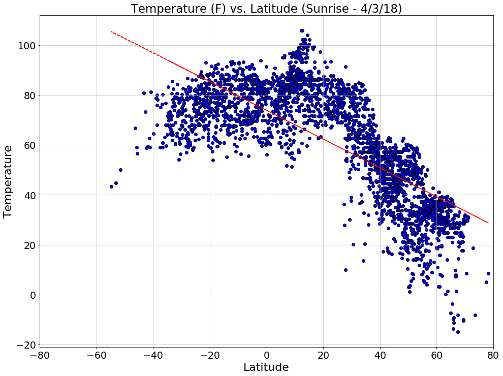
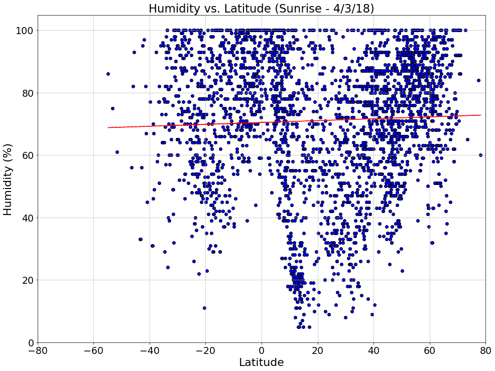

```python
# WeatherPy, by Robert Orr
# Key Takeaways
# 1. Temperature increases as one moves north the equator, 
#    but most cities are in the north so this relationship could symetric (I know it actually is).
# 2. Windspeed seems to increase as latitude increase, and, once again the bias from cities disproportionately 
#    being situated in the norther hemisphere.
# 3. There does not seem to be any discernable relationship in regarding latitude and cloudiness
# 4. Humidity appears to a non-linear relationship with latitude. It is low at the equator, but grows as you move in
#    either direction, and then declines once again when moving towards the poles.
```


```python
# Dependencies
import json
import requests
from citipy import citipy
import csv
import matplotlib.pyplot as plt
import pandas as pd
from random import uniform
import numpy as np
import os
from scipy.stats import linregress
#Key
from config import weather_key
```


```python
#Assign random lat/lng points from possible universe of possibilities
x, y = uniform(-180,180), uniform(-90, 90)
def newpoint():
    return uniform(-180,180), uniform(-90, 90)
coordinates = []
points = (newpoint() for x in range(40000))
for point in points:
    coordinates.append(point)
cities_df = pd.DataFrame(coordinates)
cities_df.columns = ['lat', 'lon']
cities_df['city'] = ''
cities_df['country_code'] = ''
cities_df['city_lat'] = ''
cities_df['city_lon'] = ''
cities_df['city_temperature'] = ''
cities_df['city_humidity'] = ''
cities_df['city_windspeed'] = ''
cities_df['city_clouds'] = ''
cities_df['city_temp_max'] = ''
cities_df['date'] = ''
cities_df['sunrise'] = ''
```


```python
# Match with cities
for (idx,row) in cities_df.iterrows():
    city = citipy.nearest_city(row["lat"],row["lon"])
    country_code = city.country_code
    name = city.city_name
    cities_df.at[idx, 'city'] = name
    cities_df.at[idx, 'country_code'] = country_code
cities_df = cities_df.drop_duplicates('city')
url = "http://api.openweathermap.org/data/2.5/weather?"
cities_df['city'] = cities_df['city'].str.title()
cities_df['country_code'] = cities_df['country_code'].str.upper()
cities_df.head()
```


<div>
<style scoped>
    .dataframe tbody tr th:only-of-type {
        vertical-align: middle;
    }

    .dataframe tbody tr th {
        vertical-align: top;
    }

    .dataframe thead th {
        text-align: right;
    }
</style>
<table border="1" class="dataframe">
  <thead>
    <tr style="text-align: right;">
      <th></th>
      <th>lat</th>
      <th>lon</th>
      <th>city</th>
      <th>country_code</th>
      <th>city_lat</th>
      <th>city_lon</th>
      <th>city_temperature</th>
      <th>city_humidity</th>
      <th>city_windspeed</th>
      <th>city_clouds</th>
      <th>city_temp_max</th>
      <th>date</th>
      <th>sunrise</th>
    </tr>
  </thead>
  <tbody>
    <tr>
      <th>0</th>
      <td>-95.940721</td>
      <td>0.439120</td>
      <td>Hermanus</td>
      <td>ZA</td>
      <td></td>
      <td></td>
      <td></td>
      <td></td>
      <td></td>
      <td></td>
      <td></td>
      <td></td>
      <td></td>
    </tr>
    <tr>
      <th>1</th>
      <td>-8.676211</td>
      <td>22.801352</td>
      <td>Mwene-Ditu</td>
      <td>CD</td>
      <td></td>
      <td></td>
      <td></td>
      <td></td>
      <td></td>
      <td></td>
      <td></td>
      <td></td>
      <td></td>
    </tr>
    <tr>
      <th>2</th>
      <td>69.471457</td>
      <td>-64.495955</td>
      <td>Pangnirtung</td>
      <td>CA</td>
      <td></td>
      <td></td>
      <td></td>
      <td></td>
      <td></td>
      <td></td>
      <td></td>
      <td></td>
      <td></td>
    </tr>
    <tr>
      <th>3</th>
      <td>-147.838324</td>
      <td>12.510842</td>
      <td>Bredasdorp</td>
      <td>ZA</td>
      <td></td>
      <td></td>
      <td></td>
      <td></td>
      <td></td>
      <td></td>
      <td></td>
      <td></td>
      <td></td>
    </tr>
    <tr>
      <th>4</th>
      <td>-6.607505</td>
      <td>-16.562434</td>
      <td>Georgetown</td>
      <td>SH</td>
      <td></td>
      <td></td>
      <td></td>
      <td></td>
      <td></td>
      <td></td>
      <td></td>
      <td></td>
      <td></td>
    </tr>
  </tbody>
</table>
</div>


```python
# Run Loops Querrying the API
# Loop: Establish Exact City Coordinates and the Time of Sunrise
counter = 0
for (idx,row) in cities_df.iterrows():
    try:
        counter += 1
        city = (row.loc['city'])
        country_code = (row.loc['country_code'])
        query_url = (url +'units=imperial'+"&appid=" + weather_key + "&q=" +city+", "+country_code)
        weather_response = requests.get(query_url)
        weather_json = weather_response.json()
        latitude_city= weather_json["coord"]["lat"]
        longitude_city= weather_json["coord"]["lon"]
        sunrise= weather_json["sys"]["sunrise"]
        cities_df.at[idx, 'sunrise']= sunrise= weather_json["sys"]["sunrise"]
        cities_df.at[idx, 'city_lat'] = latitude_city
        cities_df.at[idx, 'city_lon'] = longitude_city
        print(f"Processing Record {counter} Set 1 | {city} \n {query_url}")
    except KeyError:
        pass

#Drop NA values to speed up the second loop
cities_df = cities_df.drop_duplicates(subset=['city', 'country_code'])
cities_df['city_lat'].replace('', np.nan, inplace=True)
cities_df=cities_df.dropna()

#Loop 2: Collect weather data based on specific gathered from Loop 1
counter = 0
for (idx,row) in cities_df.iterrows():
    try:
        counter += 1
        city = (row.loc['city'])
        country_code = (row.loc['country_code'])
        start = (row.loc['sunrise'])
        end = (row.loc['sunrise'])
        end= str(end)
        start= str(start)
        query_url = (url +'units=imperial'+"&start="+start+"&end="+end+ "&appid=" + weather_key + "&q=" +city+", "+country_code)
        weather_response = requests.get(query_url)
        weather_json = weather_response.json()
        temperature = weather_json["main"]["temp"]
        clouds = weather_json["clouds"]['all']
        windspeed = weather_json["wind"]['speed']
        humidity = weather_json["main"]["humidity"]
        date= weather_json["dt"]
        temp_max = weather_json["main"]["temp_max"]
        cities_df.at[idx, 'city_temperature'] = temperature
        cities_df.at[idx, 'city_humidity'] = humidity
        cities_df.at[idx, 'city_clouds'] = clouds
        cities_df.at[idx, 'city_windspeed'] = windspeed
        cities_df.at[idx, 'city_temp_max'] = temp_max
        cities_df.at[idx, 'date'] = date
        print(f"Processing Record {counter} Set 2 | {city} \n {query_url}")
    except KeyError:
        pass
```

    Processing Record 1 Set 1 | Hermanus 
     http://api.openweathermap.org/data/2.5/weather?units=imperial&appid=2fff46cae0837549e79ccf0582b9fce3&q=Hermanus, ZA
    Processing Record 2 Set 1 | Mwene-Ditu 
     http://api.openweathermap.org/data/2.5/weather?units=imperial&appid=2fff46cae0837549e79ccf0582b9fce3&q=Mwene-Ditu, CD
    Processing Record 3 Set 1 | Pangnirtung 
     http://api.openweathermap.org/data/2.5/weather?units=imperial&appid=2fff46cae0837549e79ccf0582b9fce3&q=Pangnirtung, CA
    Processing Record 4 Set 1 | Bredasdorp 
     http://api.openweathermap.org/data/2.5/weather?units=imperial&appid=2fff46cae0837549e79ccf0582b9fce3&q=Bredasdorp, ZA
    Processing Record 5 Set 1 | Georgetown 
     http://api.openweathermap.org/data/2.5/weather?units=imperial&appid=2fff46cae0837549e79ccf0582b9fce3&q=Georgetown, SH
    Processing Record 6 Set 1 | Qaanaaq 
     http://api.openweathermap.org/data/2.5/weather?units=imperial&appid=2fff46cae0837549e79ccf0582b9fce3&q=Qaanaaq, GL
    Processing Record 7 Set 1 | Ushuaia 
     http://api.openweathermap.org/data/2.5/weather?units=imperial&appid=2fff46cae0837549e79ccf0582b9fce3&q=Ushuaia, AR
    Processing Record 8 Set 1 | Dikson 
     http://api.openweathermap.org/data/2.5/weather?units=imperial&appid=2fff46cae0837549e79ccf0582b9fce3&q=Dikson, RU
    Processing Record 9 Set 1 | Mpongwe 
     http://api.openweathermap.org/data/2.5/weather?units=imperial&appid=2fff46cae0837549e79ccf0582b9fce3&q=Mpongwe, ZM
    Processing Record 10 Set 1 | Longyearbyen 
     http://api.openweathermap.org/data/2.5/weather?units=imperial&appid=2fff46cae0837549e79ccf0582b9fce3&q=Longyearbyen, SJ
    Processing Record 11 Set 1 | Ilulissat 
     http://api.openweathermap.org/data/2.5/weather?units=imperial&appid=2fff46cae0837549e79ccf0582b9fce3&q=Ilulissat, GL
    Processing Record 12 Set 1 | Sao Filipe 
     http://api.openweathermap.org/data/2.5/weather?units=imperial&appid=2fff46cae0837549e79ccf0582b9fce3&q=Sao Filipe, CV
    Processing Record 13 Set 1 | Pitimbu 
     http://api.openweathermap.org/data/2.5/weather?units=imperial&appid=2fff46cae0837549e79ccf0582b9fce3&q=Pitimbu, BR
    Processing Record 14 Set 1 | Port Alfred 
     http://api.openweathermap.org/data/2.5/weather?units=imperial&appid=2fff46cae0837549e79ccf0582b9fce3&q=Port Alfred, ZA
    Processing Record 15 Set 1 | Saint-Pierre 
     http://api.openweathermap.org/data/2.5/weather?units=imperial&appid=2fff46cae0837549e79ccf0582b9fce3&q=Saint-Pierre, PM
    Processing Record 16 Set 1 | Sisimiut 
     http://api.openweathermap.org/data/2.5/weather?units=imperial&appid=2fff46cae0837549e79ccf0582b9fce3&q=Sisimiut, GL
    Processing Record 17 Set 1 | Port Elizabeth 
     http://api.openweathermap.org/data/2.5/weather?units=imperial&appid=2fff46cae0837549e79ccf0582b9fce3&q=Port Elizabeth, ZA
    Processing Record 18 Set 1 | Bedesa 
     http://api.openweathermap.org/data/2.5/weather?units=imperial&appid=2fff46cae0837549e79ccf0582b9fce3&q=Bedesa, ET
    Processing Record 19 Set 1 | Tres Arroyos 
     http://api.openweathermap.org/data/2.5/weather?units=imperial&appid=2fff46cae0837549e79ccf0582b9fce3&q=Tres Arroyos, AR
    Processing Record 20 Set 1 | Kruisfontein 
     http://api.openweathermap.org/data/2.5/weather?units=imperial&appid=2fff46cae0837549e79ccf0582b9fce3&q=Kruisfontein, ZA
    Processing Record 21 Set 1 | Jamestown 
     http://api.openweathermap.org/data/2.5/weather?units=imperial&appid=2fff46cae0837549e79ccf0582b9fce3&q=Jamestown, SH
    Processing Record 22 Set 1 | Taltal 
     http://api.openweathermap.org/data/2.5/weather?units=imperial&appid=2fff46cae0837549e79ccf0582b9fce3&q=Taltal, CL
    Processing Record 23 Set 1 | Colares 
     http://api.openweathermap.org/data/2.5/weather?units=imperial&appid=2fff46cae0837549e79ccf0582b9fce3&q=Colares, PT
    Processing Record 24 Set 1 | Upernavik 
     http://api.openweathermap.org/data/2.5/weather?units=imperial&appid=2fff46cae0837549e79ccf0582b9fce3&q=Upernavik, GL
    Processing Record 25 Set 1 | Muros 
     http://api.openweathermap.org/data/2.5/weather?units=imperial&appid=2fff46cae0837549e79ccf0582b9fce3&q=Muros, ES
    Processing Record 26 Set 1 | Mar Del Plata 
     http://api.openweathermap.org/data/2.5/weather?units=imperial&appid=2fff46cae0837549e79ccf0582b9fce3&q=Mar Del Plata, AR
    Processing Record 27 Set 1 | Siuna 
     http://api.openweathermap.org/data/2.5/weather?units=imperial&appid=2fff46cae0837549e79ccf0582b9fce3&q=Siuna, NI
    Processing Record 28 Set 1 | Quatre Cocos 
     http://api.openweathermap.org/data/2.5/weather?units=imperial&appid=2fff46cae0837549e79ccf0582b9fce3&q=Quatre Cocos, MU
    Processing Record 29 Set 1 | Kisangani 
     http://api.openweathermap.org/data/2.5/weather?units=imperial&appid=2fff46cae0837549e79ccf0582b9fce3&q=Kisangani, CD
    Processing Record 30 Set 1 | Punta Arenas 
     http://api.openweathermap.org/data/2.5/weather?units=imperial&appid=2fff46cae0837549e79ccf0582b9fce3&q=Punta Arenas, CL
    Processing Record 31 Set 1 | Taoudenni 
     http://api.openweathermap.org/data/2.5/weather?units=imperial&appid=2fff46cae0837549e79ccf0582b9fce3&q=Taoudenni, ML
    Processing Record 32 Set 1 | Albany 
     http://api.openweathermap.org/data/2.5/weather?units=imperial&appid=2fff46cae0837549e79ccf0582b9fce3&q=Albany, AU
    Processing Record 33 Set 1 | Grand Bank 
     http://api.openweathermap.org/data/2.5/weather?units=imperial&appid=2fff46cae0837549e79ccf0582b9fce3&q=Grand Bank, CA
    Processing Record 34 Set 1 | Cape Town 
     http://api.openweathermap.org/data/2.5/weather?units=imperial&appid=2fff46cae0837549e79ccf0582b9fce3&q=Cape Town, ZA
    Processing Record 35 Set 1 | Narva-Joesuu 
     http://api.openweathermap.org/data/2.5/weather?units=imperial&appid=2fff46cae0837549e79ccf0582b9fce3&q=Narva-Joesuu, EE
    Processing Record 36 Set 1 | Coquimbo 
     http://api.openweathermap.org/data/2.5/weather?units=imperial&appid=2fff46cae0837549e79ccf0582b9fce3&q=Coquimbo, CL
    Processing Record 37 Set 1 | La Tuque 
     http://api.openweathermap.org/data/2.5/weather?units=imperial&appid=2fff46cae0837549e79ccf0582b9fce3&q=La Tuque, CA
    Processing Record 38 Set 1 | Usinsk 
     http://api.openweathermap.org/data/2.5/weather?units=imperial&appid=2fff46cae0837549e79ccf0582b9fce3&q=Usinsk, RU
    Processing Record 39 Set 1 | Mahebourg 
     http://api.openweathermap.org/data/2.5/weather?units=imperial&appid=2fff46cae0837549e79ccf0582b9fce3&q=Mahebourg, MU
    Processing Record 40 Set 1 | Thompson 
     http://api.openweathermap.org/data/2.5/weather?units=imperial&appid=2fff46cae0837549e79ccf0582b9fce3&q=Thompson, CA
    Processing Record 41 Set 1 | Coihaique 
     http://api.openweathermap.org/data/2.5/weather?units=imperial&appid=2fff46cae0837549e79ccf0582b9fce3&q=Coihaique, CL
    Processing Record 42 Set 1 | Lebu 
     http://api.openweathermap.org/data/2.5/weather?units=imperial&appid=2fff46cae0837549e79ccf0582b9fce3&q=Lebu, CL
    Processing Record 43 Set 1 | Hithadhoo 
     http://api.openweathermap.org/data/2.5/weather?units=imperial&appid=2fff46cae0837549e79ccf0582b9fce3&q=Hithadhoo, MV
    Processing Record 44 Set 1 | Saldanha 
     http://api.openweathermap.org/data/2.5/weather?units=imperial&appid=2fff46cae0837549e79ccf0582b9fce3&q=Saldanha, ZA
    Processing Record 45 Set 1 | Kangaatsiaq 
     http://api.openweathermap.org/data/2.5/weather?units=imperial&appid=2fff46cae0837549e79ccf0582b9fce3&q=Kangaatsiaq, GL
    Processing Record 46 Set 1 | Virginia Beach 
     http://api.openweathermap.org/data/2.5/weather?units=imperial&appid=2fff46cae0837549e79ccf0582b9fce3&q=Virginia Beach, US
    Processing Record 47 Set 1 | Canutama 
     http://api.openweathermap.org/data/2.5/weather?units=imperial&appid=2fff46cae0837549e79ccf0582b9fce3&q=Canutama, BR
    Processing Record 48 Set 1 | Floro 
     http://api.openweathermap.org/data/2.5/weather?units=imperial&appid=2fff46cae0837549e79ccf0582b9fce3&q=Floro, NO
    Processing Record 49 Set 1 | Mecca 
     http://api.openweathermap.org/data/2.5/weather?units=imperial&appid=2fff46cae0837549e79ccf0582b9fce3&q=Mecca, SA
    Processing Record 50 Set 1 | Manaure 
     http://api.openweathermap.org/data/2.5/weather?units=imperial&appid=2fff46cae0837549e79ccf0582b9fce3&q=Manaure, CO
    Processing Record 51 Set 1 | Tasiilaq 
     http://api.openweathermap.org/data/2.5/weather?units=imperial&appid=2fff46cae0837549e79ccf0582b9fce3&q=Tasiilaq, GL
    Processing Record 52 Set 1 | Mozarlandia 
     http://api.openweathermap.org/data/2.5/weather?units=imperial&appid=2fff46cae0837549e79ccf0582b9fce3&q=Mozarlandia, BR
    Processing Record 53 Set 1 | Shentala 
     http://api.openweathermap.org/data/2.5/weather?units=imperial&appid=2fff46cae0837549e79ccf0582b9fce3&q=Shentala, RU
    Processing Record 54 Set 1 | Bambous Virieux 
     http://api.openweathermap.org/data/2.5/weather?units=imperial&appid=2fff46cae0837549e79ccf0582b9fce3&q=Bambous Virieux, MU
    Processing Record 55 Set 1 | Vila Velha 
     http://api.openweathermap.org/data/2.5/weather?units=imperial&appid=2fff46cae0837549e79ccf0582b9fce3&q=Vila Velha, BR
    Processing Record 56 Set 1 | Narsaq 
     http://api.openweathermap.org/data/2.5/weather?units=imperial&appid=2fff46cae0837549e79ccf0582b9fce3&q=Narsaq, GL
    Processing Record 57 Set 1 | Sucre 
     http://api.openweathermap.org/data/2.5/weather?units=imperial&appid=2fff46cae0837549e79ccf0582b9fce3&q=Sucre, BO
    Processing Record 58 Set 1 | Ponta Delgada 
     http://api.openweathermap.org/data/2.5/weather?units=imperial&appid=2fff46cae0837549e79ccf0582b9fce3&q=Ponta Delgada, PT
    Processing Record 59 Set 1 | Saint-Augustin 
     http://api.openweathermap.org/data/2.5/weather?units=imperial&appid=2fff46cae0837549e79ccf0582b9fce3&q=Saint-Augustin, CA
    Processing Record 60 Set 1 | Busselton 
     http://api.openweathermap.org/data/2.5/weather?units=imperial&appid=2fff46cae0837549e79ccf0582b9fce3&q=Busselton, AU
    Processing Record 61 Set 1 | Luena 
     http://api.openweathermap.org/data/2.5/weather?units=imperial&appid=2fff46cae0837549e79ccf0582b9fce3&q=Luena, AO
    Processing Record 62 Set 1 | Kroonstad 
     http://api.openweathermap.org/data/2.5/weather?units=imperial&appid=2fff46cae0837549e79ccf0582b9fce3&q=Kroonstad, ZA
    Processing Record 63 Set 1 | Caravelas 
     http://api.openweathermap.org/data/2.5/weather?units=imperial&appid=2fff46cae0837549e79ccf0582b9fce3&q=Caravelas, BR
    Processing Record 64 Set 1 | Klaksvik 
     http://api.openweathermap.org/data/2.5/weather?units=imperial&appid=2fff46cae0837549e79ccf0582b9fce3&q=Klaksvik, FO
    Processing Record 65 Set 1 | Port-Gentil 
     http://api.openweathermap.org/data/2.5/weather?units=imperial&appid=2fff46cae0837549e79ccf0582b9fce3&q=Port-Gentil, GA
    Processing Record 66 Set 1 | Bathsheba 
     http://api.openweathermap.org/data/2.5/weather?units=imperial&appid=2fff46cae0837549e79ccf0582b9fce3&q=Bathsheba, BB
    Processing Record 67 Set 1 | Ilhabela 
     http://api.openweathermap.org/data/2.5/weather?units=imperial&appid=2fff46cae0837549e79ccf0582b9fce3&q=Ilhabela, BR
    Processing Record 68 Set 1 | Walvis Bay 
     http://api.openweathermap.org/data/2.5/weather?units=imperial&appid=2fff46cae0837549e79ccf0582b9fce3&q=Walvis Bay, NA
    Processing Record 69 Set 1 | Salalah 
     http://api.openweathermap.org/data/2.5/weather?units=imperial&appid=2fff46cae0837549e79ccf0582b9fce3&q=Salalah, OM
    Processing Record 70 Set 1 | Torbay 
     http://api.openweathermap.org/data/2.5/weather?units=imperial&appid=2fff46cae0837549e79ccf0582b9fce3&q=Torbay, CA
    Processing Record 71 Set 1 | Wum 
     http://api.openweathermap.org/data/2.5/weather?units=imperial&appid=2fff46cae0837549e79ccf0582b9fce3&q=Wum, CM
    Processing Record 72 Set 1 | Araouane 
     http://api.openweathermap.org/data/2.5/weather?units=imperial&appid=2fff46cae0837549e79ccf0582b9fce3&q=Araouane, ML
    Processing Record 73 Set 1 | Sao Joao Nepomuceno 
     http://api.openweathermap.org/data/2.5/weather?units=imperial&appid=2fff46cae0837549e79ccf0582b9fce3&q=Sao Joao Nepomuceno, BR
    Processing Record 74 Set 1 | Kindia 
     http://api.openweathermap.org/data/2.5/weather?units=imperial&appid=2fff46cae0837549e79ccf0582b9fce3&q=Kindia, GN
    Processing Record 75 Set 1 | Grand-Santi 
     http://api.openweathermap.org/data/2.5/weather?units=imperial&appid=2fff46cae0837549e79ccf0582b9fce3&q=Grand-Santi, GF
    Processing Record 76 Set 1 | Nanortalik 
     http://api.openweathermap.org/data/2.5/weather?units=imperial&appid=2fff46cae0837549e79ccf0582b9fce3&q=Nanortalik, GL
    Processing Record 77 Set 1 | Praia 
     http://api.openweathermap.org/data/2.5/weather?units=imperial&appid=2fff46cae0837549e79ccf0582b9fce3&q=Praia, CV
    Processing Record 78 Set 1 | Victoria 
     http://api.openweathermap.org/data/2.5/weather?units=imperial&appid=2fff46cae0837549e79ccf0582b9fce3&q=Victoria, SC
    Processing Record 79 Set 1 | Karlstadt 
     http://api.openweathermap.org/data/2.5/weather?units=imperial&appid=2fff46cae0837549e79ccf0582b9fce3&q=Karlstadt, DE
    Processing Record 80 Set 1 | East London 
     http://api.openweathermap.org/data/2.5/weather?units=imperial&appid=2fff46cae0837549e79ccf0582b9fce3&q=East London, ZA
    Processing Record 81 Set 1 | Hit 
     http://api.openweathermap.org/data/2.5/weather?units=imperial&appid=2fff46cae0837549e79ccf0582b9fce3&q=Hit, IQ
    Processing Record 82 Set 1 | Alta Floresta 
     http://api.openweathermap.org/data/2.5/weather?units=imperial&appid=2fff46cae0837549e79ccf0582b9fce3&q=Alta Floresta, BR
    Processing Record 83 Set 1 | Taucha 
     http://api.openweathermap.org/data/2.5/weather?units=imperial&appid=2fff46cae0837549e79ccf0582b9fce3&q=Taucha, DE
    Processing Record 84 Set 1 | Santa Maria 
     http://api.openweathermap.org/data/2.5/weather?units=imperial&appid=2fff46cae0837549e79ccf0582b9fce3&q=Santa Maria, CV
    Processing Record 85 Set 1 | Puerto Ayora 
     http://api.openweathermap.org/data/2.5/weather?units=imperial&appid=2fff46cae0837549e79ccf0582b9fce3&q=Puerto Ayora, EC
    Processing Record 86 Set 1 | Kissidougou 
     http://api.openweathermap.org/data/2.5/weather?units=imperial&appid=2fff46cae0837549e79ccf0582b9fce3&q=Kissidougou, GN
    Processing Record 87 Set 1 | Tromso 
     http://api.openweathermap.org/data/2.5/weather?units=imperial&appid=2fff46cae0837549e79ccf0582b9fce3&q=Tromso, NO
    Processing Record 88 Set 1 | General Roca 
     http://api.openweathermap.org/data/2.5/weather?units=imperial&appid=2fff46cae0837549e79ccf0582b9fce3&q=General Roca, AR
    Processing Record 89 Set 1 | Jacmel 
     http://api.openweathermap.org/data/2.5/weather?units=imperial&appid=2fff46cae0837549e79ccf0582b9fce3&q=Jacmel, HT
    Processing Record 90 Set 1 | Watsa 
     http://api.openweathermap.org/data/2.5/weather?units=imperial&appid=2fff46cae0837549e79ccf0582b9fce3&q=Watsa, CD
    Processing Record 91 Set 1 | Axim 
     http://api.openweathermap.org/data/2.5/weather?units=imperial&appid=2fff46cae0837549e79ccf0582b9fce3&q=Axim, GH
    Processing Record 92 Set 1 | Mahajanga 
     http://api.openweathermap.org/data/2.5/weather?units=imperial&appid=2fff46cae0837549e79ccf0582b9fce3&q=Mahajanga, MG
    Processing Record 93 Set 1 | Saint George 
     http://api.openweathermap.org/data/2.5/weather?units=imperial&appid=2fff46cae0837549e79ccf0582b9fce3&q=Saint George, BM
    Processing Record 94 Set 1 | Carnarvon 
     http://api.openweathermap.org/data/2.5/weather?units=imperial&appid=2fff46cae0837549e79ccf0582b9fce3&q=Carnarvon, AU
    Processing Record 95 Set 1 | Ostrovnoy 
     http://api.openweathermap.org/data/2.5/weather?units=imperial&appid=2fff46cae0837549e79ccf0582b9fce3&q=Ostrovnoy, RU
    Processing Record 96 Set 1 | Los Llanos De Aridane 
     http://api.openweathermap.org/data/2.5/weather?units=imperial&appid=2fff46cae0837549e79ccf0582b9fce3&q=Los Llanos De Aridane, ES
    Processing Record 97 Set 1 | Constitucion 
     http://api.openweathermap.org/data/2.5/weather?units=imperial&appid=2fff46cae0837549e79ccf0582b9fce3&q=Constitucion, CL
    Processing Record 98 Set 1 | Souillac 
     http://api.openweathermap.org/data/2.5/weather?units=imperial&appid=2fff46cae0837549e79ccf0582b9fce3&q=Souillac, MU
    Processing Record 99 Set 1 | Clyde River 
     http://api.openweathermap.org/data/2.5/weather?units=imperial&appid=2fff46cae0837549e79ccf0582b9fce3&q=Clyde River, CA
    Processing Record 100 Set 1 | Jos 
     http://api.openweathermap.org/data/2.5/weather?units=imperial&appid=2fff46cae0837549e79ccf0582b9fce3&q=Jos, NG
    Processing Record 101 Set 1 | Touros 
     http://api.openweathermap.org/data/2.5/weather?units=imperial&appid=2fff46cae0837549e79ccf0582b9fce3&q=Touros, BR
    Processing Record 102 Set 1 | Buraydah 
     http://api.openweathermap.org/data/2.5/weather?units=imperial&appid=2fff46cae0837549e79ccf0582b9fce3&q=Buraydah, SA
    Processing Record 103 Set 1 | Saint-Philippe 
     http://api.openweathermap.org/data/2.5/weather?units=imperial&appid=2fff46cae0837549e79ccf0582b9fce3&q=Saint-Philippe, RE
    Processing Record 104 Set 1 | Norrtalje 
     http://api.openweathermap.org/data/2.5/weather?units=imperial&appid=2fff46cae0837549e79ccf0582b9fce3&q=Norrtalje, SE
    Processing Record 105 Set 1 | Morros 
     http://api.openweathermap.org/data/2.5/weather?units=imperial&appid=2fff46cae0837549e79ccf0582b9fce3&q=Morros, BR
    Processing Record 106 Set 1 | Saurimo 
     http://api.openweathermap.org/data/2.5/weather?units=imperial&appid=2fff46cae0837549e79ccf0582b9fce3&q=Saurimo, AO
    Processing Record 107 Set 1 | Sao Joao Da Barra 
     http://api.openweathermap.org/data/2.5/weather?units=imperial&appid=2fff46cae0837549e79ccf0582b9fce3&q=Sao Joao Da Barra, BR
    Processing Record 108 Set 1 | Calama 
     http://api.openweathermap.org/data/2.5/weather?units=imperial&appid=2fff46cae0837549e79ccf0582b9fce3&q=Calama, CL
    Processing Record 109 Set 1 | Cidreira 
     http://api.openweathermap.org/data/2.5/weather?units=imperial&appid=2fff46cae0837549e79ccf0582b9fce3&q=Cidreira, BR
    Processing Record 110 Set 1 | Bonavista 
     http://api.openweathermap.org/data/2.5/weather?units=imperial&appid=2fff46cae0837549e79ccf0582b9fce3&q=Bonavista, CA
    Processing Record 111 Set 1 | Tazovskiy 
     http://api.openweathermap.org/data/2.5/weather?units=imperial&appid=2fff46cae0837549e79ccf0582b9fce3&q=Tazovskiy, RU
    Processing Record 112 Set 1 | Peterhead 
     http://api.openweathermap.org/data/2.5/weather?units=imperial&appid=2fff46cae0837549e79ccf0582b9fce3&q=Peterhead, GB
    Processing Record 113 Set 1 | Sfantu Gheorghe 
     http://api.openweathermap.org/data/2.5/weather?units=imperial&appid=2fff46cae0837549e79ccf0582b9fce3&q=Sfantu Gheorghe, RO
    Processing Record 114 Set 1 | Umm Lajj 
     http://api.openweathermap.org/data/2.5/weather?units=imperial&appid=2fff46cae0837549e79ccf0582b9fce3&q=Umm Lajj, SA
    Processing Record 115 Set 1 | Sur 
     http://api.openweathermap.org/data/2.5/weather?units=imperial&appid=2fff46cae0837549e79ccf0582b9fce3&q=Sur, OM
    Processing Record 116 Set 1 | Bubaque 
     http://api.openweathermap.org/data/2.5/weather?units=imperial&appid=2fff46cae0837549e79ccf0582b9fce3&q=Bubaque, GW
    Processing Record 117 Set 1 | Cradock 
     http://api.openweathermap.org/data/2.5/weather?units=imperial&appid=2fff46cae0837549e79ccf0582b9fce3&q=Cradock, ZA
    Processing Record 118 Set 1 | Aksu 
     http://api.openweathermap.org/data/2.5/weather?units=imperial&appid=2fff46cae0837549e79ccf0582b9fce3&q=Aksu, KZ
    Processing Record 119 Set 1 | Marystown 
     http://api.openweathermap.org/data/2.5/weather?units=imperial&appid=2fff46cae0837549e79ccf0582b9fce3&q=Marystown, CA
    Processing Record 120 Set 1 | Narsimhapur 
     http://api.openweathermap.org/data/2.5/weather?units=imperial&appid=2fff46cae0837549e79ccf0582b9fce3&q=Narsimhapur, IN
    Processing Record 121 Set 1 | Ponta Do Sol 
     http://api.openweathermap.org/data/2.5/weather?units=imperial&appid=2fff46cae0837549e79ccf0582b9fce3&q=Ponta Do Sol, CV
    Processing Record 122 Set 1 | Talnakh 
     http://api.openweathermap.org/data/2.5/weather?units=imperial&appid=2fff46cae0837549e79ccf0582b9fce3&q=Talnakh, RU
    Processing Record 123 Set 1 | Rodrigues Alves 
     http://api.openweathermap.org/data/2.5/weather?units=imperial&appid=2fff46cae0837549e79ccf0582b9fce3&q=Rodrigues Alves, BR
    Processing Record 124 Set 1 | Nouadhibou 
     http://api.openweathermap.org/data/2.5/weather?units=imperial&appid=2fff46cae0837549e79ccf0582b9fce3&q=Nouadhibou, MR
    Processing Record 125 Set 1 | Blyth 
     http://api.openweathermap.org/data/2.5/weather?units=imperial&appid=2fff46cae0837549e79ccf0582b9fce3&q=Blyth, GB
    Processing Record 126 Set 1 | Lubumbashi 
     http://api.openweathermap.org/data/2.5/weather?units=imperial&appid=2fff46cae0837549e79ccf0582b9fce3&q=Lubumbashi, CD
    Processing Record 127 Set 1 | Bilma 
     http://api.openweathermap.org/data/2.5/weather?units=imperial&appid=2fff46cae0837549e79ccf0582b9fce3&q=Bilma, NE
    Processing Record 128 Set 1 | Chuy 
     http://api.openweathermap.org/data/2.5/weather?units=imperial&appid=2fff46cae0837549e79ccf0582b9fce3&q=Chuy, UY
    Processing Record 129 Set 1 | Fougamou 
     http://api.openweathermap.org/data/2.5/weather?units=imperial&appid=2fff46cae0837549e79ccf0582b9fce3&q=Fougamou, GA
    Processing Record 130 Set 1 | Santo Estevao 
     http://api.openweathermap.org/data/2.5/weather?units=imperial&appid=2fff46cae0837549e79ccf0582b9fce3&q=Santo Estevao, BR
    Processing Record 131 Set 1 | Dalbandin 
     http://api.openweathermap.org/data/2.5/weather?units=imperial&appid=2fff46cae0837549e79ccf0582b9fce3&q=Dalbandin, PK
    Processing Record 132 Set 1 | Macusani 
     http://api.openweathermap.org/data/2.5/weather?units=imperial&appid=2fff46cae0837549e79ccf0582b9fce3&q=Macusani, PE
    Processing Record 133 Set 1 | Lagoa 
     http://api.openweathermap.org/data/2.5/weather?units=imperial&appid=2fff46cae0837549e79ccf0582b9fce3&q=Lagoa, PT
    Processing Record 134 Set 1 | Vardo 
     http://api.openweathermap.org/data/2.5/weather?units=imperial&appid=2fff46cae0837549e79ccf0582b9fce3&q=Vardo, NO
    Processing Record 135 Set 1 | Bonthe 
     http://api.openweathermap.org/data/2.5/weather?units=imperial&appid=2fff46cae0837549e79ccf0582b9fce3&q=Bonthe, SL
    Processing Record 136 Set 1 | Borovoy 
     http://api.openweathermap.org/data/2.5/weather?units=imperial&appid=2fff46cae0837549e79ccf0582b9fce3&q=Borovoy, RU
    Processing Record 137 Set 1 | Thinadhoo 
     http://api.openweathermap.org/data/2.5/weather?units=imperial&appid=2fff46cae0837549e79ccf0582b9fce3&q=Thinadhoo, MV
    Processing Record 138 Set 1 | Kasongo-Lunda 
     http://api.openweathermap.org/data/2.5/weather?units=imperial&appid=2fff46cae0837549e79ccf0582b9fce3&q=Kasongo-Lunda, CD
    Processing Record 139 Set 1 | Hofn 
     http://api.openweathermap.org/data/2.5/weather?units=imperial&appid=2fff46cae0837549e79ccf0582b9fce3&q=Hofn, IS
    Processing Record 140 Set 1 | Kosh-Agach 
     http://api.openweathermap.org/data/2.5/weather?units=imperial&appid=2fff46cae0837549e79ccf0582b9fce3&q=Kosh-Agach, RU
    Processing Record 141 Set 1 | Arraial Do Cabo 
     http://api.openweathermap.org/data/2.5/weather?units=imperial&appid=2fff46cae0837549e79ccf0582b9fce3&q=Arraial Do Cabo, BR
    Processing Record 142 Set 1 | Baijiantan 
     http://api.openweathermap.org/data/2.5/weather?units=imperial&appid=2fff46cae0837549e79ccf0582b9fce3&q=Baijiantan, CN
    Processing Record 143 Set 1 | Iqaluit 
     http://api.openweathermap.org/data/2.5/weather?units=imperial&appid=2fff46cae0837549e79ccf0582b9fce3&q=Iqaluit, CA
    Processing Record 144 Set 1 | Wattegama 
     http://api.openweathermap.org/data/2.5/weather?units=imperial&appid=2fff46cae0837549e79ccf0582b9fce3&q=Wattegama, LK
    Processing Record 145 Set 1 | Rondonopolis 
     http://api.openweathermap.org/data/2.5/weather?units=imperial&appid=2fff46cae0837549e79ccf0582b9fce3&q=Rondonopolis, BR
    Processing Record 146 Set 1 | Bajil 
     http://api.openweathermap.org/data/2.5/weather?units=imperial&appid=2fff46cae0837549e79ccf0582b9fce3&q=Bajil, YE
    Processing Record 147 Set 1 | Stornoway 
     http://api.openweathermap.org/data/2.5/weather?units=imperial&appid=2fff46cae0837549e79ccf0582b9fce3&q=Stornoway, GB
    Processing Record 148 Set 1 | Dhidhdhoo 
     http://api.openweathermap.org/data/2.5/weather?units=imperial&appid=2fff46cae0837549e79ccf0582b9fce3&q=Dhidhdhoo, MV
    Processing Record 149 Set 1 | Hamilton 
     http://api.openweathermap.org/data/2.5/weather?units=imperial&appid=2fff46cae0837549e79ccf0582b9fce3&q=Hamilton, BM
    Processing Record 150 Set 1 | Marechal Deodoro 
     http://api.openweathermap.org/data/2.5/weather?units=imperial&appid=2fff46cae0837549e79ccf0582b9fce3&q=Marechal Deodoro, BR
    Processing Record 151 Set 1 | Lerwick 
     http://api.openweathermap.org/data/2.5/weather?units=imperial&appid=2fff46cae0837549e79ccf0582b9fce3&q=Lerwick, GB
    Processing Record 152 Set 1 | Hualmay 
     http://api.openweathermap.org/data/2.5/weather?units=imperial&appid=2fff46cae0837549e79ccf0582b9fce3&q=Hualmay, PE
    Processing Record 153 Set 1 | Oruro 
     http://api.openweathermap.org/data/2.5/weather?units=imperial&appid=2fff46cae0837549e79ccf0582b9fce3&q=Oruro, BO
    Processing Record 154 Set 1 | Qandala 
     http://api.openweathermap.org/data/2.5/weather?units=imperial&appid=2fff46cae0837549e79ccf0582b9fce3&q=Qandala, SO
    Processing Record 155 Set 1 | Imbituba 
     http://api.openweathermap.org/data/2.5/weather?units=imperial&appid=2fff46cae0837549e79ccf0582b9fce3&q=Imbituba, BR
    Processing Record 156 Set 1 | Belyy Yar 
     http://api.openweathermap.org/data/2.5/weather?units=imperial&appid=2fff46cae0837549e79ccf0582b9fce3&q=Belyy Yar, RU
    Processing Record 157 Set 1 | Joshimath 
     http://api.openweathermap.org/data/2.5/weather?units=imperial&appid=2fff46cae0837549e79ccf0582b9fce3&q=Joshimath, IN
    Processing Record 158 Set 1 | Aksum 
     http://api.openweathermap.org/data/2.5/weather?units=imperial&appid=2fff46cae0837549e79ccf0582b9fce3&q=Aksum, ET
    Processing Record 159 Set 1 | Zheleznogorsk 
     http://api.openweathermap.org/data/2.5/weather?units=imperial&appid=2fff46cae0837549e79ccf0582b9fce3&q=Zheleznogorsk, RU
    Processing Record 160 Set 1 | Betul 
     http://api.openweathermap.org/data/2.5/weather?units=imperial&appid=2fff46cae0837549e79ccf0582b9fce3&q=Betul, IN
    Processing Record 161 Set 1 | San Juan 
     http://api.openweathermap.org/data/2.5/weather?units=imperial&appid=2fff46cae0837549e79ccf0582b9fce3&q=San Juan, US
    Processing Record 162 Set 1 | Sorland 
     http://api.openweathermap.org/data/2.5/weather?units=imperial&appid=2fff46cae0837549e79ccf0582b9fce3&q=Sorland, NO
    Processing Record 163 Set 1 | Rwamagana 
     http://api.openweathermap.org/data/2.5/weather?units=imperial&appid=2fff46cae0837549e79ccf0582b9fce3&q=Rwamagana, RW
    Processing Record 164 Set 1 | Key West 
     http://api.openweathermap.org/data/2.5/weather?units=imperial&appid=2fff46cae0837549e79ccf0582b9fce3&q=Key West, US
    Processing Record 165 Set 1 | Pokaran 
     http://api.openweathermap.org/data/2.5/weather?units=imperial&appid=2fff46cae0837549e79ccf0582b9fce3&q=Pokaran, IN
    Processing Record 166 Set 1 | Arlit 
     http://api.openweathermap.org/data/2.5/weather?units=imperial&appid=2fff46cae0837549e79ccf0582b9fce3&q=Arlit, NE
    Processing Record 167 Set 1 | Dubai 
     http://api.openweathermap.org/data/2.5/weather?units=imperial&appid=2fff46cae0837549e79ccf0582b9fce3&q=Dubai, AE
    Processing Record 168 Set 1 | Birao 
     http://api.openweathermap.org/data/2.5/weather?units=imperial&appid=2fff46cae0837549e79ccf0582b9fce3&q=Birao, CF
    Processing Record 169 Set 1 | Ancud 
     http://api.openweathermap.org/data/2.5/weather?units=imperial&appid=2fff46cae0837549e79ccf0582b9fce3&q=Ancud, CL
    Processing Record 170 Set 1 | Luderitz 
     http://api.openweathermap.org/data/2.5/weather?units=imperial&appid=2fff46cae0837549e79ccf0582b9fce3&q=Luderitz, NA
    Processing Record 171 Set 1 | Trinidad 
     http://api.openweathermap.org/data/2.5/weather?units=imperial&appid=2fff46cae0837549e79ccf0582b9fce3&q=Trinidad, CU
    Processing Record 172 Set 1 | Yarada 
     http://api.openweathermap.org/data/2.5/weather?units=imperial&appid=2fff46cae0837549e79ccf0582b9fce3&q=Yarada, IN
    Processing Record 173 Set 1 | Saint-Prosper 
     http://api.openweathermap.org/data/2.5/weather?units=imperial&appid=2fff46cae0837549e79ccf0582b9fce3&q=Saint-Prosper, CA
    Processing Record 174 Set 1 | Sehithwa 
     http://api.openweathermap.org/data/2.5/weather?units=imperial&appid=2fff46cae0837549e79ccf0582b9fce3&q=Sehithwa, BW
    Processing Record 175 Set 1 | Sheltozero 
     http://api.openweathermap.org/data/2.5/weather?units=imperial&appid=2fff46cae0837549e79ccf0582b9fce3&q=Sheltozero, RU
    Processing Record 176 Set 1 | Termoli 
     http://api.openweathermap.org/data/2.5/weather?units=imperial&appid=2fff46cae0837549e79ccf0582b9fce3&q=Termoli, IT
    Processing Record 177 Set 1 | Rovaniemi 
     http://api.openweathermap.org/data/2.5/weather?units=imperial&appid=2fff46cae0837549e79ccf0582b9fce3&q=Rovaniemi, FI
    Processing Record 178 Set 1 | Aquiraz 
     http://api.openweathermap.org/data/2.5/weather?units=imperial&appid=2fff46cae0837549e79ccf0582b9fce3&q=Aquiraz, BR


    ---------------------------------------------------------------------------

    RemoteDisconnected                        Traceback (most recent call last)

    /anaconda3/lib/python3.6/site-packages/requests/packages/urllib3/connectionpool.py in urlopen(self, method, url, body, headers, retries, redirect, assert_same_host, timeout, pool_timeout, release_conn, chunked, **response_kw)
        593                                                   body=body, headers=headers,
    --> 594                                                   chunked=chunked)
        595 


    /anaconda3/lib/python3.6/site-packages/requests/packages/urllib3/connectionpool.py in _make_request(self, conn, method, url, timeout, chunked, **httplib_request_kw)
        390                     # otherwise it looks like a programming error was the cause.
    --> 391                     six.raise_from(e, None)
        392         except (SocketTimeout, BaseSSLError, SocketError) as e:


    /anaconda3/lib/python3.6/site-packages/requests/packages/urllib3/packages/six.py in raise_from(value, from_value)


    /anaconda3/lib/python3.6/site-packages/requests/packages/urllib3/connectionpool.py in _make_request(self, conn, method, url, timeout, chunked, **httplib_request_kw)
        386                 try:
    --> 387                     httplib_response = conn.getresponse()
        388                 except Exception as e:


    /anaconda3/lib/python3.6/http/client.py in getresponse(self)
       1330             try:
    -> 1331                 response.begin()
       1332             except ConnectionError:


    /anaconda3/lib/python3.6/http/client.py in begin(self)
        296         while True:
    --> 297             version, status, reason = self._read_status()
        298             if status != CONTINUE:


    /anaconda3/lib/python3.6/http/client.py in _read_status(self)
        265             # sending a valid response.
    --> 266             raise RemoteDisconnected("Remote end closed connection without"
        267                                      " response")


    RemoteDisconnected: Remote end closed connection without response

    
    During handling of the above exception, another exception occurred:


    MaxRetryError                             Traceback (most recent call last)

    /anaconda3/lib/python3.6/site-packages/requests/adapters.py in send(self, request, stream, timeout, verify, cert, proxies)
        422                     retries=self.max_retries,
    --> 423                     timeout=timeout
        424                 )


    /anaconda3/lib/python3.6/site-packages/requests/packages/urllib3/connectionpool.py in urlopen(self, method, url, body, headers, retries, redirect, assert_same_host, timeout, pool_timeout, release_conn, chunked, **response_kw)
        642             retries = retries.increment(method, url, error=e, _pool=self,
    --> 643                                         _stacktrace=sys.exc_info()[2])
        644             retries.sleep()


    /anaconda3/lib/python3.6/site-packages/requests/packages/urllib3/util/retry.py in increment(self, method, url, response, error, _pool, _stacktrace)
        362         if new_retry.is_exhausted():
    --> 363             raise MaxRetryError(_pool, url, error or ResponseError(cause))
        364 


    MaxRetryError: HTTPConnectionPool(host='127.0.0.1', port=7769): Max retries exceeded with url: http://api.openweathermap.org/data/2.5/weather?units=imperial&appid=2fff46cae0837549e79ccf0582b9fce3&q=Sao%20Jose%20Da%20Coroa%20Grande,%20BR (Caused by ProxyError('Cannot connect to proxy.', RemoteDisconnected('Remote end closed connection without response',)))

    
    During handling of the above exception, another exception occurred:


    ProxyError                                Traceback (most recent call last)

    <ipython-input-50-825127eb9498> in <module>()
          7         country_code = (row.loc['country_code'])
          8         query_url = (url +'units=imperial'+"&appid=" + weather_key + "&q=" +city+", "+country_code)
    ----> 9         weather_response = requests.get(query_url)
         10         weather_json = weather_response.json()
         11         latitude_city= weather_json["coord"]["lat"]


    /anaconda3/lib/python3.6/site-packages/requests/api.py in get(url, params, **kwargs)
         68 
         69     kwargs.setdefault('allow_redirects', True)
    ---> 70     return request('get', url, params=params, **kwargs)
         71 
         72 


    /anaconda3/lib/python3.6/site-packages/requests/api.py in request(method, url, **kwargs)
         54     # cases, and look like a memory leak in others.
         55     with sessions.Session() as session:
    ---> 56         return session.request(method=method, url=url, **kwargs)
         57 
         58 


    /anaconda3/lib/python3.6/site-packages/requests/sessions.py in request(self, method, url, params, data, headers, cookies, files, auth, timeout, allow_redirects, proxies, hooks, stream, verify, cert, json)
        486         }
        487         send_kwargs.update(settings)
    --> 488         resp = self.send(prep, **send_kwargs)
        489 
        490         return resp


    /anaconda3/lib/python3.6/site-packages/requests/sessions.py in send(self, request, **kwargs)
        607 
        608         # Send the request
    --> 609         r = adapter.send(request, **kwargs)
        610 
        611         # Total elapsed time of the request (approximately)


    /anaconda3/lib/python3.6/site-packages/requests/adapters.py in send(self, request, stream, timeout, verify, cert, proxies)
        483 
        484             if isinstance(e.reason, _ProxyError):
    --> 485                 raise ProxyError(e, request=request)
        486 
        487             raise ConnectionError(e, request=request)


    ProxyError: HTTPConnectionPool(host='127.0.0.1', port=7769): Max retries exceeded with url: http://api.openweathermap.org/data/2.5/weather?units=imperial&appid=2fff46cae0837549e79ccf0582b9fce3&q=Sao%20Jose%20Da%20Coroa%20Grande,%20BR (Caused by ProxyError('Cannot connect to proxy.', RemoteDisconnected('Remote end closed connection without response',)))


```python
# Count numb of Entries (Should be less than inital) and prepare numeric values for analyses 
cities_df['city_lon'].replace('', np.nan, inplace=True)
cities_df['city_humidity'].replace('', np.nan, inplace=True)
cities_df['city_temperature'].replace('', np.nan, inplace=True)
cities_df['city_windspeed'].replace('', np.nan, inplace=True)
cities_df['city_clouds'].replace('', np.nan, inplace=True)
cities_df['city_temp_max'].replace('', np.nan, inplace=True)
cities_df=cities_df.dropna()

print(cities_df.count())
```

    lat                 3244
    lon                 3244
    city                3244
    country_code        3244
    city_lat            3244
    city_lon            3244
    city_temperature    3244
    city_humidity       3244
    city_windspeed      3244
    city_clouds         3244
    city_temp_max       3244
    date                3244
    sunrise             3244
    dtype: int64


```python
# Save data to return to analyses without running the API loops again.
cities_df.to_csv('../Resources/city_weather_stats.csv')
city_stats=cities_df.copy()

#Uncheck below line to read back in previously saved data.
#city_stats = pd.read_csv('/Users/rorr/PythonStuff/Resources/city_weather_stats.csv')

#View Head
city_stats.head()
```


<div>
<style scoped>
    .dataframe tbody tr th:only-of-type {
        vertical-align: middle;
    }

    .dataframe tbody tr th {
        vertical-align: top;
    }

    .dataframe thead th {
        text-align: right;
    }
</style>
<table border="1" class="dataframe">
  <thead>
    <tr style="text-align: right;">
      <th></th>
      <th>lat</th>
      <th>lon</th>
      <th>city</th>
      <th>country_code</th>
      <th>city_lat</th>
      <th>city_lon</th>
      <th>city_temperature</th>
      <th>city_humidity</th>
      <th>city_windspeed</th>
      <th>city_clouds</th>
      <th>city_temp_max</th>
      <th>date</th>
      <th>sunrise</th>
    </tr>
  </thead>
  <tbody>
    <tr>
      <th>0</th>
      <td>-95.940721</td>
      <td>0.439120</td>
      <td>Hermanus</td>
      <td>ZA</td>
      <td>-34.42</td>
      <td>19.24</td>
      <td>67.34</td>
      <td>69</td>
      <td>5.28</td>
      <td>8</td>
      <td>67.34</td>
      <td>1522777172</td>
      <td>1522731446</td>
    </tr>
    <tr>
      <th>1</th>
      <td>-8.676211</td>
      <td>22.801352</td>
      <td>Mwene-Ditu</td>
      <td>CD</td>
      <td>-7.01</td>
      <td>23.45</td>
      <td>68.24</td>
      <td>93</td>
      <td>3.94</td>
      <td>92</td>
      <td>68.24</td>
      <td>1522777181</td>
      <td>1522729722</td>
    </tr>
    <tr>
      <th>2</th>
      <td>69.471457</td>
      <td>-64.495955</td>
      <td>Pangnirtung</td>
      <td>CA</td>
      <td>66.15</td>
      <td>-65.72</td>
      <td>30.20</td>
      <td>63</td>
      <td>8.05</td>
      <td>75</td>
      <td>30.20</td>
      <td>1522774800</td>
      <td>1522747545</td>
    </tr>
    <tr>
      <th>3</th>
      <td>-147.838324</td>
      <td>12.510842</td>
      <td>Bredasdorp</td>
      <td>ZA</td>
      <td>-34.53</td>
      <td>20.04</td>
      <td>69.80</td>
      <td>77</td>
      <td>9.17</td>
      <td>44</td>
      <td>69.80</td>
      <td>1522774800</td>
      <td>1522731258</td>
    </tr>
    <tr>
      <th>4</th>
      <td>-6.607505</td>
      <td>-16.562434</td>
      <td>Georgetown</td>
      <td>SH</td>
      <td>-7.93</td>
      <td>-14.42</td>
      <td>79.94</td>
      <td>100</td>
      <td>11.77</td>
      <td>8</td>
      <td>79.94</td>
      <td>1522777055</td>
      <td>1522738832</td>
    </tr>
  </tbody>
</table>
</div>


```python
#1. Temperature (F) vs. Latitude
(slope, intercept, _, _, _) = linregress(city_stats['city_lat'], city_stats['city_temperature'])
fit = slope * city_stats['city_lat'] + intercept
plt.rc('figure', figsize=(16, 12))
plt.rcParams.update({'font.size': 19})
plt.scatter(city_stats['city_lat'], city_stats['city_temperature'], marker="o", edgecolors="black"
, color='blue')
plt.title("Temperature (F) vs. Latitude (Sunrise - 4/3/18)")
plt.grid(alpha=.75)
plt.xlim(-80, 80)
plt.xlabel("Latitude", fontsize=22)
plt.ylabel("Temperature", fontsize=22)
plt.plot(city_stats['city_lat'], fit, 'r--')
plt.savefig('Temperature.png')
plt.show()
```


```python
#2. Humidity (%) vs. Latitude
plt.rc('figure', figsize=(16, 12))
plt.rcParams.update({'font.size': 19})
plt.scatter(city_stats['city_lat'], city_stats['city_humidity'], marker="o", edgecolors="black"
, color='blue')
plt.title("Humidity vs. Latitude (Sunrise - 4/3/18)")
plt.grid(alpha=.75)
plt.xlabel("Latitude", fontsize=22)
plt.ylabel("Humidity (%)", fontsize=22)
plt.xlim(-80, 80)
plt.ylim(0,)
(slope, intercept, _, _, _) = linregress(city_stats['city_lat'], city_stats['city_humidity'])
fit = slope * city_stats['city_lat'] + intercept
plt.plot(city_stats['city_lat'], fit, 'r--')
plt.savefig('Humidity.png')
plt.show()
```





```python
#3. Cloudiness (%) vs. Latitude
plt.rc('figure', figsize=(16, 12))
plt.rcParams.update({'font.size': 19})
plt.scatter(city_stats['city_lat'], city_stats['city_clouds'], marker="o", edgecolors="black", color='blue')
plt.title("Cloudiness vs. Latitude (Sunrise - 4/3/18)")
plt.grid(alpha=.75)
plt.xlabel("Latitude", fontsize=22)
plt.ylabel("Cloudiness (%)", fontsize=22)
plt.xlim(-80, 80)
plt.ylim(0,)
(slope, intercept, _, _, _) = linregress(city_stats['city_lat'], city_stats['city_clouds'])
fit = slope * city_stats['city_lat'] + intercept
plt.plot(city_stats['city_lat'], fit, 'r--')
plt.savefig('Clouds.png')
plt.show()
```





```python
#4. Wind Speed (mph) vs. Latitude
plt.rc('figure', figsize=(16, 12))
plt.rcParams.update({'font.size': 19})
plt.scatter(city_stats['city_lat'], city_stats['city_windspeed'], marker="o", edgecolors="black"
, color='blue')
plt.title("Wind Speed (MPH) vs. Latitude (Sunrise - 4/3/18)")
plt.grid(alpha=.75)
plt.xlabel("Latitude", fontsize=22)
plt.ylabel("Wind Speed (MPH)", fontsize=22)
plt.xlim(-80, 80)
plt.ylim(0,)
(slope, intercept, _, _, _) = linregress(city_stats['city_lat'], city_stats['city_windspeed'])
fit = slope * city_stats['city_lat'] + intercept
plt.plot(city_stats['city_lat'], fit, 'r--')
plt.savefig('Wind-Speed.png')
plt.show()

```


